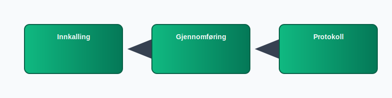

---
title: "Hva er et styremøte? Guide til Møter, Protokoller og Prosesser"
meta_title: "Hva er et styremøte? Guide til Møter, Protokoller og Prosesser"
meta_description: 'Et **styremøte** er det formelle møtet der styrets medlemmer samles for å fatte beslutninger, følge opp selskapets strategi og sikre lovpålagt **internkont...'
slug: hva-er-et-styremote
type: blog
layout: pages/single
---

Et **styremøte** er det formelle møtet der styrets medlemmer samles for å fatte beslutninger, følge opp selskapets strategi og sikre lovpålagt **internkontroll** i et [styre](/blogs/regnskap/hva-er-styre "Hva er Styre? Ansvar, Rolle og Oppgaver i Aksjeselskap").

*Se også: [Hva er et styremedlem?](/blogs/regnskap/hva-er-et-styremedlem "Hva er et styremedlem? En Komplett Guide til Styremedlemmets Rolle og Ansvar") | [Hva er en Styreleder?](/blogs/regnskap/styreleder "Hva er Styreleder? Styrets Lederrolle i Norske Aksjeselskaper") | [Styrehonorar](/blogs/regnskap/styrehonorar "Hva er Styrehonorar? Guide til Styremedlemsvederlag") | [Styreverv](/blogs/regnskap/styreverv "Styreverv: Roller, Ansvar og Fordeler ved Styreverv i Norske Selskaper").*

### Innkalling til styremøte

En korrekt innkalling er avgjørende for at styret skal være beslutningsdyktig. Innkallingen bør inneholde:

* Dato, tid og sted for møtet
* Saksdokumenter og agenda
* Informasjon om beslutningsdyktighet og protokollføring
* Frist for å melde forfall eller innsending av fullmakter

### Styremøte-prosess

Flowen i et styremøte kan deles i tre hovedtrinn: innkalling, gjennomføring og protokoll.

### Gjennomføring av styremøte

Under selve møtet skal styret:

* Gjennomgå og godkjenne agenda
* Diskutere og fatte beslutninger i relevante saker
* Avstemme og dokumentere vedtak med flertallskrav der dette er nødvendig

### Protokoll og dokumentasjon

Det skal føres en skriftlig **protokoll** som inneholder:

| Element             | Beskrivelse                                              |
|---------------------|----------------------------------------------------------|
| Møtedato og sted    | Når og hvor møtet fant sted                              |
| Fremmøtte medlemmer | Hvem som var til stede og eventuelle forfall             |
| Saksbehandling      | Kort oppsummering av diskusjoner og vedtak               |
| Underskrifter       | Signaturer fra møteleder og minst ett styremedlem        |

Protokollen er et juridisk dokument som skal arkiveres i henhold til [arkivloven](/blogs/regnskap/hva-er-arkivloven "Hva er Arkivloven? Krav til Oppbevaring av Dokumenter").

### Beslutningsdyktighet og avstemning

For at styret skal være beslutningsdyktig, må flertall av styremedlemmer være til stede. Ved stemmelikhet har styreleder dobbeltstemme.

### Hyppighet av styremøter

| Selskapsstørrelse | Minimum møter per år | Anbefalt hyppighet |
|------------------|----------------------|--------------------|
| SmÃ¥ AS           | 4                    | 4“6                |
| Middels AS       | 6                    | 6“8                |
| Store AS         | 8                    | 8“12               |

### Internkontroll og styremøter

Styremøter er en viktig arena for [internkontroll](/blogs/regnskap/hva-er-internkontroll "Hva er Internkontroll? Systemer for Risikoforvaltning og Compliance"). Gjennom faste rutiner og dokumentasjon bidrar styret til:

* Risikovurdering og oppfølging
* Kontrollaktiviteter som avstemming og revisjonsforberedelser
* Overvåking av etterlevelse av lover og interne retningslinjer

### Best praksis for styremøter

Noen tips for å sikre effektive styremøter:

* Forberedelse: Del agenda og dokumenter i god tid
* Effektiv møteleder: Følg agenda og tidsrammer
* Tydelig protokoll: Dokumenter beslutninger klart og konkret
* Evaluering: Gjennomfør jevnlig evaluering av styremøteprosessen

