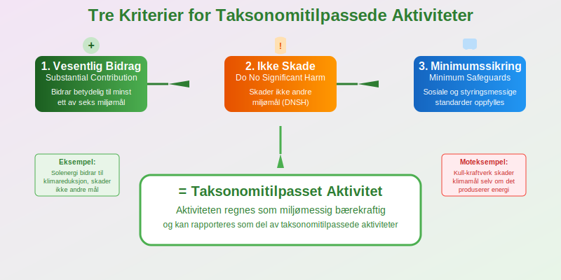

**EU-taksonomien** er EUs omfattende **klassifiseringssystem** som definerer hvilke økonomiske aktiviteter som regnes som miljømessig bærekraftige. Dette systemet påvirker **rapportering, finansiering og investeringsbeslutninger** for norske bedrifter og er nært knyttet til [CSRD-rapportering](/blogs/regnskap/hva-er-csrd "CSRD - Corporate Sustainability Reporting Directive").

## Hva er EU-taksonomien?

**EU-taksonomien** (EU Taxonomy) er et **vitenskapelig basert klassifiseringssystem** som etablerer felles kriterier for å identifisere miljømessig bærekraftige økonomiske aktiviteter. Systemet trådte i kraft 12. juli 2020 og er en hjørnestein i EUs **Green Deal** og **bærekraftige finansstrategi**.

### Hovedformål med EU-taksonomien

EU-taksonomien har flere sentrale mål:

* **Standardisere definisjoner** av bærekraftige aktiviteter
* **Forhindre greenwashing** gjennom objektive kriterier
* **Omdirigere kapital** til bærekraftige investeringer
* **Støtte EUs klimamål** om klimanøytralitet innen 2050
* **Skape transparens** i finansmarkedene
* **Harmonisere rapportering** på tvers av EU/EØS

## De Seks Miljømålene

EU-taksonomien er bygget rundt **seks miljømål** som økonomiske aktiviteter må bidra til eller ikke skade:

### 1. Klimaendringer - Reduksjon av Utslipp

**Klimareduksjon** omfatter aktiviteter som:

* **Fornybar energi:** Sol, vind, vannkraft, geotermisk
* **Energieffektivisering:** Bygningsrenovering, LED-belysning
* **Ren transport:** Elektriske kjøretøy, kollektivtransport
* **Industrielle prosesser:** Karbonfangst, hydrogen

For å dokumentere bidrag til klimareduksjon må bedrifter måle og rapportere sine utslipp i henhold til [GHG-protokollen](/blogs/regnskap/hva-er-ghg-protokollen "Hva er GHG-protokollen? Komplett Guide til Klimarapportering og Regnskap").

### 2. Klimaendringer - Tilpasning

**Klimatilpasning** inkluderer:

* **Flomvern:** Diker, dreneringssystemer
* **Tørkeresistente løsninger:** Vannsparende teknologi
* **Værbestandige infrastruktur:** Forsterket bygg og anlegg

### 3. Bærekraftig Bruk av Vannressurser

**Vannforvaltning** omfatter:

* **Vannrensing:** Avløpsrenseanlegg
* **Vannbesparelse:** Effektive irrigasjonssystemer
* **Vannkvalitet:** Beskyttelse av vannkilder

### 4. Overgang til Sirkulær Økonomi

**Sirkulær økonomi** inkluderer:

* **Avfallsreduksjon:** Gjenbruk og resirkulering
* **Produktdesign:** Holdbare og reparerbare produkter
* **Materialeffektivitet:** Redusert ressursforbruk

### 5. Forebygging av Forurensning

**Forurensningsforebygging** omfatter:

* **Luftkvalitet:** Reduksjon av skadelige utslipp
* **Kjemikaliekontroll:** Tryggere alternativer
* **Støyreduksjon:** Stillere teknologi

### 6. Beskyttelse av Biodiversitet

**Biodiversitetsbeskyttelse** inkluderer:

* **Naturrestaurering:** Gjenoppbygging av økosystemer
* **Bærekraftig skogbruk:** Sertifisert tømmerproduksjon
* **Havbeskyttelse:** Bærekraftig fiskeri

## Tre Kriterier for Bærekraftige Aktiviteter

For at en aktivitet skal regnes som **taksonomitilpasset**, må den oppfylle alle tre kriterier:

| Kriterium | Beskrivelse | Eksempel |
|-----------|-------------|----------|
| **Vesentlig bidrag** | Bidrar betydelig til minst ett miljømål | Solenergi bidrar til klimareduksjon |
| **Ikke skade** | Skader ikke de andre miljømålene | Vannkraft må ikke skade biodiversitet |
| **Minimumssikring** | Oppfyller sosiale og styringsmessige standarder | Respekterer arbeidsrettigheter |

### Vesentlig Bidrag (Substantial Contribution)

En aktivitet må **bidra vesentlig** til minst ett av de seks miljømålene gjennom:

* **Direkte bidrag:** Aktiviteten selv er miljøvennlig
* **Muliggjørende aktivitet:** Gjør andre aktiviteter mer bærekraftige
* **Overgangsaktivitet:** Støtter overgangen til lavkarbonøkonomi

### Ikke Skade (Do No Significant Harm - DNSH)

**DNSH-prinsippet** sikrer at aktiviteter ikke skader andre miljømål:

* **Kvantitative terskler:** Spesifikke grenseverdier
* **Kvalitative kriterier:** Beste praksis og standarder
* **Risikovurdering:** Identifisering av potensielle skader

### Minimumssikring (Minimum Safeguards)

**Sosiale og styringsmessige krav** inkluderer:

* **OECD-retningslinjer** for multinasjonale selskaper
* **FN-konvensjoner** om arbeidsrettigheter
* **Korrupsjonsbekjempelse** og etiske forretningspraksis

## EU-taksonomiens Påvirkning på Norske Bedrifter

EU-taksonomien påvirker norske bedrifter gjennom **EØS-avtalen** og flere regelverk.

### Rapporteringskrav

Bedrifter som omfattes av [CSRD](/blogs/regnskap/hva-er-csrd "CSRD - Corporate Sustainability Reporting Directive") må rapportere:

* **Andel taksonomitilpassede aktiviteter** i omsetning
* **Andel taksonomitilpassede investeringer** (CapEx)
* **Andel taksonomitilpassede driftskostnader** (OpEx)

### Finansielle Konsekvenser

EU-taksonomien påvirker **finansiering** gjennom:

* **Grønne lån:** Lavere renter for taksonomitilpassede aktiviteter
* **Bærekraftige obligasjoner:** Tilgang til grønn finansiering
* **Investeringsbeslutninger:** Økt fokus på taksonomitilpasning
* **Forsikring:** Potensielt lavere premier for bærekraftige aktiviteter

### Sektorspesifikke Konsekvenser

| Sektor | Påvirkning | Muligheter |
|--------|------------|------------|
| **Energi** | Høy - mange aktiviteter dekket | Fornybar energi, energieffektivisering |
| **Transport** | Høy - fokus på elektrifisering | Elektriske kjøretøy, kollektivtransport |
| **Bygg og anlegg** | Middels - energieffektive bygg | Grønne bygninger, renovering |
| **Industri** | Variabel - avhenger av prosesser | Sirkulær økonomi, ren teknologi |
| **Finans** | Høy - rapporterings- og investeringskrav | Grønne finansprodukter |

## Implementering og Tidslinje

EU-taksonomien implementeres **trinnvis** med ulike krav over tid.

### Gjeldende Regelverk (2022-2024)

* **Klimamål 1 og 2:** Kriterier for klimareduksjon og -tilpasning
* **Rapporteringskrav:** Store bedrifter må rapportere taksonomitilpasning
* **Finansielle produkter:** Krav til opplysninger om bærekraftighet

### Kommende Utvidelser (2024-2026)

* **Fire øvrige miljømål:** Kriterier for vann, sirkulær økonomi, forurensning og biodiversitet
* **Utvidede sektorer:** Flere økonomiske aktiviteter inkluderes
* **Skjerpede krav:** Strengere rapporterings- og dokumentasjonskrav

### Langsiktige Mål (2026+)

* **Sosial taksonomi:** Kriterier for sosiale mål
* **Global harmonisering:** Samarbeid med andre lands taksonomier
* **Teknologiutvikling:** Inkludering av nye grønne teknologier

## Praktisk Implementering for Bedrifter

Norske bedrifter må ta flere **praktiske skritt** for å håndtere EU-taksonomien.

### 1. Kartlegging av Aktiviteter

**Identifiser relevante aktiviteter:**

* **Gjennomgå forretningsmodell** og identifiser alle økonomiske aktiviteter
* **Sammenlign med taksonomilisten** over dekket aktiviteter
* **Vurder direkte og indirekte påvirkning** på miljømålene
* **Dokumenter prosessen** for revisjonsformål

### 2. Vurdering av Taksonomitilpasning

**Evaluer hver aktivitet mot kriteriene:**

* **Tekniske kriterier:** Oppfyller aktiviteten de spesifikke kravene?
* **DNSH-vurdering:** Skader aktiviteten andre miljømål?
* **Minimumssikring:** Følges sosiale og styringsmessige standarder?

### 3. Datainnsamling og Måling

**Etabler systemer for datainnsamling:**

* **Finansielle data:** Omsetning, CapEx, OpEx per aktivitet
* **Miljødata:** Utslipp, energiforbruk, avfall
* **Dokumentasjon:** Beviser for oppfyllelse av kriterier
* **Kvalitetssikring:** Rutiner for datakvalitet og sporbarhet

### 4. Rapportering og Kommunikasjon

**Forbered rapportering:**

* **Kvantitative nøkkeltall:** Andeler av taksonomitilpassede aktiviteter
* **Kvalitativ informasjon:** Forklaring av vurderinger og metoder
* **Fremtidsplaner:** Strategi for økt taksonomitilpasning
* **Ekstern kommunikasjon:** Informasjon til investorer og interessenter

## Utfordringer og Muligheter

EU-taksonomien skaper både **utfordringer og muligheter** for norske bedrifter.

### Hovedutfordringer

* **Kompleksitet:** Detaljerte tekniske kriterier kan være vanskelige å forstå
* **Datakrav:** Omfattende datainnsamling og dokumentasjon
* **Kostnader:** Investering i nye systemer og kompetanse
* **Usikkerhet:** Utviklende regelverk og tolkningsspørsmål
* **Konkurranseforhold:** Ulike krav i forskjellige markeder

### Strategiske Muligheter

* **Konkurransefortrinn:** Tidlig tilpasning gir markedsfordeler
* **Finansieringsfordeler:** Tilgang til grønn finansiering
* **Innovasjon:** Stimulerer utvikling av bærekraftige løsninger
* **Merkevarebygging:** Styrker omdømme og bærekraftsprofil
* **Risikoreduksjon:** Bedre håndtering av klimarelaterte risikoer

## Sammenheng med Annet EU-Regelverk

EU-taksonomien er **integrert** med andre EU-regelverk for bærekraft.

### CSRD og Bærekraftsrapportering

[CSRD](/blogs/regnskap/hva-er-csrd "CSRD - Corporate Sustainability Reporting Directive") krever rapportering av:

* **Taksonomitilpassede aktiviteter** som del av bærekraftsrapporteringen
* **Planer for økt tilpasning** til taksonomien
* **Risikoer og muligheter** knyttet til taksonomikrav

### SFDR og Finansielle Produkter

**Sustainable Finance Disclosure Regulation** (SFDR) krever:

* **Produktklassifisering:** Artikkel 6, 8 og 9-produkter
* **Taksonomitilpasning:** Rapportering av andel taksonomitilpassede investeringer
* **Opplysningsplikt:** Informasjon til investorer om bærekraftighet

### EU Green Bond Standard

**Grønne obligasjoner** må:

* **Finansiere taksonomitilpassede aktiviteter** for å få EU-merking
* **Rapportere bruk av midler** mot taksonomikriterier
* **Dokumentere miljøeffekt** av finansierte prosjekter

## Fremtidige Utviklinger

EU-taksonomien vil **utvikle seg** med nye krav og utvidelser.

### Sosial Taksonomi

EU arbeider med en **sosial taksonomi** som vil dekke:

* **Arbeidsrettigheter:** Sikre og sunne arbeidsplasser
* **Sosial inkludering:** Tilgang til grunnleggende tjenester
* **Menneskerettigheter:** Respekt for grunnleggende rettigheter

### Teknologiske Fremskritt

**Nye teknologier** vil påvirke taksonomien:

* **Kunstig intelligens:** Optimalisering av ressursbruk
* **Blockchain:** Sporbarhet i verdikjeder
* **Digitale tvillinger:** Bedre miljøovervåking

### Global Harmonisering

**Internasjonalt samarbeid** om taksonomier:

* **G20-initiativ:** Felles prinsipper for bærekraftige finanser
* **Bilaterale avtaler:** Gjensidig anerkjennelse av taksonomier
* **Standardisering:** Harmonisering av kriterier og metoder

## Sammenheng med Norsk Regnskap og Regnskapsstandarder

EU-taksonomien påvirker også **regnskapsføringen** i Norge og knytter seg til nasjonale standarder for regnskapsrapportering:

| Regelverk/Standard                | Påvirkning på regnskap                     | Intern link                                                                                                                      |
|-----------------------------------|--------------------------------------------|----------------------------------------------------------------------------------------------------------------------------------|
| **Regnskapsloven § 3‘3c**         | Krav om redegjørelse for samfunnsansvar    | [Regnskapsloven § 3‘3c](/blogs/regnskap/hva-er-opplysningsplikt "Hva er Opplysningsplikt? Guide til Regnskapsloven §–¯3‘3c og samfunnsansvar") |
| **Norsk Regnskapsstandard (NRS)** | Retningslinjer for bærekraftsrapportering   | [Norsk regnskapsstandard (NRS)](/blogs/regnskap/norsk-regnskapsstandard-nrs "Norsk regnskapsstandard (NRS) - Komplett Guide til Norske Regnskapsstandarder") |
| **IFRS Sustainability Standards** | For EU-børsnoterte selskaper, integrering av internasjonale bærekraftsstandarder | [Hva er IFRS?](/blogs/regnskap/hva-er-ifrs "Hva er IFRS? Guide til internasjonale regnskapsstandarder")                               |
| **Vedtekter for AS**              | Krav til redegjørelse i årsberetning        | [Hva er vedtekter for aksjeselskap](/blogs/regnskap/hva-er-vedtekter-for-aksjeselskap "Hva er vedtekter for aksjeselskap?")               |

## Konklusjon

**EU-taksonomien** representerer et paradigmeskifte i hvordan vi definerer og måler bærekraftige økonomiske aktiviteter. For norske bedrifter innebærer dette både **utfordringer og muligheter** som krever strategisk tilnærming og systematisk implementering.

### Nøkkelpoeng for Norske Bedrifter

* **Start tidlig:** Kartlegg aktiviteter og vurder taksonomitilpasning
* **Invester i kompetanse:** Bygg intern kunnskap om taksonomikrav
* **Etabler systemer:** Utvikle robuste data- og rapporteringssystemer
* **Se muligheter:** Bruk taksonomien som verktøy for strategisk utvikling
* **Følg utviklingen:** Hold deg oppdatert på regelverksendringer

EU-taksonomien er ikke bare et **rapporteringskrav**, men et **strategisk verktøy** for å navigere overgangen til en bærekraftig økonomi. Bedrifter som mestrer taksonomien vil være bedre posisjonert for fremtidens marked og finansieringsmuligheter.

Sammen med [CSRD-rapportering](/blogs/regnskap/hva-er-csrd "CSRD - Corporate Sustainability Reporting Directive") og andre bærekraftskrav, former EU-taksonomien fremtidens **regnskaps- og rapporteringslandskap** for norske bedrifter.

