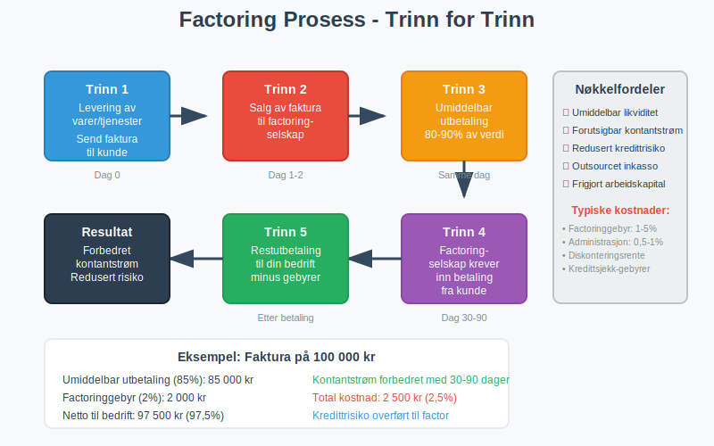
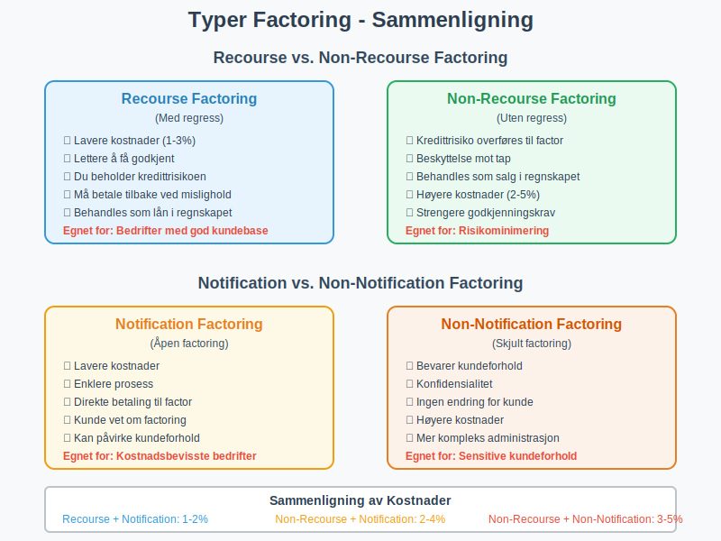
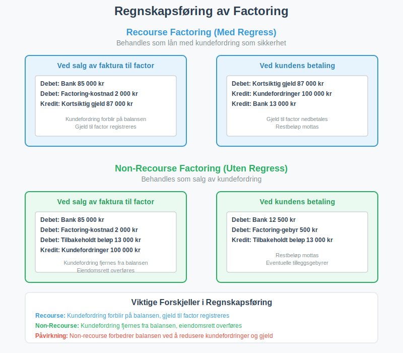

---
title: "Hva er factoring?"
seoTitle: "Hva er factoring?"
meta_description: '**Factoring** er en spesialisert [finansieringstjeneste](/blogs/regnskap/hva-er-finansiering "Hva er Finansiering? Komplett Guide til Bedriftsfinansiering og Fi...'
slug: hva-er-factoring
type: blog
layout: pages/single
---

**Factoring** er en spesialisert [finansieringstjeneste](/blogs/regnskap/hva-er-finansiering "Hva er Finansiering? Komplett Guide til Bedriftsfinansiering og Finansieringsformer") hvor bedrifter selger sine utestående [fakturaer](/blogs/regnskap/hva-er-en-faktura "Hva er en Faktura? En Guide til Norske Fakturakrav") til et factoringselskap for å få umiddelbar kontantstrøm. I stedet for å vente 30-90 dager på at kundene betaler, kan bedriften få opptil 90% av fakturaverdien utbetalt samme dag. Dette er en populær løsning for bedrifter som driver med **[fakturasalg](/blogs/regnskap/hva-er-fakturasalg "Hva er Fakturasalg? Komplett Guide til Kredittgivning og Debitorhåndtering")** og trenger å forbedre sin [betalingsevne](/blogs/regnskap/hva-er-betalingsevne "Hva er Betalingsevne? Analyse av Likviditet og Finansiell Stabilitet") og [arbeidskapital](/blogs/regnskap/hva-er-arbeidskapital "Hva er Arbeidskapital? Beregning og Betydning for Bedriftens Likviditet").

## Seksjon 1: Hvordan Factoring Fungerer

Factoring-prosessen involverer tre parter: **leverandøren** (din bedrift), **kunden** (som skylder penger), og **factoringselskapet** (som kjøper fakturaene). Prosessen er enkel og effektiv for bedrifter som har utfordringer med kontantstrøm.



### Trinn-for-trinn Prosess:

1. **Levering av varer/tjenester:** Din bedrift leverer varer eller tjenester til kunden og sender [faktura](/blogs/regnskap/hva-er-en-faktura "Hva er en Faktura? En Guide til Norske Fakturakrav")
2. **Salg til factor:** Du selger fakturaen til factoringselskapet
3. **Umiddelbar utbetaling:** Factoringselskapet betaler deg 80-90% av fakturaverdien umiddelbart
4. **Kundeinnkreving:** Factoringselskapet tar ansvar for å kreve inn betalingen fra kunden
5. **Restutbetaling:** Når kunden betaler, får du restbeløpet minus factoringgebyrer

## Seksjon 2: Typer Factoring

Det finnes flere ulike typer factoring-tjenester som passer til forskjellige bedriftsbehov og risikoprofiler.



### 2.1 Recourse vs. Non-Recourse Factoring

| Type | Beskrivelse | Risiko | Kostnad |
|------|-------------|--------|---------|
| **Recourse Factoring** | Du beholder risikoen hvis kunden ikke betaler | Høy risiko for leverandør | Lavere gebyrer (1-3%) |
| **Non-Recourse Factoring** | Factoringselskapet tar kredittrisikoen | Lav risiko for leverandør | Høyere gebyrer (2-5%) |

### 2.2 Notification vs. Non-Notification Factoring

**Notification Factoring** (åpen factoring):
* Kunden blir informert om at fakturaen er solgt
* Betalinger går direkte til factoringselskapet
* Lavere kostnader da prosessen er mer transparent

**Non-Notification Factoring** (skjult factoring):
* Kunden vet ikke at fakturaen er solgt
* Betalinger går fortsatt til din bedrift, som videresender til factor
* Høyere kostnader, men bevarer kundeforholdet

### 2.3 Spot Factoring vs. Hele Porteføljen

* **Spot Factoring:** Salg av enkeltfakturaer ved behov
* **Portefølje Factoring:** Kontinuerlig salg av alle eller de fleste fakturaer

## Seksjon 3: Kostnader og Gebyrer

Factoring-kostnader består av flere komponenter som påvirker den totale prisen for tjenesten.

### Hovedkostnader ved Factoring:

* **Factoringgebyr:** 1-5% av fakturaverdien, avhengig av risiko og volum
* **Diskonteringsrente:** Månedlig rente på forskuddsbeløpet (0,5-2% per måned)
* **Administrasjonsgebyrer:** Faste kostnader for behandling og oppfølging
* **Kredittsjekk-gebyrer:** Kostnader for vurdering av kundens [kredittverdighet](/blogs/regnskap/hva-er-bonitet "Hva er bonitet?")

### Eksempel på Factoring-kostnad:

La oss si du har en faktura på **100 000 kr** med 30 dagers betalingsfrist:

| Komponent | Beløp | Prosent |
|-----------|-------|---------|
| Fakturaverdien | 100 000 kr | 100% |
| Umiddelbar utbetaling | 85 000 kr | 85% |
| Factoringgebyr | 2 000 kr | 2% |
| Administrasjonsgebyr | 500 kr | 0,5% |
| **Netto utbetaling ved betaling** | **97 500 kr** | **97,5%** |
| **Total kostnad** | **2 500 kr** | **2,5%** |

## Seksjon 4: Fordeler med Factoring

Factoring tilbyr flere betydelige fordeler for bedrifter, spesielt de som opplever utfordringer med kontantstrøm eller vekst.

### Forbedret Kontantstrøm

* **Umiddelbar likviditet:** Få penger samme dag i stedet for å vente 30-90 dager
* **Forutsigbar kontantstrøm:** Planlegg bedre med garantert utbetaling
* **Redusert [arbeidskapital](/blogs/regnskap/hva-er-arbeidskapital "Hva er Arbeidskapital? Beregning og Betydning for Bedriftens Likviditet")-behov:** Mindre behov for å binde opp kapital i [kundefordringer](/blogs/regnskap/hva-er-kundefordring "Hva er Kundefordring? En Komplett Guide til Kundefordringer i Regnskap")

### Redusert Administrativ Byrde

* **Outsourcet inkasso:** Factoringselskapet håndterer [betalingsoppfordringer](/blogs/regnskap/hva-er-betalingsoppfordring "Betalingsoppfordring - Komplett Guide til Purring og Inkasso i Norge") og [inkassovirksomhet](/blogs/regnskap/hva-er-inkasso "Hva er Inkasso? Komplett Guide til Inkassovirksomhet og Fordringshåndtering")
* **Kredittsjekk:** Profesjonell vurdering av kunders [kredittverdighet](/blogs/regnskap/hva-er-bonitet "Hva er bonitet?")
* **Redusert risiko:** Mindre tap på fordringer ved non-recourse factoring

### Vekstmuligheter

* **Finansiering av vekst:** Bruk kontantstrømmen til å investere i vekst
* **Større ordrer:** Ta imot større ordrer uten å bekymre deg for finansiering
* **Konkurransefortrinn:** Tilby bedre betalingsbetingelser til kunder

## Seksjon 5: Ulemper og Risikoer

Selv om factoring har mange fordeler, er det viktig å forstå potensielle ulemper og risikoer.

### Kostnader

* **Høyere finansieringskostnad:** Ofte dyrere enn tradisjonelle banklån
* **Redusert fortjeneste:** Factoringgebyrer reduserer [bruttofortjenesten](/blogs/regnskap/hva-er-bruttofortjeneste "Hva er Bruttofortjeneste? Beregning og Betydning for Lønnsomhet")
* **Avhengighet:** Kan bli avhengig av factoring for kontantstrøm

### Kundeforhold

* **Kundeoppfatning:** Noen kunder kan oppfatte factoring som tegn på finansielle problemer
* **Tap av kontroll:** Mindre kontroll over inkassoprosessen
* **Konfidensialitet:** Ved notification factoring mister du konfidensialitet

### Operasjonelle Risikoer

* **Kvalitetskrav:** Factoringselskaper kan avvise fakturaer av lav kvalitet
* **Kundekonsentrasjon:** Høy avhengighet av få store kunder kan være problematisk
* **Kontraktsbinding:** Lange kontrakter kan redusere fleksibilitet

## Seksjon 6: Regnskapsføring av Factoring

Regnskapsføringen av factoring avhenger av om det er **recourse** eller **non-recourse** factoring, og dette påvirker hvordan transaksjonen behandles i [regnskapet](/blogs/regnskap/hva-er-regnskap "Hva er Regnskap? Komplett Guide til Regnskapsføring i Norge").



### Recourse Factoring (med regress)

Ved recourse factoring beholder bedriften kredittrisikoen, så fakturaen behandles som et **lån** med kundefordringen som sikkerhet:

**Ved salg av faktura:**
```
Debet: Bank                     85 000 kr
Debet: Factoring-kostnad         2 000 kr
Kredit: Kortsiktig gjeld        87 000 kr
```

**Ved kundens betaling:**
```
Debet: Kortsiktig gjeld         87 000 kr
Kredit: Kundefordringer        100 000 kr
Kredit: Bank                    13 000 kr
```

### Non-Recourse Factoring (uten regress)

Ved non-recourse factoring overføres både eiendomsrett og risiko, så det behandles som et **salg**:

**Ved salg av faktura:**
```
Debet: Bank                     85 000 kr
Debet: Factoring-kostnad         2 000 kr
Debet: Tilbakeholdt beløp       13 000 kr
Kredit: Kundefordringer        100 000 kr
```

**Ved kundens betaling:**
```
Debet: Bank                     12 500 kr
Debet: Factoring-gebyr             500 kr
Kredit: Tilbakeholdt beløp      13 000 kr
```

## Seksjon 7: Alternativer til Factoring

Før du velger factoring, bør du vurdere andre finansieringsalternativer som kan være mer kostnadseffektive.

### Tradisjonelle Finansieringsformer

* **Banklån:** Lavere rente, men krever sikkerhet og lang behandlingstid
* **Kredittlinje:** Fleksibel finansiering, men krever god [egenkapital](/blogs/regnskap/hva-er-egenkapital "Hva er Egenkapital? Beregning og Betydning for Bedriftens Soliditet")
* **Leverandørfinansiering:** Forhandling om lengre betalingsfrist med leverandører

### Moderne Finansieringsløsninger

* **Invoice Trading:** Auksjon av fakturaer til investorer
* **Supply Chain Finance:** Finansiering gjennom hele leverandørkjeden
* **Fintech-løsninger:** Digitale plattformer med raskere behandling og lavere kostnader

### Forbedring av Kontantstrøm

* **Bedre [betalingsbetingelser](/blogs/regnskap/hva-er-en-faktura "Hva er en Faktura? En Guide til Norske Fakturakrav"):** Kortere betalingsfrister og forskuddsbetaling
* **Automatiserte betalingsløsninger:** [AvtaleGiro](/blogs/regnskap/hva-er-avtalegiro "Hva er AvtaleGiro? Komplett Guide til Automatisk Betaling") og [eFaktura](/blogs/regnskap/hva-er-efaktura "Hva er eFaktura? Komplett Guide til Elektronisk Fakturering i Norge")
* **Effektiv oppfølging:** Systematisk [betalingsoppfordring](/blogs/regnskap/hva-er-betalingsoppfordring "Betalingsoppfordring - Komplett Guide til Purring og Inkasso i Norge")

## Seksjon 8: Når Bør Du Vurdere Factoring?

Factoring er ikke riktig for alle bedrifter, men kan være en utmerket løsning i spesifikke situasjoner.

### Ideelle Kandidater for Factoring:

* **B2B-bedrifter** med lange betalingsfrister (30+ dager)
* **Vekstbedrifter** som trenger kapital for ekspansjon
* **Sesongbaserte virksomheter** med varierende kontantstrøm
* **Bedrifter med kredittverdige kunder** men egen dårlig kredittrating

### Situasjoner hvor Factoring er Spesielt Nyttig:

* **Akutt likviditetsbehov:** Når du trenger penger raskt
* **Vekstfinansiering:** For å finansiere nye ordrer eller ekspansjon
* **Risikohåndtering:** Når du vil redusere kredittrisiko
* **Administrativ avlastning:** Når inkasso tar for mye tid og ressurser

### Når Factoring IKKE er Anbefalt:

* **Lave marginer:** Hvis factoringkostnadene spiser opp fortjenesten
* **Få, store kunder:** Høy konsentrasjonsrisiko kan være problematisk
* **Dårlig kundebase:** Kunder med dårlig betalingshistorikk
* **Korte betalingsfrister:** Hvis kundene allerede betaler raskt

## Seksjon 9: Hvordan Velge Factoringselskap

Valg av riktig factoringpartner er kritisk for suksess med denne finansieringsformen.

### Viktige Evalueringskriterier:

| Kriterium | Hva å se etter | Spørsmål å stille |
|-----------|----------------|-------------------|
| **Kostnader** | Transparente gebyrer og renter | Hva er totalkostnaden? Finnes det skjulte gebyrer? |
| **Fleksibilitet** | Mulighet for spot factoring | Kan jeg velge hvilke fakturaer jeg selger? |
| **Kundeservice** | Profesjonell behandling av dine kunder | Hvordan håndterer dere inkasso? |
| **Teknologi** | Moderne systemer og rapportering | Hvilke digitale verktøy tilbys? |
| **Erfaring** | Bransjekunnskap og track record | Har dere erfaring med min bransje? |

### Due Diligence Sjekkliste:

* **Regulering:** Er selskapet regulert av Finanstilsynet?
* **Referanser:** Kan de oppgi referanser fra lignende bedrifter?
* **Kontrakt:** Les kontrakten nøye, spesielt oppsigelsesklausuler
* **Rapportering:** Hvilken rapportering og innsikt får du?
* **Support:** Hvor tilgjengelig er kundeservice?

## Seksjon 10: Fremtiden for Factoring

Factoring-industrien utvikler seg raskt med nye teknologier og forretningsmodeller som gjør tjenesten mer tilgjengelig og kostnadseffektiv.

### Teknologiske Innovasjoner:

* **Kunstig intelligens:** Automatisert kredittscoring og risikoevaluering
* **Blockchain:** Økt transparens og reduserte transaksjonskostnader
* **API-integrasjoner:** Sømløs integrasjon med regnskapssystemer
* **Sanntidsanalyse:** Bedre innsikt i kontantstrøm og kundeadferd

### Nye Forretningsmodeller:

* **Peer-to-peer factoring:** Direkte matching mellom bedrifter og investorer
* **Mikro-factoring:** Factoring av små beløp for mindre bedrifter
* **Bransje-spesifikke løsninger:** Skreddersydde tjenester for spesifikke sektorer
* **Integrerte finanstjenester:** Factoring som del av helhetlige finansløsninger

Factoring vil fortsette å være en viktig finansieringsform for bedrifter som trenger fleksibel tilgang til arbeidskapital. Med teknologiske fremskritt blir tjenesten mer effektiv, rimeligere og tilgjengelig for et bredere spekter av bedrifter.

Ved å forstå hvordan factoring fungerer, kostnadene involvert, og når det er den rette løsningen, kan bedrifter ta informerte beslutninger om denne finansieringsformen. Husk å alltid sammenligne alternativer og velge en løsning som passer din bedrifts spesifikke behov og situasjon.


