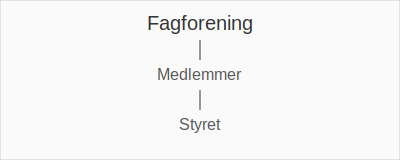

---
title: "Hva er Fagforening? Regnskap for Fagforeninger i Norge"
seoTitle: "Hva er Fagforening? Regnskap for Fagforeninger i Norge"
description: 'En **fagforening** er en type [forening](/blogs/regnskap/hva-er-forening "Hva er Forening i Regnskap? Regnskapsføring for Foreninger og Organisasjoner") som or...'
---

En **fagforening** er en type [forening](/blogs/regnskap/hva-er-forening "Hva er Forening i Regnskap? Regnskapsføring for Foreninger og Organisasjoner") som organiserer arbeidstakere for å fremme felles arbeids- og lønnsinteresser. I regnskapssammenheng har fagforeninger både de samme kravene som andre foreninger og spesifikke regler knyttet til medlemskontingent, lønnstrekk og interne avtaler.

## Hva er en Fagforening?

En fagforening er en sammenslutning av arbeidstakere som forhandler om lønn, arbeidsvilkår og rettigheter på vegne av medlemmene. Fagforeninger spiller en sentral rolle i arbeidslivet for å sikre rettferdig lønn, trygge arbeidsforhold og kollektiv forhandlingsstyrke.

## Regnskapskrav for Fagforeninger

### Bokføringsplikt og Regnskapsplikt

Fagforeninger følger generelle regler for [bokføringsplikt](/blogs/regnskap/hva-er-bokforingsplikt "Hva er Bokføringsplikt? Komplett Guide til Norske Bokføringskrav") og de grunnleggende prinsippene for [regnskap](/blogs/regnskap/hva-er-regnskap "Hva er Regnskap? En Dybdeanalyse for Norge") på samme måte som andre foreninger.

### Medlemskontingent og Lønnstrekk

Fagforeningers hovedinntekt kommer ofte fra **medlemskontingent**. Den kan kreves inn direkte eller via **lønnstrekk** (trekk i lønn):

| Kontingenttype                      | Regnskapsføring             | Tidspunkt                        |
|------------------------------------|-----------------------------|----------------------------------|
| Månedskontingent (lønnstrekk)       | Periodiseres over måneden   | Ved avlønning                    |
| Engangskontingent                   | Inntektsføres umiddelbart   | Ved mottak                       |

Se også [Hva er Lønn?](/blogs/regnskap/hva-er-lonn "Hva er Lønn? Komplett Guide til Lønn i Norge") for mer om lønnsbegreper.

## Tilskudd, Gaver og Andre Inntekter

I tillegg til kontingent kan fagforeninger motta **tilskudd**, **gaver** og andre bidrag:

* **Betingede tilskudd**: Inntektsføres når vilkår er oppfylt
* **Ubetingede tilskudd**: Inntektsføres ved mottak
* **Gaver**: Inntektsføres ved mottak, men kan kreve merking i regnskapet

## Interne Avtaler og Forhandlinger

Fagforeninger forvalter ofte **kollektive avtaler** og tariffavtaler. Regnskapsføring av kostnader knyttet til forhandlinger og administrasjon krever dokumentasjon av avtalene:

* Arkivering av arbeids- og tariffavtaler etter [bokføringsloven](/blogs/regnskap/hva-er-bokforingsloven "Hva er Bokføringsloven? Guide til Norske Bokføringsregler")
* Internkontroll av utgifter til møter og forhandlinger
* Spesifikke retningslinjer for refusjon av utgifter

## Rapportering og Årsavslutning

### Årsrapport og Revisjon

Fagforeninger må ofte levere årsrapport til myndighetene og kan være underlagt revisjonsplikt basert på omsetning og tilskudd. Se [Hva er Revisjon?](/blogs/regnskap/hva-er-revisjon "Hva er Revisjon? Komplett Guide til Revisjonskrav") for detaljer.

### Digitalisering og Automatisering

Moderne fagforeninger benytter ofte [API-integrasjon og automatisering](/blogs/regnskap/api-integrasjon-automatisering-regnskap "API-integrasjon, Automatisering og Regnskap") for å effektivisere:

* Automatisk innkreving av kontingent
* Integrasjon med lønnssystemer
* Sanntidsrapportering til styret og myndigheter

## Beste praksis for regnskapsføring i Fagforeninger

| Område                | Tiltak                                    | Fordel                                  |
|-----------------------|-------------------------------------------|-----------------------------------------|
| Kompetanse            | Kursing av kasserer og regnskapsansvarlig | Sikrer korrekt håndtering av lover og regler |
| Systemvalg            | Valg av spesialtilpasset system           | Effektiviserer rutiner                  |
| Kontrollrutiner       | Skille funksjoner og kontrollintervaller  | Reduserer risiko for feil og misligheter |
| Dokumentasjon         | Standardiserte maler for avtaleføring     | Enklere revisjon og internkontroll      |

For en introduksjon til generelle prinsipper, se også [Hva er Regnskap?](/blogs/regnskap/hva-er-regnskap "Hva er Regnskap? En Dybdeanalyse for Norge").

## Konklusjon

Regnskapsføring for fagforeninger kombinerer de generelle prinsippene for foreninger med egne krav knyttet til medlemskontingent, lønnstrekk og avtaleadministrasjon. Ved å følge **beste praksis** og benytte moderne verktøy kan fagforeninger sikre både etterlevelse og effektiv økonomistyring.

