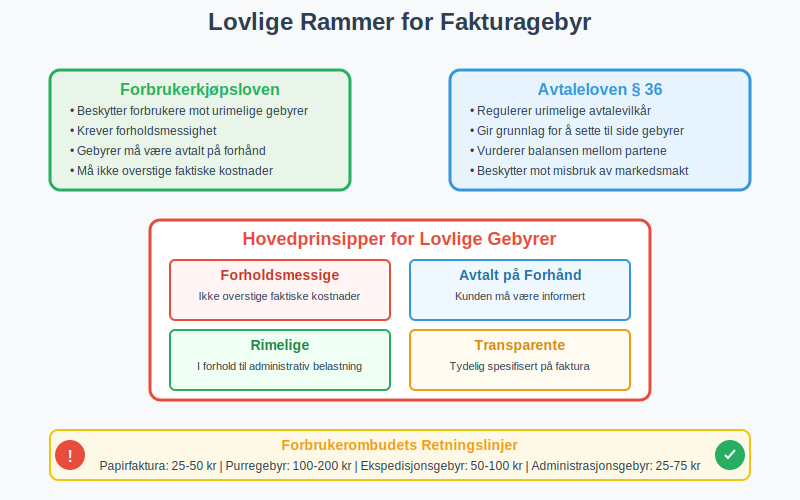
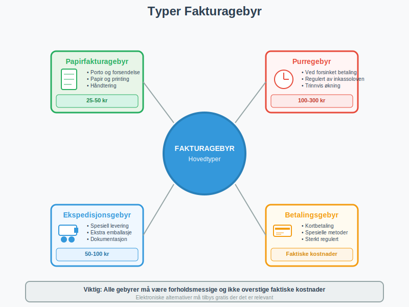
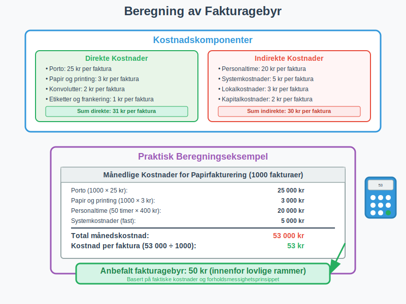
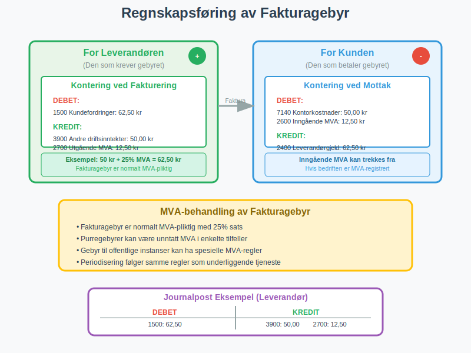
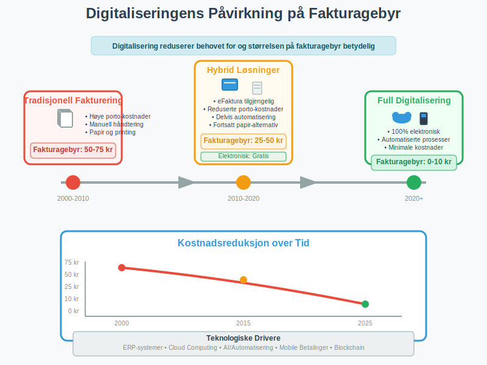

Et **fakturagebyr** er et tilleggsgebyr som en leverandør kan kreve fra kunden for å dekke administrative kostnader knyttet til fakturering og betalingsbehandling. Dette gebyret er særlig vanlig når kunder velger tradisjonelle betalingsmetoder som papirfaktura fremfor elektroniske alternativer som [eFaktura](/blogs/regnskap/hva-er-efaktura "Hva er eFaktura? Komplett Guide til Elektronisk Fakturering i Norge") eller [AvtaleGiro](/blogs/regnskap/hva-er-avtalegiro "Hva er AvtaleGiro? Komplett Guide til Automatisk Betaling").

Fakturagebyr har blitt et stadig mer aktuelt tema i norsk næringsliv, spesielt etter at mange bedrifter har digitalisert sine faktureringsprosesser. Gebyret skal i teorien reflektere de reelle kostnadene ved å håndtere [fakturaer](/blogs/regnskap/hva-er-en-faktura "Hva er en Faktura? En Guide til Norske Fakturakrav") manuelt, inkludert porto, papir, printing og administrativ behandling.

## Lovlige Rammer for Fakturagebyr

I Norge er fakturagebyr regulert av **forbrukerkjøpsloven** og **avtaleloven**, og det finnes klare retningslinjer for hva som er tillatt å kreve.



### Hovedprinsipper for Lovlige Gebyrer

**Fakturagebyr må være:**

* **Forholdsmessige:** Gebyret kan ikke overstige de faktiske kostnadene ved fakturering
* **Avtalt på forhånd:** Kunden må være informert om gebyret før avtalen inngås
* **Rimelige:** Gebyret må stå i forhold til den administrative belastningen
* **Transparente:** Gebyret må være tydelig spesifisert på [fakturaen](/blogs/regnskap/hva-er-en-faktura "Hva er en Faktura? En Guide til Norske Fakturakrav")

### Forbrukerombudets Retningslinjer

Forbrukerombudet har etablert følgende retningslinjer for fakturagebyr:

| Gebyrtype | Maksimalt beløp | Betingelser |
|-----------|----------------|-------------|
| Papirfaktura | 25-50 kr | Kun hvis elektronisk alternativ tilbys |
| [Purregebyr](/blogs/regnskap/hva-er-purring-og-purregebyr "Hva er Purring og Purregebyr? Guide til Norske Regler og Regnskapsføring") | 100-200 kr | Ved forsinket betaling |
| Ekspedisjonsgebyr | 50-100 kr | For spesielle leveringskrav |
| Administrasjonsgebyr | 25-75 kr | For ekstra administrative oppgaver |

**Viktig:** Disse beløpene er veiledende og må alltid vurderes mot de faktiske kostnadene bedriften har.

## Typer Fakturagebyr

Det finnes flere typer gebyrer som kan knyttes til fakturering, hver med sine spesifikke regler og begrensninger.



### 1. Papirfakturagebyr

Dette er det mest vanlige fakturagebyr og pålegges kunder som velger å motta fakturaer på papir fremfor elektronisk. Gebyret skal dekke:

* **Porto og forsendelse** (se [Konto 3910 - Utgående porto, avgiftspliktig](/blogs/kontoplan/3910-utgaende-porto-avgiftspliktig "Konto 3910 - Utgående porto, avgiftspliktig"))
* **Papir og printing**
* **Konvoluttering og håndtering**
* **Administrativ behandling**

**Lovlige krav:**
* Elektronisk alternativ må tilbys gratis
* Gebyret må ikke overstige faktiske kostnader
* Kunden må informeres på forhånd

For å unngå fakturagebyr kan kunder velge mellom ulike [elektroniske faktureringsløsninger](/blogs/regnskap/hva-er-elektronisk-fakturering "Hva er Elektronisk Fakturering? Komplett Guide til Digitale Fakturaløsninger") som eFaktura, Vipps eFaktura eller andre digitale alternativer.

### 2. Purregebyr og Betalingspåminnelser

Når fakturaer ikke betales innen forfallsdato, kan leverandøren kreve purregebyr. Dette er regulert av **inkassoloven** og har strenge rammer:

* **Første purring:** Maksimalt 100 kr
* **Andre purring:** Maksimalt 200 kr  
* **Tredje purring:** Maksimalt 300 kr

Les mer om dette i vår guide til [betalingsoppfordring](/blogs/regnskap/hva-er-betalingsoppfordring "Betalingsoppfordring - Komplett Guide til Purring og Inkasso i Norge").

**[Forsinkelsesgebyr](/blogs/regnskap/hva-er-forsinkelsesgebyr "Hva er Forsinkelsesgebyr? Komplett Guide til Morarenter og Forsinkelsesrenter i Norge")** omfatter alle kostnader ved forsinket betaling, inkludert purregebyrer, forsinkelsesrenter og inkassokostnader. For en komplett oversikt over lovgrunnlag, beregningsmetoder og praktiske råd, se vår omfattende guide til forsinkelsesgebyr.

### 3. Ekspedisjons- og Behandlingsgebyr

For spesielle leveringskrav eller ekstra administrative oppgaver kan bedrifter kreve tilleggsgebyrer:

* **Ekspresslevering**
* **Spesiell emballasje**
* **Ekstra dokumentasjon**
* **Manuelle behandlingsprosesser**

### 4. Betalingsgebyr

Noen leverandører krever gebyr for spesifikke betalingsmetoder, men dette er sterkt regulert:

* **Kontantbetaling:** Generelt ikke tillatt å kreve gebyr
* **Kortbetaling:** Begrenset til faktiske kostnader
* **[BankGiro](/blogs/regnskap/hva-er-bankgiro "Hva er BankGiro? Komplett Guide til Norsk Betalingssystem"):** Kan ikke kreve gebyr utover faktiske kostnader

## Beregning og Fastsettelse av Fakturagebyr

Korrekt beregning av fakturagebyr krever en grundig analyse av de faktiske kostnadene ved faktureringsprocessen.



### Kostnadskomponenter

For å beregne et rettferdig fakturagebyr må bedriften kartlegge alle relevante kostnader:

#### Direkte Kostnader
* **Porto:** Faktisk kostnad for forsendelse
* **Papir og printing:** Kostnad per faktura
* **Konvolutter:** Kostnad per stykk
* **Etiketter og frankering:** Administrative materialer

#### Indirekte Kostnader
* **Personaltime:** Tid brukt på håndtering
* **Systemkostnader:** IT-infrastruktur og programvare
* **Lokalkostnader:** Andel av kontorleie og drift
* **Kapitalkostnader:** Renter på utestående fordringer

### Beregningseksempel

La oss se på et praktisk eksempel på hvordan en bedrift kan beregne sitt fakturagebyr:

**Månedlige kostnader for papirfakturering:**
* Porto (1000 fakturaer × 25 kr): 25 000 kr
* Papir og printing (1000 × 3 kr): 3 000 kr
* Personaltime (50 timer × 400 kr): 20 000 kr
* Systemkostnader (fast): 5 000 kr
* **Total månedskostnad:** 53 000 kr

**Kostnad per faktura:** 53 000 kr ÷ 1000 = 53 kr

Dette gir grunnlag for et fakturagebyr på rundt 50 kr, som er innenfor lovlige rammer.

## Regnskapsføring av Fakturagebyr

Korrekt regnskapsføring av fakturagebyr er viktig både for leverandør og kunde, og påvirker [merverdiavgift](/blogs/regnskap/hva-er-avgiftsplikt-mva "Hva er Avgiftsplikt (MVA)? Komplett Guide til Merverdiavgift i Norge") og [driftsresultat](/blogs/regnskap/hva-er-driftsresultat "Hva er Driftsresultat? Beregning, Analyse og Betydning for Bedriften").



### For Leverandøren (Den som Krever Gebyret)

Fakturagebyr regnskapsføres som **driftsinntekt** og er normalt MVA-pliktig:

**Kontering ved fakturering:**
```
Debet: Kundefordringer (inkl. MVA)
Kredit: Salgsinntekt fakturagebyr (eks. MVA)
Kredit: Utgående MVA
```

**Eksempel:**
* Fakturagebyr: 50 kr + 12,50 kr MVA = 62,50 kr totalt
* Konto 1500 (Kundefordringer): 62,50 kr
* Konto 3900 (Andre driftsinntekter): 50,00 kr  
* Konto 2700 (Utgående MVA): 12,50 kr

### For Kunden (Den som Betaler Gebyret)

Fakturagebyr regnskapsføres som **driftskostnad** og inngående MVA kan trekkes fra:

**Kontering ved mottak:**
```
Debet: Kontorkostnader/Administrative kostnader
Debet: Inngående MVA
Kredit: Leverandørgjeld
```

**Eksempel:**
* Konto 7140 (Kontorkostnader): 50,00 kr
* Konto 2600 (Inngående MVA): 12,50 kr
* Konto 2400 (Leverandørgjeld): 62,50 kr

### Spesielle Regnskapsregler

**MVA-behandling:**
* Fakturagebyr er normalt MVA-pliktig med 25% sats
* Purregebyrer kan være [unntatt MVA](/blogs/regnskap/unntatt-mva "Unntatt MVA") i enkelte tilfeller
* Gebyr til offentlige instanser kan ha spesielle MVA-regler

**Periodisering:**
* Gebyrer periodiseres i samme periode som den underliggende tjenesten
* Purregebyrer bokføres når de påløper
* Forskuddsbetalte gebyrer må periodiseres korrekt

## Praktiske Råd for Bedrifter

### For Leverandører som Krever Fakturagebyr

**Før implementering:**

1. **Gjennomfør kostnadsanalyse:** Dokumenter faktiske kostnader ved papirfakturering
2. **Tilby elektroniske alternativer:** Sørg for at [eFaktura](/blogs/regnskap/hva-er-efaktura "Hva er eFaktura? Komplett Guide til Elektronisk Fakturering i Norge") eller [AvtaleGiro](/blogs/regnskap/hva-er-avtalegiro "Hva er AvtaleGiro? Komplett Guide til Automatisk Betaling") er tilgjengelig
3. **Oppdater avtalevilkår:** Inkluder informasjon om gebyrer i standardvilkår
4. **Informer eksisterende kunder:** Send varsel om endringer i god tid

**Ved implementering:**

* **Vær transparent:** Spesifiser gebyret tydelig på fakturaen
* **Hold deg innenfor lovlige rammer:** Ikke overskrid faktiske kostnader
* **Bruk profesjonelle [fakturamaler](/blogs/regnskap/hva-er-fakturamal "Hva er Fakturamal? Komplett Guide til Fakturamaler og Fakturadesign"):** Reduser administrative kostnader gjennom standardiserte maler
* **Dokumenter beslutningsgrunnlag:** Oppbevar kostnadsanalyser for eventuelle tvister
* **Følg opp elektronisk overgang:** Hjelp kunder med å bytte til elektroniske løsninger

### For Kunder som Mottar Fakturagebyr

**Vurdering av gebyrer:**

1. **Sjekk om gebyret er lovlig:** Er det forholdsmessig og avtalt på forhånd?
2. **Vurder elektroniske alternativer:** Kan du spare penger ved å bytte?
3. **Sammenlign totalkostnader:** Inkluder gebyrer i din leverandørvurdering
4. **Dokumenter for regnskapet:** Sørg for korrekt kontering og MVA-behandling

**Ved uenighet:**

* **Ta kontakt med leverandøren:** Diskuter gebyret direkte først
* **Kontakt Forbrukerombudet:** Ved tvil om lovligheten
* **Vurder leverandørbytte:** Hvis gebyrer er urimelige
* **Dokumenter kommunikasjon:** Oppbevar all korrespondanse

## Digitalisering og Fremtiden for Fakturagebyr

Den pågående digitaliseringen av faktureringsprocesser påvirker både behovet for og legitimiteten av fakturagebyr.



### Teknologiske Utviklingstrender

**Automatisering reduserer kostnader:**
* [ERP-systemer](/blogs/regnskap/hva-er-erp-system "Hva er ERP-system? Komplett Guide til Enterprise Resource Planning") automatiserer faktureringsprocesser
* Elektronisk [bilagsmottak](/blogs/regnskap/hva-er-bilagsmottak "Bilagsmottak - Komplett Guide til Dokumentmottak og Fakturabehandling") reduserer manuell håndtering
* Automatisk [avstemming](/blogs/regnskap/hva-er-avstemming "Hva er Avstemming? Komplett Guide til Regnskapsavstemming") minimerer administrative kostnader

**Nye betalingsløsninger:**
* Mobile betalingsapper reduserer behandlingskostnader
* [Elektronisk fakturering](/blogs/regnskap/hva-er-elektronisk-fakturering "Hva er Elektronisk Fakturering? Fordeler, Implementering og Regnskapsføring") blir standarden
* Sanntidsbetalinger eliminerer kredittrisiko

### Regulatoriske Endringer

**EU-direktiver:**
* Krav om elektronisk fakturering i offentlig sektor
* Standardisering av elektroniske betalingsløsninger
* Økt fokus på forbrukerbeskyttelse

**Norske myndigheters initiativ:**
* Digitalisering av offentlig sektor
* Forenkling av MVA-rapportering
* Økt fokus på [elektronisk fakturering](/blogs/regnskap/hva-er-elektronisk-fakturering "Hva er Elektronisk Fakturering? Fordeler, Implementering og Regnskapsføring")

### Fremtidsperspektiver

**Forventet utvikling:**

1. **Reduserte fakturagebyr:** Lavere kostnader gir mindre grunnlag for gebyrer
2. **Økt regulering:** Strengere krav til dokumentasjon av kostnader
3. **Forbrukerpress:** Økt bevissthet om rettigheter
4. **Teknologisk standardisering:** Enklere og billigere elektroniske løsninger

**Anbefalinger for bedrifter:**

* **Invester i digitalisering:** Reduser faktiske kostnader ved fakturering
* **Fokuser på kundeopplevelse:** Bruk teknologi for å forbedre service
* **Vær proaktiv:** Tilpass seg regulatoriske endringer i tide
* **Kommuniser verdi:** Forklar hvordan digitalisering gagner kunden

## Juridiske Aspekter og Tvistehåndtering

Fakturagebyr kan være gjenstand for tvister, og det er viktig å forstå de juridiske rammene og prosessene.

### Vanlige Tvistetemaer

**Hyppige klager:**
* Gebyr som ikke er avtalt på forhånd
* Uforholdsmessig høye gebyrer
* Manglende elektroniske alternativer
* Uklar spesifikasjon på faktura

**Juridisk grunnlag:**
* **Avtaleloven § 36:** Urimelige avtalevilkår
* **Forbrukerkjøpsloven:** Beskyttelse av forbrukere
* **Inkassoloven:** Regulering av purregebyrer
* **Markedsføringsloven:** Krav til informasjon

### Tvisteløsning

**Trinnvis prosess:**

1. **Direkte forhandling:** Kontakt leverandøren først
2. **Forbrukerombudet:** Veiledning og mekling
3. **Forbrukerrådet:** Juridisk bistand
4. **Forliksrådet:** Formell tvisteløsning
5. **Domstolene:** Siste utvei ved store tvister

**Dokumentasjon som kreves:**
* Opprinnelig avtale eller bestilling
* Fakturaer og korrespondanse
* Bevis for alternative betalingsmetoder
* Kostnadsanalyser (for leverandører)

## Konklusjon

Fakturagebyr er et legitimt virkemiddel for bedrifter til å dekke reelle kostnader ved faktureringsprocesser, men må brukes ansvarlig og innenfor lovlige rammer. **Nøkkelen til suksess** ligger i å:

* **Dokumentere faktiske kostnader** grundig
* **Tilby attraktive elektroniske alternativer**
* **Kommunisere transparent** med kunder
* **Følge juridiske retningslinjer** nøye

For kunder er det viktig å **forstå sine rettigheter** og vurdere de totale kostnadene ved leverandørvalg. Den pågående digitaliseringen vil sannsynligvis redusere både behovet for og størrelsen på fakturagebyr over tid.

Bedrifter som ønsker å implementere eller justere fakturagebyr bør søke juridisk rådgivning og sikre at deres praksis er i tråd med gjeldende regelverk. Samtidig bør de investere i digitale løsninger som kan redusere faktiske kostnader og forbedre kundeopplevelsen.

Ved å følge beste praksis og fokusere på verdi for kunden, kan fakturagebyr være en rettferdig måte å håndtere kostnadsfordelingen i moderne forretningsdrift.
