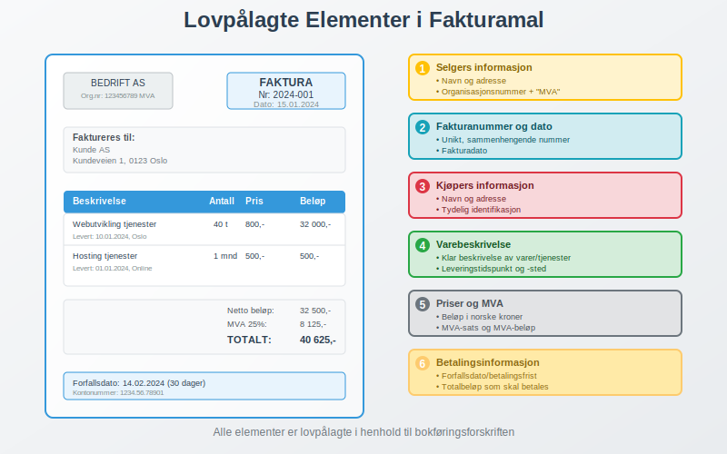
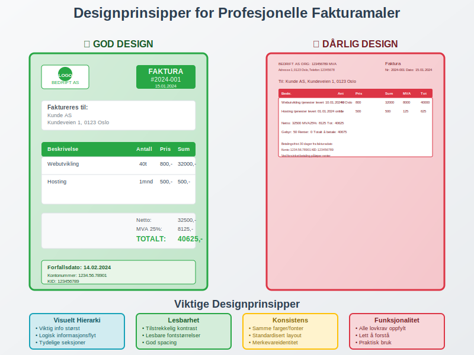
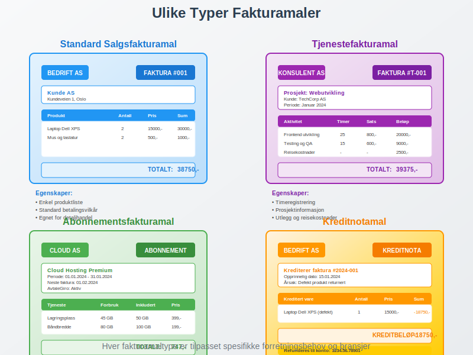
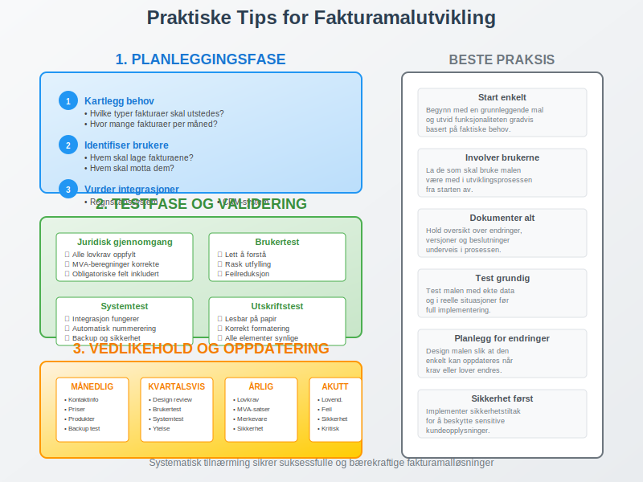

---
title: "Hva er Fakturamal? Komplett Guide til Fakturamaler og Fakturadesign"
meta_title: "Hva er Fakturamal? Komplett Guide til Fakturamaler og Fakturadesign"
meta_description: 'En **fakturamal** er en forhåndsdefinert struktur eller skabelon som brukes til å lage konsistente og profesjonelle [fakturaer](/blogs/regnskap/hva-er-en-fakt...'
slug: hva-er-fakturamal
type: blog
layout: pages/single
---

En **fakturamal** er en forhåndsdefinert struktur eller skabelon som brukes til å lage konsistente og profesjonelle [fakturaer](/blogs/regnskap/hva-er-en-faktura "Hva er en Faktura? En Guide til Norske Fakturakrav"). Fakturamaler sikrer at alle lovpålagte krav oppfylles, fremmer merkevareidentitet og effektiviserer faktureringsprosessen. For bedrifter som bruker [ERP-systemer](/blogs/regnskap/hva-er-erp-system "Hva er ERP-system? Komplett Guide til Enterprise Resource Planning") eller [elektronisk fakturering](/blogs/regnskap/hva-er-elektronisk-fakturering "Hva er Elektronisk Fakturering? Komplett Guide til Digitale Fakturaløsninger"), er gode fakturamaler essensielle for automatisert og feilfri fakturabehandling.

## Seksjon 1: Lovpålagte Krav til Fakturamaler

I Norge reguleres fakturainnhold av [bokføringsforskriften](/blogs/regnskap/hva-er-bokforingsforskriften "Hva er Bokføringsforskriften? Komplett Guide til Norske Bokføringsregler"), og alle fakturamaler må inneholde obligatoriske elementer for å være juridisk gyldige.

### Obligatoriske Elementer i Fakturamal

Enhver fakturamal må inneholde følgende **lovpålagte elementer**:

| Element | Beskrivelse | Plassering |
|---------|-------------|------------|
| **Fakturanummer** | Unikt, maskinelt tildelt nummer i sammenhengende serie | Øverst til høyre |
| **Fakturadato** | Dato for fakturautstedelse | Ved fakturanummer |
| **Selgers informasjon** | Navn, adresse, organisasjonsnummer (+ "MVA" hvis registrert) | Øverst til venstre |
| **Kjøpers informasjon** | Navn og adresse til mottaker | Under selgers info |
| **Varebeskrivelse** | Klar og entydig beskrivelse av varer/tjenester | Hovedtabellen |
| **Leveringsinformasjon** | Tidspunkt og sted for levering | I varebeskrivelsen |
| **Priser og MVA** | Beløp i NOK, MVA-sats og MVA-beløp | Høyre kolonne |
| **Totalbeløp** | Sum som skal betales | Nederst til høyre |
| **Betalingsfrist** | Forfallsdato for betaling | Nederst |

### Spesielle Krav for MVA-registrerte Bedrifter

Bedrifter som er registrert for [merverdiavgift](/blogs/regnskap/hva-er-avgiftsplikt-mva "Hva er Avgiftsplikt (MVA)? Komplett Guide til Merverdiavgift i Norge") må inkludere ytterligere elementer i fakturamalene:

* **MVA-nummer** etter organisasjonsnummer
* **MVA-sats** for hver varelinje (25%, 15%, 12% eller 0%)
* **MVA-beløp** beregnet korrekt for hver sats
* **Total MVA** summert per sats

## Seksjon 2: Designprinsipper for Profesjonelle Fakturamaler

En godt designet fakturamal balanserer **funksjonalitet**, **lesbarhet** og **merkevareidentitet**. Designet påvirker både kundeopplevelsen og den interne effektiviteten ved fakturabehandling.

### Hierarki og Informasjonsstruktur

**Visuelt hierarki** er kritisk for at fakturaer skal være lett å lese og forstå:

1. **Primær informasjon:** Fakturanummer, totalbeløp, forfallsdato
2. **Sekundær informasjon:** Selger/kjøper-detaljer, fakturadato
3. **Detaljinformasjon:** Varelinjer, MVA-beregninger, betalingsinstruksjoner

### Fargebruk og Typografi

* **Merkevarefarger:** Bruk bedriftens fargepalett konsekvent
* **Kontrast:** Sørg for tilstrekkelig kontrast for lesbarhet
* **Typografi:** Velg profesjonelle, lett lesbare fonter
* **Størrelse:** Kritisk informasjon bør være større og tydeligere

### Layout og Plassering

En **logisk layout** følger øyets naturlige lesemønster:

* **Øverst venstre:** Selgers logo og kontaktinformasjon
* **Øverst høyre:** Fakturanummer og -dato
* **Midten:** Kjøpers informasjon og varelinjer
* **Nederst:** Totaler, MVA-sammendrag og betalingsinformasjon

## Seksjon 3: Ulike Typer Fakturamaler

Forskjellige virksomheter og situasjoner krever spesialiserte fakturamaler tilpasset spesifikke behov og bransjer.

### 3.1 Standard Salgsfakturamal

Den mest brukte malen for vanlige salgstransaksjoner:

* **Enkel struktur** med varelinjer, priser og MVA
* **Standardiserte betalingsvilkår**
* **Grunnleggende kontaktinformasjon**
* Egnet for [detaljhandel](/blogs/regnskap/hva-er-detaljhandel "Hva er Detaljhandel? Komplett Guide til Detaljhandelsdrift") og [engroshandel](/blogs/regnskap/hva-er-engroshandel "Hva er Engroshandel? Komplett Guide til Grossistvirksomhet")

### 3.2 Tjenestefakturamal

Spesialisert for tjenestebaserte virksomheter:

* **Timeregistrering** med timer, sats og totaler
* **Prosjektinformasjon** og referanser
* **Detaljerte beskrivelser** av utført arbeid
* **Reisekostnader** og utlegg som separate linjer

### 3.3 Abonnementsfakturamal

For regelmessige, gjentakende fakturaer:

* **Abonnementsperiode** tydelig angitt
* **Automatisk generering** via [AvtaleGiro](/blogs/regnskap/hva-er-avtalegiro "Hva er AvtaleGiro? Komplett Guide til Automatisk Betaling")
* **Forbruks- eller bruksdata** hvis relevant
* **Neste fakturadato** informasjon

### 3.4 Kreditnotamal

Spesiell mal for [kreditnotaer](/blogs/regnskap/hva-er-en-faktura "Hva er en Faktura? En Guide til Norske Fakturakrav"):

* **Tydelig merking** som "KREDITNOTA"
* **Referanse til opprinnelig faktura**
* **Negative beløp** eller "minus"-symboler
* **Ã…rsak til kreditering** beskrevet

### 3.5 Proformafakturamal

For bedrifter som driver med internasjonal handel kreves spesialiserte maler for **[proformafakturaer](/blogs/regnskap/hva-er-proformafaktura "Hva er Proformafaktura? Komplett Guide til Foreløpige Fakturaer")**:

* **Tydelig merking** som "PROFORMA INVOICE" eller "PROFORMAFAKTURA"
* **Disclaimere** om at dokumentet ikke er juridisk bindende
* **HS-koder** for tollkategorisering
* **Opprinnelsesland** og leveringsinformasjon
* **Gyldighetsperiode** for tilbudet
* **Detaljerte produktspesifikasjoner** for tollbehandling

## Seksjon 4: Digitale Fakturamaler og Automatisering

Moderne fakturabehandling beveger seg stadig mot digitale løsninger som integrerer med regnskapssystemer og automatiserer prosesser.

### Integrasjon med Regnskapssystemer

Digitale fakturamaler kan integreres direkte med:

* **[ERP-systemer](/blogs/regnskap/hva-er-erp-system "Hva er ERP-system? Komplett Guide til Enterprise Resource Planning")** for automatisk dataflyt
* **Kunderegistre** for automatisk utfylling av kjøperinformasjon
* **Produktkataloger** med priser og MVA-satser
* **[Bilagsmottak](/blogs/regnskap/hva-er-bilagsmottak "Bilagsmottak - Komplett Guide til Dokumentmottak og Fakturabehandling")** for automatisk arkivering

### eFaktura og Elektroniske Maler

[eFaktura](/blogs/regnskap/hva-er-efaktura "Hva er eFaktura? Komplett Guide til Elektronisk Fakturering i Norge") krever spesielle maler som:

* **Strukturerte data** i XML eller EDI-format
* **Automatisk validering** av lovpålagte krav
* **Direkte levering** til kundens nettbank
* **Reduserte [fakturagebyr](/blogs/regnskap/hva-er-fakturagebyr "Hva er Fakturagebyr? Komplett Guide til Faktureringsgebyrer i Norge")** sammenlignet med papirfakturaer

### Automatisk Fakturagenerering

Avanserte fakturamaler kan automatisere:

* **Fakturanummerering** i sammenhengende serier
* **MVA-beregninger** basert på produktkategorier
* **Forfallsdatoer** basert på betalingsvilkår
* **Purreprosesser** ved forsinket betaling

## Seksjon 5: Praktiske Tips for Fakturamalutvikling

Å utvikle effektive fakturamaler krever planlegging og testing for å sikre både juridisk compliance og operasjonell effektivitet.

### Planleggingsfase

**Før du begynner å designe fakturamal:**

1. **Kartlegg behov:** Hvilke typer fakturaer skal utstedes?
2. **Identifiser brukere:** Hvem skal lage og motta fakturaene?
3. **Vurder integrasjoner:** Hvilke systemer skal malen fungere med?
4. **Definer merkevareidentitet:** Hvordan skal fakturaen reflektere bedriften?

### Testfase og Validering

**Før implementering:**

* **Juridisk gjennomgang:** Kontroller at alle lovkrav er oppfylt
* **Brukertest:** La faktiske brukere teste malen
* **Systemtest:** Verifiser integrasjon med regnskapssystem
* **Utskriftstest:** Kontroller at malen fungerer både digitalt og på papir

### Vedlikehold og Oppdatering

Fakturamaler må **vedlikeholdes regelmessig**:

* **Lovkrav:** Oppdater når regelverk endres
* **Kontaktinformasjon:** Hold selgers informasjon oppdatert
* **Priser og satser:** Juster MVA-satser ved endringer
* **Design:** Oppdater merkevareidentitet ved behov

## Seksjon 6: Vanlige Feil i Fakturamaler

Å unngå vanlige feil i fakturamaldesign kan spare tid, penger og juridiske problemer.

### Juridiske Feil

**Kritiske feil som kan gjøre fakturaer ugyldige:**

* **Manglende obligatoriske elementer** som organisasjonsnummer eller MVA-informasjon
* **Feil MVA-beregninger** eller manglende MVA-spesifikasjon
* **Ugyldig fakturanummerering** som ikke følger sammenhengende serie
* **Manglende leveringsinformasjon** som kreves av bokføringsforskriften

### Designfeil

**Feil som påvirker brukervennlighet:**

* **Dårlig lesbarhet** på grunn av for små fonter eller dårlig kontrast
* **Ulogisk informasjonsflyt** som forvirrer mottakere
* **Inkonsistent merkevarebruk** som svekker profesjonell fremtoning
* **Manglende responsivt design** for mobile enheter

### Tekniske Feil

**Problemer med digitale maler:**

* **Inkompatibilitet** med regnskapssystemer eller e-postprogrammer
* **Feil filformater** som ikke støttes av mottakere
* **Manglende backup** av malene
* **Utilstrekkelig sikkerhet** for sensitive kundeopplysninger

## Seksjon 7: Fremtiden for Fakturamaler

Fakturamalteknologi utvikler seg raskt med nye digitale løsninger og automatiseringsmuligheter.

### Kunstig Intelligens og Automatisering

**AI-drevne fakturamaler** kan:

* **Automatisk kategorisere** varer og tjenester
* **Foreslå priser** basert på historiske data
* **Oppdage feil** før fakturaer sendes
* **Optimalisere layout** for bedre konvertering

### Blockchain og Sikkerhet

**Blockchain-teknologi** kan sikre:

* **Uforanderlighet** av fakturadata
* **Automatisk validering** av transaksjoner
* **Redusert svindel** gjennom kryptografisk sikkerhet
* **Smart contracts** for automatisk betaling

### Bærekraft og Miljøhensyn

**Miljøvennlige fakturamaler** fokuserer på:

* **Papirløse løsninger** som reduserer miljøpåvirkning
* **Optimalisert design** som minimerer utskriftsbehov
* **Digitale arkiver** som erstatter fysisk lagring
* **Energieffektive** digitale prosesser

## Konklusjon

En godt utformet **fakturamal** er mer enn bare et dokument - det er et verktøy som sikrer juridisk compliance, fremmer merkevareidentitet og effektiviserer forretningsprosesser. Ved å følge lovpålagte krav, implementere gode designprinsipper og utnytte moderne teknologi, kan bedrifter skape fakturamaler som både tilfredsstiller regnskapskrav og forbedrer kundeopplevelsen.

For bedrifter som ønsker å modernisere sin faktureringsprosess, er det viktig å vurdere både nåværende behov og fremtidige muligheter. Investeringer i gode fakturamaler og tilhørende systemer vil betale seg tilbake gjennom reduserte administrative kostnader, færre feil og bedre kontantstrøm.

Husk at fakturaer er ofte det første formelle dokumentet kunder mottar fra din bedrift - sørg for at det gjør et profesjonelt og pålitelig inntrykk som reflekterer bedriftens kvalitet og verdier.

