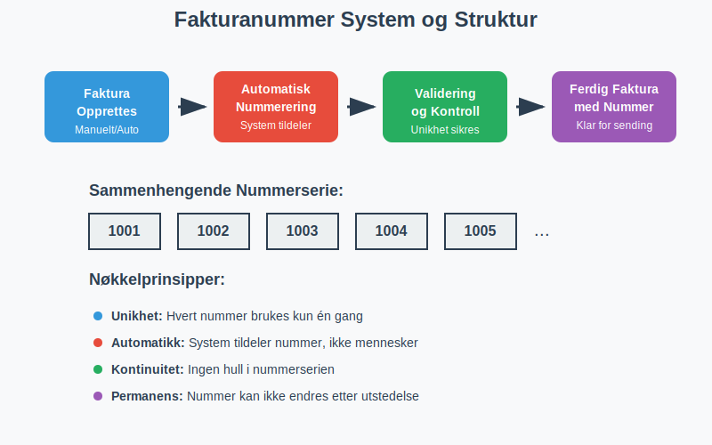
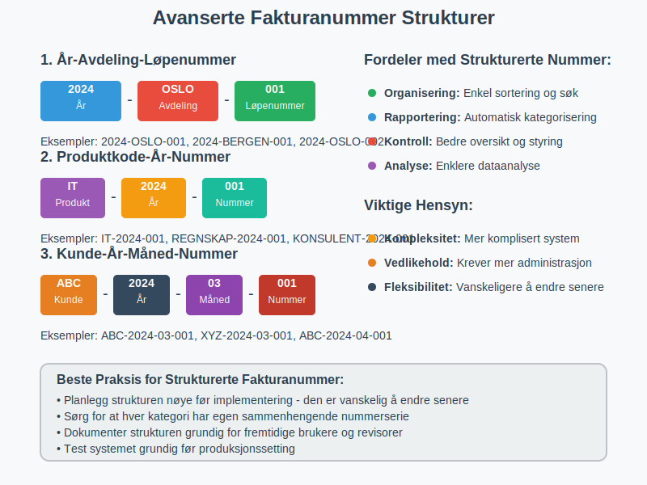
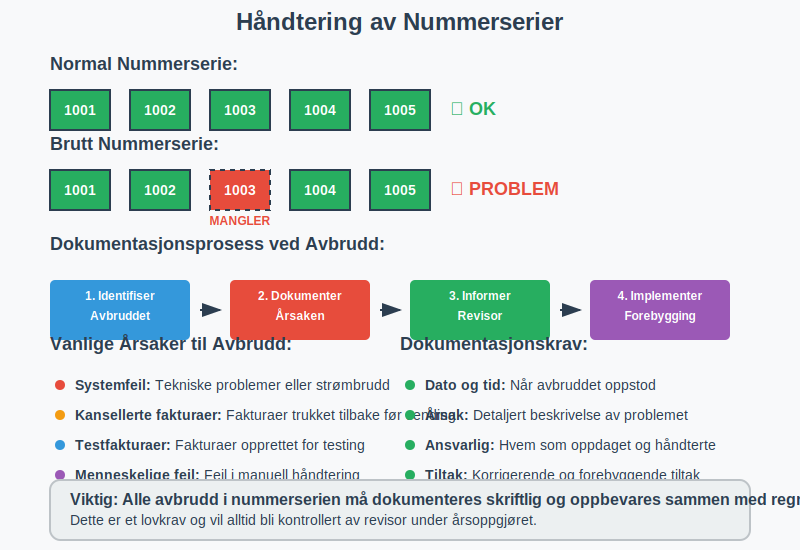

---
title: "Hva er Fakturanummer? Komplett Guide til Nummerering og Lovkrav"
seoTitle: "Hva er Fakturanummer? Komplett Guide til Nummerering og Lovkrav"
description: 'Et **fakturanummer** er en unik identifikator som tildeles hver [faktura](/blogs/regnskap/hva-er-en-faktura "Hva er en Faktura? En Guide til Norske Fakturakrav"...'
---

Et **fakturanummer** er en unik identifikator som tildeles hver [faktura](/blogs/regnskap/hva-er-en-faktura "Hva er en Faktura? En Guide til Norske Fakturakrav") for å sikre sporbarhet, organisering og juridisk etterlevelse i regnskapsføringen. I Norge er korrekt nummerering av fakturaer ikke bare en praktisk nødvendighet, men også et lovpålagt krav som reguleres av [bokføringsforskriften](/blogs/regnskap/hva-er-bokforingsforskriften "Hva er Bokføringsforskriften? Komplett Guide til Norske Regnskapsregler").

Fakturanummer spiller en kritisk rolle i [bilagsføring](/blogs/regnskap/hva-er-bilagsforing "Hva er Bilagsføring? Komplett Guide til Regnskapsdokumentasjon") og er essensielt for korrekt [dokumentasjon i regnskapet](/blogs/regnskap/hva-er-dokumentasjon-regnskap-bokforing "Hva er Dokumentasjon i Regnskap og Bokføring? Lovkrav og Beste Praksis").

## Lovkrav til Fakturanummer i Norge

I henhold til bokføringsforskriften § 5-1 må alle fakturaer ha et **unikt, maskinelt tildelt nummer** som er en del av en **sammenhengende serie**. Dette kravet sikrer at ingen fakturaer kan forsvinne eller manipuleres uten at det oppdages.

### Juridiske Krav til Fakturanummerering

* **Unikhet:** Hvert fakturanummer må være unikt innenfor bedriftens system
* **Maskinell tildeling:** Nummeret må tildeles automatisk av systemet, ikke manuelt
* **Sammenhengende serie:** Ingen hull eller hopp i nummerserien uten dokumentert årsak
* **Kronologisk rekkefølge:** Fakturaer skal normalt nummereres i kronologisk rekkefølge
* **Permanent:** Fakturanummer kan ikke endres etter at fakturaen er utstedt

## Fakturanummer Systemer og Strukturer

Det finnes flere måter å strukturere fakturanummer på, avhengig av bedriftens størrelse, kompleksitet og behov for organisering.

### Enkle Nummerserier

For mindre bedrifter er ofte en enkel, fortløpende nummerserie tilstrekkelig:

| Eksempel | Format | Beskrivelse |
|----------|--------|-------------|
| 1001, 1002, 1003... | Fortløpende | Starter på et bestemt nummer og øker med 1 |
| 2024001, 2024002... | År + løpenummer | Inkluderer årstall for bedre organisering |
| F001, F002, F003... | Prefiks + nummer | Bokstav eller kode foran nummeret |

### Avanserte Nummerstrukturer

Større bedrifter kan ha behov for mer komplekse strukturer som inkluderer informasjon om avdeling, produkttype eller kunde:

| Struktur | Eksempel | Forklaring |
|----------|----------|------------|
| År-Avdeling-Løpenummer | 2024-OSLO-001 | Inkluderer år, avdeling og løpenummer |
| Produktkode-År-Nummer | IT-2024-001 | Produktkategori, år og løpenummer |
| Kunde-År-Måned-Nummer | ABC-2024-03-001 | Kundekode, år, måned og løpenummer |

**Viktig:** Uansett struktur må systemet sikre at ingen nummer gjenbrukes og at serien er sammenhengende innenfor hver kategori.

## Teknisk Implementering av Fakturanummerering

Moderne [ERP-systemer](/blogs/regnskap/hva-er-erp-system "Hva er ERP-system? Komplett Guide til Enterprise Resource Planning") og regnskapsprogrammer håndterer fakturanummerering automatisk, men det er viktig å forstå de underliggende prinsippene.

### Automatisk Nummerering

Alle profesjonelle regnskapssystemer bruker **automatisk nummerering** for å sikre:

* **Konsistens:** Ingen manuelle feil i nummertildeling
* **Etterlevelse:** Automatisk overholdelse av lovkrav
* **Sporbarhet:** Komplett auditspor for alle fakturaer
* **Effektivitet:** Rask og feilfri fakturagenerering

### Database-implementering

Teknisk sett implementeres fakturanummerering ofte med:

1. **Auto-increment felter** i databasen
2. **Sequence generators** for mer kontroll
3. **Låsemekanismer** for å forhindre duplikater ved høy belastning
4. **Backup og recovery** prosedyrer for å sikre kontinuitet

## Håndtering av Avbrudd i Nummerserien

Selv med automatiske systemer kan det oppstå situasjoner hvor nummerserien blir brutt. Dette må håndteres korrekt for å opprettholde juridisk etterlevelse.

### Lovlige Årsaker til Avbrudd

* **Systemfeil:** Tekniske problemer som forhindrer normal drift
* **Kansellerte fakturaer:** Fakturaer som trekkes tilbake før utsendelse
* **Testfakturaer:** Fakturaer opprettet for testing som ikke skal sendes

### Dokumentasjon av Avbrudd

Når nummerserien brytes, må bedriften:

1. **Dokumentere årsaken** til avbruddet skriftlig
2. **Oppbevare dokumentasjonen** sammen med regnskapet
3. **Informere revisor** om avbruddet og årsaken
4. **Implementere rutiner** for å forhindre lignende situasjoner

## Fakturanummer og Internkontroll

Korrekt fakturanummerering er en hjørnestein i bedriftens [internkontroll](/blogs/regnskap/hva-er-avvikshandtering "Hva er Avvikshandtering? Komplett Guide til Internkontroll og Kvalitetssikring") og bidrar til å forhindre svindel og feil.

### Kontrollmekanismer

* **Nummersekvens kontroll:** Regelmessig kontroll av at alle nummer er regnskapsført
* **Tilgangsrestriksjoner:** Kun autorisert personell kan opprette fakturaer
* **Segregering av oppgaver:** Forskjellige personer håndterer opprettelse og godkjenning
* **Periodisk avstemming:** Sammenligning av utstedte fakturaer med regnskapsføring

### Revisjonsaspekter

Revisor vil alltid kontrollere:

1. **Komplett nummerserie:** At alle nummer er regnskapsført eller dokumentert som kansellert
2. **Kronologisk rekkefølge:** At fakturaer er datert i riktig rekkefølge
3. **Systemkontroller:** At automatiske kontroller fungerer som forutsatt
4. **Dokumentasjon:** At eventuelle avvik er tilstrekkelig dokumentert

## Digitale Løsninger og Moderne Praksis

Med utviklingen av [elektronisk fakturering](/blogs/regnskap/hva-er-elektronisk-fakturering "Hva er Elektronisk Fakturering? Komplett Guide til Digitale Fakturaløsninger") og [eFaktura](/blogs/regnskap/hva-er-efaktura "Hva er eFaktura? Komplett Guide til Elektronisk Fakturering i Norge") har fakturanummerering blitt enda mer kritisk for automatisert behandling.

### Integrasjon med Betalingssystemer

Moderne fakturanummer må være kompatible med:

* **[BankGiro](/blogs/regnskap/hva-er-bankgiro "Hva er BankGiro? Komplett Guide til Norsk Betalingssystem") OCR-nummer:** For automatisk avstemming
* **[AvtaleGiro](/blogs/regnskap/hva-er-avtalegiro "Hva er AvtaleGiro? Komplett Guide til Automatisk Betaling") systemer:** For automatisk trekk
* **API-integrasjoner:** For utveksling med andre systemer

### Cloud-baserte Løsninger

Moderne cloud-baserte regnskapssystemer tilbyr:

* **Global nummerering:** Konsistent nummerering på tvers av lokasjoner
* **Backup og redundans:** Automatisk sikkerhetskopi av nummerserier
* **Skalerbarhet:** Håndtering av høye volumer uten ytelsestap
* **Compliance:** Automatisk overholdelse av lokale regelverk

## Internasjonale Aspekter

For bedrifter som opererer internasjonalt, kan fakturanummerering bli mer komplekst på grunn av ulike nasjonale krav.

### Flerlands-operasjoner

Bedrifter med virksomhet i flere land må ofte:

* **Separate nummerserier** per land eller juridisk enhet
* **Lokale tilpasninger** for å møte nasjonale krav
* **Konsolidering** for konsernrapportering
* **Valutahåndtering** i nummerstrukturer

### EU-krav og Standarder

Innenfor EU finnes det harmoniserte krav til:

* **Elektroniske fakturaer** i offentlig sektor
* **Strukturerte data** for automatisk behandling
* **Arkivering** og oppbevaring av elektroniske dokumenter

## Beste Praksis for Fakturanummerering

Basert på erfaring fra regnskapsbransjen og juridiske krav, anbefales følgende beste praksis:

### Planlegging og Design

* **Start med høyt nummer:** Unngå å avsløre fakturavolum ved å starte på f.eks. 1000
* **Reservér kapasitet:** Planlegg for fremtidig vekst i nummerstrukturen
* **Konsistent format:** Bruk samme format på tvers av alle fakturatyper
* **Dokumentér systemet:** Oppretthold klar dokumentasjon av nummeringslogikken

### Operasjonelle Rutiner

* **Daglig kontroll:** Kontroller at nummerserien er intakt
* **Månedlig avstemming:** Sammenlign utstedte fakturaer med regnskapsføring
* **Årlig gjennomgang:** Evaluer nummeringssystemet og juster ved behov
* **Backup-prosedyrer:** Sikre at nummerserier kan gjenopprettes ved systemfeil

### Feilhåndtering

Når feil oppstår i fakturanummerering:

1. **Stopp systemet** umiddelbart for å forhindre ytterligere feil
2. **Dokumentér feilen** grundig med tidspunkt og årsak
3. **Kontakt systemleverandør** for teknisk støtte
4. **Informér revisor** om feilen og korrigerende tiltak
5. **Implementér forebyggende tiltak** for å unngå gjentakelse

## Konsekvenser av Feil Fakturanummerering

Feil i fakturanummerering kan få alvorlige konsekvenser for bedriften:

### Juridiske Konsekvenser

* **Brudd på bokføringsloven:** Kan medføre bøter og sanksjoner
* **Revisjonsmerknader:** Negative uttalelser fra revisor
* **Skattemessige problemer:** Vanskeligheter med skattemyndighetene
* **Tap av kredibilitet:** Redusert tillit fra kunder og leverandører

### Operasjonelle Problemer

* **Forvirring i regnskapet:** Vanskelig å spore transaksjoner
* **Betalingsproblemer:** Kunder kan ikke identifisere fakturaer korrekt
* **Systemintegrasjon:** Problemer med automatisk behandling
* **Tidsbruk:** Økt manuell arbeid for å rette opp feil

## Fremtidige Utviklingstrender

Fakturanummerering utvikler seg kontinuerlig med ny teknologi og endrede krav:

### Blockchain og Distribuerte Systemer

* **Uforanderlige poster:** Blockchain kan sikre at fakturanummer aldri kan endres
* **Desentralisert validering:** Automatisk verifisering av nummerserier
* **Smart contracts:** Automatisk opprettelse og nummerering av fakturaer

### Kunstig Intelligens

* **Prediktiv analyse:** AI kan forutsi og forhindre nummeringsfeil
* **Automatisk korrigering:** Intelligente systemer som retter opp mindre feil
* **Anomalideteksjon:** Automatisk oppdagelse av uregelmessigheter

### Standardisering

* **Globale standarder:** Utvikling av internasjonale standarder for fakturanummerering
* **API-standarder:** Harmoniserte grensesnitt for systemintegrasjon
* **Semantisk nummerering:** Nummer som bærer mer informasjon om fakturaens innhold

## Sammendrag og Anbefalinger

Fakturanummer er langt mer enn bare en identifikator - det er en kritisk komponent i bedriftens regnskaps- og kontrollsystem. For å sikre korrekt håndtering anbefales det å:

* **Implementere automatiske systemer** som sikrer lovmessig nummerering
* **Etablere klare rutiner** for kontroll og oppfølging
* **Dokumentere alle avvik** grundig og systematisk
* **Holde seg oppdatert** på teknologiske utviklinger og regulatoriske endringer
* **Investere i kvalitetssystemer** som kan vokse med bedriften

Korrekt fakturanummerering er en investering i bedriftens fremtid - det sikrer ikke bare juridisk etterlevelse, men også operasjonell effektivitet og tillit fra alle interessenter.

For mer informasjon om relaterte emner, se våre artikler om [fakturagebyr](/blogs/regnskap/hva-er-fakturagebyr "Hva er Fakturagebyr? Komplett Guide til Faktureringsgebyrer i Norge"), [elektronisk fakturering](/blogs/regnskap/hva-er-elektronisk-fakturering "Hva er Elektronisk Fakturering? Komplett Guide til Digitale Fakturaløsninger"), og [attestering av bilag](/blogs/regnskap/hva-er-attestering "Hva er Attestering? En Komplett Guide til Bilagsbehandling og Godkjenning").

