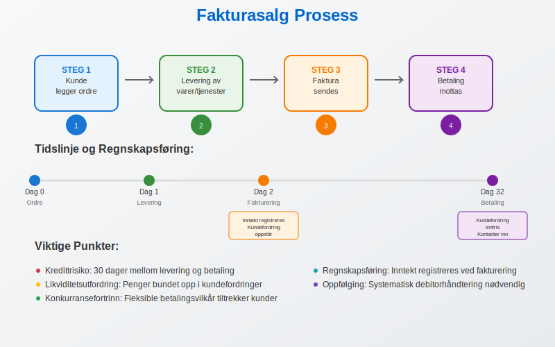
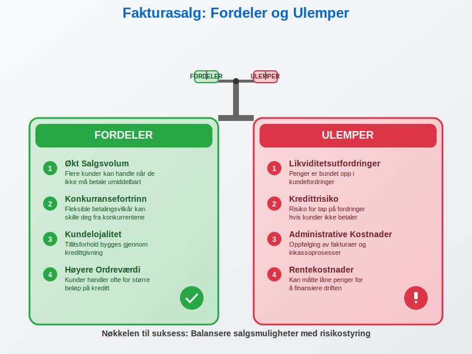
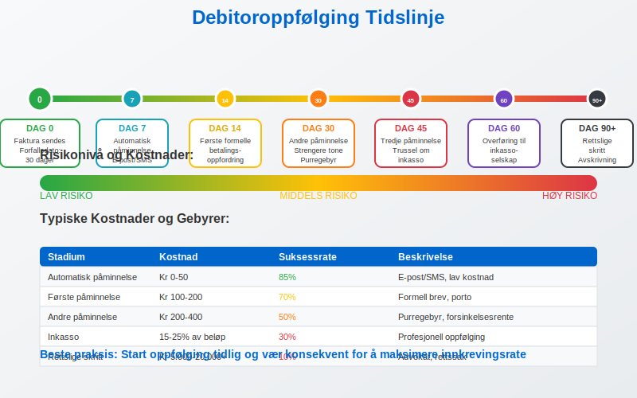
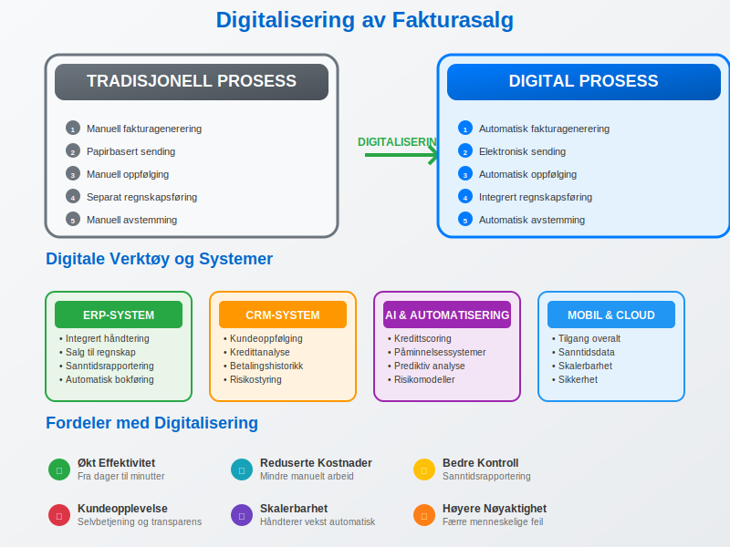
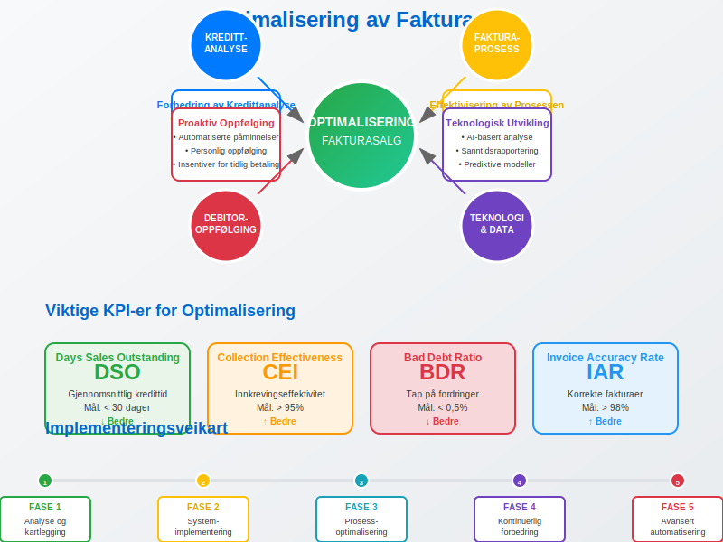

---
title: "Hva er Fakturasalg? Komplett Guide til Kredittgivning og Debitorhåndtering"
meta_title: "Hva er Fakturasalg? Komplett Guide til Kredittgivning og Debitorhåndtering"
meta_description: '**Fakturasalg** er en regnskapsmetode hvor inntekter registreres på det tidspunktet en [faktura](/blogs/regnskap/hva-er-en-faktura "Hva er en Faktura? En Guide...'
slug: hva-er-fakturasalg
type: blog
layout: pages/single
---

**Fakturasalg** er en regnskapsmetode hvor inntekter registreres på det tidspunktet en [faktura](/blogs/regnskap/hva-er-en-faktura "Hva er en Faktura? En Guide til Norske Fakturakrav") utstedes til kunden, uavhengig av når betalingen faktisk mottas. Dette er en fundamental del av [periodiseringsprinsippet](/blogs/regnskap/hva-er-bokforingsregler "Hva er Bokføringsregler? Komplett Guide til Norske Regnskapsregler") i regnskapet og påvirker direkte bedriftens [driftsresultat](/blogs/regnskap/hva-er-driftsresultat "Hva er Driftsresultat? Beregning, Analyse og Praktiske Eksempler") og [likviditetsstyring](/blogs/regnskap/hva-er-betalingsevne "Hva er Betalingsevne? Analyse av Likviditet og Finansiell Stabilitet").

For en grundig introduksjon til **salg** i regnskap, se artikkelen [Salg](/blogs/regnskap/salg "Salg “ Oversikt over salgskonsepter i Norsk Regnskap").

## Seksjon 1: Grunnleggende om Fakturasalg

Fakturasalg skiller seg fra kontantsalg ved at det oppstår et **tidsintervall** mellom leveranse og betaling. Dette skaper både muligheter og utfordringer for bedriften, da det påvirker [arbeidskapitalen](/blogs/regnskap/hva-er-arbeidskapital "Hva er Arbeidskapital? Beregning og Styring av Driftskapital") og krever aktiv [debitoroppfølging](/blogs/regnskap/hva-er-debitor "Hva er Debitor? Komplett Guide til Kundefordringer og Oppfølging").

### Kjennetegn ved Fakturasalg

* **Kredittid:** Kunden får en betalingsfrist, vanligvis 14-30 dager
* **Risiko:** Bedriften bærer risikoen for at kunden ikke betaler
* **Kontantstrøm:** Negativ påvirkning på kortsiktig likviditet
* **Kundeservice:** Økt kundetilfredshet gjennom fleksible betalingsvilkår

## Seksjon 2: Regnskapsføring av Fakturasalg

Når en bedrift selger på faktura, må transaksjonen **bokføres korrekt** i henhold til [dobbel bokføring](/blogs/regnskap/hva-er-dobbel-bokforing "Hva er Dobbel Bokføring? Grunnleggende Prinsipper og Praktisk Anvendelse") og norske regnskapsregler.

### Bokføringseksempel

Ved salg av varer for 10.000 kr + 2.500 kr MVA på faktura:

| Konto | Kontonavn | Debet | Kredit |
|-------|-----------|-------|--------|
| 1500 | Kundefordringer | 12.500 |  |
| 3000 | Salgsinntekt |  | 10.000 |
| 2700 | Utgående MVA |  | 2.500 |

NÃ¥r fakturaen betales, reverseres kundefordringen:

| Konto | Kontonavn | Debet | Kredit |
|-------|-----------|-------|--------|
| 1900 | Bank | 12.500 |  |
| 1500 | Kundefordringer |  | 12.500 |

## Seksjon 3: Fordeler og Ulemper med Fakturasalg

### Fordeler for Bedriften

* **Økt salgsvolum:** Flere kunder kan handle når de ikke må betale umiddelbart
* **Konkurransefortrinn:** Fleksible betalingsvilkår kan skille deg fra konkurrentene
* **Kundelojalitet:** Tillitsforhold bygges gjennom kredittgivning
* **Høyere ordreværdi:** Kunder handler ofte for større beløp på kreditt

### Ulemper og Risikoer

* **[Likviditetsutfordringer](/blogs/regnskap/hva-er-betalingsevne "Hva er Betalingsevne? Analyse av Likviditet og Finansiell Stabilitet"):** Penger er bundet opp i kundefordringer
* **Kredittrisiko:** Risiko for tap på fordringer
* **Administrative kostnader:** Oppfølging av fakturaer og [inkasso](/blogs/regnskap/hva-er-betalingsoppfordring "Betalingsoppfordring - Komplett Guide til Purring og Inkasso i Norge")
* **Rentekostnader:** Kan måtte låne penger for å finansiere driften

## Seksjon 4: Kredittanalyse og Kundevurdering

Før en bedrift tilbyr fakturasalg til nye [kunder](/blogs/regnskap/hva-er-kunde "Hva er en Kunde? Komplett Guide til Kundehåndtering i Regnskap"), bør det gjennomføres en **grundig kredittanalyse** for å minimere risikoen for tap.

### Kredittanalyseprosess

1. **Innhenting av kredittopplysninger**
   * Kredittsjekk hos Bisnode, Experian eller lignende
   * Årsregnskap og nøkkeltall
   * Referanser fra andre leverandører

2. **Vurdering av betalingsevne**
   * Analyse av [likviditet](/blogs/regnskap/hva-er-betalingsevne "Hva er Betalingsevne? Analyse av Likviditet og Finansiell Stabilitet")
   * [Egenkapitalandel](/blogs/regnskap/hva-er-egenkapital "Hva er Egenkapital? Beregning, Analyse og Betydning for Bedriften")
   * Historisk betalingsadferd

3. **Fastsettelse av kredittramme**
   * Maksimalt utestående beløp per kunde
   * Betalingsvilkår og kredittid
   * Sikkerhetsstillelse ved behov

### Kredittklassifisering av Kunder

| Risikoklasse | Beskrivelse | Kredittramme | Betalingsvilkår |
|--------------|-------------|--------------|-----------------|
| A - Lav risiko | Etablerte kunder med god betalingshistorikk | Høy | 30 dager |
| B - Middels risiko | Nye kunder med akseptabel økonomi | Middels | 14 dager |
| C - Høy risiko | Kunder med svak økonomi eller dårlig historie | Lav | Forskudd/kontant |

## Seksjon 5: Oppfølging og Debitorhåndtering

Effektiv **debitorhåndtering** er kritisk for suksess med fakturasalg. Dette innebærer systematisk oppfølging av utestående fakturaer og proaktiv kommunikasjon med kunder.

### Debitoroppfølgingsprosess

* **Dag 0:** Faktura sendes med tydelig forfallsdato
* **Dag 7:** Automatisk påminnelse via e-post eller SMS
* **Dag 14:** Første formelle [betalingsoppfordring](/blogs/regnskap/hva-er-betalingsoppfordring "Betalingsoppfordring - Komplett Guide til Purring og Inkasso i Norge")
* **Dag 30:** Andre påminnelse med strengere tone
* **Dag 45:** Tredje påminnelse med trussel om inkasso
* **Dag 60:** Overføring til inkassoselskap

### Nøkkeltall for Debitoroppfølging

| Nøkkeltall | Beregning | Målsetting |
|------------|-----------|------------|
| Gjennomsnittlig kredittid | (Kundefordringer × 365) / Omsetning | < 30 dager |
| Andel forfalte fordringer | Forfalte fordringer / Totale fordringer | < 5% |
| Tapsprosent | Tap på fordringer / Omsetning | < 0,5% |

## Seksjon 6: Finansiering av Fakturasalg

Fakturasalg binder opp **arbeidskapital**, og bedrifter må ofte finansiere denne kapitalbindingen gjennom ulike finansieringsløsninger.

### Finansieringsalternativer

#### Tradisjonell Bankfinansiering
* **Driftskreditt:** Fleksibel kredittramme for å dekke kortsiktige likviditetsbehov
* **Kundefordringslån:** Lån med kundefordringer som sikkerhet
* **Kontokredit:** Overtrekksrett på bankkonto

#### Alternative Finansieringsløsninger
* **[Factoring](/blogs/regnskap/hva-er-factoring "Hva er Factoring? Komplett Guide til Finansiering av Kundefordringer"):** Salg av kundefordringer til finansieringsselskap
* **Invoice Trading:** Digital plattform for handel med fakturaer
* **Supply Chain Finance:** Leverandørfinansiering gjennom kjøpers bank

### Kostnader ved Finansiering

| Finansieringstype | Typisk Rente/Gebyr | Fordeler | Ulemper |
|-------------------|-------------------|----------|---------|
| Driftskreditt | 3-8% p.a. | Fleksibel, rask tilgang | Krav til sikkerhet |
| Factoring | 1-3% av fakturabeløp | Ingen kredittrisiko | Høyere kostnader |
| Invoice Trading | 0,5-2% av fakturabeløp | Konkurransedyktige priser | Begrenset tilgjengelighet |

## Seksjon 7: Digitalisering av Fakturasalg

Moderne teknologi har revolusjonert fakturasalgsprosessen, fra [elektronisk fakturering](/blogs/regnskap/hva-er-elektronisk-fakturering "Hva er Elektronisk Fakturering? Komplett Guide til Digitale Fakturaløsninger") til automatisert debitoroppfølging.

### Digitale Verktøy og Systemer

* **[ERP-systemer](/blogs/regnskap/hva-er-erp-system "Hva er ERP-system? Komplett Guide til Enterprise Resource Planning"):** Integrert håndtering av salg, fakturering og regnskap
* **CRM-systemer:** Kundeoppfølging og kredittanalyse
* **Automatiserte påminnelsessystemer:** Reduserer manuelt arbeid
* **AI-basert kredittscoring:** Forbedret risikovurdering

### Fordeler med Digitalisering

* **Reduserte administrative kostnader:** Automatisering av rutineoppgaver
* **Raskere fakturabehandling:** Fra dager til minutter
* **Bedre kontroll:** Sanntidsrapportering og dashboards
* **Forbedret kundeopplevelse:** Selvbetjening og transparens

## Seksjon 8: Juridiske Aspekter ved Fakturasalg

Fakturasalg er regulert av flere lover og forskrifter som bedrifter må forholde seg til.

### Relevant Lovgivning

* **[Bokføringsloven](/blogs/regnskap/hva-er-bokforingsloven "Hva er Bokføringsloven? Komplett Guide til Norsk Bokføringslovgivning"):** Krav til dokumentasjon og oppbevaring
* **[Bokføringsforskriften](/blogs/regnskap/hva-er-bokforingsforskriften "Hva er Bokføringsforskriften? Detaljerte Regler for Norsk Bokføring"):** Spesifikke krav til fakturainnhold
* **Inkassoloven:** Regulerer oppfølging av forfalte fordringer
* **Forsinkelsesrenteloven:** Renter ved forsinket betaling

### Viktige Juridiske Prinsipper

* **Avtalefriheten:** Partene kan avtale betalingsvilkår
* **Lojalitetsplikten:** Begge parter skal opptre lojalt
* **Forsinkelsesrente:** Automatisk påløp fra forfallsdato
* **Bevisbyrden:** Leverandør må bevise leveranse

## Seksjon 9: Bransjespesifikke Utfordringer

Ulike bransjer har forskjellige utfordringer knyttet til fakturasalg, avhengig av kundestruktur, produkttype og markedsforhold.

### B2B vs B2C Fakturasalg

#### Business-to-Business (B2B)
* **Lengre kredittider:** 30-60 dager er vanlig
* **Større ordreverdier:** Høyere risiko per kunde
* **Profesjonelle innkjøpsprosesser:** Mer forutsigbare betalingsmønstre
* **Kontraktuelle forhold:** Detaljerte leveringsvilkår

#### Business-to-Consumer (B2C)
* **Kortere kredittider:** 14-30 dager
* **Mindre ordreverdier:** Lavere risiko per transaksjon
* **Impulskjøp:** Mindre planlagte innkjøp
* **Forbrukerrettigheter:** Strengere regulering

### Bransjespesifikke Utfordringer

| Bransje | Typisk Kredittid | Hovedutfordringer |
|---------|------------------|-------------------|
| Bygg og anlegg | 45-60 dager | Lange prosjekter, underleverandørkjeder |
| Detaljhandel | 14-30 dager | Høyt volum, lave marginer |
| Konsulentvirksomhet | 30 dager | Tjenestekvalitet, faktureringsgrunnlag |
| Industri | 30-45 dager | Sesongvariasjoner, råvarepriser |

## Seksjon 10: MÃ¥ling og Optimalisering

For å lykkes med fakturasalg må bedrifter kontinuerlig **måle og optimalisere** sine prosesser basert på relevante nøkkeltall.

### Viktige KPI-er for Fakturasalg

* **Days Sales Outstanding (DSO):** Gjennomsnittlig tid fra salg til betaling
* **Collection Effectiveness Index (CEI):** Effektivitet i innkrevingsprosessen  
* **Bad Debt Ratio:** Andel tap på fordringer
* **Invoice Accuracy Rate:** Andel korrekte fakturaer første gang

### Optimaliseringsstrategier

#### Forbedring av Kredittanalyse
* Implementer automatiserte kredittsjekker
* Utvikle interne scoringmodeller
* Regelmessig oppdatering av kundedata

#### Effektivisering av Fakturaprosessen
* Automatiser fakturagenerering
* Implementer [elektronisk fakturering](/blogs/regnskap/hva-er-elektronisk-fakturering "Hva er Elektronisk Fakturering? Komplett Guide til Digitale Fakturaløsninger")
* Reduser faktureringsfeil gjennom kvalitetskontroll

#### Proaktiv Debitoroppfølging
* Automatiserte påminnelsessystemer
* Personlig oppfølging av store kunder
* Insentiver for tidlig betaling

## Seksjon 11: Internkontroll og Risikostyring

Effektiv **internkontroll** er essensielt for å minimere risiko og sikre korrekt håndtering av fakturasalg.

### Kontrollaktiviteter

* **Segregering av oppgaver:** Skille mellom salg, fakturering og innkreving
* **Autorisasjonsnivåer:** Klare fullmakter for kredittgivning
* **Regelmessige avstemminger:** Kontroll av kundefordringer
* **Dokumentasjonskrav:** Sporbarhet i alle transaksjoner

### Risikoidentifikasjon og -håndtering

#### Operasjonelle Risikoer
* Faktureringsfeil og manglende dokumentasjon
* Utilstrekkelig kredittanalyse
* Ineffektiv debitoroppfølging

#### Finansielle Risikoer  
* Konsentrasjonsrisiko (få store kunder)
* Valutarisiko ved internasjonalt salg
* Likviditetsrisiko ved lang kredittid

#### Strategiske Risikoer
* Endringer i markedsforhold
* Ny konkurransesituasjon
* Regulatoriske endringer

## Seksjon 12: Fremtidige Trender

Fakturasalg utvikler seg kontinuerlig, drevet av teknologiske fremskritt og endrede kundeforventninger.

### Teknologiske Trender

* **Kunstig intelligens:** Forbedret kredittscoring og risikoanalyse
* **Blockchain:** Økt sikkerhet og transparens i transaksjoner
* **Open Banking:** Bedre tilgang til kunders finansielle data
* **Sanntidsbetalinger:** Redusert kredittid og likviditetsrisiko

### Markedstrender

* **Økt fokus på bærekraft:** ESG-kriterier i kredittanalyse
* **Personalisering:** Skreddersydde betalingsløsninger
* **Integrerte økosystemer:** Helhetlige finansielle tjenester
* **Regulatoriske endringer:** Strengere krav til dokumentasjon

## Konklusjon

Fakturasalg er en **kompleks forretningsprosess** som krever grundig planlegging, effektive systemer og kontinuerlig oppfølging. Når det håndteres korrekt, kan det være en kraftig driver for vekst og kundetilfredshet. Nøkkelen til suksess ligger i å balansere **salgsmuligheter** med **risikostyring**, samtidig som man utnytter moderne teknologi for å optimalisere prosessene.

Bedrifter som mestrer fakturasalg vil ha et betydelig konkurransefortrinn gjennom forbedret [kontantstrøm](/blogs/regnskap/hva-er-betalingsevne "Hva er Betalingsevne? Analyse av Likviditet og Finansiell Stabilitet"), sterkere kunderelasjoner og mer effektive operasjoner. Det krever imidlertid kontinuerlig fokus på [internkontroll](/blogs/regnskap/hva-er-attestering "Hva er Attestering? En Komplett Guide til Bilagsbehandling og Godkjenning"), teknologisk utvikling og tilpasning til endrede markedsforhold.

