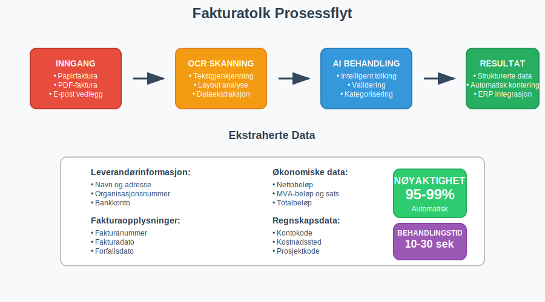
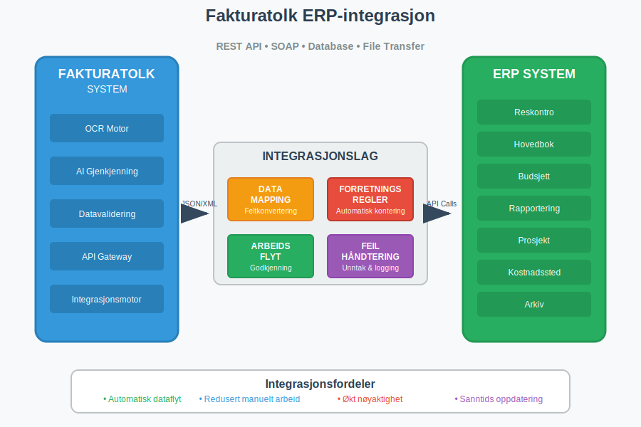

---
title: "Hva er Fakturatolk? Automatisk Fakturabehandling og OCR-teknologi"
meta_title: "Hva er Fakturatolk? Automatisk Fakturabehandling og OCR-teknologi"
meta_description: '**Fakturatolk** er en avansert teknologi som kombinerer **OCR (Optical Character Recognition)** og **kunstig intelligens** for å automatisk lese, tolke og beha...'
slug: hva-er-fakturatolk
type: blog
layout: pages/single
---

**Fakturatolk** er en avansert teknologi som kombinerer **OCR (Optical Character Recognition)** og **kunstig intelligens** for å automatisk lese, tolke og behandle fakturaer. Denne teknologien har revolusjonert måten bedrifter håndterer [fakturabehandling](/blogs/regnskap/hva-er-en-faktura "Hva er en Faktura? En Guide til Norske Fakturakrav") på, og reduserer betydelig det manuelle arbeidet som tradisjonelt har vært nødvendig for å behandle innkommende fakturaer.

I moderne [regnskapsføring](/blogs/regnskap/hva-er-regnskap "Hva er Regnskap? Komplett Guide til Regnskapsføring og Bokføring") er fakturatolk blitt et uunnværlig verktøy for å effektivisere [bilagsmottak](/blogs/regnskap/hva-er-bilagsmottak "Bilagsmottak - Komplett Guide til Dokumentmottak og Fakturabehandling") og sikre nøyaktig registrering av alle innkommende fakturaer.

## Seksjon 1: Hvordan Fakturatolk Fungerer

Fakturatolk-teknologi baserer seg på flere avanserte komponenter som arbeider sammen for å automatisere fakturabehandlingen:

### 1.1 OCR-teknologi (Optical Character Recognition)

**OCR-teknologi** er kjernen i fakturatolk-systemet. Den konverterer bilder av tekst til maskinlesbar tekst ved å:

* **Skanne dokumentet:** Analyserer fakturaens layout og identifiserer tekstområder
* **Gjenkjenne tegn:** Konverterer pixler til bokstaver, tall og symboler
* **Strukturere data:** Organiserer informasjonen i logiske felt

### 1.2 Kunstig Intelligens og Maskinlæring

Moderne fakturatolk-systemer bruker **AI-algoritmer** for å:

* **Lære fra mønstre:** Forbedre nøyaktigheten over tid basert på behandlede fakturaer
* **Forstå kontekst:** Tolke informasjon basert på plassering og sammenheng
* **Håndtere variasjon:** Tilpasse seg ulike fakturaformater og leverandører

## Seksjon 2: Fordeler med Fakturatolk

Implementering av fakturatolk-teknologi gir betydelige fordeler for bedrifter av alle størrelser:

### 2.1 Tidsbesparelse og Effektivitet

| Prosess | Manuell Behandling | Med Fakturatolk | Tidsbesparelse |
|---------|-------------------|-----------------|----------------|
| Dataregistrering | 3-5 minutter | 10-30 sekunder | 85-95% |
| Kvalitetskontroll | 2-3 minutter | 30 sekunder | 75-85% |
| Arkivering | 1-2 minutter | Automatisk | 100% |
| **Total per faktura** | **6-10 minutter** | **1-2 minutter** | **80-90%** |

### 2.2 Reduserte Feil og Økt Nøyaktighet

Fakturatolk eliminerer vanlige menneskelige feil som oppstår ved manuell dataregistrering:

* **Tastefeil:** Automatisk registrering reduserer risikoen for feilaktig inntasting
* **Lesbarhetsutfordringer:** OCR håndterer dårlig håndskrift og utydelige dokumenter
* **Konsistens:** Standardisert behandling sikrer lik kvalitet på alle fakturaer

### 2.3 Forbedret Internkontroll

Fakturatolk styrker bedriftens [internkontroll](/blogs/regnskap/hva-er-attestering "Hva er Attestering? En Komplett Guide til Bilagsbehandling og Godkjenning") gjennom:

* **Sporbarhet:** Komplett logg over alle behandlede fakturaer
* **Validering:** Automatisk kontroll mot forventede verdier og mønstre
* **Rapportering:** Detaljerte rapporter over behandlingsstatus og eventuelle avvik

## Seksjon 3: Integrasjon med Regnskapssystemer

Moderne fakturatolk-løsninger integreres sømløst med eksisterende [ERP-systemer](/blogs/regnskap/hva-er-erp-system "Hva er ERP-system? Komplett Guide til Enterprise Resource Planning") og regnskapsprogramvare. Denne integrasjonen bygger på [API-integrasjon og automatisering](/blogs/regnskap/api-integrasjon-automatisering-regnskap "API Integrasjon og Automatisering av Regnskap - Komplett Guide til Digital Regnskapsføring") som sikrer sømløs dataflyt fra fakturatolk til regnskapssystemet:

### 3.1 Automatisk Kontering

Fakturatolk kan automatisk foreslå eller utføre kontering basert på:

* **Leverandørhistorikk:** Tidligere konterte fakturaer fra samme leverandør
* **Produktkategorier:** Automatisk klassifisering basert på varebeskrivelse
* **Kostnadssteder:** Tildeling til riktige avdelinger eller prosjekter

### 3.2 Godkjenningsarbeidsflyt

Systemet kan automatisk rute fakturaer gjennom definerte godkjenningsarbeidsflyter:

1. **Automatisk godkjenning:** For fakturaer under definerte beløpsgrenser
2. **Enkel godkjenning:** For fakturaer som matcher forventede mønstre
3. **Manuell godkjenning:** For avvikende eller høye beløp

## Seksjon 4: Typer Fakturatolk-teknologi

Det finnes flere ulike tilnærminger til fakturatolk, hver med sine styrker og anvendelsesområder:

### 4.1 Template-basert Gjenkjenning

**Template-baserte systemer** bruker forhåndsdefinerte maler for kjente fakturaformater:

**Fordeler:**
* Høy nøyaktighet for kjente formater
* Rask implementering for standardleverandører
* Lavere kostnad for enkle løsninger

**Ulemper:**
* Begrenset fleksibilitet for nye formater
* Krever manuell oppsett for hver leverandør
* Vanskelig å håndtere layoutendringer

### 4.2 AI-basert Intelligent Gjenkjenning

**AI-baserte systemer** bruker maskinlæring for å forstå fakturaer uavhengig av format:

**Fordeler:**
* HÃ¥ndterer alle fakturaformater automatisk
* Lærer og forbedres kontinuerlig
* Krever minimal manuell konfigurasjon

**Ulemper:**
* Høyere initial kostnad
* Krever treningsdata for optimal ytelse
* Mer kompleks implementering

### 4.3 Hybrid-løsninger

Mange moderne systemer kombinerer begge tilnærminger for optimal resultat:

* **Template-basert** for kjente, høyvolum leverandører
* **AI-basert** for nye eller sjeldne fakturaformater
* **Kontinuerlig læring** for å forbedre begge tilnærminger

## Seksjon 5: Implementering av Fakturatolk

Vellykket implementering av fakturatolk krever grundig planlegging og systematisk tilnærming:

### 5.1 Forberedelse og Planlegging

**Kartlegging av nåværende prosesser:**
* Analyser eksisterende fakturavolum og -typer
* Identifiser flaskehalser i dagens arbeidsflyt
* Definer målsetninger for automatisering

**Leverandøranalyse:**
* Kategoriser leverandører etter volum og fakturaformat
* Identifiser de mest kritiske leverandørene for pilotfase
* Vurder behovet for spesialtilpasninger

### 5.2 Teknisk Implementering

| Implementeringsfase | Varighet | Hovedaktiviteter |
|-------------------|----------|------------------|
| **Fase 1: Oppsett** | 2-4 uker | Systemkonfigurasjon, integrasjoner |
| **Fase 2: Testing** | 2-3 uker | Pilottesting med utvalgte leverandører |
| **Fase 3: Trening** | 1-2 uker | Opplæring av brukere og prosedyrer |
| **Fase 4: Utrulling** | 2-4 uker | Gradvis overgang til full produksjon |

### 5.3 Kvalitetssikring og Oppfølging

**Kontinuerlig overvåking:**
* Måling av nøyaktighetsrater og behandlingstider
* Identifisering av problemområder og forbedringspotensial
* Regelmessig kalibrering av AI-modeller

**Brukeropplæring:**
* Opplæring i nye arbeidsflyter og verktøy
* Etablering av rutiner for kvalitetskontroll
* Dokumentasjon av beste praksis

## Seksjon 6: Kostnader og ROI

Investering i fakturatolk-teknologi gir målbare økonomiske fordeler:

### 6.1 Kostnadselementer

**Direkte kostnader:**
* Lisenskostnader for programvare
* Implementering og konfigurasjon
* Opplæring og endringsledelse
* Løpende support og vedlikehold

**Indirekte kostnader:**
* Tid brukt på testing og kvalitetssikring
* Midlertidig redusert produktivitet under overgang
* Eventuelle systemintegrasjonskostnader

### 6.2 Besparelser og Gevinster

**Direkte besparelser:**
* Reduserte lønnskostnader for manuell fakturabehandling
* Færre feil og korrigeringer
* Raskere behandlingstid og bedre [betalingsevne](/blogs/regnskap/hva-er-betalingsevne "Hva er Betalingsevne? Analyse av Likviditet og Finansiell Stabilitet")

**Indirekte gevinster:**
* Forbedret leverandørrelasjoner gjennom raskere betaling
* Bedre kontroll og oversikt over forpliktelser
* Frigjort kapasitet til mer verdiskapende aktiviteter

### 6.3 ROI-beregning

For en typisk bedrift med 1000 fakturaer per måned:

| Kostnadselement | Før Fakturatolk | Etter Fakturatolk | Årlig Besparelse |
|----------------|-----------------|-------------------|------------------|
| Lønnskostnader | 500 000 kr | 150 000 kr | 350 000 kr |
| Feilkostnader | 50 000 kr | 10 000 kr | 40 000 kr |
| **Total besparelse** | | | **390 000 kr** |
| **Investeringskostnad** | | | **200 000 kr** |
| **Tilbakebetalingstid** | | | **6 måneder** |

## Seksjon 7: Utfordringer og Begrensninger

Selv om fakturatolk-teknologi er kraftig, finnes det fortsatt utfordringer som må håndteres:

### 7.1 Tekniske Utfordringer

**Dokumentkvalitet:**
* Dårlig skannekvalitet kan redusere nøyaktigheten
* Håndskrevne notater og tillegg kan være vanskelige å tolke
* Skadede eller ufullstendige dokumenter krever manuell behandling

**Formatvariasjon:**
* Nye leverandører med ukjente formater
* Endringer i eksisterende fakturaformater
* Spesielle dokumenttyper som kreditnotaer og proformafakturaer

### 7.2 Organisatoriske Utfordringer

**Endringsledelse:**
* Motstand mot nye arbeidsmetoder
* Behov for omskilling av ansatte
* Endring av etablerte rutiner og prosedyrer

**Kvalitetskontroll:**
* Balanse mellom automatisering og manuell kontroll
* Etablering av nye kontrollrutiner
* HÃ¥ndtering av unntak og avvik

### 7.3 Juridiske og Regulatoriske Hensyn

Fakturatolk må overholde krav til [dokumentasjon i regnskap](/blogs/regnskap/hva-er-dokumentasjon-regnskap-bokforing "Hva er Dokumentasjon i Regnskap og Bokføring? Krav, Oppbevaring og Beste Praksis"):

* **Sporbarhet:** Alle endringer og behandlinger må dokumenteres
* **Oppbevaring:** Originaldokumenter må oppbevares i henhold til [bokføringsloven](/blogs/regnskap/hva-er-bokforingsloven "Hva er Bokføringsloven? Komplett Guide til Norske Bokføringsregler")
* **Revisjon:** Systemet må kunne dokumentere behandlingsprosessen for revisor

## Seksjon 8: Fremtiden for Fakturatolk

Fakturatolk-teknologi utvikler seg raskt, og fremtidige innovasjoner vil ytterligere forbedre kapasitetene:

### 8.1 Avansert AI og Maskinlæring

**Natural Language Processing (NLP):**
* Bedre forståelse av kontekst og betydning
* Automatisk kategorisering basert på tekstinnhold
* Intelligent håndtering av ustrukturerte data

**Deep Learning:**
* Forbedret gjenkjenning av komplekse dokumenter
* Automatisk tilpasning til nye formater
* Prediktiv analyse for bedre arbeidsflyt

### 8.2 Integrasjon med Nye Teknologier

**Blockchain:**
* Sikker og sporbar dokumentbehandling
* Automatiserte smart contracts for fakturabehandling
* Forbedret tillit og transparens

**IoT og Automatisering:**
* Direkte integrasjon med leverandørsystemer
* Automatisk generering og behandling av fakturaer
* Sanntids synkronisering av data

### 8.3 Regulatoriske Utviklinger

**[Elektronisk fakturering](/blogs/regnskap/hva-er-elektronisk-fakturering "Hva er Elektronisk Fakturering? Komplett Guide til Digitale Fakturaløsninger"):**
* Økt standardisering av elektroniske formater
* Krav til strukturerte data i offentlig sektor
* Forbedret interoperabilitet mellom systemer

## Seksjon 9: Valg av Fakturatolk-løsning

Ved valg av fakturatolk-system bør bedrifter vurdere flere kritiske faktorer:

### 9.1 Funksjonelle Krav

**Grunnleggende funksjoner:**
* OCR-nøyaktighet for norske dokumenter
* Støtte for vanlige fakturaformater
* Integrasjon med eksisterende [ERP-systemer](/blogs/regnskap/hva-er-erp-system "Hva er ERP-system? Komplett Guide til Enterprise Resource Planning")

**Avanserte funksjoner:**
* AI-basert læring og forbedring
* Automatisk kontering og godkjenning
* Rapportering og analyse

### 9.2 Tekniske Krav

**Ytelse og Skalerbarhet:**
* Behandlingskapasitet og hastighet
* Mulighet for fremtidig vekst
* Oppetid og pålitelighet

**Sikkerhet og Compliance:**
* Datakryptering og tilgangskontroll
* Overholdelse av GDPR og norske regelverk
* Backup og gjenoppretting

### 9.3 Leverandørvurdering

**Erfaring og Referanser:**
* Dokumentert erfaring med norske bedrifter
* Referansekunder i samme bransje
* Support og vedlikeholdskapasitet

**Kostnad og Verdi:**
* Total eierkostnad (TCO) over tid
* Fleksible lisensmodeller
* Dokumentert ROI fra eksisterende kunder

## Konklusjon

Fakturatolk representerer en fundamental endring i hvordan bedrifter håndterer fakturabehandling. Ved å kombinere **OCR-teknologi** med **kunstig intelligens**, tilbyr disse systemene betydelige fordeler i form av tidsbesparelse, reduserte feil og forbedret kontroll.

For bedrifter som behandler store volumer fakturaer, er implementering av fakturatolk ikke lenger et spørsmål om "hvis", men "når". De som tar i bruk denne teknologien tidlig vil oppnå konkurransefortrinn gjennom:

* **Økt effektivitet** i regnskapsprosesser
* **Bedre kontroll** over økonomiske forpliktelser  
* **Frigjort kapasitet** til strategiske aktiviteter
* **Forbedret leverandørrelasjoner** gjennom raskere behandling

Samtidig er det viktig å huske at vellykket implementering krever grundig planlegging, riktig teknologivalg og effektiv endringsledelse. Bedrifter bør starte med en grundig analyse av sine behov og velge en løsning som passer deres spesifikke krav og fremtidige ambisjoner.

Med kontinuerlig utvikling innen AI og maskinlæring vil fakturatolk-teknologi bare bli mer kraftig og tilgjengelig. Bedrifter som investerer i denne teknologien i dag posisjonerer seg for fremtidens digitale regnskapsføring.

