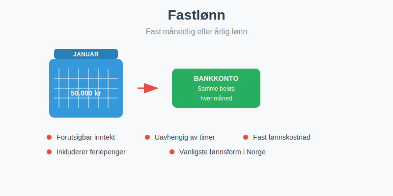
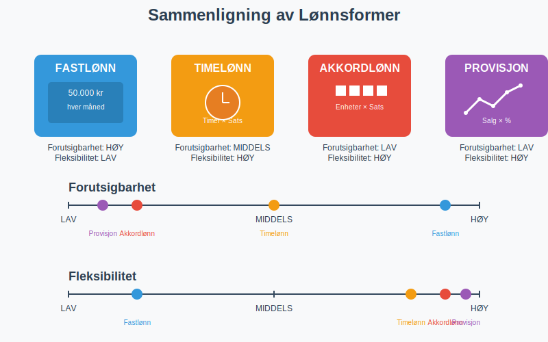
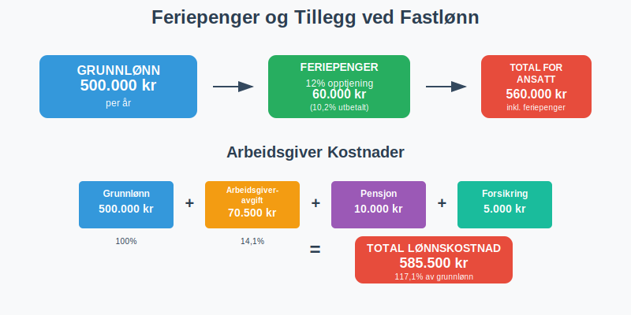
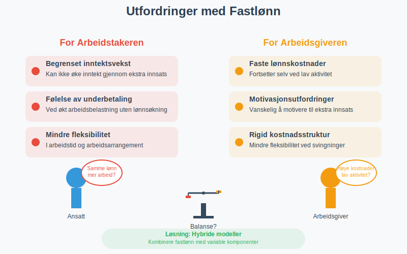
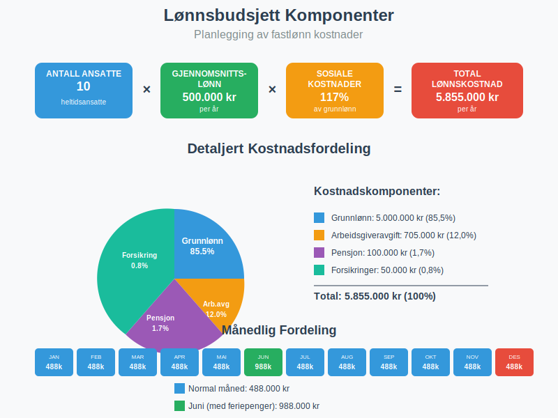

---
title: "Hva er Fastlønn i Regnskap?"
seoTitle: "Hva er Fastlønn i Regnskap?"
summary: 'Hva er fastlønn? Kort guide til definisjon, beregning, lovkrav og regnskapsføring for arbeidsgivere og ansatte.'
description: 'Hva er fastlønn? Kort guide til definisjon, beregning, lovkrav og regnskapsføring for arbeidsgivere og ansatte.'
---

**Fastlønn** er en fast månedlig eller årlig lønn som utbetales til en ansatt uavhengig av antall arbeidstimer, produksjon eller prestasjoner. Dette er den vanligste lønnsformen i Norge og representerer en **forutsigbar inntekt** for arbeidstakeren og en **fast [lønnskostnad](/blogs/regnskap/lonnskostnad "Hva er Lønnskostnad i Regnskap?")** for arbeidsgiveren. Fastlønn står i kontrast til andre lønnsformer som [akkordlønn](/blogs/regnskap/hva-er-akkordlonn "Hva er Akkordlønn? En Guide til Prestasjonslønn") eller timelønn.



## Hva Kjennetegner Fastlønn?

Fastlønn har flere karakteristiske egenskaper som skiller den fra andre lønnsformer:

* **Fast beløp** som utbetales regelmessig (månedlig eller årlig)
* **Uavhengig av arbeidstimer** - lønnen er den samme selv om man jobber noe mer eller mindre
* **Forutsigbar** for både arbeidsgiver og arbeidstaker
* **Basert på stillingsprosent** - kan være heltid (100%) eller deltid
* **Inkluderer feriepenger** og andre lovpålagte tillegg

### Fastlønn vs. Andre Lønnsformer

Fastlønn skiller seg fra andre lønnsformer på flere viktige måter:



| Lønnsform | Beregningsgrunnlag | Forutsigbarhet | Fleksibilitet |
|-----------|-------------------|----------------|---------------|
| **Fastlønn** | Fast måneds-/årsbeløp | Høy | Lav |
| **Timelønn** | Timer × timesats | Middels | Høy |
| **[Akkordlønn](/blogs/regnskap/hva-er-akkordlonn "Hva er Akkordlønn? En Guide til Prestasjonslønn")** | Produserte enheter × sats | Lav | Høy |
| **Provisjonslønn** | Salg × provisjonssats | Lav | Høy |

## Beregning av Fastlønn

### Månedlig Fastlønn

Den vanligste formen for fastlønn er **månedlig fastlønn**, hvor den ansatte mottar samme beløp hver måned:

```
Månedlig fastlønn = Årslønn ÷ 12 måneder
```

**Eksempel:**
- Årslønn: 600.000 kr
- Månedlig fastlønn: 600.000 ÷ 12 = **50.000 kr per måned**

### Stillingsprosent og Deltid

For deltidsansatte beregnes fastlønnen basert på stillingsprosent:

```
Deltids fastlønn = Heltids årslønn × (Stillingsprosent ÷ 100)
```

**Eksempel:**
- Heltids årslønn: 500.000 kr
- Stillingsprosent: 60%
- Deltids årslønn: 500.000 × 0,60 = **300.000 kr**
- Månedlig fastlønn: 300.000 ÷ 12 = **25.000 kr per måned**

### Feriepenger og Tillegg

Fastlønn inkluderer grunnlag for beregning av **feriepenger** og andre lovpålagte tillegg:



| Tillegg | Beregningsgrunnlag | Prosentsats |
|---------|-------------------|-------------|
| **Feriepenger** | Opptjent lønn | 12% (10,2% utbetalt) |
| **Arbeidsgiveravgift** | Bruttolønn | 14,1% (varierer etter sone) |
| **Pensjon** | Lønn mellom 1G-12G | Minimum 2% |

## Fastlønn i Regnskapet

### Regnskapsmessig Behandling

Fastlønn behandles som en **[driftskostnad](/blogs/regnskap/hva-er-driftskostnader "Hva er Driftskostnader? Komplett Guide til Kostnadstyper og Regnskapsføring")** i bedriftens [regnskap](/blogs/regnskap/hva-er-regnskap "Hva er regnskap?"). Lønnskostnadene føres månedlig og inkluderer:

* **Bruttolønn** til den ansatte (inkludert [grunnlønn](/blogs/regnskap/hva-er-grunnlonn "Hva er Grunnlønn i Regnskap?") og eventuelle tillegg)
* **Arbeidsgiveravgift** (14,1% av bruttolønn)
* **Pensjonskostnader** (minimum 2% av lønn mellom 1G-12G)
* **Forsikringer** og andre personalrelaterte kostnader

### Bokføring av Fastlønn

Månedlig bokføring av fastlønn følger dette mønsteret:

```
Debet: Lønnskostnad                    50.000 kr
Debet: Arbeidsgiveravgift               7.050 kr
Debet: Pensjonskostnad                  1.000 kr
    Kredit: Skyldig lønn                       45.000 kr
    Kredit: Skyldig forskuddstrekk             5.000 kr
    Kredit: Skyldig arbeidsgiveravgift         7.050 kr
    Kredit: Skyldig pensjon                    1.000 kr
```

### Ansattreskontro

All fastlønn må registreres i den ansattes [ansattreskontro](/blogs/regnskap/hva-er-ansattreskontro "Hva er Ansattreskontro? En Guide til Ansattkontoer i Regnskap"), som inneholder:

* **Bruttolønn** per måned
* **Forskuddstrekk** og andre trekk
* **Feriepenger** opptjening og utbetaling
* **Sykepenger** og andre refusjoner
* **Årsoppgave** grunnlag

Alle disse opplysningene må også fremgå av det månedlige [lønnslipp](/blogs/regnskap/hva-er-lonnslipp "Hva er Lønnslipp i Regnskap? Komplett Guide til Lønnsspecifikasjon") som gis til den ansatte.

## Fordeler og Ulemper med Fastlønn

### Fordeler for Arbeidstakeren

| Fordel | Beskrivelse |
|--------|-------------|
| **Forutsigbar økonomi** | Samme inntekt hver måned gjør det enkelt å planlegge privatøkonomi |
| **Trygghet** | Lønnen påvirkes ikke av svingninger i arbeidsmengde eller prestasjoner |
| **Feriepenger** | Automatisk opptjening av feriepenger basert på fast grunnlag |
| **Lånemuligheter** | Banker vurderer fast inntekt som mer sikker ved lånesøknader |

### Fordeler for Arbeidsgiveren

* **Forutsigbare lønnskostnader** som gjør [budsjettering](/blogs/regnskap/hva-er-budsjettering "Hva er Budsjettering? Komplett Guide til Budsjettplanlegging") enklere
* **Enkel lønnsadministrasjon** uten kompliserte beregninger
* **Stabil arbeidsstyrke** med mindre turnover
* **Lettere å rekruttere** da mange foretrekker fast lønn

### Ulemper og Utfordringer



**For arbeidstakeren:**
* Begrenset mulighet til å øke inntekt gjennom ekstra innsats
* Kan føle seg underbetalt hvis arbeidsbelastningen øker betydelig
* Mindre fleksibilitet i arbeidstid

**For arbeidsgiveren:**
* Lønnskostnader fortsetter selv ved lav aktivitet
* Kan være vanskelig å motivere til ekstra innsats
* Mindre fleksibilitet i kostnadsstrukturen

## Fastlønn og Arbeidsmiljøloven

### Lovkrav og Regulering

Fastlønn er regulert av **Arbeidsmiljøloven** og eventuelle **tariffavtaler**:

* **[Minstelønn](/blogs/regnskap/minstelonn "Minstelønn i Regnskap")** må overholdes (der det finnes tariffavtaler)
* **Normalarbeidstid** er maksimalt 40 timer per uke
* **Overtidsbetaling** kan kreves ved arbeid utover normal arbeidstid
* **Ferie** og **sykepenger** beregnes basert på fastlønnen

### Endring av Fastlønn

Endringer i fastlønn krever:

* **Skriftlig avtale** mellom partene
* **Varsel** i henhold til arbeidsavtalen
* **Begrunnelse** ved lønnsreduksjon
* **Oppdatering** av [ansattreskontro](/blogs/regnskap/hva-er-ansattreskontro "Hva er Ansattreskontro? En Guide til Ansattkontoer i Regnskap")

## Fastlønn i Ulike Bransjer

### Offentlig Sektor

I offentlig sektor er fastlønn den dominerende lønnsformen:

* **Lønnsrammer** fastsatt i tariffavtaler
* **Automatisk lønnsvekst** basert på [ansiennitet](/blogs/regnskap/ansiennitet "Ansiennitet - Komplett Guide til Ansiennitet i Norsk Regnskap og Arbeidsrett")
* **Tillegg** for spesielle kvalifikasjoner eller ansvar
* **Pensjon** gjennom offentlige pensjonsordninger

### Privat Sektor

Privat sektor bruker fastlønn kombinert med andre elementer:

* **Grunnlønn** som fast komponent
* **Bonus** eller **provisjon** som variabel del
* **Naturalytelser** som bil, telefon, etc.
* **Aksjeopsjoner** eller andre incentivordninger

## Fastlønn og Skattemessige Forhold

### Skatteplikt

Fastlønn er **skattepliktig inntekt** som behandles som:

* **Lønnsinntekt** i selvangivelsen
* **Forskuddstrekk** trekkes månedlig
* **Arbeidsgiveravgift** betales av arbeidsgiver
* **Grunnlag** for beregning av pensjon og trygd gjennom [folketrygden](/blogs/regnskap/hva-er-folketrygden "Hva er Folketrygden? Komplett Guide til Norges Nasjonale Trygdesystem")

**Viktig for lavlønte:** Ansatte med lav fastlønn (under [frikortgrensen](/blogs/regnskap/hva-er-frikortgrense "Hva er Frikortgrense i Norge? Skattefri Inntekt og Praktiske Eksempler")) kan søke om frikort og slippe forskuddstrekk helt. Dette gjelder særlig studenter og deltidsansatte.

### Fradrag og Tillegg

Ved fastlønn kan følgende være aktuelt:

| Type | Beskrivelse | Skattemessig behandling |
|------|-------------|------------------------|
| **Reisefradrag** | Fradrag for reise til/fra arbeid | Standardfradrag eller dokumenterte kostnader |
| **Hjemmekontor** | Fradrag for hjemmekontor | Inntil 2.000 kr per år |
| **Fagforeningskontingent** | Medlemskap i fagforening | Fullt fradragsberettiget |
| **Naturalytelser** | Bil, telefon, etc. | Skattepliktig tillegg |

## Planlegging og Budsjett

### Lønnsbudsjett for Bedrifter

Ved planlegging av lønnsbudsjett med fastlønn må bedriften vurdere:



* **Grunnlønn** × antall ansatte × 12 måneder
* **Arbeidsgiveravgift** (14,1% av bruttolønn)
* **Pensjonskostnader** (minimum 2% av kvalifiserende lønn)
* **Forsikringer** og andre personalrelaterte kostnader
* **Lønnsøkninger** og inflasjonsjustering

### Eksempel på Årlig Lønnskostnad

For en ansatt med 500.000 kr i årslønn:

| Kostnadselement | Beløp | Prosent av grunnlønn |
|----------------|-------|---------------------|
| **Grunnlønn** | 500.000 kr | 100% |
| **Arbeidsgiveravgift** | 70.500 kr | 14,1% |
| **Pensjon** | 10.000 kr | 2,0% |
| **Forsikringer** | 5.000 kr | 1,0% |
| **Total lønnskostnad** | **585.500 kr** | **117,1%** |

## Fastlønn og Økonomisk Analyse

### Påvirkning på Lønnsomhet

Fastlønn påvirker bedriftens lønnsomhetsanalyse som en **fast kostnad**:

* Inngår i **[faste kostnader](/blogs/regnskap/hva-er-nullpunkt "Hva er Nullpunkt (Break-Even) i Regnskap?")** ved nullpunkt-analyse
* Påvirker **[dekningsbidrag](/blogs/regnskap/hva-er-dekningsbidrag "Hva er Dekningsbidrag? Beregning, Analyse og Optimalisering")** beregninger
* Viktig komponent i **[driftsresultat](/blogs/regnskap/hva-er-driftsresultat "Hva er Driftsresultat? Beregning og Analyse av Driftslønnsomhet")** analyser

### Kapitalintensitet

Bedrifter med høy andel fastlønn har:

* **Høyere operasjonell risiko** ved svingninger i omsetning
* **Lavere fleksibilitet** i kostnadsstrukturen
* **Behov for høyere [arbeidskapital](/blogs/regnskap/hva-er-arbeidskapital "Hva er Arbeidskapital? Beregning, Analyse og Optimalisering")** for å håndtere svingninger

## Rapportering og Dokumentasjon

### A-melding

All fastlønn må rapporteres månedlig via [a-meldingen](/blogs/regnskap/hva-er-a-melding "Hva er a-melding?"):

* **Bruttolønn** per måned
* **Forskuddstrekk** og andre trekk
* **Arbeidsgiveravgift** grunnlag
* **Pensjon** og andre tillegg

### Årsoppgave

Ved årsslutt må arbeidsgiver levere **årsoppgave** som viser:

* **Total bruttolønn** for året
* **Forskuddstrekk** og andre trekk
* **Naturalytelser** og andre skattepliktige fordeler
* **Pensjon** og andre fradragsberettigede kostnader

## Fremtidige Trender

### Hybride Lønnsmodeller

Mange bedrifter beveger seg mot **hybride lønnsmodeller** som kombinerer:

* **Fast grunnlønn** for trygghet
* **Variable komponenter** for motivasjon
* **Naturalytelser** for fleksibilitet
* **Langsiktige incentiver** som aksjeopsjoner

### Alternative Lønnsordninger

For spesifikke arbeidstyper og situasjoner finnes det alternative lønnsordninger som kan være mer hensiktsmessige enn tradisjonell fastlønn:

* **[Lett salær](/blogs/regnskap/hva-er-lett-salaer "Hva er Lett Salær i Regnskap?")** - for begrenset arbeid i private hjem med skattemessige fordeler
* **[Akkordlønn](/blogs/regnskap/hva-er-akkordlonn "Hva er Akkordlønn? En Guide til Prestasjonslønn")** - for produksjonsbasert arbeid
* **[Honorar](/blogs/regnskap/hva-er-honorar "Hva er Honorar i Regnskap? Komplett Guide til Honorarutbetalinger og Skattebehandling")** - for faglig arbeid og konsulentoppdrag

### Digitalisering

Teknologiske løsninger påvirker fastlønn gjennom:

* **Automatisert lønnskjøring** og rapportering
* **Selvbetjening** for ansatte
* **Integrerte systemer** mellom lønn og [regnskap](/blogs/regnskap/hva-er-regnskap "Hva er regnskap?")
* **Sanntidsrapportering** til myndigheter

## Konklusjon

Fastlønn er den mest utbredte lønnsformen i Norge og gir **forutsigbarhet** for både arbeidsgiver og arbeidstaker. For bedrifter representerer fastlønn en **fast kostnad** som må planlegges nøye i budsjett og lønnsomhetsanalyser. Korrekt håndtering av fastlønn i [regnskapet](/blogs/regnskap/hva-er-regnskap "Hva er regnskap?") og overfor skattemyndighetene er avgjørende for å unngå problemer og sikre god økonomistyring.

## Relaterte Begreper

* **Grunnlønn**
* **Månedslønn**
* **Årslønn**
* **Stillingsprosent**
* **Lønnskostnad**
* **Personalutgifter**
* **Arbeidsgiveravgift**
* **Feriepenger**

For nasjonale bransjetall og lønnsstatistikk, se også [Gjennomsnittslønn i Norge](/blogs/regnskap/gjennomsnittslonn-i-norge "Gjennomsnittslønn i Norge").


