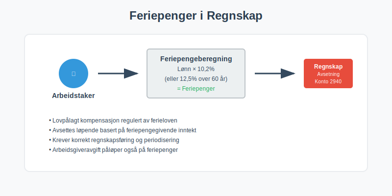
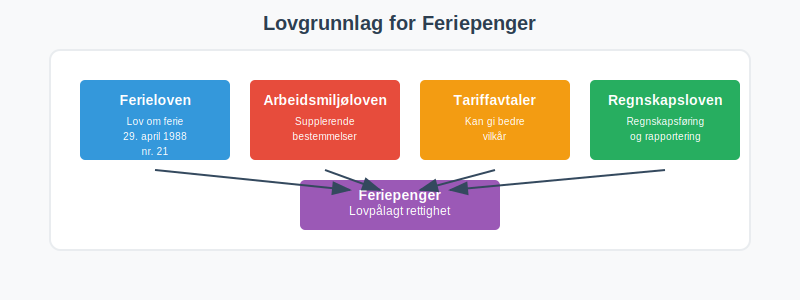
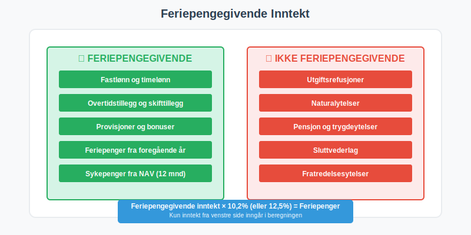
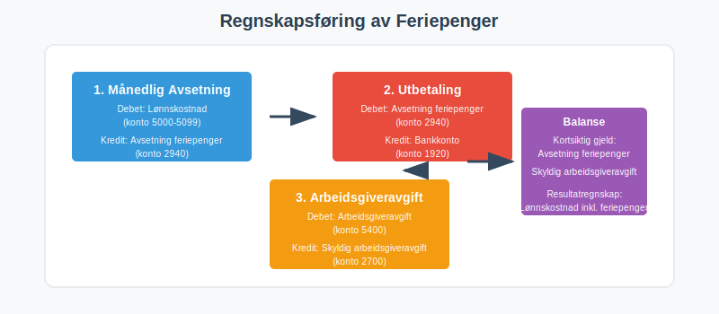
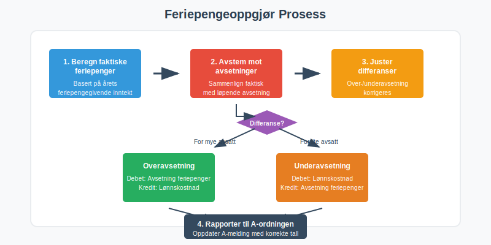
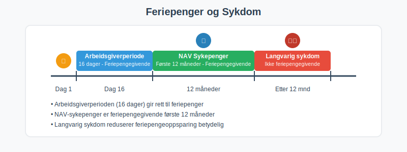
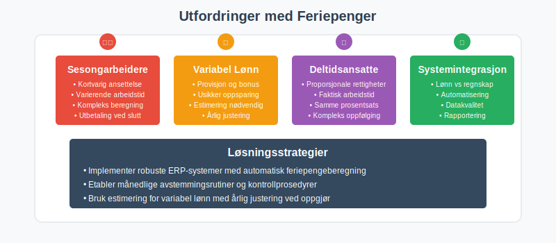
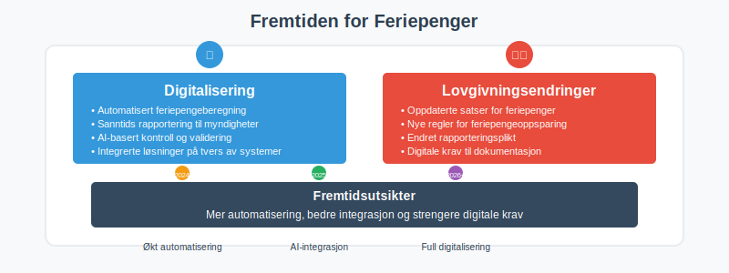

---
title: "Hva er Feriepenger i Regnskap?"
seoTitle: "Hva er Feriepenger i Regnskap?"
description: '**Feriepenger** er lovpålagt kompensasjon til arbeidstakere for tapt arbeidsfortjeneste under ferie, regulert av **[Ferieloven](/blogs/regnskap/ferieloven "Fer...'
---

**Feriepenger** er lovpålagt kompensasjon til arbeidstakere for tapt arbeidsfortjeneste under ferie, regulert av **[Ferieloven](/blogs/regnskap/ferieloven "Ferieloven “ Lov om ferie av 29. april 1988 nr. 21")**. For bedrifter er korrekt **regnskapsføring av feriepenger** essensielt både for å overholde norsk arbeidsrett og for å sikre nøyaktig [regnskapsføring](/blogs/regnskap/hva-er-regnskap "Hva er Regnskap? Komplett Guide til Regnskapsføring og Bokføring") av [lønnskostnader](/blogs/regnskap/hva-er-driftskostnader "Hva er Driftskostnader? Typer, Beregning og Optimalisering") og avsetninger.



## Hva er Feriepenger?

Feriepenger er **økonomisk kompensasjon** som arbeidstakere har rett til under ferie, og består av:

* **Feriepengeoppsparing** basert på opptjent lønn (inkludert [grunnlønn](/blogs/regnskap/hva-er-grunnlonn "Hva er Grunnlønn i Regnskap?") og tillegg)
* **Kompensasjon** for tapt arbeidsfortjeneste
* **Lovpålagt ytelse** regulert av ferieloven
* **Regnskapsmessig forpliktelse** for arbeidsgivere

### Lovgrunnlag for Feriepenger

Feriepenger er regulert av:

* **[Ferieloven](/blogs/regnskap/ferieloven "Ferieloven “ Lov om ferie av 29. april 1988 nr. 21")** (lov om ferie av 29. april 1988 nr. 21)
* **Regler om obligatorisk fellesferie**: Se [Fellesferie](/blogs/regnskap/fellesferie "Fellesferie: Hva, regler og planlegging i Norge") for regler om kollektiv ferieavvikling
* **Arbeidsmiljøloven** for supplerende bestemmelser
* **Tariffavtaler** som kan gi bedre vilkår
* **[Regnskapsloven](/blogs/regnskap/hva-er-bokforingsloven "Hva er Bokføringsloven? Krav, Regler og Praktisk Anvendelse")** for regnskapsføring



## Beregning av Feriepenger

Feriepenger beregnes som en prosentandel av **feriepengegivende inntekt** fra foregående kalenderår.

For en mer detaljert gjennomgang av **satser og prosentsatser** for feriepenger, se vår artikkel om [Feriepenger i prosent](/blogs/regnskap/feriepenger-i-prosent "Feriepenger i prosent - Satser, Beregning og Eksempler").

### Standard Feriepengesatser

| Arbeidstaker | Feriepengesats | Grunnlag |
|--------------|----------------|----------|
| Arbeidstakere under 60 år | **10,2%** | Feriepengegivende inntekt |
| Arbeidstakere over 60 år | **12,5%** | Feriepengegivende inntekt |
| Særlige grupper | **Varierer** | Tariffavtaler |
| Langvarige ansatte | **Kan øke** | Basert på [ansiennitet](/blogs/regnskap/ansiennitet "Ansiennitet - Komplett Guide til Ansiennitet i Norsk Regnskap og Arbeidsrett") |

Se også vår artikkel om [Feriepengegrunnlag](/blogs/regnskap/feriepengegrunnlag "Feriepengegrunnlag: Grunnlag for beregning av feriepenger i Norge") for en grundig gjennomgang av hva som inngår i beregningsgrunnlaget.

### Feriepengegivende Inntekt

**Feriepengegivende inntekt** inkluderer:

* **[Fastlønn](/blogs/regnskap/hva-er-fastlonn "Hva er Fastlønn i Regnskap?")** og timelønn
* **Overtidstillegg** og skifttillegg
* **[Helligdagslønn](/blogs/regnskap/helligdager-regnskap-bedriftseiere "Helligdager (regnskap, bedriftseiere) - Komplett Guide til Feriepenger og Regnskapsføring")** og tilleggsgodtgjørelse for arbeid på helligdager
* **[Provisjoner](/blogs/regnskap/hva-er-provisjon "Hva er Provisjon? Komplett Guide til Provisjon i Regnskap og Lønn")** og bonuser
* **Feriepenger** fra foregående år
* **Sykepenger** fra NAV gjennom [folketrygden](/blogs/regnskap/hva-er-folketrygden "Hva er Folketrygden? Komplett Guide til Norges Nasjonale Trygdesystem") (første 12 måneder)

**Ikke feriepengegivende:**

* **Utgiftsrefusjoner** og naturalytelser
* **Pensjon** og trygdeytelser
* **Sluttvederlag** og fratredelsesytelser



### Praktisk Beregningseksempel

**Eksempel:** En arbeidstaker under 60 år hadde følgende inntekt i 2023:

| Inntektstype | Beløp | Feriepengegivende |
|--------------|-------|-------------------|
| [Fastlønn](/blogs/regnskap/hva-er-fastlonn "Hva er Fastlønn i Regnskap?") | 450.000 kr | œ“ |
| Overtidstillegg | 25.000 kr | œ“ |
| Bilgodtgjørelse | 15.000 kr | œ— |
| Bonus | 30.000 kr | œ“ |
| **Total feriepengegivende** | **505.000 kr** | |

**Beregning:**
- Feriepenger 2024 = 505.000 × 10,2% = **51.510 kr**

## Regnskapsføring av Feriepenger

Korrekt regnskapsføring av feriepenger krever forståelse av **periodisering** og [avsetninger](/blogs/regnskap/avsetning "Avsetning i Regnskap - Komplett Guide til Avsetninger og Estimater").



### Løpende Avsetning (Månedlig)

Feriepenger **avsettes løpende** basert på månedlig lønnsutbetaling:

**Regnskapsføring hver måned:**
```
Debet: Lønnskostnad (konto 5000-5099)
Kredit: Avsetning feriepenger (konto 2940)
```

**Beregning av månedlig avsetning:**
- Månedlig lønn × feriepengesats (10,2% eller 12,5%)

### Utbetaling av Feriepenger

Ved **utbetaling** av feriepenger:

```
Debet: Avsetning feriepenger (konto 2940)
Kredit: Bankkonto (konto 1920)
```

### Arbeidsgiveravgift på Feriepenger

**[Arbeidsgiveravgift](/blogs/regnskap/hva-er-arbeidsgiveravgift "Hva er Arbeidsgiveravgift? Satser, Beregning og Regnskapsføring")** påløper også på feriepenger:

| Sone | Arbeidsgiveravgift |
|------|-------------------|
| Sone I | 14,1% |
| Sone II | 10,6% |
| Sone III | 6,4% |
| Sone IV | 5,1% |
| Sone V | 0% |

**Regnskapsføring av arbeidsgiveravgift:**
```
Debet: Arbeidsgiveravgift (konto 5400)
Kredit: Skyldig arbeidsgiveravgift (konto 2700)
```

## Feriepengeoppgjør og Avstemming

### Årlig Feriepengeoppgjør

Ved **årsskiftet** må bedriften:

* **Beregne** faktiske feriepenger basert på årets inntekt
* **Avstemme** mot løpende avsetninger
* **Justere** eventuelle differanser
* **Rapportere** til [A-ordningen](/blogs/regnskap/hva-er-a-ordningen "Hva er A-ordningen? Rapportering, Frister og Praktisk Håndtering")



### Avstemming av Feriepengegjeld

**Kontroll av feriepengegjeld:**

| Element | Beskrivelse |
|---------|-------------|
| **Inngående balanse** | Feriepengegjeld 1. januar |
| **+ Årets avsetning** | Løpende avsetninger |
| **- Utbetalte feriepenger** | Faktiske utbetalinger |
| **= Utgående balanse** | Feriepengegjeld 31. desember |

### Justering av Avsetninger

Ved **over-/underavsetning:**

**Overavsetning (for mye avsatt):**
```
Debet: Avsetning feriepenger (konto 2940)
Kredit: Lønnskostnad (konto 5000)
```

**Underavsetning (for lite avsatt):**
```
Debet: Lønnskostnad (konto 5000)
Kredit: Avsetning feriepenger (konto 2940)
```

## Særlige Forhold ved Feriepenger

### Feriepenger ved Oppsigelse

Ved **oppsigelse** eller **fratredelse**:

* **Opptjente feriepenger** utbetales ved fratredelse
* **Feriepengeoppgjør** må gjøres umiddelbart
* **Skattepliktig** som vanlig lønn med [forskuddstrekk](/blogs/regnskap/hva-er-forskuddstrekk "Hva er Forskuddstrekk? Komplett Guide til Skattetrekk i Lønn") og [skatt på feriepenger](/blogs/regnskap/skatt-pa-feriepenger "Skatt på feriepenger - Skattebehandling av feriepenger i Norge")
* **A-melding** må oppdateres

### Feriepenger og Sykdom

**Sykepenger** påvirker feriepengeoppsparing:

* **NAV-sykepenger** er feriepengegivende første 12 måneder
* **Arbeidsgiverperioden** (16 dager) er feriepengegivende
* **Langvarig sykdom** reduserer feriepengeoppsparing



### Feriepenger for Deltidsansatte

**Deltidsansatte** har samme rett til feriepenger:

* **Samme prosentsats** som heltidsansatte
* **Beregning** basert på faktisk arbeidstid
* **Proporsjonale** avsetninger

## Praktiske Utfordringer

### Sesongarbeidere

**Sesongarbeidere** krever spesiell oppmerksomhet:

* **Kortvarig ansettelse** påvirker feriepengeoppsparing
* **Utbetaling** ofte ved sesongavslutning
* **Kompleks beregning** ved varierende arbeidstid

### Variabel Lønn

Ved **variabel lønn** (provisjon, bonus):

* **Usikker** feriepengeoppsparing
* **Estimering** nødvendig for løpende avsetning
* **Justering** ved årlig oppgjør



## Digitale Løsninger

### Lønns- og Personalsystemer

Moderne **[ERP-systemer](/blogs/regnskap/hva-er-erp-system "Hva er ERP-system? Fordeler, Implementering og Valg av System")** håndterer:

* **Automatisk beregning** av feriepengeoppsparing
* **Løpende avsetninger** i regnskapet
* **Rapportering** til A-ordningen
* **Avstemming** og kontroll

### Integrasjon med Regnskap

**Integrasjon** mellom lønn og regnskap sikrer:

* **Automatisk** [bilagsføring](/blogs/regnskap/hva-er-bilagsforing "Hva er Bilagsføring? Prosess, Regler og Beste Praksis")
* **Korrekt kontering** av feriepenger
* **Oppdatert** [balanse](/blogs/regnskap/hva-er-balanse "Hva er Balanse i Regnskap? Oppbygging, Analyse og Praktiske Eksempler")
* **Enkel avstemming**

## Kontroll og Revisjon

### Internkontroll

**Internkontroll** av feriepenger bør omfatte:

* **Månedlig avstemming** av avsetninger
* **Kontroll** av feriepengesatser
* **Verifisering** av feriepengegivende inntekt
* **Dokumentasjon** av beregninger
* **Korrekt visning** av feriepenger på [lønnslipp](/blogs/regnskap/hva-er-lonnslipp "Hva er Lønnslipp i Regnskap? Komplett Guide til Lønnsspecifikasjon")

### Revisjonsaspekter

**Revisorer** fokuserer på:

* **Korrekt beregning** av feriepengeoppsparing
* **Fullstendige avsetninger** i [balansen](/blogs/regnskap/hva-er-balanseregnskap "Hva er Balanseregnskap? Oppbygging, Analyse og Praktiske Eksempler")
* **Periodisering** av kostnader
* **Overholdelse** av ferieloven


## Vanlige Feil og Fallgruver

### Typiske Regnskapsfeil

**Vanlige feil** ved feriepengeregnskapsføring:

* **Manglende avsetning** av feriepenger
* **Feil feriepengesats** (10,2% vs 12,5%)
* **Glemt arbeidsgiveravgift** på feriepenger
* **Feil periodisering** av kostnader

### Konsekvenser av Feil

**Feilaktig håndtering** kan medføre:

* **Underskudd** i feriepengegjeld
* **Likviditetsproblemer** ved utbetaling
* **Brudd** på ferieloven
* **Sanksjoner** fra arbeidstilsynet

## Fremtidige Endringer

### Digitalisering

**Fremtidige utviklinger** inkluderer:

* **Automatisert** feriepengeberegning
* **Sanntids** rapportering til myndigheter
* **AI-basert** kontroll og validering
* **Integrerte** løsninger på tvers av systemer

### Lovgivningsendringer

**Potensielle endringer** i ferieloven:

* **Oppdaterte satser** for feriepenger
* **Nye regler** for feriepengeoppsparing
* **Endret** rapporteringsplikt
* **Digitale** krav til dokumentasjon



## Sammendrag

**Feriepenger** er en kompleks, men viktig del av norsk [lønnsregnskap](/blogs/regnskap/hva-er-lonnsregnskap "Hva er Lønnsregnskap? Prosess, Regler og Praktisk Håndtering") som krever:

* **Korrekt beregning** basert på feriepengegivende inntekt
* **Løpende avsetning** i regnskapet
* **Nøyaktig regnskapsføring** med riktige konti
* **Årlig avstemming** og justering
* **Overholdelse** av ferieloven og regnskapsregler

Ved å følge etablerte prosedyrer og bruke moderne digitale verktøy kan bedrifter sikre **korrekt håndtering** av feriepenger og unngå både juridiske og økonomiske problemer.

For mer informasjon om relaterte emner, se våre artikler om [lønnskostnader](/blogs/regnskap/hva-er-driftskostnader "Hva er Driftskostnader? Typer, Beregning og Optimalisering"), [arbeidsgiveravgift](/blogs/regnskap/hva-er-arbeidsgiveravgift "Hva er Arbeidsgiveravgift? Satser, Beregning og Regnskapsføring"), [A-ordningen](/blogs/regnskap/hva-er-a-ordningen "Hva er A-ordningen? Rapportering, Frister og Praktisk Håndtering") og [halv skatt](/blogs/regnskap/halv-skatt "Halv skatt “ Alt du trenger å vite om halv skatt i lønn").


