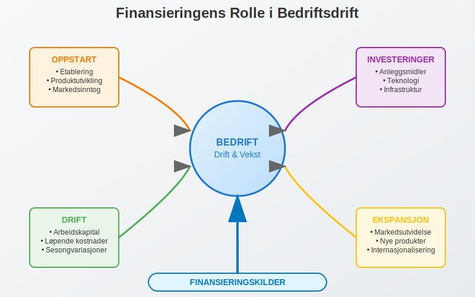
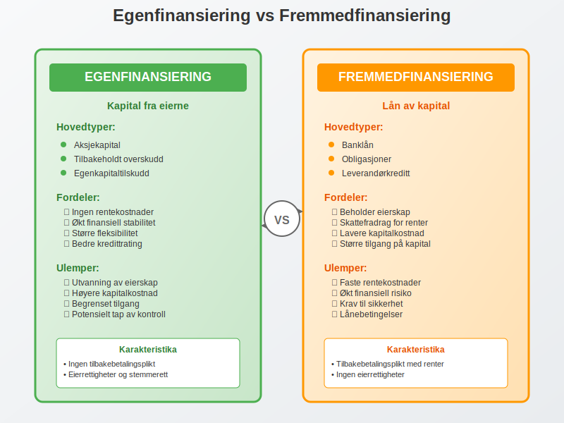
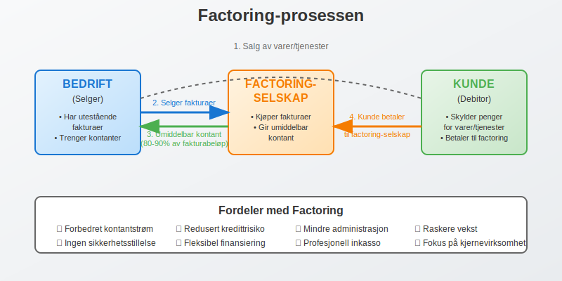
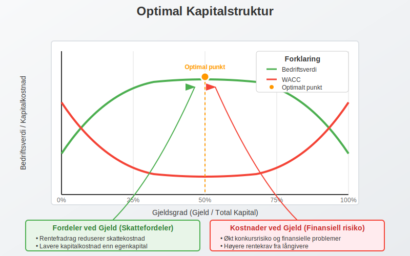
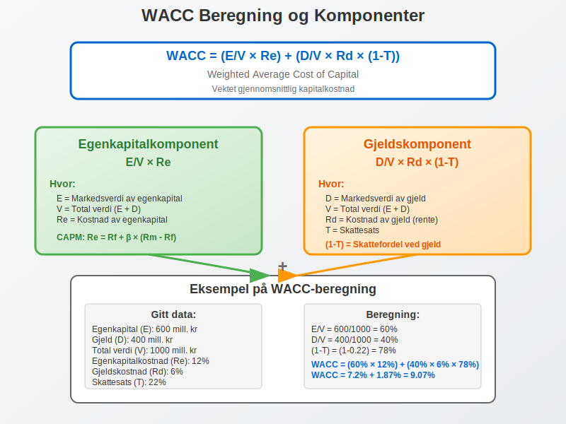
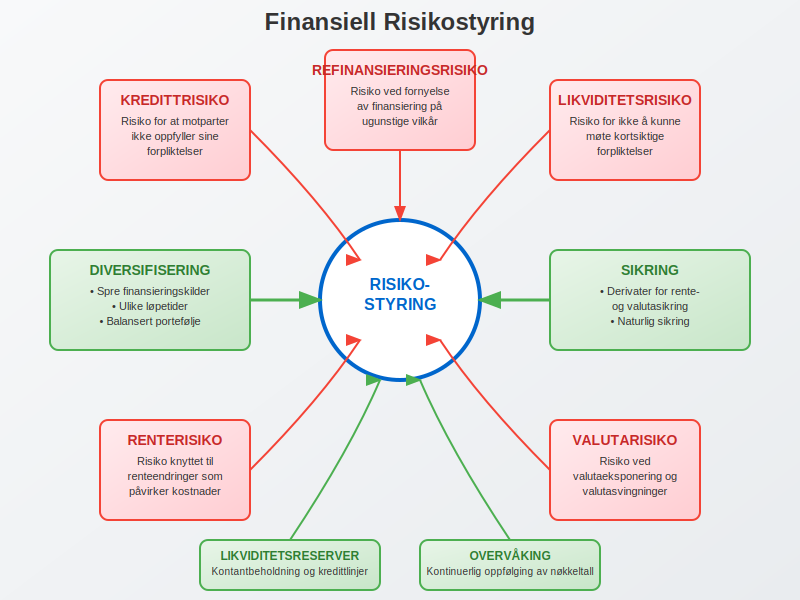

---
title: "Hva er Finansiering?"
seoTitle: "Hva er Finansiering?"
description: 'Finansiering er den kritiske prosessen med å skaffe kapital for å finansiere en bedrifts drift, investeringer og vekstambisjoner. Det er fundamentet som gjør...'
summary: 'En lettlest oversikt over finansiering: kilder, strategier og regnskapseffekter, fra egenkapital og lån til factoring og crowdfunding.'
---

Finansiering er den kritiske prosessen med å skaffe kapital for å finansiere en bedrifts drift, investeringer og vekstambisjoner. Det er fundamentet som gjør det mulig for bedrifter å etablere seg, ekspandere og opprettholde konkurranseevnen i markedet. Denne omfattende guiden utforsker alle aspekter ved bedriftsfinansiering, fra grunnleggende konsepter til avanserte strategier.

## Seksjon 1: Grunnleggende Finansieringskonsepter

### 1.1 Hva er Finansiering?

**Finansiering** refererer til prosessen med å tilføre kapital til en virksomhet for å møte dens finansielle behov. Dette kan være alt fra oppstartskapital for nye bedrifter til ekspansjonskapital for etablerte selskaper. Finansiering er nødvendig for:

* **Oppstart av virksomhet:** Innledende kapital for å etablere forretningsdrift
* **Driftsfinansiering:** Løpende kapital for daglig drift og [arbeidskapital](/blogs/regnskap/hva-er-arbeidskapital "Hva er Arbeidskapital? En Komplett Guide til Working Capital")
* **Investeringer:** Kapital til [anleggsmidler](/blogs/regnskap/hva-er-anleggsmidler "Hva er Anleggsmidler? Komplett Guide til Varige Driftsmidler") og langsiktige prosjekter
* **Ekspansjon:** Vekstkapital for markedsutvidelse og nye produkter

En velutarbeidet [forretningsplan](/blogs/regnskap/hva-er-forretningsplan "Hva er Forretningsplan? Komplett Guide til Forretningsplanlegging og Regnskapsoppfølging") er essensielt for å identifisere finansieringsbehovet, velge riktig finansieringsform og presentere virksomheten overfor potensielle investorer og långivere.



### 1.2 Finansieringens Betydning i Regnskapet

Finansiering påvirker direkte bedriftens [balanse](/blogs/regnskap/hva-er-balanse "Hva er Balanse i Regnskap? Komplett Guide til Balansens Oppbygging og Funksjon") og [egenkapital](/blogs/regnskap/hva-er-egenkapital "Hva er Egenkapital? Komplett Guide til Egenkapital i Regnskap"). Valg av finansieringsform har betydelige konsekvenser for:

* **Kapitalstruktur:** Forholdet mellom egenkapital og gjeld
* **Finansielle nøkkeltall:** Soliditet, likviditet og rentabilitet
* **Risikoprofil:** Finansiell risiko og operasjonell fleksibilitet
* **Kontroll:** Eierskap og beslutningsmyndighet

## Seksjon 2: Hovedkategorier av Finansiering

### 2.1 Egenfinansiering vs. Fremmedfinansiering

Den fundamentale inndelingen av finansiering skiller mellom **egenfinansiering** og **fremmedfinansiering**:



#### Egenfinansiering

[Egenfinansiering](/blogs/regnskap/hva-er-egenfinansiering "Hva er Egenfinansiering? Komplett Guide til Egenkapitalfinansiering") innebærer tilførsel av kapital fra eierne uten forpliktelse til tilbakebetaling på bestemte tidspunkter. Hovedformer inkluderer:

* **Aksjekapital:** Innbetalt [aksjekapital](/blogs/regnskap/hva-er-aksjekapital "Hva er Aksjekapital? Komplett Guide til Aksjekapital i Norge") fra aksjonærer
* **Tilbakeholdt overskudd:** Reinvestert fortjeneste fra driften
* **Egenkapitaltilskudd:** Direkte kapitalinnskudd fra eierne

**Fordeler med egenfinansiering:**
* Ingen rentekostnader eller tilbakebetalingsforpliktelser
* Økt finansiell stabilitet og soliditet
* Større fleksibilitet i vanskelige perioder
* Bedre kredittrating og lånemuligheter

**Ulemper med egenfinansiering:**
* Utvanning av eierskap ved nye aksjonærer
* Høyere kapitalkostnad (egenkapitalavkastningskrav)
* Begrenset tilgang på kapital
* Potensielt tap av kontroll

#### Fremmedfinansiering

Fremmedfinansiering innebærer lån av kapital med forpliktelse til tilbakebetaling med renter. Hovedformer inkluderer:

* **Banklån:** Tradisjonelle lån fra finansinstitusjoner
* **[Obligasjoner](/blogs/regnskap/hva-er-obligasjon "Hva er en Obligasjon? Komplett Guide til Obligasjoner i Regnskap"):** Verdipapirgjeld utstedt til investorer
* **[Leverandørkreditt](/blogs/regnskap/hva-er-leverandorkreditt "Hva er Leverandørkreditt? Komplett Guide til Leverandørfinansiering"):** Utsatt betaling til leverandører
* **Leasingavtaler:** Finansiell leasing av eiendeler

**Fordeler med fremmedfinansiering:**
* Beholder full eierskap og kontroll
* Skattefradrag for rentekostnader
* Lavere kapitalkostnad enn egenkapital
* Større tilgang på kapital

**Ulemper med fremmedfinansiering:**
* Faste rentekostnader og tilbakebetalingsforpliktelser
* Økt finansiell risiko og konkursrisiko
* Krav til sikkerhet og garantier
* Restriksjoner gjennom lånebetingelser

### 2.2 Sammenligning av Finansieringsformer

| Finansieringsform | Kostnad | Risiko | Kontroll | Fleksibilitet | Tilgjengelighet |
|-------------------|---------|--------|----------|---------------|-----------------|
| **Egenkapital** | Høy | Lav | Redusert | Høy | Begrenset |
| **Banklån** | Middels | Middels | Beholdt | Middels | God |
| **Obligasjoner** | Middels | Middels | Beholdt | Lav | Variabel |
| **Leverandørkreditt** | Lav-Middels | Lav | Beholdt | Høy | God |
| **Leasing** | Middels-Høy | Lav | Beholdt | Middels | God |

## Seksjon 3: Spesialiserte Finansieringsformer

### 3.1 Fakturafinansiering og Factoring

[Factoring](/blogs/regnskap/hva-er-factoring "Hva er Factoring? Komplett Guide til Fakturakjøp og Finansiering") er en spesialisert finansieringsform der bedrifter selger sine utestående fakturaer til en factoringselskap for umiddelbar kontant. Dette forbedrer kontantstrømmen betydelig.

**Hovedtyper av factoring:**
* **Med regress:** Bedriften bærer kredittrisikoen
* **Uten regress:** Factoringselskapet overtar kredittrisikoen
* **Stille factoring:** Kunden er ikke klar over factoring-arrangementet
* **Åpen factoring:** Kunden betaler direkte til factoringselskapet



### 3.2 Crowdfunding og Alternative Finansieringsformer

Moderne teknologi har åpnet for nye finansieringsformer som demokratiserer tilgangen til kapital:

#### Crowdfunding

[Crowdfunding](/blogs/regnskap/hva-er-crowdfunding "Hva er Crowdfunding? Komplett Guide til Folkefinansiering") lar bedrifter samle inn kapital fra mange små investorer gjennom digitale plattformer. Hovedtyper inkluderer:

* **Reward-based:** Investorer mottar produkter eller tjenester
* **Equity-based:** Investorer mottar eierandeler
* **Debt-based:** Investorer låner penger mot renter

#### Crowdlending

[Crowdlending](/blogs/regnskap/hva-er-crowdlending "Hva er Crowdlending? Komplett Guide til Peer-to-Peer Utlån") (peer-to-peer lending) kobler bedrifter direkte med private långivere gjennom digitale plattformer, ofte med konkurransedyktige renter.

#### Investeringsselskaper

For investorer som ønsker profesjonell forvaltning av sin kapital, tilbyr **[investeringsselskaper](/blogs/regnskap/hva-er-investeringsselskap "Hva er et Investeringsselskap? Komplett Guide til Investeringsselskaper i Norge")** en strukturert tilnærming til finansmarkedene. Disse selskapene samler kapital fra mange investorer og forvalter den profesjonelt, noe som gir tilgang til diversifiserte investeringsporteføljer og ekspertise som ellers ville vært utilgjengelig for mindre investorer.

### 3.3 Offentlig Støtte og Tilskudd

Offentlige finansieringsordninger kan være verdifulle supplement til privat finansiering:

* **Innovasjon Norge:** Støtte til innovasjon og internasjonalisering
* **Forskningsrådet:** Finansiering av forsknings- og utviklingsprosjekter
* **EU-programmer:** Horizon Europe og andre europeiske programmer
* **Regionale utviklingsfond:** Lokal næringsutvikling

## Seksjon 4: Finansieringsstrategier og Planlegging

### 4.1 Kapitalstrukturoptimalisering

Optimal kapitalstruktur balanserer fordelene ved fremmedfinansiering (skattefordeler, lavere kostnad) mot ulempene (finansiell risiko, konkursrisiko). **Modigliani-Miller-teoremet** danner det teoretiske grunnlaget, men praktiske faktorer påvirker optimale valg:



**Faktorer som påvirker optimal kapitalstruktur:**
* **Bransje og forretningsrisiko:** Stabile bransjer kan tåle høyere gjeldsgrad
* **Skatteposisjon:** Høyere skattesats øker verdien av rentefradrag
* **Vekstmuligheter:** Vekstbedrifter trenger fleksibilitet
* **Eiendelsstruktur:** Materielle eiendeler kan stilles som sikkerhet

### 4.2 Finansieringsplanlegging og Timing

Effektiv finansieringsplanlegging krever:

**Kortsiktig planlegging (0-12 måneder):**
* [Likviditetsplanlegging](/blogs/regnskap/hva-er-betalingsevne "Hva er Betalingsevne? Komplett Guide til Likviditet og Soliditet") og kontantstrømstyring
* Arbeidskapitaloptimalisering
* Sesongvariasjoner og sykliske behov

**Mellomlang planlegging (1-5 år):**
* Investeringsfinansiering og ekspansjonsplaner
* Refinansiering av eksisterende gjeld
* Strategiske oppkjøp og fusjoner

**Langsiktig planlegging (5+ år):**
* Kapitalstrukturmål og finansieringsstrategi
* [Langsiktig gjeld](/blogs/regnskap/langsiktig-gjeld "Hva er Langsiktig Gjeld? Komplett Guide til Langsiktige Forpliktelser") og refinansieringsstrategier
* Børsnotering eller exit-strategier
* Generasjonsskifte og eierstruktur

### 4.3 Finansieringskostnader og Verdsettelse

#### Kapitalkostnad (WACC)

**Weighted Average Cost of Capital (WACC)** er den gjennomsnittlige kostnaden for all kapital:

```
WACC = (E/V × Re) + (D/V × Rd × (1-T))
```

Hvor:
* E = Markedsverdi av egenkapital
* D = Markedsverdi av gjeld  
* V = E + D (total verdi)
* Re = Kostnad av egenkapital
* Rd = Kostnad av gjeld
* T = Skattesats



#### Egenkapitalkostnad

Egenkapitalkostnaden kan beregnes ved hjelp av **Capital Asset Pricing Model (CAPM)**:

```
Re = Rf + β × (Rm - Rf)
```

Hvor:
* Rf = Risikofri rente
* β = Beta (systematisk risiko)
* Rm = Markedsavkastning
* (Rm - Rf) = Markedsrisikopremie

## Seksjon 5: Finansiering for Ulike Bedriftsfaser

### 5.1 Oppstartsfasen

**Finansieringsbehov:**
* Produktutvikling og markedstesting
* Innledende markedsføring og salg
* Grunnleggende infrastruktur og ansettelser

**Typiske finansieringskilder:**
* Personlig kapital og familie/venner
* Såkornfond og business angels
* [Inkubatorer](/blogs/regnskap/hva-er-inkubator "Hva er en Inkubator? Komplett Guide til Bedriftsinkubatorer i Norge") og akseleratorprogrammer
* Offentlige tilskudd og støtteordninger
* [Crowdfunding](/blogs/regnskap/hva-er-crowdfunding "Hva er Crowdfunding? Komplett Guide til Folkefinansiering") for produktbaserte bedrifter

### 5.2 Vekstfasen

**Finansieringsbehov:**
* Skalering av produksjon og salg
* Markedsekspansjon og internasjonalisering
* Organisasjonsutvikling og systemoppgraderinger

**Typiske finansieringskilder:**
* Venturekapital og private equity
* Banklån med sikkerhet i eiendeler
* Mezzaninfinansiering (hybrid gjeld/egenkapital)
* Strategiske partnere og joint ventures

### 5.3 Modningsfasen

**Finansieringsbehov:**
* Effektivisering og kostnadsoptimalisering
* Diversifisering og nye forretningsområder
* Oppkjøp og konsolidering

**Typiske finansieringskilder:**
* Kontantstrøm fra drift (selvfinansiering)
* [Obligasjonsutstedelser](/blogs/regnskap/hva-er-obligasjon "Hva er en Obligasjon? Komplett Guide til Obligasjoner i Regnskap")
* Banklån og kredittfasiliteter
* Børsnotering for større selskaper

## Seksjon 6: Regnskapsføring av Finansiering

### 6.1 Regnskapsføring av Egenkapital

Egenkapitaltransaksjoner påvirker [balansen](/blogs/regnskap/hva-er-balanse "Hva er Balanse i Regnskap? Komplett Guide til Balansens Oppbygging og Funksjon") direkte:

**Aksjeemisjon:**
```
Debet: Bank/Kontanter
Kredit: Aksjekapital (pålydende)
Kredit: Overkurs (eventuell overkurs)
```

For mer om [overkurs](/blogs/regnskap/hva-er-overkurs "Hva er Overkurs? En Guide til Overkurs i Regnskap") og hvordan det påvirker egenkapitalen, se vår artikkel om overkurs.

**Tilbakeholdt overskudd:**
```
Debet: Årsresultat
Kredit: Opptjent egenkapital
```

### 6.2 Regnskapsføring av Gjeld

Gjeldsfinansiering registreres som forpliktelser:

**Opptak av lån:**
```
Debet: Bank/Kontanter
Kredit: Langsiktig gjeld
```

**Rentekostnader:**
```
Debet: Rentekostnad
Kredit: Påløpte renter/Bank
```

For detaljert forståelse av [bokføring](/blogs/regnskap/hva-er-bokforing "Hva er Bokføring? En Komplett Guide til Norsk Bokføringspraksis") av finansielle transaksjoner, se vår omfattende guide.

### 6.3 Finansielle Nøkkeltall

Finansieringsstruktur evalueres gjennom sentrale nøkkeltall:

| Nøkkeltall | Formel | Tolkning |
|------------|--------|----------|
| **Egenkapitalandel** | Egenkapital / Total kapital | Finansiell styrke og soliditet |
| **Gjeldsgrad** | Total gjeld / Egenkapital | Finansiell risiko |
| **Rentedekningsgrad** | EBIT / Rentekostnader | Evne til å betjene gjeld |
| **Likviditetsgrad 1** | Omløpsmidler / Kortsiktig gjeld | Kortsiktig betalingsevne |
| **Arbeidskapital** | Omløpsmidler - Kortsiktig gjeld | Operasjonell likviditet |

## Seksjon 7: Risikostyring og Finansiering

### 7.1 Finansiell Risiko

**Hovedtyper finansiell risiko:**

* **Kredittrisiko:** Risiko for at motparter ikke oppfyller sine forpliktelser
* **Likviditetsrisiko:** Risiko for ikke å kunne møte kortsiktige forpliktelser
* **Renterisiko:** Risiko knyttet til renteendringer
* **Valutarisiko:** Risiko ved valutaeksponering
* **Refinansieringsrisiko:** Risiko ved fornyelse av finansiering



### 7.2 Risikomitigering

**Strategier for risikomitigering:**

* **Diversifisering:** Spre finansieringskilder og løpetider
* **Sikring:** Bruk av derivater for rente- og valutasikring
* **Likviditetsreserver:** Opprettholde kontantbeholdning og kredittlinjer
* **Covenant-overvåking:** Følge opp lånebetingelser og nøkkeltall
* **Scenario-planlegging:** Forberede for ulike markedssituasjoner

### 7.3 Finansiell Beredskap

Robust finansiell beredskap inkluderer:

* **Likviditetsreserver:** 3-6 måneders driftskostnader i kontanter
* **Ubenyttede kredittfasiliteter:** Fleksible kredittlinjer
* **Diversifiserte finansieringskilder:** Ikke avhengig av én kilde
* **Sterke bankforbindelser:** Gode relasjoner med finansinstitusjoner
* **Kontinuerlig overvåking:** Regelmessig oppfølging av finansielle nøkkeltall

## Seksjon 8: Fremtidige Trender i Finansiering

### 8.1 Digitalisering og Fintech

Teknologisk utvikling transformerer finansieringslandskapet:

* **Automatiserte lånesøknader:** AI-basert kredittvurdering
* **Blockchain og kryptovaluta:** Nye former for finansiering
* **Open Banking:** Bedre tilgang til finansielle tjenester
* **Regtech:** Automatisert compliance og rapportering

### 8.2 Bærekraftig Finansiering

Økende fokus på miljø, samfunn og styring ([ESG](/blogs/regnskap/hva-er-esg "Hva er ESG? En Komplett Guide til Miljø, Sosial og Styring i Regnskap")):

* **[Grønne obligasjoner](/blogs/regnskap/hva-er-obligasjon "Hva er en Obligasjon? Komplett Guide til Obligasjoner i Regnskap"):** Finansiering av miljøprosjekter
* **Bærekraftslån:** Renter knyttet til bærekraftsmål
* **Impact investing:** Investering med samfunnseffekt
* **[ESG](/blogs/regnskap/hva-er-esg "Hva er ESG? En Komplett Guide til Miljø, Sosial og Styring i Regnskap")-rapportering:** Krav til bærekraftsrapportering

### 8.3 Regulatoriske Endringer

Nye reguleringer påvirker finansieringsmarkedet:

* **Basel III/IV:** Strengere kapitalkrav for banker
* **MiFID II:** Økt transparens i finansmarkeder
* **GDPR:** Databeskyttelse i finansielle tjenester
* **Bærekraftsregulering:** [EU-taksonomien](/blogs/regnskap/hva-er-eu-taksonomien "EU-taksonomien - Klassifiseringssystem for Bærekraftige Aktiviteter") og [CSRD](/blogs/regnskap/hva-er-csrd "CSRD - Corporate Sustainability Reporting Directive")

## Konklusjon

Finansiering er en kritisk suksessfaktor for alle bedrifter, uavhengig av størrelse og bransje. Valg av finansieringsform og -strategi har langvarige konsekvenser for bedriftens vekst, risikoprofil og verdiskaping. 

**Nøkkelprinsipper for effektiv finansiering:**

1. **Tilpass finansiering til bedriftens livssyklus** og spesifikke behov
2. **Diversifiser finansieringskilder** for å redusere risiko
3. **Optimaliser kapitalstruktur** basert på bransje og strategi
4. **Overvåk finansielle nøkkeltall** kontinuerlig
5. **Planlegg langsiktig** men behold fleksibilitet
6. **Bygg sterke relasjoner** med finansielle partnere
7. **Hold deg oppdatert** på nye finansieringsformer og reguleringer

Ved å forstå og anvende disse prinsippene kan bedrifter sikre tilgang til nødvendig kapital for å realisere sine ambisjoner og skape langsiktig verdi for alle interessenter.

For dypere innsikt i spesifikke finansieringsformer og regnskapsmessige aspekter, utforsk våre detaljerte artikler om [egenfinansiering](/blogs/regnskap/hva-er-egenfinansiering "Hva er Egenfinansiering? Komplett Guide til Egenkapitalfinansiering"), [factoring](/blogs/regnskap/hva-er-factoring "Hva er Factoring? Komplett Guide til Fakturakjøp og Finansiering"), og andre relaterte emner i vår omfattende regnskapsguide.


