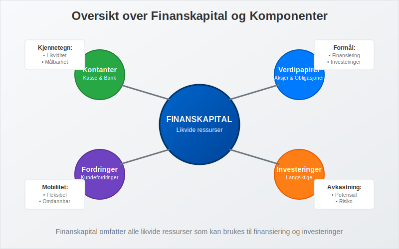
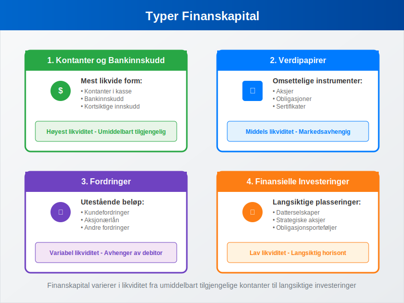
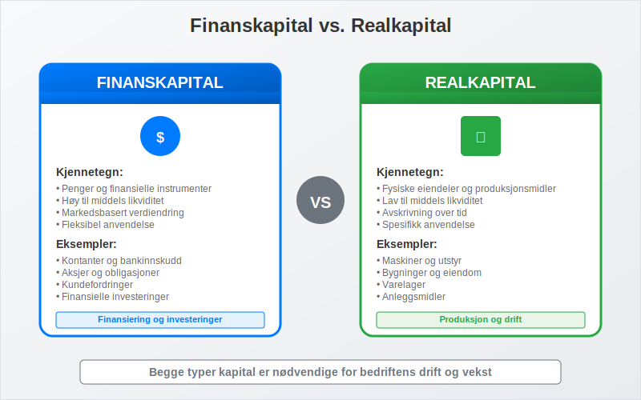
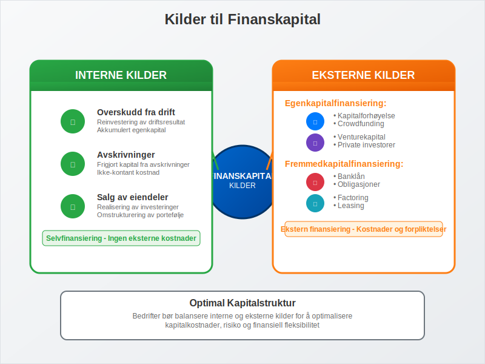
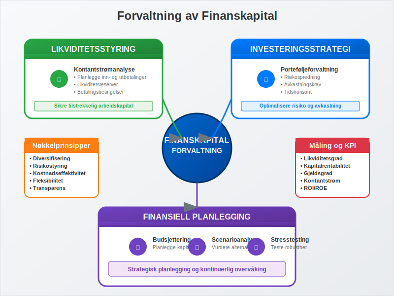

---
title: "Hva er Finanskapital?"
seoTitle: "Hva er Finanskapital?"
description: '**Finanskapital** er penger og finansielle instrumenter som kan brukes til å finansiere investeringer og drift i en bedrift. I motsetning til realkapital (fysi...'
---

**Finanskapital** er penger og finansielle instrumenter som kan brukes til å finansiere investeringer og drift i en bedrift. I motsetning til realkapital (fysiske eiendeler som maskiner og bygninger), representerer finanskapital den likvide kapitalen som kan omdannes til andre former for [eiendeler](/blogs/regnskap/hva-er-aktiva "Hva er Aktiva? En Komplett Guide til Eiendeler i Regnskap") eller brukes direkte i forretningsoperasjoner.

Finanskapital utgjør en fundamental del av enhver bedrifts [egenkapital](/blogs/regnskap/hva-er-egenkapital "Hva er Egenkapital? Komplett Guide til Egenkapital i Regnskap") og [arbeidskapital](/blogs/regnskap/hva-er-arbeidskapital "Hva er Arbeidskapital? Beregning og Betydning for Bedriftens Likviditet"), og er avgjørende for å forstå bedriftens finansielle stilling og evne til å finansiere vekst og daglig drift.

## Definisjon og Kjennetegn

Finanskapital kan defineres som **alle former for kapital som kan måles i pengeverdi** og som har følgende kjennetegn:

* **Likviditet:** Kan relativt enkelt omdannes til kontanter
* **Målbarhet:** Har en klar pengeverdi som kan beregnes
* **Mobilitet:** Kan flyttes mellom ulike investeringer og anvendelser
* **Avkastningspotensial:** Kan generere [avkastning](/blogs/regnskap/hva-er-avkastning "Hva er Avkastning? Komplett Guide til Investeringsavkastning og Beregning") gjennom investeringer

I regnskapssammenheng føres finanskapital som [finansielle eiendeler](/blogs/regnskap/hva-er-aktiva "Hva er Aktiva? En Komplett Guide til Eiendeler i Regnskap") på aktivasiden i [balansen](/blogs/regnskap/hva-er-balanse "Hva er Balanse? Komplett Guide til Balanseregnskap").

## Typer Finanskapital

Finanskapital kan kategoriseres i flere hovedtyper, hver med sine spesifikke egenskaper og anvendelsesområder:

### 1. Kontanter og Bankinnskudd

Den mest likvide formen for finanskapital:

* **Kontanter:** Fysiske penger i kasse
* **[Bankinnskudd](/blogs/regnskap/hva-er-bankinnskudd "Hva er Bankinnskudd? Typer, Renter og Regnskapsføring"):** Penger på bedriftens bankkontoer
* **Kortsiktige innskudd:** Sparekonto og andre likvide plasseringer

### 2. Verdipapirer

Finansielle instrumenter som kan omsettes:

* **[Aksjer](/blogs/regnskap/hva-er-en-aksje "Hva er en Aksje? En Enkel Forklaring"):** Eierandeler i andre selskaper
* **Obligasjoner:** Gjeldsinstrumenter som gir fast avkastning
* **Sertifikater:** Kortsiktige gjeldspapirer
* **Derivater:** Finansielle kontrakter basert på underliggende eiendeler

### 3. Fordringer

Penger som andre skylder bedriften:

* **Kundefordringer:** Utestående [fakturaer](/blogs/regnskap/hva-er-en-faktura "Hva er en Faktura? En Guide til Norske Fakturakrav") fra kunder
* **[Aksjonærlån fra AS](/blogs/regnskap/hva-er-aksjonaerlan-fra-as "Hva er Aksjonærlån fra AS? Skatt, Renter og Praktiske Råd"):** Lån gitt til aksjonærer
* **Andre fordringer:** Forskuddsbetalinger og tilgodehavender

### 4. Finansielle Investeringer

Langsiktige finansielle plasseringer:

* **Investeringer i datterselskaper**
* **Strategiske aksjeposter**
* **Obligasjonsporteføljer**
* **Alternative investeringer**

## Finanskapital vs. Realkapital

Det er viktig å forstå forskjellen mellom finanskapital og realkapital:

| Aspekt | Finanskapital | Realkapital |
|--------|---------------|-------------|
| **Definisjon** | Penger og finansielle instrumenter | Fysiske eiendeler og produksjonsmidler |
| **Eksempler** | Kontanter, aksjer, obligasjoner | Maskiner, bygninger, [anleggsmidler](/blogs/regnskap/hva-er-anleggsmidler "Hva er Anleggsmidler? Komplett Guide til Varige Driftsmidler") |
| **Likviditet** | Høy til middels | Lav til middels |
| **Verdiendring** | Markedsbasert, kan svinge | [Avskrivning](/blogs/regnskap/hva-er-avskrivning "Hva er Avskrivning? Metoder, Beregning og Regnskapsføring") over tid |
| **Anvendelse** | Finansiering og investeringer | Produksjon og drift |
| **Regnskapsføring** | Finansielle eiendeler | Varige driftsmidler |

## Betydning for Bedriftens Finansiering

Finanskapital spiller en sentral rolle i bedriftens finansieringsstrategi og påvirker flere viktige områder:

### Egenfinansiering

Finanskapital utgjør en viktig del av bedriftens [egenfinansiering](/blogs/regnskap/hva-er-egenfinansiering "Hva er Egenfinansiering? Komplett Guide til Egenkapitalfinansiering"):

* **[Aksjekapital](/blogs/regnskap/hva-er-aksjekapital "Hva er Aksjekapital? Krav og Forklaring"):** Kontantinnskudd fra eiere
* **Opptjent egenkapital:** Akkumulert overskudd fra drift
* **Kapitalreserver:** Overkurs og andre kapitalinnskudd

### Arbeidskapitalforvaltning

Finanskapital er avgjørende for å opprettholde tilstrekkelig [arbeidskapital](/blogs/regnskap/hva-er-arbeidskapital "Hva er Arbeidskapital? Beregning og Betydning for Bedriftens Likviditet"):

* **Likviditetsreserver:** For å møte kortsiktige forpliktelser
* **Driftsfinansiering:** Finansiere løpende kostnader
* **Sesongvariasjoner:** Håndtere svingninger i kontantstrøm

### Investeringskapasitet

Tilgang på finanskapital bestemmer bedriftens evne til å:

* **Ekspandere virksomheten**
* **Investere i ny teknologi**
* **Gjennomføre oppkjøp**
* **Utvikle nye produkter**

## Kilder til Finanskapital

Bedrifter kan skaffe finanskapital gjennom ulike kanaler:

### Interne Kilder

* **Overskudd fra drift:** Reinvestering av [driftsresultat](/blogs/regnskap/hva-er-driftsresultat "Hva er Driftsresultat? Beregning og Betydning i Regnskapet")
* **[Avskrivninger](/blogs/regnskap/hva-er-avskrivning "Hva er Avskrivning? Metoder, Beregning og Regnskapsføring"):** Frigjort kapital fra avskrivninger
* **Salg av eiendeler:** Realisering av investeringer

### Eksterne Kilder

#### Egenkapitalfinansiering
* **Kapitalforhøyelse:** Utstedelse av nye aksjer
* **[Crowdfunding](/blogs/regnskap/hva-er-crowdfunding "Hva er Crowdfunding i Regnskap? Regnskapsføring, Skatt og Juridiske Krav"):** Moderne finansieringsform
* **Venturekapital:** Profesjonelle investorer

#### [Fremmedkapitalfinansiering](/blogs/regnskap/hva-er-fremmedkapital "Hva er Fremmedkapital? Komplett Guide til Gjeld og Lånefinansiering")
* **Banklån:** Tradisjonell lånefinansiering
* **Obligasjoner:** Lån fra kapitalmarkedet
* **[Factoring](/blogs/regnskap/hva-er-factoring "Hva er Factoring? Komplett Guide til Fordringssalg og Finansiering"):** Salg av kundefordringer

## Regnskapsføring av Finanskapital

Korrekt regnskapsføring av finanskapital er avgjørende for å gi et riktig bilde av bedriftens finansielle stilling:

### Klassifisering i Balansen

Finanskapital klassifiseres som [aktiva](/blogs/regnskap/hva-er-aktiva "Hva er Aktiva? En Komplett Guide til Eiendeler i Regnskap") og deles inn i:

| Kategori | Eksempler | Plassering |
|----------|-----------|------------|
| **Anleggsmidler** | Langsiktige investeringer, aksjer i datterselskap | Finansielle anleggsmidler |
| **Omløpsmidler** | Kontanter, bankinnskudd, kortsiktige investeringer | Finansielle omløpsmidler |
| **Fordringer** | Kundefordringer, andre fordringer | Fordringer |

### Verdsettelse

Ulike typer finanskapital verdsettes forskjellig:

* **Kontanter:** Pålydende verdi
* **Bankinnskudd:** Bokført verdi
* **Verdipapirer:** Virkelig verdi eller [anskaffelseskost](/blogs/regnskap/hva-er-anskaffelseskost "Hva er Anskaffelseskost? Beregning og Regnskapsføring")
* **Fordringer:** Pålydende minus avsetning for tap

### Regnskapsføring av Endringer

Endringer i finanskapital påvirker både [balanse](/blogs/regnskap/hva-er-balanse "Hva er Balanse? Komplett Guide til Balanseregnskap") og resultatregnskap:

* **Gevinster/tap på investeringer:** Føres i resultatregnskapet
* **Valutagevinster/-tap:** Påvirker finansresultatet
* **Utbytte mottatt:** Inntektsføres når rett oppstår

## Forvaltning og Optimalisering

Effektiv forvaltning av finanskapital krever strategisk planlegging og kontinuerlig overvåking:

### Likviditetsstyring

* **Kontantstrømanalyse:** Planlegge inn- og utbetalinger
* **Likviditetsreserver:** Opprettholde tilstrekkelig buffer
* **Betalingsbetingelser:** Optimalisere kundefordringer

### Investeringsstrategi

* **Risikospredning:** Diversifisere investeringsporteføljen
* **Avkastningskrav:** Sette mål for investeringsavkastning
* **Tidshorisont:** Tilpasse investeringer til behov

### Finansiell Planlegging

* **[Budsjettering](/blogs/regnskap/hva-er-budsjettering "Hva er Budsjettering? Komplett Guide til Budsjettplanlegging"):** Planlegge kapitalbehov
* **Scenarioanalyse:** Vurdere ulike utviklingsalternativer
* **Stresstesting:** Teste robusthet under press

## Utfordringer og Risikofaktorer

Forvaltning av finanskapital innebærer flere risikofaktorer som må håndteres:

### Markedsrisiko

* **Kurssvingninger:** Verdiendringer på investeringer
* **Renterisiko:** Påvirkning av renteendringer
* **Valutarisiko:** Eksponering mot valutasvingninger

### Likviditetsrisiko

* **Finansieringsrisiko:** Problemer med å skaffe kapital
* **Refinansieringsrisiko:** Utfordringer ved fornyelse av lån
* **Operasjonell likviditetsrisiko:** Mangel på arbeidskapital

### Kredittrisiko

* **Motpartsrisiko:** Risiko for at andre ikke betaler
* **Konsentrasjonsrisiko:** For stor eksponering mot enkelte kunder
* **Systemrisiko:** Risiko i det finansielle systemet

## Moderne Utviklingstrekk

Finanskapitalmarkedet er i stadig utvikling, med nye trender som påvirker hvordan bedrifter håndterer sin finanskapital:

### Digitalisering

* **Fintech-løsninger:** Nye teknologier for finansforvaltning
* **Automatisering:** Digitale prosesser for kapitalstyring
* **Blockchain:** Nye former for finansielle transaksjoner

### Bærekraftig Finansiering

* **ESG-investeringer:** Miljø-, sosial- og styringshensyn
* **Grønne obligasjoner:** Finansiering av bærekraftige prosjekter
* **Impact investing:** Investeringer med samfunnsnytte

### Alternative Finansieringsformer

* **[Crowdlending](/blogs/regnskap/hva-er-crowdlending "Hva er Crowdlending? P2P-utlån og Regnskapsføring"):** Peer-to-peer utlån
* **Kryptovaluta:** Digitale valutaer som investeringsalternativ
* **Tokenisering:** Digitalisering av tradisjonelle eiendeler

## Praktiske Råd for Bedrifter

For å optimalisere forvaltningen av finanskapital bør bedrifter:

### Etablere Klare Retningslinjer

* **Investeringspolicy:** Definere rammer for investeringer
* **Likviditetspolicy:** Sette mål for kontantbeholdning
* **Risikopolicy:** Etablere risikorammer og -kontroller

### Implementere Kontrollsystemer

* **Rapportering:** Regelmessig overvåking av finansiell posisjon
* **Autorisasjon:** Klare fullmakter for finansielle beslutninger
* **Segregering:** Adskillelse av oppgaver for intern kontroll

### Kontinuerlig Kompetanseutvikling

* **Opplæring:** Sikre kompetanse innen finansforvaltning
* **Markedsovervåking:** Følge med på utviklingen i finansmarkedene
* **Profesjonell rådgivning:** Bruke ekstern ekspertise ved behov

Finanskapital er en kritisk ressurs for enhver bedrift, og effektiv forvaltning av denne kapitalen kan være avgjørende for bedriftens suksess og langsiktige bærekraft. Ved å forstå de ulike typene finanskapital, deres egenskaper og hvordan de kan forvaltes optimalt, kan bedrifter ta bedre finansielle beslutninger og sikre en solid økonomisk fremtid.

