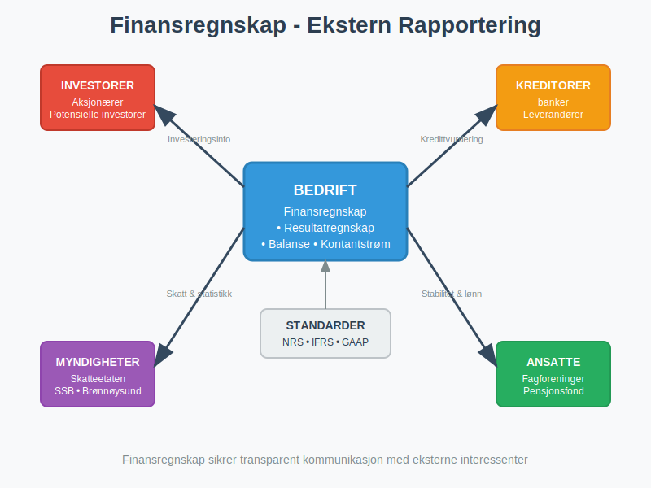
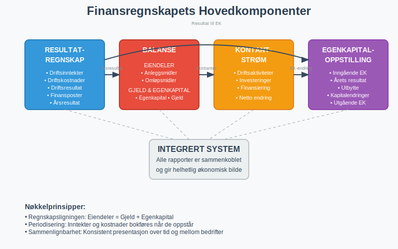
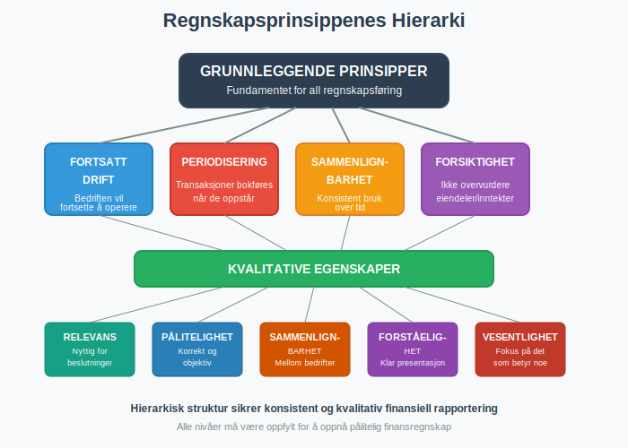
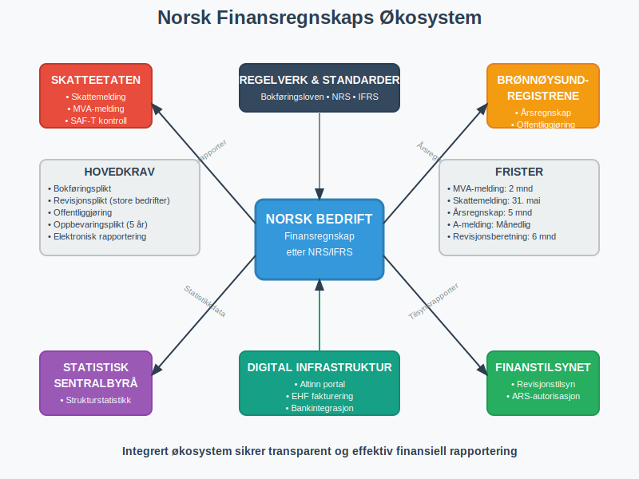

**Finansregnskap** er den delen av [regnskapet](/blogs/regnskap/hva-er-regnskap "Hva er Regnskap? En Dybdeanalyse for Norge") som fokuserer på **ekstern rapportering** til interessenter utenfor bedriften. Det er et standardisert system for å kommunisere bedriftens økonomiske stilling, resultater og kontantstrømmer til investorer, kreditorer, myndigheter og andre eksterne parter. Finansregnskapet følger strenge regnskapsstandarder og lovkrav for å sikre sammenlignbarhet, pålitelighet og transparens.

## Finansregnskapets Formål og Målgrupper

Finansregnskapet tjener som **kommunikasjonsverktøy** mellom bedriften og dens eksterne interessenter. I motsetning til ledelsesregnskap, som er internt rettet og fleksibelt, er finansregnskapet strengt regulert og standardisert.

### Primære Interessenter

Finansregnskapet retter seg mot flere kritiske interessentgrupper:

* **Investorer og Aksjonærer:** Trenger informasjon for å vurdere investeringsmuligheter og overvåke sine investeringer. For [aksjeselskaper](/blogs/regnskap/hva-er-et-aksjeselskap "Hva er et Aksjeselskap (AS)? Komplett Guide til Norske Aksjeselskaper") er dette spesielt viktig for å vurdere [aksjekapital](/blogs/regnskap/hva-er-aksjekapital "Hva er Aksjekapital? En Komplett Guide til Egenkapital i AS") og [aksjeklasser](/blogs/regnskap/hva-er-aksjeklasser "Hva er Aksjeklasser? En Guide til Ulike Aksjetyper i Norge").

* **Kreditorer og Långivere:** Vurderer bedriftens [betalingsevne](/blogs/regnskap/hva-er-betalingsevne "Hva er Betalingsevne? En Komplett Guide til Likviditet og Soliditet") og kredittverdighet før de gir lån eller kreditt.

* **Myndigheter:** Bruker finansregnskapet til skatteberegning, statistikk og tilsynsformål. Dette inkluderer rapportering til Skatteetaten, SSB og andre offentlige etater.

* **Leverandører:** Vurderer bedriftens evne til å betale for varer og tjenester, ofte gjennom analyse av [arbeidskapital](/blogs/regnskap/hva-er-arbeidskapital "Hva er Arbeidskapital? En Komplett Guide til Working Capital") og likviditet.

* **Ansatte og Fagforeninger:** Interessert i bedriftens stabilitet og evne til å opprettholde arbeidsplasser og lønninger.

## Regnskapsstandarder og Rammeverk

Finansregnskapet bygger på etablerte regnskapsstandarder som sikrer konsistens og sammenlignbarhet på tvers av bedrifter og land.

### Norske Regnskapsstandarder (NRS)

I Norge følger de fleste bedrifter **Norske Regnskapsstandarder (NRS)**, som er basert på EU-direktiver og tilpasset norske forhold. Disse standardene dekker:

* **God regnskapsskikk:** Grunnleggende prinsipper for regnskapsføring
* **Måling og verdsetting:** Hvordan eiendeler og gjeld skal verdsettes
* **Presentasjon:** Hvordan regnskapet skal presenteres

### International Financial Reporting Standards (IFRS)

Større børsnoterte selskaper må følge **[IFRS](/blogs/regnskap/hva-er-ifrs "Hva er IFRS? Komplett Guide til International Financial Reporting Standards")**, som er globale regnskapsstandarder. IFRS sikrer internasjonal sammenlignbarhet og er obligatorisk for:

* Børsnoterte selskaper i EU/EØS
* Selskaper som ønsker internasjonal kapital
* Datterselskaper av utenlandske konsern

For en omfattende forståelse av IFRS, inkludert historisk utvikling, implementering i Norge, og sammenligning med nasjonale standarder, se vår detaljerte guide til [IFRS](/blogs/regnskap/hva-er-ifrs "Hva er IFRS? Komplett Guide til International Financial Reporting Standards").

### Sammenligning av Standarder

| Aspekt | NRS | IFRS |
|--------|-----|------|
| **Anvendelse** | Norske ikke-børsnoterte selskaper | Børsnoterte selskaper og internasjonale konsern |
| **Kompleksitet** | Enklere, tilpasset SMB | Mer kompleks, detaljert |
| **Oppdateringsfrekvens** | Sjeldnere endringer | Hyppige oppdateringer |
| **Verdivurdering** | Hovedsakelig historisk kost | Mer bruk av virkelig verdi |
| **Notekrav** | Mindre omfattende | Extensive notekrav |
## Finansielle instrumenter

Finansregnskapet omfatter også måling og presentasjon av **finansielle instrumenter**, inkludert **derivater** som opsjoner, futures og swaps. Les mer i vår detaljerte guide til [Hva er Derivater?](/blogs/regnskap/derivater "Hva er Derivater? En Guide til Derivater i Regnskap").

## Finansregnskapets Hovedkomponenter

Finansregnskapet består av flere sammenkoblede rapporter som gir et helhetlig bilde av bedriftens økonomi.

### 1. Resultatregnskapet

**Resultatregnskapet** viser bedriftens inntekter, kostnader og nettoresultat over en bestemt periode (vanligvis ett år). Det gir svar på spørsmålet: "Hvor lønnsom er bedriften?"

Hovedkomponenter inkluderer:

* **[Driftsinntekter](/blogs/regnskap/hva-er-driftsinntekter "Hva er Driftsinntekter? En Komplett Guide til Operative Inntekter"):** Inntekter fra kjernevirksomheten
* **[Driftskostnader](/blogs/regnskap/hva-er-driftskostnader "Hva er Driftskostnader? Typer, Beregning og Regnskapsføring - Komplett Guide"):** Kostnader knyttet til den daglige driften
* **[Driftsresultat](/blogs/regnskap/hva-er-driftsresultat "Hva er Driftsresultat? En Komplett Guide til EBIT og Operasjonell Lønnsomhet"):** Resultatet fra kjernevirksomheten
* **Finansposter:** Renteinntekter og rentekostnader
* **Skattekostnad:** Beregnet skatt på årets resultat

### 2. Balansen

**[Balansen](/blogs/regnskap/hva-er-balanse "Hva er Balanse i Regnskap? Komplett Guide til Balansens Oppbygging og Funksjon")** viser bedriftens økonomiske stilling på et bestemt tidspunkt. Den følger den grunnleggende regnskapsligningen:

**Eiendeler = Gjeld + Egenkapital**

Balansen er delt i:

* **[Anleggsmidler](/blogs/regnskap/hva-er-anleggsmidler "Hva er Anleggsmidler? En Komplett Guide til Langsiktige Eiendeler"):** Langsiktige eiendeler som bygninger, maskiner og immaterielle rettigheter
* **Omløpsmidler:** Kortsiktige eiendeler som varelager, kundefordringer og kontanter
* **[Egenkapital](/blogs/regnskap/hva-er-egenkapital "Hva er Egenkapital? En Komplett Guide til Eierkapital i Bedriften"):** Eiernes andel av bedriften
* **Langsiktig gjeld:** Forpliktelser med forfallstid over ett år
* **Kortsiktig gjeld:** Forpliktelser med forfallstid innen ett år

### 3. Kontantstrømoppstillingen

**[Kontantstrømoppstillingen](/blogs/regnskap/hva-er-kontantstromoppstilling "Hva er Kontantstrømoppstilling? Komplett Guide til Kontantstrømanalyse og Rapportering")** viser hvordan kontanter strømmer inn og ut av bedriften og er en kritisk komponent i finansregnskapet. Den gir innsikt i bedriftens likviditet og evne til å generere kontanter fra driften.

Kontantstrømoppstillingen kategoriserer kontantstrømmer i tre hovedområder:

| Aktivitetstype | Beskrivelse | Eksempler |
|----------------|-------------|-----------|
| **Driftsaktiviteter** | Kontantstrømmer fra kjernevirksomheten | Innbetalinger fra kunder, utbetalinger til leverandører |
| **Investeringsaktiviteter** | Kjøp og salg av langsiktige eiendeler | Kjøp av maskiner, salg av bygninger |
| **Finansieringsaktiviteter** | Endringer i kapitalstruktur | Låneopptak, utbytteutbetalinger, aksjeemisjoner |

For en omfattende forståelse av kontantstrømoppstillingens struktur, utarbeidelsesmetoder og analyse, se vår detaljerte guide til [kontantstrømoppstilling](/blogs/regnskap/hva-er-kontantstromoppstilling "Hva er Kontantstrømoppstilling? Komplett Guide til Kontantstrømanalyse og Rapportering"). For dyptgående analyseteknikker og praktisk anvendelse av kontantstrømdata, anbefaler vi også vår omfattende artikkel om [kontantstrømanalyse](/blogs/regnskap/hva-er-kontantstromanalyse "Hva er Kontantstrømanalyse? Komplett Guide til Cash Flow Analyse").

### 4. Egenkapitaloppstillingen

Viser endringer i [egenkapitalen](/blogs/regnskap/hva-er-egenkapital "Hva er Egenkapital? En Komplett Guide til Eierkapital i Bedriften") gjennom året, inkludert:

* Årets resultat
* Utbytteutbetalinger
* Kapitalinnskudd
* Andre egenkapitalendringer

## Regnskapsprinsipper og Kvalitetskrav

Finansregnskapet bygger på fundamentale prinsipper som sikrer kvalitet og pålitelighet i den finansielle rapporteringen.

### Grunnleggende Prinsipper

* **Fortsatt drift:** Forutsetning om at bedriften vil fortsette driften
* **Periodisering:** Inntekter og kostnader bokføres når de oppstår, ikke når kontanter mottas/betales
* **Sammenlignbarhet:** Konsistent bruk av regnskapsprinsipper over tid
* **Forsiktighet:** Ikke overvurdere eiendeler eller undervurdere gjeld

### Kvalitative Egenskaper

Finansiell informasjon må oppfylle flere kvalitetskrav:

| Egenskap | Beskrivelse | Praktisk Betydning |
|----------|-------------|-------------------|
| **Relevans** | Informasjonen må være nyttig for beslutninger | Fokus på vesentlig informasjon |
| **Pålitelighet** | Informasjonen må være korrekt og objektiv | Korrekt [dokumentasjon](/blogs/regnskap/hva-er-dokumentasjon-regnskap-bokforing "Hva er Dokumentasjon i Regnskap og Bokføring? Komplett Guide") og [bilagsbehandling](/blogs/regnskap/hva-er-bilag "Hva er Bilag i Regnskap? Komplett Guide til Regnskapsbilag og Dokumentasjon") |
| **Sammenlignbarhet** | Mulighet til å sammenligne med andre bedrifter | Standardiserte formater og prinsipper |
| **Forståelighet** | Informasjonen må være klar og begripelig | Tydelig presentasjon og [Noter](/blogs/regnskap/noter "Noter - Komplett Guide til Regnskapsnoter i Norge") |

## Verdivurdering og Måling

En kritisk del av finansregnskapet er hvordan eiendeler og gjeld skal måles og verdsettes.

### Verdivurderingsmetoder

* **Historisk kost:** [Anskaffelseskost](/blogs/regnskap/hva-er-anskaffelseskost "Hva er Anskaffelseskost? En Komplett Guide til Kostpris og Verdsetting") minus akkumulerte [avskrivninger](/blogs/regnskap/hva-er-avskrivning "Hva er Avskrivning? En Komplett Guide til Avskrivningsmetoder")
* **Virkelig verdi:** Markedsverdi på måletidspunktet
* **Netto realisasjonsverdi:** Forventet salgspris minus salgsomkostninger
* **Nåverdi:** Diskontert verdi av fremtidige kontantstrømmer

### Spesielle Vurderingsområder

* **Varelager:** Vanligvis verdsatt til laveste av kost og netto realisasjonsverdi
* **Kundefordringer:** Justert for forventede tap på fordringer
* **Anleggsmidler:** Systematisk [avskrivning](/blogs/regnskap/hva-er-avskrivning "Hva er Avskrivning? En Komplett Guide til Avskrivningsmetoder") over brukstiden

## Norske Særkrav og Rapportering

I Norge har finansregnskapet spesielle krav og sammenhenger med offentlig rapportering.

### Lovpålagte Rapporter

Norske bedrifter må levere flere rapporter basert på finansregnskapet:

* **Årsregnskap:** Til Brønnøysundregistrene innen frister
* **[Kvartalsrapporter](/blogs/regnskap/hva-er-kvartalsrapport "Hva er Kvartalsrapport? Komplett Guide til Kvartalsrapportering i Norge"):** Børsnoterte selskaper må publisere kvartalsrapporter innen to måneder etter kvartalets slutt
* **Skattemelding:** Basert på regnskapsresultatet med skattemessige justeringer
* **MVA-melding:** Periodisk rapportering av [merverdiavgift](/blogs/regnskap/hva-er-avgiftsplikt-mva "Hva er Avgiftsplikt (MVA)? Komplett Guide til Merverdiavgift i Norge")

### Revisjonsplikt

Større bedrifter har [revisjonsplikt](/blogs/regnskap/hva-er-arbeidspapirer-revisjon "Hva er Arbeidspapirer i Revisjon? Komplett Guide til Revisjonsdokumentasjon"), hvor en autorisert revisor må bekrefte at finansregnskapet gir et rettvisende bilde.

### Offentliggjøring

Aksjeselskaper og andre selskapsformer må offentliggjøre sitt årsregnskap, som blir tilgjengelig for allmennheten gjennom Brønnøysundregistrene.

## Analyse og Bruk av Finansregnskap

Finansregnskapet er grunnlaget for omfattende økonomisk analyse og beslutninger.

### Finansiell Analyse

Interessenter bruker ulike analyseteknikker:

* **Forholdstallanalyse:** Sammenligning av nøkkeltall som [egenkapitalrentabilitet](/blogs/regnskap/hva-er-egenkapitalrentabilitet "Hva er Egenkapitalrentabilitet? En Komplett Guide til ROE-beregning") og [dekningsgrad](/blogs/regnskap/hva-er-dekningsgrad "Hva er Dekningsgrad? En Komplett Guide til Likviditetsanalyse")
* **[KPI-analyse](/blogs/regnskap/hva-er-kpi "Hva er KPI? Key Performance Indicators i Regnskap og Bedriftsstyring"):** Systematisk måling av prestasjonsindikatorer
* **Trendanalyse:** Utvikling over tid
* **Sammenlignende analyse:** Benchmarking mot konkurrenter

### Beslutningsgrunnlag

Finansregnskapet brukes til:

* **Investeringsbeslutninger:** Vurdering av lønnsomhet og risiko
* **Kredittvurdering:** Analyse av [betalingsevne](/blogs/regnskap/hva-er-betalingsevne "Hva er Betalingsevne? En Komplett Guide til Likviditet og Soliditet")
* **Strategisk planlegging:** Grunnlag for fremtidige beslutninger, inkludert vurdering av [konjunktursvingninger](/blogs/regnskap/hva-er-konjunktur "Hva er Konjunktur? En Komplett Guide til Økonomiske Sykluser")

## Digitalisering og Fremtiden

Finansregnskapet er i stadig utvikling, drevet av teknologiske fremskritt og endrede krav.

### Automatisering

Moderne teknologi transformerer finansregnskapet:

* **Automatisk [bilagsregistrering](/blogs/regnskap/hva-er-bilagsregistrere "Hva er Bilagsregistrering? En Komplett Guide til Digital Bilagsbehandling"):** AI-basert gjenkjenning av fakturaer og bilag
* **Sanntidsrapportering:** Kontinuerlig oppdatering av finansielle data
* **Integrerte systemer:** [ERP-systemer](/blogs/regnskap/hva-er-erp-system "Hva er ERP-system? Komplett Guide til Enterprise Resource Planning") som kobler alle forretningsprosesser

### Nye Rapporteringskrav

* **[CSRD](/blogs/regnskap/hva-er-csrd "CSRD - Corporate Sustainability Reporting Directive: Komplett Guide for Norske Bedrifter"):** Bærekraftsrapportering blir obligatorisk for større bedrifter
* **[ESG](/blogs/regnskap/hva-er-esg "Hva er ESG? En Komplett Guide til Miljø, Sosial og Styring i Regnskap")-rapportering:** Miljø, sosiale forhold og selskapsstyring
* **Digitale standarder:** Økt bruk av strukturerte dataformater

## Utfordringer og Beste Praksis

Finansregnskapet står overfor flere utfordringer som krever kontinuerlig oppmerksomhet.

### Vanlige Utfordringer

* **Kompleksitet:** Økende krav til detaljering og [Noter](/blogs/regnskap/noter "Noter - Komplett Guide til Regnskapsnoter i Norge")
* **Teknologisk utvikling:** Behov for oppdatering av systemer og kompetanse
* **Regulatoriske endringer:** Hyppige endringer i standarder og lovkrav
* **Kvalitetssikring:** Sikre nøyaktighet og fullstendighet

### Beste Praksis

For å sikre høy kvalitet i finansregnskapet bør bedrifter:

* **Implementere sterke interne kontroller:** Inkludert [attestering](/blogs/regnskap/hva-er-attestering "Hva er Attestering? En Komplett Guide til Bilagsbehandling og Godkjenning") og [avstemming](/blogs/regnskap/hva-er-avstemming "Hva er Avstemming i Regnskap? Komplett Guide til Regnskapsavstemming")
* **Investere i kompetanse:** Kontinuerlig opplæring av regnskapspersonell
* **Bruke profesjonelle tjenester:** Vurdere [autoriserte regnskapsførerselskaper](/blogs/regnskap/hva-er-ars "Hva er ARS? Autorisert Regnskapsførerselskap - Krav, Fordeler og Prosess")
* **Planlegge for endringer:** Forberede seg på nye krav og standarder

## Konklusjon

Finansregnskap er ryggraden i ekstern finansiell kommunikasjon og en kritisk komponent for tillit i markedsøkonomien. Det gir standardisert, pålitelig informasjon som gjør det mulig for eksterne interessenter å ta informerte beslutninger om bedriften.

For norske bedrifter er det viktig å forstå både internasjonale standarder og nasjonale særkrav. Med økende digitalisering og nye rapporteringskrav som bærekraft, vil finansregnskapet fortsette å utvikle seg og kreve kontinuerlig oppmerksomhet fra ledelse og regnskapspersonell.

En solid forståelse av finansregnskapets prinsipper, komponenter og anvendelse er essensielt for alle som arbeider med eller bruker finansiell informasjon i næringslivet.

