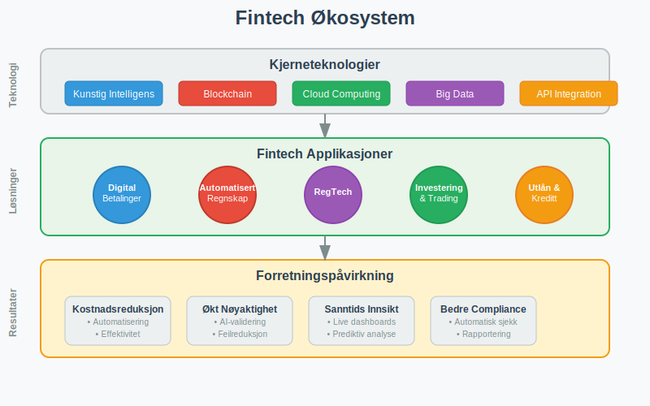
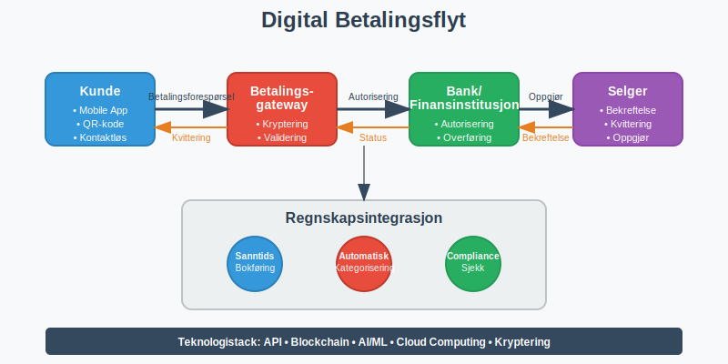
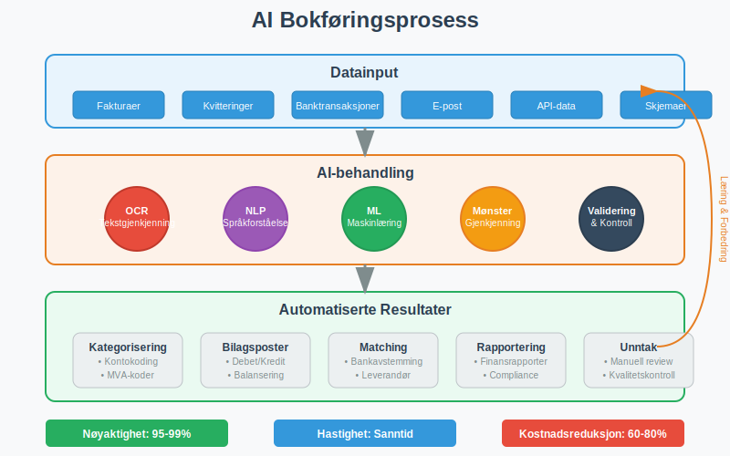
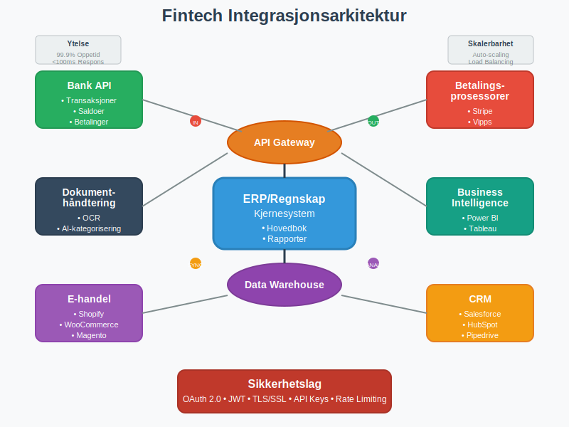
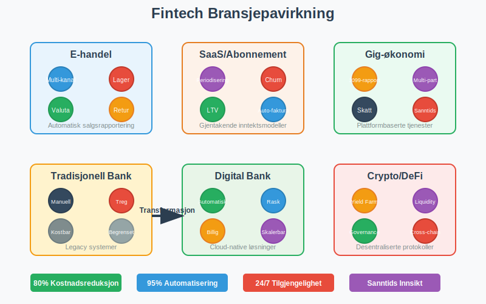
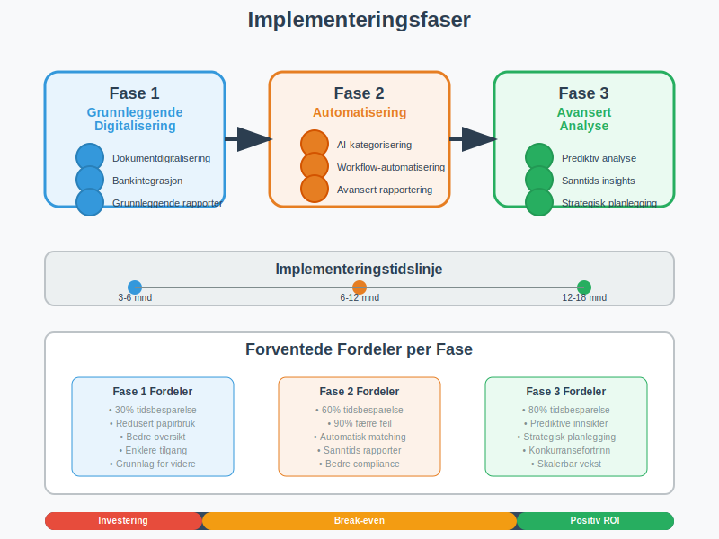

---
title: "Hva er Fintech?"
seoTitle: "Hva er Fintech?"
description: 'Hva fintech er, eksempler på løsninger og hvordan teknologien påvirker regnskap, betalinger og rapportering.'
summary: 'Hva fintech er, eksempler på løsninger og hvordan teknologien påvirker regnskap, betalinger og rapportering.'
---

**Fintech** (finansteknologi) representerer den revolusjonerende sammensmeltingen av finansielle tjenester og avansert teknologi. Dette dynamiske feltet transformerer hvordan bedrifter håndterer [regnskap](/blogs/regnskap/hva-er-regnskap "Hva er Regnskap? Komplett Guide til Regnskapsføring"), betalinger, og finansielle prosesser. Fra automatisert [bokføring](/blogs/regnskap/hva-er-bokforing "Hva er Bokføring? Komplett Guide til Bokføringsprinsipper") til kunstig intelligens-drevne analyser, fintech redefinerer den finansielle landskapet og skaper nye muligheter for effektivitet og innovasjon.

## Seksjon 1: Grunnleggende Fintech-Konsepter

### 1.1 Definisjon og Omfang av Fintech

**Fintech** er en sammensetting av "financial" og "technology", og omfatter alle teknologiske innovasjoner som forbedrer, automatiserer eller digitaliserer finansielle tjenester. I regnskapssammenheng inkluderer fintech:

* **Automatisert bokføring:** AI-drevne systemer som kategoriserer og registrerer transaksjoner
* **Digitale betalingsløsninger:** Moderne betalingsmetoder som påvirker [kontantstrøm](/blogs/regnskap/hva-er-arbeidskapital "Hva er Arbeidskapital? En Komplett Guide til Working Capital")
* **Blockchain og kryptovaluta** ([lær mer om kryptovaluta](/blogs/regnskap/kryptovaluta "Hva er Kryptovaluta? Guide til regnskapsføring av digital valuta")): Distribuerte hovedbøker for transparent regnskapsføring
* **Regtech:** Regulatorisk teknologi for compliance og rapportering
* **Robo-advisory:** Automatiserte investeringsrådgivningstjenester

### 1.2 Fintech's Påvirkning på Tradisjonell Regnskap

Fintech-løsninger transformerer fundamentale regnskapsprosesser ved å:

* **Redusere manuelle feil:** Automatisering minimerer menneskelige feil i [bilagsføring](/blogs/regnskap/hva-er-bilagsforing "Hva er Bilagsføring? Komplett Guide til Bilagsregistrering")
* **Øke hastighet:** Sanntidsbehandling av transaksjoner og rapporter
* **Forbedre nøyaktighet:** Maskinlæring forbedrer kategorisering og matching
* **Styrke compliance:** Automatisk overholdelse av [bokføringsregler](/blogs/regnskap/hva-er-bokforingsregler "Hva er Bokføringsregler? Komplett Guide til Norske Bokføringsstandarder")

## Seksjon 2: Digitale Betalingsløsninger og Regnskap

### 2.1 Moderne Betalingsmetoder

Fintech har revolusjonert betalingslandskapet med innovative løsninger som direkte påvirker regnskapsføring:

#### Mobile Betalinger og Digital Wallets

* **Vipps og lignende tjenester:** Øyeblikkelige overføringer som krever sanntids bokføring
* **Apple Pay/Google Pay:** Kontaktløse betalinger med komplekse transaksjonsdata
* **QR-kode betalinger:** Direkte kobling mellom fysiske og digitale transaksjoner

#### [Kryptovaluta](/blogs/regnskap/kryptovaluta "Hva er Kryptovaluta? Guide til regnskapsføring av digital valuta") og Blockchain

**Blockchain-teknologi** skaper nye utfordringer og muligheter for regnskapsføring:

* **Transparent hovedbok:** Alle transaksjoner er sporbare og uforanderlige
* **Smart contracts:** Automatiske kontraktsutførelser som påvirker [avtalegjeld](/blogs/regnskap/hva-er-avtalegiro "Hva er AvtaleGiro? Komplett Guide til Automatiske Betalinger")
* **Desentraliserte finanser (DeFi):** Nye finansielle instrumenter uten tradisjonelle mellommenn

### 2.2 Integrasjon med Regnskapssystemer

| Betalingsmetode | Integrasjonskompleksitet | Sanntidsrapportering | Compliance-krav |
|-----------------|-------------------------|---------------------|-----------------|
| **Tradisjonell bankoverføring** | Lav | Nei | Standard |
| **Kortbetalinger** | Middels | Delvis | PCI DSS |
| **Mobile betalinger** | Høy | Ja | Varierende |
| **Kryptovalutaer** | Svært høy | Ja | Utviklende |
| **BNPL (Buy Now Pay Later)** | Middels | Ja | Forbrukerrett |

## Seksjon 3: Automatisert Bokføring og AI

### 3.1 Kunstig Intelligens i Regnskapsføring

**AI-drevne regnskapssystemer** transformerer hvordan bedrifter håndterer [dokumentasjon](/blogs/regnskap/hva-er-dokumentasjon-regnskap-bokforing "Hva er Dokumentasjon i Regnskap og Bokføring? Komplett Guide"):

#### Maskinlæring for Transaksjonskategorisering

* **Automatisk kategorisering:** AI lærer fra historiske data for å klassifisere nye transaksjoner
* **Anomalideteksjon:** Identifisering av uvanlige transaksjoner som krever manuell gjennomgang
* **Prediktiv analyse:** Prognoser for [kontantstrøm](/blogs/regnskap/hva-er-arbeidskapital "Hva er Arbeidskapital? En Komplett Guide til Working Capital") og finansielle trender

#### Optisk Tegngjenkjenning (OCR) og Dokumentbehandling

Moderne fintech-løsninger kan:

* **Skanne og tolke fakturaer:** Automatisk utvinning av data fra [fakturaer](/blogs/regnskap/hva-er-en-faktura "Hva er en Faktura? En Guide til Norske Fakturakrav")
* **Behandle kvitteringer:** Digital arkivering og kategorisering av [bilag](/blogs/regnskap/hva-er-bilag "Hva er Bilag i Regnskap? Komplett Guide til Regnskapsbilag")
* **Validere data:** Kryssjekking mot bankutskrifter og andre kilder

### 3.2 Robotic Process Automation (RPA) i Regnskap

**RPA-teknologi** automatiserer repetitive regnskapsoppgaver:

* **Månedlig avstemming:** Automatisk [bankavstemming](/blogs/regnskap/hva-er-bankavstemming "Hva er Bankavstemming? Komplett Guide til Bankavstemmingsprosessen") og kontoavstemminger
* **Rapportgenerering:** Automatisk produksjon av finansielle rapporter
* **Compliance-sjekker:** Kontinuerlig overvåking av regelverksetterlevelse
* **Datamigrering:** Sømløs overføring mellom ulike regnskapssystemer

## Seksjon 4: Cloud-baserte Regnskapssystemer

### 4.1 Software as a Service (SaaS) for Regnskap

**Cloud-baserte regnskapssystemer** tilbyr betydelige fordeler:

#### Tilgjengelighet og Skalerbarhet

* **24/7 tilgang:** Regnskapsdata tilgjengelig fra hvor som helst
* **Automatiske oppdateringer:** Alltid oppdatert med nyeste funksjoner og sikkerhetspatcher
* **Skalerbar infrastruktur:** Kapasitet som vokser med bedriftens behov
* **Integrerte økosystemer:** Sømløs kobling med andre forretningssystemer

#### Kostnadseffektivitet

| Tradisjonell Software | Cloud-basert SaaS |
|----------------------|-------------------|
| Høye oppstartskostnader | Lave månedlige kostnader |
| IT-infrastruktur påkrevd | Ingen infrastrukturkostnader |
| Manuelle oppdateringer | Automatiske oppdateringer |
| Begrenset skalerbarhet | Ubegrenset skalerbarhet |
| Lokale sikkerhetskopier | Automatisk backup i skyen |

### 4.2 Integrasjon og API-økonomi

**Application Programming Interfaces (APIs)** muliggjør sømløs integrasjon mellom ulike fintech-tjenester:

* **Bankintegrasjon:** Direkte tilkobling til bankkontoer for sanntids transaksjonshenting
* **E-handelssystemer:** Automatisk synkronisering av salgsdata
* **CRM-systemer:** Integrert kunde- og faktureringshåndtering
* **Lønnssystemer:** Automatisk overføring av lønnsdata til regnskapet

## Seksjon 5: Regulatorisk Teknologi (RegTech)

### 5.1 Automatisert Compliance

**RegTech-løsninger** sikrer automatisk overholdelse av regnskapsstandarder:

#### Norske Regnskapsstandarder

* **Automatisk [bokføringsplikt](/blogs/regnskap/hva-er-bokforingsplikt "Hva er Bokføringsplikt? Komplett Guide til Bokføringspliktige Virksomheter")-overvåking:** Kontinuerlig sjekk av lovpålagte krav
* **[Bokføringsforskriften](/blogs/regnskap/hva-er-bokforingsforskriften "Hva er Bokføringsforskriften? Komplett Guide til Norske Bokføringsregler")-compliance:** Automatisk validering mot forskriftskrav
* **MVA-rapportering:** Automatisert merverdiavgiftsberegning og -rapportering
* **Årsrapport-generering:** Automatisk produksjon av lovpålagte rapporter

#### Internasjonale Standarder

* **IFRS-compliance:** Automatisk tilpasning til internasjonale regnskapsstandarder
* **GDPR-overholdelse:** Databeskyttelse og personvernhåndtering
* **Anti-hvitvasking (AML):** Automatisk overvåking av mistenkelige transaksjoner

### 5.2 Sanntids Rapportering og Overvåking

Moderne RegTech-systemer tilbyr:

* **Kontinuerlig overvåking:** 24/7 compliance-sjekker
* **Automatiske varsler:** Umiddelbare notifikasjoner ved avvik
* **Prediktiv compliance:** Forutsigelse av potensielle regelverksbrudd
* **Automatisk dokumentasjon:** Sporbarhet og revisjonssti for alle transaksjoner

## Seksjon 6: Fintech's Påvirkning på Ulike Bransjer

### 6.1 E-handel og Digital Handel

**E-handelsintegrasjon** krever spesialiserte regnskapsløsninger:

* **Multi-kanal salgsrapportering:** Konsolidering av salg fra ulike plattformer
* **Automatisk lagerføring:** Sanntids oppdatering av [varelager](/blogs/regnskap/hva-er-varelager "Hva er Varelager? Komplett Guide til Lagerregnskapet")
* **Valutahåndtering:** Automatisk omregning for internasjonalt salg
* **Returstyring:** Automatisert håndtering av refusjoner og krediteringer

### 6.2 Abonnementstjenester og SaaS-bedrifter

**Abonnementsmodeller** krever spesialiserte regnskapsbehandling:

* **Periodisering av inntekter:** Automatisk fordeling av abonnementsinntekter
* **Churn-analyse:** Prediktiv analyse av kundefrafall
* **Lifetime Value (LTV) beregninger:** Automatisk beregning av kundeverdier
* **Automatisk fakturering:** Gjentakende [fakturaer](/blogs/regnskap/hva-er-fakturagebyr "Hva er Fakturagebyr? Komplett Guide til Fakturagebyr og Purregebyr") og betalingsinnkreving

### 6.3 Gig-økonomi og Freelancing

**Plattformøkonomi** skaper nye regnskapsutfordringer:

* **1099-rapportering:** Automatisk rapportering av freelancer-betalinger
* **Multi-part transaksjoner:** Håndtering av plattformavgifter og provisjoner
* **Skatteoptimalisering:** Automatisk beregning av fradrag og skatteforpliktelser
* **Sanntids inntektssporing:** Øyeblikkelig synlighet i inntjening

## Seksjon 7: Fremtidige Trender og Teknologier

### 7.1 Emerging Technologies

**Neste generasjons fintech-teknologier** som vil påvirke regnskap:

#### Quantum Computing

* **Komplekse beregninger:** Øyeblikkelig behandling av massive datasett
* **Kryptografi:** Ny sikkerhet for finansielle transaksjoner
* **Optimalisering:** Avanserte algoritmer for finansiell planlegging

#### Internet of Things (IoT) og Regnskap

* **Smart contracts:** Automatiske betalinger basert på IoT-data
* **Supply chain tracking:** Sanntids sporbarhet av varer og tjenester
* **Automatisk fakturering:** IoT-utløste faktureringsprosesser

### 7.2 Bærekraft og ESG-rapportering

**Environmental, Social, and Governance (ESG)** rapportering blir stadig viktigere:

* **Karbonregnskap:** Automatisk sporing av miljøpåvirkning
* **Bærekraftsmetrikker:** Integrerte ESG-indikatorer i finansielle rapporter
* **Stakeholder-rapportering:** Automatiserte rapporter til ulike interessenter
* **Impact measurement:** Kvantifisering av sosial og miljømessig påvirkning

### 7.3 Desentraliserte Finanser (DeFi) og Regnskap

**DeFi-protokoller** skaper nye regnskapsutfordringer:

* **Yield farming:** Komplekse avkastningsstrategier som krever spesialisert regnskapsføring
* **Liquidity mining:** Automatisk belønning for likviditetstilførsel
* **Governance tokens:** Nye former for eierskap og stemmerett
* **Cross-chain transactions:** Transaksjoner på tvers av ulike blockchain-nettverk

## Seksjon 8: Implementering av Fintech-løsninger

### 8.1 Evaluering og Utvelgelse

**Kriterier for valg av fintech-løsninger:**

| Evalueringskriterium | Vektning | Viktige Faktorer |
|---------------------|----------|------------------|
| **Funksjonalitet** | 30% | Dekker forretningsbehov, skalerbarhet |
| **Integrasjon** | 25% | API-tilgjengelighet, kompatibilitet |
| **Sikkerhet** | 20% | Datakryptering, compliance |
| **Kostnad** | 15% | Total eiekostnad, ROI |
| **Support** | 10% | Kundeservice, opplæring |

#### Due Diligence Prosess

* **Leverandørvurdering:** Finansiell stabilitet og track record
* **Sikkerhetstesting:** Penetrasjonstesting og sårbarhetsanalyse
* **Referansesjekk:** Erfaringer fra eksisterende kunder
* **Pilot-testing:** Begrenset implementering for evaluering

### 8.2 Implementeringsstrategi

**Fasevis implementering** reduserer risiko og sikrer suksess:

#### Fase 1: Grunnleggende Digitalisering
* **Dokumentdigitalisering:** Overgang fra papir til digitale [bilag](/blogs/regnskap/hva-er-bilag "Hva er Bilag i Regnskap? Komplett Guide til Regnskapsbilag")
* **Bankintegrasjon:** Automatisk import av banktransaksjoner
* **Grunnleggende rapportering:** Standardiserte finansielle rapporter

#### Fase 2: Automatisering
* **AI-kategorisering:** Automatisk klassifisering av transaksjoner
* **Workflow-automatisering:** Automatiserte godkjenningsprosesser
* **Avansert rapportering:** Tilpassede dashboards og analyser

#### Fase 3: Avansert Analyse
* **Prediktiv analyse:** Prognoser og trendanalyse
* **Sanntids insights:** Øyeblikkelige forretningsinnsikter
* **Strategisk planlegging:** AI-assistert finansiell planlegging

## Seksjon 9: Sikkerhet og Risikohåndtering

### 9.1 Cybersikkerhet i Fintech

**Kritiske sikkerhetstiltak** for fintech-implementering:

#### Datakryptering og Beskyttelse

* **End-to-end kryptering:** Beskyttelse av data i transit og hvile
* **Multi-faktor autentisering:** Flere lag med sikkerhet
* **Zero-trust arkitektur:** Kontinuerlig verifisering av tilgang
* **Regular security audits:** Periodiske sikkerhetsvurderinger

#### Compliance og Regulering

* **PCI DSS:** Kredittkortdatasikkerhet
* **GDPR:** Personvernbeskyttelse
* **PSD2:** Betalingstjenestedirektivet
* **Norske personvernlover:** Lokal compliance

### 9.2 Operasjonell Risiko

**Risikofaktorer** ved fintech-implementering:

* **Systemnedetid:** Backup-systemer og redundans
* **Dataintegritetsrisiko:** Validering og kvalitetskontroll
* **Leverandørrisiko:** Avhengighet av tredjepartsleverandører
* **Kompetanserisiko:** Behov for opplæring og kompetanseutvikling

## Seksjon 10: Kostnader og ROI

### 10.1 Kostnad-Nytte Analyse

**Typiske kostnader** ved fintech-implementering:

| Kostnadskategori | Engangsbeløp | Løpende Kostnader | Besparelser |
|------------------|--------------|-------------------|-------------|
| **Software-lisenser** | 50,000-200,000 NOK | 10,000-50,000 NOK/mnd | - |
| **Implementering** | 100,000-500,000 NOK | - | - |
| **Opplæring** | 25,000-100,000 NOK | 5,000-20,000 NOK/mnd | - |
| **Vedlikehold** | - | 15,000-75,000 NOK/mnd | - |
| **Tidsbesparelser** | - | - | 100,000-500,000 NOK/mnd |
| **Feilreduksjon** | - | - | 25,000-150,000 NOK/mnd |

### 10.2 Måling av Suksess

**Key Performance Indicators (KPIs)** for fintech-implementering:

#### Effektivitetsmålinger
* **Behandlingstid:** Reduksjon i tid for regnskapsoppgaver
* **Feilrate:** Reduksjon i manuelle feil
* **Automatiseringsgrad:** Andel automatiserte prosesser
* **Brukeradopsjon:** Andel ansatte som aktivt bruker systemet

#### Finansielle Målinger
* **Return on Investment (ROI):** Finansiell avkastning på investering
* **Cost per transaction:** Kostnad per behandlet transaksjon
* **Time to value:** Tid før positive effekter realiseres
* **Total Cost of Ownership (TCO):** Totale eiekostnader over tid

## Konklusjon

**Fintech** representerer en fundamental transformasjon av hvordan bedrifter håndterer finansielle prosesser og [regnskapsføring](/blogs/regnskap/hva-er-regnskap "Hva er Regnskap? Komplett Guide til Regnskapsføring"). Fra automatisert [bokføring](/blogs/regnskap/hva-er-bokforing "Hva er Bokføring? Komplett Guide til Bokføringsprinsipper") til AI-drevne analyser, fintech-løsninger tilbyr enorme muligheter for økt effektivitet, nøyaktighet og innsikt.

Suksessful implementering krever grundig planlegging, riktig teknologivalg, og fokus på sikkerhet og compliance. Bedrifter som omfavner fintech-innovasjon posisjonerer seg for fremtidens digitale økonomi, mens de som nøler risikerer å bli hengende etter i et stadig mer konkurransedyktig marked.

**Nøkkelbudskap:**
* Fintech transformerer alle aspekter av finansielle tjenester og regnskap
* Automatisering og AI reduserer kostnader og forbedrer nøyaktighet
* Cloud-baserte løsninger tilbyr skalerbarhet og fleksibilitet
* Sikkerhet og compliance må prioriteres i alle implementeringer
* ROI realiseres gjennom økt effektivitet og reduserte feilkostnader

Fremtiden tilhører bedrifter som strategisk integrerer fintech-løsninger i sine finansielle prosesser, og skaper dermed grunnlag for bærekraftig vekst og konkurransefortrinn i den digitale økonomien.

