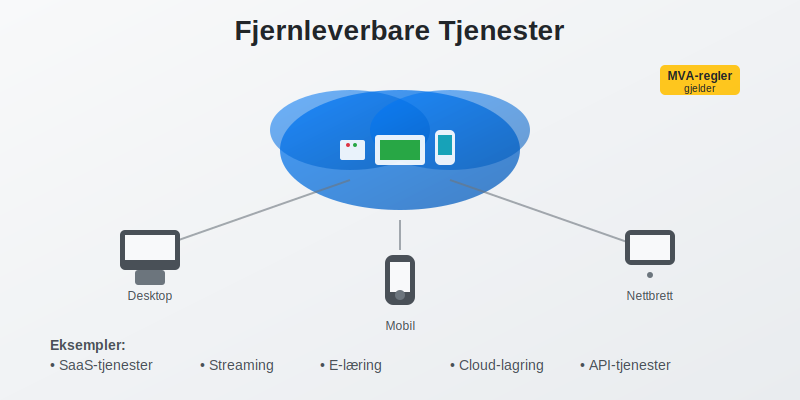
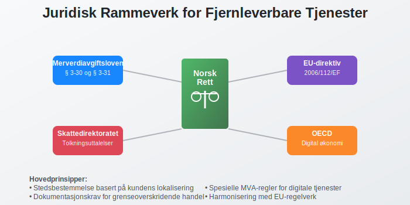
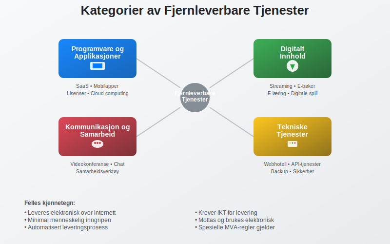

---
title: "Hva er Fjernleverbare Tjenester i Regnskap?"
seoTitle: "Hva er Fjernleverbare Tjenester i Regnskap?"
description: '**Fjernleverbare tjenester** er tjenester som kan leveres elektronisk over internett uten at leverandøren og kunden trenger å være fysisk til stede på samme...'
summary: 'Forklaring av fjernleverbare tjenester, eksempler, MVA-regler (B2B/B2C) og riktig bokføring med praktiske eksempler.'
---

**Fjernleverbare tjenester** er tjenester som kan leveres elektronisk over internett uten at leverandøren og kunden trenger å være fysisk til stede på samme sted. Disse digitale tjenestene har fått økt betydning i moderne økonomi og har **spesielle MVA-regler** og bokføringskrav som norske bedrifter må forholde seg til. Forståelse av fjernleverbare tjenester er kritisk for korrekt [MVA-behandling](/blogs/regnskap/hva-er-avgiftsplikt-mva "Hva er Avgiftsplikt MVA? Komplett Guide til Merverdiavgift") og [bokføring](/blogs/regnskap/hva-er-bokforing "Hva er Bokføring? Komplett Guide til Grunnleggende Regnskapsprinsipper").



## Definisjon av Fjernleverbare Tjenester

Fjernleverbare tjenester er **elektroniske tjenester** som kjennetegnes ved at de:

* **Leveres over internett** eller andre elektroniske nettverk
* **Krever minimal eller ingen menneskelig inngripen** fra leverandørens side
* **Kan ikke leveres** uten informasjons- og kommunikasjonsteknologi
* **Mottas og brukes** av kunden elektronisk
* **Har automatisert leveringsprosess** som hovedregel

### Juridisk Grunnlag

I norsk rett reguleres fjernleverbare tjenester primært gjennom:

* **Merverdiavgiftsloven** § 3-30 og § 3-31
* **EU-direktiv 2006/112/EF** (MVA-direktivet)
* **Skattedirektoratets** tolkningsuttalelser
* **OECD-retningslinjer** for digital økonomi



## Eksempler på Fjernleverbare Tjenester

Fjernleverbare tjenester omfatter et bredt spekter av digitale tjenester:

### Programvare og Applikasjoner

* **Software as a Service (SaaS)** - skybaserte programløsninger
* **Mobilapplikasjoner** og nedlastbare programmer
* **Lisenser** til programvare og digitale verktøy
* **Oppdateringer** og vedlikehold av programvare
* **Cloud computing** tjenester

### Digitalt Innhold

* **Streaming-tjenester** for video og musikk
* **E-bøker** og digitale publikasjoner
* **Online-kurs** og e-læring
* **Digitale spill** og underholdning
* **Podkaster** og lydinnhold

### Kommunikasjon og Samarbeid

* **Videokonferanse-tjenester** som Zoom, Teams
* **Kommunikasjonsplattformer** som Slack, Discord
* **Samarbeidsverktøy** som Google Workspace, Office 365
* **Sosiale medier** og nettverkstjenester
* **E-posttjenester** og meldingsapper

### Tekniske Tjenester

* **Webhotell** og domenenetjenester
* **Backup** og lagringsstjenester
* **Sikkerhetstjenester** og antivirus
* **API-tjenester** og integrasjoner
* **Teknisk support** via chat eller fjernstøtte



## MVA-regler for Fjernleverbare Tjenester

**MVA-behandlingen** av fjernleverbare tjenester følger spesielle regler som skiller seg fra ordinære tjenester:

### Stedsbestemmelse

Fjernleverbare tjenester anses levert der **kunden har sitt sete**, ikke der leverandøren befinner seg:

| Kundetype | Stedsbestemmelse | MVA-behandling |
|-----------|------------------|----------------|
| **Privatpersoner (B2C)** | Kundens bostedsland | MVA i kundens land |
| **Næringsdrivende (B2B)** | Kundens forretningssted | Omvendt avgiftsplikt |
| **Offentlige virksomheter** | Kundens lokalisering | Spesielle regler |

For øvrig gjelder egne stedsbestemmelsesregler for *stedbundne tjenester*. Se [Stedbunden tjeneste](/blogs/regnskap/hva-er-stedbunden-tjeneste "Hva er Stedbunden tjeneste i Regnskap? MVA-regler og Bokføring") for mer informasjon.

### B2C-salg (Business to Consumer)

Ved salg til **privatpersoner** i andre EU-land:

* **Norske bedrifter** må registrere seg for MVA i kundens land
* **Alternativt** kan MOSS-ordningen (Mini One Stop Shop) benyttes
* **MVA-satsen** i kundens land skal anvendes
* **Dokumentasjon** av kundens lokalisering er påkrevd

### B2B-salg (Business to Business)

Ved salg til **næringsdrivende** i andre EU-land:

* **Omvendt avgiftsplikt** - kunden betaler MVA
* **Leverandøren** skal ikke beregne MVA
* **Kundens MVA-nummer** må dokumenteres og valideres
* **Faktura** må inneholde henvisning til omvendt avgiftsplikt


## Bokføring av Fjernleverbare Tjenester

Korrekt bokføring av fjernleverbare tjenester krever forståelse av både **inntektsføring** og **MVA-behandling**:

### Inntektsføring

Inntekter fra fjernleverbare tjenester skal føres når:

* **Tjenesten er levert** til kunden
* **Kunden har fått tilgang** til tjenesten
* **Betalingsforpliktelsen** er oppstått
* **Leveringsvilkårene** er oppfylt

### Bokføringseksempel - B2C-salg

**Scenario:** Norsk SaaS-bedrift selger abonnement til tysk privatperson for 1.000 kr + tysk MVA (19%)

```
Salg til tysk kunde:
Debet: Kundefordringer          1.190 kr
Kredit: Salgsinntekt            1.000 kr
Kredit: Utgående MVA (Tyskland)   190 kr
```

### Bokføringseksempel - B2B-salg

**Scenario:** Norsk bedrift selger API-tjeneste til svensk bedrift for 5.000 kr (omvendt avgiftsplikt)

```
Salg til svensk bedrift:
Debet: Kundefordringer          5.000 kr
Kredit: Salgsinntekt            5.000 kr
(Ingen MVA - omvendt avgiftsplikt)
```

### Dokumentasjonskrav

For fjernleverbare tjenester må følgende dokumenteres:

* **Kundens identitet** og lokalisering
* **Tjenestens art** og leveringstidspunkt
* **Betalingsinformasjon** og valuta
* **MVA-behandling** og eventuelle unntak
* **Tekniske leveringsdetaljer** (IP-adresse, etc.)


## Praktiske Utfordringer

Bedrifter som leverer fjernleverbare tjenester møter flere **praktiske utfordringer**:

### Identifikasjon av Kundens Lokalisering

* **IP-adresse** kan være misvisende (VPN, proxy)
* **Betalingsinformasjon** (kredittkort, bankkonto)
* **Fakturaadresse** og leveringsadresse
* **Kundens egenerklæring** om lokalisering
* **Kombinasjon av indikatorer** for sikker identifikasjon

### MVA-registrering i Multiple Land

* **Terskelverdier** varierer mellom land
* **Registreringsprosesser** er forskjellige
* **Rapporteringsfrister** og -format varierer
* **Språkbarrierer** og lokale krav
* **Kostnader** ved registrering og compliance

### Tekniske Løsninger

Moderne bedrifter benytter ofte:

* **Automatiserte MVA-systemer** som TaxJar, Avalara
* **Geolokalisering** og IP-tracking
* **Integrerte betalingsløsninger** med MVA-håndtering
* **ERP-systemer** med internasjonal MVA-støtte
* **Compliance-verktøy** for dokumentasjon

## Fremtidige Utviklingstrekk

Området for fjernleverbare tjenester er i **kontinuerlig utvikling**:

### Digitale Tjenester Pakke (DSP)

EU arbeider med nye regler som vil:

* **Forenkle** MVA-regler for digitale tjenester
* **Harmonisere** rapporteringskrav
* **Redusere** administrative byrder
* **Forbedre** grenseoverskridende handel

### Kunstig Intelligens og Automatisering

* **AI-drevne tjenester** får økt betydning
* **Automatisk MVA-beregning** og rapportering
* **Prediktiv compliance** og risikovurdering
* **Blockchain-basert** dokumentasjon og sporing

### Bærekraft og ESG

* **Miljørapportering** for digitale tjenester
* **Karbonfotavtrykk** av cloud-tjenester
* **Sosial påvirkning** av digitalisering
* **Governance** av data og personvern


## Sammenheng med Andre Regnskapskonsepter

Fjernleverbare tjenester påvirker flere andre områder i regnskapet:

### Internprising

* **Transfer pricing** for konserninternt salg
* **Dokumentasjon** av armslengdeprinsippet
* **Allokering** av inntekter mellom land
* **OECD BEPS** Action 1 - digital økonomi

### Permanent Etablering

* **Digital PE** - når oppstår skatteplikt?
* **Betydelig digital tilstedeværelse** som kriterium
* **Terskelverdier** for inntekter og brukere
* **Allokering** av overskudd til PE

### Immaterielle Eiendeler

Fjernleverbare tjenester er ofte basert på:

* **[Programvare](/blogs/regnskap/hva-er-anleggsmidler "Hva er Anleggsmidler? Materielle, Immaterielle og Finansielle Eiendeler")** og teknologiske løsninger
* **Databaser** og kunderegistre
* **Merkevarer** og goodwill
* **Patenter** og opphavsrettigheter

## Compliance og Risikostyring

Effektiv håndtering av fjernleverbare tjenester krever:

### Risikovurdering

* **MVA-risiko** ved feil stedsbestemmelse
* **Skattemessig risiko** ved permanent etablering
* **Operasjonell risiko** ved systemfeil
* **Regulatorisk risiko** ved regelendringer

### Kontrollsystemer

* **Automatiserte kontroller** i IT-systemer
* **Månedlige avstemminger** av MVA-beregninger
* **Kvartalsvise gjennomganger** av nye kunder
* **Årlige compliance-revisjoner** av prosesser

### Dokumentasjon

Bedriften må opprettholde:

* **Detaljerte kunderegistre** med lokalisering
* **Tekniske logger** over tjenesteleveranser
* **MVA-beregninger** og begrunnelser
* **Korrespondanse** med skattemyndigheter


## Praktiske Råd for Bedrifter

### For Oppstartsbedrifter

* **Start enkelt** - fokuser på hjemmemarkedet først
* **Implementer** riktige systemer fra dag én
* **Søk profesjonell rådgivning** tidlig
* **Planlegg** for internasjonal ekspansjon

### For Etablerte Bedrifter

* **Gjennomgå** eksisterende prosesser og systemer
* **Oppdater** kunderegistre med lokalisering
* **Implementer** automatiserte MVA-løsninger
* **Tren** personalet i nye regler

### For Regnskapsførere

* **Hold deg oppdatert** på regelendringer
* **Invester** i spesialiserte verktøy
* **Bygg kompetanse** innen digital økonomi
* **Samarbeid** med internasjonale eksperter

## Konklusjon

Fjernleverbare tjenester representerer en **voksende del** av moderne økonomi og krever spesialisert kunnskap innen både [regnskap](/blogs/regnskap/hva-er-regnskap "Hva er Regnskap? Komplett Guide til Regnskapsprinsipper og Praksis") og MVA-behandling. Bedrifter som leverer slike tjenester må:

* **Forstå** komplekse stedsbestemmelsesregler
* **Implementere** robuste systemer for compliance
* **Dokumentere** alle transaksjoner grundig
* **Holde seg oppdatert** på regelendringer

Med riktig tilnærming kan fjernleverbare tjenester være en **lønnsom** og **skalerbar** forretningsmodell som åpner for global vekst. Nøkkelen ligger i å etablere **solide prosesser** fra starten og investere i **riktige verktøy** og **kompetanse**.

For bedrifter som vurderer å tilby fjernleverbare tjenester, anbefales det å søke profesjonell rådgivning for å sikre korrekt håndtering av alle regnskapsmessige og skattemessige aspekter. Dette vil minimere risiko og maksimere mulighetene i det digitale markedet.


