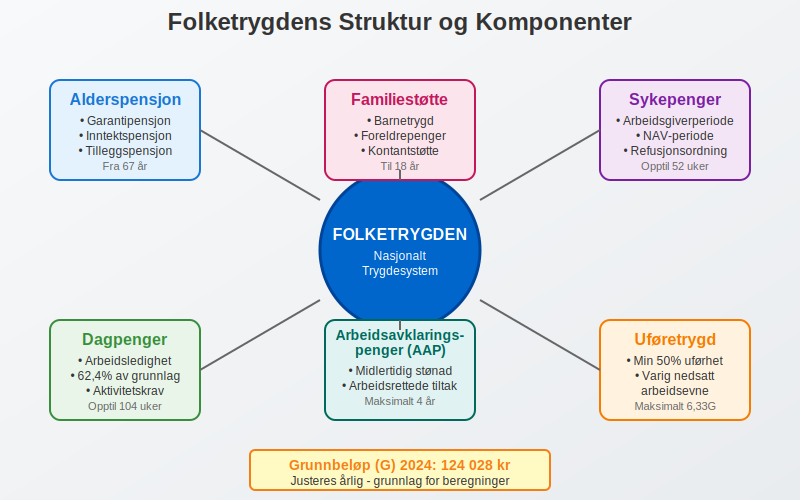
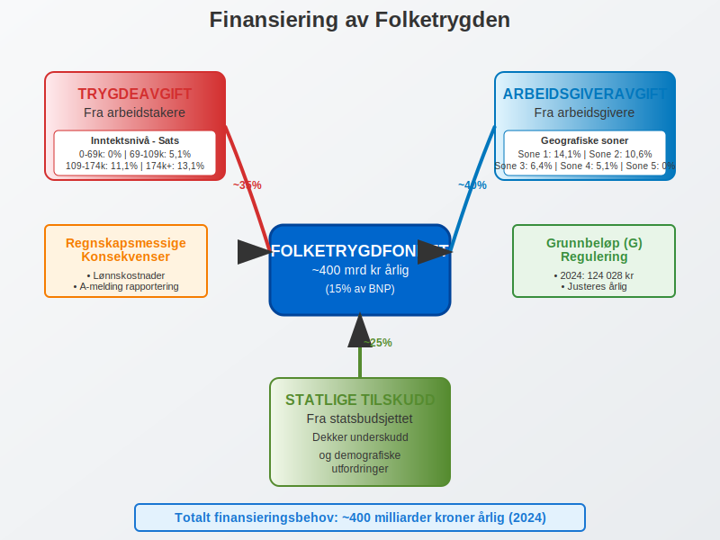
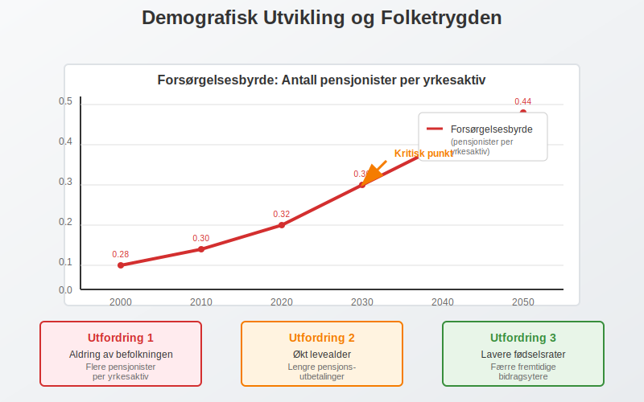

---
title: "Hva er Folketrygden? Komplett Guide til Norges Nasjonale Trygdesystem"
meta_title: "Hva er Folketrygden? Komplett Guide til Norges Nasjonale Trygdesystem"
meta_description: '**Folketrygden** er Norges nasjonale trygdesystem som sikrer økonomisk trygghet for alle som bor eller arbeider i Norge. Dette omfattende systemet er en hjørn...'
slug: hva-er-folketrygden
type: blog
layout: pages/single
---

**Folketrygden** er Norges nasjonale trygdesystem som sikrer økonomisk trygghet for alle som bor eller arbeider i Norge. Dette omfattende systemet er en hjørnestein i den norske velferdsstaten og har betydelige implikasjoner for både privatpersoner og bedrifter når det gjelder [regnskap](/blogs/regnskap/hva-er-regnskap "Hva er Regnskap? En Dybdeanalyse for Norge") og økonomisk planlegging.

## Hva er Folketrygden?

Folketrygden er et obligatorisk, offentlig trygdesystem som ble etablert i 1967 og erstatte flere tidligere ordninger. Systemet bygger på prinsippet om **universell dekning**, hvilket betyr at alle som bor eller arbeider i Norge har rett til ytelser fra folketrygden.



### Hovedformål med Folketrygden

* **Inntektssikring** ved sykdom, uførhet, arbeidsledighet og alderdom
* **Familiestøtte** gjennom barnetrygd og foreldrepenger
* **Helsehjelp** gjennom refusjon av medisinske utgifter
* **Rehabilitering** og arbeidsrettede tiltak

## Folketrygdens Hovedkomponenter

### 1. Alderspensjon

Alderspensjon er den største utgiftsposten i folketrygden og består av flere komponenter:

| Pensjonskomponent | Beskrivelse | Opptjeningsperiode |
|-------------------|-------------|-------------------|
| **Garantipensjon** | Minstepensjon for alle med minst 40 års botid | 16-66 år |
| **Inntektspensjon** | Basert på pensjonsgivende inntekt | 13-75 år |
| **Tilleggspensjon** | For inntekt over 1G ([grunnbeløpet](/blogs/regnskap/hva-er-grunnbelop "Hva er Grunnbeløp? Komplett Guide til Grunnbeløpet i Norge")) | Varierer |

### 2. Sykepenger og Helserelaterte Ytelser

**Sykepenger** utgjør en betydelig del av folketrygdens utgifter og har direkte regnskapsmessige konsekvenser for arbeidsgivere:

* **Arbeidsgiverperioden:** De første 16 kalenderdagene betales av arbeidsgiver
* **NAV-perioden:** Fra dag 17 betales av NAV (opptil 52 uker)
* **Sykepengegrunnlag:** Maksimalt 6G ([grunnbeløp](/blogs/regnskap/hva-er-grunnbelop "Hva er Grunnbeløp? Komplett Guide til Grunnbeløpet i Norge"))

For bedrifter er det viktig å forstå hvordan sykepenger påvirker [arbeidsgiveravgift](/blogs/regnskap/hva-er-arbeidsgiveravgift "Hva er Arbeidsgiveravgift? Satser, Beregning og Regnskapsføring") og [lønnskostnader](/blogs/regnskap/hva-er-fastlonn "Hva er Fastlønn? Komplett Guide til Fastlønn vs Timelønn").

### 3. Dagpenger ved Arbeidsledighet

Dagpenger sikrer inntekt for arbeidsledige som oppfyller visse krav:

* **Minsteinntekt:** Minimum 1,5G siste kalenderår eller 3G siste 3 år (basert på [grunnbeløpet](/blogs/regnskap/hva-er-grunnbelop "Hva er Grunnbeløp? Komplett Guide til Grunnbeløpet i Norge"))
* **Dagpengeperiode:** Opptil 104 uker (lengre for eldre arbeidstakere)
* **Dagpengesats:** 62,4% av dagpengegrunnlaget

### 4. Uføretrygd

Uføretrygd gis til personer med varig nedsatt arbeidsevne:

* **Uføregrad:** Minimum 50% nedsatt arbeidsevne
* **Beregning:** Basert på tidligere inntekt og uføregrad
* **Maksimal ytelse:** 6,33G per år (basert på [grunnbeløpet](/blogs/regnskap/hva-er-grunnbelop "Hva er Grunnbeløp? Komplett Guide til Grunnbeløpet i Norge"))

## Finansiering av Folketrygden

**Trygdeopgjøret** er det årlige oppgjøret av innbetalt trygdeavgift og beregnede ytelser i folketrygden. Les mer om [Trygdeopgjøret](/blogs/regnskap/trygdeopgjoret "Trygdeopgjøret: Guide til Årlig Oppgjør av Trygdeavgift og Ytelser").

Folketrygden finansieres gjennom tre hovedkilder som har direkte regnskapsmessige konsekvenser:



### 1. Trygdeavgift fra Arbeidstakere

**Trygdeavgift** betales av alle som har pensjonsgivende inntekt i Norge:

| Inntektsnivå | Trygdeavgiftssats |
|--------------|-------------------|
| 0 - 69 050 kr | 0% |
| 69 051 - 109 650 kr | 5,1% |
| 109 651 - 174 500 kr | 11,1% |
| Over 174 500 kr | 13,1% |

*Satser for 2024*

### 2. Arbeidsgiveravgift

[Arbeidsgiveravgift](/blogs/regnskap/hva-er-arbeidsgiveravgift "Hva er Arbeidsgiveravgift? Satser, Beregning og Regnskapsføring") er en avgift arbeidsgivere betaler på lønn og andre ytelser til ansatte. Avgiften varierer geografisk:

| Sone | Avgiftssats | Geografisk område |
|------|-------------|-------------------|
| **Sone 1** | 14,1% | Oslo, Bærum, Asker |
| **Sone 2** | 10,6% | Resten av Østlandet, Rogaland, Hordaland |
| **Sone 3** | 6,4% | Trøndelag, Agder |
| **Sone 4** | 5,1% | Nord-Norge, deler av Møre og Romsdal |
| **Sone 5** | 0% | Finnmark, Nord-Troms |

### 3. Statlige Tilskudd

Staten dekker underskuddet i folketrygden gjennom årlige tilskudd fra statsbudsjettet.

## Regnskapsmessige Implikasjoner

### For Arbeidsgivere

Folketrygden har flere regnskapsmessige konsekvenser som må håndteres korrekt i [bokføringen](/blogs/regnskap/hva-er-bokforing "Hva er Bokføring? En Komplett Guide til Norsk Bokføringspraksis"):

#### 1. Arbeidsgiveravgift

Arbeidsgiveravgift må beregnes og bokføres for alle lønnsutbetalinger:

```
Debet: Lønnskostnad (arbeidsgiveravgift)
Kredit: Skyldig arbeidsgiveravgift
```

#### 2. Sykepenger i Arbeidsgiverperioden

Sykepenger i arbeidsgiverperioden bokføres som ordinær lønnskostnad:

```
Debet: Lønnskostnad (sykepenger)
Kredit: Bank/Kontanter
```

#### 3. Refusjon fra NAV

Når NAV refunderer sykepenger, bokføres dette som en reduksjon i lønnskostnader:

```
Debet: Fordring NAV
Kredit: Lønnskostnad (refusjon sykepenger)
```

### Rapportering gjennom A-meldingen

[A-meldingen](/blogs/regnskap/hva-er-a-melding "Hva er A-melding? Komplett Guide til A-meldingen og Innlevering") er den månedlige rapporteringen til myndighetene som inkluderer:

* **Lønnsinformasjon** for alle ansatte
* **Beregnet arbeidsgiveravgift**
* **Trygdeavgift** trukket fra ansatte
* **Forskuddstrekk** i skatt

## Grunnbeløpet (G) - Folketrygdens Målestokk

**[Grunnbeløpet](/blogs/regnskap/hva-er-grunnbelop "Hva er Grunnbeløp? Komplett Guide til Grunnbeløpet i Norge")** (G) er en sentral størrelse i folketrygden som justeres årlig og brukes til å beregne ytelser og avgifter. For en dyptgående forklaring av grunnbeløpets rolle og anvendelse, se vår omfattende guide til [grunnbeløpet](/blogs/regnskap/hva-er-grunnbelop "Hva er Grunnbeløp? Komplett Guide til Grunnbeløpet i Norge").

| År | Grunnbeløp (G) | Endring |
|----|----------------|---------|
| 2024 | 124 028 kr | +7,8% |
| 2023 | 118 620 kr | +6,9% |
| 2022 | 111 477 kr | +3,5% |
| 2021 | 106 399 kr | +2,6% |

### Betydning av G-regulering

G-reguleringen påvirker:

* **Pensjonsnivåer** og andre trygdeytelser
* **Frikort** og skattefrie beløp
* **Maksimale dagpengesatser**
* **Uføretrygd** og andre erstatninger

## Folketrygdens Rolle i Norsk Økonomi

### Makroøkonomisk Betydning

Folketrygden utgjør en betydelig del av norsk økonomi:

* **Utgifter:** Cirka 400 milliarder kroner årlig (2024)
* **BNP-andel:** Omtrent 15% av Norges BNP
* **Sysselsetting:** Direkte og indirekte sysselsetting i offentlig sektor

### Demografiske Utfordringer

Norge står overfor demografiske endringer som påvirker folketrygden:

* **Aldring av befolkningen:** Flere pensjonister per yrkesaktiv
* **Levealder:** Økt levealder krever lengre pensjonsutbetalinger
* **Fødselsrater:** Lavere fødselsrater reduserer fremtidig arbeidsstyrke



## Internasjonale Aspekter

### EØS-avtalen og Trygdekoordinering

Norge er bundet av **EØS-avtalen** som sikrer:

* **Portabilitet** av pensjonsrettigheter
* **Likebehandling** av EØS-borgere
* **Koordinering** med andre lands trygdesystemer

### Bilaterale Trygdeavtaler

Norge har trygdeavtaler med flere land utenfor EØS:

* **USA:** Koordinering av pensjon og uføretrygd
* **Canada:** Gjensidig anerkjennelse av opptjeningstid
* **Australia:** Portabilitet av alderspensjon

## Fremtidige Reformer og Utvikling

### Pensjonssystemet

Flere reformer er under vurdering:

* **Levealdersjustering:** Automatisk justering basert på levealder
* **Fleksibel pensjon:** Mulighet for gradvis pensjonering
* **Opptjeningsmodell:** Endringer i hvordan pensjon tjenes opp

### Digitalisering

NAV arbeider kontinuerlig med digitalisering:

* **Selvbetjening:** Flere tjenester tilgjengelig online
* **Automatisering:** Redusert saksbehandlingstid
* **Datadeling:** Bedre koordinering mellom offentlige etater

## Praktiske Råd for Bedrifter

### Compliance og Etterlevelse

For å sikre korrekt håndtering av folketrygd-relaterte forpliktelser:

1. **Implementer robuste systemer** for beregning av arbeidsgiveravgift
2. **Hold deg oppdatert** på endringer i satser og regler
3. **Dokumenter alle beregninger** for revisjonsformål
4. **Bruk profesjonelle regnskapssystemer** som håndterer kompleksiteten

### Regnskapsmessig Oppfølging

* **Månedlig avstemming** av arbeidsgiveravgift og trygdeavgift
* **Korrekt klassifisering** av lønnskostnader og avgifter
* **Oppfølging av refusjoner** fra NAV
* **Dokumentasjon** av alle folketrygd-relaterte transaksjoner

## Konklusjon

Folketrygden er et komplekst og omfattende system som berører alle aspekter av norsk samfunns- og næringsliv. For bedrifter er det avgjørende å forstå systemets regnskapsmessige implikasjoner og sikre korrekt håndtering av relaterte forpliktelser.

Systemets universelle karakter og omfattende dekning gjør det til en av verdens mest generøse trygdeordninger, men også til en av de mest kostbare. Fremtidige demografiske utfordringer krever kontinuerlige tilpasninger og reformer for å sikre systemets bærekraft.

For regnskapsførere og bedriftsledere er det essensielt å holde seg oppdatert på endringer i folketrygden, da disse direkte påvirker [lønnskostnader](/blogs/regnskap/hva-er-fastlonn "Hva er Fastlønn? Komplett Guide til Fastlønn vs Timelønn"), [arbeidsgiveravgift](/blogs/regnskap/hva-er-arbeidsgiveravgift "Hva er Arbeidsgiveravgift? Satser, Beregning og Regnskapsføring") og andre regnskapsmessige forhold som må rapporteres gjennom [A-meldingen](/blogs/regnskap/hva-er-a-melding "Hva er A-melding? Komplett Guide til A-meldingen og Innlevering") og andre offentlige rapporter.


