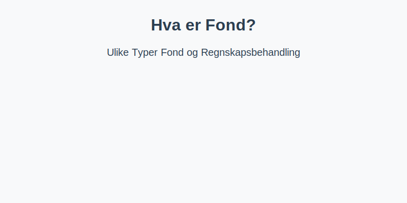
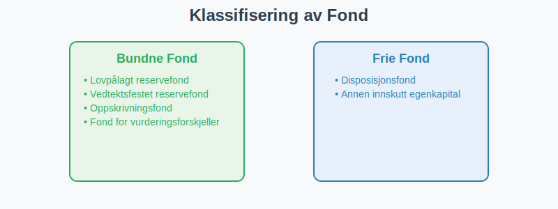

**Fond** er en øremerket del av egenkapitalen som er bundet til et bestemt formål eller reserve. I norsk regnskap skilles det mellom **bundne fond** og **frie fond**, som hver har ulike regler for disponering og bruk.

For en grundig oversikt over ulike typer fond og deres regnskapsmessige behandling, se [Hva er Fond? Ulike Typer Fond og Regnskapsbehandling](/blogs/regnskap/hva-er-fond "Hva er Fond? Ulike Typer Fond og Regnskapsbehandling").

## Hva er et Fond?

> Et fond er en kapitalreserve som er øremerket et bestemt formål eller sikkerhet, og inngår som en del av egenkapitalen i balansen.

Fond kan opprettes ved lovpålagte krav, vedtektsfesting eller styrebeslutning, og gir oversikt over selskapets bundne eller frie midler.

## Klassifisering av Fond

Fond deles hovedsakelig i to kategorier:

- **Bundne fond**: Reserver som ikke kan deles ut til utbytte eller disponeres fritt.
- **Frie fond**: Reserver som kan disponeres av selskapet, for eksempel til utbytte eller investeringer.

| Fondstype                       | Egenkapitaltype      | Beskrivelse                                                       |
|---------------------------------|----------------------|-------------------------------------------------------------------|
| Lovpålagt reservefond           | Bundet egenkapital   | Minimumsreserve på 10 % av aksjekapitalen                        |
| [Vedtektsfestet reservefond](/blogs/regnskap/vedtekter "Vedtekter: Definisjon, Krav og Betydning i Norsk Regnskap")      | Bundet egenkapital   | Fond opprettet i selskapets vedtekter                             |
| Oppskrivningsfond               | Bundet egenkapital   | Reserve fra omvurdering av anleggsmidler                          |
| Fond for vurderingsforskjeller  | Bundet egenkapital   | Reserve ved omvurdering av anleggsmidler                          |
| Disposisjonsfond                | Fri egenkapital      | Styrefastsatt reserve for utbytte eller reinvestering             |
| Annen innskutt egenkapital      | Fri egenkapital      | Egne kapitalinnskudd utover aksjekapital                          |

## Regnskapsmessig Behandling

Ved regnskapsføring skal bundne fond skilles fra fri egenkapital i balansen, og disponering av disse fondene krever ofte generalforsamlings- eller styrevedtak.

### Eksempel på balansepresentasjon

| Konto                          | Beløp      | Egenkapitalseksjon       |
|--------------------------------|------------|---------------------------|
| 2080 Lovpålagt reservefond     | 50 000     | Bundet egenkapital        |
| 2090 Disposisjonsfond          | 120 000    | Fri egenkapital           |

Gjennom systematisk merking av fondstyper i kontoplanen sikres korrekt regnskapsrapportering og overholdelse av lovkrav.
