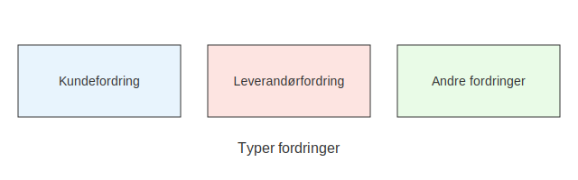

---
title: "Hva er Fordring?"
seoTitle: "Hva er Fordring?"
meta_description: '**Fordring** er et **økonomisk krav** på betaling, hvor én part (creditor) har levert varer, tjenester eller ytelser, og en annen part (debitor) skylder beta...'
slug: hva-er-fordring
type: blog
layout: pages/single
---

**Fordring** er et **økonomisk krav** på betaling, hvor én part (creditor) har levert varer, tjenester eller ytelser, og en annen part (debitor) skylder betaling for disse. I regnskapet klassifiseres fordringer som [eiendeler](/blogs/regnskap/hva-er-eiendel "Hva er en Eiendel? Komplett Guide til Eiendeler i Regnskap"), og de representerer fremtidige kontantstrømmer som forventes mottatt.

For mer detaljert informasjon om oppfølging av kundefordringer, se også [Utestående Fordring](/blogs/regnskap/utestaende-fordring "Utestående Fordring: Håndtering av utestående fordringer i norsk regnskap").

## Hva er en Fordring?

En fordring oppstår når bedriften har levert en ytelse og har krav på betaling, men ikke har mottatt betaling ved rapporteringstidspunktet. Fordringer må måles, klassifiseres og innregnes i regnskapet i henhold til god regnskapsskikk.

## Typer fordringer

Det finnes flere varianter av fordringer som bedriften må håndtere:

| Type fordring            | Beskrivelse                                                          |
|---------------------------|----------------------------------------------------------------------|
| **Kundefordring**         | Krav mot kunder for salg av varer eller tjenester på kreditt. Se [Hva er kundefordring?](/blogs/regnskap/hva-er-kundefordring "Hva er kundefordring? En Guide til Norske Kundefordringer"). |
| **Leverandørfordring**    | Forhåndsbetalinger til leverandører hvor bedriften har krav på retur av varer eller ytelser. |
| **Andre fordringer**      | Lån, ansatteutlegg, skattefordringer, depositum og lignende poster. |

## Regnskapsføring og måling

Ved innregning av fordringer gjelder prinsippet om opptjening, der fordringen bokføres når ytelsen er levert. Måling skjer normalt til anskaffelseskost med fradrag for forventet tap:

| Målebasis           | Kritierier                                                        |
|----------------------|------------------------------------------------------------------|
| Anskaffelseskost     | Opprinnelig beløp på faktura/kreditnota.                         |
| Nedskriving (tap)    | Forventet tap vurderes løpende i aldersanalyse og tapsavsetning. |

Se også [Tap på fordring](/blogs/regnskap/tap-pa-fordring "Hva er tap på fordring? Regnskapsmessig behandling av tap").

## Viktige punkter

* **Classification:** Fordringer er en del av omløpsmidler eller anleggsmidler, avhengig av forfallstid.
* **Risikohåndtering:** Følg opp aldersanalyser og kredittvurdering for å begrense tap.
* **Finansiell rapportering:** Fordringer påvirker likviditet og balansens sammensetning.

Fordringer er et sentralt element i enhver virksomhets likviditetsstyring og krever systematisk oppfølging for å sikre korrekt regnskapsrapportering og økonomisk kontroll.

