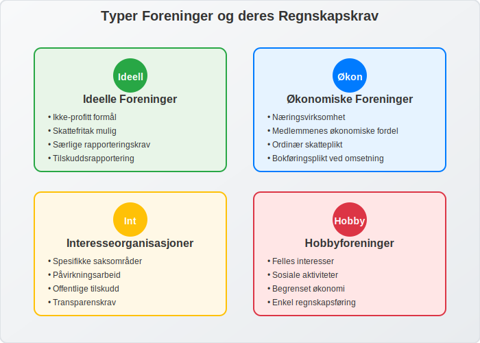
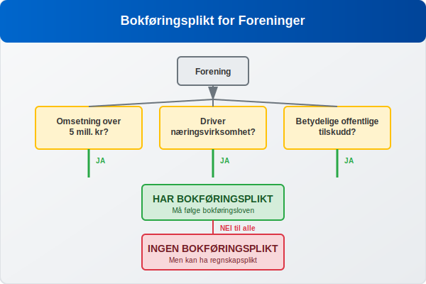
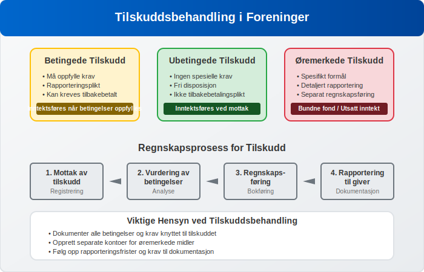
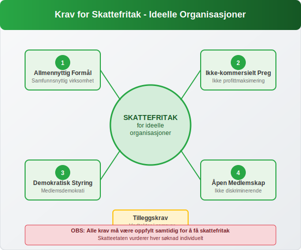

---
title: "Hva er Forening i Regnskap? Regnskapsføring for Foreninger og Organisasjoner"
seoTitle: "Hva er Forening i Regnskap? Regnskapsføring for Foreninger og Organisasjoner"
description: 'En **forening** er en sammenslutning av personer som har sluttet seg sammen for å fremme felles interesser eller oppnå et bestemt formål. I regnskapssammenhe...'
---

En **forening** er en sammenslutning av personer som har sluttet seg sammen for å fremme felles interesser eller oppnå et bestemt formål. I regnskapssammenheng har foreninger særlige krav og regler som skiller seg fra ordinære [aksjeselskaper](/blogs/regnskap/hva-er-et-aksjeselskap "Hva er et Aksjeselskap? Komplett Guide til AS i Norge") og [enkeltpersonforetak](/blogs/regnskap/hva-er-enkeltpersonforetak "Hva er Enkeltpersonforetak? Komplett Guide til ENK i Norge"). Denne artikkelen gir en omfattende oversikt over regnskapsføring for foreninger og organisasjoner i Norge.

En viktig **bransjeorganisasjon** innen regnskap er [Regnskap Norge](/blogs/regnskap/regnskap-norge "Regnskap Norge “ Bransjeorganisasjon for Regnskapsførere og Regnskapsbyråer"), som representerer regnskapsførere og [regnskapsbyråer](/blogs/regnskap/regnskapsbyra "Regnskapsbyrå: Hva gjør de og hvorfor er det viktig?") over hele landet.

## Hva er en Forening?

En forening er en juridisk enhet som består av medlemmer som har sluttet seg sammen for å oppnå felles mål. Foreninger kan være:

* **Ideelle foreninger** - som ikke har profitt som hovedformål
* **Økonomiske foreninger** - som driver **[næringsvirksomhet](/blogs/regnskap/naeringsvirksomhet "Hva er næringsvirksomhet? Definisjon og Regnskapsmessig Behandling")** for medlemmenes økonomiske fordel
* **Samvirkeforetak** - en type økonomisk forening basert på [samvirkeprinsippet](/blogs/regnskap/samvirkeforetak "Samvirkeforetak: Regnskap for Norske Kooperativer") hvor medlemmene eier og styrer virksomheten demokratisk.
* **Interesseorganisasjoner** - som arbeider for spesifikke saksområder
* **Fagforeninger** - foreninger som representerer arbeidstakernes interesser og ivaretar medlemmenes arbeids- og lønnsforhold. Se også [Hva er Fagforening?](/blogs/regnskap/hva-er-fagforening "Hva er Fagforening? Regnskap for Fagforeninger i Norge").
* **Hobbyforeninger** - som samler personer med felles interesser



### Juridisk Status og Organisasjonsform

Foreninger kan være **registrerte** eller **uregistrerte**. Registrerte foreninger har egen juridisk status og kan inngå avtaler, eie eiendom og være part i rettssaker. Uregistrerte foreninger har ikke egen juridisk status, og medlemmene har personlig ansvar.

## Regnskapsplikt for Foreninger

### Bokføringsplikt

Ikke alle foreninger har [bokføringsplikt](/blogs/regnskap/hva-er-bokforingsplikt "Hva er Bokføringsplikt? Komplett Guide til Norske Bokføringskrav"). Bokføringsplikten avhenger av:

* **Omsetning**: Foreninger med omsetning over 5 millioner kroner
* **[Næringsvirksomhet](/blogs/regnskap/naeringsvirksomhet "Hva er næringsvirksomhet? Definisjon og Regnskapsmessig Behandling")**: Foreninger som driver næringsvirksomhet
* **Offentlige tilskudd**: Foreninger som mottar betydelige offentlige tilskudd



### Regnskapsplikt vs. Bokføringsplikt

Selv om en forening ikke har bokføringsplikt, kan den ha **regnskapsplikt**. Dette gjelder særlig for:

* Foreninger som mottar offentlige tilskudd
* Medlemsorganisasjoner med betydelig økonomi
* Foreninger som er underlagt særlige lovkrav

## Særlige Regnskapsregler for Foreninger

### Medlemskontingent og Inntektsføring

**Medlemskontingent** er ofte hovedinntektskilden for foreninger. [Kontingent](/blogs/regnskap/hva-er-kontingent "Hva er Kontingent? Komplett Guide til Medlemsavgifter og Regnskapsføring") er en regelmessig avgift som medlemmer betaler for å opprettholde medlemskap og tilgang til foreningens tjenester. Regnskapsføring av kontingent følger disse prinsippene:

| Kontingenttype | Regnskapsføring | Tidspunkt |
|---|---|---|
| Årskontingent | Periodiseres over året | Når medlemskapet gjelder |
| Engangskontingent | Inntektsføres umiddelbart | Ved betaling/påløp |
| Forskuddsbetalt kontingent | Utsatt inntekt | Når tjenesten leveres |

### Tilskudd og Gaver

Foreninger mottar ofte **tilskudd** fra det offentlige eller private aktører. Regnskapsføring av tilskudd krever særlig oppmerksomhet:

* **Betingede tilskudd**: Inntektsføres når betingelsene er oppfylt
* **Ubetingede tilskudd**: Inntektsføres ved mottak
* **Øremerkede tilskudd**: Må brukes til spesifikt formål



### Frivillig Arbeid og Verdisetting

**Frivillig arbeid** utgjør ofte en betydelig ressurs for foreninger. I regnskapet kan frivillig arbeid behandles på følgende måter:

* **Ikke regnskapsført**: Vanligst for mindre foreninger
* **Noteopplysning**: Verdi oppgis i noter til regnskapet
* **Brutto regnskapsføring**: Både som inntekt og kostnad

## Regnskapsoppstilling for Foreninger

### Resultatregnskap for Foreninger

Foreningers resultatregnskap har ofte en annen struktur enn kommersielle virksomheter:

```
INNTEKTER
+ Medlemskontingent
+ Offentlige tilskudd
+ Private tilskudd og gaver
+ Aktivitetsinntekter
+ Finansinntekter
= TOTALE INNTEKTER

KOSTNADER
- Lønnskostnader
- Aktivitetskostnader
- Administrasjonskostnader
- Lokalkostnader
- Finanskostnader
= TOTALE KOSTNADER

ÅRSRESULTAT
```

### Balanse og Egenkapital

Foreningers [balanse](/blogs/regnskap/hva-er-balanse "Hva er Balanse i Regnskap? Komplett Guide til Balansens Oppbygging og Funksjon") følger samme grunnstruktur som andre virksomheter, men [egenkapitalen](/blogs/regnskap/hva-er-egenkapital "Hva er Egenkapital? Komplett Guide til Egenkapital i Regnskap") kan være strukturert annerledes:

* **Grunnkapital**: Innbetalt kapital fra medlemmer
* **Opptjent egenkapital**: Akkumulerte overskudd
* **Bundne fond**: Øremerkede midler
* **Disposisjonsfond**: Frie reserver

## Særlige Krav for Ideelle Organisasjoner

### Skattefritak og Krav

**Ideelle organisasjoner** kan få skattefritak dersom de oppfyller visse krav:

* Allmennyttig formål
* Ikke-kommersielt preg
* Demokratisk styring
* Åpen medlemskap



### Rapportering til Myndigheter

Ideelle organisasjoner må ofte rapportere til:

* **Skatteetaten**: Årlig skattemelding
* **Brønnøysundregistrene**: Årsregnskap og årsberetning
* **Tilskuddsgivere**: Særskilte rapporter

## Internkontroll og Styring

### Økonomistyring i Foreninger

God **økonomistyring** er kritisk for foreninger:

* **Budsjettarbeid**: Årlige budsjetter og oppfølging
* **Likviditetsstyring**: Sikre betalingsevne
* **Investeringspolitikk**: Forvaltning av overskuddslikviditet
* **Risikostyring**: Identifisere og håndtere økonomiske risikoer

### Internkontroll og Attestering

Foreninger bør etablere god internkontroll:

| Kontrollområde | Tiltak | Ansvarlig |
|---|---|---|
| Innbetalinger | Dobbel kontroll av kontingent | Kasserer + revisor |
| Utbetalinger | [Attestering](/blogs/regnskap/hva-er-attestering "Hva er Attestering i Regnskap? Komplett Guide til Attesteringsprosessen") av alle utbetalinger | Styre |
| Banktransaksjoner | Månedlig [bankavstemming](/blogs/regnskap/hva-er-bankavstemming "Hva er Bankavstemming? Komplett Guide til Bankavstemming i Regnskap") | Kasserer |
| Regnskap | Kvartalsvis oppfølging | Styre |

## Digitalisering og Moderne Verktøy

### Regnskapssystemer for Foreninger

Moderne foreninger benytter ofte spesialiserte regnskapssystemer:

* **Medlemsregistre**: Integrert med regnskapsføring
* **Automatisk fakturering**: Av medlemskontingent
* **Tilskuddsrapportering**: Automatiserte rapporter
* **Mobilløsninger**: For registrering av utlegg og kvitteringer

### Elektronisk Fakturering og Betaling

Mange foreninger implementerer [elektronisk fakturering](/blogs/regnskap/hva-er-elektronisk-fakturering "Hva er Elektronisk Fakturering? Komplett Guide til E-fakturering i Norge") og moderne betalingsløsninger:

* **eFaktura**: For medlemskontingent og andre tjenester
* **Vipps/mobilbetaling**: For enkle transaksjoner
* **Avtalegiro**: For regelmessige betalinger

## Revisjon og Kontroll

### Revisjonspliktig eller Ikke?

Foreninger kan være **revisjonspliktige** basert på:

* Omsetning over visse terskelverdier
* Offentlige tilskudd over bestemte beløp
* Vedtektsbestemmelser
* Medlemmenes krav

### Intern Revisjon og Kontrollutvalg

Mange foreninger etablerer **intern revisjon** eller kontrollutvalg:

* Gjennomgang av regnskap og [bilag](/blogs/regnskap/hva-er-bilag "Hva er Bilag i Regnskap? Komplett Guide til Regnskapsbilag og Dokumentasjon")
* Kontroll av vedtak og fullmakter
* Vurdering av internkontroll
* Rapportering til årsmøte

## Årsavslutning og Rapportering

### Årsavslutningsprosessen

Foreningers årsavslutning følger mange av de samme prinsippene som andre virksomheter:

1. **Periodisering**: Av inntekter og kostnader
2. **Avskrivninger**: På [anleggsmidler](/blogs/regnskap/hva-er-anleggsmidler "Hva er Anleggsmidler? Komplett Guide til Anleggsmidler i Regnskap")
3. **Verdijusteringer**: Av finansielle instrumenter
4. **Avsetninger**: For kjente forpliktelser

### Årsberetning og Tilleggsopplysninger

Foreninger må ofte utarbeide **årsberetning** som inkluderer:

* Redegjørelse for virksomheten
* Økonomisk utvikling
* Fremtidsutsikter
* Samfunnsansvar og bærekraft

## Utfordringer og Beste Praksis

### Vanlige Utfordringer

Foreninger møter ofte disse regnskapsmessige utfordringene:

* **Frivillige ressurser**: Begrenset regnskapskompetanse
* **Sesongvariasjoner**: Ujevne inntekts- og kostnadsstrømmer
* **Tilskuddsrapportering**: Komplekse krav fra tilskuddsgivere
* **Medlemsadministrasjon**: Håndtering av kontingent og medlemsdata

### Beste Praksis for Foreningsregnskap

| Område | Anbefaling | Begrunnelse |
|---|---|---|
| Kompetanse | Kursing av kasserer og styre | Sikrer kvalitet og etterlevelse |
| Systemer | Investering i gode verktøy | Effektiviserer arbeidet |
| Rutiner | Dokumenterte prosedyrer | Sikrer kontinuitet |
| Kontroll | Regelmessig oppfølging | Forebygger feil og misligheter |

## Fremtidige Utviklingstrekk

### Digitalisering og Automatisering

Foreningssektoren vil se økt digitalisering:

* **Kunstig intelligens**: For kategorisering av transaksjoner
* **Blockchain**: For transparent tilskuddsforvaltning
* **Integrerte plattformer**: Som kombinerer medlemsadministrasjon og regnskap
* **Sanntidsrapportering**: Til myndigheter og tilskuddsgivere

### Regulatoriske Endringer

Fremtidige endringer kan inkludere:

* Strengere krav til transparens
* Harmonisering av regnskapsregler
* Økte krav til bærekraftsrapportering
* Digitale rapporteringsformater

## Konklusjon

Regnskapsføring for foreninger krever forståelse av både generelle regnskapsprinsipper og særlige regler for denne sektoren. Fra håndtering av medlemskontingent og tilskudd til kompleks tilskuddsrapportering, må foreninger navigere i et regulatorisk landskap som balanserer transparens med praktiske hensyn.

Suksessfulle foreninger investerer i god **økonomistyring**, etablerer robuste kontrollsystemer og sikrer tilstrekkelig kompetanse innen [regnskap](/blogs/regnskap/hva-er-regnskap "Hva er Regnskap? En Dybdeanalyse for Norge") og [bokføring](/blogs/regnskap/hva-er-bokforing "Hva er Bokføring? En Komplett Guide til Norsk Bokføringspraksis"). Med riktig tilnærming kan regnskapet bli et verdifullt verktøy for strategisk ledelse og ikke bare en lovpålagt oppgave.

Enten det gjelder en liten hobbyforening eller en stor interesseorganisasjon, er solid regnskapsføring grunnlaget for tillit, transparens og langsiktig bærekraft i foreningssektoren.


