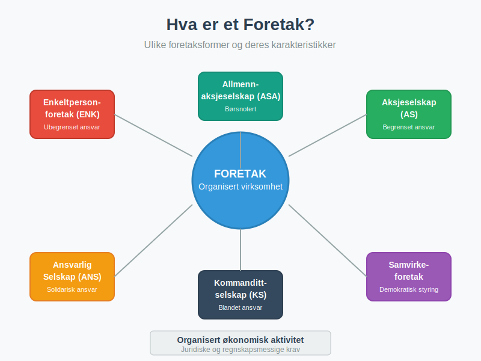
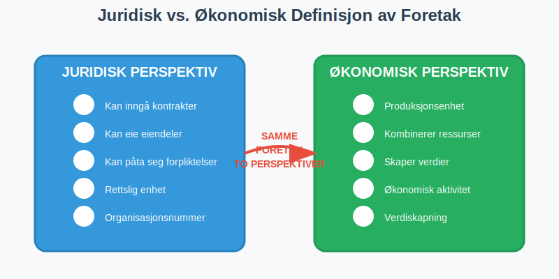
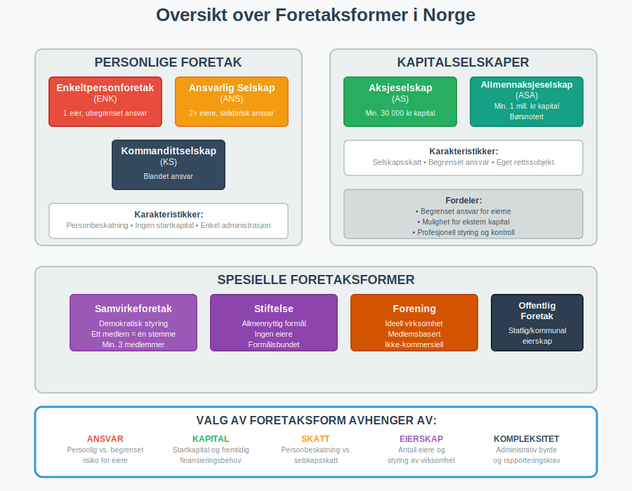
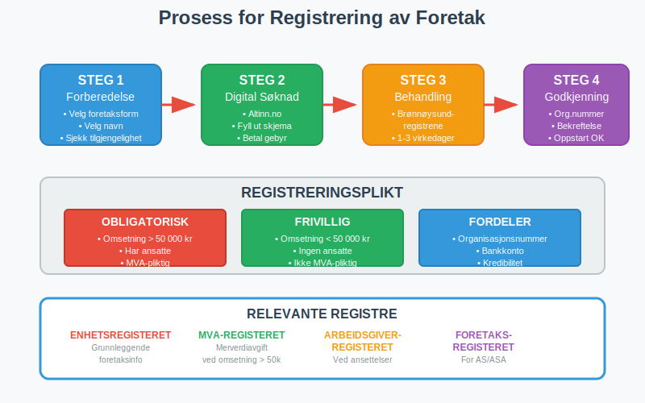
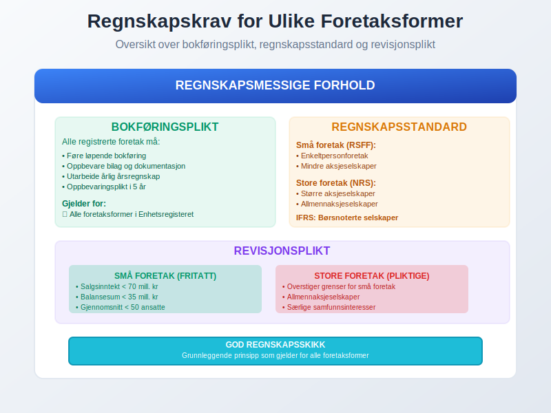
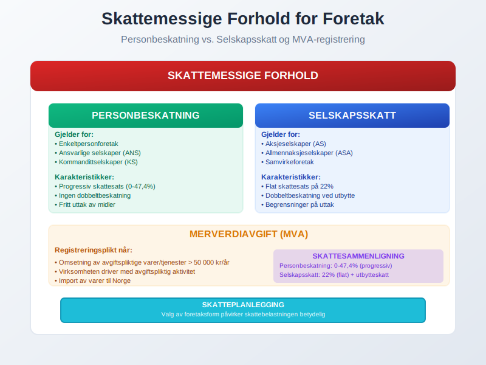
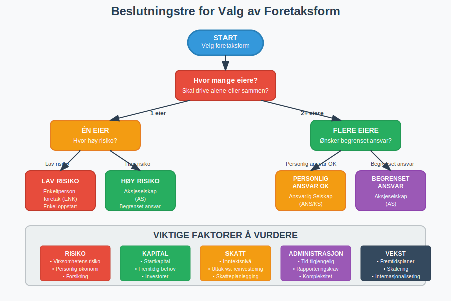
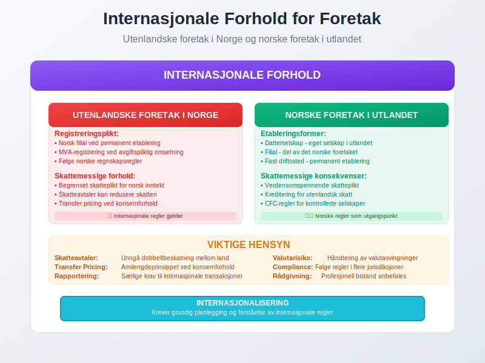

---
title: "Hva er et Foretak?"
seoTitle: "Hva er et Foretak?"
description: 'Et **foretak** er en organisert [virksomhet](/blogs/regnskap/hva-er-virksomhet "Hva er en virksomhet? Definisjon og Regnskapsmessige Forhold") som driver økono...'
---

Et **foretak** er en organisert [virksomhet](/blogs/regnskap/hva-er-virksomhet "Hva er en virksomhet? Definisjon og Regnskapsmessige Forhold") som driver økonomisk aktivitet med sikte på å skape verdier. I Norge finnes det flere ulike foretaksformer, hver med sine særegne juridiske, økonomiske og regnskapsmessige karakteristikker.

For mer om den teoretiske vurderingsmodellen for foretakets økonomi, se [Foretaksmodellen](/blogs/regnskap/foretaksmodellen "Foretaksmodellen: Modell for Regnskapsføring og Skattevurdering av Foretak").

## Definisjon av Foretak

Et foretak defineres som en **organisert virksomhet** som utøver økonomisk aktivitet. Dette omfatter alle typer virksomheter som:

* Produserer varer eller tjenester
* Selger produkter til kunder
* Utfører tjenester mot betaling
* Driver handel eller annen kommersiell aktivitet

Foretaket kan være **privat eid**, **offentlig eid** eller en **kombinasjon** av begge. Det sentrale er at virksomheten er organisert og driver økonomisk aktivitet på en systematisk måte.

### Juridisk vs. Økonomisk Definisjon

Fra et **juridisk perspektiv** er et foretak en enhet som kan inngå kontrakter, eie eiendeler og påta seg forpliktelser. Fra et **økonomisk perspektiv** er det en produksjonsenhet som kombinerer ressurser for å skape verdier.

## Foretaksformer i Norge

Norge har flere ulike foretaksformer som er tilpasset forskjellige behov og situasjoner. For en detaljert guide til valg av [organisasjonsform](/blogs/regnskap/organisasjonsform "Organisasjonsform: Komplett Guide til Selskapsformer i Norge"), se vår omfattende sammenligning av alle selskapsformer.

### Personlige Foretak

#### Enkeltpersonforetak (ENK)
[Enkeltpersonforetaket](/blogs/regnskap/hva-er-enkeltpersonforetak "Hva er et Enkeltpersonforetak? Komplett Guide til Selskapsformen") er den enkleste foretaksformen:

* **Én eier** som driver virksomheten i eget navn
* **Ubegrenset personlig ansvar** for alle forpliktelser
* **Ingen startkapital** kreves
* Enkel oppstart og administrasjon

#### Ansvarlig Selskap (ANS)
Et ansvarlig selskap har flere eiere med **solidarisk ansvar**:

* **To eller flere deltakere** som driver virksomhet sammen
* **Ubegrenset og solidarisk ansvar** for alle deltakere
* Deltakerne hefter for hele selskapets gjeld
* Krever selskapsavtale mellom deltakerne

#### Kommandittselskap (KS)
Kommandittselskapet kombinerer ulike ansvarsformer:

* **Komplementarer** med ubegrenset ansvar (driver virksomheten)
* **Kommandittister** med begrenset ansvar (passive investorer)
* Fleksibel kapitalstruktur
* Ofte brukt for investeringsformål

### Kapitalselskaper

#### Aksjeselskap (AS)
[Aksjeselskapet](/blogs/regnskap/hva-er-et-aksjeselskap "Hva er et Aksjeselskap (AS)? Komplett Guide til Selskapsformen") er den mest vanlige selskapsformen for større virksomheter:

* **Begrenset ansvar** for aksjonærene
* **Minimum 30 000 kr** i aksjekapital
* **Hylleselskap:** Ferdigregistrerte aksjeselskap som kan kjøpes for rask oppstart; se vår artikkel om [Hylleselskap](/blogs/regnskap/hylleselskap "Hva er et Hylleselskap? Guide til Ferdigregistrerte Selskaper i Norge").
* Eget rettssubjekt som [juridisk person](/blogs/regnskap/hva-er-juridisk-person "Hva er en Juridisk Person? Komplett Guide til Juridiske Personer i Regnskap") med styre og generalforsamling
* Mulighet for å hente ekstern kapital

#### Allmennaksjeselskap (ASA)
For store selskaper med behov for børsnotering:

* **Minimum 1 million kr** i aksjekapital
* Strengere krav til rapportering og styring
* Kan noteres på børs
* Høyere grad av offentlighet

### Spesielle Foretaksformer

#### Samvirkeforetak
[Samvirkeforetak](/blogs/regnskap/samvirkeforetak "Samvirkeforetak: Regnskap for Norske Kooperativer") er basert på samvirkeprinsippet hvor medlemmene eier og kontrollerer virksomheten:

* **Demokratisk styring** - ett medlem, én stemme
* **Åpen medlemskap** for alle som oppfyller kriteriene
* Overskudd fordeles etter medlemmenes deltakelse
* Vanlig innen landbruk, handel og tjenester

#### Stiftelse
For virksomheter med ideelle eller allmennyttige formål:

* **Ingen eiere** - styres av et styre
* **Formålsbundet** - må følge stiftelsens vedtekter
* Kan ikke deles ut til private
* Ofte skattefritak for allmennyttige formål

## Sammenligning av Foretaksformer

| Foretaksform | Ansvar | Startkapital | Eiere | Beskatning |
|--------------|--------|--------------|-------|------------|
| **Enkeltpersonforetak** | Ubegrenset | Ingen | 1 | Personinntekt |
| **Ansvarlig Selskap** | Ubegrenset/Solidarisk | Ingen | 2+ | Personinntekt |
| **Kommandittselskap** | Blandet | Ingen | 2+ | Blandet |
| **Aksjeselskap** | Begrenset | 30 000 kr | 1+ | Selskapsskatt |
| **Allmennaksjeselskap** | Begrenset | 1 000 000 kr | 1+ | Selskapsskatt |
| **Samvirkeforetak** | Begrenset | Varierer | 3+ | Selskapsskatt |

## Juridiske Krav og Registrering

### Registreringsplikt

Alle foretak må registreres i **Enhetsregisteret** hos Brønnøysundregistrene når:

* Årlig omsetning overstiger **50 000 kr**
* Virksomheten har **ansatte**
* Virksomheten er **merverdiavgiftspliktig**

#### Registreringsprosess
1. **Søknad** sendes digitalt til Brønnøysundregistrene
2. **[Organisasjonsnummer](/blogs/regnskap/hva-er-organisasjonsnummer "Hva er et Organisasjonsnummer? Komplett Guide til Norges Unike Identifikator")** tildeles ved godkjenning
3. **Registrering** i relevante registre (MVA, arbeidsgiver, etc.)
4. **Oppstart** av virksomheten kan begynne

### Foretaksnavn

Valg av foretaksnavn må følge bestemte regler:

* **Unikt navn** som ikke forveksles med eksisterende
* **Beskyttede betegnelser** som "AS", "ANS", "KS" kun for relevante selskapsformer
* **Ikke villedende** om virksomhetens art eller størrelse
* **Ikke krenkende** eller upassende innhold

## Regnskapsmessige Forhold

### Bokføringsplikt

Alle foretak som er registrert i Enhetsregisteret har [bokføringsplikt](/blogs/regnskap/hva-er-bokforingsplikt "Hva er Bokføringsplikt? Komplett Guide til Regler og Krav") etter [bokføringsloven](/blogs/regnskap/hva-er-bokforingsloven "Hva er Bokføringsloven? Komplett Guide til Norske Bokføringsregler"):

#### Grunnleggende Krav
* **Løpende bokføring** av alle forretningstransaksjoner
* **Oppbevaring** av [bilag](/blogs/regnskap/hva-er-bilag "Hva er Bilag i Regnskap? Komplett Guide til Bilagstyper og Krav") og dokumentasjon
* **Årlig årsregnskap** med resultatregnskap og balanse
* **Oppbevaringsplikt** i minimum 5 år

#### Regnskapsstandard
Foretakene må følge:

* **God regnskapsskikk** som grunnleggende prinsipp
* **Regnskapsstandard for små foretak** (RSFF) for mindre virksomheter (se [Små Foretak](/blogs/regnskap/sma-foretak "Små Foretak “ Kriterier, Regnskapsstandard og Forenklinger"))
* **Norsk regnskapsstandard** (NRS) for større foretak
* **IFRS** for børsnoterte selskaper

#### Løsninger for Regnskapsoppgaver

For mange foretak, spesielt mindre virksomheter, kan det være utfordrende å håndtere alle regnskapsmessige forpliktelser internt. **[Utkontraktering](/blogs/regnskap/hva-er-utkontraktering "Hva er Utkontraktering? Komplett Guide til Outsourcing i Regnskap og Forretning")** av regnskapsoppgaver til eksterne leverandører kan være en praktisk og kostnadseffektiv løsning som sikrer:

* **Profesjonell håndtering** av [bokføring](/blogs/regnskap/hva-er-bokforing "Hva er Bokføring? Komplett Guide til Bokføringsprinsipper") og regnskapsføring
* **Overholdelse** av alle juridiske krav og frister
* **Tilgang til spesialisert kompetanse** uten behov for egne ansatte
* **Kostnadsbesparelser** sammenlignet med intern regnskapsavdeling
* **Fokus på kjernevirksomhet** mens regnskapet håndteres profesjonelt

Dette er særlig relevant for [enkeltpersonforetak](/blogs/regnskap/hva-er-enkeltpersonforetak "Hva er et Enkeltpersonforetak? Komplett Guide til Selskapsformen") og mindre [aksjeselskaper](/blogs/regnskap/hva-er-et-aksjeselskap "Hva er et Aksjeselskap (AS)? Komplett Guide til Selskapsformen") som ønsker å sikre korrekt regnskapsføring uten å investere i egen regnskapskompetanse.

### Revisjonsplikt

Revisjonsplikt avhenger av foretakets størrelse:

#### [Små Foretak](/blogs/regnskap/sma-foretak "Små Foretak “ Kriterier, Regnskapsstandard og Forenklinger") (Fritatt for Revisjon)
* Salgsinntekt under **70 millioner kr**
* Balansesum under **35 millioner kr**
* Gjennomsnittlig under **50 ansatte**

#### Store Foretak (Revisjonspliktige)
* Overstiger grensene for små foretak
* Allmennaksjeselskaper
* Foretak med særlige samfunnsinteresser

## Skattemessige Forhold

### Personbeskatning vs. Selskapsskatt

#### Personbeskatning
Gjelder for:
* [Enkeltpersonforetak](/blogs/regnskap/hva-er-enkeltpersonforetak "Hva er et Enkeltpersonforetak? Komplett Guide til Selskapsformen")
* Ansvarlige selskaper
* Kommandittselskaper (for komplementarer)

**Karakteristikker:**
* Overskudd beskattes som [**personinntekt**](/blogs/regnskap/personinntekt "Personinntekt “ Komplett guide til personinntekt i norsk regnskap")
* **Progressiv skattesats** (0-47,4%)
* Ingen dobbeltbeskatning
* Eieren kan ta ut midler fritt

#### Selskapsskatt
Gjelder for:
* [Aksjeselskaper](/blogs/regnskap/hva-er-et-aksjeselskap "Hva er et Aksjeselskap (AS)? Komplett Guide til Selskapsformen")
* Allmennaksjeselskaper
* Samvirkeforetak

**Karakteristikker:**
* **Flat skattesats** på 22%
* **Dobbeltbeskatning** ved utbytte
* Mulighet for skatteplanlegging
* Begrensninger på uttak

### MVA-registrering

Foretak må registreres for **[merverdiavgift (MVA)](/blogs/regnskap/hva-er-moms-mva "Hva er Merverdiavgift (MVA/Moms)? Komplett Guide til Norsk Merverdiavgift")** når:

* Omsetning av avgiftspliktige varer/tjenester overstiger **50 000 kr** per år
* Virksomheten driver med avgiftspliktig aktivitet
* Import av varer til Norge

For detaljert informasjon om **[MVA-plikt](/blogs/regnskap/mva-plikt "MVA-plikt: Komplett Guide til Merverdiavgiftsplikt i Norge")** og registreringskrav, se vår omfattende guide.

## Valg av Foretaksform

### Faktorer å Vurdere

#### Ansvar og Risiko
* **Personlig økonomi** - hvor mye kan du risikere?
* **Virksomhetens risiko** - hvor stor er sannsynligheten for tap?
* **Forsikringsmuligheter** - kan risiko reduseres på andre måter?

#### Kapitalbehovet
* **Startkapital** - hvor mye kapital trengs ved oppstart?
* **Fremtidig kapitalbehov** - vil virksomheten trenge ekstern finansiering?
* **Investormuligheter** - ønsker du å ta inn eksterne investorer?

#### Skattemessige Forhold
* **Forventet inntektsnivå** - hvor høyt vil overskuddet være?
* **Uttak vs. reinvestering** - skal overskudd tas ut eller reinvesteres?
* **Skatteplanlegging** - er det behov for avansert skatteplanlegging?
* **Særskatteordninger** - for virksomheter innen naturressurser kan [grunnrenteskatt](/blogs/regnskap/hva-er-grunnrenteskatt "Hva er Grunnrenteskatt? Komplett Guide til Norsk Grunnrenteskatt") være aktuelt

#### Administrasjon og Kompleksitet
* **Administrativ byrde** - hvor mye tid kan brukes på administrasjon?
* **Rapporteringskrav** - hvilke rapporter må leveres?
* **Styring og kontroll** - ønskes enkel eller mer formell styring?

### Anbefalinger per Situasjon

#### For Enkle Virksomheter
**Enkeltpersonforetak** anbefales når:
* Lav risiko og begrenset kapitalbehov
* Ønsker enkel administrasjon
* Forventer moderat inntektsnivå
* Driver alene uten behov for partnere

#### For Vekstvirksomheter
**Aksjeselskap** anbefales når:
* Behov for ekstern kapital
* Høy risiko som krever begrenset ansvar
* Flere eiere eller fremtidige investorer
* Forventet høyt overskudd

For virksomheter som eier eller planlegger å eie flere selskaper, kan et **[holdingselskap](/blogs/regnskap/hva-er-holdingselskap "Hva er et Holdingselskap? Komplett Guide til Holdingselskaper i Norge")** være aktuelt for å oppnå skattefordeler og bedre risikostyring.

#### For Samarbeidsprosjekter
**Ansvarlig selskap** eller **kommandittselskap** når:
* Flere personer skal samarbeide
* Ulik grad av ansvar og deltakelse
* Fleksibel organisering ønskes
* Personbeskatning foretrekkes

## Endring av Foretaksform

### Når Bør Man Vurdere Endring?

#### Vekst og Utvikling
* **Økt omsetning** som gjør aksjeselskap mer skatteeffektivt
* **Behov for kapital** som krever eksterne investorer
* **Økt risiko** som gjør begrenset ansvar nødvendig

#### Endrede Omstendigheter
* **Nye partnere** som ønsker å bli medeiere
* **Internasjonalisering** som krever selskapsform
* **Børsnotering** som krever allmennaksjeselskap

### Prosess for Omorganisering

#### Fra Enkeltpersonforetak til AS
1. **Stiftelse** av nytt aksjeselskap
2. **Overdragelse** av eiendeler og forpliktelser
3. **Skattemessig behandling** av overdragelsen
4. **Avvikling** av enkeltpersonforetaket

#### Skattemessige Konsekvenser
* **Realisasjon** av eiendeler kan utløse skatt
* **Kontinuitetsregler** kan gi skattefrihet
* **Profesjonell rådgivning** anbefales sterkt

## Internasjonale Forhold

### Utenlandske Foretak i Norge

#### Registreringsplikt
Utenlandske foretak som driver virksomhet i Norge må:
* **Registrere norsk filial** hvis permanent etablering
* **Registrere som [NUF](/blogs/regnskap/hva-er-nuf-selskapsform "Hva er NUF? Komplett Guide til Norskregistrert Utenlandsk Foretak")** som alternativ til filial
* **Registrere for MVA** hvis avgiftspliktig omsetning
* **Følge norske regnskapsregler** for norsk virksomhet

#### Skattemessige Forhold
* **Begrenset skatteplikt** for inntekt fra Norge
* **Skatteavtaler** kan redusere skatten
* **Transfer pricing** regler ved [konsernforhold](/blogs/regnskap/hva-er-konsern "Hva er et Konsern? Komplett Guide til Konsernstrukturer og Konsernregnskap")

### Norske Foretak i Utlandet

#### Etableringsformer
* **Datterselskap** - eget selskap i utlandet
* **Filial** - del av det norske foretaket
* **Fast driftssted** - permanent etablering

#### Skattemessige Konsekvenser
* **Verdensomspennende skatteplikt** for norske selskaper
* **Kreditering** for utenlandsk skatt
* **CFC-regler** for kontrollerte utenlandske selskaper

## Fremtidige Utviklingstrekk

### Digitalisering

#### Automatisering av Prosesser
* **Digital registrering** og rapportering
* **Automatisk [bokføring](/blogs/regnskap/hva-er-bokforing "Hva er Bokføring? Komplett Guide til Bokføringsprinsipper")** med AI-støtte
* **Sanntids rapportering** til myndigheter

#### Nye Teknologier
* **Blockchain** for transparent eierskap
* **Smart contracts** for automatiske transaksjoner
* **Digital identitet** for sikker autentisering

### Regulatoriske Endringer

#### Bærekraftsrapportering
* **ESG-krav** for større foretak
* **Klimarapportering** blir obligatorisk
* **Samfunnsansvar** får økt fokus

#### Europeisk Harmonisering
* **Felles regnskapsregler** i EU/EØS
* **Digital single market** påvirker regelverket
* **Grenseoverskridende mobilitet** for selskaper

## Konklusjon

Valg av **foretaksform** er en av de viktigste beslutningene for enhver som skal starte virksomhet. Beslutningen påvirker:

* **Juridisk ansvar** og personlig risiko
* **Skattemessige forhold** og økonomisk resultat
* **Muligheter for vekst** og kapitaltilgang
* **Administrativ byrde** og kompleksitet

Det er viktig å vurdere både **nåværende situasjon** og **fremtidige planer** når foretaksform velges. Mange virksomheter starter som [enkeltpersonforetak](/blogs/regnskap/hva-er-enkeltpersonforetak "Hva er et Enkeltpersonforetak? Komplett Guide til Selskapsformen") og endrer senere til [aksjeselskap](/blogs/regnskap/hva-er-et-aksjeselskap "Hva er et Aksjeselskap (AS)? Komplett Guide til Selskapsformen") etter hvert som virksomheten vokser.

**Profesjonell rådgivning** fra regnskapsfører, advokat eller revisor anbefales for å sikre at valget er optimalt for den konkrete situasjonen. God planlegging i startfasen kan spare mye tid, penger og komplikasjoner senere.

Uansett hvilken foretaksform som velges, er det viktig å følge gjeldende lover og regler for [regnskap](/blogs/regnskap/hva-er-regnskap "Hva er Regnskap? En komplett guide"), [bokføring](/blogs/regnskap/hva-er-bokforing "Hva er Bokføring? Komplett Guide til Bokføringsprinsipper") og rapportering for å sikre en vellykket og lovlig drift av virksomheten.

