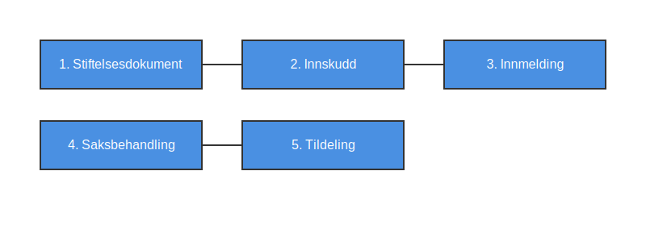

---
title: "Hva er Foretaksregisteret?"
seoTitle: "Hva er Foretaksregisteret?"
meta_description: '**Foretaksregisteret** er et offentlig register som administreres av [Brønnøysundregistrene](/blogs/regnskap/bronnoysundregistrene "Hva er Brønnøysundregist...'
slug: hva-er-foretaksregisteret
type: blog
layout: pages/single
---

**Foretaksregisteret** er et offentlig register som administreres av [Brønnøysundregistrene](/blogs/regnskap/bronnoysundregistrene "Hva er Brønnøysundregistrene? En Guide til Norges Registerforvalter") og inneholder informasjon om alle registrerte foretak i Norge. Registeret sikrer at selskapsinformasjon er tilgjengelig for myndigheter, næringsliv og publikum, og danner grunnlaget for juridiske og administrative prosesser knyttet til norske virksomheter.

### Hva er Foretaksregisteret?

Foretaksregisteret er en del av næringsregistrene i Norge og omfatter registrering av ulike selskapsformer, herunder aksjeselskap, ansvarlig selskap, kommandittselskap og allmennaksjeselskap. Registeret gir en offisiell oversikt over:

* **Etablering:** Opplysninger om når og hvordan foretaket ble stiftet.
* **Registrerte opplysninger:** Selskapsnavn, organisasjonsnummer, forretningsadresse og andre nøkkelinformasjoner.
* **Endringer:** Historikk over endringer i styre, eierforhold, [vedtekter](/blogs/regnskap/vedtekter "Vedtekter: Definisjon, Krav og Betydning i Norsk Regnskap") og kapital.
* **Opphør:** Informasjon om når et foretak er avviklet eller slettet.

### Hvilke Foretaksformer må registreres?

| **Selskapsform**               | **Kort beskrivelse**                                      |
|--------------------------------|-----------------------------------------------------------|
| Aksjeselskap (AS)             | Eget rettssubjekt med begrenset ansvar for aksjonærene.   |
| Allmennaksjeselskap (ASA)     | Kan omsette aksjer på Oslo Børs og har strengere krav.    |
| Ansvarlig selskap (ANS/DA)    | Delt ansvar mellom deltakerne, personlig ansvar.         |
| Kommandittselskap (KS)        | En eller flere komplementarer med ubegrenset ansvar.     |
| Stiftelse                     | Selvstendig formuesgode uten eiere, styret forvalter midlene. |

### Formål med Foretaksregisteret

Foretaksregisteret har flere viktige formål:

* **Rettssikkerhet:** Legitim dokumentasjon av selskapsinformasjon.
* **Transparens:** Åpner tilgang til selskapets juridiske status og organisering.
* **Regelverksetterlevelse:** Sikrer at lovpålagte krav til registrering etterfølges.
* **Offentlighet:** Gir publikum, kreditorer og andre interessenter innsyn.

### Hvilke opplysninger registreres?

Tabellen under oppsummerer hovedkategoriene av informasjon som lagres i Foretaksregisteret:

| **Opplysning**        | **Beskrivelse**                                                           |
|-----------------------|---------------------------------------------------------------------------|
| Organisasjonsnummer   | Unikt nummer tildelt hvert foretak.                                       |
| Foretaksnavn          | Offisielt registrert navn.                                                |
| Forretningsadresse    | Selskaps adresse og kontaktinformasjon.                                    |
| Stiftelsesdato        | Dato for når foretaket ble formelt etablert.                              |
| Organisasjonsform     | Type foretak (f.eks. AS, ASA, ANS, KS, Stiftelse).                         |
| Styre og daglig leder | Navn på registrerte styremedlemmer og daglig leder.                        |
| Aksjekapital          | Godkjent aksjekapital for aksjeselskaper.                                  |
| [Vedtekter](/blogs/regnskap/vedtekter "Vedtekter: Definisjon, Krav og Betydning i Norsk Regnskap")             | Vedtekter eller stiftelsesdokumentasjon.                                   |
| Kapitalendringer      | Endringer i aksjekapital eller deltakerandeler.                            |
| Endringer i styre     | Oppdateringer i styresammensetning.                                        |
| Opphør                | Dato for avvikling eller sletting av foretaket.                            |

### Hvordan registreres et foretak?

Registreringsprosessen i Foretaksregisteret kan illustreres slik:

1. **Stiftelsesdokument:** Utarbeidelse av stiftelsesdokument og vedtekter.
2. **Innskudd:** Betaling av aksjekapital (for AS/ASA) eller deltakerinnskudd (for ANS/KS).
3. **Innmelding:** Elektronisk innmelding via Altinn eller direkte API til Brønnøysundregistrene.
4. **Saksbehandling:** Gjennomgang og godkjenning hos Brønnøysundregistrene.
5. **Tildeling:** Tildeling av organisasjonsnummer og formell registrering.

### Relaterte artikler

* Se også [Hva er Regnskapsregisteret?](/blogs/regnskap/hva-er-regnskapsregisteret "Hva er Regnskapsregisteret? Komplett Guide til Regnskapsregisteret i Norge").
* Se også [Hva er Enhetsregisteret?](/blogs/regnskap/enhetsregisteret "Hva er Enhetsregisteret? Oversikt over Enhetsregisteret").
* Les mer om [Hva er et Foretak?](/blogs/regnskap/hva-er-foretak "Hva er et Foretak? Komplett Guide til Foretaksformer i Norge").
* Lær om [Hva er Brønnøysundregistrene?](/blogs/regnskap/bronnoysundregistrene "Hva er Brønnøysundregistrene? En Guide til Norges Registerforvalter").

