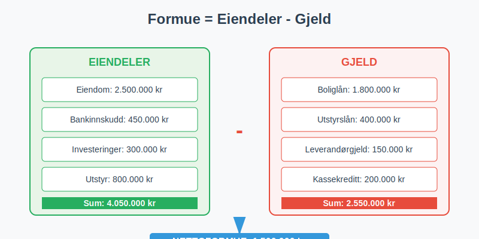
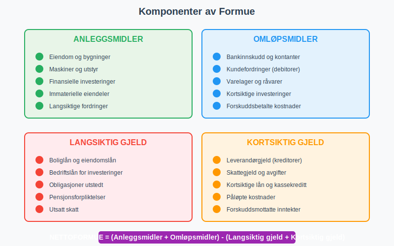
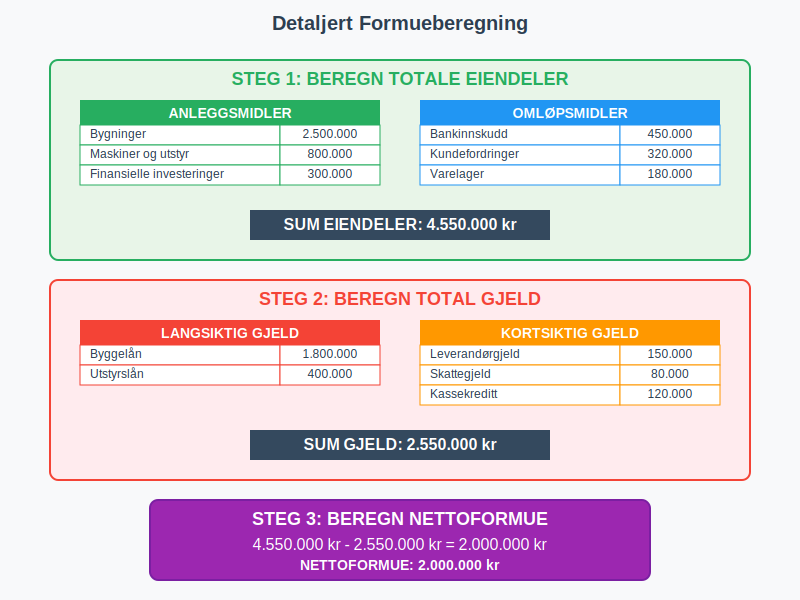
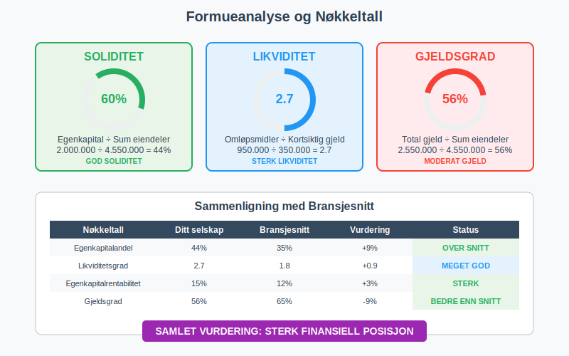
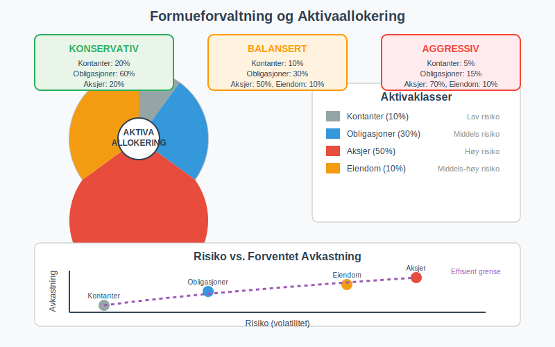
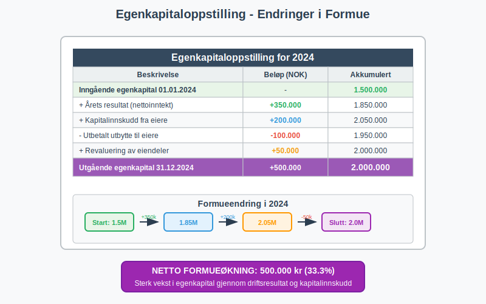

---
title: "Hva er Formue i Regnskap?"
seoTitle: "Hva er Formue i Regnskap?"
meta_description: '**Formue** er den totale **nettoformuen** til en person eller bedrift, beregnet som forskjellen mellom totale [eiendeler](/blogs/regnskap/hva-er-eiendel "Hva er...'
slug: hva-er-formue
type: blog
layout: pages/single
---

**Formue** er den totale **nettoformuen** til en person eller bedrift, beregnet som forskjellen mellom totale [eiendeler](/blogs/regnskap/hva-er-eiendel "Hva er Eiendel? Materielle, Immaterielle og Finansielle Eiendeler") og total gjeld. I regnskapssammenheng refererer formue til [egenkapitalen](/blogs/regnskap/hva-er-egenkapital "Hva er Egenkapital? Beregning, Analyse og Betydning for Bedriften") i [balansen](/blogs/regnskap/hva-er-balanse "Hva er Balanse i Regnskap? Oppbygging, Analyse og Praktiske Eksempler"), og representerer den reelle verdien som eiere har i virksomheten etter at all gjeld er betalt.



## Hva er Formue?

**Formue** defineres som:

* **Nettoformue** = Totale eiendeler - Total gjeld
* Den **økonomiske verdien** som gjenstår etter at alle forpliktelser er oppfylt
* **Egenkapitalen** i regnskapssammenheng
* **Verdiskapningen** som har skjedd over tid
* Grunnlaget for **økonomisk trygghet** og fremtidig vekst

### Formue vs. Inntekt

Det er viktig å skille mellom formue og inntekt:

| Aspekt | Formue | Inntekt |
|--------|--------|---------|
| **Definisjon** | Akkumulert verdi på et tidspunkt | Penger mottatt over en periode |
| **Tidsperspektiv** | Øyeblikksbilde (status) | Strøm over tid (periode) |
| **Måling** | Balanseverdi | [Driftsinntekter](/blogs/regnskap/hva-er-driftsinntekter "Hva er Driftsinntekter? Typer, Regnskapsføring og Analyse") |
| **Eksempel** | Eier hus verdt 3 mill. kr | Tjener 500.000 kr per år |

## Komponenter av Formue

Formue består av ulike typer eiendeler minus gjeld:



### Eiendeler (Aktiva)

**[Anleggsmidler](/blogs/regnskap/hva-er-anleggsmidler "Hva er Anleggsmidler? Materielle, Immaterielle og Finansielle Eiendeler"):**
* **Eiendom** og bygninger
* **Maskiner** og utstyr
* **Finansielle investeringer** (aksjer, obligasjoner)
* **Immaterielle eiendeler** (patenter, varemerker)

**Omløpsmidler:**
* **[Bankinnskudd](/blogs/regnskap/hva-er-bankinnskudd "Hva er Bankinnskudd? Typer, Renter og Regnskapsføring")** og kontanter
* **Kundefordringer** ([debitorer](/blogs/regnskap/hva-er-debitor "Hva er Debitor? Håndtering, Oppfølging og Regnskapsføring"))
* **Varelager** og råvarer
* **Kortsiktige investeringer**

### Gjeld (Passiva)

**Langsiktig gjeld:**
* **Boliglån** og eiendomslån
* **Bedriftslån** for investeringer
* **Obligasjoner** utstedt av selskapet
* **Pensjonsforpliktelser**

**Kortsiktig gjeld:**
* **Leverandørgjeld** (kreditorer)
* **Skattegjeld** og avgifter
* **Kortsiktige lån** og kassekreditt
* **Påløpte kostnader**

## Beregning av Formue

### Grunnleggende Formel

```
Nettoformue = Totale eiendeler - Total gjeld
```

### Detaljert Beregningseksempel

La oss se på en komplett formueberegning for en bedrift:

| Eiendeler | Beløp (NOK) |
|-----------|-------------|
| **Anleggsmidler** | |
| Bygninger | 2.500.000 |
| Maskiner og utstyr | 800.000 |
| Finansielle investeringer | 300.000 |
| **Omløpsmidler** | |
| Bankinnskudd | 450.000 |
| Kundefordringer | 320.000 |
| Varelager | 180.000 |
| **Sum eiendeler** | **4.550.000** |

| Gjeld | Beløp (NOK) |
|-------|-------------|
| **Langsiktig gjeld** | |
| Byggelån | 1.800.000 |
| Utstyrslån | 400.000 |
| **Kortsiktig gjeld** | |
| Leverandørgjeld | 150.000 |
| Skattegjeld | 80.000 |
| Kassekreditt | 120.000 |
| **Sum gjeld** | **2.550.000** |

**Beregning:**
- Nettoformue = 4.550.000 - 2.550.000 = **2.000.000 NOK**



## Typer Formue

### Privat Formue

**Privatpersoners formue** inkluderer:

* **Bolig** og fritidseiendom
* **Bankinnskudd** og sparekontoer
* **Aksjer** og fond
* **Pensjonssparing** og livsforsikring
* **Personlige eiendeler** (bil, båt, kunst)

**Minus gjeld:**
* **Boliglån** og forbrukslån
* **Kredittkortgjeld**
* **Studielån**

### Bedriftsformue

**Bedriftens formue** ([egenkapital](/blogs/regnskap/hva-er-egenkapital "Hva er Egenkapital? Beregning, Analyse og Betydning for Bedriften")) består av:

* **[Aksjekapital](/blogs/regnskap/hva-er-aksjekapital "Hva er Aksjekapital? Innskudd, Endringer og Regnskapsføring")** fra eierne
* **Opptjent egenkapital** (akkumulert overskudd)
* **Fond** og reserver
* **Årets resultat**

### Finansiell Formue vs. Realformue

| Type | Beskrivelse | Eksempler |
|------|-------------|-----------|
| **Finansiell formue** | Pengekrav og finansielle instrumenter | Bankinnskudd, aksjer, obligasjoner |
| **Realformue** | Fysiske eiendeler med egenverdi | Eiendom, maskiner, råvarer, kunst |

## Formueanalyse og Nøkkeltall

### Viktige Nøkkeltall

**[Egenkapitalandel](/blogs/regnskap/hva-er-egenkapital "Hva er Egenkapital? Beregning, Analyse og Betydning for Bedriften"):**
```
Egenkapitalandel = (Egenkapital ÷ Sum eiendeler) × 100
```

**Gjeldsgrad:**
```
Gjeldsgrad = (Total gjeld ÷ Sum eiendeler) × 100
```

**[Egenkapitalrentabilitet](/blogs/regnskap/hva-er-egenkapitalrentabilitet "Hva er Egenkapitalrentabilitet? Beregning, Analyse og Benchmarking"):**
```
Egenkapitalrentabilitet = (Årsresultat ÷ Gjennomsnittlig egenkapital) × 100
```

### Formueanalyse-tabell

| Nøkkeltall | Beregning | Tolkning |
|------------|-----------|----------|
| **Soliditet** | Egenkapital ÷ Sum eiendeler | Høyere = bedre finansiell styrke |
| **Likviditet** | Omløpsmidler ÷ Kortsiktig gjeld | Høyere = bedre betalingsevne |
| **Gearing** | Total gjeld ÷ Egenkapital | Lavere = mindre finansiell risiko |



## Verdivurdering av Formue

### Regnskapsmessig Verdi vs. Markedsverdi

**Regnskapsmessig verdi:**
* Basert på [anskaffelseskost](/blogs/regnskap/hva-er-anskaffelseskost "Hva er Anskaffelseskost? Beregning, Komponenter og Regnskapsføring")
* Justert for [avskrivninger](/blogs/regnskap/hva-er-avskrivning "Hva er Avskrivning i Regnskap? Metoder, Beregning og Praktiske Eksempler")
* Konservativ tilnærming
* Følger regnskapsregler

**Markedsverdi:**
* Basert på dagens markedspriser
* Kan være høyere eller lavere enn bokført verdi
* Mer volatil
* Reflekterer faktisk salgspris

### Verdivurderingsmetoder

**For eiendom:**
* **Sammenlignbar salg** (markedsverdi)
* **Inntektsmetoden** (kapitalisering av leieinntekter)
* **Kostmetoden** (gjenanskaffelseskost)

**For aksjer og investeringer:**
* **Børskurs** for børsnoterte selskaper
* **[Balansebasert verdivurdering](/blogs/regnskap/hva-er-balansebasert-verdivurdering "Hva er Balansebasert Verdivurdering? Metoder og Praktisk Anvendelse")** for private selskaper
* **Inntjeningsbasert verdsettelse**

## Formueoppbygging og -forvaltning

### Strategier for Formueoppbygging

**Sparing og investering:**
* **Systematisk sparing** av overskudd
* **Diversifiserte investeringer** for risikospredning
* **Langsiktig perspektiv** for verdivekst
* **Reinvestering** av [avkastning](/blogs/regnskap/hva-er-avkastning "Hva er Avkastning? Beregning, Typer og Analyse av Investeringsavkastning")

**Gjeldsoptimalisering:**
* **Redusere høyrentende gjeld** først
* **Utnytte skattefordeler** ved fradragsberettiget gjeld
* **Balansere risiko** og avkastning

### Formueforvaltning

**Aktivaallokering:**

| Aktivaklasse | Andel | Risiko | Forventet avkastning |
|--------------|-------|--------|---------------------|
| **Kontanter** | 5-10% | Lav | Lav |
| **Obligasjoner** | 20-40% | Middels | Middels |
| **Aksjer** | 40-70% | Høy | Høy |
| **Eiendom** | 10-30% | Middels-høy | Middels-høy |



## Skattemessige Aspekter

### [Formueskatt](/blogs/regnskap/hva-er-formueskatt "Formueskatt - Komplett Guide til Beregning, Satser og Regelverk i Norge")

I Norge ble **formueskatt** avskaffet i 2014, men prinsippene er fortsatt relevante:

* **Skattepliktig formue** var nettoformue over et bunnfradrag
* **Verdsettelse** til skattemessige verdier (ofte lavere enn markedsverdi)
* **Fradrag** for gjeld og visse eiendeler

### Gevinstbeskatning

**Realiserte gevinster** beskattes når eiendeler selges:
* **Aksjegevinst** beskattes som kapitalinntekt
* **Eiendomsgevinst** kan ha særregler
* **Tap** kan fradras mot gevinster

## Formue i Ulike Selskapsformer

### Enkeltpersonforetak

I et [enkeltpersonforetak](/blogs/regnskap/hva-er-enkeltpersonforetak "Hva er Enkeltpersonforetak? Etablering, Drift og Regnskapsplikt") er:
* **Bedriftens formue** = eierens private formue
* **Ubegrenset ansvar** for bedriftens gjeld
* **Ingen skille** mellom privat og bedrift

### Aksjeselskap

I et [aksjeselskap](/blogs/regnskap/hva-er-et-aksjeselskap "Hva er et Aksjeselskap? Etablering, Drift og Juridiske Krav") er:
* **Selskapets formue** skilt fra eiernes private formue
* **Begrenset ansvar** for aksjonærene
* **Egenkapital** representerer eiernes andel av formuen

## Formueanalyse i Praksis

### Case: Formueanalyse av Bedrift

**Selskap ABC AS - Formueanalyse 2024:**

| År | Eiendeler | Gjeld | Nettoformue | Endring |
|----|-----------|-------|-------------|---------|
| 2022 | 5.200.000 | 3.100.000 | 2.100.000 | - |
| 2023 | 5.800.000 | 3.200.000 | 2.600.000 | +23,8% |
| 2024 | 6.500.000 | 3.400.000 | 3.100.000 | +19,2% |

**Analyse:**
* **Positiv utvikling** i nettoformue over 3 år
* **Eiendelsvekst** på 25% (2022-2024)
* **Kontrollert gjeldsvekst** på kun 9,7%
* **Forbedret soliditet** fra 40,4% til 47,7%

### Formueplanlegging

**Kortsiktige mål (1-2 år):**
* **Øke likviditetsreserver**
* **Redusere kortsiktig gjeld**
* **Forbedre [arbeidskapital](/blogs/regnskap/hva-er-arbeidskapital "Hva er Arbeidskapital? Beregning, Analyse og Optimalisering")**

**Langsiktige mål (5-10 år):**
* **Diversifisere investeringer**
* **Bygge opp pensjonsformue**
* **Planlegge generasjonsskifte**

## Formue og Finansiell Rapportering

### Balanserapportering

Formue rapporteres i [balansen](/blogs/regnskap/hva-er-balanse "Hva er Balanse i Regnskap? Oppbygging, Analyse og Praktiske Eksempler") som:

**Egenkapital:**
* **Innskutt egenkapital** ([aksjekapital](/blogs/regnskap/hva-er-aksjekapital "Hva er Aksjekapital? Krav og Forklaring"), [overkurs](/blogs/regnskap/hva-er-overkurs "Hva er Overkurs? En Guide til Overkurs i Regnskap"))
* **Opptjent egenkapital** (fond, udisponert overskudd)
* **Årets resultat**

### Endringer i Egenkapital

**Egenkapitaloppstilling** viser:
* **Inngående balanse** ved årets start
* **Årets resultat** (økning/reduksjon)
* **Utbytte** og andre utdelinger (reduksjon)
* **Kapitalinnskudd** (økning)
* **Utgående balanse** ved årets slutt



## Internasjonale Perspektiver

### IFRS og Formueregnskapet

Under **International Financial Reporting Standards (IFRS):**
* **Virkelig verdi** brukes for visse eiendeler
* **Revaluering** av anleggsmidler tillatt
* **Mer markedsorientert** verdsettelse

### Sammenligning med Andre Land

| Land | Formueskatt | Særtrekk |
|------|-------------|----------|
| **Norge** | Nei (avskaffet 2014) | Høy eiendomsbeskatning |
| **Sverige** | Nei (avskaffet 2007) | Ingen eiendomsskatt |
| **Sveits** | Ja | Varierer per kanton |
| **Frankrike** | Ja (over €1,3 mill.) | Kun eiendom |

## Digitale Verktøy for Formueanalyse

### Regnskapssystemer

Moderne [ERP-systemer](/blogs/regnskap/hva-er-erp-system "Hva er ERP-system? Funksjonalitet, Fordeler og Implementering") tilbyr:
* **Automatisk formueberegning**
* **Sanntids balanserapporter**
* **Trendanalyse** og prognoser
* **Integrerte dashboards**

### Personlig Formueforvaltning

**Digitale verktøy:**
* **Nettbank-oversikter** av alle kontoer
* **Investeringsapper** med porteføljeanalyse
* **Budsjettverktøy** for formueplanlegging
* **Skatteplanlegging** med formueoptimalisering

## Vanlige Feil og Misforståelser

### Typiske Feil

**Verdsettingsfeil:**
* **Overvurdere** illikvide eiendeler
* **Glemme skjult gjeld** eller forpliktelser
* **Ikke justere** for inflasjon over tid
* **Blande** regnskapsmessig og markedsverdi

**Analysfeil:**
* **Fokusere kun** på absolutte tall
* **Ignorere** bransjebenchmarks
* **Ikke vurdere** fremtidig inntjeningsevne
* **Overse** skattemessige konsekvenser

### Best Practices

**For formueanalyse:**
* **Bruk konsistente** verdsettelsesmetoder
* **Oppdater verdier** regelmessig
* **Inkluder alle** eiendeler og forpliktelser
* **Dokumenter** forutsetninger og metoder

## Fremtidige Trender

### Digitalisering av Formueforvaltning

**Teknologiske utviklinger:**
* **Kunstig intelligens** for investeringsrådgivning
* **Blockchain** for eiendomsregistrering
* **Automatisert** porteføljebalansering
* **Sanntids** markedsverdier

### Bærekraftig Formueforvaltning

**ESG-investering:**
* **Miljømessige** kriterier
* **Sosiale** hensyn
* **God selskapsstyring**
* **Langsiktig verdiskapning**

## Konklusjon

**Formue** er et grunnleggende konsept i regnskap og økonomi som representerer den reelle verdien etter at all gjeld er trukket fra. Forståelse av formue og formueanalyse er essensielt for:

* **Økonomisk planlegging** og beslutninger
* **Investeringsvurderinger** og risikostyring
* **Kredittvurdering** og finansiering
* **Skatteplanlegging** og optimalisering
* **Generasjonsskifte** og arveplanlegging

Ved å følge prinsippene for **formueoppbygging**, **diversifisering** og **langsiktig tenkning** kan både privatpersoner og bedrifter bygge solid økonomisk fundament for fremtiden.

Regelmessig **formueanalyse** og **oppfølging** av nøkkeltall sikrer at man holder oversikt over den økonomiske utviklingen og kan ta informerte beslutninger om fremtidig strategi og investeringer.


