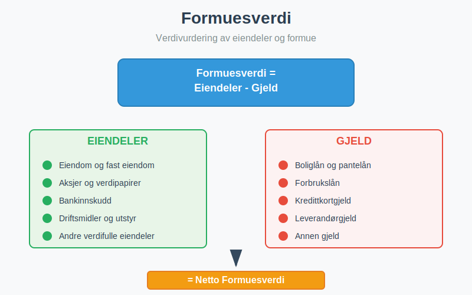
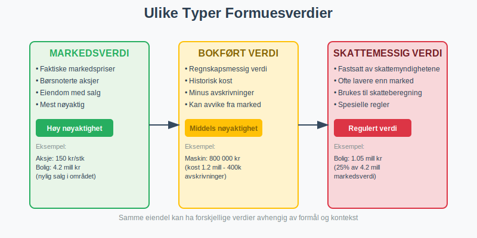
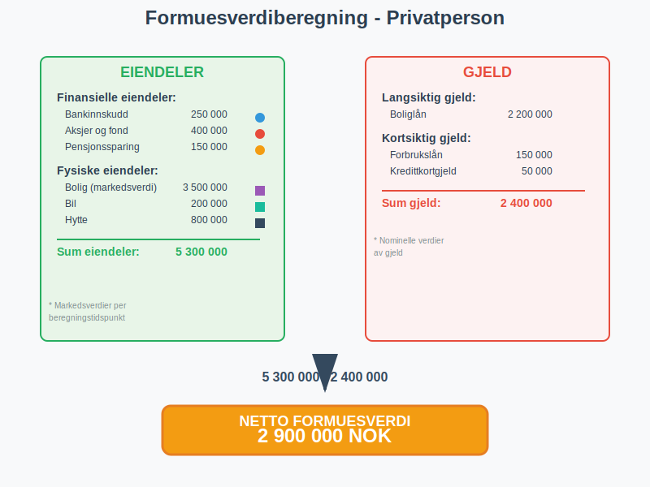
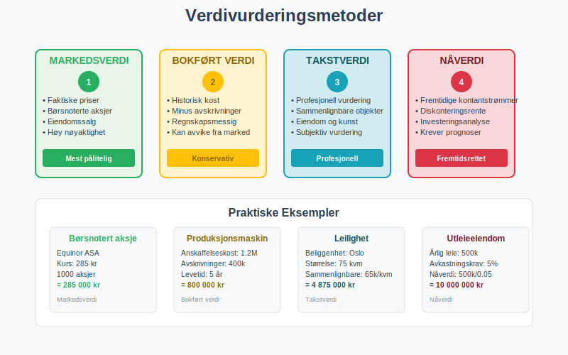
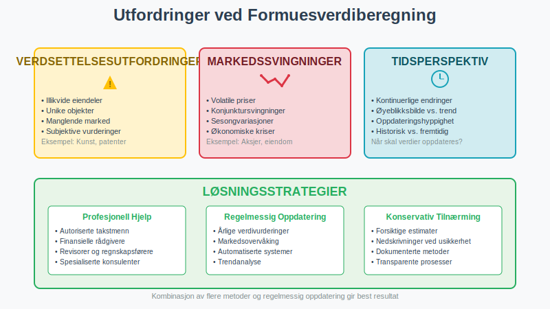

---
title: "Hva er Formuesverdi?"
meta_title: "Hva er Formuesverdi?"
meta_description: '**Formuesverdi** er den totale verdien av en persons eller bedrifts eiendeler fratrukket gjeld. Det representerer netto formue og er et sentralt begrep innen [r...'
slug: hva-er-formuesverdi
type: blog
layout: pages/single
---

**Formuesverdi** er den totale verdien av en persons eller bedrifts eiendeler fratrukket gjeld. Det representerer netto formue og er et sentralt begrep innen [regnskap](/blogs/regnskap/hva-er-regnskap "Hva er Regnskap? En komplett guide"), skatteberegning og økonomisk analyse. Formuesverdi brukes både for private personer og bedrifter til å vurdere økonomisk stilling og soliditet.

### Definisjon og Grunnleggende Forståelse

Formuesverdi kan defineres på flere måter avhengig av kontekst og formål:

#### Regnskapsmessig Definisjon
**Formuesverdi = Eiendeler - Gjeld**

Dette er den mest grunnleggende formelen som viser at formuesverdi er det som blir igjen når alle forpliktelser er trukket fra alle [eiendeler (aktiva)](/blogs/regnskap/hva-er-aktiva "Hva er Aktiva? Komplett Guide til Eiendeler i Regnskapet").

#### Skattemessig Definisjon
For skatteformål beregnes formuesverdi basert på **skattemessige verdier** av eiendeler og gjeld, som kan avvike fra markedsverdier eller regnskapsmessige verdier. Dette kalles også [ligningsverdi](/blogs/regnskap/ligningsverdi "Ligningsverdi “ Definisjon, Beregning og Betydning i Norsk Regnskap").

#### Markedsmessig Definisjon
Markedsmessig formuesverdi baseres på **faktiske markedsverdier** av eiendeler på beregningstidspunktet, noe som gir det mest realistiske bildet av faktisk formue.

### Komponenter i Formuesverdi

Formuesverdi består av to hovedkomponenter som må vurderes nøye:

#### 1. Eiendeler (Aktiva)

Eiendeler som inngår i formuesverdiberegning inkluderer:

**Finansielle Eiendeler:**
- **Bankinnskudd** og kontanter
- **Aksjer** og [verdipapirer](/blogs/regnskap/hva-er-verdipapir "Hva er Verdipapir? En Komplett Guide til Verdipapirer i Norsk Regnskap")
- **Obligasjoner** og rentebærende verdipapirer
- **Fond** og investeringskontoer
- **Pensjonsmidler** og livsforsikring

**Fysiske Eiendeler:**
- **Fast eiendom** (boliger, næringseiendom, tomter)
- **Driftsmidler** og maskiner
- **Inventar** og utstyr
- **Kjøretøy** og transportmidler
- **Kunst** og samleobjekter

**Immaterielle Eiendeler:**
- **Patenter** og opphavsrettigheter
- **Varemerker** og goodwill
- **Programvare** og teknologi
- **Kunderegistre** og kontrakter

#### 2. Gjeld (Passiva)

Gjeld som trekkes fra i formuesverdiberegning:

**Langsiktig Gjeld:**
- **Boliglån** og pantelån
- **Næringslån** og investeringslån
- **Obligasjonslån** og sertifikatlån

**Kortsiktig Gjeld:**
- **Forbrukslån** og kredittkortgjeld
- **Leverandørgjeld** og [fakturaer](/blogs/regnskap/hva-er-en-faktura "Hva er en Faktura? En Guide til Norske Fakturakrav")
- **Skattegjeld** og avgiftsgjeld
- **Annen kortsiktig gjeld**

### Beregning av Formuesverdi

La oss se på praktiske eksempler på hvordan formuesverdi beregnes:

#### Eksempel 1: Privatperson

| **Eiendeler** | **Verdi (NOK)** |
|---------------|-----------------|
| **Finansielle Eiendeler** | |
| Bankinnskudd | 250 000 |
| Aksjer og fond | 400 000 |
| Pensjonssparing | 150 000 |
| **Fysiske Eiendeler** | |
| Bolig (markedsverdi) | 3 500 000 |
| Bil | 200 000 |
| Hytte | 800 000 |
| **Sum eiendeler** | **5 300 000** |
| | |
| **Gjeld** | **Beløp (NOK)** |
| Boliglån | 2 200 000 |
| Forbrukslån | 150 000 |
| Kredittkortgjeld | 50 000 |
| **Sum gjeld** | **2 400 000** |
| | |
| **Netto formuesverdi** | **2 900 000** |

**Beregning:** 5 300 000 - 2 400 000 = **2 900 000 NOK**

#### Eksempel 2: Bedrift

| **Eiendeler** | **Verdi (NOK)** |
|---------------|-----------------|
| **Omløpsmidler** | |
| Kontanter og bank | 500 000 |
| [Kundefordringer](/blogs/regnskap/hva-er-debitor "Hva er Debitor? Komplett Guide til Kundefordringer") | 800 000 |
| Varelager | 600 000 |
| **Anleggsmidler** | |
| Bygninger | 2 000 000 |
| Maskiner og utstyr | 1 200 000 |
| Goodwill | 300 000 |
| **Sum eiendeler** | **5 400 000** |
| | |
| **Gjeld** | **Beløp (NOK)** |
| Leverandørgjeld | 400 000 |
| Banklån | 1 500 000 |
| Annen gjeld | 200 000 |
| **Sum gjeld** | **2 100 000** |
| | |
| **Netto formuesverdi** | **3 300 000** |

### Verdivurderingsmetoder

Ulike eiendeler krever forskjellige metoder for verdivurdering:

#### 1. Markedsverdi
- Basert på **faktiske markedspriser**
- Brukes for børsnoterte aksjer, eiendom med sammenlignbare salg
- Mest nøyaktig, men ikke alltid tilgjengelig

#### 2. Bokført Verdi
- Verdi i [regnskapet](/blogs/regnskap/hva-er-regnskap "Hva er Regnskap? En komplett guide")
- Historisk kost minus [avskrivninger](/blogs/regnskap/hva-er-avskrivning "Hva er Avskrivning? Komplett Guide til Avskrivningsmetoder")
- Kan avvike betydelig fra markedsverdi

#### 3. Takstverdi
- Profesjonell vurdering av kvalifisert takstmann
- Brukes for eiendom, kunst, spesialutstyr
- Basert på sammenlignbare objekter og markedsforhold

#### 4. Nåverdi
- Beregnet basert på fremtidige kontantstrømmer
- Brukes for investeringer og forretningsvirksomhet
- Krever antagelser om fremtidig avkastning

### Formuesverdi og Skatt

I Norge har formuesverdi betydning for flere skattemessige forhold:

#### [Formueskatt (Opphevet 2014)](/blogs/regnskap/hva-er-formueskatt "Formueskatt - Komplett Guide til Beregning, Satser og Regelverk i Norge")
- Norge hadde tidligere formueskatt basert på netto formuesverdi
- Ble opphevet fra 2015, men prinsippene er fortsatt relevante

#### Skattemessige Verdier

| **Eiendelstype** | **Skattemessig Verdi** |
|------------------|------------------------|
| **Bolig** | 25% av markedsverdi |
| **Fritidseiendom** | 25% av markedsverdi |
| **Næringseiendom** | Markedsverdi |
| **Aksjer** | Markedsverdi (børsnoterte) |
| **Bankinnskudd** | Nominell verdi |
| **Gjeld** | Nominell verdi |

#### Arveavgift og Gaveavgift
- Baseres på **markedsverdi** av overførte eiendeler
- Viktig for planlegging av generasjonsskifte

### Formuesverdi i Bedriftssammenheng

For bedrifter er formuesverdi sentralt i flere sammenhenger:

#### 1. Egenkapitalvurdering
Formuesverdi tilsvarer [egenkapital](/blogs/regnskap/hva-er-egenkapital "Hva er Egenkapital? Komplett Guide til Egenkapital i Regnskap") i regnskapet:
- **Egenkapital = Eiendeler - Gjeld**
- Viser eiernes netto investering i bedriften

#### 2. Soliditetsvurdering
**Egenkapitalandel** beregnes som:
- **Egenkapitalandel = (Egenkapital / Sum eiendeler) × 100%**

| **Egenkapitalandel** | **Soliditetsvurdering** |
|---------------------|-------------------------|
| Over 40% | Meget god soliditet |
| 30-40% | God soliditet |
| 20-30% | Middels soliditet |
| 10-20% | Svak soliditet |
| Under 10% | Kritisk lav soliditet |

#### 3. Verdivurdering av Selskap
- **Bokført verdi** vs. **markedsverdi**
- Viktig ved salg, fusjon eller oppkjøp (hvor [goodwill](/blogs/regnskap/hva-er-goodwill "Hva er Goodwill? Komplett Guide til Goodwill og Immaterielle Eiendeler") ofte oppstår)
- Grunnlag for [aksjevurdering](/blogs/regnskap/hva-er-en-aksje "Hva er en Aksje? Komplett Guide til Aksjer og Aksjeinvestering")

### Utfordringer ved Formuesverdiberegning

#### 1. Verdsettelsesutfordringer
- **Illikvide eiendeler** kan være vanskelige å verdsette
- **Markedssvingninger** påvirker verdier
- **Subjektive vurderinger** for unike eiendeler

#### 2. Tidsperspektiv
- Formuesverdi endres kontinuerlig
- **Øyeblikksbilde** vs. **trendanalyse**
- Viktighet av regelmessig oppdatering

#### 3. Regnskapsmessige Utfordringer
- Forskjell mellom **bokført verdi** og **markedsverdi**
- [Avskrivninger](/blogs/regnskap/hva-er-avskrivning "Hva er Avskrivning? Komplett Guide til Avskrivningsmetoder") kan undervurdere eiendeler
- **[Goodwill](/blogs/regnskap/hva-er-goodwill "Hva er Goodwill? Komplett Guide til Goodwill og Immaterielle Eiendeler")** og immaterielle eiendeler

### Praktisk Anvendelse

#### For Privatpersoner
- **Økonomisk planlegging** og budsjettring
- **Pensjonssparing** og investeringsstrategi
- **Lånesøknader** og kredittvurdering
- **Forsikringsbehov** og risikovurdering

#### For Bedrifter
- **Finansiell rapportering** og [regnskap](/blogs/regnskap/hva-er-regnskap "Hva er Regnskap? En komplett guide")
- **Kredittvurdering** og låneopptak
- **Investeringsbeslutninger** og kapitalallokering
- **Strategisk planlegging** og verdiskapning

#### For Investorer
- **Fundamental analyse** av selskaper
- **Porteføljeevaluering** og risikostyring
- **Sammenligning** av investeringsalternativer

### Formuesverdi og Inflasjon

[Inflasjon](/blogs/regnskap/hva-er-inflasjon "Hva er Inflasjon? Komplett Guide til Inflasjon i Regnskap og Økonomi") påvirker formuesverdi på flere måter:

#### Nominell vs. Real Formuesverdi
- **Nominell formuesverdi**: Ikke justert for inflasjon
- **Real formuesverdi**: Justert for kjøpekraftsendringer

#### Inflasjonsbeskyttelse
Ulike eiendeler gir forskjellig beskyttelse mot inflasjon:

| **Eiendelstype** | **Inflasjonsbeskyttelse** |
|------------------|---------------------------|
| **Fast eiendom** | God beskyttelse |
| **Aksjer** | Varierende beskyttelse |
| **Obligasjoner** | Begrenset beskyttelse |
| **Kontanter** | Ingen beskyttelse |
| **Realaktiva** | God beskyttelse |

### Internasjonale Perspektiver

#### IFRS og Regnskapsstandarder
- **International Financial Reporting Standards**
- Harmonisering av verdivurderingsprinsipper
- **Fair value** vs. **historical cost**

#### Skattemessige Forskjeller
Ulike land har forskjellige regler for:
- **Formueskatt** og kapitalbeskatning
- **Verdivurderingsmetoder** for skatteformål
- **Rapporteringskrav** for formue

### Digitalisering og Formuesverdi

#### Nye Eiendelstyper
- **Kryptovaluta** og digitale eiendeler
- **NFT** og digitale samleobjekter
- **Immaterielle rettigheter** i digital økonomi

#### Teknologiske Verktøy
- **Automatisert verdivurdering** og prisoppdatering
- **Porteføljestyring** og rapportering
- **Kunstig intelligens** i verdivurdering

### Juridiske Aspekter

#### Kontraktsrett
- **Pantsettelse** og sikkerhetsstillelse
- **Ekteskapelige forhold** og formuesfordeling
- **Arverett** og testamentariske disposisjoner

#### Selskapsrett
- **Kapitalforhøyninger** og emisjoner
- **Fusjon** og fisjon av selskaper
- **Oppløsning** og avvikling

### Risikostyring og Formuesverdi

#### Diversifisering
- **Spredning** av risiko på ulike eiendelsklasser
- **Geografisk diversifisering**
- **Sektordiversifisering**

#### Forsikring
- **Eiendomsforsikring** og ansvarsforsikring
- **Livsforsikring** og uføreforsikring
- **Nøkkelpersonforsikring** for bedrifter

### Konklusjon

Formuesverdi er et **fundamentalt begrep** som har stor betydning både for privatpersoner og bedrifter. Forståelse av hvordan formuesverdi beregnes og vurderes er essensielt for:

- **Økonomisk planlegging** og beslutninger
- **Skattemessige forhold** og rapportering
- **Investeringsstrategier** og risikostyring
- **Kredittvurdering** og finansiering

Ved beregning av formuesverdi er det viktig å:

1. **Identifisere alle relevante eiendeler** og gjeld
2. **Velge riktige verdivurderingsmetoder** for hver eiendelstype
3. **Oppdatere verdier regelmessig** for å reflektere markedsendringer
4. **Forstå skattemessige konsekvenser** av ulike verdivurderinger
5. **Vurdere risiko** og diversifisering i formuessammensetningen

Formuesverdi er ikke bare et øyeblikksbilde, men et **dynamisk mål** som endres med markedsforhold, økonomisk utvikling og personlige eller bedriftsmessige beslutninger. Regelmessig overvåking og analyse av formuesverdi er derfor avgjørende for god økonomisk styring og planlegging.

