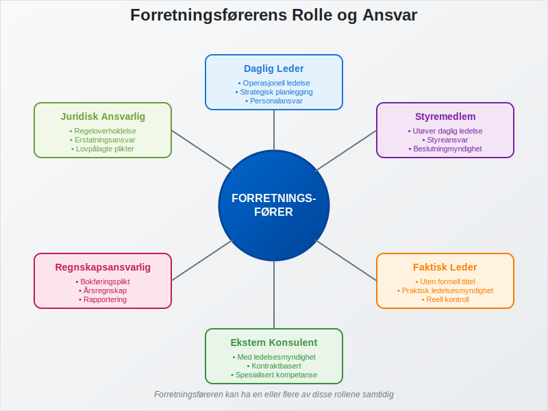
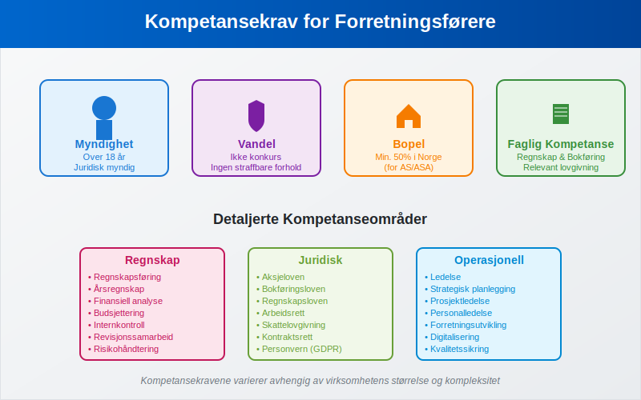
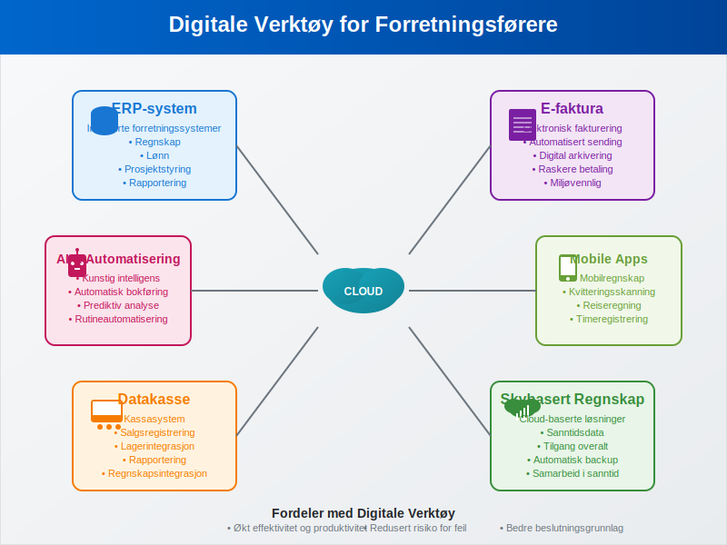

---
title: "Hva er en forretningsfører?"
meta_title: "Hva er en forretningsfører?"
meta_description: 'En **forretningsfører** er en person som har det daglige ansvaret for å drive en virksomhet på vegne av eierne. I norsk rett er forretningsføreren en sentra...'
slug: hva-er-forretningsforer
type: blog
layout: pages/single
---

En **forretningsfører** er en person som har det daglige ansvaret for å drive en virksomhet på vegne av eierne. I norsk rett er forretningsføreren en sentral figur som kombinerer operasjonelt ledelsesansvar med juridiske forpliktelser. Denne artikkelen gir en omfattende gjennomgang av forretningsførerens rolle, ansvar og krav i det norske næringslivet.

## Seksjon 1: Juridisk Definisjon og Grunnlag

### 1.1 Lovgrunnlag

Forretningsførerens rolle er regulert i flere lover, avhengig av selskapsformen:

* **[Aksjeloven](/blogs/regnskap/hva-er-aksjeloven "Hva er Aksjeloven? Komplett Guide til Norsk Aksjelovgivning")** - for aksjeselskaper (AS)
* **Allmennaksjeloven** - for allmennaksjeselskaper (ASA)
* **Selskapsloven** - for ansvarlige selskaper og kommandittselskaper

### 1.2 Definisjon av Forretningsfører

En forretningsfører er definert som den som **faktisk leder virksomheten** på vegne av selskapet. Dette innebærer ikke bare formell utnevnelse, men også praktisk utøvelse av ledelsesmyndighet. Forretningsføreren kan være:

* Daglig leder
* Styremedlem som utøver daglig ledelse
* Faktisk leder uten formell tittel
* Ekstern konsulent med ledelsesmyndighet

## Seksjon 2: Utnevnelse og Kompetansekrav

### 2.1 Utnevnelsesprosess

Utnevnelse av forretningsfører følger spesifikke prosedyrer avhengig av selskapsform:

| Selskapsform | Utnevnelsesmyndighet | Registrering |
|--------------|---------------------|--------------|
| Aksjeselskap (AS) | Styret | [Foretaksregisteret](/blogs/regnskap/hva-er-foretak "Hva er et Foretak? Komplett Guide til Foretaksformer i Norge") |
| Allmennaksjeselskap (ASA) | Styret | Foretaksregisteret |
| Ansvarlig selskap | Deltakerne | Foretaksregisteret |
| Kommandittselskap | Komplementarene | Foretaksregisteret |

### 2.2 Kompetansekrav

Norsk lov stiller spesifikke krav til forretningsførere:

* **Myndighet:** Må være myndig (over 18 år)
* **Vandel:** Ikke være konkurs eller ha begått straffbare handlinger som gjør vedkommende uskikket
* **Bopel:** For aksjeselskaper må minst halvparten av forretningsførerne være bosatt i Norge
* **Faglig kompetanse:** Må ha nødvendig kunnskap om [regnskap](/blogs/regnskap/hva-er-regnskap "Hva er Regnskap? En Dybdeanalyse for Norge"), [bokføring](/blogs/regnskap/hva-er-bokforing "Hva er Bokføring? En Komplett Guide til Norsk Bokføringspraksis") og relevant lovgivning

## Seksjon 3: Ansvarsområder og Oppgaver

### 3.1 Daglig Drift

Forretningsførerens primære ansvar omfatter:

* **Operasjonell ledelse:** Daglig drift av virksomheten
* **Personalansvar:** Ansettelse, oppsigelse og ledelse av ansatte
* **Økonomisk styring:** Budsjett, likviditetsstyring og investeringsbeslutninger
* **Strategisk planlegging:** Utvikling av forretningsstrategier

### 3.2 Regnskapsmessige Forpliktelser

Forretningsføreren har omfattende ansvar for selskapets [regnskapsføring](/blogs/regnskap/hva-er-regnskap "Hva er Regnskap? En Dybdeanalyse for Norge"):

* **[Bokføringsplikt](/blogs/regnskap/hva-er-bokforingsplikt "Hva er Bokføringsplikt? Komplett Guide til Norske Bokføringskrav"):** Sikre korrekt og løpende bokføring
* **[Bilagsbehandling](/blogs/regnskap/hva-er-bilag "Hva er Bilag i Regnskap? Komplett Guide til Regnskapsbilag og Dokumentasjon"):** Systematisk håndtering av regnskapsbilag
* **Årsregnskap:** Utarbeidelse av årsregnskap i henhold til [regnskapslovgivningen](/blogs/regnskap/hva-er-bokforingsloven "Hva er Bokføringsloven? Komplett Guide til Norsk Bokføringslovgivning")
* **[Revisjonssamarbeid](/blogs/regnskap/hva-er-arbeidspapirer-revisjon "Hva er Arbeidspapirer i Revisjon? Komplett Guide til Revisjonsdokumentasjon"):** Samarbeid med revisor ved revisjon

### 3.3 Rapporteringsansvar

Forretningsføreren må sikre korrekt rapportering til offentlige myndigheter:

* **[A-melding](/blogs/regnskap/hva-er-a-melding "Hva er A-melding? Komplett Guide til Arbeidsgiver- og Arbeidstakerregisteret"):** Månedlig rapportering av lønn og arbeidsgiveravgift
* **[MVA-melding](/blogs/regnskap/hva-er-avgiftsplikt-mva "Hva er Avgiftsplikt MVA? Komplett Guide til Merverdiavgift i Norge"):** Rapportering av merverdiavgift
* **Årsoppgave:** Årlig skatteoppgave for selskapet
* **[Altinn-rapportering](/blogs/regnskap/hva-er-altinn "Hva er Altinn? Komplett Guide til Norges Digitale Forvaltningsplattform"):** Digital kommunikasjon med offentlige myndigheter

## Seksjon 4: Juridisk Ansvar og Erstatning

### 4.1 Erstatningsansvar

Forretningsføreren kan holdes **personlig ansvarlig** for skader som oppstår som følge av:

* Brudd på lovgivning
* Uaktsom eller forsettlig handling
* Manglende oppfyllelse av lovpålagte plikter
* Skade på selskapet, aksjonærer eller tredjeparter

### 4.2 Straffansvar

I alvorlige tilfeller kan forretningsføreren straffeforfølges for:

* **Regnskapsbrudd:** Brudd på [bokføringsloven](/blogs/regnskap/hva-er-bokforingsloven "Hva er Bokføringsloven? Komplett Guide til Norsk Bokføringslovgivning")
* **Skatteunndragelse:** Manglende eller feilaktig skatteinnberetning
* **Bedrageri:** Villedende informasjon til myndigheter eller interessenter
* **Konkurskriminalitet:** Ulovlige handlinger i forbindelse med konkurs

### 4.3 Forsikring og Risikohåndtering

For å redusere personlig risiko bør forretningsførere vurdere:

* **Styreansvarsforsikring:** Dekker erstatningskrav mot ledelsen
* **Juridisk bistand:** Tilgang til juridisk rådgivning
* **Compliance-systemer:** Systemer for å sikre regeloverholdelse
* **Internkontroll:** Robuste kontrollsystemer for å forebygge feil

## Seksjon 5: Forskjeller Mellom Selskapsformer

### 5.1 Aksjeselskap (AS)

I et [aksjeselskap](/blogs/regnskap/hva-er-et-aksjeselskap "Hva er et Aksjeselskap? Komplett Guide til AS i Norge") har forretningsføreren:

* **Begrenset ansvar:** Personlig ansvar kun ved uaktsomhet eller forsett
* **Styreansvar:** Rapporterer til styret
* **[Aksjekapital](/blogs/regnskap/hva-er-aksjekapital "Hva er Aksjekapital? Komplett Guide til Aksjekapital i Norge")-ansvar:** Må sikre at aksjekapitalen opprettholdes

### 5.2 Enkeltpersonforetak

I et [enkeltpersonforetak](/blogs/regnskap/hva-er-enkeltpersonforetak "Hva er Enkeltpersonforetak? Komplett Guide til ENK i Norge") er eieren selv forretningsfører med:

* **Ubegrenset ansvar:** Personlig ansvar for alle forpliktelser
* **Direkte kontroll:** Full kontroll over virksomheten
* **Enklere struktur:** Færre formelle krav

### 5.3 Sammenligning av Ansvarsformer

| Selskapsform | Personlig Ansvar | Kapitalkrav | Kompleksitet |
|--------------|------------------|-------------|--------------|
| Enkeltpersonforetak | Ubegrenset | Ingen | Lav |
| Ansvarlig Selskap | Ubegrenset | Ingen | Middels |
| Aksjeselskap | Begrenset | 30.000 kr | Høy |
| ASA | Begrenset | 1.000.000 kr | Svært høy |

## Seksjon 6: Praktiske Retningslinjer

### 6.1 Beste Praksis for Forretningsførere

* **Dokumentasjon:** Hold detaljerte registre over alle beslutninger og handlinger
* **Kompetanseutvikling:** Hold deg oppdatert på relevant lovgivning og regnskapsregler
* **Delegering:** Deleger oppgaver til kvalifisert personell når det er hensiktsmessig
* **Rådgivning:** Søk profesjonell rådgivning ved usikkerhet

### 6.2 Vanlige Fallgruver

Forretningsførere bør unngå:

* **Blanding av private og forretningsmessige midler:** Kan føre til erstatningsansvar
* **Manglende [avstemming](/blogs/regnskap/hva-er-avstemming "Hva er Avstemming i Regnskap? Komplett Guide til Regnskapsavstemming"):** Kan resultere i regnskapsfeil
* **Forsømmelse av rapporteringsfrister:** Kan medføre gebyrer og sanksjoner
* **Utilstrekkelig internkontroll:** Øker risikoen for feil og misligheter

### 6.3 Digitale Verktøy og Systemer

Moderne forretningsførere benytter ofte:

* **[ERP-systemer](/blogs/regnskap/hva-er-erp-system "Hva er ERP-system? Komplett Guide til Enterprise Resource Planning"):** Integrerte forretningssystemer
* **[Elektronisk fakturering](/blogs/regnskap/hva-er-elektronisk-fakturering "Hva er Elektronisk Fakturering? Komplett Guide til E-faktura i Norge"):** Automatisert fakturabehandling
* **Skybaserte regnskapssystemer:** Tilgang til sanntidsdata
* **[Datakasse](/blogs/regnskap/hva-er-datakasse "Hva er Datakasse? Komplett Guide til Kassasystem, Krav og Regnskapsføring")-integrasjon:** Automatisk registrering av salgstransaksjoner

## Seksjon 7: Fremtidige Utviklingstrekk

### 7.1 Digitalisering og Automatisering

Forretningsførerens rolle endres med teknologisk utvikling:

* **Kunstig intelligens:** Automatisering av rutineoppgaver
* **Blockchain:** Økt transparens og sporbarhet
* **Sanntidsrapportering:** Kontinuerlig overvåking av nøkkeltall
* **Prediktiv analyse:** Bedre beslutningsgrunnlag

### 7.2 Regulatoriske Endringer

Nye krav og forskrifter påvirker forretningsførerens ansvar:

* **ESG-rapportering:** Miljø-, sosial- og styringsrapportering
* **Cybersikkerhet:** Økt fokus på datasikkerhet
* **Personvern:** GDPR og andre personvernregler
* **Bærekraft:** Krav til bærekraftsrapportering

## Konklusjon

Forretningsførerens rolle er kompleks og omfattende, med betydelig juridisk og operasjonelt ansvar. Suksess krever en kombinasjon av faglig kompetanse, praktisk erfaring og kontinuerlig læring. Ved å forstå de juridiske kravene, implementere beste praksis og utnytte moderne teknologi, kan forretningsførere effektivt lede sine virksomheter samtidig som de minimerer personlig risiko.

For å lykkes som forretningsfører er det essensielt å ha solid kunnskap om [regnskap](/blogs/regnskap/hva-er-regnskap "Hva er Regnskap? En Dybdeanalyse for Norge"), [bokføring](/blogs/regnskap/hva-er-bokforing "Hva er Bokføring? En Komplett Guide til Norsk Bokføringspraksis") og relevant lovgivning, samt å etablere robuste systemer for internkontroll og risikohåndtering.

