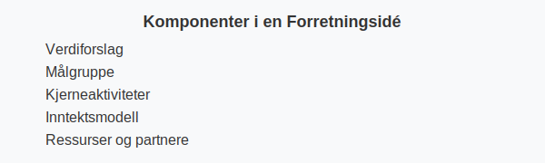

---
title: "Hva er forretningsidé?"
meta_title: "Hva er forretningsidé?"
meta_description: 'En **forretningsidé** er kjernen i enhver virksomhet. Den beskriver virksomhetens **verdiforslag**, målgruppe og unike posisjon i markedet. En klar forretning...'
slug: hva-er-forretningside
type: blog
layout: pages/single
---

En **forretningsidé** er kjernen i enhver virksomhet. Den beskriver virksomhetens **verdiforslag**, målgruppe og unike posisjon i markedet. En klar forretningsidé legger grunnlaget for både [forretningsplan](/blogs/regnskap/hva-er-forretningsplan "Hva er Forretningsplan? Komplett Guide til Forretningsplanlegging og Regnskapsoppfølging") og videre **regnskapsføring**. For å konkretisere hvordan en forretningsidé realiseres i praksis, bør du utvikle en klar [forretningsmodell](/blogs/regnskap/hva-er-forretningsmodell "Hva er forretningsmodell? Komplett guide til utforming og evaluering av forretningsmodell for regnskap og virksomhetsstyring").

En vellykket forretningsidé er tett knyttet til **innovasjon**, som du kan lese mer om i vår artikkel [Innovasjon](/blogs/regnskap/innovasjon "Innovasjon i Regnskap: En Komplett Guide til Innovasjon i Regnskap og Utviklingskostnader").

## Seksjon 1: Hva består en forretningsidé av?

En grundig forretningsidé inneholder vanligvis følgende elementer:

* **Verdiforslag:** Hva gjør produktet eller tjenesten unikt?
* **MÃ¥lgruppe:** Hvem er kundene, og hvilke behov dekker de?
* **Kjerneaktiviteter:** Hvilke aktiviteter skaper kjerneverdiene?
* **Inntektsmodell:** Hvordan skaper virksomheten inntekt?
* **Ressurser og partnere:** Hvilke ressurser og samarbeidspartnere er nødvendige?

## Seksjon 2: Betydning for regnskap og forretningsplan

Uten en tydelig forretningsidé kan verken [forretningsplan](/blogs/regnskap/hva-er-forretningsplan "Hva er Forretningsplan? Komplett Guide til Forretningsplanlegging og Regnskapsoppfølging") eller [regnskap](/blogs/regnskap/hva-er-regnskap "Hva er Regnskap? En Dybdeanalyse for Norge") bli effektive verktøy. Forretningsideen:

| Fordel   | Forklaring                                              |
|----------|----------------------------------------------------------|
| Retning  | Gir rammer for budsjett og prognoser                     |
| Klarhet  | Forenkler føringer for kostnader og inntekter            |
| Evaluering | Muliggjør tidlig vurdering av lønnsomhet                |

## Seksjon 3: Evaluering av forretningsidé

Før du ferdigstiller ideen, vurder den opp mot kriterier for god forretningsidé:

| Kriterium         | Beskrivelse                                            |
|-------------------|--------------------------------------------------------|
| Markedsbehov      | Dekker ideen et reelt behov i markedet?                |
| Konkurransefordel | Har ideen en varig fordel i forhold til konkurrenter? |
| Skalerbarhet      | Kan virksomheten vokse uten proporsjonal kostnadsøkning? |
| Gjennomførbarhet  | Er nødvendige ressurser og kompetanse tilgjengelig?     |

## Seksjon 4: Fra idé til plan

Når forretningsideen er definert og evaluert, er det naturlig å gå videre til en detaljert [forretningsplan](/blogs/regnskap/hva-er-forretningsplan "Hva er Forretningsplan? Komplett Guide til Forretningsplanlegging og Regnskapsoppfølging") som inkluderer:

* Resultat- og likviditetsbudsjett
* Finansiell planlegging
* Risikoanalyse og scenarioplanlegging

## Seksjon 5: Digital støtte og verktøy

Moderne digitale verktøy kan hjelpe deg å utvikle, teste og dokumentere forretningsidéen:

* **Markedsanalyse-verktøy:** Verktøy for å samle og analysere kundedata
* **Samarbeidsplattformer:** Del ideer og dokumentasjon med samarbeidspartnere
* **[ERP-system](/blogs/regnskap/hva-er-erp-system "Hva er ERP-system? Komplett Guide til Enterprise Resource Planning") og planleggingsmoduler
* **Prototyping-verktøy:** For å visualisere konsepter raskt

## Oppsummering

En **forretningsidé** er fundamentet for alle videre aktiviteter i en virksomhet. Ved å definere og evaluere ideen grundig, legger du sterke føringer for både forretningsplanlegging og regnskapsføringen.
