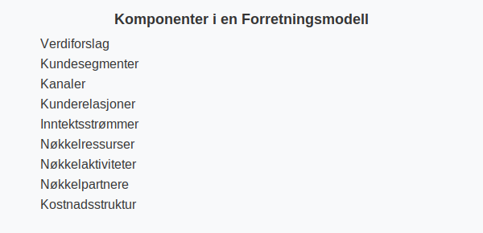

---
title: "Hva er forretningsmodell?"
seoTitle: "Hva er forretningsmodell?"
description: 'En **forretningsmodell** beskriver hvordan en virksomhet **skaper, leverer og fanger verdi**. En grundig forretningsmodell gir et solid grunnlag for strategisk ...'
---

En **forretningsmodell** beskriver hvordan en virksomhet **skaper, leverer og fanger verdi**. En grundig forretningsmodell gir et solid grunnlag for strategisk planlegging, forretningsplanlegging og regnskapsføring.

En robust forretningsmodell legger også grunnlaget for **innovasjon**; se vår artikkel om [Innovasjon](/blogs/regnskap/innovasjon "Innovasjon i Regnskap: En Komplett Guide til Innovasjon i Regnskap og Utviklingskostnader").

## Seksjon 1: Hvorfor er forretningsmodell viktig?

Å ha en tydelig **forretningsmodell** hjelper deg å:

* Forstå kundeforventninger og markedsbehov
* Identifisere lønnsomme inntektsstrømmer og kostnadsdrivere
* Legge til rette for effektiv ressursallokering
* Bygge et robust beslutningsgrunnlag for regnskap og budsjetter

## Seksjon 2: Kjernekomponenter i en forretningsmodell

En forretningsmodell består vanligvis av følgende hovedkomponenter:

| Komponent              | Beskrivelse                                                       |
|------------------------|-------------------------------------------------------------------|
| Verdiforslag           | Hva virksomheten tilbyr kundene og hvilken verdi den skaper       |
| Kundesegmenter         | Hvilke kundegrupper virksomheten retter seg mot                   |
| Kanaler                | Hvordan virksomheten leverer verdi til kundene                    |
| Kunderelasjoner        | Hvordan virksomheten etablerer og opprettholder kundeforhold      |
| Inntektsstrømmer       | Hvordan virksomheten tjener penger                                |
| Nøkkelressurser        | Viktige eiendeler som kreves for å levere verdiforslaget          |
| Nøkkelaktiviteter      | Viktigste aktiviteter som kreves for å levere verdiforslaget      |
| Nøkkelpartnere         | Partnere og leverandører som støtter virksomhetens drift          |
| Kostnadsstruktur       | Oversikt over de viktigste kostnadselementene                     |

## Seksjon 3: Forretningsmodellens rolle i regnskap

I regnskapssammenheng kan en god forretningsmodell bidra til å:

| Fordel                    | Forklaring                                       |
|---------------------------|---------------------------------------------------|
| Klare forutsetninger      | Gir grunnlag for budsjetter og prognoser          |
| Risikoidentifisering      | Hjelper med å identifisere økonomiske usikkerheter|
| Ressursallokering         | Bedre styring av investeringer og kostnader       |
| Inntekts- og kostnadskontroll | Støtter føringer for regnskapsføringen         |

## Seksjon 4: Fra forretningsidé til forretningsmodell og forretningsplan

En vellykket utvikling av virksomheten følger ofte disse trinnene:

1. **Definer en klar [forretningsidé](/blogs/regnskap/forretningside "Hva er forretningsidé? Komplett Guide til Utvikling og Evaluering av Forretningsidéer")**
2. **Utform en robust [forretningsmodell](/blogs/regnskap/hva-er-forretningsmodell "Hva er forretningsmodell? Komplett guide til utforming og evaluering av forretningsmodell for regnskap og virksomhetsstyring")**
3. **Utarbeid en detaljert [forretningsplan](/blogs/regnskap/hva-er-forretningsplan "Hva er forretningsplan? Komplett Guide til Forretningsplanlegging og Regnskapsoppfølging")**
4. **Implementer og følg opp gjennom [regnskap](/blogs/regnskap/hva-er-regnskap "Hva er Regnskap? En Dybdeanalyse for Norge")**

Ved å følge disse stegene sikrer du en helhetlig tilnærming der forretningsmodell, planlegging og regnskapsføring henger sammen.

## Seksjon 5: Oppsummering

En **forretningsmodell** er et kraftig verktøy for å forstå og styre hvordan virksomheten skaper verdi og hvordan dette reflekteres i regnskapet. Ved å definere kjernekomponentene og kontinuerlig evaluere modellen, legger du grunnlaget for bærekraftig vekst og solid økonomistyring.

