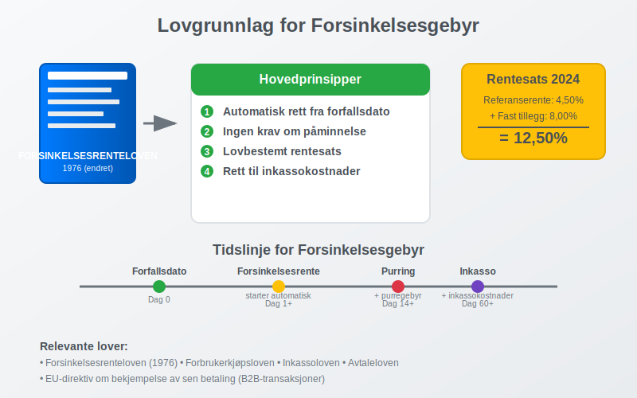
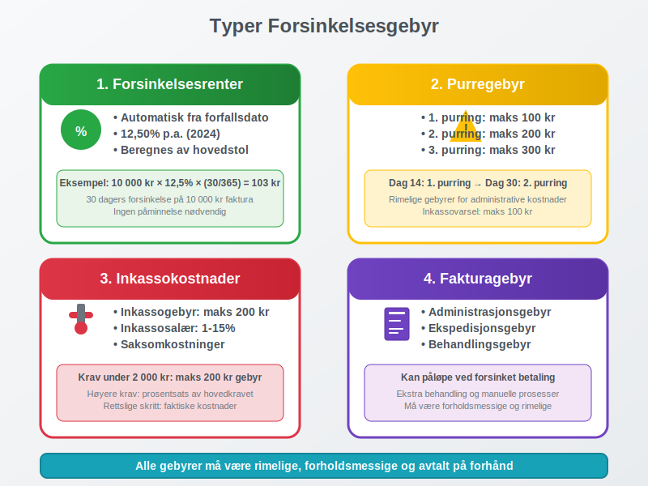
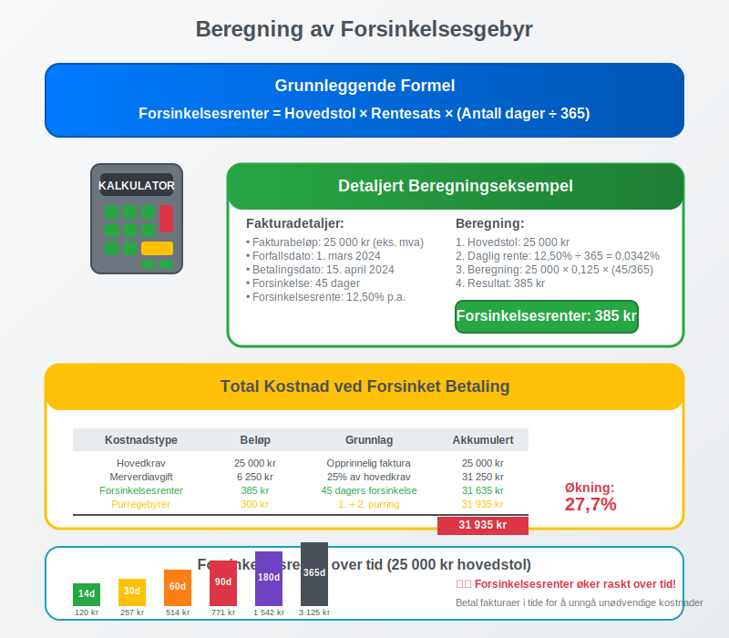
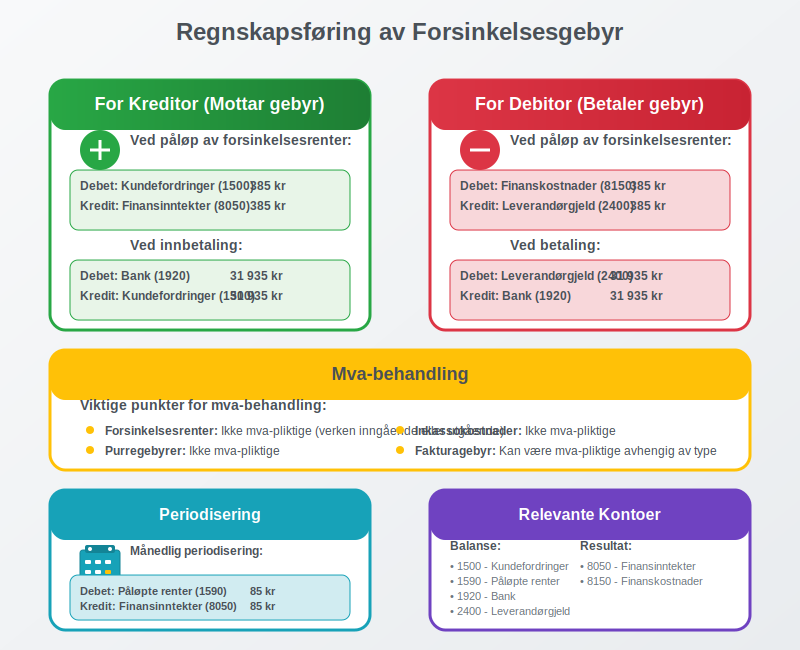
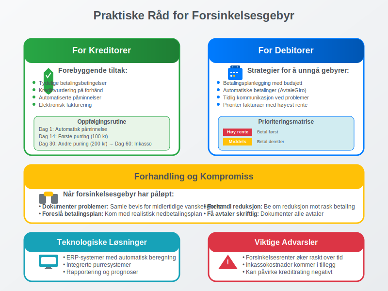
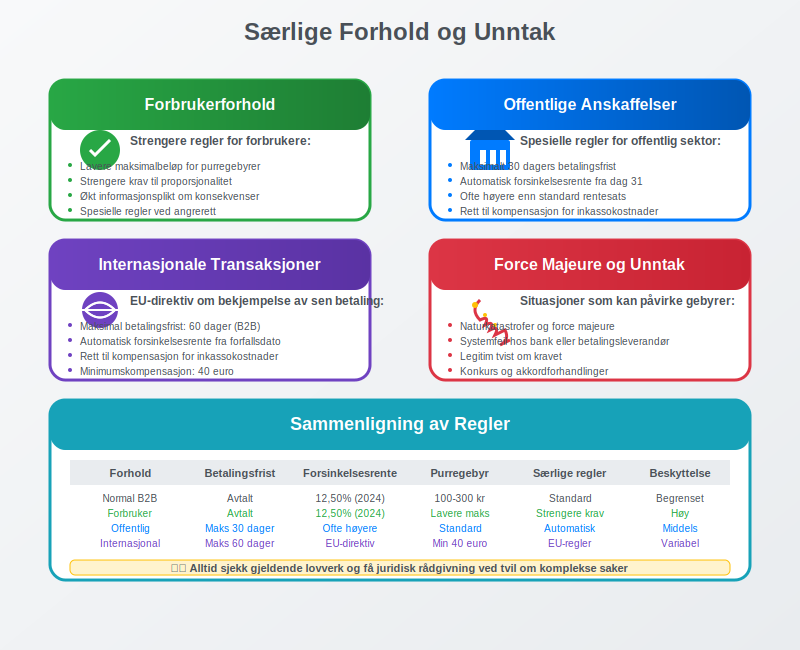
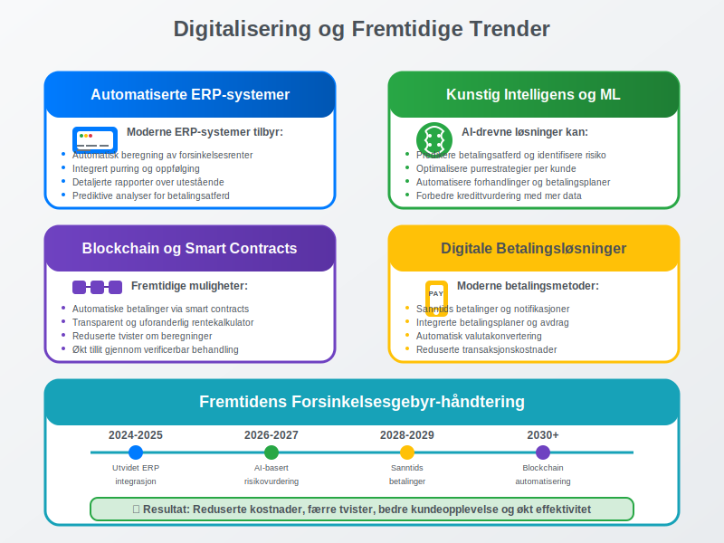

---
title: "Hva er forsinkelsesgebyr?"
meta_title: "Hva er forsinkelsesgebyr?"
meta_description: '**Forsinkelsesgebyr** er en kompensasjon som en kreditor kan kreve når en debitor ikke betaler sin gjeld innen avtalt forfallsdato. Dette gebyret, også kjent ...'
slug: hva-er-forsinkelsesgebyr
type: blog
layout: pages/single
---

**Forsinkelsesgebyr** er en kompensasjon som en kreditor kan kreve når en debitor ikke betaler sin gjeld innen avtalt forfallsdato. Dette gebyret, også kjent som **morarenter** eller **forsinkelsesrenter**, skal kompensere for den økonomiske belastningen og risikoen som oppstår ved forsinket betaling.

Forsinkelsesgebyr er et viktig verktøy i norsk forretningsliv for å sikre at [fakturaer](/blogs/regnskap/hva-er-en-faktura "Hva er en Faktura? En Guide til Norske Fakturakrav") betales i tide og for å beskytte bedrifters [likviditet](/blogs/regnskap/hva-er-betalingsevne "Hva er Betalingsevne? Komplett Guide til Likviditetsanalyse") og [arbeidskapital](/blogs/regnskap/hva-er-arbeidskapital "Hva er Arbeidskapital? Komplett Guide til Driftskapital").

## Lovgrunnlag for Forsinkelsesgebyr

I Norge er forsinkelsesgebyr regulert av **forsinkelsesrenteloven** og **forbrukerkjøpsloven**, som setter klare rammer for når og hvor mye som kan kreves.



### Hovedprinsipper i Forsinkelsesrenteloven

**Forsinkelsesrenteloven** fra 1976 (med senere endringer) regulerer retten til forsinkelsesrenter og etablerer følgende prinsipper:

* **Automatisk rett:** Kreditor har automatisk rett til forsinkelsesrenter fra forfallsdato
* **Ingen krav om påminnelse:** Retten inntrer uten at debitor må påminnes
* **Lovbestemt rentesats:** Rentesatsen fastsettes av myndighetene
* **Tilleggsgebyr:** Mulighet for å kreve rimelige inkassokostnader

### Gjeldende Rentesatser

Forsinkelsesrenten fastsettes halvårlig av **Finansdepartementet** og består av:

| Periode | Referanserente | Tillegg | Total forsinkelsesrente |
|---------|----------------|---------|------------------------|
| 1. halvår 2024 | 4,50% | 8,00% | **12,50%** |
| 2. halvår 2023 | 4,25% | 8,00% | **12,25%** |
| 1. halvår 2023 | 3,75% | 8,00% | **11,75%** |
| 2. halvår 2022 | 2,75% | 8,00% | **10,75%** |

**Beregningsgrunnlag:** Referanserenten er gjennomsnittlig foliorente i Norges Bank de siste 6 måneder, pluss et fast tillegg på 8 prosentpoeng.

## Typer Forsinkelsesgebyr

Det finnes flere typer gebyrer og kostnader som kan kreves ved forsinket betaling, hver med sine spesifikke regler.



### 1. Forsinkelsesrenter (Morarenter)

**[Forsinkelsesrenter](/blogs/regnskap/hva-er-forsinkelsesrente "Hva er Forsinkelsesrente? Komplett Guide til Morarenter og Beregning")** er den lovpålagte renten som løper fra forfallsdato til betaling skjer:

* **Beregningsgrunnlag:** Hovedstolen (ikke inkludert mva)
* **Rentesats:** Gjeldende forsinkelsesrente fastsatt av myndighetene
* **Løpetid:** Fra forfallsdato til full betaling
* **Automatisk rett:** Ingen påminnelse nødvendig

For en omfattende gjennomgang av lovgrunnlag, beregningsmetoder og praktisk håndtering av forsinkelsesrente, se vår detaljerte guide til [forsinkelsesrente](/blogs/regnskap/hva-er-forsinkelsesrente "Hva er Forsinkelsesrente? Komplett Guide til Morarenter og Beregning").

**Eksempel på beregning:**
- Fakturabeløp: 10 000 kr (eks. mva)
- Forsinkelse: 30 dager
- Forsinkelsesrente: 12,50% p.a.
- Forsinkelsesrenter: 10 000 × 0,125 × (30/365) = **103 kr**

### 2. Purregebyr

I tillegg til forsinkelsesrenter kan kreditor kreve rimelige [purregebyrer](/blogs/regnskap/hva-er-betalingsoppfordring "Betalingsoppfordring - Komplett Guide til Purring og Inkasso i Norge"):

* **Første purring:** Maksimalt 100 kr
* **Andre purring:** Maksimalt 200 kr
* **Tredje purring:** Maksimalt 300 kr
* **Inkassovarsel:** Maksimalt 100 kr

### 3. Inkassokostnader

Ved overgang til inkasso kan følgende kostnader kreves:

* **Inkassogebyr:** Maksimalt 200 kr for krav under 2 000 kr
* **Inkassosalær:** Prosentsats av hovedkravet (1-15% avhengig av beløp)
* **Saksomkostninger:** Faktiske kostnader ved rettslige skritt

### 4. Fakturagebyr

Mange bedrifter krever også [fakturagebyr](/blogs/regnskap/hva-er-fakturagebyr "Hva er Fakturagebyr? Komplett Guide til Faktureringsgebyrer i Norge") som kan påløpe ved forsinket betaling:

* **Administrasjonsgebyr:** For ekstra behandling
* **Ekspedisjonsgebyr:** For spesiell håndtering
* **Behandlingsgebyr:** For manuelle prosesser

## Beregning av Forsinkelsesgebyr

Korrekt beregning av forsinkelsesgebyr krever forståelse av både lovverket og praktiske beregningsmetoder.



### Grunnleggende Beregningsformel

**Forsinkelsesrenter = Hovedstol × Rentesats × (Antall dager / 365)**

### Detaljert Beregningseksempel

La oss se på et komplett eksempel:

**Fakturadetaljer:**
* Fakturabeløp: 25 000 kr (eks. mva)
* Forfallsdato: 1. mars 2024
* Betalingsdato: 15. april 2024
* Forsinkelse: 45 dager
* Gjeldende forsinkelsesrente: 12,50%

**Beregning:**
1. **Hovedstol:** 25 000 kr (mva beregnes ikke forsinkelsesrenter av)
2. **Daglig rente:** 12,50% ÷ 365 = 0,0342%
3. **Forsinkelsesrenter:** 25 000 × 0,125 × (45/365) = **385 kr**

### Sammensatt Beregning med Tilleggsgebyrer

**Total kostnad ved forsinket betaling:**

| Kostnadstype | Beløp | Grunnlag |
|--------------|-------|----------|
| Hovedkrav | 25 000 kr | Opprinnelig faktura |
| Merverdiavgift | 6 250 kr | 25% av hovedkrav |
| Forsinkelsesrenter | 385 kr | 45 dagers forsinkelse |
| Første purring | 100 kr | Lovlig purregebyr |
| Andre purring | 200 kr | Lovlig purregebyr |
| **Total kostnad** | **31 935 kr** | **Økning: 27,7%** |

### Beregning for Ulike Tidsperioder

| Forsinkelse | Forsinkelsesrenter (25 000 kr) | Akkumulert kostnad |
|-------------|--------------------------------|-------------------|
| 14 dager | 120 kr | 25 120 kr |
| 30 dager | 257 kr | 25 257 kr |
| 60 dager | 514 kr | 25 514 kr |
| 90 dager | 771 kr | 25 771 kr |
| 180 dager | 1 542 kr | 26 542 kr |
| 365 dager | 3 125 kr | 28 125 kr |

## Regnskapsføring av Forsinkelsesgebyr

Korrekt [regnskapsføring](/blogs/regnskap/hva-er-bokforing "Hva er Bokføring? Komplett Guide til Regnskapsføring i Norge") av forsinkelsesgebyr er viktig for både kreditor og debitor.



### For Kreditor (Den som Mottar Forsinkelsesgebyr)

**Ved påløp av forsinkelsesrenter:**

```
Debet: Kundefordringer (1500)          385 kr
Kredit: Finansinntekter (8050)          385 kr
```

**Ved innbetaling:**

```
Debet: Bank (1920)                    31 935 kr
Kredit: Kundefordringer (1500)        31 935 kr
```

### For Debitor (Den som Betaler Forsinkelsesgebyr)

**Ved påløp av forsinkelsesrenter:**

```
Debet: Finanskostnader (8150)          385 kr
Kredit: Leverandørgjeld (2400)          385 kr
```

**Ved betaling:**

```
Debet: Leverandørgjeld (2400)         31 935 kr
Kredit: Bank (1920)                   31 935 kr
```

### Mva-behandling

**Viktige punkter for mva-behandling:**

* **Forsinkelsesrenter:** Ikke mva-pliktige (verken inngående eller utgående)
* **Purregebyrer:** Ikke mva-pliktige
* **Inkassokostnader:** Ikke mva-pliktige
* **Fakturagebyr:** Kan være mva-pliktige avhengig av type

### Periodisering og Estimering

For større forsinkelsesbeløp kan det være nødvendig med periodisering:

**MÃ¥nedlig periodisering av forsinkelsesrenter:**

```
Debet: Påløpte renter (1590)           85 kr
Kredit: Finansinntekter (8050)         85 kr
```

## Praktiske RÃ¥d for Bedrifter

Effektiv håndtering av forsinkelsesgebyr krever gode rutiner og systemer.



### For Kreditorer

**Forebyggende tiltak:**

* **Tydelige betalingsbetingelser:** Spesifiser forfallsdato og konsekvenser
* **Kredittvurdering:** Vurder kunders [betalingsevne](/blogs/regnskap/hva-er-betalingsevne "Hva er Betalingsevne? Komplett Guide til Likviditetsanalyse") på forhånd
* **Automatiserte påminnelser:** Sett opp systemer for automatisk purring
* **Elektronisk fakturering:** Bruk [eFaktura](/blogs/regnskap/hva-er-efaktura "Hva er eFaktura? Komplett Guide til Elektronisk Fakturering i Norge") for raskere behandling

**Oppfølgingsrutiner:**

1. **Dag 1 etter forfall:** Automatisk påminnelse
2. **Dag 14:** Første formelle purring med gebyr
3. **Dag 30:** Andre purring med økt gebyr
4. **Dag 45:** Inkassovarsel
5. **Dag 60:** Overføring til inkasso

### For Debitorer

**Strategier for å unngå forsinkelsesgebyr:**

* **Betalingsplanlegging:** Bruk [budsjett](/blogs/regnskap/hva-er-budsjettering "Hva er Budsjettering? Komplett Guide til Bedriftsbudsjett") for å planlegge betalinger
* **Automatiske betalinger:** Sett opp [AvtaleGiro](/blogs/regnskap/hva-er-avtalegiro "Hva er AvtaleGiro? Komplett Guide til Automatisk Betaling") der mulig
* **Tidlig kommunikasjon:** Kontakt kreditor ved betalingsproblemer
* **Prioritering:** Betal fakturaer med høyest forsinkelsesrente først

### Forhandling og Kompromiss

**Når forsinkelsesgebyr har påløpt:**

* **Dokumenter betalingsproblemer:** Samle bevis for midlertidige vanskeligheter
* **Foreslå betalingsplan:** Kom med realistisk nedbetalingsplan
* **Forhandl om reduksjon:** Be om reduksjon av gebyrer mot rask betaling
* **FÃ¥ avtaler skriftlig:** Dokumenter alle avtaler om betalingsutsettelse

## Særlige Forhold og Unntak

Det finnes flere særlige forhold som kan påvirke retten til forsinkelsesgebyr.



### Forbrukerforhold

**Strengere regler for forbrukere:**

* **Maksimalbeløp:** Lavere maksimalbeløp for purregebyrer
* **Rimelighetsvurdering:** Strengere krav til proporsjonalitet
* **Informasjonsplikt:** Økt krav til informasjon om konsekvenser
* **Angrerett:** Spesielle regler ved angrerett og reklamasjon

### Offentlige Anskaffelser

**Spesielle regler for offentlig sektor:**

* **Betalingsfrist:** Maksimalt 30 dagers betalingsfrist
* **Automatisk forsinkelsesrente:** Fra dag 31 uten påminnelse
* **Høyere rentesats:** Ofte høyere enn standard forsinkelsesrente
* **Kompensasjonsrett:** Rett til kompensasjon for inkassokostnader

### Internasjonale Transaksjoner

**EU-direktiv om bekjempelse av sen betaling:**

* **Maksimal betalingsfrist:** 60 dager for B2B-transaksjoner
* **Automatisk forsinkelsesrente:** Fra forfallsdato
* **Kompensasjonsrett:** Rett til kompensasjon for inkassokostnader
* **Minimumskompensasjon:** Fast beløp på 40 euro

### Force Majeure og Unntakstilfeller

**Situasjoner som kan påvirke forsinkelsesgebyr:**

* **Naturkatastrofer:** Kan gi grunnlag for utsettelse
* **Systemfeil:** Tekniske problemer hos bank eller betalingsleverandør
* **Tvistetilfeller:** NÃ¥r det er legitim tvist om kravet
* **Konkurs og akkord:** Spesielle regler ved insolvens

## Digitalisering og Fremtidige Trender

Teknologisk utvikling påvirker hvordan forsinkelsesgebyr håndteres og beregnes.



### Automatiserte Systemer

**Moderne ERP-systemer tilbyr:**

* **Automatisk beregning:** Kontinuerlig oppdatering av forsinkelsesrenter
* **Integrert purring:** Automatiske påminnelser og oppfølging
* **Rapportering:** Detaljerte rapporter over utestående fordringer
* **Prognoser:** Prediktive analyser for betalingsatferd

### Kunstig Intelligens og Maskinlæring

**AI-drevne løsninger kan:**

* **Predikere betalingsatferd:** Identifisere risikokunder tidlig
* **Optimalisere purrestrategier:** Tilpasse oppfølging til kundetyper
* **Automatisere forhandlinger:** Foreslå betalingsplaner automatisk
* **Forbedre kredittvurdering:** Mer nøyaktige risikovurderinger

### Blockchain og Smart Contracts

**Fremtidige muligheter:**

* **Automatiske betalinger:** Smart contracts som utløser betalinger
* **Transparent rentekalkulator:** Uforanderlige beregninger
* **Reduserte tvister:** Mindre rom for uenighet om beregninger
* **Økt tillit:** Transparent og verificerbar behandling

## Konklusjon

Forsinkelsesgebyr er et viktig verktøy for å sikre rettidig betaling og beskytte bedrifters [likviditet](/blogs/regnskap/hva-er-betalingsevne "Hva er Betalingsevne? Komplett Guide til Likviditetsanalyse"). Forståelse av lovverket, korrekt beregning og riktig [regnskapsføring](/blogs/regnskap/hva-er-bokforing "Hva er Bokføring? Komplett Guide til Regnskapsføring i Norge") er essensielt for både kreditorer og debitorer.

**Viktige takeaways:**

* **Automatisk rett:** Forsinkelsesrenter påløper automatisk fra forfallsdato
* **Lovregulert:** Rentesatser fastsettes av myndighetene og oppdateres halvårlig
* **Kumulativ effekt:** Forsinkelsesgebyrer kan raskt øke den totale kostnaden betydelig
* **Forebygging:** Gode rutiner og systemer kan minimere både risiko og kostnader

Ved å implementere effektive systemer for [fakturabehandling](/blogs/regnskap/hva-er-en-faktura "Hva er en Faktura? En Guide til Norske Fakturakrav"), automatiserte påminnelser og tydelige betalingsbetingelser, kan bedrifter redusere både risikoen for forsinkede betalinger og de administrative kostnadene ved oppfølging.

For debitorer er det viktig å prioritere rettidig betaling og kommunisere proaktivt ved eventuelle betalingsproblemer. Dette kan ofte føre til mer fleksible løsninger og reduserte kostnader sammenlignet med å la forsinkelsesgebyrer påløpe ukontrollert.
