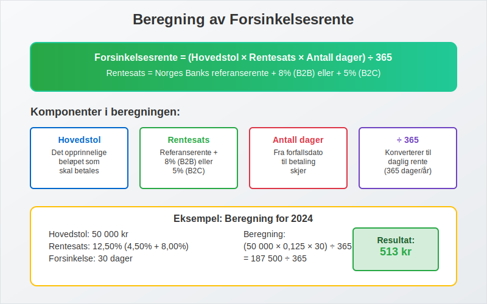

**Forsinkelsesrente**, også kjent som **[morarente](/blogs/regnskap/hva-er-morarente "Hva er Morarente? Komplett Guide til Lovpålagt Forsinkelsesrente i Norge")**, er en lovpålagt rente som påløper når en betaling ikke skjer innen avtalt forfallsdato. Dette er en viktig del av norsk kontraktsrett og regnskapsføring som beskytter kreditorer mot økonomiske tap ved forsinket betaling. Forsinkelsesrente gjelder for alle typer pengefordringer, inkludert [fakturaer](/blogs/regnskap/hva-er-en-faktura "Hva er en Faktura? En Guide til Norske Fakturakrav"), lån og andre betalingsforpliktelser.


## Seksjon 1: Lovgrunnlag og Regulering

Forsinkelsesrente er regulert i **forsinkelsesrenteloven** av 1976, som fastslår at rente skal betales fra forfallsdato uten at kreditor trenger å sende påkrav. Dette gjør forsinkelsesrente til en automatisk rettighet som ikke krever særskilt avtale mellom partene.

### Hovedprinsipper i Forsinkelsesrenteloven

* **Automatisk påløp:** Renten påløper automatisk fra forfallsdato
* **Ingen krav om påminnelse:** Kreditor trenger ikke sende [betalingsoppfordring](/blogs/regnskap/hva-er-betalingsoppfordring "Betalingsoppfordring - Komplett Guide til Purring og Inkasso i Norge") for at renten skal påløpe
* **Gjelder alle pengefordringer:** Omfatter både kommersielle og private transaksjoner
* **Kan ikke fravikes til skade for debitor:** Avtaler som gir lavere rente enn lovens minimum er ugyldige

## Seksjon 2: Beregning av Forsinkelsesrente

Forsinkelsesrenten beregnes basert på **Norges Banks [referanserente](/blogs/regnskap/normrente "Hva er Normrente? En Guide til Normrente og Referanserente")** pluss et lovfastsatt tillegg. Satsen justeres to ganger årlig - 1. januar og 1. juli.



### Gjeldende Satser (2024)

| Periode | Referanserente | Tillegg | Total Forsinkelsesrente |
|---------|----------------|---------|-------------------------|
| Jan-Jun 2024 | 4,50% | 8,00% | **12,50%** |
| Jul-Des 2024 | 4,50% | 8,00% | **12,50%** |

### Beregningsformel

```
Forsinkelsesrente = (Hovedstol × Rentesats × Antall dager) ÷ 365
```

**Eksempel på beregning:**
* Hovedstol: 50 000 kr
* Forsinkelse: 30 dager
* Rentesats: 12,50%
* Forsinkelsesrente: (50 000 × 0,125 × 30) ÷ 365 = **513 kr**

## Seksjon 3: Når Påløper Forsinkelsesrente?

Forsinkelsesrente påløper fra **forfallsdato** og frem til betalingen faktisk skjer. Det er viktig å forstå når forfallsdato inntreffer for ulike typer fordringer.

### Forfallsdato for Fakturaer

For [kommersielle fakturaer](/blogs/regnskap/hva-er-en-faktura "Hva er en Faktura? En Guide til Norske Fakturakrav") gjelder følgende regler:

* **Avtalt betalingsfrist:** Når dette er spesifisert på fakturaen
* **30 dager fra mottak:** Standard forfallstid hvis ikke annet er avtalt
* **Umiddelbar betaling:** For kontantsalg og enkelte tjenester


### Spesielle Situasjoner

* **Lønn:** Forfaller siste arbeidsdag i måneden
* **Husleie:** Vanligvis forskuddsbetaling (1. i måneden)
* **Leverandørfakturaer:** I henhold til [betalingsbetingelser](/blogs/regnskap/hva-er-betalingsmidler "Hva er Betalingsmidler? Tvungne, Elektroniske og Tradisjonelle Metoder")

## Seksjon 4: Regnskapsføring av Forsinkelsesrente

Forsinkelsesrente må behandles korrekt i regnskapet både for kreditor og debitor. Dette påvirker [driftsinntekter](/blogs/regnskap/hva-er-driftsinntekter "Hva er Driftsinntekter? Komplett Guide til Inntektsføring og Regnskapsregler") og [driftskostnader](/blogs/regnskap/hva-er-driftskostnader "Hva er Driftskostnader? Komplett Guide til Kostnadsføring og Regnskapsregler").

### For Kreditor (Den som Mottar Rente)

**Kontering av forsinkelsesrente som inntekt:**

| Konto | Beskrivelse | Debet | Kredit |
|-------|-------------|-------|--------|
| 1500 | Kundefordringer | X |  |
| 8050 | Renteinntekter |  | X |

### For Debitor (Den som Betaler Rente)

**Kontering av forsinkelsesrente som kostnad:**

| Konto | Beskrivelse | Debet | Kredit |
|-------|-------------|-------|--------|
| 8150 | Rentekostnader | X |  |
| 1920 | Leverandørgjeld |  | X |

### MVA-behandling

**Viktig:** Forsinkelsesrente er **ikke** gjenstand for [merverdiavgift](/blogs/regnskap/hva-er-avgiftsplikt-mva "Hva er Avgiftsplikt (MVA)? Komplett Guide til Merverdiavgift i Norge"), verken for kreditor eller debitor.

## Seksjon 5: Praktisk Håndtering av Forsinkelsesrente

Effektiv håndtering av forsinkelsesrente krever systematiske rutiner og god [debitoroppfølging](/blogs/regnskap/hva-er-debitor "Hva er Debitor? Komplett Guide til Kundefordringer og Debitorhåndtering").

### Rutiner for Kreditorer

1. **Automatisk beregning:** Implementer systemer som automatisk beregner påløpt rente
2. **Regelmessig fakturering:** Send rentekrav månedlig eller kvartalsvis
3. **Dokumentasjon:** Oppretthold god dokumentasjon av alle rentekrav
4. **Oppfølging:** Kombiner rentekrav med [betalingspåminnelser](/blogs/regnskap/hva-er-betalingspamminelse "Hva er Betalingspåminnelse? Komplett Guide til Purring og Inkasso")

### Rutiner for Debitorer

* **Overvåk forfallsdatoer:** Bruk [AvtaleGiro](/blogs/regnskap/hva-er-avtalegiro "Hva er AvtaleGiro? Komplett Guide til Automatisk Betaling") for automatisk betaling
* **Prioriter betalinger:** Betal fakturaer med høyest rentesats først
* **Kommuniser proaktivt:** Kontakt kreditor ved betalingsproblemer
* **Budsjetter rentekostnader:** Inkluder potensielle rentekostnader i [budsjettering](/blogs/regnskap/hva-er-budsjettering "Hva er Budsjettering? Komplett Guide til Budsjettplanlegging og Økonomistyring")

## Seksjon 6: Forsinkelsesrente vs. Andre Gebyrer

Det er viktig å skille mellom forsinkelsesrente og andre typer gebyrer som kan påløpe ved forsinket betaling.

### Sammenligning av Kostnader ved Forsinket Betaling

| Type Kostnad | Lovgrunnlag | Beregning | Maksimum |
|--------------|-------------|-----------|----------|
| **Forsinkelsesrente** | Forsinkelsesrenteloven | [Referanserente](/blogs/regnskap/normrente "Hva er Normrente? En Guide til Normrente og Referanserente") + 8% | Ingen |
| **[Fakturagebyr](/blogs/regnskap/hva-er-fakturagebyr "Hva er Fakturagebyr? Komplett Guide til Faktureringsgebyrer i Norge")** | Avtalefrihet | Faktiske kostnader | Rimelig forhold |
| **Purregebyr** | Inkassoloven | Fastsatte satser | Kr 100-200 |
| **Inkassosalær** | Inkassoloven | Prosent av hovedstol | 15-20% |

### Kumulativ Effekt

Alle disse kostnadene kan påløpe **samtidig**, noe som gjør forsinket betaling svært kostbart:

* **Måned 1:** Forsinkelsesrente påløper
* **Måned 2:** Purregebyr + fortsatt rente
* **Måned 3:** Inkassosalær + fortsatt rente
* **Måned 4+:** Alle kostnader fortsetter å påløpe

## Seksjon 7: Særlige Regler for Forbrukerkjøp

For **forbrukerkjøp** (B2C-transaksjoner) gjelder spesielle regler som beskytter forbrukere mot urimelige rentekostnader.

### Forbrukerkjøpsloven

* **Lavere rentesats:** [Referanserente](/blogs/regnskap/normrente "Hva er Normrente? En Guide til Normrente og Referanserente") + 5% (ikke 8%)
* **Krav om påminnelse:** Forsinkelsesrente påløper først etter skriftlig påminnelse
* **Rimelighetsvurdering:** Domstolene kan sette ned urimelige rentekrav

### Sammenligning B2B vs. B2C

| Aspekt | B2B (Næringsdrivende) | B2C (Forbruker) |
|--------|----------------------|-----------------|
| Rentesats | [Referanserente](/blogs/regnskap/normrente "Hva er Normrente? En Guide til Normrente og Referanserente") + 8% | [Referanserente](/blogs/regnskap/normrente "Hva er Normrente? En Guide til Normrente og Referanserente") + 5% |
| Påløp | Fra forfallsdato | Etter påminnelse |
| Beskyttelse | Begrenset | Utvidet |

## Seksjon 8: Internasjonale Aspekter

Ved handel med utenlandske parter må man være oppmerksom på at forsinkelsesrente-reglene kan variere betydelig mellom land.

### EU-direktiv om Forsinket Betaling

EU har et direktiv som harmoniserer reglene for forsinkelsesrente i kommersielle transaksjoner:

* **Minimum rentesats:** ECB-rente + 8%
* **Automatisk påløp:** Fra forfallsdato
* **Kompensasjon:** Rett til kompensasjon for innkrevingskostnader

### Praktiske Råd for Internasjonal Handel

1. **Spesifiser lovvalg:** Avtal hvilke lands regler som skal gjelde
2. **Klargjør betalingsbetingelser:** Vær eksplisitt om forfallsdato og rente
3. **Vurder valutarisiko:** Forsinkelsesrente i fremmed valuta kan påvirke [valutarisiko](/blogs/regnskap/hva-er-finansiering "Hva er Finansiering? Komplett Guide til Finansieringsformer og Kapitalstruktur")

## Seksjon 9: Digitale Løsninger og Automatisering

Moderne teknologi gjør det enklere å håndtere forsinkelsesrente automatisk og effektivt.

### ERP-systemer og Automatisering

Moderne [ERP-systemer](/blogs/regnskap/hva-er-erp-system "Hva er ERP-system? Komplett Guide til Enterprise Resource Planning") kan automatisere hele prosessen:

* **Automatisk beregning:** Daglig oppdatering av påløpt rente
* **Automatisk fakturering:** Månedlige rentekrav sendes automatisk
* **Integrasjon med regnskap:** Automatisk [bilagsføring](/blogs/regnskap/hva-er-bilagsforing "Hva er Bilagsføring? Komplett Guide til Regnskapsbilag og Dokumentasjon")
* **Rapportering:** Oversikt over totale renteinntekter/-kostnader

### Elektronisk Fakturering og Oppfølging

[Elektronisk fakturering](/blogs/regnskap/hva-er-elektronisk-fakturering "Hva er Elektronisk Fakturering? Komplett Guide til Digitale Fakturaløsninger") kan redusere forsinkelser:

* **Raskere levering:** [eFaktura](/blogs/regnskap/hva-er-efaktura "Hva er eFaktura? Komplett Guide til Elektronisk Fakturering i Norge") når mottaker umiddelbart
* **Automatiske påminnelser:** Systemet sender påminnelser automatisk
* **Bedre sporbarhet:** Full oversikt over fakturaens status

## Seksjon 10: Skattemessige Konsekvenser

Forsinkelsesrente har viktige skattemessige konsekvenser som må håndteres korrekt.

### For Kreditor (Mottaker av Rente)

* **Skattepliktig inntekt:** Forsinkelsesrente er fullt skattepliktig
* **Periodisering:** Renten skal inntektsføres når den påløper
* **Dokumentasjon:** Krav om god dokumentasjon for skattemyndighetene

### For Debitor (Betaler av Rente)

* **Fradragsberettiget:** Forsinkelsesrente er normalt fradragsberettiget
* **Periodisering:** Kostnaden skal kostnadsføres når den påløper
* **Begrensninger:** Enkelte begrensninger for private gjeldsforhold

### Regnskapsføring og Skatt

Det er viktig at regnskapsføringen samsvarer med skattemessig behandling for å unngå problemer ved [skatterevisjoner](/blogs/regnskap/hva-er-arbeidspapirer-revisjon "Hva er Arbeidspapirer (Revisjon)? Komplett Guide til Revisjonsdokumentasjon").

## Seksjon 11: Juridiske Aspekter og Tvister

Forsinkelsesrente kan bli gjenstand for juridiske tvister, særlig når det gjelder beregning og rimelighetsvurderinger.

### Vanlige Tvisteområder

* **Forfallsdato:** Uenighet om når betalingsfristen utløp
* **Beregningsgrunnlag:** Hvilke beløp som skal forrentes
* **Avbrudd i renteløpet:** Om betalinger eller avtaler avbryter renteløpet
* **Rimelighetsvurdering:** Om rentekravet er urimelig høyt

### Forebygging av Tvister

1. **Klare avtaler:** Spesifiser betalingsbetingelser tydelig
2. **God dokumentasjon:** Oppretthold komplett dokumentasjon
3. **Proaktiv kommunikasjon:** Kommuniser tidlig ved betalingsproblemer
4. **Profesjonell håndtering:** Bruk etablerte rutiner for oppfølging

## Seksjon 12: Sammenheng med Øvrig Regnskapsføring

Forsinkelsesrente påvirker flere områder av regnskapsføringen og må ses i sammenheng med øvrig [finansregnskap](/blogs/regnskap/hva-er-finansregnskap "Hva er Finansregnskap? Komplett Guide til Eksternregnskap og Årsregnskap").

### Påvirkning på Nøkkeltall

Forsinkelsesrente påvirker viktige regnskapstall:

* **[Driftsresultat](/blogs/regnskap/hva-er-driftsresultat "Hva er Driftsresultat? Beregning, Analyse og Betydning for Bedriften"):** Renteinntekter/-kostnader påvirker resultatet
* **[Arbeidskapital](/blogs/regnskap/hva-er-arbeidskapital "Hva er Arbeidskapital? Beregning, Analyse og Optimalisering"):** Påløpt rente øker fordringer/gjeld
* **[Likviditet](/blogs/regnskap/hva-er-betalingsevne "Hva er Betalingsevne? Analyse av Likviditet og Finansiell Stabilitet"):** Rentekostnader reduserer tilgjengelig likviditet

### Integrasjon med Debitorhåndtering

Forsinkelsesrente er en integrert del av [debitorhåndtering](/blogs/regnskap/hva-er-debitor "Hva er Debitor? Komplett Guide til Kundefordringer og Debitorhåndtering") og påvirker:

* **Kredittvurdering:** Kunders betalingshistorikk inkludert rentekostnader
* **Risikostyring:** Vurdering av kredittrisiko og [tap på fordringer](/blogs/regnskap/hva-er-avskrivning "Hva er Avskrivning? Komplett Guide til Avskrivningsmetoder og Regnskapsregler")
* **Kundeoppfølging:** Systematisk oppfølging av forfalte fordringer

Effektiv håndtering av forsinkelsesrente krever derfor en helhetlig tilnærming som integrerer juridiske, regnskapsmessige og praktiske aspekter. Ved å implementere gode rutiner og bruke moderne teknologi kan bedrifter minimere både kostnader og administrative byrder knyttet til forsinket betaling.


