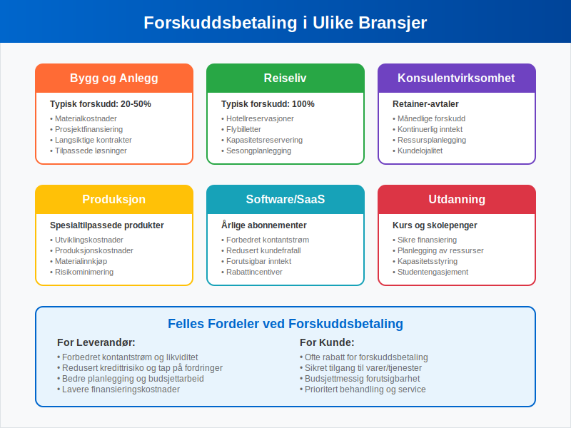
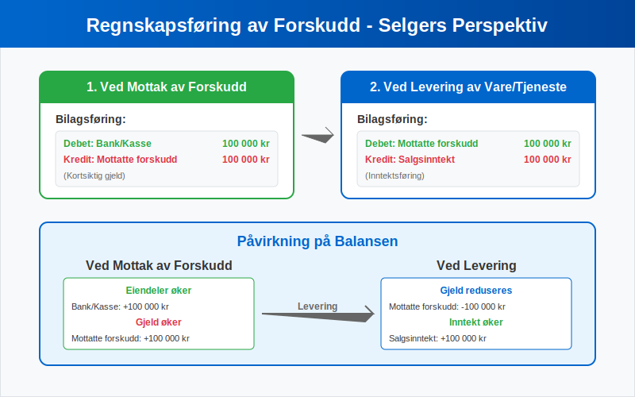
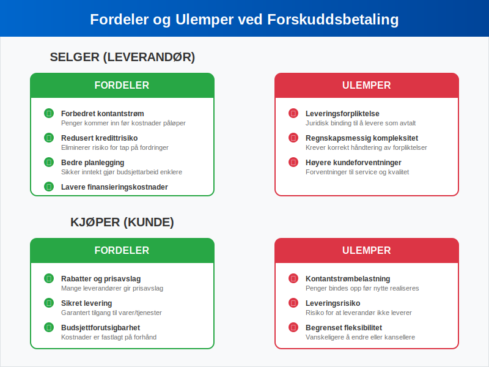

---
title: "Hva er forskuddsbetaling?"
meta_title: "Hva er forskuddsbetaling?"
meta_description: '**Forskuddsbetaling** er en betaling som gjøres på forhånd for varer eller tjenester som skal leveres på et senere tidspunkt. Dette er en vanlig praksis i m...'
slug: hva-er-forskuddsbetaling
type: blog
layout: pages/single
---

**Forskuddsbetaling** er en betaling som gjøres på forhånd for varer eller tjenester som skal leveres på et senere tidspunkt. Dette er en vanlig praksis i mange bransjer og representerer en viktig del av moderne forretningsdrift. Forskuddsbetalinger skaper både muligheter og utfordringer for både kjøper og selger, og krever korrekt håndtering i [regnskapet](/blogs/regnskap/hva-er-regnskap "Hva er Regnskap? Komplett Guide til Regnskapsføring i Norge").

For en oversikt over hvordan denne transaksjonen behandles i Norsk Standard Kontoplan, se [Konto 1480 - Forskuddsbetaling til leverandører](/blogs/kontoplan/1480-forskuddsbetaling-til-leverandorer "Konto 1480 - Forskuddsbetaling til leverandører: Regnskapsføring av forskuddsbetalinger til leverandører").

I motsetning til vanlige [fakturaer](/blogs/regnskap/hva-er-en-faktura "Hva er en Faktura? En Guide til Norske Fakturakrav") hvor betaling skjer etter levering, innebærer forskuddsbetaling at kunden betaler før varen eller tjenesten er mottatt. Dette skaper en særegen regnskapsmessig situasjon som må håndteres korrekt for å oppfylle [bokføringsloven](/blogs/regnskap/hva-er-bokforingsloven "Hva er Bokføringsloven? Komplett Guide til Norsk Bokføringslovgivning").

## Seksjon 1: Definisjon og Grunnleggende Prinsipper

Forskuddsbetaling, også kalt **forhåndsbetaling** eller **prepayment**, er en transaksjon hvor kjøper betaler selger før levering av varer eller tjenester. Dette skiller seg fundamentalt fra tradisjonell [fakturasalg](/blogs/regnskap/hva-er-fakturasalg "Hva er Fakturasalg? Komplett Guide til Kredittgivning og Debitorhåndtering") hvor betaling skjer etter levering.

### Hovedkarakteristikker ved Forskuddsbetaling

* **Timing:** Betaling før levering
* **Risiko:** Kjøper bærer leveringsrisiko
* **Kontantstrøm:** Forbedrer selgers likviditet
* **Forpliktelse:** Skaper leveringsforpliktelse for selger

Forskuddsbetalinger kan være **fullstendige** (hele beløpet betales på forhånd) eller **delvise** (en del av totalbeløpet betales som forskudd). En relatert, men distinkt betalingsform er [a-konto betaling](/blogs/regnskap/hva-er-a-konto-betaling "Hva er A-konto Betaling? En Enkel Forklaring"), som ofte brukes for løpende tjenester med variabelt forbruk.

## Seksjon 2: Forskuddsbetalinger i Ulike Bransjer

Forskuddsbetalinger brukes i mange ulike sammenhenger og bransjer. Tabellen nedenfor viser vanlige anvendelsesområder:

| Bransje | Typiske Forskuddsbetalinger | Begrunnelse |
|---------|----------------------------|-------------|
| **Bygg og anlegg** | 20-50% av kontraktsum | Dekke materialkostnader og sikre prosjektfinansiering |
| **Reiselivsbransjen** | Hotellopphold, flybilletter | Kapasitetsreservering og sesongplanlegging |
| **Konsulentvirksomhet** | MÃ¥nedlige retainer-avtaler | Sikre kontinuerlig inntekt og ressursplanlegging |
| **Produksjon** | Spesialtilpassede produkter | Dekke utviklings- og produksjonskostnader |
| **Software/SaaS** | Årlige abonnementer | Forbedre kontantstrøm og redusere kundefrafall |
| **Utdanning** | Kursavgifter og skolepenger | Sikre finansiering og planlegging |
| **Forsikring** | Forsikringspremie | Sikre forsikringsdekning over forsikringsperioden |

For mer om regnskapsmessig behandling av **forsikringspremie**, se [Forsikringspremie](/blogs/regnskap/forsikringspremie "Forsikringspremie i Norsk Regnskap: Guide til Klassifisering og Periodisering").

Se også [Konto 1700 - Forskuddsbetalte leier](/blogs/kontoplan/1700-forskuddsbetalte-leier "Konto 1700 - Forskuddsbetalte leier: Regnskapsføring av forhåndsbetalte leiekostnader") for mer om regnskapsmessig behandling av forskuddsbetalte leiekostnader.

### Spesielle Situasjoner

I enkelte bransjer er forskuddsbetalinger nærmest obligatoriske:

* **Tilpassede produkter:** NÃ¥r varer produseres spesielt for en kunde
* **Høye materialkostnader:** Prosjekter med betydelige forhåndsinvesteringer
* **Sesongbaserte tjenester:** Hoteller, ferieboliger og lignende
* **Langsiktige prosjekter:** Byggeprosjekter og konsulentoppdrag

## Seksjon 3: Regnskapsføring av Forskuddsbetalinger

Korrekt regnskapsføring av forskuddsbetalinger er kritisk for å opprettholde nøyaktige finansielle rapporter og overholde [bokføringsreglene](/blogs/regnskap/hva-er-bokforingsregler "Hva er Bokføringsregler? Komplett Guide til Norske Bokføringsstandarder").

### For Selger (Mottaker av Forskudd)

Når en bedrift mottar en forskuddsbetaling, skal denne **ikke** umiddelbart føres som inntekt. I stedet registreres den som en **forpliktelse** (gjeld) siden bedriften har en leveringsforpliktelse:

**Ved mottak av forskudd:**
* **Debet:** Bank/Kasse
* **Kredit:** Mottatte forskudd (kortsiktig gjeld)

**Ved levering av vare/tjeneste:**
* **Debet:** Mottatte forskudd
* **Kredit:** Salgsinntekt

### For Kjøper (Betaler av Forskudd)

Kjøper registrerer forskuddsbetalingen som en **fordring** eller **forskuddsbetalt kostnad**:

**Ved betaling av forskudd:**
* **Debet:** Forskuddsbetalte kostnader (omløpsmidler)
* **Kredit:** Bank/Kasse

**Ved mottak av vare/tjeneste:**
* **Debet:** Relevant kostnadskonto
* **Kredit:** Forskuddsbetalte kostnader

### Merverdiavgift (MVA) og Forskuddsbetalinger

Forskuddsbetalinger har spesielle MVA-regler som må følges nøye:

* **Utgående MVA** påløper først når varen/tjenesten leveres
* **Inngående MVA** kan trekkes fra først ved levering
* **Forskuddet alene** utløser ikke MVA-plikt

For detaljert informasjon om MVA-behandling, se vår guide til [avgiftsplikt MVA](/blogs/regnskap/hva-er-avgiftsplikt-mva "Hva er Avgiftsplikt (MVA)? Komplett Guide til Merverdiavgift i Norge").

## Seksjon 4: Fordeler og Ulemper

### Fordeler for Selger

**Forbedret kontantstrøm** er den største fordelen ved forskuddsbetalinger:

* **Økt likviditet:** Penger kommer inn før kostnader påløper
* **Redusert kredittrisiko:** Eliminerer risiko for tap på fordringer
* **Bedre planlegging:** Sikker inntekt gjør budsjettarbeid enklere
* **Lavere finansieringskostnader:** Mindre behov for [arbeidskapital](/blogs/regnskap/hva-er-arbeidskapital "Hva er Arbeidskapital? Beregning og Betydning for Bedriftens Drift")

### Fordeler for Kjøper

* **Rabatter:** Mange leverandører gir prisavslag for forskuddsbetaling
* **Sikret levering:** Garantert tilgang til varer/tjenester
* **Budsjettmessig forutsigbarhet:** Kostnader er fastlagt på forhånd

### Ulemper for Selger

* **Leveringsforpliktelse:** Juridisk binding til å levere som avtalt
* **Regnskapsmessig kompleksitet:** Krever korrekt håndtering av forpliktelser
* **Kundeforventninger:** Høyere forventninger til service og kvalitet

### Ulemper for Kjøper

* **Kontantstrømbelastning:** Penger bindes opp før nytte realiseres
* **Leveringsrisiko:** Risiko for at leverandør ikke leverer som avtalt
* **Begrenset fleksibilitet:** Vanskeligere å endre eller kansellere bestillinger

## Seksjon 5: Juridiske Aspekter og Risikostyring

### Kontraktuelle Bestemmelser

Forskuddsbetalinger bør alltid reguleres i skriftlige avtaler som spesifiserer:

* **Forskuddsbeløp og betalingsfrister**
* **Leveringsbetingelser og tidsfrister**
* **Konsekvenser ved mislighold**
* **Refusjonsbestemmelser**

### Sikkerhetsstillelse

For større forskuddsbetalinger kan det være aktuelt med **sikkerhetsstillelse**:

* **Bankgaranti:** Bank garanterer for leverandørens forpliktelser
* **Forsikring:** Spesiell forskuddsforsikring
* **Depositumsordninger:** Tredjepartsforvaltning av forskuddet

### Konkursrisiko

En kritisk risiko ved forskuddsbetaling er leverandørens **konkurs** før levering. Dette kan medføre:

* **Tap av forskuddsbeløp:** Forskudd kan gå tapt i konkursbehandling
* **Leveringsforsinkelser:** Må finne ny leverandør
* **Ekstra kostnader:** Høyere priser hos alternative leverandører

## Seksjon 6: Forskudd vs. Andre Betalingsformer

### Sammenligning med Andre Betalingsmetoder

| Betalingsform | Timing | Risiko for Kjøper | Risiko for Selger | Kontantstrøm |
|---------------|--------|-------------------|-------------------|--------------|
| **Forskuddsbetaling** | Før levering | Høy | Lav | Meget god |
| **Kontant ved levering** | Ved levering | Lav | Middels | God |
| **[Fakturasalg](/blogs/regnskap/hva-er-fakturasalg "Hva er Fakturasalg? Komplett Guide til Kredittgivning og Debitorhåndtering")** | Etter levering | Meget lav | Høy | Dårlig |
| **[A-konto betaling](/blogs/regnskap/hva-er-a-konto-betaling "Hva er A-konto Betaling? En Enkel Forklaring")** | Løpende | Middels | Middels | Middels |

### NÃ¥r Velge Forskuddsbetaling?

Forskuddsbetaling er mest hensiktsmessig når:

* **Høye forhåndskostnader** må dekkes
* **Tilpassede produkter** skal produseres
* **Leverandøren har begrenset kredittkapasitet**
* **Kjøperen ønsker å sikre leveranse**

## Seksjon 7: Praktiske Eksempler

### Eksempel 1: Byggebransjen

**Situasjon:** Et byggefirma skal oppføre et hus for 3 millioner kroner.

**Forskuddsavtale:**
* 30% forskudd ved kontraktsinngåelse: 900 000 kr
* 40% ved takmontering: 1 200 000 kr  
* 30% ved ferdigstillelse: 900 000 kr

**Regnskapsføring hos byggefirma:**

*Ved mottak av første forskudd:*
* Debet: Bank 900 000 kr
* Kredit: Mottatte forskudd 900 000 kr

*Ved ferdigstillelse av første byggetrinn:*
* Debet: Mottatte forskudd 900 000 kr
* Kredit: Salgsinntekt 900 000 kr

### Eksempel 2: Software-abonnement

**Situasjon:** Et selskap betaler 120 000 kr for et årlig software-abonnement.

**Regnskapsføring hos kjøper:**

*Ved betaling:*
* Debet: Forskuddsbetalte kostnader 120 000 kr
* Kredit: Bank 120 000 kr

*MÃ¥nedlig periodisering:*
* Debet: Software-kostnader 10 000 kr
* Kredit: Forskuddsbetalte kostnader 10 000 kr

## Seksjon 8: Digitale Løsninger og Automatisering

### Moderne Betalingsløsninger

Dagens digitale betalingsløsninger gjør forskuddsbetalinger enklere å håndtere:

* **[eFaktura](/blogs/regnskap/hva-er-efaktura "Hva er eFaktura? Komplett Guide til Elektronisk Fakturering i Norge"):** Elektronisk fakturering med forskuddsfunksjonalitet
* **[AvtaleGiro](/blogs/regnskap/hva-er-avtalegiro "Hva er AvtaleGiro? Komplett Guide til Automatisk Betaling"):** Automatisk trekk av forskuddsbetalinger
* **Digitale plattformer:** Integrerte løsninger for bestilling og betaling

### Integrasjon med Regnskapssystemer

Moderne [ERP-systemer](/blogs/regnskap/hva-er-erp-system "Hva er ERP-system? Komplett Guide til Enterprise Resource Planning") kan automatisere mye av håndteringen av forskuddsbetalinger:

* **Automatisk bilagsføring** ved mottak av forskudd
* **Periodisering** av inntekter og kostnader
* **Oppfølging** av leveringsforpliktelser
* **Rapportering** av utestående forskudd

## Seksjon 9: Internkontroll og Rutiner

### Kontrollrutiner for Forskuddsbetalinger

Bedrifter bør etablere klare rutiner for håndtering av forskuddsbetalinger:

**For mottatte forskudd:**
* **Registrering:** Umiddelbar registrering som forpliktelse
* **Oppfølging:** Systematisk oppfølging av leveringsforpliktelser  
* **Rapportering:** Regelmessig rapportering til ledelsen
* **[Attestering](/blogs/regnskap/hva-er-attestering "Hva er Attestering? En Komplett Guide til Bilagsbehandling og Godkjenning"):** Godkjenning av leveranser før inntektsføring

**For betalte forskudd:**
* **Godkjenning:** Klar godkjenningsprosess før betaling
* **Dokumentasjon:** Fullstendig dokumentasjon av avtaler
* **Oppfølging:** Systematisk oppfølging av leveranser
* **Periodisering:** Korrekt periodisering av kostnader

### Risikostyring

Effektiv risikostyring av forskuddsbetalinger inkluderer:

* **Kredittvurdering** av leverandører
* **Diversifisering** av leverandørportefølje
* **Forsikring** mot leverandørkonkurs
* **Juridisk rådgivning** ved store forskudd

## Seksjon 10: Skattemessige Konsekvenser

### Inntektsskatt

Forskuddsbetalinger har spesielle skattemessige implikasjoner:

**For selger:**
* Inntekt **skattlegges først** ved levering av vare/tjeneste
* **Ikke** ved mottak av forskudd
* Viktig for **periodisering** i selvangivelsen

**For kjøper:**
* Kostnad **fradragsføres først** ved mottak av vare/tjeneste
* **Ikke** ved betaling av forskudd
* MÃ¥ **periodiseres** korrekt

### MVA-behandling

Som nevnt tidligere har forskuddsbetalinger spesielle MVA-regler. Det er viktig å huske at:

* **MVA påløper ved levering**, ikke ved forskuddsbetaling
* **Forskuddet alene** utløser ikke MVA-plikt
* **Korrekt timing** er kritisk for MVA-oppgjør

For mer detaljert informasjon om MVA-regler, se vår omfattende guide til [merverdiavgift](/blogs/regnskap/hva-er-avgiftsplikt-mva "Hva er Avgiftsplikt (MVA)? Komplett Guide til Merverdiavgift i Norge").

## Konklusjon

Forskuddsbetaling er et viktig finansielt verktøy som kan gi betydelige fordeler for både kjøper og selger når det brukes riktig. **Korrekt regnskapsføring** og **god risikostyring** er essensielt for å maksimere fordelene og minimere ulempene.

De viktigste punktene å huske:

* **Forskudd er ikke inntekt** før levering skjer
* **Juridiske avtaler** må være på plass
* **Risikostyring** er kritisk, spesielt for store beløp
* **Digitale løsninger** kan forenkle håndteringen betydelig

For bedrifter som vurderer å innføre eller forbedre sine rutiner for forskuddsbetalinger, anbefales det å konsultere med regnskapsfører eller revisor for å sikre korrekt implementering i henhold til gjeldende regelverk.

Forskuddsbetalinger vil fortsette å være en viktig del av moderne forretningsdrift, og med riktig håndtering kan de bidra til bedre kontantstrøm, redusert risiko og mer effektiv drift for alle parter.
Se også [Konto 1710 - Forskuddsbetalte renter](/blogs/kontoplan/1710-forskuddsbetalte-renter "Konto 1710 - Forskuddsbetalte renter: Regnskapsføring av forhåndsbetalte renter") for mer om regnskapsmessig behandling av forskuddsbetalte rentekostnader.

