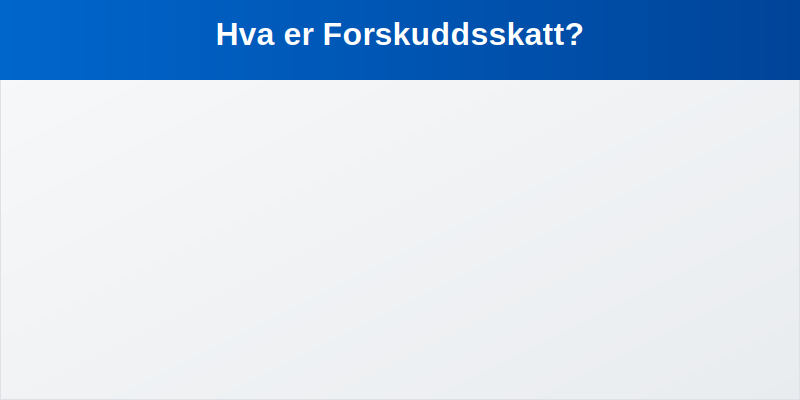

**Forskuddsskatt** er en forskuddsbetaling av forventet skatt for bedrifter og selvstendige næringsdrivende, basert på anslått alminnelig inntekt. Systemet fordeler skatteforpliktelsen over året gjennom terminer, og bidrar til forutsigbar likviditet for virksomheten.



## Seksjon 1: Hva er forskuddsskatt?

Forskuddsskatt er et krav fra Skatteetaten om løpende innbetaling av forventet selskapsskatt (for aksjeselskap og ansvarlig selskap) eller personinntektsskatt (for enkeltpersonforetak) basert på anslått alminnelig inntekt. Formålet er å sikre en jevn fordeling av skattebetalingen og redusere risiko for store restskatter ved årets slutt.

**Nøkkelprinsipper:**

* Skattepliktig inntekt estimeres på forhånd
* Betaling skjer i faste terminer gjennom året
* Endelig belastning avstemmes mot faktisk skatt i [skattemeldingen](/blogs/regnskap/skattemelding "Skattemelding - Komplett Guide til Utfylling og Innlevering")

## Seksjon 2: Hvem må betale forskuddsskatt?

Forskuddsskatt gjelder for følgende virksomheter og foretak:

| **Virksomhetstype**               | **Hvem**                                                           |
|------------------------------------|--------------------------------------------------------------------|
| Aksjeselskap (AS)                  | Alle AS                                                             |
| Ansvarlig selskap (ANS/DA)         | Alle selskaper med deltakerligning                                  |
| Enkeltpersonforetak (ENK)          | Når anslått skatt overstiger 10 000 kr                              |

## Seksjon 3: Terminvis betaling og frister

Forskuddsskatt betales normalt i fire terminer:

| **Termin**   | **Forfallsdato** | **Andel av årlig skatt** |
|--------------|------------------|--------------------------|
| 1. termin    | 15. februar      | 25 %                     |
| 2. termin    | 15. april        | 25 %                     |
| 3. termin    | 15. september    | 25 %                     |
| 4. termin    | 15. november     | 25 %                     |


## Seksjon 4: Beregning av forskuddsskatt

For å beregne forskuddsskatt må du:

1. Estimere årlig alminnelig inntekt
2. Beregne forventet skatt (× gjeldende skattesats)
3. Fordele totalt beløp på terminer

| **Post**                    | **Beløp (kr)** |
|-----------------------------|----------------|
| Anslått alminnelig inntekt  | 1 000 000      |
| × Skattesats (22 %)         | 220 000        |
| Terminbeløp (× 25 %)        | 55 000         |


## Seksjon 5: Bokføring og avregning

Ved innbetaling av forskuddsskatt føres betalingen som kortsiktig gjeld og kostnad:

```plain
Debet: 9200 Forskuddsskatt (kostnad)      kr 55 000
Kredit: 2800 Skyldig forskuddsskatt (gjeld) kr 55 000
```

I endelig avregning mot faktisk skatt i skattemeldingen:

* **Restskatt** oppstår om forskuddsskatt < endelig skatt
* **Til gode** oppstår om forskuddsskatt > endelig skatt

## Seksjon 6: Praktiske tips og fallgruver

* **Oppdater beregningen** ved vesentlige avvik i inntekt
* **Sjekk fristene** nøye for å unngå gebyrer og renter
* **Følg med pÃ¥ skatteendringer** “ nye satser eller regler kan pÃ¥virke beløpet

---

*Relaterte artikler:* [Betalbar skatt](/blogs/regnskap/betalbar-skatt "Betalbar skatt - Faktisk skatteforpliktelse i regnskapet"), [Skattemelding](/blogs/regnskap/skattemelding "Skattemelding - Komplett Guide til Utfylling og Innlevering"), [ForhÃ¥ndsfastsetting](/blogs/regnskap/forhandsfastsetting "Hva er ForhÃ¥ndsfastsetting?"), [Restskatt](/blogs/regnskap/restskatt "Restskatt “ Hva er restskatt og hvordan beregnes den?")


