---
title: "Hva er forskuddstrekk?"
meta_title: "Hva er forskuddstrekk?"
meta_description: '**Forskuddstrekk** er et system hvor arbeidsgivere trekker skatt fra ansattes lønn før utbetaling, og sender denne skatten direkte til Skatteetaten på vegne ...'
slug: hva-er-forskuddstrekk
type: blog
layout: pages/single
---

**Forskuddstrekk** er et system hvor arbeidsgivere trekker skatt fra ansattes lønn før utbetaling, og sender denne skatten direkte til Skatteetaten på vegne av den ansatte. Dette systemet sikrer at arbeidstakere betaler skatt løpende gjennom året, i stedet for å måtte betale hele skatten på en gang ved årets slutt. Forskuddstrekk er en fundamental del av det norske skattesystemet og påvirker både arbeidsgivere og arbeidstakere.

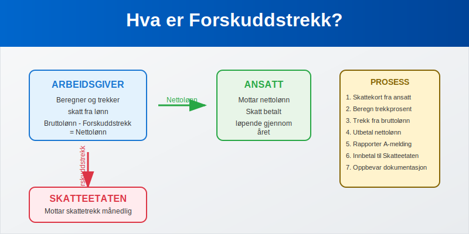

## Seksjon 1: Grunnleggende om Forskuddstrekk

### 1.1 Hva er Forskuddstrekk?

Forskuddstrekk er **skattetrekk i lønn** som arbeidsgivere foretar på vegne av Skatteetaten. Systemet fungerer som en forskuddsinnbetaling av den ansattes årlige skatteplikt, hvor skatten trekkes fra [bruttolønnen](/blogs/regnskap/hva-er-brutto "Hva er Bruttolønn? Definisjon, Beregning og Praktisk Anvendelse") før [nettolønnen](/blogs/regnskap/nettolonn "Hva er Nettolønn? Definisjon, Beregning og Praktisk Eksempler") utbetales til den ansatte.

**Hovedformålet** med forskuddstrekk er å:

* Sikre jevn skatteinnbetaling gjennom året
* Redusere risikoen for store [skatteoppgjør](/blogs/regnskap/skatteoppgjor "Skatteoppgjør Guide: Prosess, Tidslinje og Viktige Frister")
* Forenkle skatteinnkrevingen for staten
* Gi forutsigbarhet for både arbeidstaker og arbeidsgiver

### 1.2 Lovgrunnlag og Regulering

Forskuddstrekk er regulert i **skatteloven** og **forskuddstrekkloven**, og administreres av Skatteetaten. Systemet er obligatorisk for alle arbeidsgivere som utbetaler lønn til ansatte i Norge.

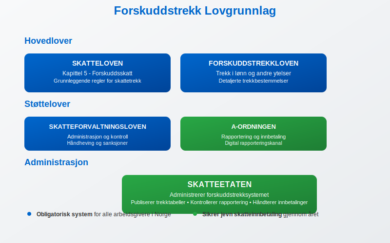

**Viktige lovbestemmelser:**

* Skatteloven kapittel 5 - Forskuddsskatt
* Forskuddstrekkloven - Trekk i lønn og andre ytelser
* Skatteforvaltningsloven - Administrasjon og kontroll
* [A-ordningen](/blogs/regnskap/hva-er-a-ordningen "Hva er A-ordningen?") - Rapportering og innbetaling

## Seksjon 2: Trekkgrunnlag og Beregning

### 2.1 Hva Inngår i Trekkgrunnlaget?

Forskuddstrekk beregnes av den **skattepliktige lønnen** og andre ytelser som arbeidsgiver utbetaler:

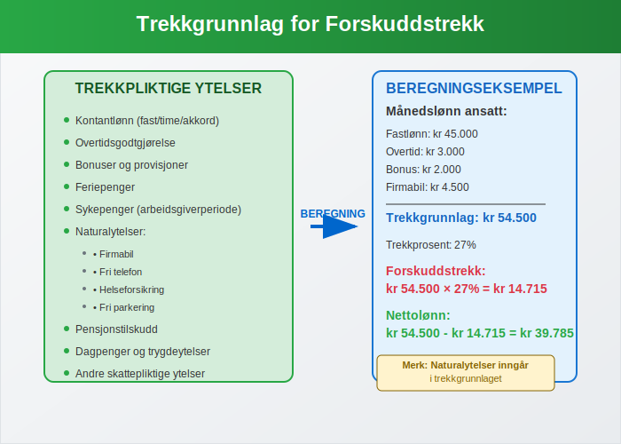

**Trekkpliktige ytelser:**

* Kontantlønn ([fastlønn](/blogs/regnskap/hva-er-fastlonn "Hva er Fastlønn i Regnskap?"), timelønn, overtidsbetaling)
* Bonuser og provisjoner
* [Feriepenger](/blogs/regnskap/hva-er-feriepenger "Hva er Feriepenger i Regnskap? Beregning, Regnskapsføring og Praktiske Eksempler")
* Sykepenger fra arbeidsgiver
* Naturalytelser (firmabil, fri telefon, etc.)
* Pensjonsutbetalinger
* Dagpenger og andre trygdeytelser

### 2.2 Trekktabeller og Trekkprosent

Skatteetaten publiserer årlige **trekktabeller** som viser hvor mye som skal trekkes basert på lønnsnivå og skattekortet til den ansatte.

| Månedslønn | Trekkprosent (standard) | Trekk per måned |
|------------|------------------------|-----------------|
| **kr 30.000** | **22%** | **kr 6.600** |
| **kr 40.000** | **25%** | **kr 10.000** |
| **kr 50.000** | **27%** | **kr 13.500** |
| **kr 60.000** | **29%** | **kr 17.400** |
| **kr 70.000** | **31%** | **kr 21.700** |
| **kr 80.000** | **33%** | **kr 26.400** |

*Tabellen viser eksempler basert på standard skattefradrag. Faktisk trekk kan variere basert på individuelt skattekort.*

### 2.3 Skattekortet og Trekkprosent

Den ansattes **[skattekort](/blogs/regnskap/skattekort "Hva er Skattekort? En komplett guide til skattekortregler i Norge")** bestemmer trekkprosenten som skal anvendes. Skattekortet inneholder informasjon om:

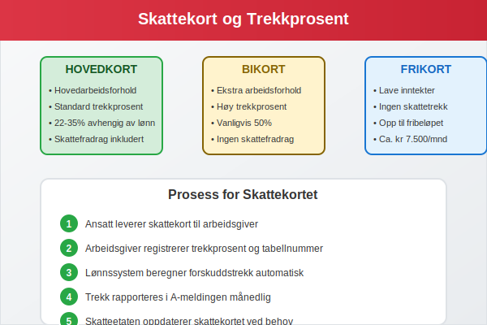

* **Hovedkort** - For hovedarbeidsforholdet
* **Bikort** - For ekstra inntekter (høyere trekkprosent)
* **[Frikort](/blogs/regnskap/hva-er-frikortgrense "Hva er Frikortgrense i Norge? Skattefri Inntekt og Praktiske Eksempler")** - For inntekter under fribeløpet
* **Trekkprosent** - Individuell prosentsats
* **Tabellnummer** - Referanse til trekktabell

## Seksjon 3: Praktisk Håndtering av Forskuddstrekk

### 3.1 Arbeidsgivers Ansvar og Plikter

Arbeidsgivere har omfattende **ansvar og plikter** knyttet til forskuddstrekk:

**Hovedplikter:**

* Innhente gyldig skattekort fra alle ansatte
* Beregne korrekt forskuddstrekk basert på skattekortet
* Trekke skatten fra lønnen før utbetaling
* Rapportere og innbetale trekket til Skatteetaten
* Oppbevare dokumentasjon i henhold til [bokføringsloven](/blogs/regnskap/hva-er-bokforingsloven "Hva er Bokføringsloven?")


### 3.2 Månedlig Prosess

Den månedlige håndteringen av forskuddstrekk følger en fast prosess:

**Steg 1: Lønnsberegning**
* Beregn [bruttolønn](/blogs/regnskap/hva-er-brutto "Hva er Brutto i Regnskap? Definisjon, Beregning og Praktisk Anvendelse") for alle ansatte
* Inkluder alle trekkpliktige ytelser
* Kontroller at skattekortet er oppdatert

**Steg 2: Trekkberegning**
* Anvend korrekt trekkprosent fra skattekortet
* Beregn forskuddstrekk basert på trekkgrunnlaget
* Kontroller beregningene mot trekktabellene

**Steg 3: Lønnsutbetaling**
* Trekk forskuddstrekket fra bruttolønnen
* Utbetal nettolønnen til den ansatte
* Generer [lønnsslipp](/blogs/regnskap/hva-er-lonnsslipp "Hva er Lønnsslipp?") med detaljert oversikt

**Steg 4: Rapportering**
* Rapporter gjennom [A-meldingen](/blogs/regnskap/hva-er-a-melding "Hva er a-melding?")
* Innbetal trekket til Skatteetaten
* Oppbevar dokumentasjon

### 3.3 Beregningseksempler

La oss se på konkrete eksempler på forskuddstrekkberegning:

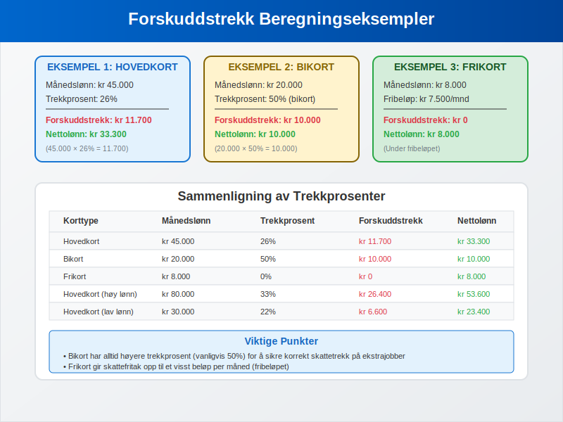

**Eksempel 1: Standard ansatt med hovedkort**
* Månedslønn: kr 45.000
* Trekkprosent: 26%
* **Forskuddstrekk: kr 45.000 × 26% = kr 11.700**
* **Nettolønn: kr 45.000 - kr 11.700 = kr 33.300**

**Eksempel 2: Ansatt med bikort**
* Månedslønn: kr 20.000 (ekstrajobb)
* Trekkprosent: 50% (bikort)
* **Forskuddstrekk: kr 20.000 × 50% = kr 10.000**
* **Nettolønn: kr 20.000 - kr 10.000 = kr 10.000**

**Eksempel 3: Ansatt med frikort**
* Månedslønn: kr 8.000
* Fribeløp: kr 7.500 per måned
* **Forskuddstrekk: kr 0 (under fribeløpet)**
* **Nettolønn: kr 8.000**

## Seksjon 4: Rapportering og A-meldingen

### 4.1 A-meldingen som Rapporteringskanal

Forskuddstrekk rapporteres månedlig gjennom [A-meldingen](/blogs/regnskap/hva-er-a-melding "Hva er a-melding?"), som er den digitale kanalen for rapportering av lønn og trekk til myndighetene.

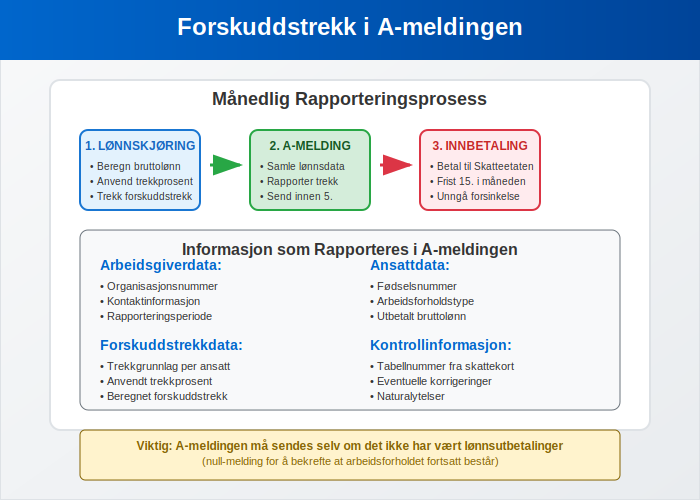

**Informasjon som rapporteres:**

* Identifikasjon av arbeidsgiver og arbeidstaker
* Utbetalt bruttolønn per måned
* Beregnet og trukket forskuddstrekk
* Trekkgrunnlag og trekkprosent
* Eventuelle korrigeringer fra tidligere måneder

### 4.2 Frister og Innbetaling

| Måned | Rapporteringsfrist A-melding | Innbetalingsfrist |
|-------|----------------------------|-------------------|
| **Januar** | **5. februar** | **15. februar** |
| **Februar** | **5. mars** | **15. mars** |
| **Mars** | **5. april** | **15. april** |
| **April** | **5. mai** | **15. mai** |
| **Mai** | **5. juni** | **15. juni** |
| **Juni** | **5. juli** | **15. juli** |

*Hvis fristen faller på helg eller helligdag, flyttes den til neste [virkedag](/blogs/regnskap/virkedager "Virkedager").*

### 4.3 Konsekvenser ved Feil Rapportering

**Mulige sanksjoner:**

* Forsinkelsesrenter ved for sen innbetaling
* Tilleggsavgift ved feil rapportering
* Gebyr for manglende eller feil A-melding
* Straffansvar ved grov uaktsomhet eller forsett

## Seksjon 5: Spesielle Situasjoner og Unntak

### 5.1 Utenlandske Arbeidstakere

Forskuddstrekk for **utenlandske arbeidstakere** har spesielle regler avhengig av skatteposisjon:

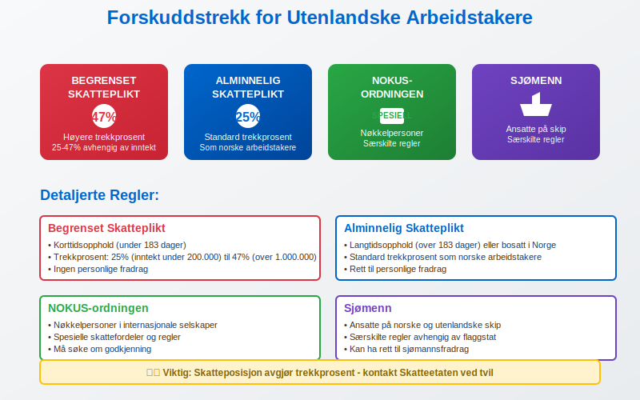

**Kategorier:**

* **Begrenset skatteplikt** - Høyere trekkprosent (25-47%)
* **Alminnelig skatteplikt** - Standard trekkprosent
* **NOKUS-ordningen** - Spesielle regler for nøkkelpersoner
* **Sjømenn** - Særskilte regler for ansatte på skip

### 5.2 Naturalytelser og Fordeler

Forskuddstrekk skal også beregnes av **naturalytelser** og andre fordeler:

| Type naturalytelse | Verdsettelse | Trekkbehandling |
|-------------------|--------------|-----------------|
| **Firmabil** | Listepris × 30% | Trekkpliktig |
| **Fri telefon** | Markedsverdi | Trekkpliktig |
| **Subsidiert kantine** | Fordelsverdi | Trekkpliktig |
| **Fri parkering** | Markedsverdi | Trekkpliktig |
| **Helseforsikring** | Premie | Trekkpliktig |

### 5.3 Feriepenger og Forskuddstrekk

[Feriepenger](/blogs/regnskap/hva-er-feriepenger "Hva er Feriepenger i Regnskap? Beregning, Regnskapsføring og Praktiske Eksempler") har spesielle regler for forskuddstrekk:

For mer informasjon om skattebehandling av feriepenger, se [Skatt på feriepenger](/blogs/regnskap/skatt-pa-feriepenger "Skatt på feriepenger - Skattebehandling av feriepenger i Norge").

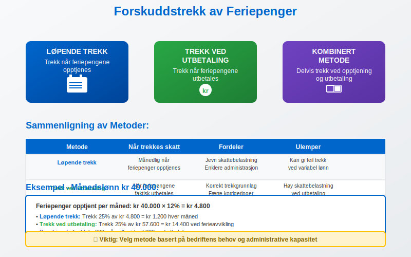

**Trekkmetoder:**

* **Løpende trekk** - Trekk når feriepengene opptjenes
* **Trekk ved utbetaling** - Trekk når feriepengene utbetales
* **Kombinert metode** - Delvis trekk ved opptjening og utbetaling

## Seksjon 6: Regnskapsføring av Forskuddstrekk

### 6.1 Bokføring av Lønnskostnader

Forskuddstrekk påvirker [regnskapsføringen](/blogs/regnskap/hva-er-bokforing "Hva er Bokføring?") av lønnskostnader:

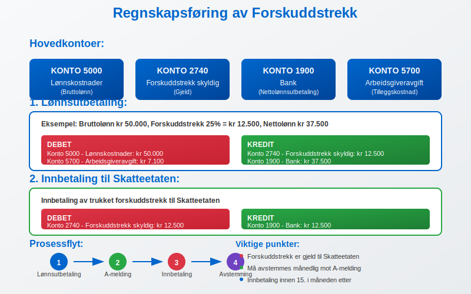

**Typiske kontoer:**

* **Konto 5000** - Lønnskostnader (bruttolønn)
* **Konto 2740** - Forskuddstrekk skyldig (gjeld)
* **Konto 1900** - Bank (nettolønnsutbetaling)
* **Konto 5700** - [Arbeidsgiveravgift](/blogs/regnskap/hva-er-arbeidsgiveravgift "Hva er Arbeidsgiveravgift? En Komplett Guide til Norges Lønnsavgift")

### 6.2 Eksempel på Bokføring

**Lønnsutbetaling:**
```
Debet: Lønnskostnader          kr 50.000
Kredit: Forskuddstrekk skyldig kr 12.500
Kredit: Bank                   kr 37.500
```

**Innbetaling til Skatteetaten:**
```
Debet: Forskuddstrekk skyldig  kr 12.500
Kredit: Bank                   kr 12.500
```

### 6.3 Årsoppgjør og Avstemming

Ved [årsoppgjøret](/blogs/regnskap/hva-er-arsoppgjor "Hva er Årsoppgjør?") må forskuddstrekk avstemmes mot:

* Innbetalte beløp til Skatteetaten
* Rapporterte beløp i A-meldingen
* [Lønns- og trekkoppgaven](/blogs/regnskap/hva-er-lonns-og-trekkoppgave "Hva er Lønns- og Trekkoppgave?")
* Eventuelle korrigeringer og etterbetalinger

## Seksjon 7: Digitalisering og Fremtidige Endringer

### 7.1 Teknologiske Løsninger

Moderne [lønnssystemer](/blogs/regnskap/hva-er-lonnssystem "Hva er Lønnssystem?") har automatisert mye av forskuddstrekkprosessen:

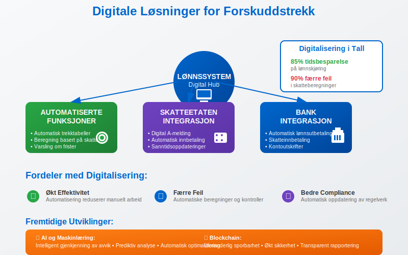

**Automatiserte funksjoner:**

* Automatisk oppdatering av trekktabeller
* Integrering med Skatteetatens systemer
* Automatisk beregning basert på skattekort
* Digital rapportering gjennom A-meldingen
* Varsling om frister og endringer

### 7.2 Fremtidige Endringer

Skatteetaten jobber kontinuerlig med å **modernisere** forskuddstrekksystemet:

**Planlagte forbedringer:**

* Mer dynamiske trekktabeller
* Bedre integrasjon mellom systemer
* Forenklet rapportering for små bedrifter
* Økt automatisering av korrigeringer
* Forbedret brukeropplevelse i digitale tjenester

## Seksjon 8: Praktiske Tips og Beste Praksis

### 8.1 Rutiner for Forskuddstrekk

**Månedlige rutiner:**

* Kontroller at alle skattekortet er oppdaterte
* Verifiser trekkberegninger mot trekktabeller
* Dokumenter alle beregninger og beslutninger
* Send A-melding innen fristen
* Innbetal trekket til Skatteetaten i tide

### 8.2 Vanlige Feil og Hvordan Unngå Dem

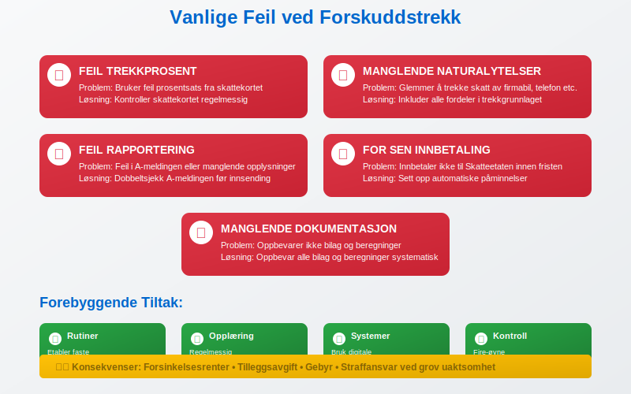

**Hyppige feilkilder:**

* **Feil trekkprosent** - Kontroller skattekortet regelmessig
* **Manglende trekk av naturalytelser** - Inkluder alle fordeler
* **Feil rapportering** - Dobbeltsjekk A-meldingen før innsending
* **For sen innbetaling** - Sett opp automatiske påminnelser
* **Manglende dokumentasjon** - Oppbevar alle [bilag](/blogs/regnskap/hva-er-bilag "Hva er Bilag i Regnskap?") og beregninger

### 8.3 Kontroll og Kvalitetssikring

**Kontrollrutiner:**

* Månedlig avstemming av trekk mot utbetalinger
* Kvartalsvis gjennomgang av trekkprosenter
* Årlig kontroll mot lønns- og trekkoppgaven
* Regelmessig oppdatering av systemer og tabeller

## Konklusjon

Forskuddstrekk er en **fundamental del** av det norske skattesystemet som sikrer jevn skatteinnbetaling gjennom året. For arbeidsgivere innebærer dette et betydelig ansvar for korrekt beregning, rapportering og innbetaling av skattetrekk på vegne av sine ansatte.

**Viktige punkter å huske:**

* Forskuddstrekk beregnes av all skattepliktig lønn og ytelser
* Skattekortet bestemmer trekkprosenten som skal anvendes
* Rapportering skjer månedlig gjennom [A-meldingen](/blogs/regnskap/hva-er-a-melding "Hva er a-melding?")
* Korrekt håndtering krever gode rutiner og systemer
* Feil kan medføre sanksjoner og tilleggsarbeid
* Husk at enkelte måneder har [halv skatt](/blogs/regnskap/halv-skatt "Halv skatt “ Alt du trenger å vite om halv skatt i lønn"), noe som påvirker trekkgrunnlaget.

Ved å følge etablerte rutiner, holde seg oppdatert på regelverket og bruke moderne digitale løsninger, kan bedrifter håndtere forskuddstrekk effektivt og i samsvar med gjeldende regelverk. Dette sikrer både compliance og god [økonomistyring](/blogs/regnskap/hva-er-okonomistyring "Hva er Økonomistyring?") i virksomheten.


