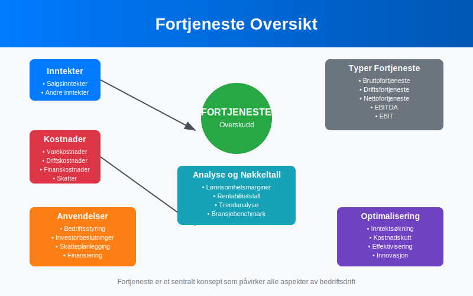
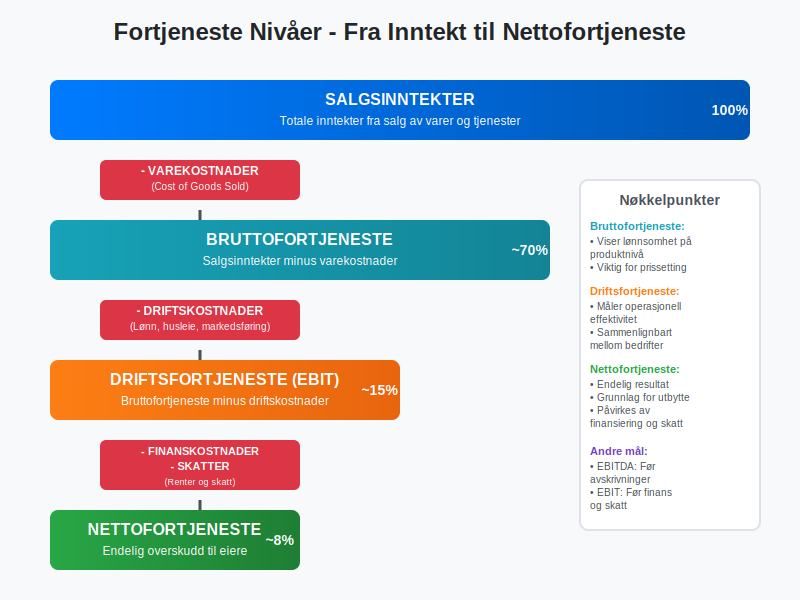
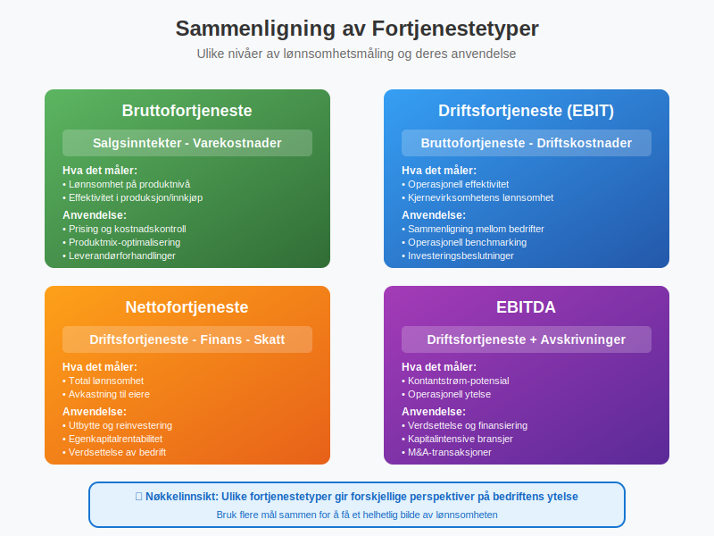
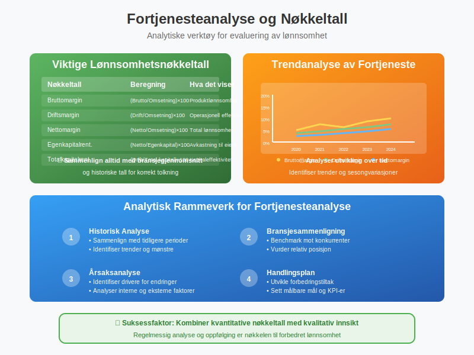
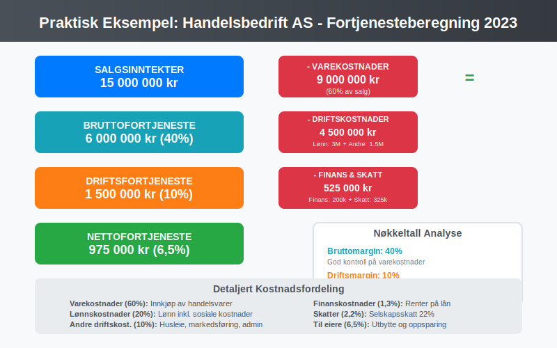
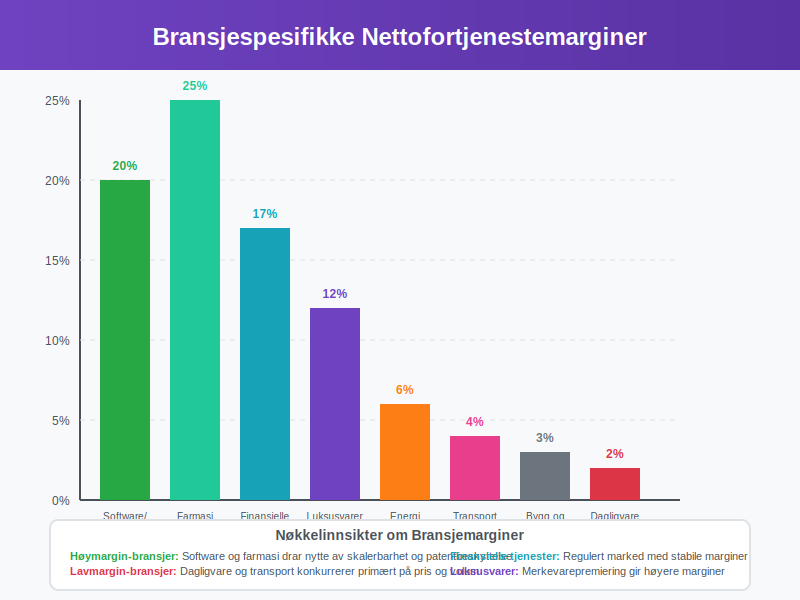
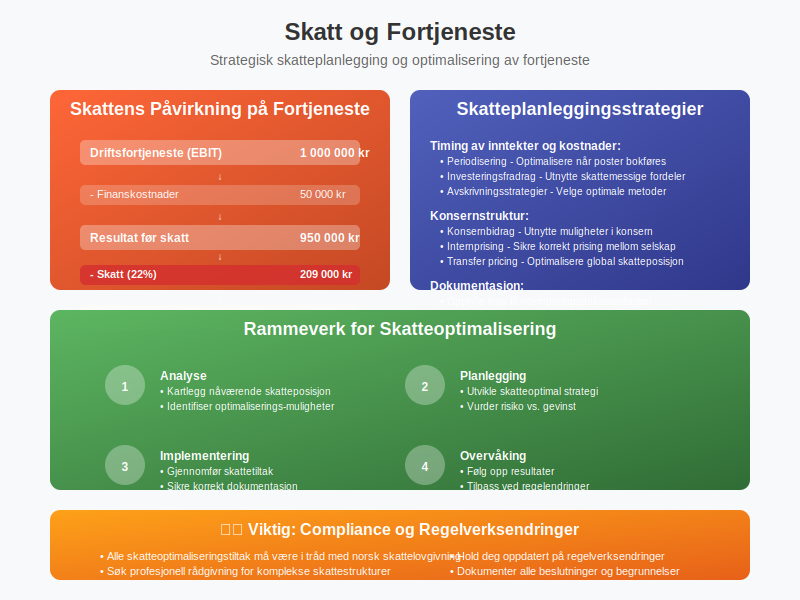
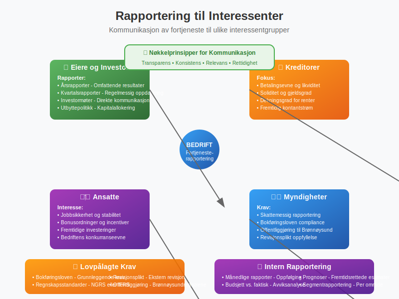
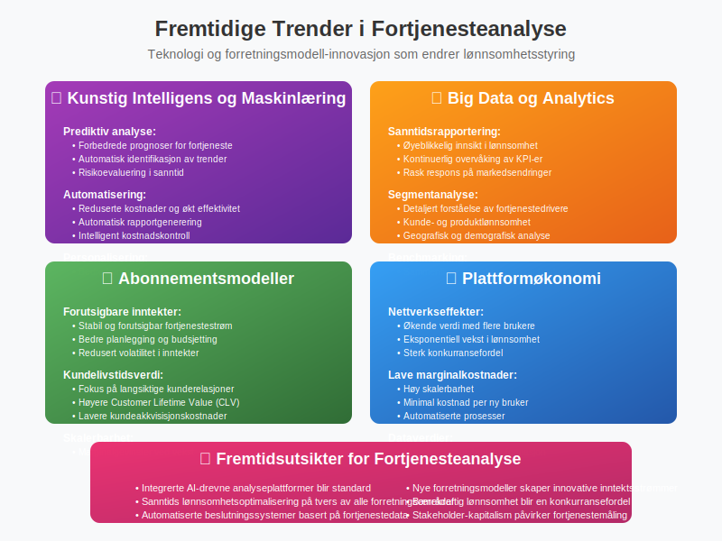

---
title: "Hva er Fortjeneste?"
seoTitle: "Hva er Fortjeneste?"
description: '**Fortjeneste** er et av de mest sentrale begrepene innen [regnskap](/blogs/regnskap/hva-er-regnskap "Hva er Regnskap? En Komplett Guide til Regnskapsføring") ...'
---

**Fortjeneste** er et av de mest sentrale begrepene innen [regnskap](/blogs/regnskap/hva-er-regnskap "Hva er Regnskap? En Komplett Guide til Regnskapsføring") og økonomi. Det representerer det overskuddet en bedrift oppnår etter at alle kostnader er trukket fra inntektene, og er det ultimate målet for de fleste kommersielle virksomheter. Fortjeneste er ikke bare et tall i [regnskapet](/blogs/regnskap/hva-er-regnskap "Hva er Regnskap? En Komplett Guide til Regnskapsføring") - det er en indikator på bedriftens **lønnsomhet**, **effektivitet** og **fremtidige bærekraft**.



## Definisjon og Grunnleggende Forståelse

Fortjeneste, også kalt **[overskudd](/blogs/regnskap/hva-er-overskudd "Hva er Overskudd? Komplett Guide til Overskudd i Regnskap og Økonomi")** eller **resultat**, er forskjellen mellom bedriftens totale inntekter og totale kostnader over en bestemt periode. Dette begrepet er fundamentalt for å forstå hvordan bedrifter skaper verdi og måler sin økonomiske suksess.

### Grunnleggende Formel for Fortjeneste

```
Fortjeneste = Totale Inntekter - Totale Kostnader
```

Denne enkle formelen skjuler imidlertid en kompleks struktur av ulike typer inntekter og kostnader som må forstås for å få et fullstendig bilde av bedriftens økonomiske situasjon.

## Typer Fortjeneste i Regnskapet

Fortjeneste kan måles på flere nivåer i [resultatregnskapet](/blogs/regnskap/hva-er-driftsregnskap "Hva er Driftsregnskap? Komplett Guide til Driftsregnskap"), hver med sin spesifikke betydning og anvendelse.



### 1. Bruttofortjeneste

[Bruttofortjeneste](/blogs/regnskap/hva-er-bruttofortjeneste "Hva er Bruttofortjeneste? Beregning, Analyse og Betydning for Bedriften") er det første nivået av fortjeneste og viser bedriftens evne til å generere overskudd på kjernevirksomheten.

**Beregning:**
```
Bruttofortjeneste = Salgsinntekter - Varekostnader
```

### 2. Driftsfortjeneste (EBIT)

[Driftsresultat](/blogs/regnskap/hva-er-driftsresultat "Hva er Driftsresultat? Komplett Guide til Beregning og Analyse") viser fortjenesten fra den ordinære driften før finansielle poster.

**Beregning:**
```
Driftsfortjeneste = Bruttofortjeneste - Driftskostnader
```

### 3. Nettofortjeneste

Nettofortjeneste er det endelige overskuddet som tilfaller eierne etter at alle kostnader er dekket.

**Beregning:**
```
Nettofortjeneste = Driftsfortjeneste - Finanskostnader - Skatter
```

## Sammenligning av Fortjenestetyper

| Fortjenestetype | Beregning | Hva det måler | Anvendelse |
|-----------------|-----------|---------------|------------|
| **[Bruttofortjeneste](/blogs/regnskap/hva-er-bruttofortjeneste "Hva er Bruttofortjeneste?")** | Salg - Varekostnader | Lønnsomhet på produktnivå | Prising og kostnadskontroll |
| **Driftsfortjeneste** | Brutto - Driftskostnader | Operasjonell effektivitet | Sammenligning mellom bedrifter |
| **Nettofortjeneste** | Drift - Finans - Skatt | Total lønnsomhet | Utbytte og reinvestering |
| **EBITDA** | Drift + Avskrivninger | Kontantstrøm-potensial | Verdsettelse og finansiering |



## Faktorer som Påvirker Fortjeneste

Fortjeneste påvirkes av en rekke interne og eksterne faktorer som bedriftsledelsen må forstå og håndtere.

### Interne Faktorer

**Positive faktorer:**
* **Effektiv kostnadskontroll** - Reduserte driftskostnader
* **Produktivitetsforbedringer** - Høyere output per ressursenhet
* **Innovasjon** - Nye produkter med høyere marginer
* **Skalering** - [Stordriftsfordeler](/blogs/regnskap/hva-er-avkastning "Hva er Avkastning? Komplett Guide til Avkastning og Lønnsomhet") ved økt volum
* **Prissetting** - Optimalisering av priser basert på verdi

**Negative faktorer:**
* **Ineffektive prosesser** - Høye driftskostnader
* **Overkapasitet** - Underutnyttede ressurser
* **Kvalitetsproblemer** - Økte kostnader og tapt salg
* **Dårlig lagerstyring** - Høye lagerkostnader og svinn

### Eksterne Faktorer

**Markedsfaktorer:**
* **Konkurranse** - Prispress og markedsandel
* **Etterspørsel** - Konjunkturer og trender
* **Leverandørforhold** - Innkjøpspriser og tilgjengelighet
* **Regulering** - Nye krav og restriksjoner

**Makroøkonomiske faktorer:**
* **Renter** - Påvirker finanskostnader
* **[Inflasjon](/blogs/regnskap/hva-er-inflasjon "Hva er Inflasjon? Komplett Guide til Inflasjon i Regnskap og Økonomi")** - Øker kostnader og påvirker priser
* **Valutakurser** - Viktig for import/eksport
* **Skattepolitikk** - Direkte påvirkning på nettofortjeneste

## Fortjenesteanalyse og Nøkkeltall

For å forstå og evaluere fortjeneste brukes flere analytiske verktøy og nøkkeltall.



### Viktige Lønnsomhetsnøkkeltall

| Nøkkeltall | Beregning | Hva det viser |
|------------|-----------|---------------|
| **Bruttomargin** | (Bruttofortjeneste / Omsetning) × 100 | Lønnsomhet på produktnivå |
| **Driftsmargin** | (Driftsresultat / Omsetning) × 100 | Operasjonell effektivitet |
| **Nettomargin** | (Nettofortjeneste / Omsetning) × 100 | Total lønnsomhet |
| **[Egenkapitalrentabilitet](/blogs/regnskap/hva-er-egenkapitalrentabilitet "Hva er Egenkapitalrentabilitet? Beregning og Analyse")** | (Nettofortjeneste / [Egenkapital](/blogs/regnskap/hva-er-egenkapital "Hva er Egenkapital? Komplett Guide til Egenkapital")) × 100 | Avkastning til eiere |
| **Totalkapitalrentabilitet** | (Driftsresultat / Total kapital) × 100 | Effektivitet i kapitalbruk |

### Trendanalyse av Fortjeneste

Analyse av fortjenestetrend over tid gir verdifull innsikt:

* **Vekstrate** - Årlig endring i fortjeneste
* **Volatilitet** - Stabilitet i fortjenestestrøm
* **Sesongvariasjoner** - Periodiske svingninger
* **Konjunkturmønster** - Følsomhet for økonomiske sykler

## Praktiske Eksempler på Fortjenesteberegning

La oss se på konkrete eksempler fra ulike bransjer for å illustrere fortjenesteberegning.

### Eksempel 1: Handelsbedrift AS

**Grunnlagsdata for 2023:**
* Salgsinntekter: 15 000 000 kr
* Varekostnader: 9 000 000 kr
* Lønnskostnader: 3 000 000 kr
* Andre driftskostnader: 1 500 000 kr
* Finanskostnader: 200 000 kr
* Skatter: 325 000 kr

**Beregning:**
* **Bruttofortjeneste:** 15 000 000 - 9 000 000 = **6 000 000 kr** (40% margin)
* **Driftsfortjeneste:** 6 000 000 - 3 000 000 - 1 500 000 = **1 500 000 kr** (10% margin)
* **Nettofortjeneste:** 1 500 000 - 200 000 - 325 000 = **975 000 kr** (6,5% margin)



### Eksempel 2: Tjenestebedrift AS

**Grunnlagsdata for 2023:**
* Tjenesteinntekter: 8 000 000 kr
* Lønnskostnader: 4 800 000 kr
* Kontorkostnader: 800 000 kr
* Andre driftskostnader: 600 000 kr
* Finanskostnader: 100 000 kr
* Skatter: 175 000 kr

**Beregning:**
* **Bruttofortjeneste:** 8 000 000 kr (ingen varekostnader)
* **Driftsfortjeneste:** 8 000 000 - 4 800 000 - 800 000 - 600 000 = **1 800 000 kr** (22,5% margin)
* **Nettofortjeneste:** 1 800 000 - 100 000 - 175 000 = **1 525 000 kr** (19% margin)

## Bransjespesifikke Fortjenestemønstre

Ulike bransjer har karakteristiske fortjenestemønstre basert på deres forretningsmodeller og konkurranseforhold.

### Høymargin-bransjer

| Bransje | Typisk Nettomargin | Karakteristikk |
|---------|-------------------|----------------|
| **Software/SaaS** | 15-25% | Høy skalerbarhet, lave variable kostnader |
| **Farmasi** | 20-30% | Patentbeskyttelse, høy F&U-investering |
| **Finansielle tjenester** | 15-20% | Regulert marked, høy kompetansekrav |
| **Luksusvarer** | 10-15% | Sterk merkevare, premium-prising |

### Lavmargin-bransjer

| Bransje | Typisk Nettomargin | Karakteristikk |
|---------|-------------------|----------------|
| **Dagligvare** | 1-3% | Høy konkurranse, volum-basert |
| **Transport** | 3-5% | Kapitalintensiv, konjunkturavhengig |
| **Bygg og anlegg** | 2-4% | Prosjektbasert, høy risiko |
| **Energi** | 5-8% | Regulert, kapitalintensiv |



## Strategier for Fortjenesteoptimalisering

Bedrifter kan implementere ulike strategier for å forbedre sin fortjeneste.

### Inntektsoptimalisering

**Prisstrategier:**
* **Verdibasert prising** - Pris basert på kundens opplevde verdi
* **Dynamisk prising** - Tilpasning basert på etterspørsel og marked
* **Produktbunting** - Kombinere produkter for høyere totalverdi
* **Premiumposisjonering** - Fokus på kvalitet og service

**Salgsoptimalisering:**
* **Krysssalg** - Selge tilleggsprodukter til eksisterende kunder
* **Kundesegmentering** - Målrettet tilnærming til ulike kundegrupper
* **Digitalisering** - Effektivisere salgsprosesser
* **Kundelojalitet** - Redusere kundefrafall og øke livstidsverdi

### Kostnadsoptimalisering

**Operasjonelle forbedringer:**
* **Prosessautomatisering** - Redusere manuelle oppgaver
* **Leverandørforhandlinger** - Bedre innkjøpsvilkår
* **Energieffektivisering** - Redusere driftskostnader
* **Kvalitetsforbedringer** - Redusere svinn og reklamasjoner

**Strukturelle endringer:**
* **Outsourcing** - Fokusere på kjernevirksomhet
* **Skalering** - Utnytte stordriftsfordeler
* **Teknologiinvestering** - Langsiktig effektivisering
* **Organisasjonsutvikling** - Optimalisere struktur og prosesser

## Fortjeneste og Skatteplanlegging

Fortjeneste har direkte betydning for bedriftens skattesituasjon og krever strategisk planlegging.

### Skattemessige Hensyn

**Timing av inntekter og kostnader:**
* **Periodisering** - Optimalisere når inntekter og kostnader bokføres
* **Investeringsfradrag** - Utnytte skattemessige fordeler
* **Avskrivningsstrategier** - Velge optimale avskrivningsmetoder
* **[Konsernbidrag](/blogs/regnskap/hva-er-konsernbidrag "Hva er Konsernbidrag? Komplett Guide til Konsernbidrag i Norge")** - Utnytte muligheter i konsernstruktur

**Internprising:**
* **Markedsprising** - Sikre korrekt prising mellom konsernselskap
* **Dokumentasjon** - Oppfylle krav til internprisingsdokumentasjon
* **Transfer pricing** - Optimalisere skatteposisjon globalt



## Fortjeneste og Finansiering

Fortjeneste påvirker bedriftens finansieringsmuligheter og kapitalstruktur.

### Egenfinansiering

**Tilbakeholdt overskudd:**
* **Reinvestering** - Bruke fortjeneste til vekst
* **Likviditetsreserver** - Bygge finansiell buffer
* **Utbyttepolitikk** - Balansere utdeling og reinvestering

### Ekstern finansiering

**Lånekapasitet:**
* **Soliditet** - Høyere fortjeneste styrker balansen
* **Dekningsgrad** - Evne til å betjene gjeld
* **Kredittvurdering** - Påvirker lånevilkår

**Egenkapitalfinansiering:**
* **Verdsettelse** - Fortjeneste påvirker bedriftens verdi
* **Investortiltrekning** - Lønnsomhet tiltrekker kapital
* **Vekstfinansiering** - Støtte ekspansjon og utvikling

## Rapportering og Kommunikasjon av Fortjeneste

Korrekt rapportering og kommunikasjon av fortjeneste er kritisk for interessenter.

### Regnskapsrapportering

**Lovpålagte krav:**
* **[Bokføringsloven](/blogs/regnskap/hva-er-bokforingsloven "Hva er Bokføringsloven? Komplett Guide til Norsk Bokføringslov")** - Grunnleggende krav til regnskapsføring
* **Regnskapsstandarder** - NGRS eller IFRS
* **Revisjonsplikt** - Krav til ekstern revisjon
* **Offentliggjøring** - Innlevering til Brønnøysundregistrene

**Intern rapportering:**
* **Månedlige rapporter** - Oppfølging av utvikling
* **Budsjett vs. faktisk** - Avviksanalyse
* **Prognoser** - Fremtidsrettede estimater
* **Segmentrapportering** - Analyse per forretningsområde

### Kommunikasjon til Interessenter

**Eiere og investorer:**
* **Årsrapporter** - Omfattende fremstilling av resultater
* **Kvartalsrapporter** - Regelmessig oppdatering
* **Investormøter** - Direkte kommunikasjon
* **Utbyttepolitikk** - Forklaring av kapitalallokering

**Andre interessenter:**
* **Kreditorer** - Dokumentasjon av betalingsevne
* **Ansatte** - Transparens om bedriftens situasjon
* **Kunder** - Signalisering av stabilitet
* **Myndigheter** - Skattemessig rapportering



## Utfordringer og Fallgruver

Det er flere vanlige utfordringer og fallgruver knyttet til fortjenesteanalyse og -styring.

### Analytiske Fallgruver

**Kortsiktig fokus:**
* **Kvartalstenkning** - Ofre langsiktig verdi for kortsiktige resultater
* **Kostnadsreduksjoner** - Kutte investeringer som påvirker fremtidig vekst
* **Prisøkninger** - Risikere kundelojalitet for øyeblikkelig fortjeneste

**Regnskapsmessige utfordringer:**
* **Periodisering** - Korrekt timing av inntekter og kostnader
* **Estimater** - Usikkerhet i avsetninger og verdivurderinger
* **Engangseffekter** - Skille mellom ordinære og ekstraordinære poster

### Operasjonelle Utfordringer

**Kvalitet vs. kvantitet:**
* **Vekst vs. lønnsomhet** - Balansere ekspansjon og profitabilitet
* **Kundetilfredshet** - Ikke ofre service for kostnadsbesparelser
* **Medarbeiderengasjement** - Sikre at fortjenestepress ikke demotiverer

**Markedsutfordringer:**
* **Konkurransepress** - Håndtere priskonkurranse
* **Teknologiendringer** - Tilpasse seg digitale forstyrrelser
* **Regulatoriske endringer** - Tilpasse seg nye krav

## Fremtidige Trender og Utviklinger

Fortjenesteanalyse og -styring utvikler seg kontinuerlig med nye teknologier og forretningsmodeller.

### Teknologiske Trender

**Kunstig intelligens og maskinlæring:**
* **Prediktiv analyse** - Forbedrede prognoser for fortjeneste
* **Automatisering** - Reduserte kostnader og økt effektivitet
* **Personalisering** - Bedre kundetilpasning og prising

**Big Data og analytics:**
* **Sanntidsrapportering** - Øyeblikkelig innsikt i lønnsomhet
* **Segmentanalyse** - Detaljert forståelse av fortjenestedrivere
* **Benchmarking** - Sammenligning med bransje og konkurrenter

### Forretningsmodell-innovasjon

**Abonnementsmodeller:**
* **Forutsigbare inntekter** - Stabil fortjenestestrøm
* **Kundelivstidsverdi** - Fokus på langsiktige relasjoner
* **Skalerbarhet** - Marginalgevinster ved vekst

**Plattformøkonomi:**
* **Nettverkseffekter** - Økende verdi med flere brukere
* **Lave marginalkostnader** - Høy skalerbarhet
* **Dataverdier** - Monetisering av brukerinformasjon



## Konklusjon

Fortjeneste er mye mer enn bare et tall i regnskapet - det er et omfattende mål på bedriftens evne til å skape verdi og sikre langsiktig bærekraft. Forståelse av de ulike typene fortjeneste, fra [bruttofortjeneste](/blogs/regnskap/hva-er-bruttofortjeneste "Hva er Bruttofortjeneste?") til nettofortjeneste, er essensielt for effektiv bedriftsstyring.

### Nøkkelpunkter å Huske

* **Fortjeneste måles på flere nivåer** - hver med sin spesifikke betydning og anvendelse
* **Bransjeforskjeller er betydelige** - sammenligning må gjøres med relevante referanser
* **Både interne og eksterne faktorer** påvirker fortjeneste og må håndteres strategisk
* **Balanse mellom kortsiktig og langsiktig** lønnsomhet er kritisk for bærekraftig vekst
* **Teknologi og innovasjon** endrer måten fortjeneste skapes og måles på

For bedriftsledere og regnskapsførere er det viktig å ikke bare fokusere på fortjenesteoptimalisering, men også å forstå de underliggende driverne og sikre at strategiene er bærekraftige over tid. Fortjeneste er ikke et mål i seg selv, men et middel for å skape verdi for alle interessenter og sikre bedriftens fremtidige suksess.

Ved å implementere systematiske tilnærminger til fortjenesteanalyse og -styring, kombinert med moderne teknologi og analytiske verktøy, kan bedrifter oppnå både kortsiktig lønnsomhet og langsiktig vekst i et stadig mer konkurranseutsatt marked.


