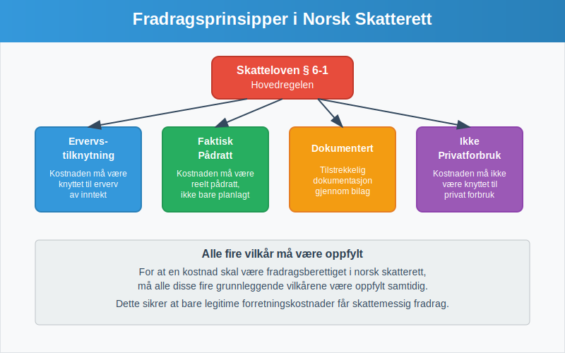
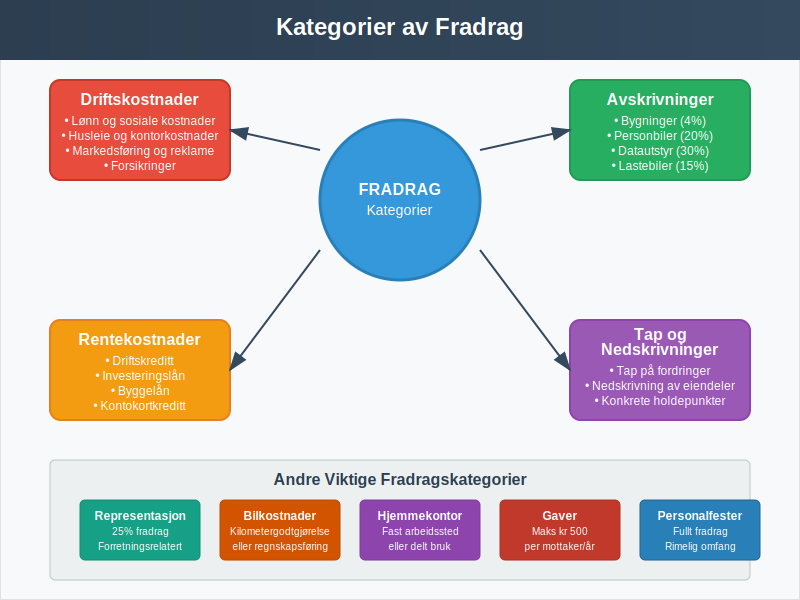
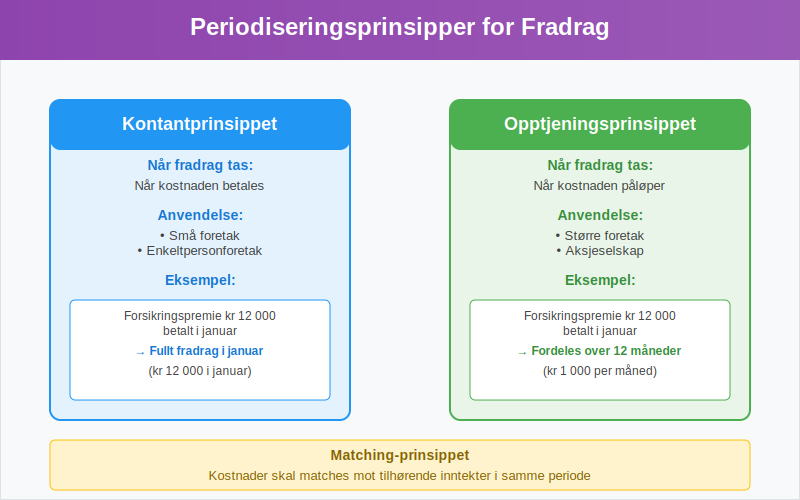
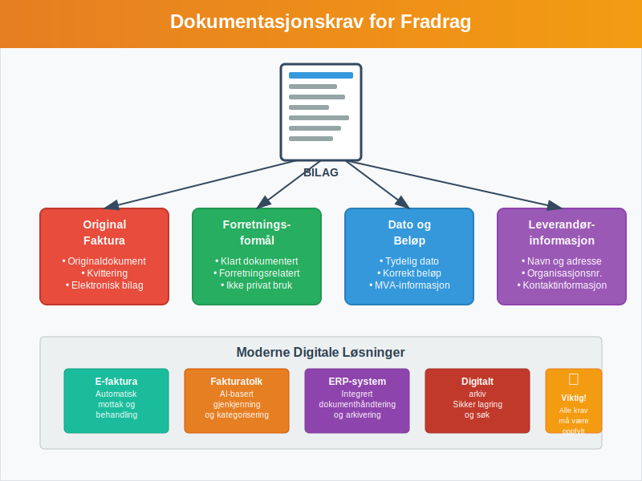
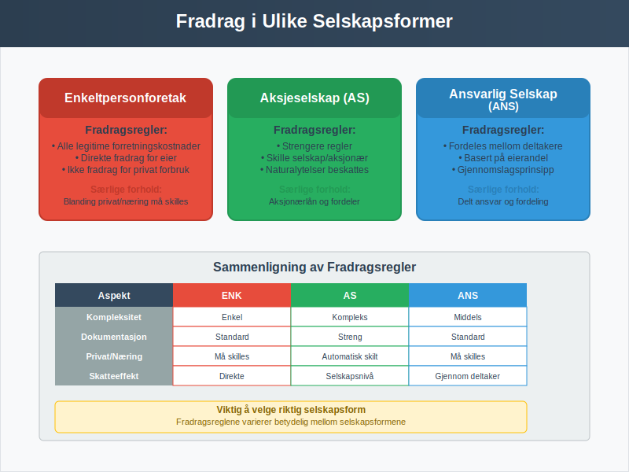

---
title: "Hva er fradrag i regnskap?"
seoTitle: "Hva er fradrag i regnskap?"
description: '**Fradrag** i regnskap og skatterett er kostnader eller utgifter som kan trekkes fra inntektene for å redusere det skattepliktige grunnlaget. Dette er et funda...'
---

**Fradrag** i regnskap og skatterett er kostnader eller utgifter som kan trekkes fra inntektene for å redusere det skattepliktige grunnlaget. Dette er et fundamentalt konsept som påvirker både [bokføring](/blogs/regnskap/hva-er-bokforing "Hva er Bokføring? En Komplett Guide til Norsk Bokføringspraksis") og skatteplanlegging for alle typer virksomheter i Norge.

For en dypere forståelse av **minstefradrag**, se [Hva er minstefradrag?](/blogs/regnskap/hva-er-minstefradrag "Hva er Minstefradrag? Komplett Guide til Minstefradrag i Norge 2024").

For mer informasjon om fordeling av fradrag mellom ektefeller, se [Ektefellefordeling](/blogs/regnskap/ektefellefordeling "Ektefellefordeling i Norsk Regnskap").

For en grundigere innsikt i **personfradrag**, se [Personfradrag](/blogs/regnskap/personfradrag "Personfradrag i Norge: Alt du trenger å vite").

For å lære hvordan du faktisk **fradragsfører** kostnader i regnskapet, se [Hva er Fradragsføre?](/blogs/regnskap/hva-er-fradragsfoere "Hva betyr å fradragsføre i regnskap?").

## Grunnleggende Prinsipper for Fradragsrett

Fradragsretten i norsk skatterett bygger på flere grunnleggende prinsipper som regulerer hvilke kostnader som kan trekkes fra i [skatteregnskapet](/blogs/regnskap/hva-er-regnskap "Hva er regnskap?"). Disse prinsippene sikrer at bare legitime forretningskostnader får skattemessig fradrag.

### Hovedregelen for Fradrag

Ifølge skatteloven § 6-1 kan **fradrag** kreves for kostnader som er pådratt for å erverve, sikre og vedlikeholde skattepliktig inntekt. Dette innebærer at kostnaden må ha en klar tilknytning til virksomhetens inntektsgivende aktivitet.

### Vilkår for Fradragsrett

For at en kostnad skal være **[fradragsberettiget](/blogs/regnskap/fradragsberettiget "Hva betyr Fradragsberettiget?")**, må følgende vilkår være oppfylt:

* **Ervervstilknytning:** Kostnaden må være pådratt i forbindelse med erverv av inntekt
* **Faktisk pådratt:** Kostnaden må være reelt pådratt, ikke bare planlagt
* **Dokumentert:** Kostnaden må være tilstrekkelig dokumentert gjennom [bilag](/blogs/regnskap/hva-er-bilag "Hva er Bilag i Regnskap? Komplett Guide til Regnskapsbilag og Dokumentasjon")
* **Ikke privatforbruk:** Kostnaden må ikke være knyttet til privat forbruk

## Kategorier av Fradrag

Fradrag kan deles inn i flere hovedkategorier basert på deres karakter og regnskapsmessige behandling. Hver kategori har sine egne regler og begrensninger.

### 1. Driftskostnader

[Driftskostnader](/blogs/regnskap/hva-er-driftskostnader "Hva er Driftskostnader? Typer, Beregning og Regnskapsføring - Komplett Guide") utgjør den største kategorien av fradragsberettigede kostnader. Dette inkluderer alle løpende kostnader knyttet til virksomhetens daglige drift.

**Eksempler på driftskostnader:**

* Lønn og sosiale kostnader
* Husleie og kontorkostnader  
* Telefon og internett
* Markedsføring og reklame
* Forsikringer
* Reparasjoner og vedlikehold

### 2. Avskrivninger

[Avskrivninger](/blogs/regnskap/hva-er-avskrivning "Hva er Avskrivning? Komplett Guide til Avskrivningsmetoder og Regnskapsføring") representerer den årlige verdireduksjonen av [anleggsmidler](/blogs/regnskap/hva-er-anleggsmidler "Hva er Anleggsmidler? Komplett Guide til Varige Driftsmidler"). Dette er en spesiell form for fradrag som fordeler [anskaffelseskostnaden](/blogs/regnskap/hva-er-anskaffelseskost "Hva er Anskaffelseskost? Komplett Guide til Kostpris og Verdsettelse") over eiendelens levetid.

| Avskrivningsgruppe | Avskrivningssats | Eksempler |
|-------------------|------------------|-----------|
| Gruppe A | 4% | Bygninger, anlegg |
| Gruppe B | 20% | Personbiler, inventar |
| Gruppe C | 15% | Lastebiler, busser |
| Gruppe D | 30% | Datautstyr, programvare |

### 3. Rentekostnader

Rentekostnader på lån som er tatt opp for virksomheten er som hovedregel fradragsberettigede. Dette gjelder både renter på:

* Driftskreditt
* Investeringslån
* Byggelån
* Kontokortkreditt (forretningsrelatert)

### 4. Tap og Nedskrivninger

Tap på fordringer og nedskrivninger av eiendeler kan gi fradrag når visse vilkår er oppfylt. For [debitor](/blogs/regnskap/hva-er-debitor "Hva er Debitor? Komplett Guide til Kundefordringer og Debitorhåndtering")tap må det foreligge konkrete holdepunkter for at fordringen ikke kan inndrives.

### 5. Minstefradrag

**[Minstefradrag](/blogs/regnskap/hva-er-minstefradrag "Hva er Minstefradrag? Komplett Guide til Minstefradrag i Norge 2024")** er et standardisert fradrag som alle lønnstakere og pensjonister automatisk får i sin selvangivelse. Dette fradraget forenkler skattesystemet ved å dekke vanlige arbeidsrelaterte utgifter uten krav om detaljert dokumentasjon.

**Hovedtrekk ved minstefradrag:**

* **Lønnsinntekt:** 46% av inntekt, maksimalt kr 104 850 (2024)
* **Pensjonsinntekt:** 31% av inntekt, maksimalt kr 90 800 (2024)
* **Automatisk:** Gis uten dokumentasjonskrav
* **Alternativ:** Kan velges i stedet for faktiske utgifter

Minstefradrag representerer en viktig forenkling av skattesystemet og sikrer at alle skattytere får dekket grunnleggende kostnader knyttet til inntektserverv.

## Periodisering av Fradrag

**Periodisering** er et viktig prinsipp som bestemmer når fradrag skal tas i regnskapet. Dette følger de samme reglene som for inntektsføring og sikrer at kostnader matches mot tilhørende inntekter.

### Kontantprinsippet vs. Opptjeningsprinsippet

| Prinsipp | Beskrivelse | Anvendelse |
|----------|-------------|------------|
| **Kontantprinsippet** | Fradrag tas når kostnaden betales | Små foretak, enkeltpersonforetak |
| **Opptjeningsprinsippet** | Fradrag tas når kostnaden påløper | Større foretak, aksjeselskap |

### Praktiske Eksempler på Periodisering

**Eksempel 1: Forsikringspremie**
En virksomhet betaler en årlig forsikringspremie på kr 12 000 i januar. Ved opptjeningsprinsippet skal denne kostnaden fordeles over 12 måneder (kr 1 000 per måned).

**Eksempel 2: Påløpte Kostnader**
Strømregning for desember mottas i januar påfølgende år. Kostnaden skal likevel føres i desember da den er påløpt i denne perioden.

## Dokumentasjonskrav for Fradrag

Alle fradrag må være tilstrekkelig dokumentert for å være gyldige. Dette er særlig viktig ved skatterevisjoner og kontroller fra Skatteetaten.

### Krav til Bilagsdokumentasjon

Hvert fradrag må støttes av:

* **Original [faktura](/blogs/regnskap/hva-er-en-faktura "Hva er en Faktura? En Guide til Norske Fakturakrav")** eller kvittering
* **Forretningsformål** må være klart dokumentert
* **Dato og beløp** må være tydelig angitt
* **Leverandørinformasjon** må være komplett

### Digitale Bilag og Moderne Løsninger

Med utviklingen av [elektronisk fakturering](/blogs/regnskap/hva-er-elektronisk-fakturering "Hva er Elektronisk Fakturering? Komplett Guide til E-faktura og Digitale Løsninger") og [ERP-systemer](/blogs/regnskap/hva-er-erp-system "Hva er ERP-system? Komplett Guide til Enterprise Resource Planning") har dokumentasjonsprosessen blitt mer effektiv. Moderne [fakturatolk](/blogs/regnskap/hva-er-fakturatolk "Hva er Fakturatolk? AI-basert Fakturagjenkjenning og Automatisering") kan automatisk kategorisere og registrere fradrag basert på fakturainnhold.

## Spesielle Regler og Begrensninger

Enkelte typer fradrag har spesielle regler eller begrensninger som må følges nøye.

### Representasjon og Gaver

| Type kostnad | Fradragsrett | Begrensninger |
|--------------|--------------|---------------|
| **Representasjon** | 25% fradrag | Kun forretningsrelatert |
| **Gaver til kunder** | Fullt fradrag | Maks kr 500 per mottaker per år |
| **Personalfester** | Fullt fradrag | Rimelig omfang |

### Bilkostnader

For virksomheter som bruker bil i næringen, finnes det to hovedmetoder for fradrag:

1. **Kilometergodtgjørelse:** Fast sats per kilometer (kr 4,35 for 2024)
2. **Regnskapsføring:** Alle faktiske kostnader med tilhørende dokumentasjon

Uavhengig av metode krever skattemyndighetene systematisk dokumentasjon av forretningsbruken. En [kjørebok](/blogs/regnskap/hva-er-kjorebok "Hva er Kjørebok? Komplett Guide til Kjørebok for Bedrifter i Norge") er det primære verktøyet for å dokumentere og maksimere bilkostnadsfradrag, og sikrer at alle lovkrav oppfylles.

### Hjemmekontor

Med økt hjemmearbeid har reglene for hjemmekontor-fradrag blitt mer relevante. For en omfattende guide til alle aspekter ved hjemmekontorregnskapet, se vår detaljerte artikkel om [hjemmekontor](/blogs/regnskap/hva-er-hjemmekontor "Hva er Hjemmekontor? Komplett Guide til Regnskapsføring og Skattefradrag").

### Jordbruksfradrag

For landbruksvirksomheter finnes det spesielle fradragsordninger som kompenserer for sektorens særegne utfordringer. [Jordbruksfradrag](/blogs/regnskap/hva-er-jordbruksfradrag "Hva er Jordbruksfradrag? Komplett Guide til Landbruksfradrag og Skattefordeler") er et viktig skattemessig virkemiddel som beregnes som en prosentsats av jordbruksinntekten og kommer i tillegg til ordinære driftskostnader.

## Pendlerfradrag

**Pendlerfradrag** gir fradrag for dokumenterte merutgifter til kost, losji og reise ved pendling mellom hjem og arbeidssted når avstand eller reisetid overstiger Skatteetatens krav. Se vår detaljerte artikkel om [Pendlerfradrag](/blogs/regnskap/pendlerfradrag "Pendlerfradrag i regnskap: Guide til regler, dokumentasjon og beregning").

### Fiskerfradrag

For fiskeri- og havbruksnæringen finnes det spesielle fradragsordninger for å kompensere for varierende fangstforhold og investeringer i fangstutstyr. [Fiskerfradrag](/blogs/regnskap/hva-er-fiskerfradrag "Hva er Fiskerfradrag? Komplett Guide til Skattefradrag for Fiskeri") gir fiskere skattefordeler basert på inntekter fra fiskeriaktivitet.

| Inntektskategori                 | Fradragssats | Maksimalt fradrag |
|----------------------------------|--------------|-------------------|
| **Liten båt (<–¯15–¯m)**           | 40–¯%         | 200–¯000–¯kr        |
| **Mellomstor båt (15“28–¯m)**     | 30–¯%         | 300–¯000–¯kr        |
| **Stor båt (>–¯28–¯m)**            | 20–¯%         | Ingen øvre grense |

**Hovedprinsipper for hjemmekontorfradrag:**

* **Fast arbeidssted hjemme:** Fullt fradrag for kontorarealet
* **Delt bruk:** Forholdsmessig fradrag basert på tid og areal
* **Dokumentasjon:** Krav om detaljert dokumentasjon av kostnader
* **Maksimalbeløp:** Ansatte har begrensning på 6 000 kr årlig
* **Beregningsmetoder:** Arealmetoden er mest akseptert av skattemyndighetene

## Fradrag i Ulike Selskapsformer

Reglene for fradrag varierer noe mellom ulike selskapsformer, og det er viktig å forstå disse forskjellene.

### Enkeltpersonforetak

I [enkeltpersonforetak](/blogs/regnskap/hva-er-enkeltpersonforetak "Hva er Enkeltpersonforetak? Komplett Guide til ENK og Personlig Næringsdrift") kan eieren trekke fra alle legitime forretningskostnader. Uttak til privat forbruk er ikke fradragsberettiget.

### Aksjeselskap

I [aksjeselskap](/blogs/regnskap/hva-er-et-aksjeselskap "Hva er et Aksjeselskap? Komplett Guide til AS og Aksjerett") gjelder strengere regler, særlig for kostnader som kan ha privat karakter for aksjonærene. [Aksjonærlån](/blogs/regnskap/hva-er-aksjonaerlan-fra-as "Hva er Aksjonærlån fra AS? Regler, Skatt og Regnskapsføring") og naturalytelser har spesielle regler.

### Ansvarlige Selskap

I [ansvarlige selskap med delt ansvar](/blogs/regnskap/ansvarlig-selskap-delt-ansvar "Ansvarlig Selskap med Delt Ansvar - Komplett Guide til ANS") fordeles fradragene mellom deltakerne basert på deres eierandel.

## Vanlige Feil og Fallgruver

Mange virksomheter gjør feil når det gjelder fradrag. Her er de mest vanlige problemområdene:

### Typiske Feil

* **Manglende dokumentasjon:** Ikke alle kostnader er tilstrekkelig dokumentert
* **Privat/næring-blanding:** Kostnader som delvis er private føres som 100% fradrag
* **Feil periodisering:** Kostnader føres i feil regnskapsperiode
* **Overvurdert fradragsrett:** Kostnader som ikke oppfyller vilkårene for fradrag

### Konsekvenser av Feil

Feil håndtering av fradrag kan føre til:

* Tilleggsskatt og renter
* Skatterevisjoner og kontroller
* Omdømmetap
* Økonomiske sanksjoner

## Digitalisering og Fremtiden for Fradragshåndtering

Den digitale utviklingen påvirker hvordan fradrag håndteres i moderne regnskap.

### Automatisering og AI

Moderne regnskapssystemer bruker kunstig intelligens for å:

* Automatisk kategorisere kostnader
* Identifisere potensielle fradrag
* Varsle om manglende dokumentasjon
* Optimalisere skatteplanlegging

### Integrasjon med Offentlige Systemer

Økende integrasjon med offentlige systemer som [Altinn](/blogs/regnskap/hva-er-altinn "Hva er Altinn? Komplett Guide til Norges Digitale Offentlige Tjenester") og automatisk rapportering gjennom [A-meldingen](/blogs/regnskap/hva-er-a-melding "Hva er A-meldingen? Komplett Guide til Arbeidsgiver- og Arbeidstakerregisteret") forenkler fradragshåndteringen.

## Praktiske Tips for Optimal Fradragshåndtering

For å maksimere fradragene og sikre compliance, bør virksomheter følge disse beste praksisene:

### Organisering og Systematikk

* **Etabler rutiner** for bilagsbehandling og arkivering
* **Bruk digitale verktøy** for å automatisere prosesser
* **Gjennomfør regelmessige** gjennomganger av fradragsmuligheter
* **Hold deg oppdatert** på endringer i skattelovgivningen

### Planlegging og Optimalisering

* **Tidsoptimalisering:** Planlegg større innkjøp for optimal skatteeffekt basert på [marginalskatt](/blogs/regnskap/hva-er-marginalskatt "Hva er Marginalskatt? Komplett Guide til Marginalskatt i Norge")
* **Investeringsstrategier:** Vurder avskrivningsregler ved investeringer
* **Strukturoptimalisering:** Velg riktig selskapsform for din situasjon

## Konklusjon

**Fradrag** i regnskap og skatterett er et komplekst, men viktig område som krever grundig forståelse og systematisk håndtering. Ved å følge de grunnleggende prinsippene, opprettholde god dokumentasjon og holde seg oppdatert på regelverket, kan virksomheter optimalisere sine skatteposisjoner samtidig som de sikrer compliance med norsk lovgivning.

For virksomheter som ønsker å forbedre sin fradragshåndtering, anbefales det å investere i moderne regnskapssystemer og eventuelt søke profesjonell rådgivning for komplekse situasjoner. Med riktig tilnærming kan effektiv fradragshåndtering bidra betydelig til virksomhetens lønnsomhet og vekst.

