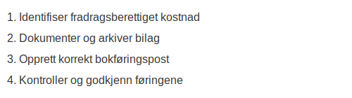

---
title: "Hva er Fradragsføre i Regnskap?"
meta_title: "Hva er Fradragsføre i Regnskap?"
meta_description: '**Ã… fradragsføre** handler om selve prosessen med Ã¥ bokføre kostnader som **fradrag** i regnskapet slik at virksomhetens skattepliktige inntekt reduseres pÃ...'
slug: hva-er-fradragsfoere
type: blog
layout: pages/single
---

**Å fradragsføre** handler om selve prosessen med å bokføre kostnader som **fradrag** i regnskapet slik at virksomhetens skattepliktige inntekt reduseres på korrekt måte. Dette er et praktisk aspekt av [bokføring](/blogs/regnskap/hva-er-bokforing "Hva er Bokføring? En Komplett Guide til Norsk Bokføringspraksis") og [skatteregnskap](/blogs/regnskap/hva-er-regnskap "Hva er Regnskap? En komplett guide") som sikrer at alle utgifter innregnes i tråd med gjeldende lover og regler.

## Hva betyr å fradragsføre?

Å *fradragsføre* innebærer at en kostnad registreres i regnskapet som et fradrag mot inntektene. Ved riktig fradragsføring sørger man for at kun legitime forretningskostnader reduserer det skattepliktige overskuddet.

## Steg for trinn: Prosess for å fradragsføre

Følgende liste viser hovedtrinnene i prosessen:

* **Identifiser kostnad:** Avklar at utgiften er **fradragsberettiget** og knyttet til virksomhetens drift.
* **Dokumenter bilag:** Sørg for at fakturaer eller kvitteringer oppbevares som [bilag](/blogs/regnskap/hva-er-bilag "Hva er Bilag? Komplett Guide til Regnskapsbilag og Dokumentasjon").
* **Opprett regnskapsbilag:** Opprett en korrekt bokføringspost med dato, beløp og kontonummer.
* **Match mot periode:** Kontroller at kostnaden periodiseres til riktig regnskapsår eller -periode.
* **Kontroller og godkjenn:** Gjennomgå føringer og dokumentasjon i interne rutiner for kvalitetssikring.

## Eksempel på bokføring av fradrag

| Konto                | Debet       | Kredit      | Kommentar                                     |
|----------------------|-------------|-------------|-----------------------------------------------|
| 7800 Driftskostnader | 10 000 kr   |             | Dok. bilag #123 fra leverandør                |
| 2400 Leverandørgjeld |             | 10 000 kr   | Registrering av leverandørfaktura i reskontro |

## Dokumentasjonskrav for fradragsføring

For å sikre korrekte fradrag må dokumentasjonen oppfylle følgende krav:

* **Originalbilag:** Gyldig faktura eller kvittering med alle nødvendige opplysninger.
* **Formål og sammenheng:** Beskrivelse av forretningsformålet bak utgiften.
* **Dato og beløp:** Klare angivelser av dato for kostnadspådragelse og beløp.
* **Leverandørinfo:** Navn, organisasjonsnummer og kontaktinformasjon for leverandør.

## Vanlige fallgruver ved fradragsføring

| Feiltype                    | Risiko                                  | Tiltak                                         |
|-----------------------------|-----------------------------------------|-------------------------------------------------|
| Manglende dokumentasjon     | Fradrag avvist ved skattekontroll       | Innfør strenge arkivrutiner                     |
| Privatandel ikke utskilt   | Feil skattegrunnlag                    | Del opp privat og virksomhetsrelaterte kostnader |
| Feil periodisering          | Feil resultat i avregnet periode        | Implementer faste periodiseringsrutiner         |

## Tips for korrekt fradragsføring

* **Automatiser:** Bruk digitale fakturaløsninger for å redusere manuelle feil.
* **Rutiner:** Etabler klare retningslinjer for bilagsmottak og bokføring.
* **Oppdatering:** Følg med på endringer i lover og regler for fradragsrett.
* **Revisjon:** Gjennomfør internrevisjoner for å sikre etterlevelse og optimal fradragshåndtering.

## Konklusjon

Å **fradragsføre** kostnader på riktig måte er avgjørende for å sikre nøyaktig regnskapsrapportering og optimal skatteposisjon. Ved å følge en strukturert prosess, dokumentere alle bilag og holde seg oppdatert på regelverket, kan virksomheter trygt håndtere fradrag og redusere risikoen for feil og tilleggsavgifter.

