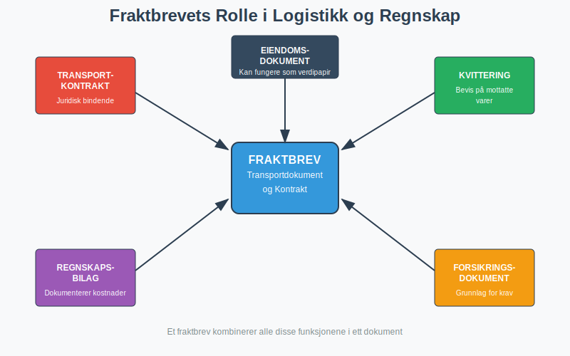
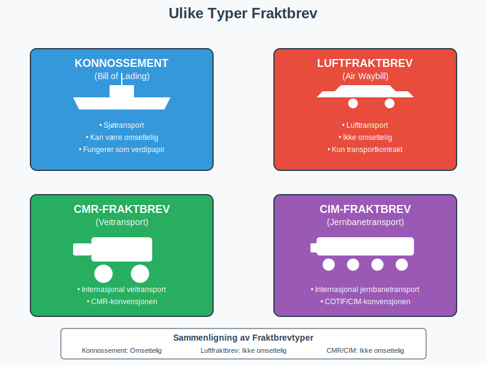
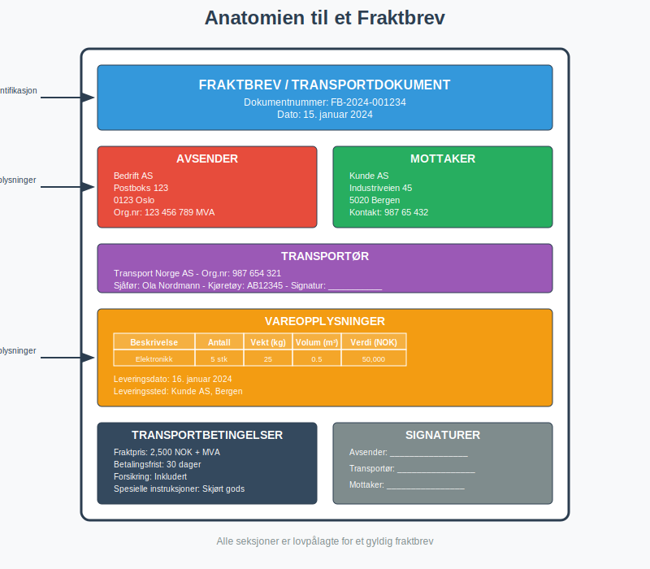
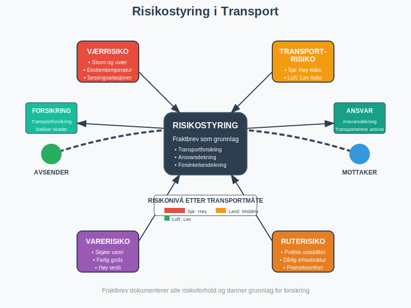

---
title: "Hva er fraktbrev?"
meta_title: "Hva er fraktbrev?"
meta_description: 'Et **fraktbrev** er et juridisk bindende transportdokument som fungerer som kontrakt mellom avsender og transportør for frakt av varer. Dette dokumentet er sen...'
slug: hva-er-fraktbrev
type: blog
layout: pages/single
---

Et **fraktbrev** er et juridisk bindende transportdokument som fungerer som kontrakt mellom avsender og transportør for frakt av varer. Dette dokumentet er sentralt i både logistikk og regnskap, da det dokumenterer transportkostnader, ansvar og leveringsbetingelser. For bedrifter som driver med [engroshandel](/blogs/regnskap/hva-er-engroshandel "Hva er Engroshandel? Komplett Guide til Grossistvirksomhet og B2B-handel") eller [detaljhandel](/blogs/regnskap/hva-er-detaljhandel "Hva er Detaljhandel? Komplett Guide til Butikkdrift og Kundeservice") er korrekt håndtering av fraktbrev essensielt for [dokumentasjon i regnskap og bokføring](/blogs/regnskap/hva-er-dokumentasjon-regnskap-bokforing "Hva er Dokumentasjon i Regnskap og Bokføring? Komplett Guide til Bilag og Arkivering").

For optimal logistikk kan det være lurt å benytte en profesjonell [speditør](/blogs/regnskap/speditor "Hva er en speditør? Guide til speditørtjenester og regnskapsbehandling").

## Seksjon 1: Fraktbrevets Funksjon og Betydning

Et fraktbrev tjener flere kritiske funksjoner i forretningssammenheng og må behandles som et viktig [bilag](/blogs/regnskap/hva-er-bilag "Hva er Bilag? Komplett Guide til Regnskapsbilag og Dokumentasjon") i bedriftens regnskapssystem.

### Hovedfunksjoner:

* **Transportkontrakt:** Etablerer juridisk bindende avtale mellom partene
* **Kvittering:** Bevis på at transportøren har mottatt varene
* **Eiendomsdokument:** Kan fungere som verdipapir for varene under transport
* **Regnskapsbilag:** Dokumenterer transportkostnader for [bokføring](/blogs/regnskap/hva-er-bokforing "Hva er Bokføring? Komplett Guide til Regnskapsføring og Bilagsbehandling")
* **Forsikringsdokument:** Grunnlag for eventuelle forsikringskrav

## Seksjon 2: Typer Fraktbrev

Det finnes flere typer fraktbrev avhengig av transportmåte og juridiske krav. Valg av fraktbrevtype påvirker både ansvar og regnskapsmessig behandling.

### 2.1 Konnossement (Bill of Lading)

**Konnossement** brukes ved sjøtransport og er det mest omfattende fraktbrevet. Det har tre hovedfunksjoner:

* **Transportkontrakt** mellom avsender og reder
* **Kvittering** for mottatte varer
* **Verdipapir** som kan omsettes

| Konnossementtype | Beskrivelse | Omsettbarhet |
|------------------|-------------|--------------|
| Rektakonnossement | Utstedt til navngitt mottaker | Ikke omsettelig |
| Ordrekonnossement | Utstedt til ordre | Omsettelig ved endossering |
| Ihendehaverkonnossement | Utstedt til ihendehaver | Fritt omsettelig |

### 2.2 Luftfraktbrev (Air Waybill)

Brukes ved lufttransport og er **ikke omsettelig**. Det fungerer primært som:

* Transportkontrakt
* Kvittering for varer
* Instruksjoner til transportør

### 2.3 Veifrakt-/Jernbanefraktbrev

For landtransport brukes spesialiserte fraktbrev som følger nasjonale og internasjonale konvensjoner:

* **CMR-fraktbrev:** For internasjonal veitransport
* **CIM-fraktbrev:** For internasjonal jernbanetransport
* **Nasjonale fraktbrev:** For innenlandsk transport

## Seksjon 3: Obligatorisk Innhold i Fraktbrev

For at et fraktbrev skal være juridisk gyldig og fungere som korrekt [regnskapsbilag](/blogs/regnskap/hva-er-bilag "Hva er Bilag? Komplett Guide til Regnskapsbilag og Dokumentasjon"), må det inneholde spesifikke opplysninger.

### Lovpålagte Opplysninger:

1. **Avsenderopplysninger:**
   - Navn og adresse
   - Organisasjonsnummer
   - Kontaktinformasjon

2. **Mottakeropplysninger:**
   - Navn og adresse
   - Leveringssted hvis forskjellig

3. **Transportøropplysninger:**
   - Transportselskap
   - Førernavn og signatur
   - Kjøretøyinformasjon

4. **Vareopplysninger:**
   - Detaljert beskrivelse av varer
   - Antall kolli
   - Vekt og volum
   - Verdi for forsikringsformål

5. **Transportbetingelser:**
   - Fraktpris og betalingsbetingelser
   - Leveringsdato og -tid
   - Spesielle instruksjoner

## Seksjon 4: Regnskapsmessig Behandling

Fraktbrev må behandles korrekt i regnskapet for å sikre nøyaktig kostnadsføring og overholdelse av [bokføringsloven](/blogs/regnskap/hva-er-bokforingsloven "Hva er Bokføringsloven? Komplett Guide til Norsk Regnskapslovgivning").

### 4.1 Bokføring av Fraktkostnader

Fraktkostnader kan behandles på ulike måter avhengig av situasjonen:

| Scenario | Kontotype | Behandling |
|----------|-----------|------------|
| Innkjøpsfraktkostnader | Varekostnad | Tillegges [anskaffelseskost](/blogs/regnskap/hva-er-anskaffelseskost "Hva er Anskaffelseskost? Komplett Guide til Kostpris og Verdsettelse") |
| Salgsfraktkostnader | Driftskostnad | Føres som salgskostnad |
| Returfrakt | Varekostnad/Driftskostnad | Avhenger av årsak til retur |

### 4.2 MVA-behandling

**Frakttjenester** er normalt MVA-pliktige i Norge:

* **Innenlandsk frakt:** 25% MVA
* **Internasjonal frakt:** Kan være fritatt eller ha redusert sats
* **Kombinerte tjenester:** MÃ¥ vurderes individuelt

For korrekt MVA-behandling, se vår guide til [avgiftsplikt (MVA)](/blogs/regnskap/hva-er-avgiftsplikt-mva "Hva er Avgiftsplikt (MVA)? Komplett Guide til Merverdiavgift i Norge").

### 4.3 Attestering og Kontroll

Fraktbrev må gjennom samme [attesteringsprosess](/blogs/regnskap/hva-er-attestering "Hva er Attestering? En Komplett Guide til Bilagsbehandling og Godkjenning") som andre regnskapsbilag:

* **Saklig kontroll:** Er frakttjenesten utført som avtalt?
* **Regnskapsmessig kontroll:** Er fraktbrevet korrekt kontert?
* **Økonomisk kontroll:** Er kostnaden innenfor budsjett?

## Seksjon 5: Digitalisering av Fraktbrev

Moderne logistikk beveger seg mot digitale løsninger som kan integreres med [ERP-systemer](/blogs/regnskap/hva-er-erp-system "Hva er ERP-system? Komplett Guide til Forretningssystemer og Integrasjon") for automatisert behandling.

### Fordeler med Digitale Fraktbrev:

* **Raskere behandling:** Eliminerer papirbasert håndtering
* **Bedre sporbarhet:** Sanntidsoppdateringer av forsendelser
* **Reduserte kostnader:** Mindre administrativt arbeid
* **Miljøvennlig:** Reduserer papirforbruk
* **Automatisk integrasjon:** Direkte kobling til regnskapssystem

### Teknologiske Løsninger:

* **EDI (Electronic Data Interchange):** Standardisert elektronisk datautveksling
* **API-integrasjoner:** Direkte systemkommunikasjon
* **Blockchain:** Sikker og transparent dokumentasjon
* **IoT-sensorer:** Sanntidsovervåking av forsendelser

## Seksjon 6: Internasjonale Konvensjoner

Ved internasjonal handel reguleres fraktbrev av internasjonale konvensjoner som påvirker ansvar og erstatning.

### Viktige Konvensjoner:

| Konvensjon | Transportmåte | Hovedbestemmelser |
|------------|---------------|-------------------|
| Haag-Visby reglene | Sjøtransport | Begrenser reders ansvar |
| Montreal-konvensjonen | Lufttransport | Regulerer flyselskaps ansvar |
| CMR-konvensjonen | Veitransport | Europeisk veitransportrett |
| COTIF/CIM | Jernbanetransport | Internasjonal jernbanetransport |

### Ansvarsbegrensninger

De fleste internasjonale konvensjoner har **ansvarsbegrensninger** som påvirker forsikringsbehov:

* **Sjøfrakt:** Ofte begrenset til SDR (Special Drawing Rights) per kolli
* **Luftfrakt:** Begrenset erstatning per kilo
* **Landtransport:** Varierer etter konvensjon og nasjonale regler

## Seksjon 7: Forsikring og Risikostyring

Fraktbrev er grunnlaget for **transportforsikring** og risikohåndtering i logistikken.

### Forsikringstyper:

* **Transportforsikring:** Dekker skade på varer under transport
* **Ansvarsdekning:** Dekker transportørens ansvar
* **Forsinkelsesdekning:** Kompenserer for forsinket levering

### Risikofaktorer:

* **Transportmåte:** Sjø, luft, land har ulike risikonivåer
* **Varetype:** Skjøre, farlige eller verdifulle varer
* **Transportrute:** Politisk stabilitet og infrastruktur
* **Værforhold:** Sesongvariasjoner og ekstremvær

## Seksjon 8: Praktiske RÃ¥d for Bedrifter

For å optimalisere håndtering av fraktbrev og transportkostnader bør bedrifter implementere systematiske rutiner.

### Best Practices:

1. **Standardiserte Prosedyrer:**
   - Etabler klare rutiner for fraktbrevhåndtering
   - Tren personale i korrekt dokumentasjon
   - Implementer kvalitetskontroll

2. **Leverandørstyring:**
   - Evaluer transportører regelmessig
   - Forhandle rammeavtaler for bedre priser
   - Sikre forsikringsdekning

3. **Kostnadsoptimalisering:**
   - Analyser fraktkostnader regelmessig
   - Vurder konsolidering av forsendelser
   - Utnytt [dekningsbidragsanalyse](/blogs/regnskap/hva-er-dekningsbidrag "Hva er Dekningsbidrag? Komplett Guide til Lønnsomhetsanalyse og Kalkulasjon") for å optimalisere logistikk

4. **Teknologiutnyttelse:**
   - Implementer digitale løsninger
   - Integrer med [ERP-system](/blogs/regnskap/hva-er-erp-system "Hva er ERP-system? Komplett Guide til Forretningssystemer og Integrasjon")
   - Bruk data for kontinuerlig forbedring

### Vanlige Feil å Unngå:

* **Ufullstendig dokumentasjon:** Kan føre til forsinkelser og ekstrakostnader
* **Manglende forsikring:** Eksponerer bedriften for unødvendig risiko
* **Dårlig leverandøroppfølging:** Kan resultere i dårlig service og høye kostnader
* **Ineffektiv [bilagsføring](/blogs/regnskap/hva-er-bilagsforing "Hva er Bilagsføring? Komplett Guide til Registrering og Arkivering av Regnskapsbilag"):** Kompliserer regnskapsarbeid og revisjon

## Seksjon 9: Juridiske Aspekter og Tvister

Fraktbrev er juridiske dokumenter som kan være grunnlag for tvister og rettslige prosesser.

### Vanlige Tvisteområder:

* **Skade på varer:** Hvem er ansvarlig og hvor mye erstatning?
* **Forsinkelser:** Konsekvenser og kompensasjon
* **Manglende levering:** Ansvar og erstatningsplikt
* **Fraktpriser:** Uenighet om kostnader og tillegg

### Tvisteløsning:

1. **Direkte forhandling:** Første skritt i konfliktløsning
2. **Mekling:** Nøytral tredjepart fasiliterer løsning
3. **Voldgift:** Bindende avgjørelse av voldgiftsrett
4. **Rettslig prosess:** Siste utvei ved komplekse tvister

### Bevissikring:

For å sikre sterke juridiske posisjoner bør bedrifter:

* **Dokumentere alt:** Fotografier, korrespondanse, vitner
* **Oppbevare originaldokumenter:** Følg [arkiveringskrav](/blogs/regnskap/hva-er-dokumentasjon-regnskap-bokforing "Hva er Dokumentasjon i Regnskap og Bokføring? Komplett Guide til Bilag og Arkivering")
* **Reagere raskt:** Overhold frister for reklamasjon
* **Søk juridisk bistand:** Ved komplekse saker

## Seksjon 10: Fremtidige Trender

Transportbransjen gjennomgår betydelige endringer som påvirker fraktbrevets rolle og funksjon.

### Teknologiske Innovasjoner:

* **Kunstig intelligens:** Automatisert dokumentbehandling og [fakturatolk](/blogs/regnskap/hva-er-fakturatolk "Hva er Fakturatolk? Automatisk Fakturabehandling og OCR-teknologi")
* **Blockchain:** Uforanderlig dokumentasjon og smart contracts
* **IoT og sensorer:** Sanntidsovervåking av forsendelser
* **Autonome kjøretøy:** Endrer ansvar og dokumentasjonskrav

### Regulatoriske Endringer:

* **Miljøkrav:** Økte krav til bærekraftig transport
* **Digitalisering:** Krav til elektronisk dokumentasjon
* **Datasikkerhet:** GDPR og andre personvernregler
* **Internasjonal harmonisering:** Standardisering av prosedyrer

### Påvirkning på Regnskap:

Disse endringene vil påvirke hvordan fraktbrev behandles i regnskapet:

* **Automatisert [bilagsregistrering](/blogs/regnskap/hva-er-bilagsregistrere "Hva er Bilagsregistrere? Komplett Guide til Digital Bilagsbehandling")**
* **Sanntids kostnadsoppfølging**
* **Integrert rapportering**
* **Forbedret [internkontroll](/blogs/regnskap/hva-er-attestering "Hva er Attestering? En Komplett Guide til Bilagsbehandling og Godkjenning")**

Bedrifter som tilpasser seg disse trendene tidlig vil oppnå konkurransefortrinn gjennom mer effektiv logistikk og bedre kostnadskontroll. Det er viktig å holde seg oppdatert på utviklingen og vurdere hvordan nye teknologier kan integreres i eksisterende [ERP-systemer](/blogs/regnskap/hva-er-erp-system "Hva er ERP-system? Komplett Guide til Forretningssystemer og Integrasjon") og regnskapsprosesser.

Korrekt håndtering av fraktbrev er essensielt for moderne bedrifter som driver med fysiske varer. Ved å forstå de juridiske, regnskapsmessige og praktiske aspektene kan bedrifter optimalisere sin logistikk, redusere risiko og sikre korrekt [dokumentasjon i regnskap og bokføring](/blogs/regnskap/hva-er-dokumentasjon-regnskap-bokforing "Hva er Dokumentasjon i Regnskap og Bokføring? Komplett Guide til Bilag og Arkivering").

