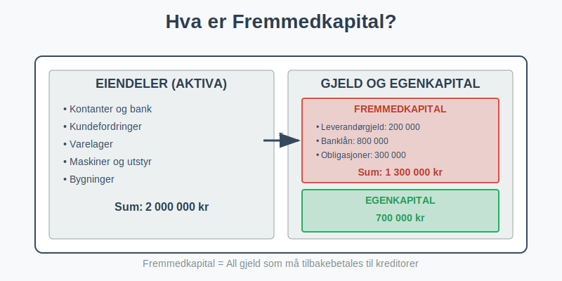
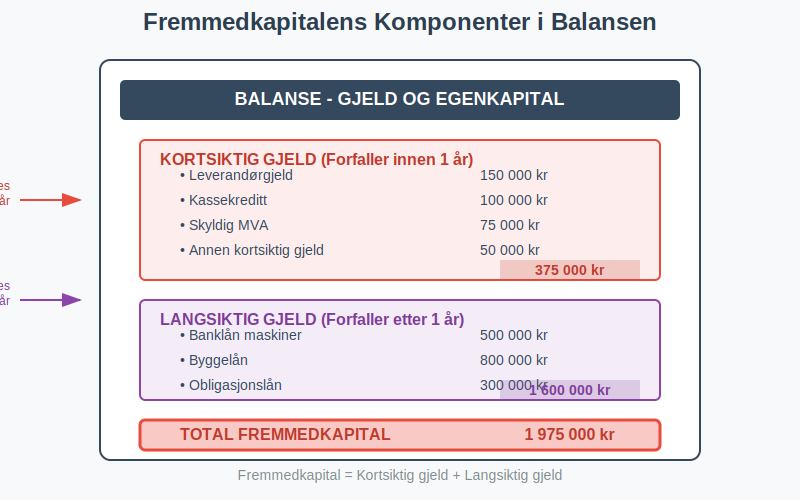
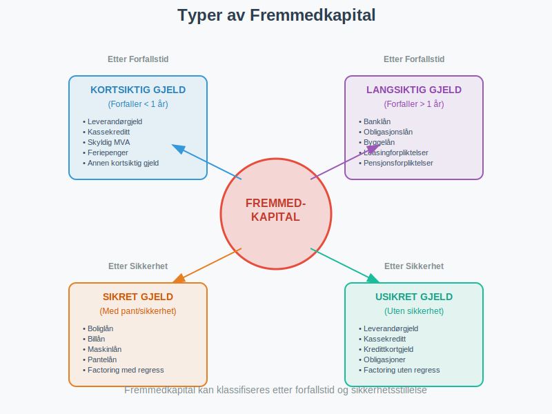
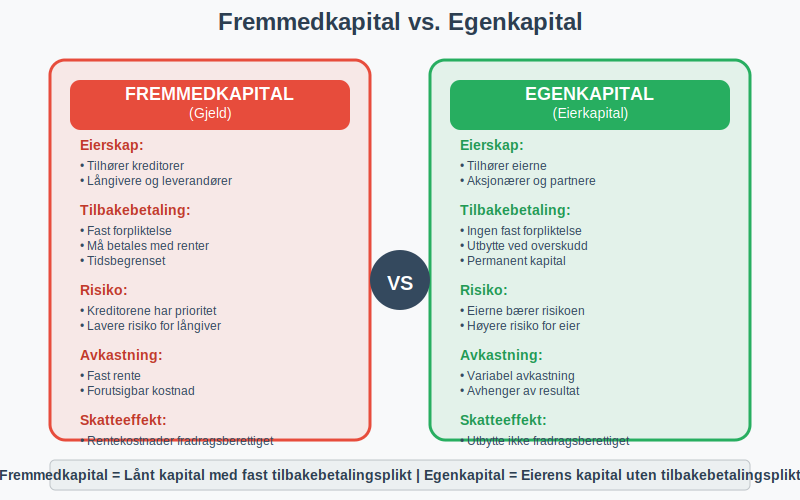
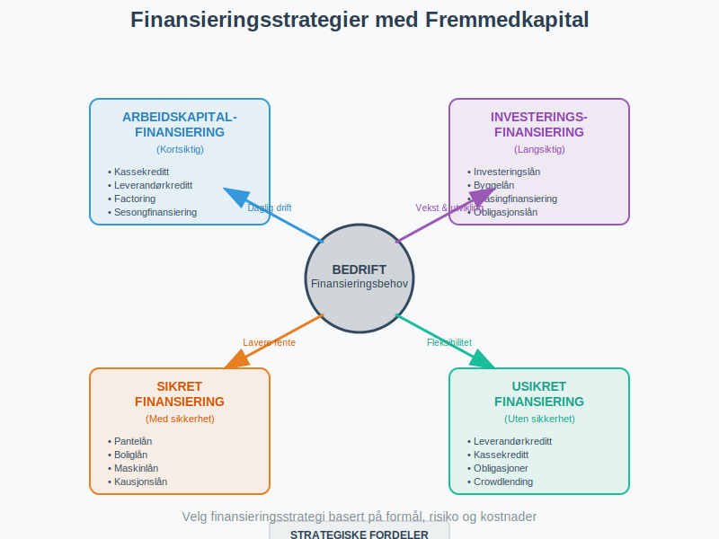

---
title: "Hva er Fremmedkapital?"
meta_title: "Hva er Fremmedkapital?"
meta_description: '**Fremmedkapital** er den delen av et selskaps totale [kapital](/blogs/regnskap/hva-er-kapital "Hva er Kapital? Komplett Guide til Kapitaltyper i Regnskap og Ø...'
slug: hva-er-fremmedkapital
type: blog
layout: pages/single
---

**Fremmedkapital** er den delen av et selskaps totale [kapital](/blogs/regnskap/hva-er-kapital "Hva er Kapital? Komplett Guide til Kapitaltyper i Regnskap og Økonomi") som kommer fra kreditorer og långivere. Som motsetning til [egenkapital](/blogs/regnskap/hva-er-egenkapital "Hva er Egenkapital? Komplett Guide til Egenkapital i Regnskap"), representerer fremmedkapital all gjeld som selskapet har påtatt seg og som må tilbakebetales med renter. Fremmedkapital er en fundamental del av [finanskapital](/blogs/regnskap/hva-er-finanskapital "Hva er Finanskapital? Definisjon, Typer og Betydning i Regnskap") og spiller en viktig rolle i [regnskap](/blogs/regnskap/hva-er-regnskap "Hva er Regnskap? En komplett guide") og finansiell analyse.

### Definisjon og Grunnleggende Forståelse

Fremmedkapital kan defineres på flere måter:

#### Regnskapsmessig Definisjon
Fremmedkapital = **Total Gjeld (Kortsiktig + Langsiktig)**

Dette omfatter alle forpliktelser som selskapet har overfor eksterne parter og som må tilbakebetales.

#### Økonomisk Perspektiv
Fra et økonomisk perspektiv representerer fremmedkapital:
- **Lånt kapital** fra kreditorer og långivere
- Forpliktelser som må tilbakebetales med **renter**
- **Tidsbegrenset** finansiering med faste vilkår
- Kapital som gir kreditorene **prioritet** ved konkurs

### Fremmedkapitalens Komponenter

Fremmedkapital består av flere hovedkategorier som vises i [balansen](/blogs/regnskap/hva-er-balanse "Hva er Balanse? Komplett Guide til Balanseregnskap"):

#### 1. Kortsiktig Gjeld (Forfaller innen 1 år)

**Leverandørgjeld**
- Gjeld til leverandører for varer og tjenester
- Vanligvis 30-60 dagers betalingsfrist
- Rentefri kreditt i kredittperioden

**Kortsiktig banklån**
- Kassekreditt og driftskreditt
- Fleksibel finansiering av arbeidskapital
- Variabel rente

**Skyldig offentlige avgifter**
- [Arbeidsgiveravgift](/blogs/regnskap/hva-er-arbeidsgiveravgift "Hva er Arbeidsgiveravgift? Satser, Beregning og Innbetaling")
- **MVA** som skal betales til staten
- **Forskuddstrekk** fra ansatte

**Annen kortsiktig gjeld**
- Påløpte kostnader
- [Feriepenger](/blogs/regnskap/hva-er-feriepenger "Hva er Feriepenger? Beregning, Opptjening og Utbetaling")
- Utbytte som skal utbetales

#### 2. [Langsiktig Gjeld](/blogs/regnskap/langsiktig-gjeld "Hva er Langsiktig Gjeld? Komplett Guide til Langsiktige Forpliktelser") (Forfaller etter 1 år)

**Langsiktige banklån**
- Investeringslån for maskiner og utstyr
- Byggelån og eiendomslån
- Fast eller variabel rente

**Obligasjonslån**
- LÃ¥n fra obligasjonsmarkedet
- Standardiserte lånevilkår
- Omsettelige verdipapirer

**Leasingforpliktelser**
- Finansiell leasing av eiendeler
- Operasjonell leasing (IFRS 16)
- Langsiktige leiekontrakter

### Beregning og Analyse av Fremmedkapital

La oss se på praktiske eksempler på hvordan fremmedkapital beregnes og analyseres:

#### Eksempel: Fremmedkapitalstruktur

| **Gjeldstype** | **Beløp (NOK)** | **Rente** | **Forfallstid** |
|----------------|-----------------|-----------|-----------------|
| **KORTSIKTIG GJELD** | | | |
| Leverandørgjeld | 150 000 | 0% | 30 dager |
| Kassekreditt | 100 000 | 8,5% | Løpende |
| Skyldig MVA | 75 000 | 0% | 2 måneder |
| Annen kortsiktig gjeld | 50 000 | 0% | Varierende |
| **Sum kortsiktig gjeld** | **375 000** | | |
| | | | |
| **LANGSIKTIG GJELD** | | | |
| Banklån maskiner | 500 000 | 6,2% | 5 år |
| Byggelån | 800 000 | 5,8% | 15 år |
| Obligasjonslån | 300 000 | 7,1% | 3 år |
| **Sum langsiktig gjeld** | **1 600 000** | | |
| | | | |
| **TOTAL FREMMEDKAPITAL** | **1 975 000** | | |

**Gjennomsnittlig rentekostnad:** (100 000 × 8,5% + 500 000 × 6,2% + 800 000 × 5,8% + 300 000 × 7,1%) / 1 700 000 = **6,4%**

### Fremmedkapital vs. Egenkapital

Det er viktig å forstå de grunnleggende forskjellene mellom **fremmedkapital** og **[egenkapital](/blogs/regnskap/hva-er-egenkapital "Hva er Egenkapital? Komplett Guide til Egenkapital i Regnskap")**:

#### Fremmedkapital
- Tilhører **kreditorer** og långivere
- **Fast forpliktelse** til tilbakebetaling
- Kreditorene har **prioritet** ved konkurs
- **Fast rente** eller avkastning
- **Tidsbegrenset** kapital med forfallsdato
- **Skattefradrag** for rentekostnader

#### Egenkapital
- Tilhører **eierne** av selskapet
- **Ingen fast forpliktelse** til tilbakebetaling
- Eierne bærer **risikoen** for tap
- **Variabel avkastning** gjennom utbytte
- **Permanent** kapital uten forfallsdato
- **Ingen skattefradrag** for utbyttekostnader

### Gjeldsgrad og Finansiell Risiko

#### Beregning av Gjeldsgrad

**Gjeldsgrad = Fremmedkapital / Egenkapital**

Gjeldsgraden viser forholdet mellom lånt kapital og eierkapital:

| **Gjeldsgrad** | **Vurdering** | **Risiko** | **Betydning** |
|----------------|---------------|------------|---------------|
| Under 0,5 | Konservativ | Lav | Solid finansiell struktur |
| 0,5 - 1,0 | Moderat | Middels | Balansert finansiering |
| 1,0 - 2,0 | Aggressiv | Høy | Høy gjeldsbelastning |
| Over 2,0 | Risikabel | Meget høy | Kritisk finansiell situasjon |

#### Rentedekningsgrad

**Rentedekningsgrad = EBIT / Rentekostnader**

Dette nøkkeltallet viser selskapets evne til å betjene sin gjeld:

| **Rentedekningsgrad** | **Vurdering** | **Betydning** |
|----------------------|---------------|---------------|
| Over 5 | Meget god | Trygg gjeldsbetjening |
| 3-5 | God | Akseptabel sikkerhet |
| 2-3 | Middels | Noe risiko |
| 1-2 | Svak | Høy risiko |
| Under 1 | Kritisk | Kan ikke betjene gjeld |

### Fordeler og Ulemper med Fremmedkapital

#### Fordeler med Fremmedkapital

**1. Skattefordel**
- **Rentekostnader** er fradragsberettiget
- Reduserer selskapets skattebyrde
- **Skatteskjold** på renteutgifter

**2. Bevarer Eierskap**
- Eierne beholder **full kontroll**
- Ingen utvanning av eierandeler
- **Gearing-effekt** på avkastning

**3. Fleksibilitet**
- Kan tilbakebetales **før forfall**
- Mulighet for **refinansiering**
- Tilpassede **lånevilkår**

**4. Lavere Kapitalkostnad**
- Gjeld er ofte **billigere** enn egenkapital
- Fast rente gir **forutsigbarhet**
- Kreditorene krever lavere avkastning enn eierne

#### Ulemper med Fremmedkapital

**1. Finansiell Risiko**
- **Fast forpliktelse** til tilbakebetaling
- Risiko for **konkurs** ved betalingsproblemer
- **Kovenanter** og lånevilkår som begrenser handlingsrom

**2. Rentekostnader**
- **Løpende kostnader** uavhengig av resultat
- **Renterisiko** ved variabel rente
- Reduserer **kontantstrøm**

**3. Sikkerhetsstillelse**
- Krav om **pant** i eiendeler og fantegang. Se [Fantegang](/blogs/regnskap/hva-er-fantegang "Hva er Fantegang? En Komplett Guide til Sikringsrettigheter i Norsk Regnskap").
- **Personlig kausjon** fra eierne
- Begrenser fremtidig **låneopptag**

### Fremmedkapital i Ulike Selskapsformer

#### Aksjeselskap (AS)
- **Begrenset ansvar** for aksjonærene
- Selskapet hefter for gjelden med sine eiendeler
- Mulighet for **obligasjonsutstedelse**
- Krav til [aksjekapital](/blogs/regnskap/hva-er-aksjekapital "Hva er Aksjekapital? Krav og Forklaring") som sikkerhet

#### Enkeltpersonforetak
- **Ubegrenset personlig ansvar** for eieren
- Eierens private eiendeler kan tas for gjeld
- Enklere låneopptak for mindre beløp
- Høyere risiko for långivere

#### [Ansvarlig Selskap (ANS)](/blogs/regnskap/ansvarlig-selskap-delt-ansvar "Ansvarlig Selskap og Delt Ansvar: Komplett Guide til ANS")
- **Solidarisk ansvar** for alle deltakere
- Hver deltaker hefter for hele gjelden
- Kompleks ansvarsfordeling
- Krav om avtaler mellom deltakerne

### Finansieringsstrategier med Fremmedkapital

#### Arbeidskapitalfinansiering

**Kortsiktig Finansiering**
- **Kassekreditt** for daglig drift
- **Leverandørkreditt** for innkjøp
- **Factoring** av kundefordringer
- **Sesongfinansiering** for varierende behov

#### Investeringsfinansiering

**Langsiktig Finansiering**
- **Investeringslån** for maskiner og utstyr
- **Byggelån** for eiendom og anlegg
- **Leasingfinansiering** som alternativ til kjøp
- **Obligasjonslån** for større investeringer

### Fremmedkapital og Kontantstrøm

#### Påvirkning på Kontantstrøm

**Operasjonell Kontantstrøm**
- **Renteutbetalinger** reduserer driftskontantstrøm
- **Skattebesparelser** fra rentefradrag
- **Arbeidskapitalendringer** påvirker likviditet

**Finansiell Kontantstrøm**
- **Låneopptag** øker kontantstrøm
- **Avdrag** reduserer kontantstrøm
- **Refinansiering** kan forbedre vilkår

#### Likviditetsstyring

**Viktige Prinsipper:**
1. **Match** løpetid på lån med investeringer
2. **Diversifiser** finansieringskilder
3. **Oppretthold** tilstrekkelig likviditetsreserve
4. **Overvåk** gjeldsforfall og refinansieringsbehov

### Fremmedkapital og Risikostyring

#### Renterisiko

**Typer Renterisiko:**
- **Refinansieringsrisiko** ved forfall
- **Renterisiko** på variabel rente
- **Basisrisiko** mellom ulike rentesatser

**Risikostyring:**
- **Rentesikring** gjennom derivater
- **Mix** av fast og variabel rente
- **Naturlig sikring** mot renterisiko

#### Kredittrisiko

**For LÃ¥ngivere:**
- Risiko for at låntaker ikke kan betale
- **Kredittanalyse** og rating
- **Sikkerhetsstillelse** og kovenanter

**For LÃ¥ntakere:**
- Risiko for **refinansieringsproblemer**
- **Diversifisering** av finansieringskilder
- **Oppbygging** av kreditthistorikk

### Regnskapsføring av Fremmedkapital

#### Balanseføring

**Kortsiktig Gjeld:**
- Føres til **pålydende verdi**
- Klassifiseres som kortsiktig hvis forfall < 1 år
- **Påløpte renter** føres som gjeld

**Langsiktig Gjeld:**
- Kan føres til **amortisert kost**
- **Etableringsgebyrer** amortiseres over løpetiden
- **Omprioritering** til kortsiktig ved nærme forfall

#### Resultatføring

**Rentekostnader:**
- Føres **løpende** i resultatregnskapet
- **Periodisering** av påløpte renter
- **Skattemessig fradrag** for rentekostnader

### Fremmedkapital i Finansiell Analyse

#### Viktige Nøkkeltall

**1. Gjeldsgrad**
Gjeldsgrad = Total gjeld / Egenkapital

**2. Egenkapitalandel**
Egenkapitalandel = Egenkapital / Sum eiendeler

**3. Rentedekningsgrad**
Rentedekningsgrad = EBIT / Rentekostnader

**4. Gjeldsbetjeningsevne**
Gjeldsbetjeningsevne = (EBITDA - Skatt - Investeringer) / (Renter + Avdrag)

#### Benchmarking og Sammenligning

**Bransjestandarder:**
- Sammenlign med **bransjegjennomsnitt**
- Vurder **konjunkturmessige** forhold
- Analyser **historisk utvikling**

### Praktiske RÃ¥d for Fremmedkapitalstyring

#### For Gründere og Små Bedrifter

1. **Start konservativt** - ikke ta for mye gjeld tidlig
2. **Bygg kreditthistorikk** gjennom mindre lån
3. **Diversifiser** finansieringskilder
4. **Oppretthold** god kommunikasjon med långivere
5. **Planlegg** refinansiering i god tid

#### For Etablerte Bedrifter

1. **Optimaliser** kapitalstruktur
2. **Utnytt** skattefordeler ved gjeld
3. **Sikre** mot renterisiko
4. **Overvåk** finansielle nøkkeltall
5. **Vurder** alternative finansieringsformer

#### For Vekstbedrifter

1. **Balanser** vekst og finansiell stabilitet
2. **Utnytt** gearing-effekten forsiktig
3. **Sikre** fleksible lånevilkår
4. **Planlegg** for ulike vekstscenarier
5. **Vurder** hybride finansieringsformer

### Fremtidige Trender innen Fremmedkapital

#### Digitalisering og Fintech

**Nye Finansieringsformer:**
- **Crowdlending** og peer-to-peer utlån
- **Digitale** låneplatformer
- **Automatisert** kredittanalyse
- **Blockchain-baserte** låneløsninger

#### Bærekraftig Finansiering

**Grønne Obligasjoner:**
- **Miljøvennlige** investeringsprosjekter
- **Lavere** rente for bærekraftige lån
- **ESG-kriterier** i kredittanalyse

#### Regulatoriske Endringer

**Basel III og IV:**
- **Strengere** kapitalkrav for banker
- **Påvirkning** på lånetilgjengelighet
- **Økte** kostnader for risikofylte lån

### Konklusjon

Fremmedkapital er en fundamental del av bedrifters finansieringsstruktur og spiller en viktig rolle i [regnskapet](/blogs/regnskap/hva-er-regnskap "Hva er Regnskap? En komplett guide"). Ved å forstå de ulike typene fremmedkapital, deres fordeler og ulemper, samt hvordan de påvirker selskapets finansielle stilling, kan bedriftsledere ta informerte beslutninger om optimal kapitalstruktur.

**Nøkkelpunkter å huske:**
- Fremmedkapital må **tilbakebetales** med renter
- Det gir **skattefordeler** gjennom rentefradrag
- **Gjeldsgrad** må balanseres mot finansiell risiko
- **Diversifisering** av finansieringskilder reduserer risiko
- **Timing** av refinansiering er kritisk for suksess

Riktig bruk av fremmedkapital kan **akselerere vekst** og **øke avkastning** på egenkapital, men krever nøye planlegging og kontinuerlig overvåking av finansiell risiko. Ved å kombinere fremmedkapital med [egenkapital](/blogs/regnskap/hva-er-egenkapital "Hva er Egenkapital? Komplett Guide til Egenkapital i Regnskap") på en optimal måte, kan bedrifter oppnå sine strategiske mål samtidig som de opprettholder finansiell stabilitet.
 
 For en fullstendig oversikt over finansieringsformer, se [Hva er Finansiering?](/blogs/regnskap/hva-er-finansiering "Hva er Finansiering? Komplett Guide til Bedriftsfinansiering og Finansieringsformer").

