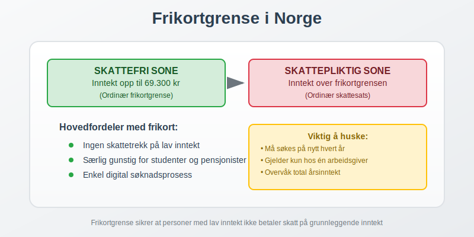
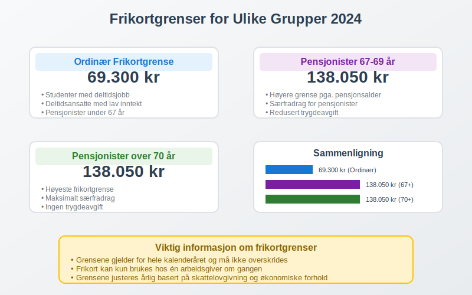
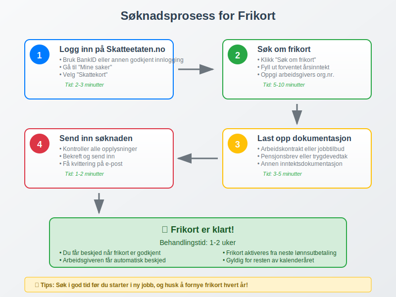
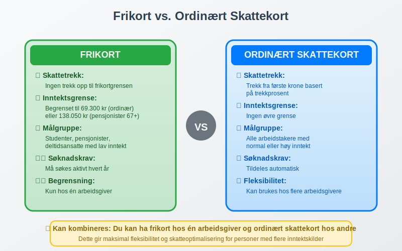
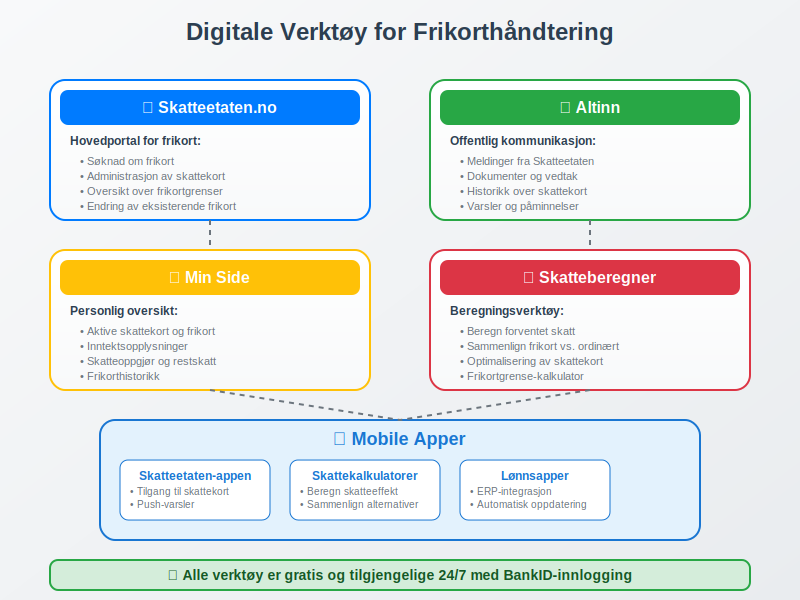

---
title: "Hva er Frikortgrense i Norge?"
seoTitle: "Hva er frikortgrense? | Skattefri inntekt og beløpsgrenser"
description: "Frikortgrense er beløpet du kan tjene skattefritt før det trekkes skatt. Lær hvem som kan bruke frikort, beløpsgrenser og hvordan du søker."
summary: "Hva frikortgrense er, hvem som kan få frikort, og beløpsgrenser i Norge."
---

**Frikortgrense** er det maksimale beløpet du kan tjene skattefritt i Norge før du må betale skatt. **[Frikort](/blogs/regnskap/frikort "Frikort - Skattefri Inntekt for Lavinntektsgrupper")** er et viktig verktøy i det norske skattesystemet som sikrer at personer med lav inntekt ikke betaler skatt på sine første kroner. Dette er særlig relevant for [arbeidstakere](/blogs/regnskap/hva-er-arbeidsforholdstype "Arbeidsforholdstype - Guide til Ulike Ansettelsesformer") med deltidsjobber, studenter, pensjonister og andre med begrenset inntekt.



## Hva er Frikort?

**Frikort** er et [skattekort](/blogs/regnskap/skattekort "Hva er Skattekort? En komplett guide til skattekortregler i Norge") som gjør at du ikke betaler skatt på inntekt opp til en bestemt grense - **frikortgrensen**. Dette systemet er designet for å:

* **Beskytte lavinntektsgrupper** mot skatt på grunnleggende inntekt
* **Forenkle skatteinnbetaling** for personer med lav inntekt
* **Sikre rettferdig beskatning** basert på betalingsevne
* **Redusere administrativt arbeid** for både skattebetalere og [Skatteetaten](/blogs/regnskap/hva-er-altinn "Altinn - Digital Kommunikasjon med Offentlige Myndigheter")

### Hvem Kan Få Frikort?

Frikort kan søkes av:

* **Studenter** med deltidsjobb eller feriejobb
* **Pensjonister** med lav pensjon
* **Deltidsansatte** med lav årsinntekt
* **Sesongarbeidere** med begrenset arbeidsperiode
* **Personer med uføretrygd** eller andre trygdeytelser
* **Arbeidsledige** som tar kortvarige jobber

## Frikortgrenser for 2024

Frikortgrensene varierer avhengig av din situasjon og alder:



### Standard Frikortgrenser

| Kategori | Frikortgrense 2024 | Beskrivelse |
|----------|-------------------|-------------|
| **Ordinær frikortgrense** | 69.300 kr | Standard grense for de fleste |
| **Pensjonister under 67 år** | 69.300 kr | Samme som ordinær grense |
| **Pensjonister 67-69 år** | 138.050 kr | Høyere grense pga. pensjonsalder |
| **Pensjonister over 70 år** | 138.050 kr | Høyeste frikortgrense |
| **Studenter** | 69.300 kr | Gjelder ved siden av studier |

### Beregning av Frikortgrense

Frikortgrensen beregnes basert på:

* **[Personfradrag](/blogs/regnskap/hva-er-forskuddstrekk "Forskuddstrekk - Beregning og Praktiske Eksempler")** i inntektsskatten
* **Minstefradrag** i [arbeidsinntekt](/blogs/regnskap/hva-er-fastlonn "Fastlønn - Beregning, Feriepenger og Arbeidsgiveravgift")
* **Særfradrag** for pensjonister
* **Trygdeavgift** og andre avgifter

## Hvordan Søke om Frikort

Prosessen for å søke frikort er enkel og kan gjøres digitalt:



### Søknadsprosess

1. **Logg inn på Skatteetaten.no**
   * Bruk BankID eller annen godkjent innlogging
   * Gå til "Mine saker" og velg "Skattekort"

2. **Velg "Søk om frikort"**
   * Fyll ut nødvendig informasjon om forventet inntekt
   * Oppgi arbeidsgivers organisasjonsnummer hvis aktuelt

3. **Dokumenter forventet inntekt**
   * Arbeidskontrakt eller tilbud om jobb
   * Pensjonsbrev eller trygdevedtak
   * Annen dokumentasjon på inntektsgrunnlag

4. **Send inn søknaden**
   * Søknaden behandles normalt innen 1-2 uker
   * Du får beskjed når frikort er klart

### Frister for Frikort

* **Søknadsfrist**: Ingen fast frist, men søk i god tid
* **Gyldighetstid**: Frikort gjelder for ett kalenderår
* **Fornyelse**: Må søkes på nytt hvert år
* **Endringer**: Kan endres underveis hvis inntekt endrer seg

## Praktiske Eksempler

La oss se på hvordan frikortgrensen fungerer i praksis:

### Eksempel 1: Student med Deltidsjobb

**Situasjon:**
- Student som jobber deltid ved siden av studier
- Forventet årsinntekt: 50.000 kr
- Frikortgrense: 69.300 kr

**Resultat:**
- Hele inntekten på 50.000 kr er skattefri
- Ingen [forskuddstrekk](/blogs/regnskap/hva-er-forskuddstrekk "Forskuddstrekk - Alt du Trenger å Vite") trekkes fra lønnen
- Ingen skatt å betale ved [skatteoppgjøret](/blogs/regnskap/skatteoppgjor "Skatteoppgjør Guide: Prosess, Tidslinje og Viktige Frister")

### Eksempel 2: Pensjonist over 70 år

**Situasjon:**
- Pensjonist, 72 år
- Årlig pensjon: 120.000 kr
- Frikortgrense: 138.050 kr

**Resultat:**
- Hele pensjonen på 120.000 kr er skattefri
- Ingen trekk i pensjonsutbetalingen
- Betydelig skattebesparelse sammenlignet med ordinær beskatning

### Eksempel 3: Overskridelse av Frikortgrense

**Situasjon:**
- Deltidsansatt med frikort
- Frikortgrense: 69.300 kr
- Faktisk inntekt: 85.000 kr

**Resultat:**
- Skattefri inntekt: 69.300 kr
- Skattepliktig inntekt: 85.000 - 69.300 = 15.700 kr
- Skatt må betales på 15.700 kr ved skatteoppgjøret

## Frikort vs. Ordinært Skattekort

Forskjellene mellom frikort og ordinært skattekort:



### Sammenligningstabell

| Aspekt | Frikort | Ordinært Skattekort |
|--------|---------|-------------------|
| **Skattetrekk** | Ingen trekk opp til grensen | Trekk fra første krone |
| **Inntektsgrense** | Begrenset til frikortgrense | Ingen øvre grense |
| **Målgruppe** | Lavinntektsgrupper | Alle arbeidstakere |
| **Søknadskrav** | Må søkes aktivt | Tildeles automatisk |
| **Fleksibilitet** | Kan kombineres med ordinært kort | Standard løsning |

## Kombinasjon med Ordinært Skattekort

Det er mulig å ha både frikort og ordinært skattekort samtidig:

* **Frikort hos en arbeidsgiver** for inntekt opp til frikortgrensen
* **Ordinært skattekort hos annen arbeidsgiver** for tilleggsinntekt
* **Automatisk overgang** når frikortgrensen overskrides

### Praktisk Håndtering

1. **Prioriter arbeidsgivere**
   * Gi frikort til arbeidsgiver med lavest lønn
   * Bruk ordinært kort for høyere lønninger

2. **Overvåk inntektsutviklingen**
   * Hold oversikt over total årsinntekt
   * Vurder å endre skattekort hvis nødvendig

3. **Kommuniser med arbeidsgivere**
   * Informer om endringer i skattekort
   * Sørg for korrekt [lønnsbehandling](/blogs/regnskap/hva-er-bilagsforing "Bilagsføring - Systematisk Registrering av Regnskapsbilag")

## Konsekvenser ved Overskridelse

Hvis du tjener mer enn frikortgrensen, får det følgende konsekvenser:

### Skattemessige Konsekvenser

* **Etterskuddsskatt**: Skatt på inntekt over grensen
* **Rentekostnader**: Renter på for lite betalt skatt
* **Økt skattekort**: Høyere trekk neste år for å unngå gjentakelse

### Hvordan Håndtere Overskridelse

1. **Varsle Skatteetaten**
   * Meld fra om endret inntekt så snart som mulig
   * Be om nytt skattekort med riktig trekkprosent

2. **Sett av penger til skatt**
   * Beregn omtrentlig skatt på merinntekt
   * Sett av midler til skatteoppgjøret

3. **Vurder forskuddsbetaling**
   * Betal inn ekstra skatt underveis
   * Unngå store beløp ved skatteoppgjøret

## Frikort og Arbeidsgiveravgift

For arbeidsgivere er det viktig å forstå sammenhengen mellom frikort og [arbeidsgiveravgift](/blogs/regnskap/hva-er-arbeidsgiveravgift "Arbeidsgiveravgift - Satser, Beregning og Praktiske Eksempler"):

### Arbeidsgivers Ansvar

* **Respektere frikort**: Ikke trekke skatt opp til frikortgrensen
* **Betale arbeidsgiveravgift**: Avgift beregnes av hele lønnen
* **Korrekt rapportering**: Rapportere lønn og frikort til myndighetene
* **Overvåke grenser**: Varsle ansatt ved overskridelse

### Regnskapsmessig Behandling

Frikort påvirker [lønnsregnskapet](/blogs/regnskap/hva-er-bokforing "Bokføring - Grunnleggende Prinsipper og Praktisk Gjennomføring") på følgende måte:

```
Bruttolønn:           25.000 kr
Skattetrekk (frikort):     0 kr
Arbeidsgiveravgift:    3.570 kr (14,1% av bruttolønn)
Netto utbetaling:     25.000 kr
```

## Digitale Verktøy og Ressurser

Moderne teknologi gjør det enklere å håndtere frikort:



### Nyttige Digitale Tjenester

* **Skatteetaten.no**: Søknad og administrasjon av frikort
* **[Altinn](/blogs/regnskap/hva-er-altinn "Altinn - Komplett Guide til Digital Offentlig Kommunikasjon")**: Kommunikasjon med offentlige myndigheter
* **Min Side**: Oversikt over skattekort og frikort
* **Skatteberegner**: Beregn forventet skatt og frikortgrense

### Mobile Apper

* **Skatteetaten-appen**: Tilgang til skattekort på mobil
* **Skattekalkulatorer**: Beregn skatteeffekt av frikort
* **Lønnsapper**: Integrasjon med [lønnssystemer](/blogs/regnskap/hva-er-erp-system "ERP-system - Integrerte Forretningssystemer")

## Fremtidige Endringer og Utvikling

Frikortordningen utvikler seg kontinuerlig:

### Planlagte Endringer

* **Digitalisering**: Mer automatiserte prosesser
* **Økte grenser**: Årlige justeringer basert på [lønnsutvikling](/blogs/regnskap/hva-er-akkordlonn "Akkordlønn - Beregning og Praktiske Eksempler")
* **Forenklet administrasjon**: Mindre byråkrati for brukerne
* **Bedre integrasjon**: Kobling mellom ulike offentlige systemer

### Langsiktige Mål

* **Automatisk tildeling**: Frikort basert på forventet inntekt
* **Sanntidsoppdatering**: Løpende justering av skattekort
* **Personaliserte løsninger**: Tilpasset individuelle behov
* **Økt tilgjengelighet**: Enklere for alle å benytte ordningen

## Vanlige Spørsmål og Misforståelser

### Ofte Stilte Spørsmål

**Q: Kan jeg ha frikort hos flere arbeidsgivere samtidig?**
A: Nei, frikort kan bare brukes hos én arbeidsgiver om gangen. Total frikortgrense gjelder for all inntekt.

**Q: Hva skjer hvis jeg glemmer å søke om frikort?**
A: Du kan søke når som helst i løpet av året, men får ikke tilbakebetalt skatt som allerede er trukket.

**Q: Påvirker frikort andre ytelser som barnetrygd?**
A: Nei, frikort påvirker ikke andre offentlige ytelser eller støtteordninger.

**Q: Kan jeg få frikort som selvstendig næringsdrivende?**
A: Nei, frikort gjelder kun for [arbeidsinntekt](/blogs/regnskap/hva-er-fastlonn "Fastlønn og Arbeidsforhold") og pensjoner, ikke næringsinntekt.

### Vanlige Misforståelser

* **"Frikort betyr ingen skatt i det hele tatt"**
  - Feil: Gjelder kun opp til frikortgrensen

* **"Frikort fornyes automatisk"**
  - Feil: Må søkes på nytt hvert år

* **"Frikort kan deles mellom arbeidsgivere"**
  - Feil: Kan kun brukes hos én arbeidsgiver

## Konklusjon

**Frikortgrense** er et viktig verktøy i det norske skattesystemet som sikrer at personer med lav inntekt ikke betaler skatt på sine første kroner. Ordningen er særlig verdifull for studenter, pensjonister, deltidsansatte og andre med begrenset inntekt.

### Viktige Punkter å Huske

* **Søk i tide**: Frikort må søkes aktivt hvert år
* **Overvåk inntekt**: Hold oversikt over total årsinntekt
* **Kommuniser endringer**: Varsle Skatteetaten ved endret inntekt
* **Kombiner smart**: Bruk frikort strategisk sammen med ordinært skattekort
* **Utnytt digitale verktøy**: Bruk Skatteetaten.no og andre digitale tjenester

Frikortordningen gjør det enklere for personer med lav inntekt å delta i arbeidslivet uten å bekymre seg for skattetrekk på grunnleggende inntekt. Ved å forstå reglene og bruke ordningen riktig, kan du optimalisere din [økonomiske situasjon](/blogs/regnskap/hva-er-finansregnskap "Finansregnskap - Grunnleggende Prinsipper og Rapportering") og sikre korrekt skattebehandling.


