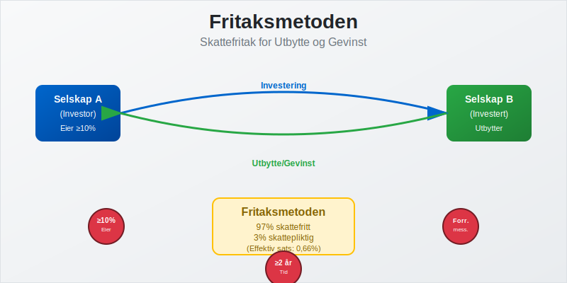
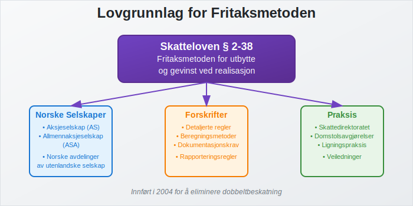
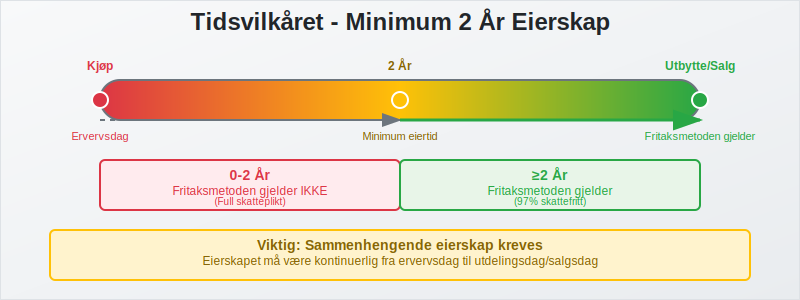
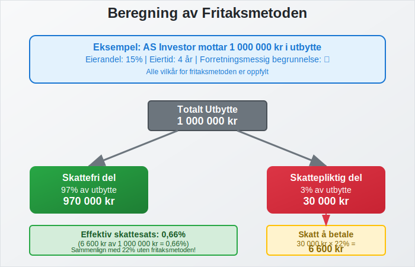
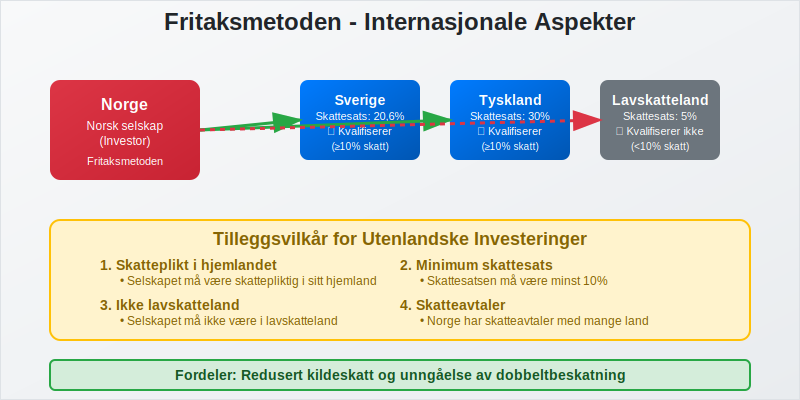

---
title: "Hva er Fritaksmetoden? Komplett Guide til Skattefritak for Utbytte"
seoTitle: "Hva er fritaksmetoden? | Skattefritak på utbytte og aksjegevinst"
description: "Fritaksmetoden gir skattefritak på utbytte og gevinster mellom selskaper når vilkår er oppfylt. Lær vilkår, beregning og praktisk bruk for norske selskaper."
summary: "Hva fritaksmetoden er, vilkår som må oppfylles og hvordan skattefritak brukes."
---

**Fritaksmetoden** er en sentral skatteregel i norsk skattelovgivning som gir **skattefritak for utbytte og gevinst** ved salg av aksjer mellom selskaper. Denne metoden ble innført for å eliminere **dobbeltbeskatning** og stimulere til investeringer mellom norske bedrifter, og er en viktig del av det norske [skattesystemet](/blogs/regnskap/hva-er-forskuddstrekk "Forskuddstrekk - Komplett Guide til Skatt og Trekk av Lønn") for selskaper.

For en oversikt over skatteregler for aksjegevinster hos både privatpersoner og selskaper, se [Skatt på aksjegevinst](/blogs/regnskap/skatt-pa-aksjegevinst "Skatt på aksjegevinst “ Guide til beskatning av aksjegevinster i Norge").

For en komplett oversikt over hvordan fritaksmetoden fungerer sammen med andre skatteordninger for aksjonærer, se vår [Aksjonærmodellen - Komplett Guide til Norsk Aksjebeskatning](/blogs/regnskap/aksjonaermodellen-guide "Aksjonærmodellen - Komplett Guide til Norsk Aksjebeskatning").

Fritaksmetoden sikrer at [utbytte](/blogs/regnskap/hva-er-aksjekapital "Hva er Aksjekapital? Guide til Egenkapital og Aksjer i AS") og gevinst ved salg av aksjer ikke beskattes på mottakersiden når visse vilkår er oppfylt. Dette gjør det mer attraktivt for selskaper å investere i andre selskaper og bidrar til økt kapitalflyt i norsk næringsliv.



## Seksjon 1: Grunnleggende om Fritaksmetoden

### 1.1 Formål og Bakgrunn

**Fritaksmetoden** ble innført i skatteloven § 2-38 for å løse problemet med **dobbeltbeskatning** av selskapsinntekter. Uten denne regelen ville samme inntekt bli beskattet både i det selskapet som tjener pengene og i det selskapet som mottar utbytte eller gevinst.

**Hovedformålene med fritaksmetoden:**

* **Eliminere dobbeltbeskatning:** Sikre at inntekt ikke beskattes flere ganger
* **Stimulere investeringer:** Gjøre det mer attraktivt å investere i andre selskaper
* **Øke kapitalflyt:** Fremme effektiv allokering av kapital i næringslivet
* **Konkurransedyktighet:** Sikre at norske selskaper kan konkurrere internasjonalt

### 1.2 Lovgrunnlag og Hjemmel

Fritaksmetoden er regulert i **skatteloven § 2-38** og tilhørende forskrifter. Regelen gjelder for:

* **Norske aksjeselskaper (AS)**
* **Allmennaksjeselskaper (ASA)**
* **Norske avdelinger av utenlandske selskaper**
* **Enkelte andre selskapsformer**



## Seksjon 2: Vilkår for Fritaksmetoden

For at fritaksmetoden skal kunne anvendes, må **tre hovedvilkår** være oppfylt samtidig:

### 2.1 Eiervilkåret

**Eiervilkåret** krever at det investerende selskapet eier minst **10% av aksjekapitalen** i det selskapet det mottar utbytte fra eller selger aksjer i.

| Eierandel | Fritaksmetoden | Beskatning |
|-----------|----------------|------------|
| **‰¥ 10%** | œ… Gjelder | Skattefritt |
| **< 10%** | Œ Gjelder ikke | Skattepliktig |

**Viktige punkter ved eiervilkåret:**
* Beregnes basert på **aksjekapital**, ikke stemmerett
* Gjelder både direkte og indirekte eierskap
* Må være oppfylt på tidspunktet for utbytteutdeling eller aksjesalg

### 2.2 Tidsvilkåret

**Tidsvilkåret** krever at aksjene har vært eid i **minst to år** før utbytteutdeling eller salg.

**Beregning av eiertid:**
* Starter fra **ervervsdag** til **utdelingsdag/salgsdag**
* Må være **sammenhengende eierskap**
* Gjelder også ved økning av eierandel over 10%



### 2.3 Forretningsmessighetsvilkåret

**Forretningsmessighetsvilkåret** krever at investeringen har en **forretningsmessig begrunnelse** og ikke primært er skattemotivert.

**Vurderingskriterier:**
* **Forretningsmessig formål:** Investeringen må ha et legitimt forretningsformål
* **Ikke skatteunngåelse:** Hovedformålet kan ikke være skattebesparelse
* **Reell aktivitet:** Det investerte selskapet må drive reell virksomhet

**Eksempler på forretningsmessige begrunnelser:**
* Strategiske investeringer i leverandører eller kunder
* Diversifisering av forretningsportefølje
* Oppkjøp for å oppnå stordriftsfordeler
* Investeringer i teknologi eller kompetanse

## Seksjon 3: Beregning og Praktisk Anvendelse

### 3.1 Beregning av Skattefritak

Når vilkårene er oppfylt, beregnes skattefriheten som følger:

**For utbytte:**
* **97% av mottatt utbytte** er skattefritt
* **3% av mottatt utbytte** er skattepliktig (representerer kostnader)

**For gevinst ved aksjesalg:**
* **97% av gevinsten** er skattefritt
* **3% av gevinsten** er skattepliktig

| Type inntekt | Skattefri del | Skattepliktig del | Effektiv skattesats |
|--------------|---------------|-------------------|-------------------|
| **Utbytte** | 97% | 3% | 0,66% (3% × 22%) |
| **Aksjegevinst** | 97% | 3% | 0,66% (3% × 22%) |

### 3.2 Praktisk Eksempel

**Eksempel: AS Investor mottar utbytte**

AS Investor eier 15% av aksjene i AS Produsent siden 2020. I 2024 mottar de 1 000 000 kr i utbytte.

**Beregning:**
* **Mottatt utbytte:** 1 000 000 kr
* **Skattefri del (97%):** 970 000 kr
* **Skattepliktig del (3%):** 30 000 kr
* **Skatt å betale:** 30 000 kr × 22% = 6 600 kr



## Seksjon 4: Tap og Underskudd

### 4.1 Behandling av Tap

**Tap ved salg av aksjer** som omfattes av fritaksmetoden behandles spesielt:

* **97% av tapet** er **ikke fradragsberettiget**
* **3% av tapet** kan **trekkes fra** i skattepliktig inntekt

**Eksempel på tapsfradrag:**
* **Tap ved aksjesalg:** 500 000 kr
* **Ikke fradragsberettiget (97%):** 485 000 kr
* **Fradragsberettiget (3%):** 15 000 kr

### 4.2 Symmetriprinsippet

Fritaksmetoden følger **symmetriprinsippet** - samme behandling for gevinst og tap:

| Situasjon | Gevinst/Utbytte | Tap |
|-----------|-----------------|-----|
| **Skattefri/ikke fradragsberettiget** | 97% | 97% |
| **Skattepliktig/fradragsberettiget** | 3% | 3% |

## Seksjon 5: Internasjonale Aspekter

### 5.1 Utenlandske Selskaper

Fritaksmetoden gjelder også for **investeringer i utenlandske selskaper**, men med strengere vilkår:

**Tilleggsvilkår for utenlandske investeringer:**
* Selskapet må være **skattepliktig** i hjemlandet
* **Skattesatsen** i hjemlandet må være minst **10%**
* Selskapet må ikke være **lavskatteland-selskap**

### 5.2 Skatteavtaler

Norge har **skatteavtaler** med mange land som påvirker fritaksmetodens anvendelse:

* **Redusert kildeskatt** på utbytte fra utlandet
* **Kredittmetode** for skatt betalt i utlandet
* **Unngåelse av dobbeltbeskatning**



## Seksjon 6: Rapportering og Dokumentasjon

### 6.1 Selvangivelse og Rapportering

Selskaper som anvender fritaksmetoden må **dokumentere** at vilkårene er oppfylt:

**Nødvendig dokumentasjon:**
* **Aksjeeierbok** som viser eierandel og eiertid
* **Forretningsmessig begrunnelse** for investeringen
* **Beregninger** av skattefri og skattepliktig del
* **Vedtak** om utbytteutdeling eller aksjesalg

For mer detaljert informasjon om dokumentasjon og praktisk anvendelse av fritaksmetoden i sammenheng med aksjonærbeskatning, se [Aksjonærmodellen - Komplett Guide til Norsk Aksjebeskatning](/blogs/regnskap/aksjonaermodellen-guide "Aksjonærmodellen - Komplett Guide til Norsk Aksjebeskatning").

### 6.2 Bokføring og Regnskapsføring

I [regnskapsføringen](/blogs/regnskap/hva-er-bokforing "Hva er Bokføring? Komplett Guide til Regnskapsføring og Bilag") skal fritaksmetoden behandles som følger:

**Bokføring av utbytte:**
```
Bankkonto                    1 000 000
    Utbytteinntekt (skattefri)    970 000
    Utbytteinntekt (skattepliktig) 30 000
```

**Bokføring av aksjegevinst:**
```
Bankkonto                    2 000 000
    Aksjegevinst (skattefri)     1 940 000
    Aksjegevinst (skattepliktig)   60 000
Aksjer (kostpris)            1 000 000
```

## Seksjon 7: Endringer og Fremtidige Utviklinger

### 7.1 Historiske Endringer

Fritaksmetoden har gjennomgått flere **viktige endringer** siden innføringen:

| År | Endring | Konsekvens |
|----|---------|------------|
| **2004** | Innføring av fritaksmetoden | Erstattet tidligere kredittmetode |
| **2014** | Skjerping av forretningsmessighetsvilkåret | Strengere krav til begrunnelse |
| **2019** | Endring av tidsvilkåret | Fra 1 til 2 år eiertid |
| **2022** | Presisering av eiervilkåret | Klargjøring av beregningsmetode |

### 7.2 Fremtidige Utviklinger

**Mulige endringer** som diskuteres:

* **Økt eiervilkår:** Fra 10% til 20% eierandel
* **Lengre tidsvilkår:** Fra 2 til 3 år eiertid
* **Strengere forretningsmessighetsvilkår:** Mer detaljerte krav
* **Internasjonale tilpasninger:** Endringer basert på OECD-retningslinjer

## Seksjon 8: Sammenligning med Andre Metoder

### 8.1 Kredittmetoden

Før fritaksmetoden ble **kredittmetoden** brukt:

| Aspekt | Fritaksmetoden | Kredittmetoden |
|--------|----------------|----------------|
| **Beskatning** | 3% av inntekt | 100% av inntekt |
| **Fradrag** | Nei | Ja, for betalt skatt |
| **Kompleksitet** | Enkel | Kompleks |
| **Administrativt** | Lite arbeid | Mye arbeid |

### 8.2 Internasjonale Modeller

**Sammenligning med andre land:**

* **Sverige:** Lignende fritaksmetode med 95% fritak
* **Danmark:** Utbyttefritak med 100% fritak under visse vilkår
* **Tyskland:** Delvis fritaksmetode med 95% fritak
* **Nederland:** Deltakerfritak med lignende struktur

## Seksjon 9: Praktiske Råd og Anbefalinger

### 9.1 Planlegging og Strategi

**Viktige hensyn ved investeringsplanlegging:**

* **Timing:** Sikre at tidsvilkåret oppfylles før utbytteutdeling
* **Eierandel:** Vurdere å øke eierandel til over 10% hvis mulig
* **Dokumentasjon:** Etablere god dokumentasjon av forretningsmessig begrunnelse
* **Skatteoptimalisering:** Koordinere med øvrig [skatteplanlegging](/blogs/regnskap/hva-er-forskuddsbetaling "Forskuddsbetaling - Guide til Forskudd og Skatteinnbetaling")

### 9.2 Vanlige Feil og Fallgruver

**Typiske feil som bør unngås:**

* **Manglende dokumentasjon** av forretningsmessig begrunnelse
* **Feil beregning** av eiertid eller eierandel
* **Utilstrekkelig rapportering** i selvangivelsen
* **Manglende oppfølging** av endringer i regelverket


## Seksjon 10: Konklusjon og Oppsummering

**Fritaksmetoden** er et kraftig verktøy for norske selskaper som ønsker å investere i andre selskaper uten å bli rammet av dobbeltbeskatning. Ved å oppfylle de **tre hovedvilkårene** - eierskap på minst 10%, eiertid på minst to år, og forretningsmessig begrunnelse - kan selskaper oppnå betydelige skattefordeler.

**Nøkkelpunkter å huske:**

* **97% skattefritak** for utbytte og aksjegevinst
* **Strenge vilkår** som må oppfylles kontinuerlig
* **God dokumentasjon** er avgjørende for å kunne anvende metoden
* **Regelmessig oppfølging** av regelverksendringer er nødvendig

For selskaper som vurderer investeringer i andre selskaper, er det viktig å planlegge nøye og sikre at alle vilkår oppfylles. Ved tvil bør man konsultere [regnskapsførere](/blogs/regnskap/hva-er-en-regnskapsforer "Hva er en Regnskapsfører? Komplett Guide til Regnskapsføring") eller skatterådgivere for å sikre korrekt anvendelse av fritaksmetoden.
  
## Relaterte artikler

* [Aksjonærmodellen](/blogs/regnskap/aksjonaermodellen-guide "Aksjonærmodellen - Komplett Guide til Norsk Aksjebeskatning")
Fritaksmetoden vil fortsette å være en sentral del av norsk skattelovgivning og spille en viktig rolle i å stimulere investeringer og kapitalflyt mellom norske bedrifter.


