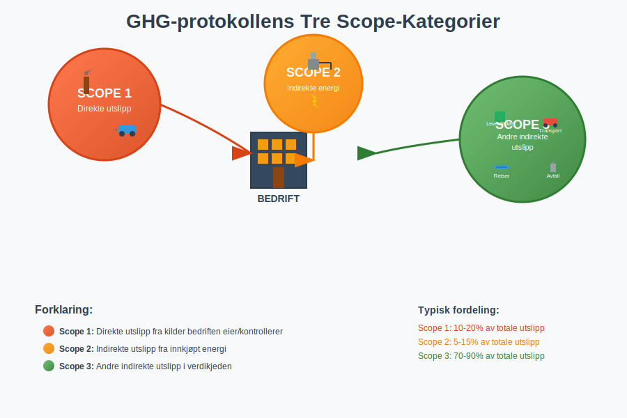
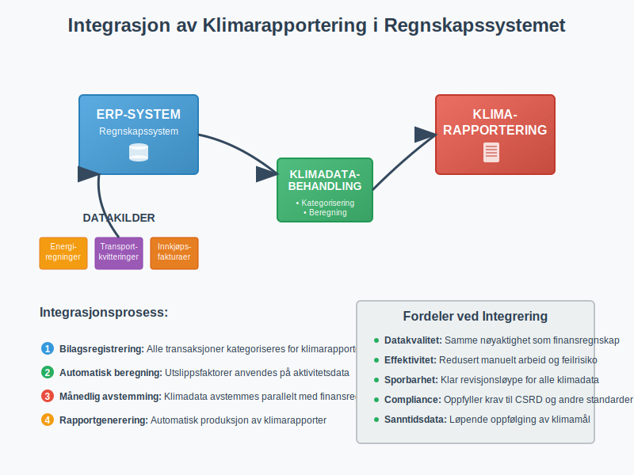
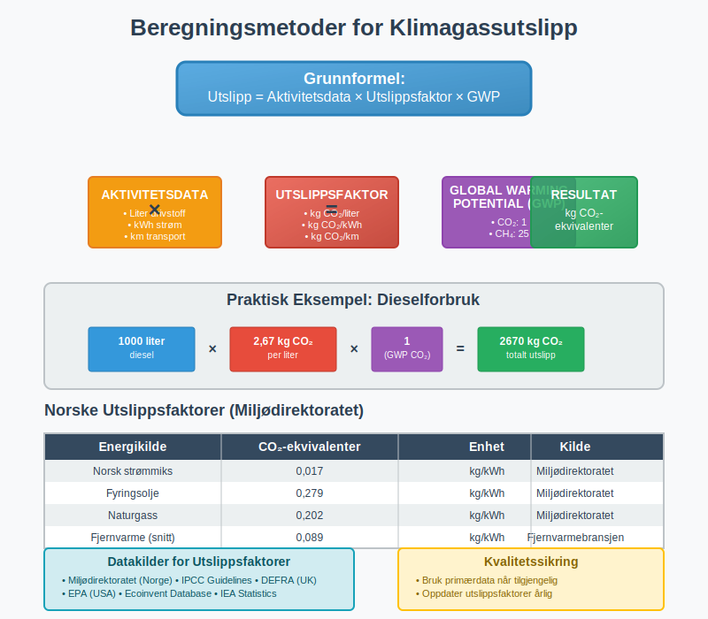
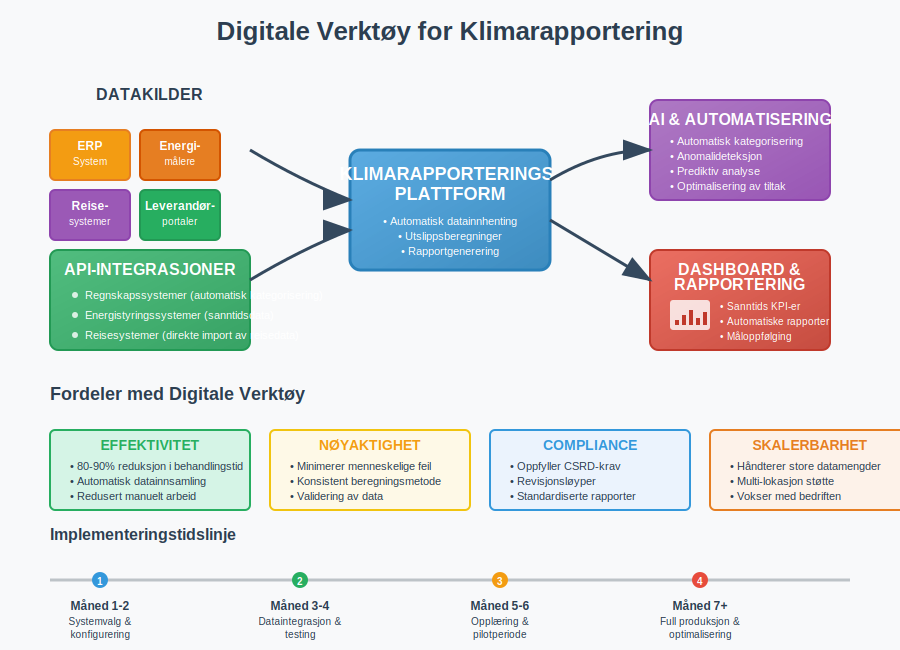

---
title: "Hva er GHG-protokollen?"
meta_title: "Hva er GHG-protokollen?"
meta_description: '**GHG-protokollen** (Greenhouse Gas Protocol) er den mest anerkjente internasjonale standarden for måling og rapportering av klimagassutslipp fra bedrifter og ...'
slug: hva-er-ghg-protokollen
type: blog
layout: pages/single
---

**GHG-protokollen** (Greenhouse Gas Protocol) er den mest anerkjente internasjonale standarden for måling og rapportering av klimagassutslipp fra bedrifter og organisasjoner. Protokollen ble utviklet av World Resources Institute (WRI) og World Business Council for Sustainable Development (WBCSD), og fungerer som grunnlaget for klimarapportering i [ESG-regnskap](/blogs/regnskap/hva-er-esg "Hva er ESG? Environmental, Social & Governance i Regnskap og Rapportering") og bærekraftsrapportering.

For norske bedrifter blir GHG-protokollen stadig viktigere, spesielt i lys av nye rapporteringskrav som [CSRD](/blogs/regnskap/hva-er-csrd "Hva er CSRD? Corporate Sustainability Reporting Directive og Påvirkning på Norske Bedrifter") (Corporate Sustainability Reporting Directive), som krever systematisk klimarapportering fra større selskaper.

## Seksjon 1: De Tre Scope-Kategoriene

GHG-protokollen deler klimagassutslipp inn i tre hovedkategorier, kalt **"scopes"**, som gir en strukturert tilnærming til å identifisere og måle utslipp gjennom hele verdikjeden.



### Scope 1: Direkte Utslipp

**Scope 1** omfatter alle direkte klimagassutslipp fra kilder som bedriften eier eller kontrollerer direkte. Dette inkluderer:

* Forbrenning i egne anlegg (fyring, produksjon)
* Bedriftens kjøretøyflåte og maskiner
* Industrielle prosesser og kjemiske reaksjoner
* Lekkasjer fra kjøleanlegg og klimaanlegg

Disse utslippene er ofte de enkleste å måle og kontrollere, da bedriften har direkte tilgang til forbruksdata og kan implementere tiltak for reduksjon.

### Scope 2: Indirekte Energiutslipp

**Scope 2** dekker indirekte utslipp fra innkjøpt energi som bedriften forbruker, primært:

* Elektrisitet fra strømnettet
* Fjernvarme og fjernkjøling
* Damp til industrielle prosesser

Selv om bedriften ikke direkte produserer disse utslippene, er de en konsekvens av bedriftens energiforbruk og kan påvirkes gjennom energieffektivisering og valg av fornybare energikilder.

### Scope 3: Andre Indirekte Utslipp

**Scope 3** er den mest omfattende kategorien og inkluderer alle andre indirekte utslipp i bedriftens verdikjede. Dette omfatter 15 underkategorier, inkludert:

* Innkjøpte varer og tjenester
* Transport og distribusjon (oppstrøms og nedstrøms)
* Forretningsreiser og pendling
* Avfallshåndtering
* Bruk og avhending av solgte produkter
* Investeringer og finansieringsaktiviteter

Scope 3 utgjør ofte 70-90% av en bedrifts totale klimafotavtrykk, men er samtidig den mest utfordrende å måle og påvirke.

## Seksjon 2: Implementering i Regnskapet

Klimarapportering etter GHG-protokollen krever systematisk datainnsamling og dokumentasjon som må integreres med bedriftens eksisterende regnskapssystemer og [internkontroll](/blogs/regnskap/hva-er-attestering "Hva er Attestering? En Komplett Guide til Bilagsbehandling og Godkjenning").



### Datainnsamling og Dokumentasjon

Effektiv klimarapportering krever samme grad av nøyaktighet og dokumentasjon som finansiell rapportering:

* **Systematisk bilagsføring:** Alle energiregninger, transportkvitteringer og innkjøpsfakturaer må kategoriseres for klimarapportering
* **Månedlig avstemming:** Regelmessig oppfølging av utslippsdata parallelt med [månedlig regnskapsavslutning](/blogs/regnskap/hva-er-avslutningsbalanse "Hva er Avslutningsbalanse? Komplett Guide til Regnskapsavslutning")
* **Revisjonsløyper:** Klar dokumentasjon av beregningsmetoder og datakilder for ekstern verifikasjon

### Integrasjon med ERP-systemer

Moderne [ERP-systemer](/blogs/regnskap/hva-er-erp-system "Hva er ERP-system? Enterprise Resource Planning for Bedrifter") kan konfigureres til å automatisk kategorisere transaksjoner for klimarapportering:

| Transaksjonskategori | Scope-klassifisering | Automatisk beregning |
|---------------------|---------------------|---------------------|
| Drivstoffkjøp | Scope 1 | Liter × utslippsfaktor |
| Strømregninger | Scope 2 | kWh × nettmiks-faktor |
| Flyreiser | Scope 3 | Distanse × utslippsfaktor |
| Innkjøp av varer | Scope 3 | Beløp × sektorfaktor |

## Seksjon 3: Rapporteringskrav og Standarder

I Norge er klimarapportering regulert gjennom flere regelverk som bygger på GHG-protokollen som grunnlag.

### CSRD og EU-taksonomi

For større norske selskaper gjelder [CSRD](/blogs/regnskap/hva-er-csrd "Hva er CSRD? Corporate Sustainability Reporting Directive og Påvirkning på Norske Bedrifter")-direktivet, som krever:

* **Årlig klimarapportering** integrert i årsrapporten
* **Dobbel vesentlighet:** Både finansiell påvirkning og miljøpåvirkning
* **Ekstern revisjon** av bærekraftsrapportering
* **Digitale rapporteringsformater** (XBRL-basert)

### Norske Rapporteringskrav

Norske myndigheter har implementert flere krav som påvirker klimarapportering:

* **Regnskapsloven § 3-3c:** Krav til redegjørelse for samfunnsansvar
* **Ã…penhetsloven:** Rapportering om menneskerettigheter og arbeidsforhold
* **Grunnrenteskatt:** Spesielle krav for petroleumssektoren

## Seksjon 4: Beregningsmetoder og Utslippsfaktorer

Nøyaktig beregning av klimagassutslipp krever bruk av anerkjente utslippsfaktorer og beregningsmetoder.



### Aktivitetsbasert Tilnærming

Den mest vanlige metoden er **aktivitetsbasert beregning**:

```
Utslipp = Aktivitetsdata × Utslippsfaktor × Oppvarmingspotensial
```

**Eksempel på beregning:**
* Forbruk av diesel: 1000 liter
* Utslippsfaktor diesel: 2,67 kg COâ‚‚/liter
* Totalt CO₂-utslipp: 1000 × 2,67 = 2670 kg CO₂

### Norske Utslippsfaktorer

Miljødirektoratet publiserer årlig oppdaterte utslippsfaktorer for Norge:

| Energikilde | COâ‚‚-ekvivalenter (kg/kWh) | Kilde |
|-------------|---------------------------|-------|
| Norsk strømmiks | 0,017 | Miljødirektoratet |
| Fyringsolje | 0,279 | Miljødirektoratet |
| Naturgass | 0,202 | Miljødirektoratet |
| Fjernvarme (snitt) | 0,089 | Fjernvarmebransjen |

### Usikkerhet og Kvalitetssikring

Som i finansiell rapportering må klimarapportering håndtere usikkerhet:

* **Datakilder:** Prioriter primærdata over estimater
* **Konservatisme:** Velg høyere estimater ved usikkerhet
* **Sensitivitetsanalyse:** Test påvirkning av ulike forutsetninger
* **Årlig oppdatering:** Revidér beregningsmetoder og faktorer

## Seksjon 5: Klimamål og Reduksjonsstrategier

Etter kartlegging av utslipp må bedrifter sette **vitenskapelig baserte klimamål** og implementere reduksjonsstrategier.

### Science Based Targets (SBT)

Science Based Targets-initiativet gir rammer for klimamål som er i tråd med Parisavtalens 1,5°C-mål:

* **Kortsiktige mål:** 5-10 års reduksjon (minimum 4,2% årlig)
* **Langsiktige mål:** Netto null utslipp innen 2050
* **Scope-dekkning:** MÃ¥l for alle relevante scope-kategorier

### Reduksjonsstrategier per Scope

**Scope 1 reduksjoner:**
* Energieffektivisering av bygninger og prosesser
* Overgang til fornybare energikilder
* Elektrifisering av transport og maskiner
* Optimalisering av industrielle prosesser

**Scope 2 reduksjoner:**
* Kjøp av fornybar strøm (grønne sertifikater)
* Installasjon av solceller og vindkraft
* Energieffektivisering og smart styring
* Bytte til leverandører med ren energi

**Scope 3 reduksjoner:**
* Leverandørkrav og samarbeid om reduksjoner
* Sirkulære forretningsmodeller
* Optimalisering av transport og logistikk
* Produktdesign for lavere klimafotavtrykk

## Seksjon 6: Økonomiske Implikasjoner

Klimarapportering etter GHG-protokollen har betydelige økonomiske implikasjoner som må reflekteres i bedriftens [finansregnskap](/blogs/regnskap/hva-er-finansregnskap "Hva er Finansregnskap? Komplett Guide til Eksternregnskap og Årsregnskap").

### Kostnader ved Implementering

Implementering av systematisk klimarapportering medfører flere kostnadskategorier:

* **Systemkostnader:** Oppgradering av [ERP-systemer](/blogs/regnskap/hva-er-erp-system "Hva er ERP-system? Enterprise Resource Planning for Bedrifter") for klimadatahåndtering
* **Konsulentbistand:** Ekstern hjelp til etablering av prosesser og beregningsmetoder
* **Personalkostnader:** Opplæring og dedikerte ressurser til klimarapportering
* **Verifikasjonskostnader:** Ekstern revisjon og sertifisering av klimadata

### Klimarelaterte Finansielle Risikoer

GHG-protokollen hjelper bedrifter å identifisere og kvantifisere klimarelaterte finansielle risikoer:

| Risikotype | Beskrivelse | Regnskapsmessig behandling |
|------------|-------------|---------------------------|
| Overgangsrisiko | Kostnader ved COâ‚‚-avgifter og reguleringer | [Avsetninger](/blogs/regnskap/hva-er-gjeld "Hva er Gjeld? Komplett Guide til Kortsiktig og Langsiktig Gjeld") for fremtidige avgifter |
| Fysisk risiko | Skader fra klimaendringer | Nedskrivning av [anleggsmidler](/blogs/regnskap/hva-er-anleggsmidler "Hva er Anleggsmidler? Komplett Guide til Varige Driftsmidler") |
| Omdømmerisiko | Tap av kunder og investorer | Nedskrivning av [goodwill](/blogs/regnskap/hva-er-goodwill "Hva er Goodwill? Komplett Guide til Immateriell Kapital") |
| Markedsrisiko | Endrede forbrukerpref. | Nedskrivning av varelager |

### Investeringsmuligheter

Samtidig skaper klimaomstillingen nye forretningsmuligheter:

* **Grønne investeringer:** Fornybar energi og energieffektivisering
* **Nye markeder:** Produkter og tjenester for lavutslippssamfunnet
* **Kostnadsbesparelser:** Redusert energiforbruk og materialbruk
* **Tilgang til kapital:** Grønn finansiering og bærekraftslån

## Seksjon 7: Digitale Verktøy og Automatisering

Moderne klimarapportering krever digitale løsninger for effektiv datainnsamling og rapportering.



### Integrerte Rapporteringsplattformer

Flere leverandører tilbyr spesialiserte løsninger for GHG-rapportering:

* **Automatisk datainnhenting** fra regnskapssystemer og energimålere
* **Forhåndsdefinerte utslippsfaktorer** for ulike bransjer og regioner
* **Rapporteringsmaler** for ulike standarder (GHG, CDP, TCFD)
* **Dashboards og visualisering** for oppfølging av klimamål

### API-integrasjoner

Moderne klimarapporteringsverktøy kan integreres med eksisterende systemer:

* **Regnskapssystemer:** Automatisk kategorisering av transaksjoner
* **Reisesystemer:** Direkte import av reisedata for Scope 3-beregninger
* **Energistyringssystemer:** Sanntidsdata fra smarte målere
* **Leverandørportaler:** Innhenting av Scope 3-data fra verdikjeden

### Kunstig Intelligens og Maskinlæring

AI-teknologi kan forbedre nøyaktigheten i klimarapportering:

* **Automatisk kategorisering** av transaksjoner basert på beskrivelse
* **Anomalideteksjon** for å identifisere unormale utslippsmønstre
* **Prediktiv analyse** for å forutsi fremtidige utslipp
* **Optimalisering** av reduksjonstiltak basert på kostnads-nytte-analyse

## Seksjon 8: Fremtidige Utviklingstrekk

GHG-protokollen utvikles kontinuerlig for å møte nye utfordringer og krav i klimarapportering.

### Utvidede Rapporteringskrav

Flere jurisdiksjoner innfører obligatorisk klimarapportering:

* **EU-taksonomi:** Klassifisering av bærekraftige økonomiske aktiviteter
* **TCFD-implementering:** Klimarelaterte finansielle risikoer
* **Scope 3-utvidelse:** Strengere krav til verdikjederapportering
* **Sektorspesifikke standarder:** Tilpassede krav for ulike bransjer

### Teknologisk Utvikling

Nye teknologier vil forenkle og forbedre klimarapportering:

* **Blokkjede-teknologi:** Sporbarhet av utslipp gjennom verdikjeder
* **IoT-sensorer:** Sanntidsmåling av utslipp og energiforbruk
* **Satellittdata:** Verifisering av utslippsrapporter
* **Digital tvillinger:** Modellering av klimapåvirkning fra forretningsaktiviteter

### Finansiell Integrering

Klimarapportering vil bli stadig mer integrert med finansiell rapportering:

* **Integrerte rapporter:** Kombinert finansiell og bærekraftsrapportering
* **Klimajusterte regnskaper:** Justering av [balanseførte verdier](/blogs/regnskap/hva-er-balanse "Hva er Balanse? Komplett Guide til Balanseregnskap og Finansiell Stilling") for klimarisiko
* **Karbonprising:** Internprising av COâ‚‚-utslipp i investeringsbeslutninger
* **ESG-måltall:** Kobling mellom klimamål og lederkompensasjon

GHG-protokollen representerer et paradigmeskifte i hvordan bedrifter måler og rapporterer sin miljøpåvirkning. For norske bedrifter er det essensielt å etablere robuste systemer for klimarapportering som både oppfyller regulatoriske krav og støtter strategiske beslutninger for bærekraftig verdiskaping.

Implementering av GHG-protokollen krever samme grad av systematikk og nøyaktighet som tradisjonell [regnskapsføring](/blogs/regnskap/hva-er-bokforing "Hva er Bokføring? Komplett Guide til Regnskapsføring og Bokføringsregler"), men åpner samtidig for nye muligheter til å skape verdi gjennom bærekraftig forretningsutvikling.
