---
title: "Hva er Giro?"
seoTitle: "Hva er Giro?"
description: 'Hva en giro er, bruksområder i betaling og regnskap, og forskjellen fra faktura og bankoverføring.'
summary: 'Hva en giro er, bruksområder i betaling og regnskap, og forskjellen fra faktura og bankoverføring.'
---

**Giro** er et fundamentalt betalingssystem som har revolusjonert måten vi håndterer pengeoverføringer og regningsbetalinger på. Som grunnlaget for moderne elektroniske betalingsløsninger som [AvtaleGiro](/blogs/regnskap/hva-er-avtalegiro "Hva er AvtaleGiro? Komplett Guide til Automatisk Betaling") og [BankGiro](/blogs/regnskap/hva-er-bankgiro "Hva er BankGiro? Komplett Guide til Norsk Betalingssystem"), representerer giro-systemet en av de viktigste innovasjonene innen moderne [betalingsmidler](/blogs/regnskap/hva-er-betalingsmidler "Hva er Betalingsmidler? Tvungne, Elektroniske og Tradisjonelle Metoder"). For bedrifter og privatpersoner er forståelse av giro-systemet essensielt for effektiv [regnskapsføring](/blogs/regnskap/hva-er-regnskap "Hva er Regnskap? En komplett guide") og økonomisk styring.

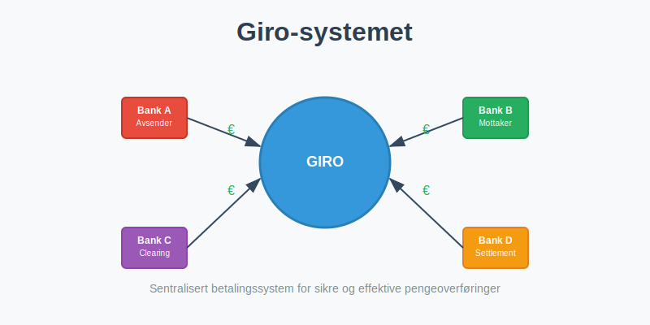

### Hva er Giro?

Giro er et **betalingssystem** som gjør det mulig å overføre penger mellom kontoer ved hjelp av standardiserte skjemaer og prosedyrer. Ordet "giro" kommer fra italiensk og betyr "sirkel" eller "runde", som refererer til sirkulasjonen av penger gjennom systemet.

Hovedprinsippene i giro-systemet:
- **Standardiserte prosedyrer:** Faste rutiner for behandling av betalinger
- **Sentral clearing:** Alle transaksjoner behandles gjennom et sentralt system
- **Automatisering:** Redusert behov for manuell behandling
- **Sporbarhet:** Alle transaksjoner kan følges og dokumenteres
- **Sikkerhet:** Kontrollerte prosesser reduserer risiko for feil

Dette systemet danner grunnlaget for det moderne norske betalingslandskapet og er integrert i de fleste [ERP-systemer](/blogs/regnskap/hva-er-erp-system "Hva er ERP-system? Komplett Guide til Enterprise Resource Planning") som brukes i norsk næringsliv.

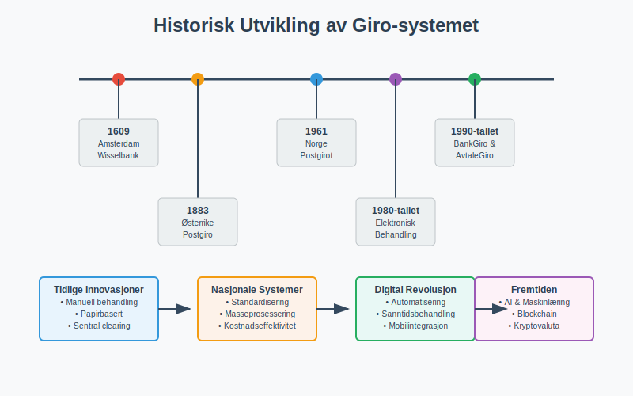

### Historisk Utvikling

#### Opprinnelse og Tidlige Utvikling
Giro-systemet har sine røtter tilbake til **1600-tallet** i Europa:
- **1609:** Amsterdams Wisselbank etablerte tidlige giro-tjenester
- **1883:** Østerrike innførte det første nasjonale postgirosystemet
- **1920-tallet:** Flere europeiske land adopterte giro-systemer

#### Giro i Norge
Norges utvikling av giro-systemet:

| År | Milepæl | Betydning |
|-----|---------|-----------|
| **1961** | Postgirot etableres | Første nasjonale giro-system i Norge |
| **1970-tallet** | Bankenes giro-tjenester | Kommersielle banker innfører giro |
| **1980-tallet** | Elektronisk behandling | Automatisering av giro-prosesser |
| **1990-tallet** | BankGiro og AvtaleGiro | Moderne elektroniske giro-tjenester |
| **2000-tallet** | Internett og mobilgiro | Digital revolusjon i betalinger |

#### Moderne Utvikling
Dagens giro-system kjennetegnes av:
- **Digital integrasjon:** Seamless kobling til nettbank og mobilapper
- **Sanntidsbetalinger:** Øyeblikkelig behandling av transaksjoner
- **API-integrasjon:** Kobling til [regnskapssystemer](/blogs/regnskap/hva-er-regnskap "Hva er Regnskap? En komplett guide")
- **Kunstig intelligens:** Automatisk behandling og feildeteksjon

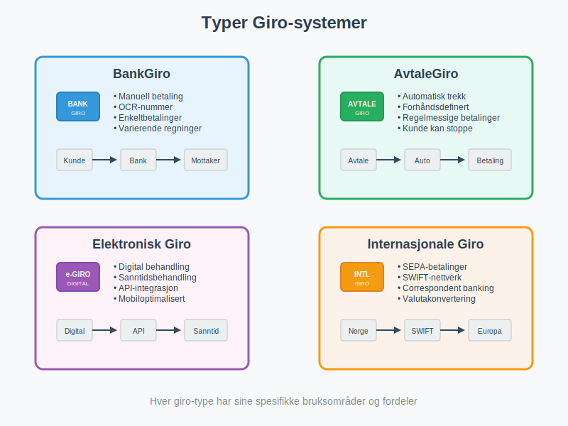

### Typer Giro-systemer

#### 1. BankGiro
**BankGiro** er det mest utbredte giro-systemet i Norge:
- **Funksjon:** Manuell betaling av regninger med OCR-nummer
- **Prosess:** Kunde fyller ut giroblanketter eller betaler via nettbank
- **Avstemming:** Automatisk kobling mellom betaling og [faktura](/blogs/regnskap/hva-er-en-faktura "Hva er en Faktura? En Guide til Norske Fakturakrav")
- **Bruksområde:** Enkeltbetalinger og varierende regninger

#### 2. AvtaleGiro
**AvtaleGiro** bygger på giro-prinsippene med automatisering:
- **Funksjon:** Automatisk trekk av regninger
- **Prosess:** Forhåndsdefinerte avtaler mellom kunde og leverandør
- **Kontroll:** Kunde kan stoppe eller endre avtaler
- **Bruksområde:** Regelmessige betalinger som husleie og forsikringer

#### 3. Elektronisk Giro (eGiro)
**Moderne elektroniske giro-løsninger:**
- **Digital behandling:** Fullstendig elektronisk prosessering
- **Sanntid:** Øyeblikkelig behandling og bekreftelse
- **Integrasjon:** Direkte kobling til [regnskapssystemer](/blogs/regnskap/hva-er-regnskap "Hva er Regnskap? En komplett guide")
- **Mobiloptimalisering:** Tilpasset mobile enheter

#### 4. Internasjonale Giro-systemer
**Grenseoverskridende giro-tjenester:**
- **SEPA:** Single Euro Payments Area for europeiske betalinger
- **SWIFT:** Internasjonale bankoverføringer
- **Correspondent banking:** Samarbeid mellom internasjonale banker

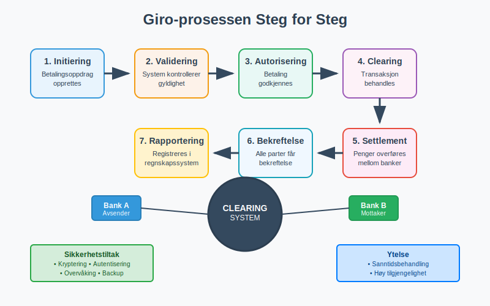

### Hvordan Fungerer Giro-systemet?

#### Teknisk Arkitektur
Giro-systemet består av flere komponenter:

1. **Betalingsinitiatør:** Kunde eller system som starter betalingen
2. **Betalingsmottaker:** Leverandør eller mottaker av betalingen
3. **Clearing-system:** Sentralt system som behandler transaksjoner
4. **Banker:** Finansinstitusjoner som utfører overføringene
5. **Regulatorer:** Myndigheter som overvåker systemet

#### Prosessflyt
En typisk giro-transaksjon følger denne flyten:

1. **Initiering:** Betalingsoppdrag opprettes
2. **Validering:** System kontrollerer oppdragets gyldighet
3. **Autorisering:** Betalingen godkjennes av kunde eller system
4. **Clearing:** Transaksjonen behandles i clearing-systemet
5. **Settlement:** Penger overføres mellom bankkontoer
6. **Bekreftelse:** Alle parter får bekreftelse på gjennomført betaling
7. **Rapportering:** Transaksjon registreres i [regnskapssystemer](/blogs/regnskap/hva-er-regnskap "Hva er Regnskap? En komplett guide")

#### Sikkerhetsmekansimer
- **Kryptering:** All kommunikasjon er kryptert
- **Autentisering:** Sterke krav til identifisering
- **Autorisering:** Kontroll av betalingsrettigheter
- **Overvåking:** Kontinuerlig overvåking av mistenkelige transaksjoner
- **Backup:** Sikre rutiner for datalagring og gjenoppretting

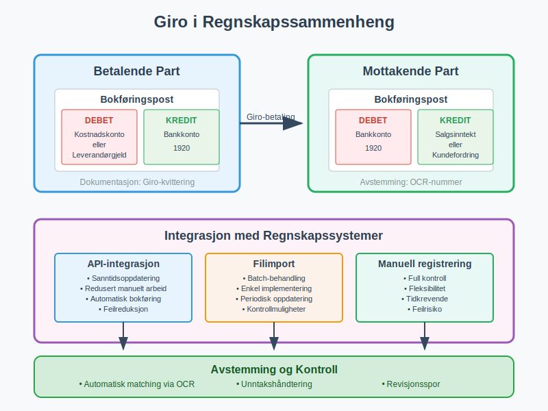

### Giro i Regnskapssammenheng

#### Bokføringsmessige Aspekter
Giro-betalinger har spesifikke implikasjoner for [bokføring](/blogs/regnskap/hva-er-bokforing "Hva er Bokføring? Komplett Guide til Norsk Bokføringspraksis"):

**For Betalende Part:**
- **Debet:** Kostnadskonto eller leverandørgjeld
- **Kredit:** Bankkonto
- **Dokumentasjon:** Giro-[kvittering](/blogs/regnskap/kvittering "Hva er Kvittering? En Guide til Kvitteringskrav i Norsk Regnskap") som [bilag](/blogs/regnskap/hva-er-bilag "Hva er Bilag? Komplett Guide til Regnskapsbilag")

**For Mottakende Part:**
- **Debet:** Bankkonto
- **Kredit:** Salgsinntekt eller kundefordring
- **Avstemming:** Automatisk kobling via OCR-nummer

#### Integrasjon med Regnskapssystemer
Moderne giro-systemer integreres direkte med regnskapsprogrammer:

| Integrasjonstype | Fordeler | Utfordringer |
|------------------|----------|--------------|
| **API-integrasjon** | Sanntidsoppdatering, redusert manuelt arbeid | Teknisk kompleksitet, sikkerhetshensyn |
| **Filimport** | Enkel implementering, batch-behandling | Forsinkelser, manuell oppfølging |
| **Manuell registrering** | Full kontroll, fleksibilitet | Tidkrevende, feilrisiko |

#### Avstemming og Kontroll
Giro-systemet letter [bankavstemming](/blogs/regnskap/hva-er-bankavstemming "Hva er Bankavstemming? Komplett Guide til Bankavstemmingsprosessen"):
- **Automatisk matching:** OCR-nummer kobler betalinger til fakturaer
- **Unntakshåndtering:** System identifiserer avvik som krever manuell behandling
- **Rapportering:** Detaljerte rapporter for regnskapsformål
- **Revisjonsspor:** Komplett dokumentasjon av alle transaksjoner

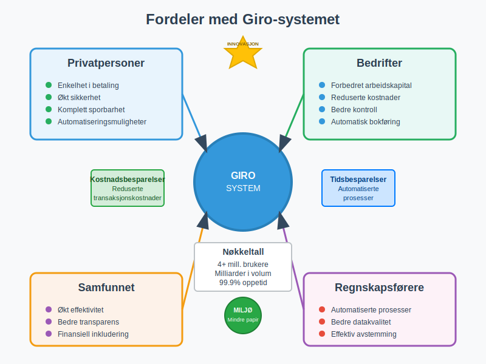

### Fordeler med Giro-systemet

#### For Privatpersoner
- **Enkelhet:** Intuitive prosesser for betaling av regninger
- **Sikkerhet:** Redusert risiko sammenlignet med kontantbetalinger
- **Sporbarhet:** Komplett oversikt over alle betalinger
- **Automatisering:** Mulighet for automatiske betalinger
- **Kostnadseffektivitet:** Lave eller ingen gebyrer for standard giro-tjenester

#### For Bedrifter
- **Forbedret [arbeidskapital](/blogs/regnskap/hva-er-arbeidskapital "Hva er Arbeidskapital? Definisjon og Beregning"):** Raskere innbetaling fra kunder
- **Reduserte kostnader:** Mindre manuell behandling av betalinger
- **Bedre kontroll:** Systematisk håndtering av inn- og utbetalinger
- **Regnskapsmessige fordeler:** Automatisk bokføring og avstemming
- **Kundeservice:** Enklere betalingsløsninger for kunder

#### For Samfunnet
- **Effektivitet:** Reduserte transaksjonskostnader for hele økonomien
- **Transparens:** Bedre sporing av pengestrømmer
- **Finansiell inkludering:** Tilgang til [betalingstjenester](/blogs/regnskap/betalingstjeneste "Hva er betalingstjeneste? Komplett Guide til Betalingstjenester i Norge") for alle
- **Innovasjon:** Grunnlag for nye finansielle tjenester
- **Miljøvennlighet:** Redusert bruk av papir og fysisk transport

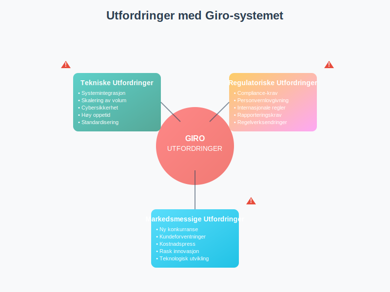

### Utfordringer og Begrensninger

#### Tekniske Utfordringer
- **Systemintegrasjon:** Kompleks kobling mellom ulike systemer
- **Skalering:** Håndtering av økende transaksjonsvolum
- **Sikkerhet:** Beskyttelse mot cybertrusler og svindel
- **Oppetid:** Krav til høy tilgjengelighet og pålitelighet
- **Standardisering:** Behov for felles standarder på tvers av aktører

#### Regulatoriske Utfordringer
- **Compliance:** Overholdelse av finansreguleringer
- **Personvern:** Beskyttelse av sensitive betalingsdata
- **Grenseoverskridende:** Håndtering av internasjonale reguleringer
- **Rapportering:** Krav til rapportering til myndigheter
- **Endringer:** Tilpasning til nye regulatoriske krav

#### Markedsmessige Utfordringer
- **Konkurranse:** Nye aktører som utfordrer tradisjonelle banker
- **Kundeforventninger:** Økende krav til brukeropplevelse
- **Kostnadspress:** Behov for kostnadseffektive løsninger
- **Innovasjon:** Rask teknologisk utvikling krever kontinuerlig tilpasning

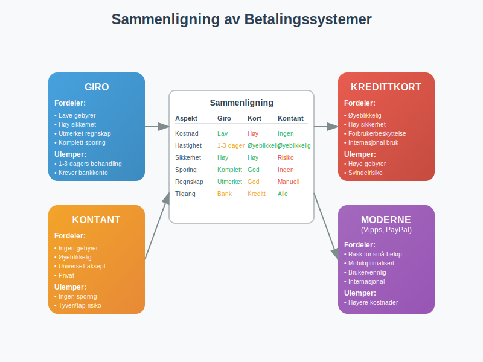

### Giro vs. Andre Betalingssystemer

#### Giro vs. Kredittkort
| Aspekt | Giro | Kredittkort |
|--------|------|-------------|
| **Kostnader** | Lave gebyrer | Høyere gebyrer for handelsmenn |
| **Behandlingstid** | 1-3 bankdager | Øyeblikkelig autorisering |
| **Sikkerhet** | Høy, bankbasert | Høy, men risiko for svindel |
| **Tilgjengelighet** | Krever bankkonto | Krever kredittgodkjenning |
| **Regnskapsintegrasjon** | Utmerket | God, men krever ekstra behandling |

#### Giro vs. Kontant
| Aspekt | Giro | Kontant |
|--------|------|---------|
| **Sporbarhet** | Komplett dokumentasjon | Ingen sporing |
| **Sikkerhet** | Høy | Risiko for tyveri/tap |
| **Bekvemmelighet** | Høy for større beløp | Praktisk for små beløp |
| **Regnskapsføring** | Automatisk | Manuell registrering |
| **Kostnader** | Lave | Ingen direkte kostnader |

#### Giro vs. Moderne Betalingsløsninger
- **Vipps/Mobile Pay:** Raskere for små beløp, men bygger på giro-infrastruktur
- **PayPal/Stripe:** Internasjonale løsninger, men høyere kostnader
- **Kryptovaluta:** Desentralisert, men regulatorisk usikkerhet
- **CBDC:** Fremtidens digitale sentralbankvaluta

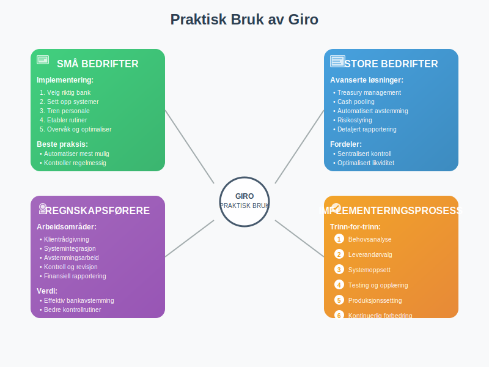

### Praktisk Bruk av Giro

#### For Små Bedrifter
**Implementering av giro-løsninger:**
1. **Velg riktig bank:** Sammenlign tilbud fra ulike banker
2. **Sett opp systemer:** Integrer med [regnskapssystem](/blogs/regnskap/hva-er-regnskap "Hva er Regnskap? En komplett guide")
3. **Tren personale:** Sørg for at ansatte forstår prosessene
4. **Etabler rutiner:** Lag faste prosedyrer for håndtering
5. **Overvåk og optimaliser:** Kontinuerlig forbedring av prosesser

**Beste praksis:**
- **Automatiser mest mulig:** Reduser manuelt arbeid
- **Kontroller regelmessig:** Utfør månedlige avstemminger
- **Dokumenter alt:** Oppretthold god [dokumentasjon](/blogs/regnskap/hva-er-dokumentasjon-regnskap-bokforing "Hva er Dokumentasjon i Regnskap og Bokføring?")
- **Sikkerhet først:** Implementer sterke sikkerhetstiltak
- **Kundeservice:** Gjør det enkelt for kunder å betale

#### For Store Bedrifter
**Avanserte giro-implementeringer:**
- **Treasury management:** Sentralisert håndtering av alle betalinger
- **Cash pooling:** Optimalisering av likviditet på tvers av enheter
- **Automatisert avstemming:** Fullstendig automatisering av regnskapsprosesser
- **Risikostyring:** Avanserte systemer for å håndtere betalingsrisiko
- **Rapportering:** Detaljerte analyser av betalingsmønstre

#### For Regnskapsførere
**Giro i regnskapsarbeid:**
- **Klientrådgivning:** Hjelpe klienter med valg av betalingsløsninger
- **Systemintegrasjon:** Sette opp kobling mellom bank og regnskapssystem
- **Avstemmingsarbeid:** Effektiv håndtering av bankavstemming
- **Kontroll og revisjon:** Bruke giro-data til kontrollformål
- **Rapportering:** Utnytte giro-data til finansiell rapportering

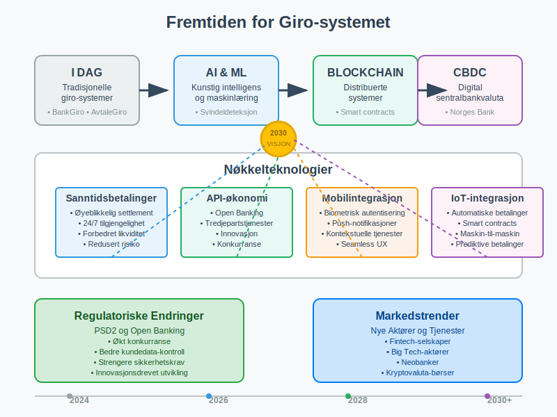

### Fremtiden for Giro-systemet

#### Teknologiske Trender
**Kunstig Intelligens og Maskinlæring:**
- **Svindeldeteksjon:** Automatisk identifisering av mistenkelige transaksjoner
- **Prediktiv analyse:** Forutsigelse av betalingsmønstre
- **Personalisering:** Tilpassede betalingsløsninger basert på brukeradferd
- **Automatisering:** Intelligent håndtering av unntak og feil

**Blockchain og Distribuerte Systemer:**
- **Desentralisert clearing:** Redusert avhengighet av sentrale systemer
- **Smart contracts:** Automatiske betalinger basert på forhåndsdefinerte betingelser
- **Transparens:** Økt sporbarhet og tillit i betalingssystemet
- **Kostnadsreduksjon:** Eliminering av mellommenn i betalingskjeden

#### Regulatoriske Endringer
**PSD2 og Open Banking:**
- **Økt konkurranse:** Nye aktører får tilgang til betalingsmarkedet
- **Bedre tjenester:** Innovasjon drevet av økt konkurranse
- **Kundedata:** Bedre kontroll over egne finansielle data
- **Sikkerhet:** Strengere krav til autentisering og autorisering

**Bærekraft og ESG:**
- **Miljøvennlige betalinger:** Redusert karbonavtrykk fra betalingssystemer
- **Finansiell inkludering:** Sikre at alle har tilgang til [betalingstjenester](/blogs/regnskap/betalingstjeneste "Hva er betalingstjeneste? Komplett Guide til Betalingstjenester i Norge")
- **Transparens:** Bedre rapportering av samfunnsansvar
- **Etiske investeringer:** Kobling mellom betalinger og bærekraftige investeringer

#### Markedsutviklingen
**Nye Aktører:**
- **Fintech-selskaper:** Innovative løsninger som utfordrer tradisjonelle banker
- **Big Tech:** Store teknologiselskaper som tilbyr [betalingstjenester](/blogs/regnskap/betalingstjeneste "Hva er betalingstjeneste? Komplett Guide til Betalingstjenester i Norge")
- **Kryptovaluta-børser:** Alternative betalingsløsninger
- **Neobanker:** Digitale banker med fokus på brukeropplevelse

**Endrede Kundeforventninger:**
- **Sanntidsbetalinger:** Krav om øyeblikkelige transaksjoner
- **Mobiloptimalisering:** Alt må fungere perfekt på mobile enheter
- **Personalisering:** Tilpassede løsninger for hver enkelt kunde
- **Transparens:** Klar informasjon om kostnader og prosesser

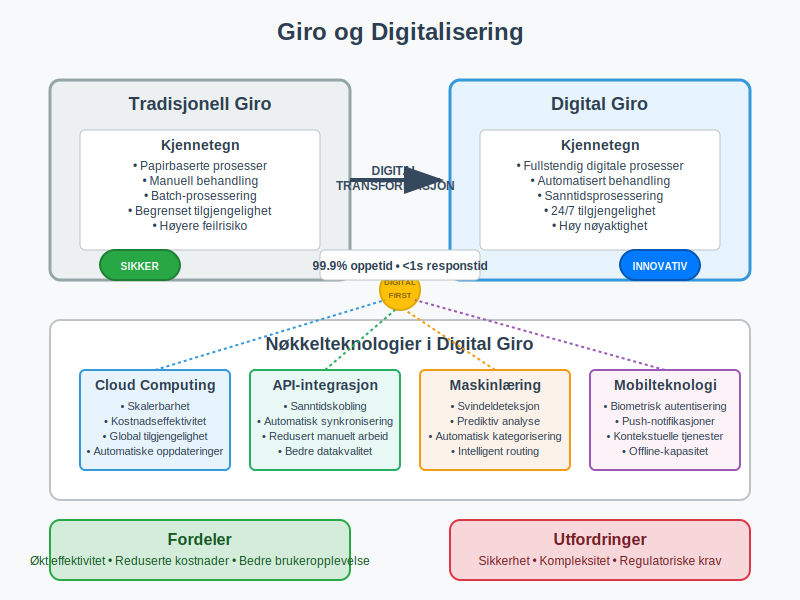

### Giro og Digitalisering

#### Digital Transformasjon
**Automatisering av Regnskapsprosesser:**
- **OCR-teknologi:** Automatisk lesing av fakturaer og betalingsinformasjon
- **API-integrasjoner:** Sanntidskobling mellom betalingssystemer og regnskap
- **Robotisert prosessautomatisering (RPA):** Automatisering av repetitive oppgaver
- **Maskinlæring:** Intelligent kategorisering og behandling av transaksjoner

**Cloud-baserte Løsninger:**
- **Skalerbarhet:** Enkel tilpasning til endrede behov
- **Tilgjengelighet:** Tilgang fra hvor som helst, når som helst
- **Sikkerhet:** Profesjonell sikkerhet og backup
- **Kostnadseffektivitet:** Reduserte IT-kostnader for bedrifter

#### Integrasjon med Moderne Systemer
**ERP-integrasjon:**
- **Sanntidsoppdatering:** Automatisk oppdatering av [regnskapsdata](/blogs/regnskap/hva-er-regnskap "Hva er Regnskap? En komplett guide")
- **Workflow-automatisering:** Automatiske godkjenningsprosesser
- **Rapportering:** Integrerte rapporter på tvers av systemer
- **Kontroll:** Bedre intern kontroll og risikostyring

**CRM-integrasjon:**
- **Kundeoppfølging:** Automatisk oppdatering av kundebetalingsstatus
- **Kredittvurdering:** Bruk av betalingshistorikk til kredittvurdering
- **Kundeservice:** Bedre kundeservice basert på betalingsinformasjon
- **Markedsføring:** Segmentering basert på betalingsadferd

### Internasjonale Perspektiver

#### Giro-systemer Globalt
**Europa:**
- **SEPA:** Harmoniserte betalinger i euroområdet
- **Instant payments:** Sanntidsbetalinger på tvers av landegrenser
- **PSD2:** Regulering som fremmer innovasjon og konkurranse
- **Digital euro:** Planlagt digital sentralbankvaluta

**Asia:**
- **Kina:** Avanserte mobile betalingsløsninger (Alipay, WeChat Pay)
- **India:** UPI (Unified Payments Interface) som nasjonalt betalingssystem
- **Japan:** Tradisjonelle giro-systemer kombinert med moderne teknologi
- **Singapore:** Ledende innen fintech og digitale betalinger

**Amerika:**
- **USA:** ACH-systemet som amerikansk ekvivalent til giro
- **Brasil:** PIX som moderne sanntidsbetalingssystem
- **Canada:** Interac som nasjonalt betalingsnettverk
- **Mexico:** SPEI for elektroniske overføringer

#### Lærdommer for Norge
- **Innovasjon:** Viktigheten av kontinuerlig utvikling
- **Regulering:** Balanse mellom sikkerhet og innovasjon
- **Samarbeid:** Betydningen av samarbeid mellom aktører
- **Kundefokus:** Sette kundeopplevelse i sentrum

### Praktiske Råd og Anbefalinger

#### For Bedriftsledere
**Strategiske Vurderinger:**
1. **Evaluer nåværende betalingsløsninger:** Kartlegg kostnader og effektivitet
2. **Vurder automatiseringsmuligheter:** Identifiser områder for forbedring
3. **Invester i teknologi:** Prioriter moderne betalingsløsninger
4. **Tren personale:** Sørg for kompetanse på betalingssystemer
5. **Overvåk utviklingen:** Hold deg oppdatert på nye teknologier

**Risikostyring:**
- **Diversifiser betalingsløsninger:** Ikke vær avhengig av én leverandør
- **Implementer sikkerhetstiltak:** Beskytt mot cybertrusler
- **Etabler backup-rutiner:** Sørg for kontinuitet ved systemfeil
- **Overvåk transaksjoner:** Implementer systemer for å oppdage avvik
- **Dokumenter prosesser:** Oppretthold god dokumentasjon

#### For Regnskapsførere
**Profesjonell Utvikling:**
- **Hold deg oppdatert:** Følg utviklingen innen betalingsteknologi
- **Utvikle kompetanse:** Lær om nye systemer og integrasjoner
- **Rådgi klienter:** Hjelp klienter med valg av betalingsløsninger
- **Automatiser prosesser:** Bruk teknologi til å effektivisere arbeidet
- **Kvalitetssikre:** Implementer kontroller for å sikre nøyaktighet

**Klientrådgivning:**
- **Kartlegg behov:** Forstå klientens spesifikke utfordringer
- **Anbefal løsninger:** Foreslå passende betalingssystemer
- **Implementer systemer:** Hjelp med oppsett og integrasjon
- **Følg opp:** Sørg for at systemene fungerer optimalt
- **Optimaliser:** Kontinuerlig forbedring av prosesser

### Konklusjon

Giro-systemet representerer **grunnsteinen** i det moderne norske betalingslandskapet og har fundamentalt endret måten vi håndterer økonomiske transaksjoner på. Fra sine historiske røtter som et enkelt overføringssystem har giro utviklet seg til å bli en **sofistikert teknologisk plattform** som muliggjør alt fra enkle regningsbetalinger til komplekse bedriftsbetalinger.

For **regnskapsførere og bedriftsledere** er forståelse av giro-systemet ikke bare nyttig, men essensielt for effektiv økonomisk styring. Systemets integrasjon med moderne [regnskapssystemer](/blogs/regnskap/hva-er-regnskap "Hva er Regnskap? En komplett guide") og [ERP-løsninger](/blogs/regnskap/hva-er-erp-system "Hva er ERP-system? Komplett Guide til Enterprise Resource Planning") gjør det mulig å automatisere mange tidkrevende prosesser og forbedre nøyaktigheten i finansiell rapportering.

Fremtiden for giro-systemet ser **lovende** ut, med kontinuerlig innovasjon innen kunstig intelligens, blockchain-teknologi og mobile betalingsløsninger. Samtidig vil regulatoriske endringer som PSD2 og fokus på bærekraft fortsette å forme utviklingen av betalingssystemet.

For å maksimere fordelene av giro-systemet er det viktig å **investere i riktig teknologi**, utvikle nødvendig kompetanse og etablere robuste prosesser som sikrer både effektivitet og sikkerhet. Med riktig tilnærming kan giro-systemet være en kraftig driver for **forbedret lønnsomhet** og **operasjonell effektivitet** i enhver organisasjon.

