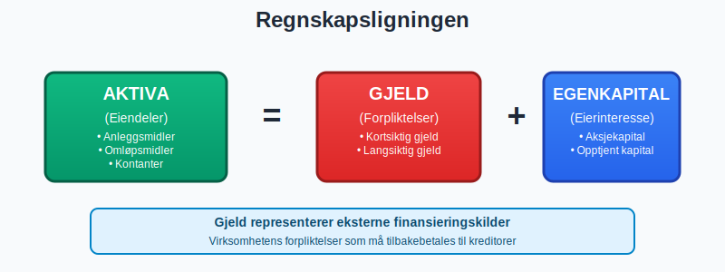
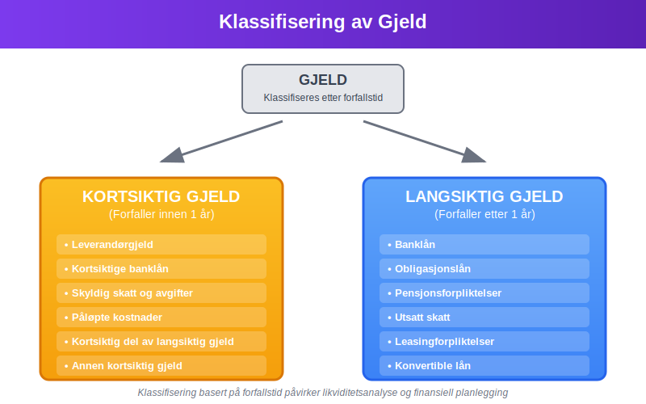
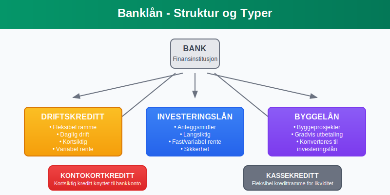
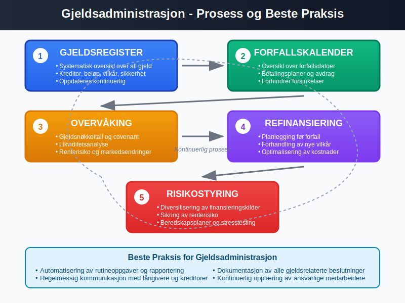

---
title: "Hva er Gjeld i Regnskap?"
meta_title: "Hva er Gjeld i Regnskap?"
meta_description: '**Gjeld** er en av de mest sentrale komponentene i regnskapsføring og representerer virksomhetens forpliktelser overfor eksterne parter. Som en kritisk del av ...'
slug: hva-er-gjeld
type: blog
layout: pages/single
---

**Gjeld** er en av de mest sentrale komponentene i regnskapsføring og representerer virksomhetens forpliktelser overfor eksterne parter. Som en kritisk del av [balansen](/blogs/regnskap/hva-er-balanse "Hva er Balanse i Regnskap? Komplett Guide til Balansens Oppbygging og Funksjon"), påvirker gjeld både virksomhetens finansielle stilling og fremtidige kontantstrømmer. Denne artikkelen gir en omfattende gjennomgang av gjeldsbegrepet, klassifisering, regnskapsføring og praktisk håndtering.

## Seksjon 1: Grunnleggende om Gjeld

**Gjeld** defineres som virksomhetens nåværende forpliktelser som oppstår fra tidligere hendelser, og som forventes å resultere i en utstrømning av økonomiske ressurser. Gjeld er en av de tre hovedkomponentene i den fundamentale regnskapsligningen:

**[Aktiva](/blogs/regnskap/hva-er-aktiva "Hva er Aktiva? En Komplett Guide til Eiendeler i Regnskap") = Gjeld + [Egenkapital](/blogs/regnskap/hva-er-egenkapital "Hva er Egenkapital? Komplett Guide til Egenkapital i Regnskap")**

### 1.1 Kjennetegn ved Gjeld

For at en forpliktelse skal klassifiseres som gjeld, må den oppfylle følgende kriterier:

* **Nåværende forpliktelse:** Forpliktelsen må eksistere på balansedagen
* **Oppstått fra tidligere hendelser:** Forpliktelsen må være et resultat av tidligere transaksjoner eller hendelser
* **Sannsynlig utstrømning:** Det må være sannsynlig at oppgjør vil kreve utstrømning av økonomiske ressurser
* **Pålitelig måling:** Forpliktelsens størrelse må kunne måles pålitelig

### 1.2 Gjeld vs. Andre Forpliktelser

Det er viktig å skille mellom gjeld og andre typer forpliktelser:

* **Betinget gjeld:** Forpliktelser som avhenger av fremtidige hendelser
* **Konstruktive forpliktelser:** Forpliktelser som oppstår fra etablert praksis
* **Kontraktuelle forpliktelser:** Forpliktelser som oppstår fra juridiske kontrakter

## Seksjon 2: Klassifisering av Gjeld

Gjeld klassifiseres primært basert på **forfallstid**, som har betydelige implikasjoner for [likviditetsanalyse](/blogs/regnskap/hva-er-betalingsevne "Hva er Betalingsevne? Analyse av Likviditet og Finansiell Stabilitet") og finansiell planlegging.

### 2.1 Kortsiktig Gjeld

**[Kortsiktig gjeld](/blogs/regnskap/kortsiktig-gjeld "Hva er Kortsiktig Gjeld? Komplett Guide til Kortsiktige Forpliktelser")** er forpliktelser som forfaller til betaling innen ett år fra balansedagen:

#### Hovedtyper Kortsiktig Gjeld:

* **[Leverandørgjeld](/blogs/regnskap/hva-er-leverandorgjeld "Hva er Leverandørgjeld i Regnskap? Komplett Guide til Kreditorhåndtering og Regnskapsføring"):** Skyldig beløp til leverandører for varer og tjenester
* **Kortsiktig del av langsiktig gjeld:** Avdrag på langsiktige lån som forfaller neste år
* **Påløpte kostnader:** Kostnader som er pådratt men ikke betalt
* **Skyldig skatt og avgifter:** Forfalt eller påløpt skatt og [mva](/blogs/regnskap/hva-er-avgiftsplikt-mva "Hva er Avgiftsplikt MVA? Komplett Guide til Merverdiavgift")
* **Kortsiktige banklån:** Kredittlinjer og kortsiktige lån
* **Annen kortsiktig gjeld:** Diverse kortsiktige forpliktelser

### 2.2 Langsiktig Gjeld

**[Langsiktig gjeld](/blogs/regnskap/langsiktig-gjeld "Hva er Langsiktig Gjeld? Komplett Guide til Langsiktige Forpliktelser")** er forpliktelser som forfaller til betaling mer enn ett år fra balansedagen:

#### Hovedtyper Langsiktig Gjeld:

* **Banklån:** Langsiktige lån fra finansinstitusjoner
* **[Obligasjonslån](/blogs/regnskap/hva-er-obligasjon "Hva er en Obligasjon? Komplett Guide til Obligasjoner i Regnskap"):** Lån gjennom utstedelse av obligasjoner
* **Pensjonsforpliktelser:** Forpliktelser knyttet til ansattes pensjonsrettigheter
* **Utsatt skatt:** Skatteforpliktelser som forfaller i fremtiden
* **Leasingforpliktelser:** Forpliktelser under leasingavtaler
* **[Konvertible lån](/blogs/kontoplan/2200-konvertible-lan "Konto 2200 - Konvertible lån i Norsk Standard Kontoplan"): Lån som kan konverteres til [aksjer](/blogs/regnskap/hva-er-en-aksje "Hva er en Aksje? Komplett Guide til Aksjer og Eierskap")

## Seksjon 3: Detaljert Gjennomgang av Gjeldstyper

### 3.1 Leverandørgjeld

[Leverandørgjeld](/blogs/regnskap/hva-er-leverandorgjeld "Hva er Leverandørgjeld i Regnskap? Komplett Guide til Kreditorhåndtering og Regnskapsføring") er en av de vanligste formene for kortsiktig gjeld og oppstår når virksomheten kjøper varer eller tjenester på kreditt.

#### Regnskapsføring av Leverandørgjeld:

| **Transaksjon** | **Debet** | **Kredit** |
|-----------------|-----------|------------|
| Kjøp på kreditt | Varekostnad/Kostnad | Leverandørgjeld |
| Betaling av gjeld | Leverandørgjeld | Bank |

#### Håndtering av Leverandørgjeld:

* **Betalingsbetingelser:** Vanligvis 30-60 dager betalingsfrist
* **Kontantrabatter:** Rabatt for tidlig betaling
* **Forfallsoppfølging:** Systematisk oppfølging av forfallsdatoer
* **[Avstemming](/blogs/regnskap/hva-er-avstemming "Hva er Avstemming i Regnskap? Komplett Guide til Regnskapsavstemming"):** Regelmessig avstemming mot leverandørenes kontoutskrifter

### 3.2 Banklån og Finansiering

Banklån utgjør ofte en betydelig del av virksomhetens gjeld og krever nøye oppfølging og analyse. I mange tilfeller krever långivere også sikkerhet, for eksempel ved bruk av en [bankgaranti](/blogs/regnskap/bankgaranti "Hva er Bankgaranti? En komplett guide til bankgarantier i Norge"), spesielt i bygge- og anleggsprosjekter.

#### Typer Banklån:

* **Driftskreditt:** Fleksibel kredittramme for daglig drift
* **Investeringslån:** Langsiktige lån for [anleggsmidler](/blogs/regnskap/hva-er-anleggsmidler "Hva er Anleggsmidler? Komplett Guide til Faste Eiendeler")
* **Byggelån:** Spesialiserte lån for byggeprosjekter
* **Kontokortkreditt:** Kortsiktig kreditt knyttet til bankkonto

#### Regnskapsføring av Banklån:

| **Hendelse** | **Debet** | **Kredit** |
|--------------|-----------|------------|
| Opptak av lån | Bank | Langsiktig gjeld |
| Rentekostnad | Rentekostnad | Påløpte renter |
| Avdrag | Langsiktig gjeld | Bank |
| Reklassifisering | Kortsiktig gjeld | Langsiktig gjeld |

### 3.3 Skatt og Avgifter

Skatteforpliktelser utgjør en viktig del av virksomhetens gjeld og krever spesiell oppmerksomhet.

#### Hovedtyper Skattegjeld:

* **Skyldig selskapsskatt:** Beregnet skatt på årets resultat
* **Skyldig [arbeidsgiveravgift](/blogs/regnskap/hva-er-arbeidsgiveravgift "Hva er Arbeidsgiveravgift? Beregning, Satser og Regnskapsføring"):** Avgift på utbetalte lønn
* **Skyldig merverdiavgift:** Innbetalt mva fra kunder minus fradragsberettiget mva
* **Forskuddstrekk:** Trukket skatt fra ansattes lønn

### 3.4 Æresgjeld

**Æresgjeld** er en type uhildet forpliktelse som baseres på tillit og ærefull avtale uten skriftlig kontrakt. Selv om det ikke finnes formell dokumentasjon, forventes det at gjelden tilbakebetales etter «heder og ære».

#### Kjennetegn ved Æresgjeld

* **Muntlig avtale:** Basert på enighet uten skriftlig kontrakt
* **Tillit:** Krever høy grad av tillit mellom partene
* **Usikker forfallstid:** Tilbakebetalingstidspunktet kan være fleksibelt eller udefinert
* **Ingen sikkerhet:** Vanligvis ingen pant eller garantier

#### Forskjell mellom Æresgjeld og Formell Gjeld

| Egenskap           | Æresgjeld                    | Formell Gjeld                       |
|--------------------|------------------------------|-------------------------------------|
| Grunnlag           | Muntlig avtale og tillit     | Skriftlig kontrakt og dokumentasjon |
| Sikkerhet          | Ingen                        | Pant, garanti eller avtalevilkår    |
| Forfallsdato       | Udefinert eller fleksibel    | Fastsatt i avtale                   |
| Registrering       | Ikke regnskapsført før forfall | Registreres ved opptak             |

## Seksjon 4: Gjeldsanalyse og Nøkkeltall

### 4.1 Viktige Gjeldsnøkkeltall

Analyse av gjeld er kritisk for å vurdere virksomhetens finansielle helse og risiko:

#### Primære Gjeldsnøkkeltall:

| **Nøkkeltall** | **Formel** | **Tolkning** |
|----------------|------------|--------------|
| **Gjeldsgrad** | Total gjeld / Total [aktiva](/blogs/regnskap/hva-er-aktiva "Hva er Aktiva? En Komplett Guide til Eiendeler i Regnskap") | Andel av aktiva finansiert med gjeld |
| **Egenkapitalandel** | [Egenkapital](/blogs/regnskap/hva-er-egenkapital "Hva er Egenkapital? Komplett Guide til Egenkapital i Regnskap") / Total aktiva | Andel av aktiva finansiert med egenkapital |
| **Gjeldsgrad 2** | Total gjeld / Egenkapital | Forholdet mellom gjeld og egenkapital |
| **Rentedekningsgrad** | [Driftsresultat](/blogs/regnskap/hva-er-driftsresultat "Hva er Driftsresultat? Beregning og Analyse av Operasjonelt Resultat") / Rentekostnader | Evne til å dekke rentekostnader |

### 4.2 Likviditetsanalyse

Kortsiktig gjeld er spesielt viktig for likviditetsanalyse:

#### Likviditetsnøkkeltall:

* **Likviditetsgrad 1:** Omløpsmidler / Kortsiktig gjeld
* **Likviditetsgrad 2:** (Omløpsmidler - Varelager) / Kortsiktig gjeld
* **Arbeidskapital:** Omløpsmidler - Kortsiktig gjeld

### 4.3 Gjeldskapasitet og Bæreevne

Vurdering av hvor mye gjeld virksomheten kan håndtere:

* **Kontantstrømanalyse:** Evne til å generere kontanter for gjeldsservice
* **Stresstest:** Analyse av gjeldsevne under ulike scenarioer
* **Covenant-overholdelse:** Oppfyllelse av lånevilkår og finansielle nøkkeltall

## Seksjon 5: Regnskapsføring og Praktisk Håndtering

### 5.1 Innregning av Gjeld

Gjeld skal innregnes når:

* Virksomheten har en nåværende forpliktelse
* Forpliktelsen oppstår fra tidligere hendelser
* Det er sannsynlig at oppgjør krever utstrømning av ressurser
* Beløpet kan måles pålitelig

### 5.2 MÃ¥ling av Gjeld

#### Førstegangsinnregning:
* **Kostpris:** Virkelig verdi av mottatt vederlag
* **Transaksjonskostnader:** Inkluderes i kostprisen

#### Etterfølgende måling:
* **Amortisert kost:** For de fleste typer gjeld
* **Virkelig verdi:** For enkelte finansielle instrumenter

### 5.3 Gjeldsadministrasjon

#### Beste Praksis for Gjeldsadministrasjon:

* **Gjeldsregister:** Systematisk oversikt over all gjeld
* **Forfallskalender:** Oversikt over forfallsdatoer og betalingsplaner
* **Refinansieringsplanlegging:** Planlegging av refinansiering før forfall
* **Renterisikostyring:** HÃ¥ndtering av renterisiko gjennom sikring
* **Covenant-overvåking:** Kontinuerlig overvåking av lånevilkår

## Seksjon 6: Gjeld i Ulike Selskapsformer

### 6.1 Gjeld i Aksjeselskap

I [aksjeselskap](/blogs/regnskap/hva-er-et-aksjeselskap "Hva er et Aksjeselskap? Komplett Guide til AS og Selskapsform") har gjeld spesielle karakteristikker:

* **Begrenset ansvar:** Aksjonærenes ansvar begrenset til innskutt kapital
* **Selskapsgjeld:** Gjeld tilhører selskapet, ikke aksjonærene
* **[Aksjonærlån](/blogs/regnskap/hva-er-aksjonaerlan-til-as "Hva er Aksjonærlån til AS? Regler, Skatt og Regnskapsføring"):** Spesielle regler for lån mellom aksjonær og selskap

### 6.2 Gjeld i Enkeltpersonforetak

I [enkeltpersonforetak](/blogs/regnskap/hva-er-enkeltpersonforetak "Hva er Enkeltpersonforetak? Etablering, Drift og Regnskapsplikt") har eieren personlig ansvar:

* **Ubegrenset ansvar:** Eieren hefter personlig for all virksomhetsgjeld
* **Privat vs. virksomhetsgjeld:** Viktig å skille mellom private og forretningsmessige forpliktelser

## Seksjon 7: Gjeldshåndtering og Risikostyring

### 7.1 Gjeldsrisiko

Ulike typer risiko knyttet til gjeld:

* **Kredittrisiko:** Risiko for at långiver ikke får tilbakebetalt
* **Likviditetsrisiko:** Risiko for ikke å kunne møte kortsiktige forpliktelser
* **Renterisiko:** Risiko knyttet til renteendringer
* **Refinansieringsrisiko:** Risiko ved refinansiering av gjeld

### 7.2 Gjeldsoptimalisering

Strategier for optimal gjeldsstruktur:

* **Balanse mellom kortsiktig og langsiktig gjeld**
* **Diversifisering av finansieringskilder**
* **Timing av gjeldsopptak og refinansiering**
* **Sikring av renterisiko**

### 7.3 Gjeldssanering og Restrukturering

Når virksomheten får betalingsproblemer:

* **Forhandling med kreditorer:** Reforhandling av betalingsbetingelser
* **Gjeldskonvertering:** Konvertering av gjeld til egenkapital
* **Akkord:** Avtale om delvis gjeldslette
* **Konkurs:** Siste utvei ved insolvens

## Seksjon 8: Rapportering og Noteopplysninger

### 8.1 Presentasjon i Balansen

Gjeld skal presenteres systematisk i balansen:

| **Gjeldstype** | **Klassifisering** | **Presentasjon** |
|----------------|-------------------|------------------|
| Leverandørgjeld | Kortsiktig | Egen linje |
| Banklån | Kort-/langsiktig | Spesifisert etter type |
| Skattegjeld | Kortsiktig | Egen linje |
| Påløpte kostnader | Kortsiktig | Samlet eller spesifisert |

### 8.2 Noteopplysninger

Viktige noteopplysninger om gjeld:

* **Forfallsanalyse:** NÃ¥r gjelden forfaller
* **Rentebetingelser:** Renter og sikkerhet
* **Valutaeksponering:** Gjeld i utenlandsk valuta
* **Covenant-bestemmelser:** Lånevilkår og restriksjoner

## Seksjon 9: Gjeld og Kontantstrømanalyse

### 9.1 Gjeld i Kontantstrømoppstillingen

Gjeld påvirker kontantstrømmen på flere måter:

* **Operasjonelle aktiviteter:** Endringer i [arbeidskapital](/blogs/regnskap/hva-er-arbeidskapital "Hva er Arbeidskapital? Beregning og Analyse av Driftskapital")
* **Finansieringsaktiviteter:** Opptak og nedbetaling av gjeld
* **Renteutbetalinger:** Klassifisering av rentekostnader

### 9.2 Gjeldsservice og Kontantstrøm

Analyse av evne til å betjene gjeld:

* **Fri kontantstrøm:** Kontantstrøm tilgjengelig for gjeldsservice
* **Gjeldsservicedekning:** Kontantstrøm i forhold til gjeldsbetjening
* **Kontantkonverteringssyklus:** Tid fra investering til kontantinngang

## Konklusjon

**Gjeld** er en fundamental komponent i regnskapsføring som krever grundig forståelse og nøye håndtering. Fra enkle leverandørforpliktelser til komplekse finansielle instrumenter, påvirker gjeld alle aspekter av virksomhetens finansielle stilling og drift.

Effektiv gjeldshåndtering innebærer:

* **Systematisk klassifisering** og regnskapsføring
* **Kontinuerlig overvåking** av gjeldsnøkkeltall og likviditet
* **Proaktiv risikostyring** og refinansieringsplanlegging
* **Transparent rapportering** til interessenter

Ved å forstå gjeldsbegrepet grundig og implementere beste praksis for gjeldshåndtering, kan virksomheter optimalisere sin kapitalstruktur og sikre langsiktig finansiell stabilitet. Gjeld er ikke bare en forpliktelse, men også et strategisk verktøy for vekst og verdiskaping når det håndteres riktig.

For videre lesning om relaterte emner, se våre artikler om [kortsiktig gjeld](/blogs/regnskap/kortsiktig-gjeld "Hva er Kortsiktig Gjeld? Komplett Guide til Kortsiktige Forpliktelser"), [balanse](/blogs/regnskap/hva-er-balanse "Hva er Balanse i Regnskap? Komplett Guide til Balansens Oppbygging og Funksjon"), [egenkapital](/blogs/regnskap/hva-er-egenkapital "Hva er Egenkapital? Komplett Guide til Egenkapital i Regnskap"), og [finansregnskap](/blogs/regnskap/hva-er-finansregnskap "Hva er Finansregnskap? Komplett Guide til Eksternregnskap og Rapportering").

