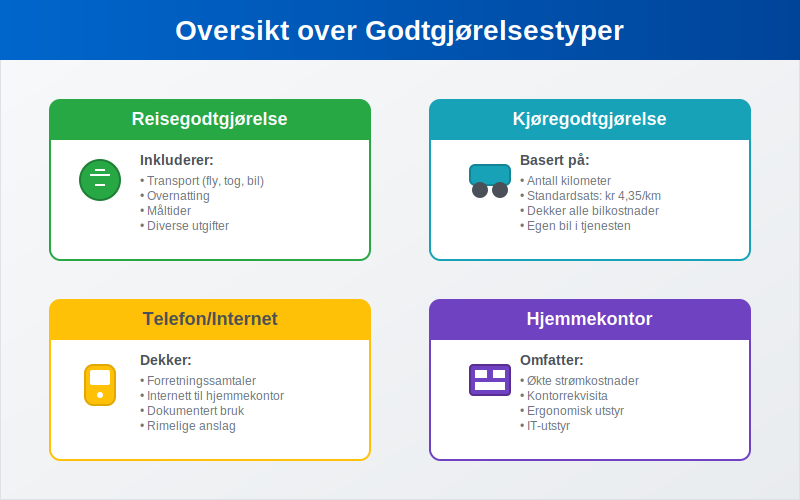
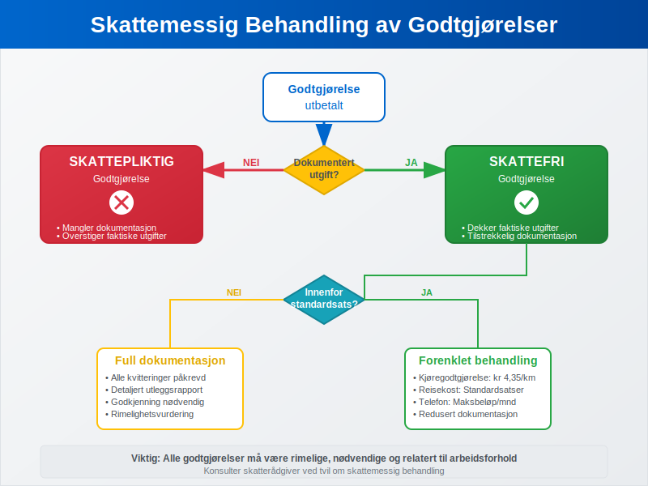
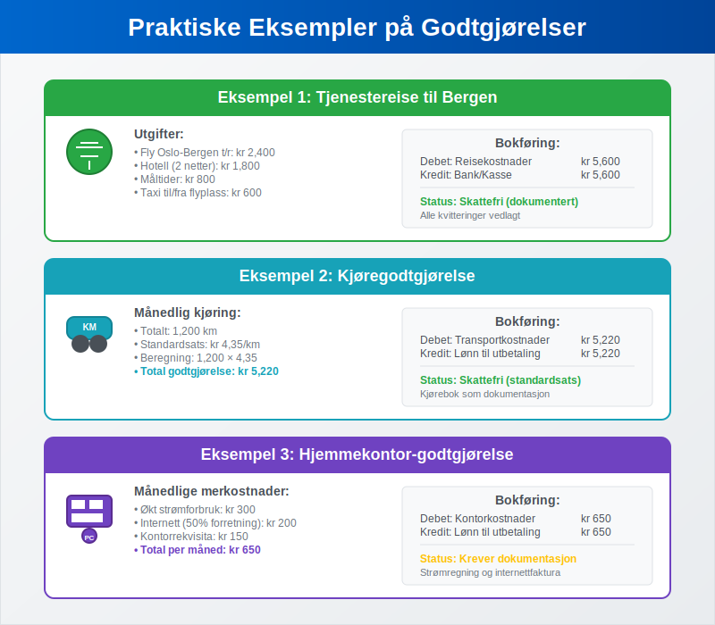

---
title: "Hva er godtgjørelse (regnskap)?"
seoTitle: "Hva er godtgjørelse (regnskap)?"
meta_description: '**Godtgjørelse** i regnskapssammenheng refererer til refusjon eller kompensasjon som utbetales til ansatte, partnere eller andre for utgifter de har hatt på v...'
slug: hva-er-godtgjorelse
type: blog
layout: pages/single
---

**Godtgjørelse** i regnskapssammenheng refererer til refusjon eller kompensasjon som utbetales til ansatte, partnere eller andre for utgifter de har hatt på vegne av bedriften. Dette er et sentralt konsept i [regnskapsføring](/blogs/regnskap/hva-er-regnskap "Hva er Regnskap? Komplett Guide til Regnskapsføring i Norge") og krever nøye håndtering for å sikre korrekt [bokføring](/blogs/regnskap/hva-er-bokforing "Hva er Bokføring? Komplett Guide til Regnskapsføring og Bokføringsprinsipper") og skattemessig behandling.

Godtgjørelser skiller seg fra vanlig lønn ved at de kompenserer for faktiske utgifter som er pådratt i arbeidssammenheng, ikke for arbeidsinnsats. Det er også viktig å skille godtgjørelser fra [honorar](/blogs/regnskap/hva-er-honorar "Hva er Honorar i Regnskap? Komplett Guide til Honorarutbetalinger og Skattebehandling"), som er [vederlag](/blogs/regnskap/hva-er-vederlag "Hva er Vederlag i Regnskap? Komplett Guide til Vederlag og Kompensasjon") for utførte tjenester uten tradisjonelt arbeidsforhold. Korrekt håndtering av godtgjørelser er essensielt for å opprettholde god internkontroll og for å sikre at bedriften overholder gjeldende [bokføringsregler](/blogs/regnskap/hva-er-bokforingsregler "Hva er Bokføringsregler? Komplett Guide til Norske Regnskapsbestemmelser").

## Seksjon 1: Typer Godtgjørelser



Godtgjørelser kan kategoriseres i flere hovedtyper, hver med sine spesifikke regler for behandling og dokumentasjon:

### 1.1 Reisegodtgjørelse

**Reisegodtgjørelse** er den vanligste formen for godtgjørelse og dekker utgifter knyttet til tjenestereiser. Dette inkluderer:

* **Transport:** Fly, tog, buss, drivstoff og bompenger
* **Overnatting:** Hotell, pensjonat eller andre overnattingssteder  
* **Måltider:** Frokost, lunsj og middag under reisen
* **Diverse utgifter:** Parkering, taxi, telefon og internett

Reisegodtgjørelser kan utbetales som **forskudd** før reisen eller som **refusjon** etter at utgiftene er dokumentert. Mange bedrifter bruker standardiserte satser basert på Skatteetatens anbefalinger for å forenkle administrasjonen.

### 1.2 Kjøregodtgjørelse

For ansatte som bruker egen bil i tjenesten, utbetales **kjøregodtgjørelse** basert på antall kilometer kjørt. Skatteetaten fastsetter årlig en standardsats som dekker:

* Drivstoff og vedlikehold
* Forsikring og avgifter
* Verdiforringelse (avskrivning)

| År | Standardsats per km |
|---|---|
| 2024 | kr 4,35 |
| 2023 | kr 4,15 |
| 2022 | kr 3,70 |

### 1.3 Telefon- og Internetgodtgjørelse

Når ansatte bruker private telefon- og internettjenester i arbeidssammenheng, kan bedriften yte godtgjørelse for den forretningsrelaterte bruken. Dette krever dokumentasjon av faktisk bruk eller kan baseres på rimelige anslag.

### 1.4 Hjemmekontor-godtgjørelse

Spesielt relevant etter pandemien, kan bedrifter yte godtgjørelse for hjemmekontor-utgifter som:

* Økte strømkostnader
* Kontorrekvisita og utstyr
* Ergonomiske møbler
* IT-utstyr og programvare

## Seksjon 2: Skattemessig Behandling



Den skattemessige behandlingen av godtgjørelser avhenger av type, størrelse og dokumentasjon:

### 2.1 Skattefrie Godtgjørelser

Godtgjørelser som dekker **faktiske utgifter** med tilstrekkelig dokumentasjon er normalt skattefrie for mottakeren. Dette gjelder når:

* Utgiften er pådratt i arbeidssammenheng
* Beløpet ikke overstiger faktiske kostnader
Dokumentasjon ([kvitteringer](/blogs/regnskap/kvittering "Hva er Kvittering? En Guide til Kvitteringskrav i Norsk Regnskap")/bilag) foreligger
* Godtgjørelsen er rimelig og nødvendig

### 2.2 Skattepliktige Godtgjørelser

Godtgjørelser blir skattepliktige når de:

* Overstiger faktiske utgifter
* Mangler tilstrekkelig dokumentasjon
* Gis som fast månedlig beløp uten kobling til faktiske utgifter
* Anses som skjult lønn

### 2.3 Standardsatser og Forenklingsregler

Skatteetaten har etablert **standardsatser** for vanlige godtgjørelser som forenkler behandlingen:

* **Reisekost innenlands:** Faste satser for måltider og overnatting
* **Kjøregodtgjørelse:** Fast sats per kilometer
* **Telefongodtgjørelse:** Maksimalbeløp per måned

Bruk av standardsatser reduserer dokumentasjonskravene og forenkler både [lønnsbehandling](/blogs/regnskap/hva-er-fastlonn "Hva er Fastlønn? Komplett Guide til Lønnssystemer og Lønnsbehandling") og regnskapsføring.

## Seksjon 3: Bokføringsprinsipper

Korrekt bokføring av godtgjørelser krever forståelse av underliggende regnskapsprinsipper og kontostruktur:

### 3.1 Kontoplan og Kontering

Godtgjørelser bokføres normalt på følgende kontotyper:

* **Reisekostnader (konto 6000-6099):** For reiserelaterte godtgjørelser
* **Transportkostnader (konto 6100-6199):** For kjøregodtgjørelse og transport
* **Kontorkostnader (konto 6300-6399):** For telefon og kontorrekvisita
* **Andre driftskostnader:** For øvrige godtgjørelser

### 3.2 Bilagsbehandling og Dokumentasjon

Alle godtgjørelser må dokumenteres gjennom [bilagsføring](/blogs/regnskap/hva-er-bilagsforing "Hva er Bilagsføring? Komplett Guide til Regnskapsbilag og Dokumentasjon") som inkluderer:

* **Utleggsrapport:** Detaljert oversikt over utgifter
* **Originalkvitteringer:** For alle utgifter over kr 200 bruk original [kvittering](/blogs/regnskap/kvittering "Hva er Kvittering? En Guide til Kvitteringskrav i Norsk Regnskap")
* **Reiseregning:** Med formål, destinasjon og varighet
* **Godkjenning:** Fra autorisert person i organisasjonen

Moderne bedrifter bruker ofte digitale løsninger for [bilagsmottak](/blogs/regnskap/hva-er-bilagsmottak "Bilagsmottak - Komplett Guide til Dokumentmottak og Fakturabehandling") som forenkler innsamling og behandling av godtgjørelsesbilag.

### 3.3 Periodisering og Timing

Godtgjørelser skal bokføres i den perioden utgiften påløper, ikke nødvendigvis når utbetalingen skjer. Dette følger [periodiseringsprinsippet](/blogs/regnskap/hva-er-regnskap "Hva er Regnskap? Komplett Guide til Regnskapsføring i Norge") i regnskapet.

## Seksjon 4: Praktiske Eksempler



### Eksempel 1: Tjenestereise til Bergen

En ansatt reiser til Bergen for kundemøte:

**Utgifter:**
* Fly Oslo-Bergen t/r: kr 2,400
* Hotell (2 netter): kr 1,800
* Måltider: kr 800
* Taxi til/fra flyplass: kr 600

**Bokføring:**
```
Debet: Reisekostnader kr 5,600
Kredit: Bank/Kasse kr 5,600
```

### Eksempel 2: Kjøregodtgjørelse

En ansatt kjører 1,200 km i tjenesten i løpet av måneden:

**Beregning:**
1,200 km × kr 4,35 = kr 5,220

**Bokføring:**
```
Debet: Transportkostnader kr 5,220
Kredit: Lønn til utbetaling kr 5,220
```

**Viktig:** For å kunne kreve kjøregodtgjørelse må forretningsbruken dokumenteres gjennom systematisk [kjørebokføring](/blogs/regnskap/hva-er-kjorebok "Hva er Kjørebok? Komplett Guide til Kjørebok for Bedrifter i Norge"). Uten korrekt kjørebok risikerer bedriften å miste retten til fradrag ved skattekontroll.

### Eksempel 3: Hjemmekontor-godtgjørelse

Månedlig godtgjørelse for hjemmekontor basert på faktiske merkostnader:

**Komponenter:**
* Økt strømforbruk: kr 300
* Internett (50% forretningsbruk): kr 200
* Kontorrekvisita: kr 150

**Total:** kr 650 per måned

## Seksjon 5: Internkontroll og Rutiner

Effektiv håndtering av godtgjørelser krever etablerte rutiner og kontroller:

### 5.1 Godkjenningsrutiner

Alle godtgjørelser må gjennom [attestering](/blogs/regnskap/hva-er-attestering "Hva er Attestering? En Komplett Guide til Bilagsbehandling og Godkjenning") før utbetaling:

* **Saklig kontroll:** Er utgiften nødvendig og rimelig?
* **Formell kontroll:** Er dokumentasjonen komplett?
* **Økonomisk kontroll:** Er beløpet innenfor budsjett og retningslinjer?

### 5.2 Retningslinjer og Policyer

Bedrifter bør etablere klare retningslinjer som dekker:

* **Godkjente utgiftstyper:** Hva som kan refunderes
* **Beløpsgrenser:** Maksimalbeløp for ulike kategorier
* **Dokumentasjonskrav:** Hvilke bilag som kreves
* **Godkjenningsnivåer:** Hvem som kan godkjenne ulike beløp

### 5.3 Digitale Løsninger

Moderne bedrifter implementerer digitale systemer for:

* **Utleggsrapportering:** Mobile apper for registrering
* **Bilagshåndtering:** Automatisk OCR og kategorisering
* **Godkjenningsflyt:** Elektronisk godkjenning og oppfølging
* **Integrasjon:** Direkte kobling til lønn og regnskap

## Seksjon 6: Juridiske Aspekter og Compliance

### 6.1 Arbeidsmiljøloven

[Arbeidsmiljøloven](https://lovdata.no/dokument/NL/lov/2005-06-17-62) regulerer arbeidsgivers plikt til å dekke nødvendige utgifter:

* **§ 14-15:** Arbeidsgiver skal dekke nødvendige utgifter ved tjenestereiser
* **Rimelighetsprinsippet:** Utgifter må være rimelige og nødvendige
* **Dokumentasjonsplikt:** Arbeidstaker må dokumentere utgiftene

### 6.2 Skatteloven og Forskrifter

Skattemessig behandling reguleres av:

* **Skatteloven § 5-1:** Definisjon av skattepliktig inntekt
* **Skatteloven § 6-44:** Fradrag for reisekostnader
* **FSFIN (Finansdepartementets forskrift):** Detaljerte regler for godtgjørelser

### 6.3 Bokføringsloven

[Bokføringsloven](/blogs/regnskap/hva-er-bokforingsloven "Hva er Bokføringsloven? Komplett Guide til Norsk Regnskapslovgivning") stiller krav til:

* **Dokumentasjon:** Alle transaksjoner må dokumenteres
* **Oppbevaring:** Bilag må oppbevares i minimum 5 år
* **Sporbarhet:** Klar sammenheng mellom bilag og bokføring

## Seksjon 7: Utfordringer og Fallgruver

### 7.1 Vanlige Feil

* **Manglende dokumentasjon:** Kvitteringer som ikke oppbevares
* **Privat vs. forretning:** Blanding av private og forretningsrelaterte utgifter
* **Overskridelse av satser:** Bruk av høyere satser enn tillatt
* **Forsinket rapportering:** Utgifter som rapporteres for sent

### 7.2 Risikostyring

For å minimere risiko bør bedrifter:

* **Etablere klare retningslinjer** for alle typer godtgjørelser
* **Implementere systematisk kontroll** av alle utbetalinger
* **Bruke digitale løsninger** for bedre sporbarhet
* **Gjennomføre regelmessige revisjoner** av godtgjørelsespraksis

### 7.3 Skattemessige Konsekvenser

Feil håndtering kan føre til:

* **Tilleggsskatt** for bedriften
* **Skatteplikt** for ansatte
* **Renter og gebyrer** fra skattemyndighetene
* **Omdømmetap** og tillitssvikt

## Seksjon 8: Fremtidige Trender

### 8.1 Digitalisering

Utviklingen går mot:

* **Automatisk kategorisering** av utgifter
* **AI-basert kontroll** av rimelighetsvurderinger
* **Sanntidsrapportering** og godkjenning
* **Integrerte løsninger** på tvers av systemer

### 8.2 Regulatoriske Endringer

Forventede endringer inkluderer:

* **Strengere dokumentasjonskrav** for hjemmekontor
* **Nye satser** for elektriske kjøretøy
* **Utvidede digitale krav** for bilagsbehandling
* **Harmonisering** med EU-regelverk

### 8.3 Bærekraft og CSR

Økende fokus på:

* **Miljøvennlige reisealternativer** med høyere godtgjørelser
* **Karbonkompensasjon** som del av reisepolicyen
* **Lokale leverandører** for å redusere reisebehov
* **Rapportering** av miljøpåvirkning fra tjenestereiser

## Konklusjon

Godtgjørelser er en kompleks, men viktig del av moderne regnskapsføring som krever grundig forståelse av både regnskapsmessige og skattemessige prinsipper. Korrekt håndtering sikrer ikke bare compliance med gjeldende regelverk, men bidrar også til effektiv [driftskostnadsstyring](/blogs/regnskap/hva-er-driftskostnader "Hva er Driftskostnader? Komplett Guide til Kostnadstyper og Regnskapsføring") og god internkontroll.

Ved å etablere klare rutiner, bruke moderne digitale løsninger og holde seg oppdatert på regelverksendringer, kan bedrifter håndtere godtgjørelser på en måte som både ivaretar ansattes behov og bedriftens økonomiske interesser. Dette bidrar til å styrke tilliten mellom arbeidsgiver og arbeidstaker, samtidig som det sikrer korrekt regnskapsføring og skattemessig behandling.

For bedrifter som ønsker å optimalisere sin håndtering av godtgjørelser, anbefales det å gjennomgå eksisterende rutiner regelmessig og vurdere implementering av moderne digitale løsninger som kan automatisere og forenkle prosessene.


