---
title: "Hva er goodwill?"
seoTitle: "Hva er goodwill?"
meta_description: '**Goodwill** er en **immateriell [eiendel](/blogs/regnskap/hva-er-eiendel "Hva er Eiendel i Regnskap? Komplett Guide til Eiendom og Verdier")** som oppstår nå...'
slug: hva-er-goodwill
type: blog
layout: pages/single
---

**Goodwill** er en **immateriell [eiendel](/blogs/regnskap/hva-er-eiendel "Hva er Eiendel i Regnskap? Komplett Guide til Eiendom og Verdier")** som oppstår når et selskap kjøper et annet selskap for en pris som overstiger den virkelige verdien av de identifiserbare [eiendelene](/blogs/regnskap/hva-er-eiendel "Hva er Eiendel i Regnskap? Komplett Guide til Eiendom og Verdier") minus gjeld. Goodwill representerer **[imaterielle verdier](/blogs/regnskap/hva-er-imaterielle-rettigheter "Hva er Imaterielle Rettigheter? Komplett Guide til Regnskapsføring og Verdivurdering")** som merkevaregjenkjenning, kundelojalitet, ansattes kompetanse og markedsposisjon som ikke kan måles direkte, men som bidrar til selskapets fremtidige inntjeningsevne. I norsk kontoplan registreres goodwill på [konto 1080](/blogs/kontoplan/1080-goodwill "Konto 1080 - Goodwill").

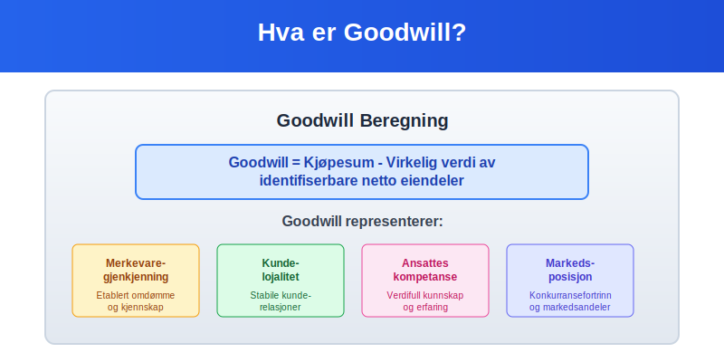

## Seksjon 1: Definisjon og Grunnleggende Konsepter

### 1.1 Hva er Goodwill?

**Goodwill** er forskjellen mellom **kjøpesummen** for et selskap og den **virkelige verdien** av dets identifiserbare netto [eiendeler](/blogs/regnskap/hva-er-anleggsmidler "Hva er Anleggsmidler? Komplett Guide til Faste Eiendeler i Regnskap"). Dette konseptet er sentralt i [regnskapsføring](/blogs/regnskap/hva-er-bokforing "Hva er Bokføring? En Komplett Guide til Regnskapsføring") ved oppkjøp og fusjoner.

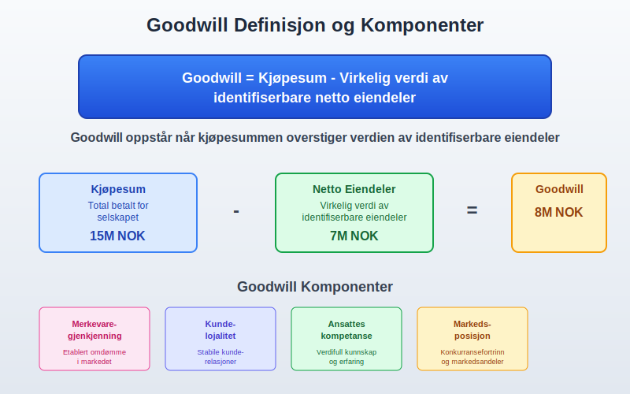

### 1.2 Komponenter av Goodwill

Goodwill består av flere **immaterielle faktorer**:

* **Merkevaregjenkjenning:** Etablert omdømme og kjennskap i markedet
* **Kundelojalitet:** Stabile og lojale kunderelasjoner
* **Ansattes kompetanse:** Verdifull kunnskap, erfaring og ferdigheter
* **Markedsposisjon:** Konkurransefortrinn og markedsandeler
* **Synergier:** Forventede kostnadsbesparelser og inntektsøkninger
* **Teknologi og prosesser:** Proprietære systemer og arbeidsmetoder

### 1.3 Typer Goodwill

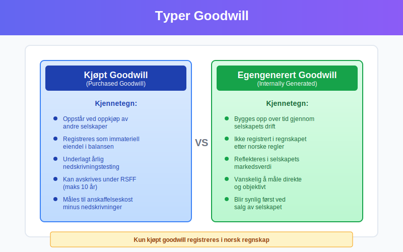

Det finnes to hovedtyper goodwill:

#### Kjøpt Goodwill (Purchased Goodwill)
* Oppstår ved **oppkjøp** av andre selskaper
* Registreres som [immateriell eiendel](/blogs/regnskap/hva-er-anleggsmidler "Hva er Anleggsmidler? Komplett Guide til Faste Eiendeler i Regnskap") i [balansen](/blogs/regnskap/hva-er-balanse "Hva er Balanse? En Komplett Guide til Balanseregnskap")
* Underlagt **nedskrivningstesting**

#### Egengenerert Goodwill (Internally Generated Goodwill)
* Bygges opp over tid gjennom selskapets drift
* **Ikke registrert** i regnskapet etter norske regnskapsregler
* Reflekteres i **markedsverdien** av selskapet

## Seksjon 2: Beregning av Goodwill

### 2.1 Grunnleggende Beregningsformel

**Goodwill = Kjøpesum - Virkelig verdi av identifiserbare netto eiendeler**

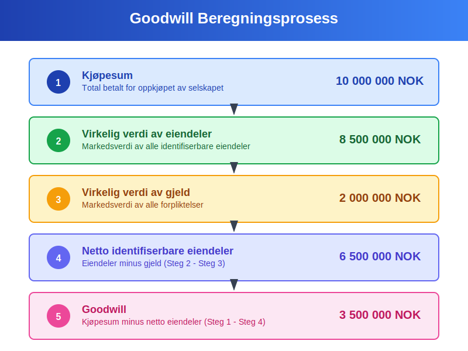

### 2.2 Detaljert Beregningsprosess

| Steg | Beskrivelse | Eksempel (NOK) |
|------|-------------|----------------|
| 1 | **Kjøpesum** | 10 000 000 |
| 2 | **Virkelig verdi av eiendeler** | 8 500 000 |
| 3 | **Virkelig verdi av gjeld** | 2 000 000 |
| 4 | **Netto identifiserbare eiendeler** (Steg 2 - Steg 3) | 6 500 000 |
| 5 | **Goodwill** (Steg 1 - Steg 4) | 3 500 000 |

### 2.3 Praktisk Eksempel: Oppkjøp av Teknologiselskap

La oss se på et praktisk eksempel hvor **TechCorp AS** kjøper **InnoSoft AS**:

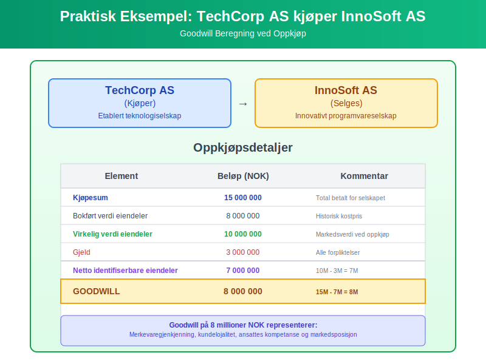

**Oppkjøpsdetaljer:**
* **Kjøpesum:** 15 millioner NOK
* **Bokført verdi av eiendeler:** 8 millioner NOK
* **Virkelig verdi av eiendeler:** 10 millioner NOK
* **Gjeld:** 3 millioner NOK

**Beregning:**
* Netto identifiserbare eiendeler til virkelig verdi: 10M - 3M = 7M NOK
* Goodwill: 15M - 7M = **8 millioner NOK**

## Seksjon 3: Regnskapsføring av Goodwill

### 3.1 Førstegangsregistrering

Ved oppkjøp registreres goodwill som en **immateriell [anleggsmiddel](/blogs/regnskap/hva-er-anleggsmidler "Hva er Anleggsmidler? Komplett Guide til Faste Eiendeler i Regnskap")**:

**Regnskapspost:**
```
Debet: Goodwill                    8 000 000
Debet: Andre eiendeler            10 000 000
Kredit: Gjeld                      3 000 000
Kredit: Bank/Kontanter            15 000 000
```

### 3.2 Etterfølgende Måling

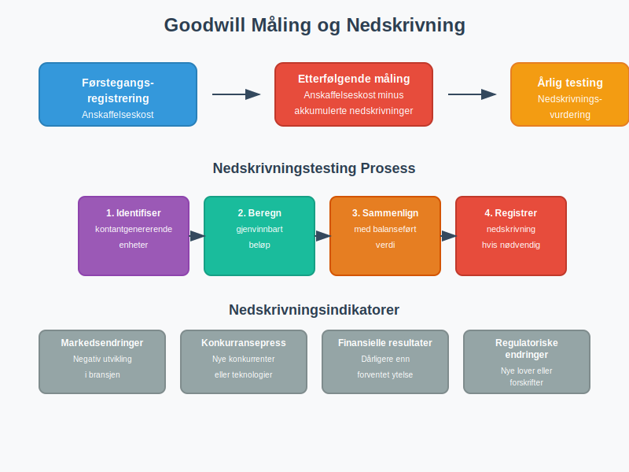

Etter førstegangsregistrering måles goodwill til:
* **Anskaffelseskost** minus
* **Akkumulerte nedskrivninger**

### 3.3 Nedskrivningstesting

**Goodwill avskrives ikke** på systematisk basis, men må testes for **nedskrivning** minst årlig:

#### Nedskrivningsindikatorer:
* **Markedsendringer:** Negativ utvikling i bransjen
* **Konkurransepress:** Nye konkurrenter eller teknologier
* **Finansielle resultater:** Dårligere enn forventet ytelse
* **Regulatoriske endringer:** Nye lover eller forskrifter

#### Nedskrivningsprosess:
1. **Identifiser kontantgenererende enheter**
2. **Beregn gjenvinnbart beløp**
3. **Sammenlign med balanseført verdi**
4. **Registrer nedskrivning** hvis nødvendig

## Seksjon 4: Goodwill i Norske Regnskapsregler

### 4.1 Regnskapsstandard for Små Foretak (RSFF)

Under **RSFF** kan goodwill:
* **Avskrives** over maksimalt 10 år
* **[Nedskrives](/blogs/regnskap/hva-er-nedskrivning "Hva er Nedskrivning? Komplett Guide til Nedskrivning av Eiendeler i Norsk Regnskap")** ved verdifall
* **Ikke reaktiveres** etter nedskrivning

### 4.2 Norsk Regnskapslov og God Regnskapsskikk

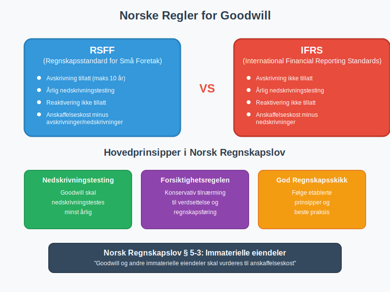

**Hovedprinsipper:**
* Goodwill skal **[nedskrivningstestes](/blogs/regnskap/hva-er-nedskrivning "Hva er Nedskrivning? Komplett Guide til Nedskrivning av Eiendeler i Norsk Regnskap")** årlig
* **Systematisk avskrivning** er ikke tillatt under IFRS
* **Forsiktighetsregelen** gjelder ved verdsettelse

### 4.3 Sammenligning: RSFF vs IFRS

| Aspekt | RSFF | IFRS |
|--------|------|------|
| **Avskrivning** | Tillatt (maks 10 år) | Ikke tillatt |
| **Nedskrivningstesting** | Årlig | Årlig |
| **Reaktivering** | Ikke tillatt | Ikke tillatt |
| **Måling** | Anskaffelseskost minus avskrivninger/nedskrivninger | Anskaffelseskost minus nedskrivninger |

## Seksjon 5: Verdsettelse og Vurdering

### 5.1 Metoder for Verdsettelse

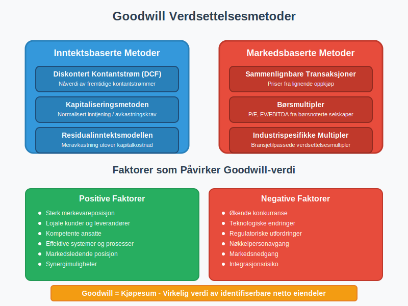

#### Inntektsbaserte Metoder:
* **Diskontert kontantstrøm (DCF)**
* **Kapitaliseringsmetoden**
* **Residualinntektsmodellen**

#### Markedsbaserte Metoder:
* **Sammenlignbare transaksjoner**
* **Børsmultipler**
* **Industrispesifikke multipler**

### 5.2 Faktorer som Påvirker Goodwill-verdi

**Positive faktorer:**
* Sterk merkevareposisjon
* Lojale kunder og leverandører
* Kompetente ansatte
* Effektive systemer og prosesser
* Markedsledende posisjon

**Negative faktorer:**
* Økende konkurranse
* Teknologiske endringer
* Regulatoriske utfordringer
* Nøkkelpersonavgang
* Markedsnedgang

## Seksjon 6: Goodwill i Ulike Bransjer

### 6.1 Teknologisektoren

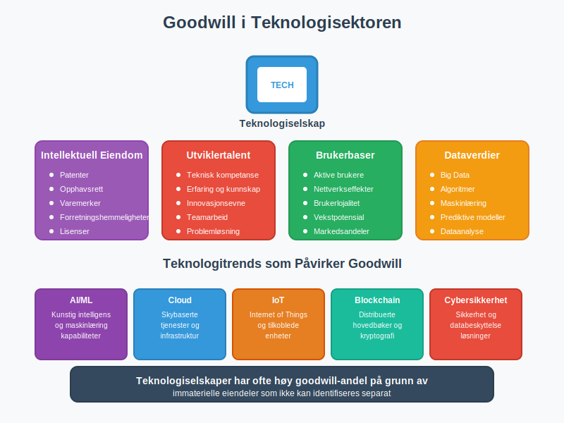

I teknologiselskaper består goodwill ofte av:
* **Intellektuell eiendom** og patenter
* **Utviklertalent** og teknisk kompetanse
* **Brukerbaser** og nettverkseffekter
* **Dataverdier** og algoritmer

### 6.2 Detaljhandel

**Goodwill-komponenter:**
* **Merkevaregjenkjenning** og kundelojalitet
* **Beliggenhet** og etablerte handelssteder
* **Leverandørrelasjoner** og innkjøpsavtaler
* **Distribusjonsnett** og logistikksystemer

### 6.3 Tjenesteyting

**Viktige elementer:**
* **Klientrelasjoner** og gjentakende inntekter
* **Profesjonell ekspertise** og omdømme
* **Prosesser** og metodikk
* **Nettverk** og partnerskap

## Seksjon 7: Praktiske Utfordringer og Løsninger

### 7.1 Vanlige Utfordringer

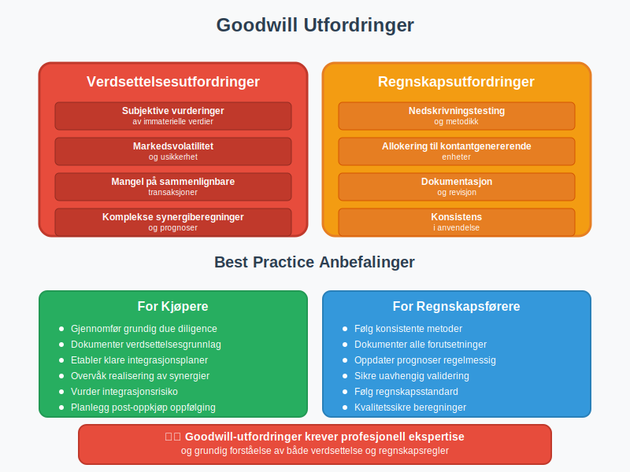

#### Verdsettelsesutfordringer:
* **Subjektive vurderinger** av immaterielle verdier
* **Markedsvolatilitet** og usikkerhet
* **Mangel på sammenlignbare transaksjoner**
* **Komplekse synergiberegninger**

#### Regnskapsutfordringer:
* **Nedskrivningstesting** og metodikk
* **Allokering** til kontantgenererende enheter
* **Dokumentasjon** og revisjon
* **Konsistens** i anvendelse

### 7.2 Best Practice Anbefalinger

**For kjøpere:**
* Gjennomfør grundig **due diligence**
* Dokumenter **verdsettelsesgrunnlag** grundig
* Etabler klare **integrasjonsplaner**
* Overvåk **realisering av synergier**

**For regnskapsførere:**
* Følg **konsistente metoder** for nedskrivningstesting
* Dokumenter alle **vesentlige forutsetninger**
* Oppdater **prognoser** regelmessig
* Sikre **uavhengig validering** av verdivurderinger

## Seksjon 8: Goodwill og Skattemessige Forhold

### 8.1 Skattemessig Behandling

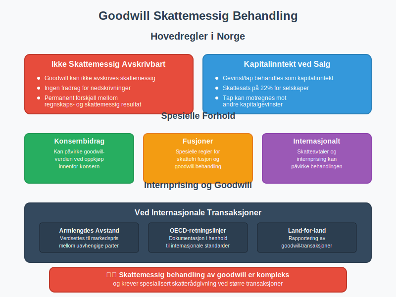

**Hovedregler:**
* Goodwill er **ikke skattemessig avskrivbart** i Norge
* **Gevinst/tap** ved salg behandles som kapitalinntekt
* **[Konsernbidrag](/blogs/regnskap/hva-er-konsernbidrag "Hva er Konsernbidrag? Komplett Guide til Konsernbidrag i Norge")** kan påvirke goodwill-verdien
* **Fusjoner** har spesielle regler

### 8.2 Internprising og Goodwill

Ved **internasjonale transaksjoner** må goodwill:
* Verdsettes til **armlengdes avstand**
* Dokumenteres i henhold til **OECD-retningslinjer**
* Rapporteres i **land-for-land rapportering**

## Seksjon 9: Fremtidige Utviklingstrender

### 9.1 Digitalisering og Goodwill

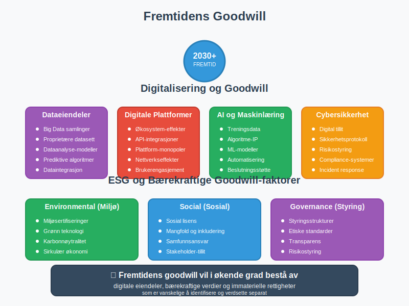

**Nye goodwill-komponenter:**
* **Dataeiendeler** og algoritmer
* **Digitale plattformer** og økosystemer
* **Kunstig intelligens** og maskinlæring
* **Cybersikkerhet** og digital tillit

### 9.2 ESG og Bærekraft

**Bærekraftige goodwill-faktorer:**
* **Miljøsertifiseringer** og grønn teknologi
* **Sosial lisens** til å operere
* **Styringsstrukturer** og etikk
* **Omdømmekapital** knyttet til bærekraft

## Seksjon 10: Konklusjon og Nøkkelpunkter

### 10.1 Sammendrag

**Goodwill** er en kompleks men viktig [immateriell eiendel](/blogs/regnskap/hva-er-anleggsmidler "Hva er Anleggsmidler? Komplett Guide til Faste Eiendeler i Regnskap") som krever:

* **Grundig forståelse** av verdsettelsesprinsipper
* **Konsistent anvendelse** av regnskapsregler
* **Regelmessig overvåking** og nedskrivningstesting
* **Profesjonell dømmekraft** i vurderinger

### 10.2 Nøkkelpunkter å Huske

* Goodwill oppstår kun ved **oppkjøp** av andre selskaper
* Det representerer **immaterielle verdier** som ikke kan identifiseres separat
* **Nedskrivningstesting** er påkrevd minst årlig
* **Norske regnskapsregler** tillater avskrivning under RSFF
* **Verdsettelse** krever profesjonell ekspertise og dømmekraft

### 10.3 Relaterte Artikler

For å få en dypere forståelse av relaterte konsepter, anbefaler vi å lese:

* [Hva er imaterielle rettigheter?](/blogs/regnskap/hva-er-imaterielle-rettigheter "Hva er Imaterielle Rettigheter? Komplett Guide til Regnskapsføring og Verdivurdering")
* [Hva er anleggsmidler?](/blogs/regnskap/hva-er-anleggsmidler "Hva er Anleggsmidler? Komplett Guide til Faste Eiendeler i Regnskap")
* [Hva er avskrivning?](/blogs/regnskap/hva-er-avskrivning "Hva er Avskrivning? En Komplett Guide til Avskrivningsmetoder")
* [Hva er amortisering?](/blogs/regnskap/hva-er-amortisering "Hva er Amortisering? En Komplett Guide til Avskrivninger")
* [Hva er balanse?](/blogs/regnskap/hva-er-balanse "Hva er Balanse? En Komplett Guide til Balanseregnskap")
* [Konto 1000 - Forskning og utvikling](/blogs/kontoplan/1000-forskning-og-utvikling "Hva er Konto 1000 - Forskning og utvikling?")
* [Hva er et aksjeselskap?](/blogs/regnskap/hva-er-et-aksjeselskap "Hva er et Aksjeselskap? Komplett Guide til AS i Norge")

Goodwill vil fortsette å være et sentralt element i moderne [regnskapsføring](/blogs/regnskap/hva-er-regnskap "Hva er Regnskap? En Komplett Guide til Regnskapsføring"), spesielt ettersom [**immaterielle eiendeler**](/blogs/regnskap/hva-er-imaterielle-eiendeler "Hva er Imaterielle Eiendeler? Komplett Guide til Immaterielle Verdier i Regnskap") blir stadig viktigere i dagens kunnskapsøkonomi.


