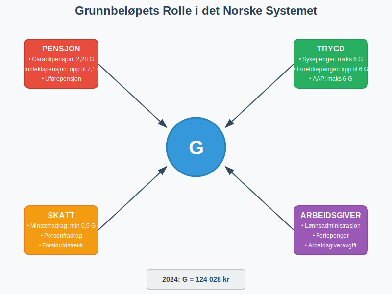
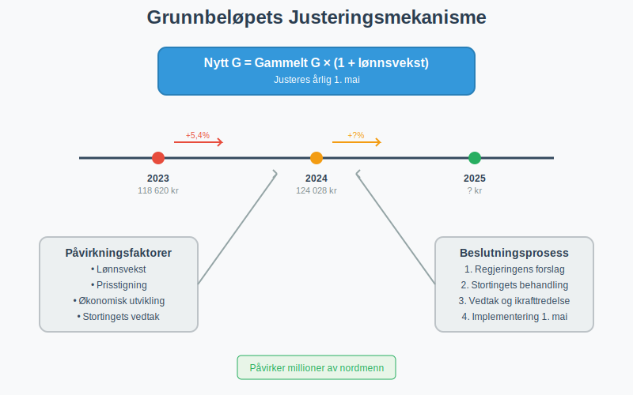
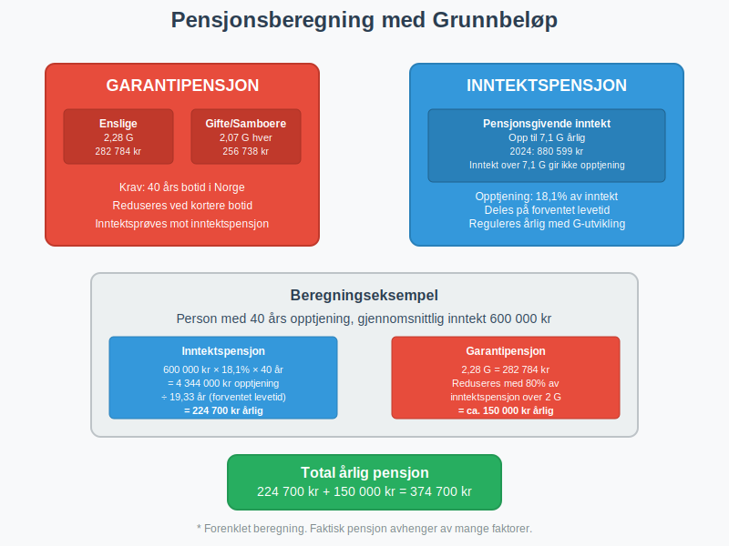
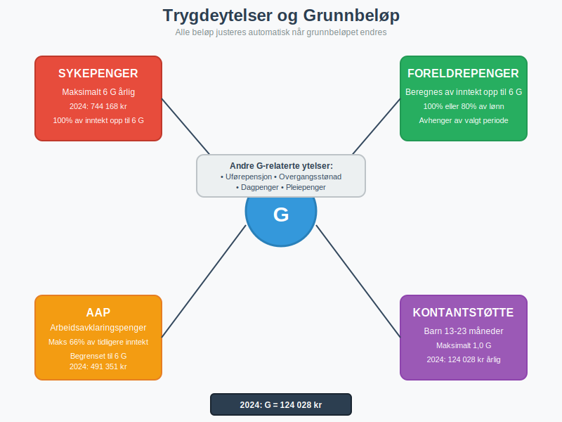
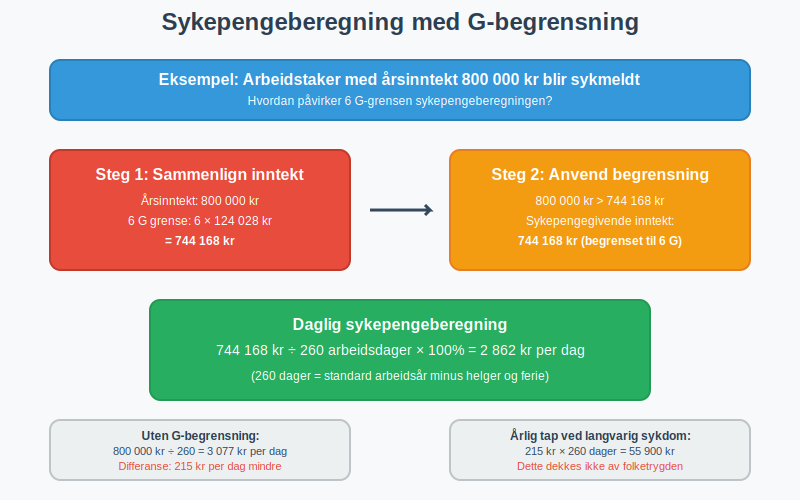
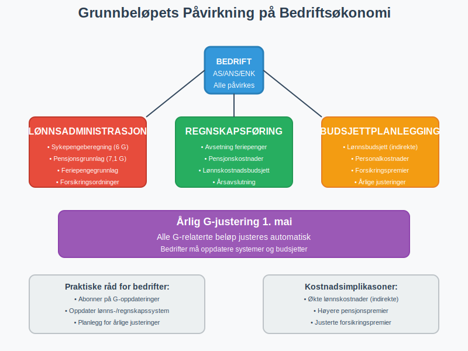
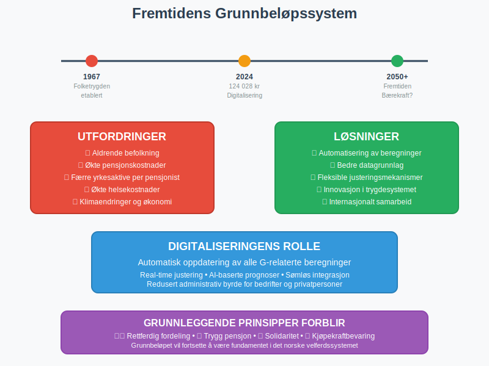

---
title: "Hva er grunnbeløp?"
seoTitle: "Hva er grunnbeløp?"
description: '**Grunnbeløpet** (forkortet **G**) er en av de mest fundamentale størrelsene i det norske trygde- og skattesystemet. Det fungerer som en referanseenhet som br...'
---

**Grunnbeløpet** (forkortet **G**) er en av de mest fundamentale størrelsene i det norske trygde- og skattesystemet. Det fungerer som en referanseenhet som brukes til å beregne en rekke offentlige ytelser, pensjon, skattefradrag og arbeidsgiverforhold. Denne artikkelen gir en omfattende gjennomgang av grunnbeløpets rolle, beregning og praktiske anvendelse i norsk økonomi.

## Seksjon 1: Grunnbeløpets Definisjon og Formål

Grunnbeløpet er et årlig fastsatt beløp som justeres i takt med den generelle inntekts- og prisutviklingen i samfunnet. Det ble innført som en del av [folketrygden](/blogs/regnskap/hva-er-folketrygden "Hva er Folketrygden? Komplett Guide til Norges Trygdesystem") for å sikre at trygdeytelser og pensjoner opprettholder sin kjøpekraft over tid.

### 1.1 Historisk Bakgrunn

Grunnbeløpet ble etablert sammen med folketrygden i 1967 som en måte å standardisere og automatisere justeringen av trygdeytelser. Før dette måtte hver enkelt ytelse justeres individuelt gjennom politiske vedtak, noe som var både tidkrevende og inkonsistent.

### 1.2 Juridisk Grunnlag

Grunnbeløpet er hjemlet i **folketrygdloven § 1-4**, som gir Stortinget myndighet til å fastsette beløpet årlig. Justeringen skjer vanligvis 1. mai hvert år, basert på lønnsveksten for foregående år.

## Seksjon 2: Fastsettelse og Justering av Grunnbeløpet

### 2.1 Beregningsmetode

Grunnbeløpet justeres årlig basert på den gjennomsnittlige lønnsveksten i Norge. Formelen for justering er:

**Nytt G = Gammelt G × (1 + lønnsvekst)**

### 2.2 Historisk Utvikling av Grunnbeløpet

Tabellen nedenfor viser utviklingen av grunnbeløpet de siste 15 årene:

| År | Grunnbeløp (G) | Endring fra forrige år | Prosentvis økning |
|---|---|---|---|
| 2024 | 124 028 kr | +6 397 kr | 5,4% |
| 2023 | 118 620 kr | +7 583 kr | 6,8% |
| 2022 | 111 477 kr | +5 829 kr | 5,5% |
| 2021 | 106 399 kr | +4 174 kr | 4,1% |
| 2020 | 101 351 kr | +2 333 kr | 2,4% |
| 2019 | 99 858 kr | +3 346 kr | 3,5% |
| 2018 | 96 883 kr | +3 379 kr | 3,6% |
| 2017 | 93 634 kr | +1 563 kr | 1,7% |
| 2016 | 92 576 kr | +2 124 kr | 2,3% |
| 2015 | 90 068 kr | +2 837 kr | 3,3% |
| 2014 | 87 328 kr | +3 455 kr | 4,1% |
| 2013 | 85 245 kr | +2 775 kr | 3,4% |
| 2012 | 82 122 kr | +3 301 kr | 4,2% |
| 2011 | 79 216 kr | +3 301 kr | 4,3% |
| 2010 | 75 641 kr | +1 926 kr | 2,6% |

## Seksjon 3: Grunnbeløpets Anvendelsesområder

### 3.1 Pensjonsberegninger

Grunnbeløpet er fundamentalt for beregning av både **alderspensjon** og **uførepensjon**. Den nye alderspensjonen som ble innført i 2011 baserer seg på et komplekst system hvor grunnbeløpet spiller en sentral rolle.

#### 3.1.1 Garantipensjon

Garantipensjonen utgjør en minimumsytelse for alle som har bodd i Norge i minst 40 år. For 2024 er garantipensjonen:

* **Enslige:** 2,28 G (282 784 kr)
* **Gifte/samboere:** 2,07 G hver (256 738 kr hver)

#### 3.1.2 Inntektspensjon

Inntektspensjonen beregnes basert på pensjonsgivende inntekt opp til 7,1 G årlig. Inntekt over dette nivået gir ikke rett til ytterligere inntektspensjon.

### 3.2 Trygdeytelser

En rekke trygdeytelser beregnes som en andel av grunnbeløpet:

* **Barnetrygd:** Fast beløp per barn (ikke knyttet til G)
* **Kontantstøtte:** Maksimalt 1,0 G for barn 13-23 måneder
* **[Foreldrepenger](/blogs/regnskap/fodselspermisjon "Fødselspermisjon “ Guide til foreldrepenger og regnskapsføring")**: Beregnes av pensjonsgivende inntekt opp til 6 G
* **Sykepenger:** Maksimalt 6 G årlig
* **Arbeidsavklaringspenger:** Maksimalt 66% av tidligere inntekt, begrenset til 6 G

### 3.3 Skattefradrag og -grenser

Grunnbeløpet påvirker også flere elementer i skattesystemet:

#### 3.3.1 Minstefradrag

Minstefradraget i [forskuddstrekk](/blogs/regnskap/hva-er-forskuddstrekk "Hva er Forskuddstrekk? Komplett Guide til Forskuddstrekk av Skatt") beregnes delvis basert på grunnbeløpet. For lønnsinntekt er minstefradraget minimum 4% av inntekten, men minst 0,5 G.

#### 3.3.2 Personfradrag

Personfradraget i skatt er ikke direkte knyttet til grunnbeløpet, men justeres ofte i takt med grunnbeløpets utvikling for å opprettholde kjøpekraften.

### 3.4 Arbeidsgiverforhold

For arbeidsgivere har grunnbeløpet betydning for flere forhold:

#### 3.4.1 Arbeidsgiveravgift

[Arbeidsgiveravgiften](/blogs/regnskap/hva-er-arbeidsgiveravgift "Hva er Arbeidsgiveravgift? Satser, Beregning og Regnskapsføring") beregnes av lønn og andre ytelser, med visse fradrag som kan være knyttet til grunnbeløpet.

#### 3.4.2 Feriepenger

[Feriepengene](/blogs/regnskap/hva-er-feriepenger "Hva er Feriepenger? Beregning, Regnskapsføring og Arbeidsgiverens Plikter") beregnes som 12% av feriepengegivende inntekt, hvor grunnbeløpet kan påvirke beregningsgrunnlaget for enkelte ytelser.

## Seksjon 4: Praktiske Beregningseksempler

### 4.1 Eksempel: Beregning av Sykepenger

La oss se på et praktisk eksempel på hvordan grunnbeløpet påvirker sykepengeberegningen:

**Situasjon:** En arbeidstaker har en årsinntekt på 800 000 kr og blir sykmeldt.

**Beregning:**
* Maksimal sykepengegivende inntekt: 6 G = 6 × 124 028 kr = 744 168 kr
* Siden 800 000 kr > 744 168 kr, begrenses grunnlaget til 744 168 kr
* Sykepenger per dag: (744 168 kr ÷ 260 dager) × 100% = 2 862 kr per dag

### 4.2 Eksempel: Pensjonsopptjening

**Situasjon:** En person har hatt følgende inntekter over karrieren:

* År 1-10: 400 000 kr årlig
* År 11-20: 600 000 kr årlig  
* År 21-30: 900 000 kr årlig

**Pensjonsopptjening:**
* Inntekt opp til 7,1 G gir pensjonsopptjening
* For 2024: 7,1 G = 880 599 kr
* År 21-30: Kun 880 599 kr av 900 000 kr gir pensjonsopptjening

## Seksjon 5: Grunnbeløpets Betydning for Bedrifter

### 5.1 Lønnsadministrasjon

Bedrifter må holde seg oppdatert på grunnbeløpet for korrekt beregning av:

* **Maksimal sykepengegivende inntekt** ved sykefravær
* **Pensjonsgivende inntekt** for ansatte
* **Feriepengegrunnlag** for enkelte ytelser
* **Forsikringsordninger** knyttet til inntektsnivå

### 5.2 Regnskapsføring

I [regnskapsføring](/blogs/regnskap/hva-er-regnskap "Hva er Regnskap? En Dybdeanalyse for Norge") må bedrifter ta hensyn til grunnbeløpsjusteringer når de:

* Beregner avsetninger for [feriepenger](/blogs/regnskap/hva-er-feriepenger "Hva er Feriepenger? Beregning, Regnskapsføring og Arbeidsgiverens Plikter")
* Estimerer pensjonskostnader
* Budsjetterer lønnskostnader for kommende år

### 5.3 Budsjettplanlegging

Når grunnbeløpet justeres årlig, påvirker dette bedriftenes:

* **Lønnsbudsjett:** Indirekte gjennom lønnsforhandlinger
* **Personalkostnader:** Direkte gjennom trygdeavgifter og pensjonsordninger
* **Forsikringspremier:** Mange forsikringer er knyttet til G-nivået

## Seksjon 6: Sammenligning med Andre Land

### 6.1 Nordiske Land

Andre nordiske land har lignende systemer:

* **Sverige:** Prisbasbelopp og inkomstbasbelopp
* **Danmark:** Grundbeløb for forskellige sociale ydelser
* **Finland:** Kansaneläkeindeksi

### 6.2 Internasjonale Perspektiver

Mange land bruker lignende referanseindekser for å justere sosiale ytelser, men få har et så sentralisert system som det norske grunnbeløpet.

## Seksjon 7: Fremtidige Utviklingstrekk

### 7.1 Demografiske Utfordringer

Med en aldrende befolkning vil grunnbeløpets rolle i pensjonssystemet bli enda viktigere. Regjeringen vurderer kontinuerlig justeringer for å sikre systemets bærekraft.

### 7.2 Digitalisering

Automatisering av beregninger basert på grunnbeløpet gjør systemet mer effektivt, men krever også at alle aktører holder seg oppdatert på endringer.

## Seksjon 8: Praktiske Råd for Bedrifter og Privatpersoner

### 8.1 For Bedrifter

* **Hold deg oppdatert:** Abonner på oppdateringer fra NAV og Skatteetaten
* **Systemoppdateringer:** Sørg for at lønns- og regnskapssystemer oppdateres med nye G-verdier
* **Budsjettplanlegging:** Ta høyde for årlige G-justeringer i budsjettarbeidet
* **Kompetanse:** Sørg for at [regnskapsførere](/blogs/regnskap/hva-er-en-regnskapsforer "Hva er en Regnskapsfører? Komplett Guide til Regnskapsføring") og lønnsadministratorer forstår G-systemet

### 8.2 For Privatpersoner

* **Pensjonsplanlegging:** Forstå hvordan G påvirker din fremtidige pensjon
* **Forsikring:** Vurder om forsikringsdekning bør justeres når G øker
* **Skatteplanlegging:** Følg med på hvordan G-endringer påvirker [fradrag](/blogs/regnskap/hva-er-fradrag "Hva er Fradrag i Skatt? Komplett Guide til Skattefradrag i Norge")

## Konklusjon

Grunnbeløpet er en hjørnestein i det norske velferds- og skattesystemet som påvirker millioner av nordmenn daglig. Fra pensjonsberegninger til sykepengeytelser, fra skattefradrag til arbeidsgiverforhold - grunnbeløpet er en fundamental størrelse som sikrer at det norske systemet justeres rettferdig og forutsigbart.

For bedrifter er det avgjørende å forstå hvordan grunnbeløpet påvirker [lønnsadministrasjon](/blogs/regnskap/hva-er-ansattreskontro "Hva er Ansattreskontro? Komplett Guide til Lønnsreskontro og Personaladministrasjon"), regnskapsføring og budsjettplanlegging. For privatpersoner er kunnskap om grunnbeløpet viktig for å forstå rettigheter og plikter i det norske systemet.

Med den kontinuerlige utviklingen av det norske samfunnet vil grunnbeløpet fortsette å være et sentralt verktøy for å sikre rettferdig fordeling og opprettholdelse av kjøpekraft for alle borgere.

