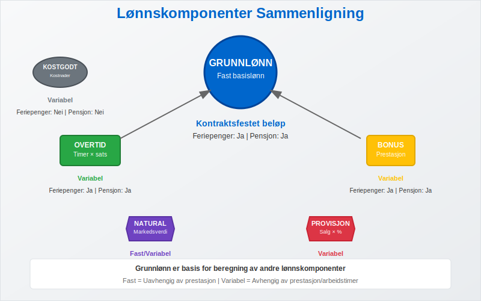

**Grunnlønn** er den faste basislønnen som utbetales til en ansatt før tillegg som overtidsbetaling, bonus, provisjon eller andre variable lønnskomponenter. Dette er **grunnlaget for beregning** av feriepenger, pensjon og andre lovpålagte ytelser. Grunnlønn utgjør kjernen i den ansattes [fastlønn](/blogs/regnskap/hva-er-fastlonn "Hva er Fastlønn i Regnskap?") og er avgjørende for både regnskapsmessig behandling og beregning av sosiale ytelser.


## Hva Kjennetegner Grunnlønn?

Grunnlønn har flere karakteristiske egenskaper som skiller den fra andre lønnskomponenter:

* **Fast beløp** som ikke varierer med prestasjoner eller arbeidstimer
* **Grunnlag for beregninger** av feriepenger, pensjon og andre tillegg
* **Kontraktsfestet** i arbeidsavtalen som minimumslønn
* **Uavhengig av variable faktorer** som salg, produksjon eller overtid
* **Pensjongivende inntekt** som inngår i pensjonsgrunnlaget
* **Feriepengegivende** lønn som danner basis for feriepengeberegning

### Grunnlønn vs. Andre Lønnskomponenter

Grunnlønn skiller seg fra andre lønnskomponenter på flere viktige måter:



| Lønnskomponent | Type | Beregningsgrunnlag | Feriepenger | Pensjon |
|----------------|------|-------------------|-------------|---------|
| **Grunnlønn** | Fast | Kontraktsfestet beløp | Ja | Ja |
| **Overtidstillegg** | Variabel | Timer × overtidssats | Ja | Ja |
| **Bonus** | Variabel | Prestasjon/resultat | Ja | Ja |
| **Naturalytelser** | Fast/Variabel | Markedsverdi | Delvis | Delvis |
| **Provisjon** | Variabel | Salg × provisjonssats | Ja | Ja |
| **Kostgodtgjørelse** | Variabel | Faktiske kostnader | Nei | Nei |

## Beregning og Komponenter av Grunnlønn

### Fastsettelse av Grunnlønn

Grunnlønn fastsettes vanligvis basert på flere faktorer:


* **Stillingskategori** og ansvarsnivå
* **Utdanning** og kompetanse
* [**Arbeidserfaring/Ansiennitet**](/blogs/regnskap/ansiennitet "Hva er Ansiennitet? En Guide til Ansiennitet og Dens Betydning for Lønn og Regnskap") i relevant felt
* **Markedssituasjon** og bransjestandard
* **Bedriftens økonomi** og lønnsbudsjett
* **Geografisk lokasjon** og lokale lønnsforhold

### Grunnlønn og Stillingsprosent

For deltidsansatte beregnes grunnlønn basert på stillingsprosent:

```
Deltids grunnlønn = Heltids grunnlønn × (Stillingsprosent ÷ 100)
```

**Eksempel:**
- Heltids grunnlønn: 500.000 kr årlig
- Stillingsprosent: 75%
- Deltids grunnlønn: 500.000 × 0,75 = **375.000 kr årlig**
- Månedlig grunnlønn: 375.000 ÷ 12 = **31.250 kr per måned**

### Grunnlønn og Tariffavtaler

I tariffbundne bedrifter reguleres grunnlønn ofte av **tariffavtaler**:

| Tariffområde | **[Minstelønn](/blogs/regnskap/minstelonn "Minstelønn i Regnskap")** | Regulering | Særlige bestemmelser |
|--------------|-------------------|------------|---------------------|
| **Handel og kontor** | Varierer etter alder/erfaring | Årlig | Lærlingtillegg |
| **Industri** | Basert på stillingskode | Årlig | Skiftarbeidstillegg |
| **Offentlig sektor** | Lønnstrinn-system | Årlig | Kompetansetillegg |
| **Bygg og anlegg** | Fagarbeider/lærling | Årlig | Værpenger |

## Grunnlønn i Regnskapet

### Regnskapsmessig Behandling

Grunnlønn behandles som en **[driftskostnad](/blogs/regnskap/hva-er-driftskostnader "Hva er Driftskostnader? Komplett Guide til Kostnadstyper og Regnskapsføring")** i bedriftens [regnskap](/blogs/regnskap/hva-er-regnskap "Hva er regnskap?"). Lønnskostnadene inkluderer:


* **Bruttolønn** (grunnlønn + eventuelle tillegg)
* **Arbeidsgiveravgift** (14,1% av bruttolønn)
* **Pensjonskostnader** (minimum 2% av lønn mellom 1G-12G)
* **Forsikringer** og andre personalrelaterte kostnader

### Bokføring av Grunnlønn

Månedlig bokføring av grunnlønn følger dette mønsteret:

```
Debet: Lønnskostnad                    45.000 kr
Debet: Arbeidsgiveravgift               6.345 kr
Debet: Pensjonskostnad                    900 kr
    Kredit: Skyldig lønn                       40.500 kr
    Kredit: Skyldig forskuddstrekk             4.500 kr
    Kredit: Skyldig arbeidsgiveravgift         6.345 kr
    Kredit: Skyldig pensjon                      900 kr
```

### Periodisering og Avsetninger

Grunnlønn krever også periodisering av relaterte kostnader:

| Avsetning | Beregningsgrunnlag | Prosentsats | Formål |
|-----------|-------------------|-------------|--------|
| **Feriepenger** | Opptjent grunnlønn | 12% | Feriepengeforpliktelse |
| **Arbeidsgiveravgift feriepenger** | Feriepengeavsetning | 14,1% | Avgift på feriepenger |
| **Pensjon** | Grunnlønn 1G-12G | Min. 2% | Pensjonsforpliktelse |

## Grunnlønn og Feriepenger

### Feriepengeberegning

Grunnlønn er **feriepengegivende** og danner grunnlag for feriepengeberegning:


```
Feriepenger = Grunnlønn × 12%
Utbetalt i juni = Grunnlønn × 10,2%
Holdt tilbake = Grunnlønn × 1,8%
```

**Eksempel på årlig feriepengeberegning:**
- Grunnlønn: 480.000 kr
- Feriepenger totalt: 480.000 × 0,12 = **57.600 kr**
- Utbetalt i juni: 480.000 × 0,102 = **48.960 kr**
- Holdt tilbake: 480.000 × 0,018 = **8.640 kr**

### Feriepenger ved Variabel Lønn

Når ansatte har både grunnlønn og variable tillegg, beregnes feriepenger av **total opptjent lønn**:

| Lønnskomponent | Beløp | Feriepengeprosent | Feriepenger |
|----------------|-------|-------------------|-------------|
| **Grunnlønn** | 400.000 kr | 12% | 48.000 kr |
| **Overtidstillegg** | 50.000 kr | 12% | 6.000 kr |
| **Bonus** | 30.000 kr | 12% | 3.600 kr |
| **Totalt** | **480.000 kr** | **12%** | **57.600 kr** |

## Grunnlønn og Pensjon

### Pensjonsgrunnlag

Grunnlønn inngår i **pensjonsgrunnlaget** og påvirker både tjenestepensjon og folketrygd:


* **Folketrygd**: Basert på pensjonsgivende inntekt (inkludert grunnlønn)
* **Tjenestepensjon**: Minimum 2% av lønn mellom 1G-12G
* **AFP**: Avhenger av pensjonsgivende inntekt over tid

### Pensjonsberegning Eksempel

**Grunndata:**
- Grunnlønn: 600.000 kr årlig
- 1G ([grunnbeløp](/blogs/regnskap/hva-er-grunnbelop "Hva er Grunnbeløp? Komplett Guide til Grunnbeløpet i Norge")): 118.620 kr (2024)
- 12G: 1.423.440 kr

**Pensjonsberegning:**
```
Pensjonsgivende lønn mellom 1G-12G:
600.000 - 118.620 = 481.380 kr

Minimum tjenestepensjon:
481.380 × 2% = 9.628 kr årlig
```

## Grunnlønn og Skatt

### Forskuddstrekk

Grunnlønn er **skattepliktig inntekt** og det trekkes forskuddstrekk månedlig:

| Trekk | Beregningsgrunnlag | Prosentsats | Formål |
|-------|-------------------|-------------|--------|
| **Forskuddstrekk** | Bruttolønn | Variabel | Skatt og trygdeavgift |
| **Trygdeavgift** | Bruttolønn | 8,2% | Folketrygden |

### Skattefradrag og Grunnlønn

Grunnlønn påvirkes av ulike skattefradrag:

* **Personfradrag**: Reduserer skattbar inntekt
* **Minstefradrag**: Standardfradrag for lønnsinntekt
* **Fagforeningskontingent**: Fradragsberettiget
* **Reisefradrag**: Ved arbeidsreise over 2 km

## Utfordringer og Problemstillinger

### Vanlige Utfordringer med Grunnlønn


* **Lønnsforhandlinger**: Balanse mellom konkurransedyktighet og økonomi
* **Tariffbinding**: Overholdelse av tariffavtaler og minimumssatser
* **Likestilling**: Sikre lik lønn for likt arbeid
* **Markedstilpasning**: Holde tritt med markedsutviklingen
* **Rekruttering**: Attraktiv grunnlønn for å tiltrekke talent

### Juridiske Aspekter

Grunnlønn må overholde flere juridiske krav:

| Regelverk | Krav | Konsekvens ved brudd |
|-----------|------|---------------------|
| **Arbeidsmiljøloven** | Minimumslønn ved tariff | Erstatningsansvar |
| **Likestillingsloven** | Lik lønn for likt arbeid | Diskrimineringserstatning |
| **Ferieloven** | Feriepengeberegning | Tilleggskrav |
| **Skatteloven** | Korrekt trekk og rapportering | Skatteansvar |

## Grunnlønn i Ulike Bransjer

### Bransjespesifikke Særtrekk

Grunnlønn varierer betydelig mellom bransjer:

| Bransje | Gjennomsnittlig grunnlønn | Særlige tillegg | Regulering |
|---------|---------------------------|-----------------|------------|
| **IT/Teknologi** | 650.000 - 900.000 kr | Aksjeopsjoner, bonus | Markedsbasert |
| **Helse** | 500.000 - 750.000 kr | Vakt, helg, turnus | Tariffregulert |
| **Undervisning** | 450.000 - 650.000 kr | Kompetansetillegg | Tariffregulert |
| **Finans** | 600.000 - 1.200.000 kr | Bonus, provisjon | Markedsbasert |
| **Handel** | 400.000 - 550.000 kr | Provisjon, bonus | Delvis tariffregulert |

### Regionale Forskjeller

Grunnlønn varierer også geografisk:

* **Oslo-området**: 10-20% høyere enn landsgjennomsnittet
* **Stavanger**: Høy grunnlønn pga. oljeindustri
* **Bergen/Trondheim**: Noe over landsgjennomsnittet
* **Distriktene**: Lavere grunnlønn, men også lavere levekostnader

## Fremtidige Trender

### Utviklingstrekk for Grunnlønn


* **Kompetansebasert lønn**: Økt fokus på ferdigheter og kompetanse
* **Fleksible lønnsmodeller**: Kombinasjon av fast og variabel lønn
* **Bærekraftsinsentiver**: Grønn bonus og bærekraftsmål
* **Digitalisering**: Automatiserte lønnssystemer og AI-basert lønnsanalyse
* **Generasjonsskifte**: Ulike lønnsforventninger mellom generasjoner

### Teknologiske Endringer

Teknologi påvirker grunnlønn på flere måter:

* **Lønnsanalyse**: Big data for markedstilpasning
* **Automatisering**: Redusert behov for enkelte stillinger
* **Fjernarbeid**: Geografisk uavhengig lønnssetting
* **Kompetanseutvikling**: Kontinuerlig opplæring påvirker lønnsutvikling

## Praktiske Tips for Arbeidsgivere

### Fastsettelse av Grunnlønn

* **Markedsanalyse**: Sammenlign med tilsvarende stillinger i bransjen
* **Budsjettplanlegging**: Inkluder alle lønnskostnader, ikke bare grunnlønn
* **Dokumentasjon**: Dokumenter grunnlag for lønnsforskjeller
* **Regelmessig vurdering**: Årlig gjennomgang av lønnsnivå

### Administrasjon av Grunnlønn

* **Lønnsystem**: Invester i godt lønnssystem for korrekt behandling
* **Kompetanse**: Sørg for oppdatert kunnskap om lønnsregler
* **Rapportering**: Korrekt rapportering til [Altinn](/blogs/regnskap/hva-er-altinn "Hva er Altinn? En Guide til Norges Digitale Forvaltningsplattform")
* **Arkivering**: Oppbevar lønnsdata i henhold til lovkrav

## Konklusjon

**Grunnlønn** er fundamentet i det norske lønnssystemet og utgjør basisen for beregning av feriepenger, pensjon og andre lovpålagte ytelser. Som arbeidsgiver er det viktig å forstå hvordan grunnlønn påvirker både [regnskapet](/blogs/regnskap/hva-er-regnskap "Hva er regnskap?") og de ansattes rettigheter.

En korrekt håndtering av grunnlønn sikrer:

* **Overholdelse** av lovkrav og tariffavtaler
* **Rettferdig** behandling av ansatte
* **Korrekt** regnskapsføring og rapportering
* **Konkurransedyktig** lønnsnivå for rekruttering

Ved å forstå grunnlønn som konsept og dens rolle i det totale lønnssystemet, kan bedrifter sikre både juridisk compliance og ansattes tilfredshet med lønnsforholdene.

For en bredere oversikt over lønnsnivå i Norge, se også [Gjennomsnittslønn i Norge](/blogs/regnskap/gjennomsnittslonn-i-norge "Gjennomsnittslønn i Norge").
Se [Hva er Lønn](/blogs/regnskap/hva-er-lonn "Hva er Lønn i Regnskap? Komplett Guide til Lønnsformer, Beregning og Regnskapsføring").


