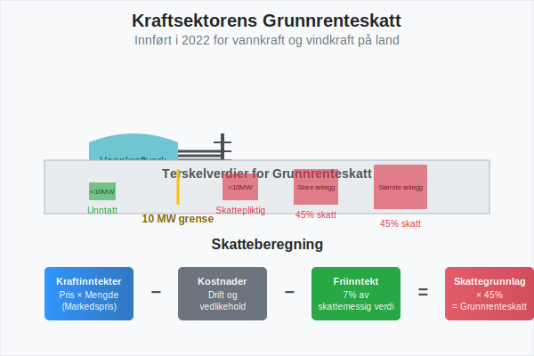
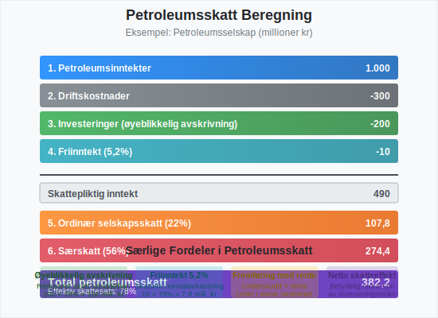

**Grunnrenteskatt** er en særskatt som pålegges virksomheter som utvinne eller utnytter naturressurser i Norge. Denne skatten er designet for å sikre at samfunnet får en rimelig andel av den ekstraordinære avkastningen (grunnrenten) som oppstår fra utnyttelsen av landets naturressurser. Grunnrenteskatt er et komplekst skatteområde som krever grundig forståelse av både skattelovgivning og [regnskapsføring](/blogs/regnskap/hva-er-bokforing "Hva er Bokføring? En Komplett Guide til Norsk Bokføringspraksis").

## Seksjon 1: Konseptet Grunnrente og Grunnrenteskatt

### 1.1 Hva er Grunnrente?

**Grunnrente** er den ekstraordinære avkastningen som oppstår når naturressurser utnyttes kommersielt. Dette er avkastning utover det som er nødvendig for å kompensere for normal risiko og kapitalavkastning. Grunnrenten oppstår fordi naturressurser er begrenset og ofte har ulike kvaliteter og tilgjengelighet.


Grunnrenten kan oppstå fra:

* **Lokasjonelle fordeler:** Ressurser som er lettere tilgjengelige eller har lavere utvinningskostnader
* **Kvalitetsforskjeller:** Ressurser av høyere kvalitet som gir bedre pris eller lavere behandlingskostnader  
* **Markedsforhold:** Høye priser på råvarer som gir ekstraordinær lønnsomhet
* **Teknologiske fordeler:** Effektive utvinnings- eller produksjonsmetoder

### 1.2 Formålet med Grunnrenteskatt

Grunnrenteskatt har flere viktige formål:

1. **Ressursfordeling:** Sikre at samfunnet får en rimelig andel av verdiskapingen fra fellesskapets naturressurser
2. **Effektivitet:** Opprettholde incentiver for effektiv ressursutnyttelse
3. **Stabilitet:** Skape forutsigbare inntekter for staten fra naturressurssektorer
4. **Rettferdighet:** Sikre at ekstraordinær avkastning fra naturressurser kommer samfunnet til gode

## Seksjon 2: Grunnrenteskatt i Kraftsektoren

### 2.1 Kraftsektorens Grunnrenteskatt - Oversikt

Grunnrenteskatt for kraftproduksjon ble innført i Norge i 2022 og pålegges vannkraftprodusenter. Skatten er utformet for å fange opp grunnrenten i kraftsektoren, som har oppstått som følge av høye kraftpriser og gunstige naturforhold.



### 2.2 Hvem Omfattes av Kraftsektorens Grunnrenteskatt?

Grunnrenteskatt for kraftproduksjon gjelder for:

* **Vannkraftanlegg** med installert effekt over 10 MW
* **Vindkraftanlegg** på land med installert effekt over 10 MW  
* **Kraftprodusenter** som eier eller driver slike anlegg

Følgende er **unntatt** fra grunnrenteskatt:

* Småkraftverk under 10 MW installert effekt
* Vindkraft til havs (omfattes av petroleumsskatteregimet)
* Kraftproduksjon til eget bruk under visse betingelser

### 2.3 Beregning av Kraftsektorens Grunnrenteskatt

Grunnrenteskatt for kraftproduksjon beregnes som følger:

**Grunnlag for grunnrenteskatt = Kraftinntekter - Fradragsberettigede kostnader - Friinntekt**

| Komponent | Beskrivelse | Satser/Regler |
|-----------|-------------|---------------|
| **Skattesats** | Grunnrenteskatt | 45% |
| **Friinntekt** | Avkastning på investert kapital | 7% av skattemessig verdi |
| **Kraftinntekter** | Salg av kraft og relaterte tjenester | Markedspris × produsert mengde |
| **Fradrag** | Drifts- og vedlikeholdskostnader | Faktiske kostnader |


### 2.4 Friinntekt i Kraftsektoren

**Friinntekten** er et sentralt element som sikrer at normal avkastning på investert kapital ikke beskattes. Friinntekten beregnes som:

* **7% av skattemessig verdi** av kraftanlegget
* Justeres årlig basert på [avskrivninger](/blogs/regnskap/hva-er-avskrivning "Hva er Avskrivning? Komplett Guide til Avskrivningsmetoder") og investeringer
* Kan fremføres dersom den ikke kan utnyttes fullt ut i inntektsåret

## Seksjon 3: Petroleumsskatt (Særskatt)

### 3.1 Petroleumssektorens Særskatt - Oversikt

Petroleumssektoren i Norge er underlagt et særskilt skatteregime som inkluderer både ordinær selskapsskatt (22%) og **særskatt** (56%), som til sammen utgjør en marginalskattesats på 78%. Særskatten fungerer som en form for grunnrenteskatt for petroleumsvirksomhet.


### 3.2 Hvem Omfattes av Petroleumsskatt?

Petroleumsskatt gjelder for:

* **Utvinning av petroleum** på norsk kontinentalsokkel
* **Rørledningstransport** av petroleum
* **Landanlegg** som er en integrert del av petroleumsvirksomheten
* **Kraftproduksjon** til havs for petroleumsformål

### 3.3 Beregning av Petroleumsskatt

Petroleumsskattesystemet har flere særtrekk:

| Element | Ordinær Skatt | Særskatt | Total |
|---------|---------------|----------|-------|
| **Skattesats** | 22% | 56% | 78% |
| **Avskrivninger** | Lineær over levetid | Øyeblikkelig | - |
| **Friinntekt** | Nei | Ja (5,2%) | - |
| **Fremføring av underskudd** | Ubegrenset | Med rente | - |



### 3.4 Særtrekk ved Petroleumsskatt

#### 3.4.1 Øyeblikkelig Avskrivning

I petroleumssektoren kan **alle investeringer** avskrives øyeblikkelig for særskatteformål. Dette gir betydelige kontantstrømfordeler og reduserer investeringsrisikoen.

#### 3.4.2 Friinntekt for Særskatt

Petroleumsselskaper får en **friinntekt på 5,2%** av investeringer som ikke er avskrevet for særskatteformål. Denne friinntekten kan fremføres med rente dersom den ikke kan utnyttes.

#### 3.4.3 Fremføring med Rente

Underskudd i petroleumsvirksomhet kan fremføres med **rente** (statsobligasjonsrenten + 1 prosentpoeng), noe som er unikt i norsk skatterett.

## Seksjon 4: Regnskapsføring av Grunnrenteskatt

### 4.1 Regnskapsmessig Behandling

Grunnrenteskatt behandles regnskapsmessig som en **skattekostnad** og følger de samme prinsippene som ordinær selskapsskatt for [aksjeselskaper](/blogs/regnskap/hva-er-et-aksjeselskap "Hva er et Aksjeselskap (AS)? Komplett Guide til Selskapsformen"). Dette innebærer:

* **Periodisering:** Skatten kostnadsføres i det året den påløper
* **Utsatt skatt:** Forskjeller mellom regnskapsmessige og skattemessige verdier gir opphav til utsatt skatt
* **Usikkerhet:** Usikre skatteposisjoner må vurderes og eventuelt avsettes for

### 4.2 Praktisk Regnskapsføring

Typiske regnskapsposter for grunnrenteskatt:

```
Debet: Skattekostnad - Grunnrenteskatt
Kredit: Betalbar grunnrenteskatt

Debet: Utsatt skattefordel
Kredit: Utsatt skattekostnad - Grunnrenteskatt
```

### 4.3 Rapportering og Noteopplysninger

Selskaper som betaler grunnrenteskatt må gi omfattende noteopplysninger om:

* **Skatteberegning:** Hvordan grunnrenteskatt er beregnet
* **Vesentlige estimater:** Usikkerhet knyttet til skatteberegninger  
* **Endringer:** Endringer i skattelovgivning og deres effekter
* **Fremtidige forpliktelser:** Forventede skattebetalinger

## Seksjon 5: Rapportering og Compliance

### 5.1 Skattemeldinger og Frister

Selskaper som omfattes av grunnrenteskatt har særskilte rapporteringsforpliktelser:

| Skattetype | Skattemelding | Frist | Særlige Krav |
|------------|---------------|-------|--------------|
| **Kraftsektorens grunnrenteskatt** | RF-1088 | 31. mai | Produksjonsdata, kraftpriser |
| **Petroleumsskatt** | RF-1175 | 31. mai | Detaljerte kostnadsfordelinger |
| **Forskuddsskatt** | Månedlig/kvartalsvis | 15. i måneden | Estimerte betalinger |


### 5.2 Dokumentasjonskrav

Grunnrenteskatt krever omfattende dokumentasjon:

* **Produksjonsdata:** Nøyaktige målinger av produksjon og salg
* **Kostnadsfordeling:** Detaljert fordeling av kostnader mellom skattepliktige og ikke-skattepliktige aktiviteter
* **Investeringsregister:** Komplett oversikt over investeringer og avskrivninger
* **Prisdata:** Dokumentasjon av salgspriser og markedsreferanser

### 5.3 Internkontroll og Compliance

Effektiv internkontroll for grunnrenteskatt inkluderer:

1. **Systemer og prosesser:** Robuste systemer for datainnsamling og beregning
2. **Kompetanse:** Tilstrekkelig skattefaglig kompetanse internt eller eksternt
3. **Kvalitetssikring:** Regelmessig gjennomgang og validering av skatteberegninger
4. **Oppdatering:** Kontinuerlig oppfølging av regelverksendringer

## Seksjon 6: Praktiske Eksempler og Beregninger

### 6.1 Eksempel: Kraftsektorens Grunnrenteskatt

**Eksempel:** Et vannkraftverk med følgende data for 2024:

* Kraftproduksjon: 100 GWh
* Gjennomsnittlig kraftpris: 80 øre/kWh  
* Driftskostnader: 15 millioner kroner
* Skattemessig verdi av anlegg: 200 millioner kroner

**Beregning:**
```
Kraftinntekter: 100.000 MWh × 0,80 kr/kWh = 80.000.000 kr
Driftskostnader: 15.000.000 kr
Friinntekt (7%): 200.000.000 kr × 7% = 14.000.000 kr

Grunnlag for grunnrenteskatt:
80.000.000 - 15.000.000 - 14.000.000 = 51.000.000 kr

Grunnrenteskatt (45%):
51.000.000 × 45% = 22.950.000 kr
```

### 6.2 Eksempel: Petroleumsskatt

**Eksempel:** Et petroleumsselskap med følgende data:

* Petroleumsinntekter: 1.000 millioner kroner
* Driftskostnader: 300 millioner kroner  
* Investeringer (øyeblikkelig avskrivning): 200 millioner kroner
* Friinntekt: 10 millioner kroner

**Beregning:**
```
Skattepliktig inntekt:
1.000 - 300 - 200 - 10 = 490 millioner kr

Ordinær selskapsskatt (22%):
490 × 22% = 107,8 millioner kr

Særskatt (56%):
490 × 56% = 274,4 millioner kr

Total petroleumsskatt:
107,8 + 274,4 = 382,2 millioner kr

Effektiv skattesats: 382,2/490 = 78%
```

## Seksjon 7: Utfordringer og Kompleksitet

### 7.1 Regnskapsmessige Utfordringer

Grunnrenteskatt skaper flere regnskapsmessige utfordringer:

* **Estimering:** Usikkerhet knyttet til fremtidige kraftpriser og produksjon
* **Periodisering:** Korrekt periodisering av skattekostnader og -fordeler
* **Utsatt skatt:** Komplekse beregninger av utsatt skatt ved forskjeller mellom regnskaps- og skatteregler
* **Valutaeffekter:** For petroleumsselskaper med inntekter i utenlandsk valuta

### 7.2 Compliance-utfordringer

* **Regelverksendringer:** Hyppige endringer i skattelovgivning
* **Kompleksitet:** Høy grad av teknisk kompleksitet i beregninger
* **Dokumentasjon:** Omfattende dokumentasjonskrav
* **Tidsfrister:** Stramme frister for rapportering og betaling

### 7.3 Strategiske Betraktninger

Selskaper må vurdere:

* **Investeringsbeslutninger:** Hvordan grunnrenteskatt påvirker lønnsomheten av nye prosjekter
* **Finansiering:** Optimal kapitalstruktur under grunnrenteskatteregimet  
* **Risikostyring:** HÃ¥ndtering av skatterisiko og usikkerhet
* **Organisering:** Optimal organisering av virksomheten for skatteformål

## Seksjon 8: Fremtidige Utviklingstrekk

### 8.1 Politiske Signaler

Grunnrenteskatt er et politisk sensitivt område med pågående diskusjoner om:

* **Utvidelse:** Mulig utvidelse til andre sektorer (f.eks. havvind, mineralutvinning)
* **Satsjusteringer:** Endringer i skattesatser basert på markedsforhold
* **Tekniske justeringer:** Forbedringer av regelverket basert på erfaringer

### 8.2 Teknologisk Utvikling

Teknologisk utvikling påvirker grunnrenteskatt gjennom:

* **Digitalisering:** Automatisering av rapportering og beregninger
* **Nye teknologier:** Hvordan nye energiteknologier skal behandles skattemessig
* **Dataanalyse:** Bedre muligheter for overvåking og kontroll

### 8.3 Internasjonale Trender

Norge følger internasjonale trender innen ressursbeskatning:

* **OECD-retningslinjer:** Internasjonale standarder for ressursbeskatning
* **EU-regulering:** PÃ¥virkning fra EU-direktiver og konkurranseregler
* **Bærekraft:** Økende fokus på bærekraftig ressursutnyttelse

## Konklusjon

**Grunnrenteskatt** representerer et komplekst, men viktig element i det norske skattesystemet. For virksomheter som omfattes av denne skatten, er det avgjørende å ha:

* **Grundig forståelse** av regelverket og beregningsmetoder
* **Robuste systemer** for datainnsamling og rapportering  
* **Kompetent rådgivning** fra skattefaglige eksperter
* **Proaktiv tilnærming** til compliance og risikostyring

Grunnrenteskatt vil fortsette å være et sentralt element i norsk næringspolitikk, og virksomheter må være forberedt på fortsatte endringer og tilpasninger i regelverket. En systematisk tilnærming til [regnskapsføring](/blogs/regnskap/hva-er-regnskap "Hva er regnskap? En Dybdeanalyse for Norge") og rapportering av grunnrenteskatt er essensielt for å sikre compliance og optimal skatteposisjon.

For virksomheter som vurderer investeringer i sektorer som omfattes av grunnrenteskatt, er det viktig å inkludere skatteeffektene i [budsjettering](/blogs/regnskap/hva-er-budsjettering "Hva er Budsjettering? Komplett Guide til Budsjettplanlegging") og lønnsomhetsanalyser fra tidlig fase.
