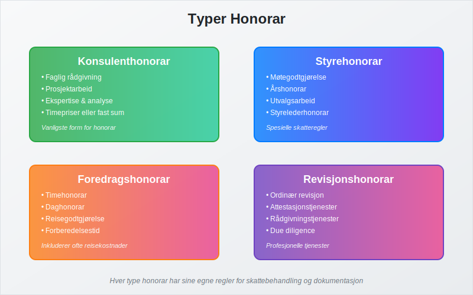
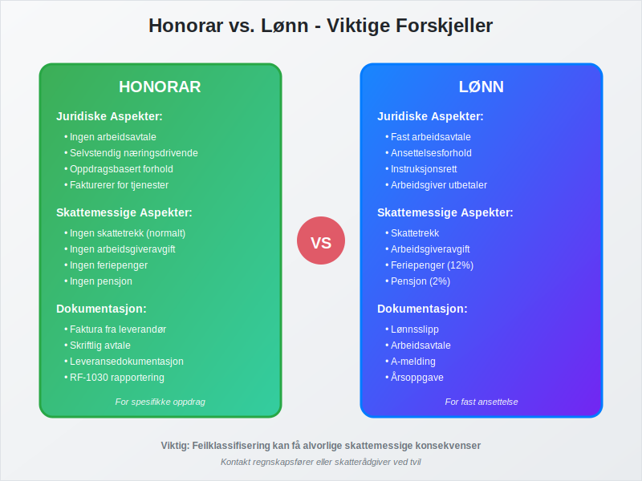
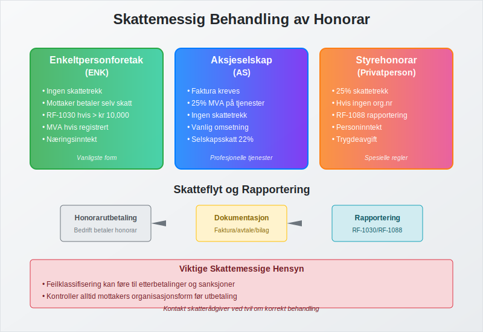
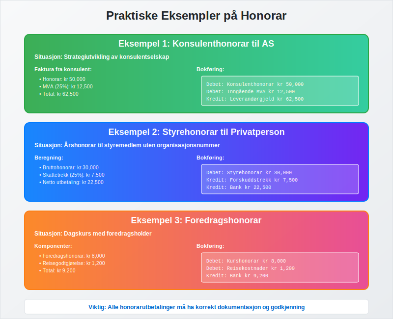

---
title: "Hva er honorar (regnskap)?"
meta_title: "Hva er honorar (regnskap)?"
meta_description: '**Honorar** i regnskapssammenheng refererer til [vederlag](/blogs/regnskap/hva-er-vederlag "Hva er Vederlag i Regnskap? Komplett Guide til Vederlag og Kompensas...'
slug: hva-er-honorar
type: blog
layout: pages/single
---

**Honorar** i regnskapssammenheng refererer til [vederlag](/blogs/regnskap/hva-er-vederlag "Hva er Vederlag i Regnskap? Komplett Guide til Vederlag og Kompensasjon") som utbetales til personer for utførte tjenester, uten at det foreligger et tradisjonelt arbeidsforhold. Dette er et viktig konsept i [regnskapsføring](/blogs/regnskap/hva-er-regnskap "Hva er Regnskap? Komplett Guide til Regnskapsføring i Norge") som krever spesiell oppmerksomhet når det gjelder [bokføring](/blogs/regnskap/hva-er-bokforing "Hva er Bokføring? Komplett Guide til Regnskapsføring og Bokføringsprinsipper") og skattemessig behandling.

Honorar skiller seg fra vanlig lønn ved at det utbetales for spesifikke oppdrag eller tjenester, ofte til eksterne konsulenter, styremedlemmer, eller andre fagpersoner. Korrekt håndtering av honorar er essensielt for å opprettholde god internkontroll og for å sikre at bedriften overholder gjeldende [bokføringsregler](/blogs/regnskap/hva-er-bokforingsregler "Hva er Bokføringsregler? Komplett Guide til Norske Regnskapsbestemmelser").

## Seksjon 1: Typer Honorar



Honorar kan kategoriseres i flere hovedtyper, hver med sine spesifikke regler for behandling og dokumentasjon:

### 1.1 Konsulenthonorar

**Konsulenthonorar** er den vanligste formen for honorar og utbetales til eksterne rådgivere og konsulenter for:

* **Faglig rådgivning:** Juridisk, økonomisk eller teknisk bistand
* **Prosjektarbeid:** Spesifikke oppdrag med definert leveranse
* **Ekspertise:** Spesialisert kunnskap innenfor bestemte fagområder
* **Analyse og utredning:** Markedsanalyser, strategiutvikling

Konsulenthonorar faktureres normalt basert på timepriser eller fast prosjektsum, og konsulenten er ansvarlig for egen [fakturering](/blogs/regnskap/hva-er-en-faktura "Hva er en Faktura? En Guide til Norske Fakturakrav").

### 1.2 [Styrehonorar](/blogs/regnskap/styrehonorar "Styrehonorar i aksjeselskap: Fastsetting, Skatt og Bokføring")

**Styrehonorar** utbetales til styremedlemmer for deres arbeid i bedriftens styre:

* **Møtegodtgjørelse:** Fast beløp per styremøte
* **Årshonorar:** Fast årlig godtgjørelse for styreverv
* **Utvalgsarbeid:** Tillegg for arbeid i underutvalg
* **Styrelederhonorar:** Ekstra godtgjørelse for styreleder

| Bedriftsstørrelse | Typisk Årshonorar |
|---|---|
| Små AS | kr 20,000 - 50,000 |
| Mellomstore bedrifter | kr 50,000 - 150,000 |
| Store selskaper | kr 150,000 - 500,000+ |

Les mer i vår detaljerte artikkel om styrehonorar: [Styrehonorar](/blogs/regnskap/styrehonorar "Styrehonorar i aksjeselskap: Fastsetting, Skatt og Bokføring").

### 1.3 Foredragshonorar

For foredragsholdere og kursledere utbetales honorar basert på:

* **Timehonorar:** Fast sats per undervisningstime
* **Daghonorar:** Fast beløp for heldagskurs
* **Reisegodtgjørelse:** Dekning av [reisekostnader](/blogs/regnskap/hva-er-godtgjorelse "Hva er Godtgjørelse i Regnskap? Komplett Guide til Refusjon og Utlegg")
* **Forberedelsestid:** Honorar for kursutvikling

### 1.4 Revisjonshonorar

**Revisjonshonorar** utbetales til revisorer for:

* **Ordinær revisjon:** Årlig gjennomgang av regnskap
* **Attestasjonstjenester:** Spesielle erklæringer og bekreftelser
* **Rådgivningstjenester:** Regnskapsmessig og skattemessig rådgivning
* **Due diligence:** Gjennomgang ved oppkjøp eller salg

### 1.5 Tantieme

**Tantieme** er en variabel bonus til styre eller ledelse basert på selskapets overskudd. Les mer i vår detaljerte artikkel: [Tantieme](/blogs/regnskap/tantieme "Tantieme i aksjeselskap: Bonusmodell, Skattemessig Behandling og Bokføring").

## Seksjon 2: Honorar vs. Lønn - Viktige Forskjeller



Det er viktig å forstå forskjellene mellom honorar og lønn for korrekt behandling. For spesifikke arbeidstyper i private hjem finnes også [lett salær](/blogs/regnskap/hva-er-lett-salaer "Hva er Lett Salær i Regnskap?") som et alternativ med skattemessige fordeler.

### 2.1 Juridiske Forskjeller

**Honorar:**
* Ingen arbeidsavtale eller ansettelsesforhold
* Oppdragstaker er selvstendig næringsdrivende
* Ingen rett til feriepenger eller sykepenger
* Oppdragstaker fakturerer for tjenestene

**Lønn:**
* Fast ansettelsesforhold med arbeidsavtale
* Arbeidsgiver har instruksjonsrett
* Rett til [feriepenger](/blogs/regnskap/hva-er-feriepenger "Hva er Feriepenger? Komplett Guide til Beregning og Bokføring") og sosiale ytelser
* Arbeidsgiver trekker skatt og avgifter

### 2.2 Skattemessige Forskjeller

| Aspekt | Honorar | Lønn |
|---|---|---|
| Skattetrekk | Nei (normalt) | Ja |
| Arbeidsgiveravgift | Nei | Ja |
| Feriepenger | Nei | Ja |
| Pensjon | Nei | Ja |

## Seksjon 3: Skattemessig Behandling av Honorar



Den skattemessige behandlingen av honorar avhenger av flere faktorer:

### 3.1 Honorar til Enkeltpersonforetak

For [enkeltpersonforetak](/blogs/regnskap/hva-er-enkeltpersonforetak "Hva er Enkeltpersonforetak? Komplett Guide til ENK og Regnskapsplikt") gjelder:

* **Ingen skattetrekk:** Mottaker er selv ansvarlig for skatt
* **Rapportering:** Honorar rapporteres på RF-1030 hvis over kr 10,000 per år
* **Merverdiavgift:** Kan være aktuelt hvis mottaker er MVA-registrert

### 3.2 Honorar til Aksjeselskap

NÃ¥r honorar utbetales til [aksjeselskap](/blogs/regnskap/hva-er-et-aksjeselskap "Hva er et Aksjeselskap? Komplett Guide til AS og Selskapsrett"):

* **Faktura kreves:** AS må sende faktura for honoraret
* **MVA-behandling:** Normalt 25% MVA på tjenester
* **Skattetrekk:** Ingen skattetrekk fra oppdragsgiver
* **Rapportering:** Rapporteres som vanlig omsetning

### 3.3 Særlige Regler for Styrehonorar

Styrehonorar har spesielle regler:

* **Skattetrekk:** 25% skattetrekk hvis mottaker ikke har organisasjonsnummer
* **Rapportering:** Rapporteres på RF-1088 (Oppgave over utbetalt styrehonorar)
* **Grenseverdier:** Ulike regler avhengig av beløpsstørrelse

## Seksjon 4: Bokføringsprinsipper for Honorar

Korrekt bokføring av honorar krever forståelse av underliggende regnskapsprinsipper:

### 4.1 Kontoplan og Kontering

Honorar bokføres normalt på følgende kontotyper:

* **Konsulenthonorar (konto 6500-6599):** For eksterne konsulenter
* **Revisjonshonorar (konto 6560):** Spesifikt for revisjonstjenester
* **Styrehonorar (konto 6570):** For styremedlemmer
* **Andre honorar (konto 6580-6599):** For øvrige honorarutbetalinger

### 4.2 Bilagsbehandling og Dokumentasjon

Alle honorarutbetalinger må dokumenteres gjennom [bilagsføring](/blogs/regnskap/hva-er-bilagsforing "Hva er Bilagsføring? Komplett Guide til Regnskapsbilag og Dokumentasjon"):

* **Faktura:** Fra honorarmottaker (hvis AS eller ENK)
* **Avtale:** Skriftlig avtale om honorarets størrelse og betingelser
* **Leveransedokumentasjon:** Bevis på utført arbeid
* **Godkjenning:** Fra autorisert person i organisasjonen

### 4.3 Periodisering og Timing

Honorar skal bokføres i den perioden tjenesten er utført, ikke nødvendigvis når betalingen skjer. Dette følger [periodiseringsprinsippet](/blogs/regnskap/hva-er-regnskap "Hva er Regnskap? Komplett Guide til Regnskapsføring i Norge") i regnskapet.

## Seksjon 5: Praktiske Eksempler



### Eksempel 1: Konsulenthonorar til AS

En bedrift engasjerer et konsulentselskap for strategiutvikling:

**Faktura fra konsulent:**
* Honorar: kr 50,000
* MVA (25%): kr 12,500
* Total: kr 62,500

**Bokføring:**
```
Debet: Konsulenthonorar kr 50,000
Debet: Inngående MVA kr 12,500
Kredit: Leverandørgjeld kr 62,500
```

### Eksempel 2: Styrehonorar til privatperson

Utbetaling av styrehonorar på kr 30,000 til privatperson:

**Beregning:**
* Bruttohonorar: kr 30,000
* Skattetrekk (25%): kr 7,500
* Netto utbetaling: kr 22,500

**Bokføring:**
```
Debet: Styrehonorar kr 30,000
Kredit: Forskuddstrekk kr 7,500
Kredit: Bank kr 22,500
```

### Eksempel 3: Foredragshonorar

Honorar til foredragsholder for dagskurs:

**Komponenter:**
* Foredragshonorar: kr 8,000
* Reisegodtgjørelse: kr 1,200
* Total: kr 9,200

**Bokføring:**
```
Debet: Kurshonorar kr 8,000
Debet: Reisekostnader kr 1,200
Kredit: Bank kr 9,200
```

## Seksjon 6: Internkontroll og Rutiner

Effektiv håndtering av honorar krever etablerte rutiner og kontroller:

### 6.1 Godkjenningsrutiner

Alle honorarutbetalinger må gjennom [attestering](/blogs/regnskap/hva-er-attestering "Hva er Attestering? En Komplett Guide til Bilagsbehandling og Godkjenning"):

* **Saklig kontroll:** Er honoraret rimelig i forhold til utført arbeid?
* **Formell kontroll:** Er dokumentasjonen komplett?
* **Budsjettmessig kontroll:** Er honoraret innenfor budsjett?
* **Juridisk kontroll:** Er alle formelle krav oppfylt?

### 6.2 Avtaler og Kontrakter

Bedrifter bør etablere skriftlige avtaler som dekker:

* **Arbeidsomfang:** Detaljert beskrivelse av oppdraget
* **Honorarets størrelse:** Fast beløp eller timepris
* **Betalingsbetingelser:** NÃ¥r og hvordan honorar utbetales
* **Leveransekrav:** Hva som skal leveres og når

### 6.3 Rapportering og Oppfølging

**Månedlig oppfølging:**
* Oversikt over utbetalte honorar
* Sammenligning med budsjett
* Kontroll av dokumentasjon

**Ã…rlig rapportering:**
* RF-1030 for honorar over kr 10,000
* RF-1088 for styrehonorar
* Ã…rsoppgave til Skatteetaten

## Seksjon 7: Juridiske Aspekter og Compliance

### 7.1 Oppdragsloven

Honoraroppdrag reguleres av [oppdragsloven](https://lovdata.no/dokument/NL/lov/1989-06-16-54):

* **§ 1:** Definisjon av oppdragsforhold
* **§ 2:** Oppdragstakerens plikter
* **§ 15:** Rett til vederlag (honorar)

### 7.2 Skatteloven og Forskrifter

Skattemessig behandling reguleres av:

* **Skatteloven § 5-1:** Definisjon av skattepliktig inntekt
* **Skatteloven § 5-20:** Honorar og andre ytelser
* **FSFIN:** Detaljerte regler for honorarbehandling

### 7.3 Bokføringsloven

[Bokføringsloven](/blogs/regnskap/hva-er-bokforingsloven "Hva er Bokføringsloven? Komplett Guide til Norsk Regnskapslovgivning") stiller krav til:

* **Dokumentasjon:** Alle honorartransaksjoner må dokumenteres
* **Oppbevaring:** Bilag må oppbevares i minimum 5 år
* **Sporbarhet:** Klar sammenheng mellom avtale, levering og betaling

## Seksjon 8: Digitale Løsninger og Automatisering

### 8.1 Moderne Honorarhåndtering

Digitale løsninger kan effektivisere honorarprosessen:

* **Avtalestyring:** Digitale kontrakter og godkjenningsflyt
* **Timeregistrering:** Automatisk registrering av arbeidstid
* **Fakturaautomatisering:** Automatisk generering av honorarfakturaer
* **Integrasjon:** Direkte kobling til regnskapssystem

### 8.2 Compliance og Kontroll

Digitale systemer kan forbedre:

* **Automatisk rapportering:** Til Skatteetaten og andre myndigheter
* **Budsjettovervåking:** Sanntidsoppfølging av honorarkostnader
* **Dokumentlagring:** Sikker oppbevaring av avtaler og bilag
* **Revisjonslogg:** Komplett sporbarhet av alle transaksjoner

## Seksjon 9: Vanlige Feil og Fallgruver

### 9.1 Feilklassifisering

**Vanlige feil:**
* Behandle ansatte som honorarmottakere
* Glemme skattetrekk på styrehonorar
* Manglende MVA-behandling
* Feil kontering i regnskapet

### 9.2 Dokumentasjonsfeil

**Typiske mangler:**
* Manglende skriftlige avtaler
* Utilstrekkelig leveransedokumentasjon
* Manglende godkjenning
* Feil i rapportering til myndighetene

### 9.3 Forebyggende Tiltak

* **Opplæring:** Sikre at ansvarlige forstår regelverket
* **Rutiner:** Etablere klare prosedyrer for honorarhåndtering
* **Kontroller:** Regelmessig gjennomgang av honorarutbetalinger
* **RÃ¥dgivning:** Bruke ekstern ekspertise ved usikkerhet

## Konklusjon

Honorar er en viktig del av moderne forretningsdrift som krever nøye håndtering for å sikre korrekt regnskapsmessig og skattemessig behandling. Ved å forstå forskjellene mellom honorar og lønn, etablere gode rutiner for dokumentasjon og godkjenning, og holde seg oppdatert på gjeldende regelverk, kan bedrifter håndtere honorarutbetalinger på en effektiv og regelkonform måte.

Korrekt håndtering av honorar bidrar ikke bare til å oppfylle juridiske krav, men også til å opprettholde god [internkontroll](/blogs/regnskap/hva-er-attestering "Hva er Attestering? En Komplett Guide til Bilagsbehandling og Godkjenning") og økonomisk oversikt i bedriften. Med de rette systemene og prosedyrene på plass, kan honorar være et verdifullt verktøy for å få tilgang til spesialisert kompetanse og ekspertise.
