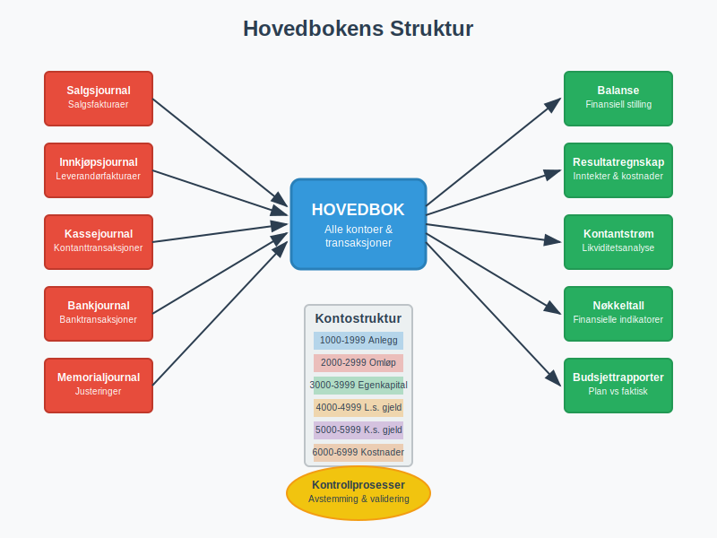
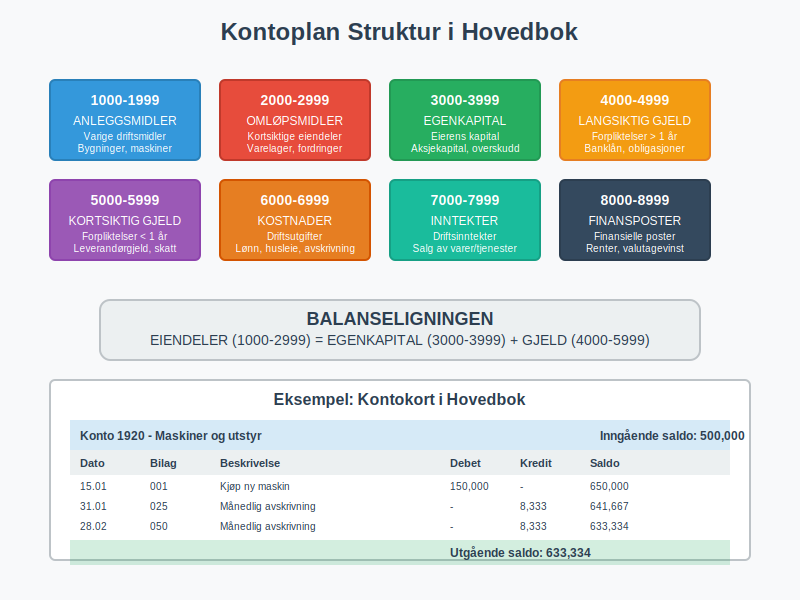
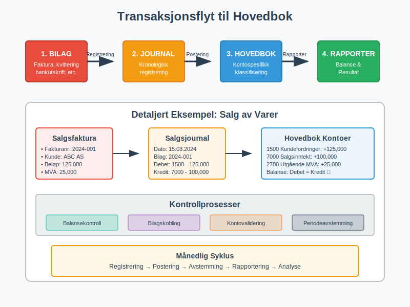
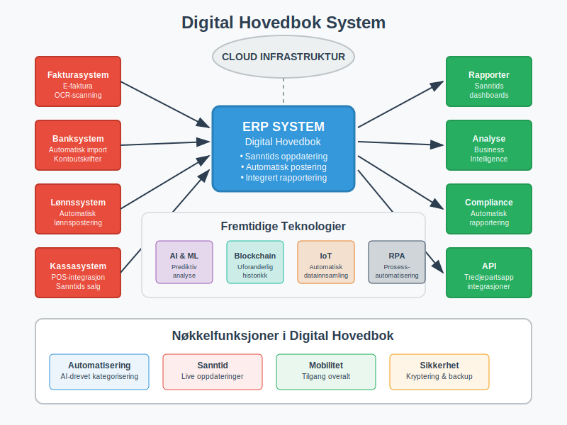
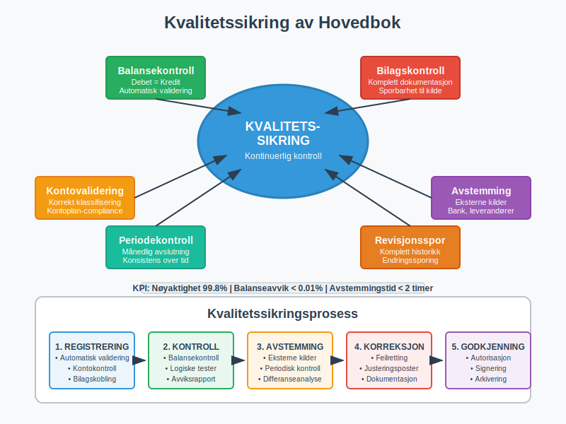
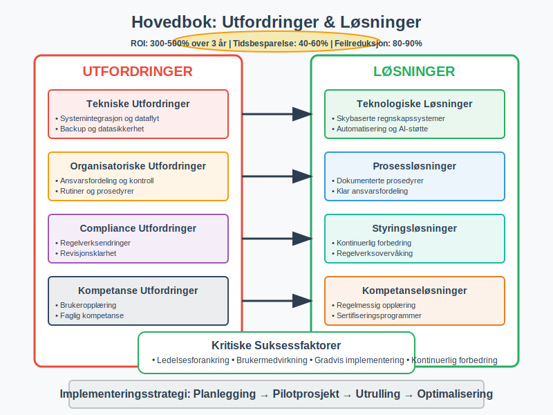

---
title: "Hva er Hovedbok? En Komplett Guide til Hovedboken i Norsk Regnskap"
seoTitle: "Hovedbok | Hva det er og hvordan den brukes"
description: 'Hva er hovedbok, hvordan er den strukturert etter kontoplan og kontoklasser, og hvordan brukes den i norsk regnskapsføring til avstemming og rapportering.'
summary: 'Hva hovedboken er, sammenhengen med reskontro og hvordan den brukes til avstemming og rapportering.'
---

**Hovedboken** er det sentrale registeret i enhver virksomhets regnskapsføring og utgjør ryggraden i det moderne [bokføringssystemet](/blogs/regnskap/hva-er-bokforing "Hva er Bokføring? En Komplett Guide til Norsk Bokføringspraksis"). Som en systematisk samling av alle kontoer og transaksjoner, fungerer hovedboken som det primære kilderegisteret for [regnskapet](/blogs/regnskap/hva-er-regnskap "Hva er regnskap? En dybdeanalyse for Norge") og danner grunnlaget for all finansiell rapportering i norske virksomheter.

## Hva er Hovedbok?

Hovedboken er en systematisk oversikt over alle kontoer i virksomheten, hvor hver konto viser alle transaksjoner som har påvirket den spesifikke kontoen i løpet av regnskapsperioden. Den fungerer som det sentrale arkivet hvor alle [bilag](/blogs/regnskap/hva-er-bilag "Hva er Bilag i Regnskap? Komplett Guide til Regnskapsbilag") og transaksjoner fra [bokføringen](/blogs/regnskap/hva-er-bokforing "Hva er Bokføring? En Komplett Guide til Norsk Bokføringspraksis") samles og organiseres etter kontotype.

### Hovedbokens Hovedfunksjoner

* **Sentralisert registrering:** Samler alle transaksjoner fra ulike journaler og registre
* **Kontospesifikk oversikt:** Viser alle bevegelser på hver enkelt konto
* **Balansekontroll:** Sikrer at [debet](/blogs/regnskap/hva-er-debet "Hva er Debet i Regnskap? Komplett Guide til Debetposter og Bokføring") og kredit balanserer
* **Rapporteringsgrunnlag:** Danner basis for [balanse](/blogs/regnskap/hva-er-balanse "Hva er Balanse? Komplett Guide til Balanseregnskap og Finansiell Stilling") og resultatregnskap
* **Sporbarhet:** Sikrer full dokumentasjon og revisjonsspor
* **Periodeavslutning:** Grunnlag for [avstemming](/blogs/regnskap/hva-er-avstemming "Hva er Avstemming i Regnskap? Komplett Guide til Regnskapsavstemming") og årsavslutning

## Hovedbokens Struktur og Organisering

### Kontoplan og Kontosystem

Hovedboken organiseres etter den norske standard [**kontoplan**](/blogs/regnskap/hva-er-kontoplan "Hva er en Kontoplan? Komplett Guide til Kontoplaner i Norsk Regnskap"), som følger et systematisk nummereringssystem basert på **[kontoklasser](/blogs/regnskap/hva-er-kontoklasser "Hva er Kontoklasser? Komplett Guide til Norsk Kontoklassesystem")**. Dette hierarkiske klassifiseringssystemet gir struktur til alle kontoer i regnskapet:

| Kontoklass | Kategori | Beskrivelse | Eksempler |
|---|---|---|---|
| **1000-1999** | [Anleggsmidler](/blogs/regnskap/hva-er-anleggsmidler "Hva er Anleggsmidler? Komplett Guide til Varige Driftsmidler") | Varige driftsmidler og investeringer | Bygninger, maskiner, [goodwill](/blogs/regnskap/hva-er-goodwill "Hva er Goodwill? Komplett Guide til Goodwill i Regnskap") |
| **2000-2999** | Omløpsmidler | Kortsiktige eiendeler | Varelager, kundefordringer, bankinnskudd |
| **3000-3999** | [Egenkapital](/blogs/regnskap/hva-er-egenkapital "Hva er Egenkapital? Komplett Guide til Egenkapital i Norske Selskaper") | Eierens kapital i virksomheten | [Aksjekapital](/blogs/regnskap/hva-er-aksjekapital "Hva er Aksjekapital? Komplett Guide til Aksjekapital i Norge"), opptjent egenkapital |
| **4000-4999** | Langsiktig [gjeld](/blogs/regnskap/hva-er-gjeld "Hva er Gjeld? Komplett Guide til Gjeld i Regnskap og Balanse") | Forpliktelser over 1 år | Banklån, obligasjoner, [pensjonsforpliktelser](/blogs/kontoplan/2100-pensjonsforpliktelser "Konto 2100 - Pensjonsforpliktelser: Komplett Guide til Pensjonsforpliktelser i Norsk Kontoplan") |
| **5000-5999** | Kortsiktig gjeld | Forpliktelser under 1 år | Leverandørgjeld, skyldige skatter, [feriepenger](/blogs/regnskap/hva-er-feriepenger "Hva er Feriepenger? Komplett Guide til Feriepenger i Norge") |
| **6000-6999** | [Driftskostnader](/blogs/regnskap/hva-er-driftskostnader "Hva er Driftskostnader? Komplett Guide til Driftskostnader i Regnskap") | Løpende utgifter | Lønn, husleie, [avskrivninger](/blogs/regnskap/hva-er-avskrivning "Hva er Avskrivning? Komplett Guide til Avskrivninger i Regnskap") |
| **7000-7999** | [Driftsinntekter](/blogs/regnskap/hva-er-driftsinntekter "Hva er Driftsinntekter? Komplett Guide til Driftsinntekter i Regnskap") | Ordinære inntekter | Salg av varer og tjenester |
| **8000-8999** | Finansposter | Finansielle inntekter og kostnader | Renteinntekter, rentekostnader, valutagevinst |

### Kontokort og Transaksjonshistorikk

Hver konto i hovedboken inneholder følgende informasjon:

**Kontohode:**
* Kontonummer og kontonavn
* Kontotype (balanse- eller resultatkonto)
* Inngående saldo
* Utgående saldo

**Transaksjonslinjer:**
* Dato for transaksjon
* [Bilagsnummer](/blogs/regnskap/hva-er-bilag "Hva er Bilag i Regnskap? Komplett Guide til Regnskapsbilag")
* Beskrivelse av transaksjon
* Debet- og kreditbeløp
* Løpende saldo

## Praktisk Bruk av Hovedboken

### 1. Daglig Registrering og Oppdatering

**Transaksjonsflyt til hovedbok:**

1. **Bilagsregistrering:** Alle [fakturaer](/blogs/regnskap/hva-er-en-faktura "Hva er en Faktura? En Guide til Norske Fakturakrav") og dokumenter registreres
2. **Journalføring:** Transaksjoner føres først i relevante journaler
3. **Hovedbokpostering:** Automatisk eller manuell overføring til hovedbok
4. **Balansekontroll:** Kontinuerlig kontroll av debet/kredit-balanse

### 2. Månedlig Avstemming og Kontroll

**Avstemmingsrutiner:**

* **[Bankavstemming](/blogs/regnskap/hva-er-bankavstemming "Hva er Bankavstemming? Komplett Guide til Bankavstemminger"):** Kontroll mot bankutskrifter
* **Kundefordringer:** Avstemming mot [debitor](/blogs/regnskap/hva-er-debitor "Hva er Debitor? Komplett Guide til Debitorhåndtering og Kundefordringer")register
* **Leverandørgjeld:** Kontroll mot [leverandørreskontro](/blogs/regnskap/hva-er-leverandorreskontro "Hva er Leverandørreskontro? Komplett Guide til Leverandørledger og Kreditoroppfølging")
* **Varelager:** Fysisk telling og verdijustering
* **[MVA-avstemming](/blogs/regnskap/hva-er-avgiftsplikt-mva "Hva er Avgiftsplikt MVA? Komplett Guide til Merverdiavgift i Norge"):** Kontroll av mva-poster

### 3. Rapportering og Analyse

Hovedboken danner grunnlag for:

**Finansielle rapporter:**
* [Balanse](/blogs/regnskap/hva-er-balanse "Hva er Balanse? Komplett Guide til Balanseregnskap og Finansiell Stilling") (finansiell stilling)
* Resultatregnskap (drift og resultat)
* Kontantstrømoppstilling
* Noter til regnskapet

**Styringsrapporter:**
* [Budsjettoppfølging](/blogs/regnskap/hva-er-budsjettering "Hva er Budsjettering? Komplett Guide til Budsjett og Økonomisk Planlegging")
* [Dekningsbidragsanalyse](/blogs/regnskap/hva-er-dekningsbidrag "Hva er Dekningsbidrag? Komplett Guide til Dekningsbidragsanalyse")
* Likviditetsanalyse
* [Avviksanalyse](/blogs/regnskap/hva-er-avvikshandtering "Hva er Avvikshandtering? Komplett Guide til Avviksanalyse i Regnskap")

## Digitale Hovedboksystemer

### Moderne ERP og Regnskapssystemer

Dagens [ERP-systemer](/blogs/regnskap/hva-er-erp-system "Hva er ERP System? Komplett Guide til Enterprise Resource Planning") har revolusjonert hovedbokføringen:

**Automatiserte funksjoner:**
* Automatisk postering fra undermoduler
* Sanntids oppdatering av saldoer
* Integrert [bilagshåndtering](/blogs/regnskap/hva-er-bilagsmottak "Hva er Bilagsmottak? Komplett Guide til Digital Bilagshåndtering")
* Automatisk [avstemming](/blogs/regnskap/hva-er-avstemming "Hva er Avstemming i Regnskap? Komplett Guide til Regnskapsavstemming")

**Rapporteringsmuligheter:**
* Sanntids rapporter og dashboards
* Flerdimensjonal analyse
* Automatisk konsolidering
* Integrert budsjett og prognose

### Integrasjon med Andre Systemer

**Systemintegrasjoner:**
* [Fakturasystemer](/blogs/regnskap/hva-er-elektronisk-fakturering "Hva er Elektronisk Fakturering? Komplett Guide til E-faktura i Norge")
* Lønnssystemer
* [Kassasystemer](/blogs/regnskap/hva-er-datakasse "Hva er Datakasse? Komplett Guide til Kassasystem, Krav og Regnskapsføring")
* Banksystemer
* Lagerstyringssystemer

## Juridiske Krav og Compliance

### Bokføringsloven og Hovedbok

[Bokføringsloven](/blogs/regnskap/hva-er-bokforingsloven "Hva er Bokføringsloven? Krav, Regler og Praktisk Veiledning") stiller spesifikke krav til hovedbokføring:

**Lovkrav:**
* **Fullstendighet:** Alle transaksjoner skal registreres
* **Nøyaktighet:** Korrekte beløp og datoer
* **Sporbarhet:** Klar kobling mellom bilag og hovedbok
* **Oppbevaring:** Minimum 5 års oppbevaringsplikt
* **Tilgjengelighet:** Rask tilgang for kontroll og revisjon

### Revisjonsaspekter

**Revisjonsaktiviteter knyttet til hovedbok:**
* Kontroll av [arbeidspapirer](/blogs/regnskap/hva-er-arbeidspapirer-revisjon "Hva er Arbeidspapirer i Revisjon? Komplett Guide til Revisjonsarbeid")
* Substansielle tester av kontosaldoer
* Analytiske gjennomganger
* Kontroll av [attestering](/blogs/regnskap/hva-er-attestering "Hva er Attestering? Komplett Guide til Attestering i Regnskap") og godkjenning

## Beste Praksis for Hovedbokføring

### 1. Organisering og Struktur

**Kontoplanvedlikehold:**
* Regelmessig gjennomgang av kontoplan
* Konsistent bruk av kontonumre
* Tydelige kontobeskrivelser
* Dokumentasjon av kontoanvendelse

**Periodiske rutiner:**
* Daglig registrering av transaksjoner
* Ukentlig kontroll av saldoer
* Månedlig avstemming av alle hovedkontoer
* Kvartalsvis gjennomgang av kontosystem

### 2. Kvalitetssikring

**Kontrollrutiner:**
* [Dobbel bokføring](/blogs/regnskap/hva-er-dobbel-bokforing "Hva er Dobbel Bokføring? Komplett Guide til Dobbelt Bokføringssystem") kontroll
* Balansekontroll (debet = kredit)
* Logiske kontroller og validering
* Månedlig avstemming mot eksterne kilder

**Dokumentasjon:**
* Klar kobling mellom bilag og poster
* Forklarende tekster på transaksjoner
* Dokumentasjon av spesielle poster
* Arkivering av støttedokumentasjon

### 3. Effektivisering og Automatisering

**Automatiseringsmuligheter:**
* Automatisk import fra banksystemer
* Gjentakende transaksjoner (templates)
* Automatisk [mva-beregning](/blogs/regnskap/hva-er-avgiftsplikt-mva "Hva er Avgiftsplikt MVA? Komplett Guide til Merverdiavgift i Norge")
* Integrert [bilagsgjenkjenning](/blogs/regnskap/hva-er-bilagsmottak "Hva er Bilagsmottak? Komplett Guide til Digital Bilagshåndtering")

## Hovedbok og Finansiell Analyse

### Nøkkeltall og Indikatorer

Hovedboken gir grunnlag for beregning av viktige finansielle nøkkeltall:

**Lønnsomhetsanalyse:**
* [Bruttofortjeneste](/blogs/regnskap/hva-er-bruttofortjeneste "Hva er Bruttofortjeneste? Komplett Guide til Bruttofortjeneste i Regnskap")
* [Driftsresultat](/blogs/regnskap/hva-er-driftsresultat "Hva er Driftsresultat? Komplett Guide til Driftsresultat i Regnskap")
* [Avkastning](/blogs/regnskap/hva-er-avkastning "Hva er Avkastning? Komplett Guide til Avkastning og Rentabilitet") på egenkapital

**Soliditetsanalyse:**
* [Egenkapitalandel](/blogs/regnskap/hva-er-egenkapital "Hva er Egenkapital? Komplett Guide til Egenkapital i Norske Selskaper")
* Gjeldsgrad
* [Arbeidskapital](/blogs/regnskap/hva-er-arbeidskapital "Hva er Arbeidskapital? En Komplett Guide til Working Capital")

**Likviditetsanalyse:**
* Likviditetsgrad 1 og 2
* [Betalingsevne](/blogs/regnskap/hva-er-betalingsevne "Hva er Betalingsevne? Komplett Guide til Likviditet og Betalingsevne")
* Kontantstrøm fra drift

### Trendanalyse og Prognoser

**Historisk analyse:**
* Sammenligning mellom perioder
* Sesongvariasjoner og trender
* Vekstanalyse og utvikling

**Fremtidsrettet analyse:**
* [Budsjettoppfølging](/blogs/regnskap/hva-er-budsjettering "Hva er Budsjettering? Komplett Guide til Budsjett og Økonomisk Planlegging")
* Prognoser basert på historiske data
* Scenarioanalyser

## Utfordringer og Løsninger

### Vanlige Utfordringer

**Tekniske utfordringer:**
* Systemintegrasjon og dataflyt
* Backup og datasikkerhet
* Brukeropplæring og kompetanse
* Oppgradering av systemer

**Organisatoriske utfordringer:**
* Ansvarsfordeling og kontroll
* Rutiner og prosedyrer
* Kvalitetssikring
* Compliance og regelverksendringer

### Løsningsstrategier

**Teknologiske løsninger:**
* Skybaserte regnskapssystemer
* Automatisering og AI-støtte
* Integrerte business intelligence-verktøy
* Mobile løsninger for tilgang

**Organisatoriske tiltak:**
* Klar ansvarsfordeling
* Dokumenterte prosedyrer
* Regelmessig opplæring
* Kontinuerlig forbedring

## Fremtiden for Hovedbokføring

### Teknologiske Trender

**Kunstig intelligens og maskinlæring:**
* Automatisk kategorisering av transaksjoner
* Anomalideteksjon og feilidentifikasjon
* Prediktiv analyse og prognoser
* Intelligent dokumentgjenkjenning

**Blockchain og distribuerte systemer:**
* Uforanderlig transaksjonshistorikk
* Automatiske smart contracts
* Desentralisert verifikasjon
* Økt transparens og tillit

### Regulatoriske Endringer

**Digitalisering av rapportering:**
* Standardiserte digitale formater
* Sanntids rapportering til myndigheter
* Automatisk compliance-sjekk
* Integrert skatteberegning

## Konklusjon

Hovedboken utgjør det fundamentale registeret i enhver virksomhets regnskapsføring og er avgjørende for å opprettholde [god regnskapsskikk](/blogs/regnskap/god-regnskapsskikk "God Regnskapsskikk - Prinsipper, Standarder og Beste Praksis i Norge"). Som det sentrale samlingspunktet for alle økonomiske transaksjoner, sikrer hovedboken sporbarhet, kontroll og grunnlag for pålitelig finansiell rapportering.

For norske virksomheter er det essensielt å etablere robuste rutiner for hovedbokføring som oppfyller [bokføringslovens](/blogs/regnskap/hva-er-bokforingsloven "Hva er Bokføringsloven? Krav, Regler og Praktisk Veiledning") krav samtidig som de støtter effektiv økonomistyring. [Saldobalansen](/blogs/regnskap/hva-er-saldobalanse "Hva er Saldobalanse i Regnskap? Komplett Guide til Utarbeidelse og Analyse") utarbeides direkte fra hovedbokens data og fungerer som en kritisk kvalitetskontroll for å sikre at alle registreringer er korrekte. Med moderne digitale verktøy og automatiserte prosesser kan virksomheter oppnå både høy kvalitet og effektivitet i hovedbokføringen.

Investering i gode hovedboksystemer og -rutiner gir langsiktige fordeler gjennom bedre kontroll, raskere rapportering og mer pålitelig grunnlag for strategiske beslutninger. Dette gjør hovedboken til en kritisk suksessfaktor for enhver virksomhets økonomiske styring og utvikling.

