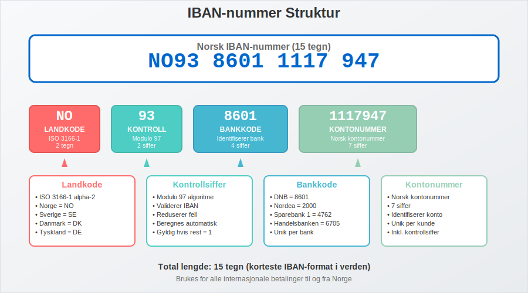
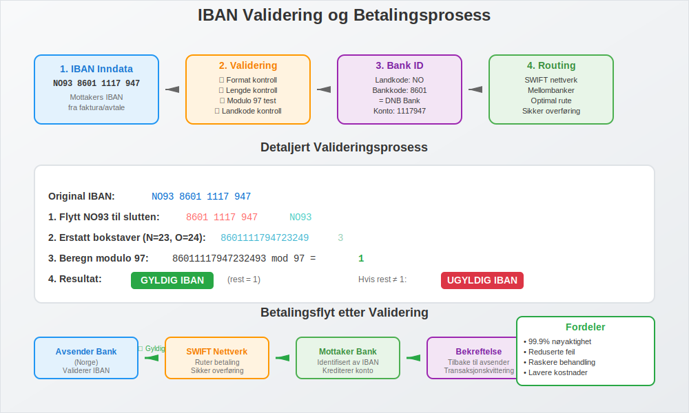
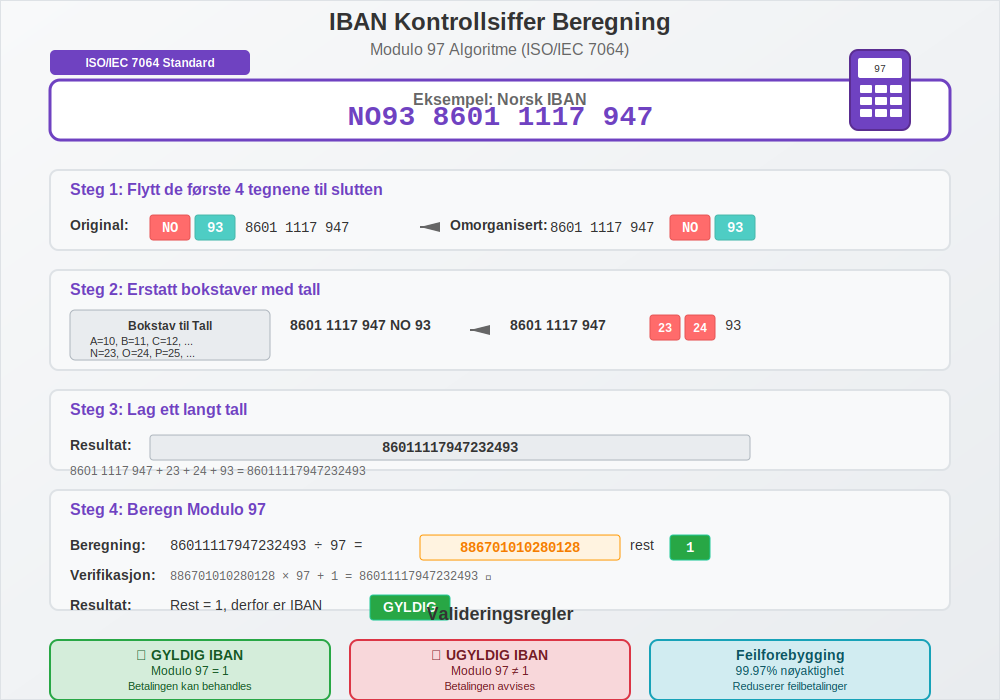
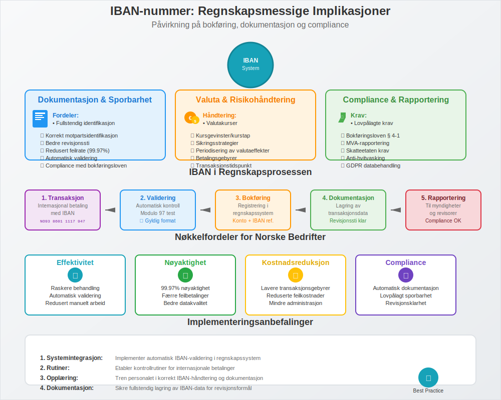

---
title: "Hva er IBAN-nummer?"
seoTitle: "Hva er IBAN-nummer? | Norsk IBAN forklart"
description: 'IBAN-nummer (International Bank Account Number) er en internasjonal standard for å identifisere bankkonti ved grenseoverskridende betalinger. Her forklares oppbygning av norske IBAN, bruk i betalinger og forskjellen fra BIC.'
summary: "Lær hva IBAN-nummer er, hvordan norske IBAN er bygget opp, og hvordan du bruker IBAN ved internasjonale betalinger."
---

**IBAN-nummer** (International Bank Account Number) er en internasjonal standard som brukes for å identifisere bankkonti ved grenseoverskridende betalinger og finansielle transaksjoner. For norske bedrifter som driver med internasjonal handel, er forståelse av IBAN-numre essensielt for korrekt håndtering av [banktransaksjoner](/blogs/regnskap/hva-er-banktransaksjoner "Hva er Banktransaksjoner? Komplett Guide til Registrering og Bokføring") og [internasjonale betalinger](/blogs/regnskap/hva-er-betalingsmidler "Hva er Betalingsmidler? Tvungne, Elektroniske og Tradisjonelle Metoder").

IBAN-nummeret fungerer som en standardisert måte å identifisere bankkonti på tvers av landegrenser og er uunnværlig for korrekt [bokføring av internasjonale transaksjoner](/blogs/regnskap/hva-er-bankavstemming "Hva er Bankavstemming? Komplett Guide til Avstemming av Bankkonti") og oppfyllelse av regnskapsmessige krav.

## Hva er IBAN-nummer?

IBAN-nummer står for **International Bank Account Number** og er en internasjonal standard (ISO 13616) som ble utviklet for å forenkle og standardisere internasjonale betalinger. Denne koden er en unik identifikator som sikrer at internasjonale betalinger når frem til riktig bankkonto hos riktig mottaker.

### IBAN-nummerets Struktur

Et IBAN-nummer består av **opptil 34 tegn** og er bygget opp som følger:

| Posisjon | Lengde | Beskrivelse | Norsk Eksempel |
|----------|--------|-------------|----------------|
| 1-2 | 2 tegn | **Landkode** - ISO 3166-1 alpha-2 | NO |
| 3-4 | 2 siffer | **Kontrollsiffer** - For validering | 93 |
| 5-8 | 4 siffer | **Bankkode** - Identifiserer banken | 8601 |
| 9-15 | 7 siffer | **[Kontonummer](/blogs/regnskap/hva-er-kontonummer "Hva er Kontonummer? Komplett Guide til Norske Bankkontonummer")** - Identifiserer kontoen | 1117947 |

### Norske IBAN-numre

Norge har **15-sifret IBAN-numre** som følger et fast mønster. Her er strukturen for norske IBAN-numre:

| Bank | Bankkode | Eksempel IBAN | Forklaring |
|------|----------|---------------|------------|
| DNB | 8601 | NO93 8601 1117 947 | DNB Bank ASA |
| Nordea | 2000 | NO53 2000 1234 567 | Nordea Bank Norge ASA |
| Sparebank 1 | 4762 | NO76 4762 1234 567 | Sparebank 1 SR-Bank |
| Handelsbanken | 6705 | NO12 6705 1234 567 | Svenska Handelsbanken |

## IBAN-nummerets Rolle i Internasjonale Betalinger

IBAN-numre er fundamentale for **SEPA-betalinger** (Single Euro Payments Area) og andre internasjonale betalingssystemer. For norske bedrifter betyr dette sikker og sporbar overføring av [betalingsmidler](/blogs/regnskap/hva-er-betalingsmidler "Hva er Betalingsmidler? Tvungne, Elektroniske og Tradisjonelle Metoder") på tvers av landegrenser.

### Hvordan IBAN-numre Fungerer i Praksis

Når en norsk bedrift skal sende en internasjonal betaling med IBAN, skjer følgende prosess:

1. **Validering**: IBAN-nummeret valideres ved hjelp av kontrollsifrene
2. **Identifikasjon**: Landkode og bankkode identifiserer mottakers bank
3. **Routing**: Betalingen rutes til riktig bank og konto
4. **Levering**: Betalingen ankommer mottakers spesifikke bankkonto
5. **Konfirmasjon**: Bekreftelse sendes tilbake til avsender

Dette systemet sikrer at [banktransaksjoner](/blogs/regnskap/hva-er-banktransaksjoner "Hva er Banktransaksjoner? Komplett Guide til Registrering og Bokføring") kan spores og dokumenteres korrekt for regnskapsformål.

## IBAN-nummer vs. BIC-kode - Forskjeller og Sammenheng

Mens **IBAN-nummeret** identifiserer den spesifikke kontoen, identifiserer **[BIC-koden](/blogs/regnskap/hva-er-bic-kode "Hva er BIC-kode? Komplett Guide til Bank Identifier Code i Norge")** banken. Begge er ofte nødvendige for internasjonale betalinger:

| Aspekt | IBAN-nummer | BIC-kode |
|--------|-------------|----------|
| **Formål** | Identifiserer spesifikk bankkonto | Identifiserer bank/finansinstitusjon |
| **Lengde** | Opptil 34 tegn (15 i Norge) | 8 eller 11 tegn |
| **Struktur** | Landkode + Kontrollsiffer + Bankkode + Kontonummer | Bankkode + Landkode + Stedkode + Filialkode |
| **Eksempel** | NO93 8601 1117 947 | DNBANOKKXXX |
| **Validering** | Innebygd kontrollsiffer-algoritme | Ingen innebygd validering |

### Praktisk Anvendelse

For en komplett internasjonal betaling trenger du ofte:

* **IBAN-nummer** for å identifisere mottakers spesifikke konto
* **[BIC-kode](/blogs/regnskap/hva-er-bic-kode "Hva er BIC-kode? Komplett Guide til Bank Identifier Code i Norge")** for å identifisere mottakers bank
* **Betalingsreferanse** for korrekt [avstemming](/blogs/regnskap/hva-er-avstemming "Hva er Avstemming? Komplett Guide til Regnskapsmessig Avstemming")

## IBAN-validering og Kontrollsiffer

En av de viktigste fordelene med IBAN-systemet er den innebygde **valideringsmekanismen** som reduserer feil i internasjonale betalinger betydelig.

### Hvordan IBAN-validering Fungerer

IBAN-validering bruker **modulo 97-algoritmen** (ISO/IEC 7064):

1. **Flytt** de fire første tegnene til slutten av IBAN-nummeret
2. **Erstatt** bokstaver med tall (A=10, B=11, C=12, osv.)
3. **Beregn** resten når tallet deles på 97
4. **Gyldig IBAN** hvis resten er 1

### Eksempel på IBAN-validering

For norsk IBAN NO93 8601 1117 947:

| Steg | Handling | Resultat |
|------|----------|----------|
| 1 | Flytt NO93 til slutten | 86011117947NO93 |
| 2 | Erstatt N=23, O=24 | 860111179472324 93 |
| 3 | Beregn modulo 97 | 860111179472324 93 mod 97 = 1 |
| 4 | Validering | Gyldig (rest = 1) |

## Regnskapsmessige Implikasjoner av IBAN-numre

For norske bedrifter har IBAN-numre flere viktige regnskapsmessige implikasjoner som påvirker både [bokføring](/blogs/regnskap/hva-er-regnskap "Hva er Regnskap? En Komplett Innføring i Norsk Regnskapsføring") og [internkontroll](/blogs/regnskap/hva-er-attestering "Hva er Attestering? En Komplett Guide til Bilagsbehandling og Godkjenning").

### Dokumentasjon og Sporbarhet

IBAN-numre bidrar til:

* **Fullstendig identifikasjon** av mottakers bankkonto
* **Redusert feilrate** i internasjonale betalinger
* **Bedre sporbarhet** av transaksjoner for revisjonsformål
* **Korrekt identifikasjon** av motparter i regnskapet
* **Overholdelse** av bokføringslovens krav til dokumentasjon

### Valutahåndtering og Internasjonale Transaksjoner

Ved internasjonale betalinger med IBAN-numre må bedrifter håndtere:

* **Valutakurser** på transaksjonstidspunktet
* **Kursgevinster og kurstap** i regnskapet
* **Sikringsstrategier** for valutarisiko
* **Periodisering** av valutaeffekter
* **Betalingsgebyrer** og deres regnskapsmessige behandling

### MVA og Grenseoverskridende Tjenester

Ved bruk av IBAN for betaling av [fjernleverbare tjenester](/blogs/regnskap/hva-er-fjernleverbare-tjenester "Hva er Fjernleverbare Tjenester i Regnskap? MVA-regler og Bokføring") må bedrifter være oppmerksomme på:

* **MVA-regler** for grenseoverskridende levering
* **Dokumentasjonskrav** for MVA-fritak
* **Rapportering** til norske myndigheter

## IBAN-numre i Norsk Banksektor

Den norske banksektoren har implementert IBAN-numre som en integrert del av det internasjonale betalingssystemet. Dette påvirker hvordan norske bedrifter håndterer [bankinnskudd](/blogs/regnskap/hva-er-bankinnskudd "Hva er Bankinnskudd? Typer, Renter og Regnskapsføring") og internasjonale transaksjoner.

### Norske IBAN-standarder

Norske IBAN-numre følger et konsistent mønster:

* **Landkode**: Alltid "NO" for Norge
* **Kontrollsiffer**: Beregnet etter modulo 97-algoritmen
* **Bankkode**: 4-sifret kode som identifiserer banken
* **Kontonummer**: 7-sifret norsk kontonummer

### Implementering i Norske Betalingssystemer

Norske banker har integrert IBAN-numre i:

* **Nettbanktjenester** for privatpersoner og bedrifter
* **[BankGiro](/blogs/regnskap/hva-er-bankgiro "Hva er BankGiro? Komplett Guide til Norsk Betalingssystem")**-systemet for internasjonale betalinger
* **Regnskapssystemer** for automatisk bokføring
* **Rapporteringssystemer** for myndighetskrav

## IBAN-numre i Ulike Land

IBAN-systemet brukes i **77 land** verden over, med varierende lengde og struktur. Her er noen eksempler:

| Land | IBAN-lengde | Eksempel | Særtrekk |
|------|-------------|----------|----------|
| **Norge** | 15 tegn | NO93 8601 1117 947 | Kort og effektiv |
| **Tyskland** | 22 tegn | DE89 3704 0044 0532 0130 00 | Lang og detaljert |
| **Frankrike** | 27 tegn | FR14 2004 1010 0505 0001 3M02 606 | Inkluderer RIB-kode |
| **Storbritannia** | 22 tegn | GB29 NWBK 6016 1331 9268 19 | Sortcode + kontonummer |
| **Sverige** | 24 tegn | SE45 5000 0000 0583 9825 7466 | Clearingnummer + konto |

### SEPA-området og IBAN

**SEPA** (Single Euro Payments Area) omfatter 36 land og krever IBAN for alle betalinger. Norge er medlem av SEPA, noe som betyr:

* **Standardiserte betalinger** innen SEPA-området
* **Lave kostnader** for EUR-betalinger
* **Rask behandling** av betalinger
* **Ensartede regler** for [betalingstjenester](/blogs/regnskap/betalingstjeneste "Hva er betalingstjeneste? Komplett Guide til Betalingstjenester i Norge")

## Praktiske Råd for Bedrifter

For norske bedrifter som håndterer internasjonale transaksjoner med IBAN-numre, er det viktig å etablere gode rutiner:

### Beste Praksis for IBAN-håndtering

* **Valider alltid IBAN-numre** før du sender betalinger
* **Bruk automatisk validering** i regnskapssystemer
* **Oppbevar dokumentasjon** av alle internasjonale transaksjoner
* **Implementer kontrollrutiner** for å unngå feil i IBAN-numre
* **Tren personalet** i korrekt bruk av IBAN-numre

### Vanlige Feil og Hvordan Unngå Dem

De mest vanlige feilene ved bruk av IBAN-numre inkluderer:

1. **Feil IBAN-nummer**: Kan føre til forsinkede eller returnerte betalinger
2. **Manglende IBAN-nummer**: Kan resultere i ekstra gebyrer eller avvist betaling
3. **Feil formatering**: Mellomrom eller bindestreker på feil steder
4. **Utdaterte IBAN-numre**: Kontoer kan endres ved bankskifter

### Kontrollrutiner for IBAN-numre

Etabler følgende kontrollrutiner:

* **Automatisk IBAN-validering** i betalingssystemer
* **Dobbel verifikasjon** av IBAN-numre før betaling
* **Regelmessig oppdatering** av mottakerdatabase
* **[Attestering](/blogs/regnskap/hva-er-attestering "Hva er Attestering? En Komplett Guide til Bilagsbehandling og Godkjenning")** av internasjonale betalinger
* **Oppfølging** av betalingsstatus

## IBAN og Digitalisering

IBAN-systemet utvikler seg kontinuerlig for å møte nye krav i det digitale finanssystemet. Viktige utviklingstrender inkluderer:

### Teknologiske Innovasjoner

* **API-integrasjoner** for sanntids IBAN-validering
* **Automatisk IBAN-generering** fra kontonumre
* **QR-koder** med innebygd IBAN-informasjon
* **Blockchain-teknologi** for økt sikkerhet og sporbarhet

### Regulatoriske Endringer

* **PSD2-direktivet** og åpen bankvirksomhet
* **Økt rapporteringskrav** for internasjonale transaksjoner
* **Strengere KYC-krav** (Know Your Customer)
* **Anti-hvitvasking** regulering
* **GDPR-compliance** for databehandling

## Fremtiden for IBAN-systemet

IBAN-systemet står overfor flere utviklingstrender som vil påvirke hvordan norske bedrifter håndterer internasjonale betalinger:

### Utvidelse og Standardisering

* **Flere land** adopterer IBAN-standarden
* **Forbedret validering** og feildeteksjon
* **Integrering** med nye betalingsteknologier
* **Harmonisering** av internasjonale betalingsstandarder

### Digitale Betalingsløsninger

* **Instant payments** med IBAN-identifikasjon
* **Mobile betalinger** med IBAN-integrasjon
* **Kryptovaluta-broer** til tradisjonelle IBAN-systemer
* **AI-drevet** betalingsoptimalisering

## Konklusjon

IBAN-numre er en fundamental komponent i det moderne internasjonale finanssystemet og spiller en kritisk rolle for norske bedrifter som driver med grenseoverskridende handel. Korrekt forståelse og anvendelse av IBAN-numre sikrer:

* **Effektive internasjonale betalinger** med redusert feilrate
* **Korrekt regnskapsføring** av internasjonale transaksjoner
* **Overholdelse** av regulatoriske krav
* **God internkontroll** og sporbarhet
* **Kostnadseffektive** grenseoverskridende betalinger

For bedrifter som ønsker å optimalisere sin håndtering av internasjonale betalinger, er det essensielt å etablere robuste rutiner for IBAN-numre som en del av den overordnede [bankavstemming](/blogs/regnskap/hva-er-bankavstemming "Hva er Bankavstemming? Komplett Guide til Avstemming av Bankkonti") og regnskapsprosessen.

Ved å følge beste praksis og holde seg oppdatert på utviklingen innen IBAN-systemet, kan norske bedrifter sikre smidig og sikker håndtering av sine internasjonale finansielle transaksjoner. Kombinert med korrekt bruk av [BIC-koder](/blogs/regnskap/hva-er-bic-kode "Hva er BIC-kode? Komplett Guide til Bank Identifier Code i Norge"), gir IBAN-numre et solid fundament for moderne internasjonal betalingshåndtering.

